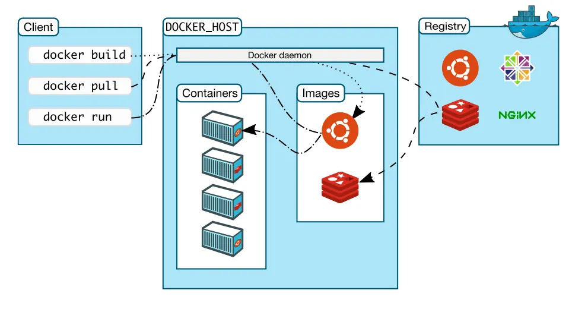

## Objectives

- Grasp **why Docker uses its own layered, client-server design**.  
- Understand **how the Docker Daemon manages lifecycle, storage, networking, and security**.  
- See **how the CLI/API interacts with the daemon and what extensions exist**.  
- Apply knowledge to design **secure, performant, and maintainable Docker setups**.  

---

## 1. What is Docker?



Docker is a **platform for packaging applications and their dependencies** into lightweight, portable units known as **containers**. These containers run consistently across different environments, whether on a developer’s laptop, a test server, or in production.

Key characteristics of Docker containers:

- **Lightweight**: Containers share the host operating system kernel, avoiding the heavy resource costs of full virtual machines.  
- **Portable**: A Docker container bundles everything the application needs to run—libraries, runtime, tools, and code.  
- **Consistent**: By using container images, developers and operations teams can avoid the common problem of "it works on my machine".  

---

## 2. Key Components at a Glance

- **Docker Client (CLI or API)** – user interface to send commands.  
- **Docker Daemon (`dockerd`)** – manages containers, images, networks, and volumes.  
- **Images & Registries** – templates for containers, stored in Docker Hub or private registries.  
- **Containers** – runnable instances of images.  
- **Networks & Volumes** – enable communication and persistent storage.  

---

## 3. Why a Distinct Architecture?

### 3.1 Isolation & Security

Namespaces and cgroups enforce resource separation and process isolation.  

### 3.2 Portability

Layered images encapsulate everything, ensuring consistency across environments.  

### 3.3 Efficiency

Shared kernel model reduces overhead, enabling faster startup and better density than VMs.  

---

## 4. The Client-Server Model of Docker

- **Docker Client**: Sends commands via REST API.  
- **Docker Daemon**: Executes requests, manages containers and images.  
- **REST API**: Standard communication layer.  
- **Registries**: Store and distribute images.  

### 4.1 Client–Server Paradigm

- Client issues commands (`docker run`, `docker build`).  
- Daemon listens for API requests and orchestrates resources.  

### 4.2 Communication Channels

- **Unix socket**: `/var/run/docker.sock` (local).  
- **TCP socket**: `tcp://hostname:2376` (remote, secured with TLS).  

### 4.3 REST API Endpoints

- `POST /containers/create` → create container  
- `GET /containers/json` → list containers  
- `POST /images/create` → pull image  

### 4.4 Use Cases

- Local development (client & daemon on same host).  
- Remote management (laptop client ↔ server daemon).  
- Orchestration (Swarm, Kubernetes).  

---

## 5. The Role of the Docker Daemon

### 5.1 Core Responsibilities

- **Container lifecycle**: create, start, stop, remove.  
- **Image management**: build, pull, push, tag, prune.  
- **Network drivers**: bridge, overlay, host, macvlan.  
- **Storage drivers**: overlay2 (default), aufs, devicemapper, btrfs.  

### 5.2 Configuration & Startup

- Managed via **systemd unit** or manual invocation.  
- Example: `dockerd --config-file /etc/docker/daemon.json`

  ```json
  {
      "hosts": ["unix:///var/run/docker.sock", "tcp://0.0.0.0:2376"],
      "storage-driver": "overlay2",
      "tls": true,
      "tlsverify": true,
      "tlscacert": "/etc/docker/ca.pem",
      "tlscert": "/etc/docker/server-cert.pem",
      "tlskey": "/etc/docker/server-key.pem"
  }
  ```

### 5.3 Security Modes

* **Rootful vs Rootless Daemon**: rootless mode increases safety.
* **TLS Authentication**: ensures only authorized clients connect.

### 5.4 Monitoring & Logs

* **Event stream**: `docker events` for real-time monitoring.
* **Metrics**: cgroups or exporters (Prometheus, Grafana).

---

## 6. CLI/API Interaction and Extensions

### 6.1 Common Commands & Flags

```bash
docker run --rm -d -p 80:80 nginx:latest
docker build -t myapp:1.0 .
docker push myregistry.com/myapp:1.0
docker volume create data-vol
```

### 6.2 How It Works Under the Hood

1. User types `docker <command>`.
2. CLI parses flags and builds an HTTP request.
3. Request sent to daemon’s API endpoint.
4. Daemon executes and streams JSON-encoded progress/events back to CLI.

### 6.3 Client Extensions & Plugins

* **Buildx**: advanced multi-architecture builds.
* **Compose plugin**: `docker compose up`.
* **Third-party tools**: Portainer, Rancher, custom UIs using the same API.

### 6.4 Environment Variables

* `DOCKER_HOST`: change socket/host.
* `DOCKER_TLS_VERIFY=1` & `DOCKER_CERT_PATH`: secure remote connections.

---

## 7. Designing Secure, Performant, and Maintainable Setups

### 7.1 Secure Access

* Limit socket permissions:

  ```bash
  chmod 660 /var/run/docker.sock
  ```
  
* Always use TLS mutual authentication for remote APIs.

### 7.2 Resource Constraints

* Example flags:

  * `--memory`
  * `--cpus`
  * `--cpuset-cpus`
  * `--pids-limit`
* Prevents “noisy neighbor” problems in shared environments.

### 7.3 Networking Strategies

* **Bridge networks**: simple single-host setups.
* **Overlay networks**: multi-host communication.
* **IPv6**: custom driver configurations.

### 7.4 Storage & Performance

* Use **overlay2** for stability and performance.
* Prefer **named volumes** or **bind mounts** for persistent data.

### 7.5 Scalability & Orchestration

* **Single host**: `docker-compose`.
* **Multi-host**: Swarm or Kubernetes, orchestrating multiple daemons.

---

## 8. Summary

Docker’s **layered client-server architecture** combines:

* **Isolation & Security** through namespaces, cgroups, TLS, rootless mode.
* **Portability** with layered images and registries.
* **Efficiency** by sharing the kernel and optimizing resources.
* **Daemon Management** of lifecycle, storage, networking, and monitoring.
* **CLI/API Interaction** as a REST-based workflow.
* **Best Practices** for security, performance, and scalability.

---

## 9. Key Takeaways for Learners

* Docker solves the “it works on my machine” problem.
* The **daemon is the core engine** managing containers, images, networking, and storage.
* The **CLI/API → Daemon → Registry/Container workflow** enables automation and extensibility.
* Security (TLS, rootless mode, socket permissions) is critical in production.
* Resource constraints, proper networking, and orchestration make setups stable and scalable.
