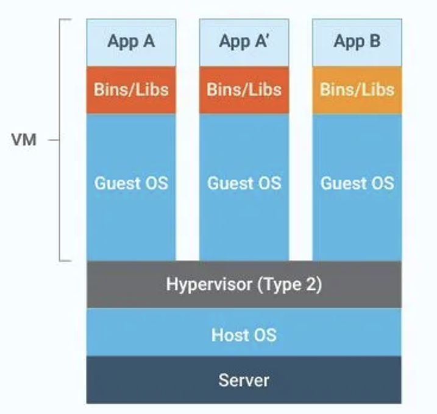
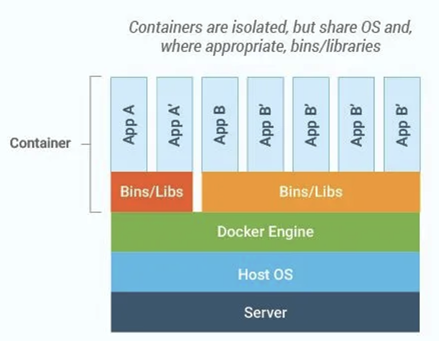

## Learning Objectives

By the end of this lesson, learners will be able to:

- **Define** the concepts of Virtual Machines (VMs) and Containers (Docker).
- **Explain** the architectural differences between hypervisor-based virtualization and containerization.
- **Compare** resource usage, start-up times, isolation level, and security considerations.
- **Identify** appropriate use cases for VMs vs. Docker containers.
- **Perform** basic hands-on tasks: launching a VM and running a Docker container.

---

## 1. Introduction: What is Virtualization?

**Virtualization** is the process of running one or more simulated “machines” on a single physical host. This technology allows efficient use of hardware resources by abstracting them into multiple independent computing environments.

Key components of virtualization:

- **Host OS**: The real operating system installed on physical hardware.
- **Hypervisor (Virtual Machine Monitor, VMM)**: Software that allocates CPU, memory, and I/O resources to guest systems.
- **Guest OS**: A full operating system running inside each Virtual Machine.

---

## 2. Virtual Machines (VMs)

### 2.1 Architecture



### 2.2 How It Works

1. The hypervisor reserves CPU, memory, and disk resources.
2. Each VM boots a full guest OS, including its kernel and user space.
3. Isolation is achieved at the hardware level through virtualized devices.

### 2.3 Pros & Cons

| **Pros** | **Cons** |
|----------|-----------|
| ✔️ Full isolation with separate kernels | ⏱️ Slow boot times (minutes) |
| ✔️ Can run any OS (Windows, Linux, BSD) | 💾 High resource overhead (RAM, storage) |
| ✔️ Mature ecosystem and security tools | 🔧 Management complexity with many VMs |

---

## 3. Docker Containers

### 3.1 Architecture



### 3.2 How It Works

1. The Docker daemon leverages **namespaces** (for process, network, and mount isolation) and **cgroups** (for resource allocation).
2. Containers share the host kernel but package their own application and required dependencies.
3. Images are layered and reusable—only changed layers are stored, making distribution efficient.

### 3.3 Pros & Cons

| **Pros** | **Cons** |
|----------|-----------|
| ✔️ Starts in less than a second | 🔐 Weaker isolation (shared kernel) |
| ✔️ Lightweight and resource-efficient | 🐧 Kernel compatibility required (Linux-based) |
| ✔️ Portable images via registries (Docker Hub) | ⚙️ Security depends on proper configuration |
| ✔️ Ideal for CI/CD pipelines due to layered builds | 🔄 Cannot run Windows apps on Linux hosts (and vice versa) |

---

## 4. Comparison: VMs vs. Docker

| Feature                | Virtual Machine             | Docker Container             |
| ---------------------- | --------------------------- | ---------------------------- |
| **Isolation Level**    | Hardware (separate kernel per VM) | OS-level (namespaces & cgroups) |
| **Boot Time**          | Minutes                     | Seconds or milliseconds      |
| **Resource Footprint** | High (full OS per VM)       | Low (shared kernel)          |
| **Portability**        | VM formats (OVA, VMDK)      | Docker images (OCI standard) |
| **Scalability**        | Limited by boot & overhead  | Very high, works with orchestrators |
| **Security**           | Strong, well-understood     | Evolving, requires hardening |

---

## 5. Performance

- **Virtual Machines**: Simulate virtual hardware, leading to overhead in CPU and I/O operations.
- **Containers**: Run directly on the host kernel, achieving near bare-metal performance.

---

## 6. Security Considerations

- **VMs**:
  - Each guest OS is fully isolated.
  - Hypervisor vulnerabilities are rare but possible.
- **Containers**:
  - A compromised kernel can affect all containers.
  - Use Linux security frameworks like **SELinux**, **AppArmor**, and rootless Docker for hardening.

---

## 7. Networking

- **VMs**: Use virtual NICs managed by the hypervisor. Options include NAT, bridged, or host-only networking.
- **Containers**:
  - Use Docker networks (bridge, host, overlay).
  - Built-in DNS resolution.
  - Fine-grained micro-segmentation for microservices.

---

## 8. Storage

- **VMs**: Use virtual disk images (qcow2, VDI, VMDK). Full snapshots are supported.
- **Containers**: Use layered images and copy-on-write storage. Volumes provide persistent data storage.

---

## 9. Use Cases

### Virtual Machines

- Running multiple different operating systems on the same host.
- Supporting legacy applications that require a full OS environment.
- Workloads with strict isolation and compliance requirements (e.g., finance, PCI workloads).

### Docker Containers

- Microservices architectures (one service per container).
- Continuous Integration/Continuous Deployment pipelines (fast build and test cycles).
- Lightweight and ephemeral dev/test environments.
- Large-scale distributed systems and orchestration with Kubernetes.

---

## 10. Key Takeaways

- **VMs** provide strong isolation, support for multiple OS types, but come with higher overhead and slower start-up times.
- **Docker containers** are lightweight, fast, and portable, but rely on the host’s kernel and need additional security hardening.
- The choice between VMs and Containers depends on workload requirements:
  - If you need **strict isolation and OS flexibility**, use VMs.
  - If you need **speed, scalability, and efficiency**, use Containers.

---

## 11. Hands-On Practice

1. **Launch a Virtual Machine**:
   - Install VirtualBox or VMware.
   - Create a VM and install a guest OS (e.g., Ubuntu).
   - Explore system resources and networking setup.
2. **Run a Docker Container**:
   - Install Docker.
   - Run `docker run hello-world` to verify installation.
   - Launch a containerized app:  

     ```bash
     docker run -d -p 8080:80 nginx:latest
     ```

   - Stop and remove containers using Docker CLI.

---

## 12. Further Reading

- [Docker Documentation](https://docs.docker.com/)
- [KVM & QEMU Virtualization Guide](https://jamesnorth.net/post/qemu-guide)
- [CNCF Cloud Native Landscape](https://github.com/cncf/landscape)
- [VMware vSphere Documentation](https://www.vmware.com/products/cloud-infrastructure/vsphere/resources)
