## Managing Linux Processes

During this lesson, you will learn how to:

- Define a process in Linux
- Describe basic commands for process management
- Compare the `at` and `cron` commands for job scheduling

### Programs

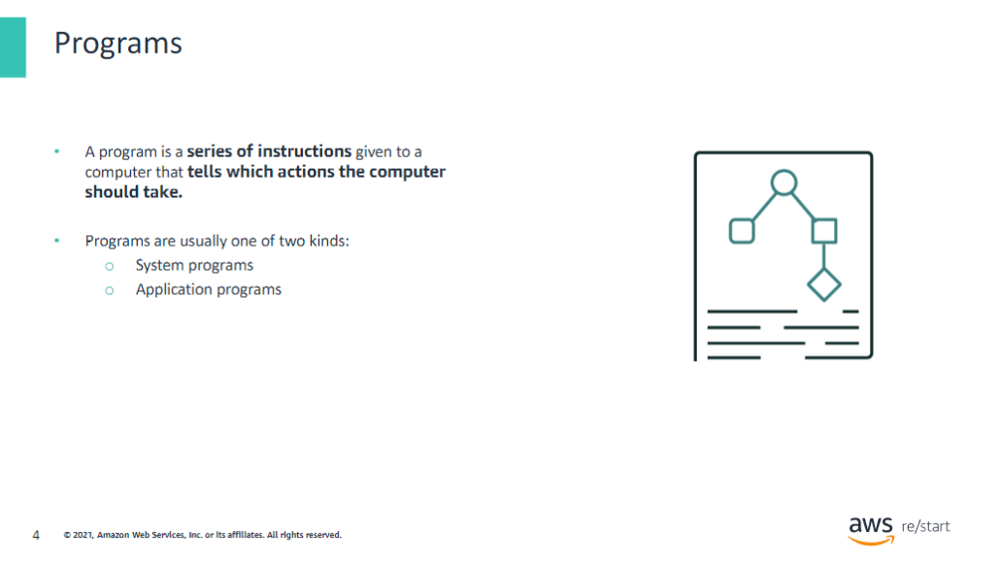

Prior to covering what a process is, you must understand what a program is. Programs are instructions given to the computer to indicate which actions the computer should take. There are two kinds of programs: system and application.

A **system program** has the following attributes:

- Primal computer functions
- Operating system commands
- Usually do not interface with the computer user

Utility programs are examples of system programs.

An **application program** has the following attributes:

- Comprehensive program that performs a specific function
- Can be used by a user or another program

Word processors, database management, and games are examples of application programs.

The following are the two major differences between system and application programs:

- A system program is a native computer function.
- An application program is added to the computer.

#### How a program is found

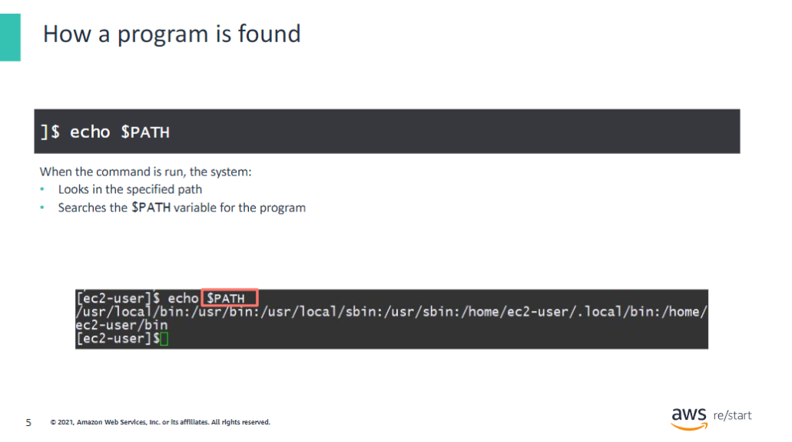

When a command is run, the system searches the `$PATH` variable for the executable file for the program corresponding to the command. When the executable is found, the system loads the file into memory, schedules running time for it on the processor, and assigns it a process ID number (PID). Most process administration is done by using this PID.

#### What is a process?

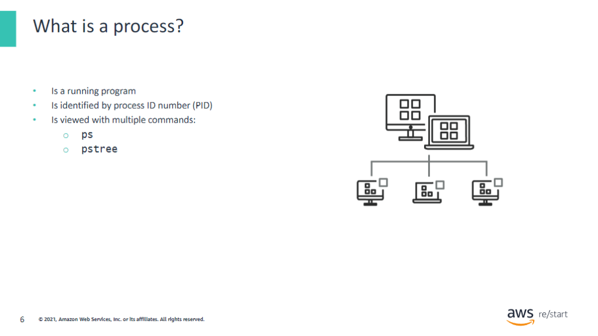

Processes found in a Linux system include services started by the operating system and programs started by individual users. Process ID numbers are used to identify an active process that usually looks like a string of numbers, such as the following: 31532.

You can view these processes with a few commands, such as `ps` and `pstree`. The main difference between `ps` and `pstree` is that `ps` is shown in a list view, and `pstree` is shown in a tree view. Both commands show running processes in Linux.

#### States of a process

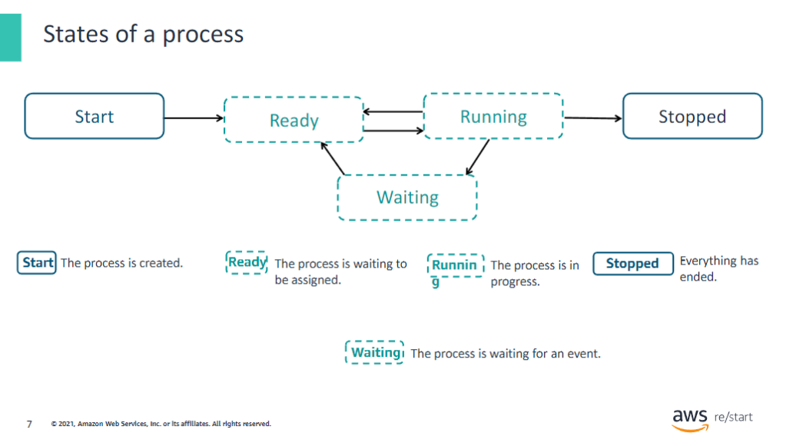

When a process runs, it can cycle through various states:

1. **Start**: The process is created.
2. **Ready**: The process is waiting to be assigned processor time.
3. **Running**: The process is in progress.
4. **Waiting**: The process is waiting for an event.
5. **Stopped**: The process is finished running.

#### What is a child process

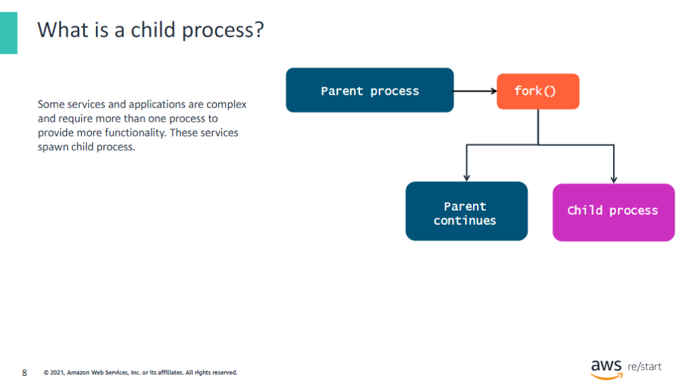

Some services and applications are complex and require more than one process to provide more functionality. These services spawn child processes. Child processes can also be known as sub-processes. Often, child processes inherit most of the attributes of the parent process.

## Basic commands for process management

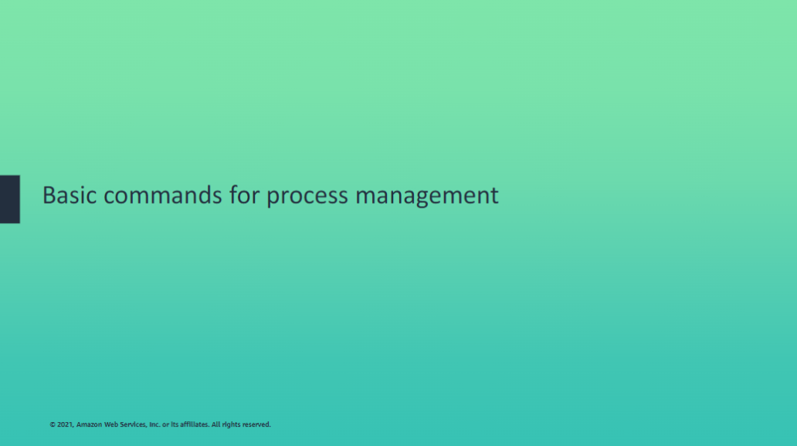

### The `ps` command

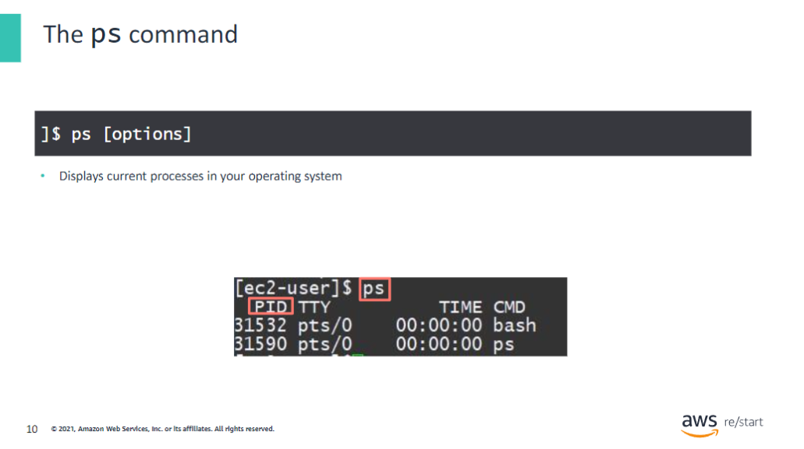

#### What is the `ps` command?

The `ps` (process status) command gives an overview of the current processes running in your operating system (OS). Within this overview, it displays information on the active process that includes the following:

- **Process ID (PID)**
- **Terminal type (TTY)** that the user is using
- **Time** that the process has been running
- **Command (CMD)**, which is the name of the command that launched the process

You can use the syntax `ps [options]` to filter the information of the active processes.

#### Why would you want to use the `ps` command?

Linux is good at running multiple processes at one time. As a user, you might need to understand what processes are running, how long a process has been running, and what PID a process is under. This information can be useful for troubleshooting purposes to save time and effort.

#### Example syntax

- `ps –ef | grep sshd` -> Use the `grep` option to filter an exact process. In this example, find the `sshd` process in the `ps` output. If you have multiple running processes, which can be pages long, you can use this command to filter to find an exact process.
- `ps -ef | less` -> You can use the `less` option to display all processes in a page-by-page format.

#### How to display all processes

- `ps –ef` -> Don’t use any option to display all processes.

#### Common `ps` command options

The previous slide touched on the idea that you would use the `ps` command to identify current processes and troubleshoot. When troubleshooting using the `ps` command, there are a few most commonly used commands and options.

#### Commands and options

- `ps -e` -> Displays every current process. `-A` is an identical option.
- `ps -a` -> Displays all processes not associated with a terminal. The `-T` option displays all processes related to the terminal.
- `ps -r` -> Restricts to running processes only.
- `ps -ef` -> Views in full-format listing.
- `ps -fp <number>` -> Lists processes by PID.
- `ps L` -> Lists all format specifiers.

### The `pidof` command

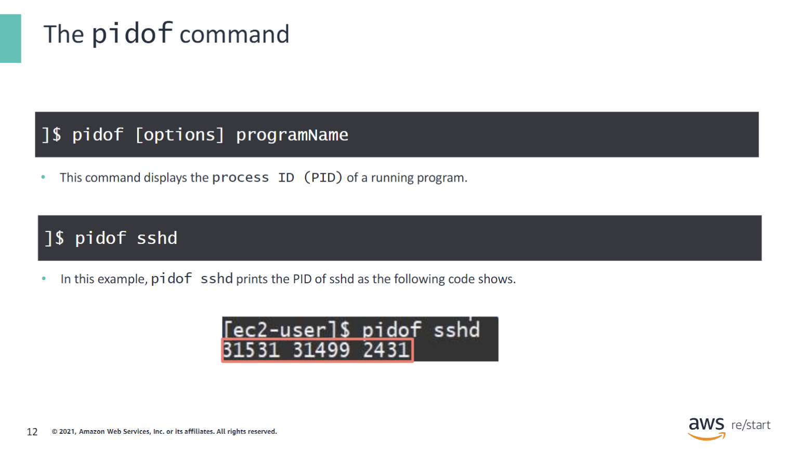

#### What is the `pidof` command?

The `pidof` command shows the PID of the current running program. It is used to print the PID of a specific program. For example, `pidof sshd` will show the PID of `sshd`.

#### Why would you want to use the `pidof` command?

There are not a lot of options when using `pidof` because the use of `pidof` is almost like a set filter. Since it searches for a specific PID of a specific running program, you use it when you know exactly what you are looking for to save time.

#### Example syntax

- `pidof [program]` -> `pidof sshd` or `pidof bash`. The output will give the PID of the specified program when the command is run.

#### Options you can use with `pidof`

- `-s` -> Returns only one PID
- `-c` -> Returns only PIDs that are in the same root directory
- `-w` -> Shows processes that do not show a command line
- `-S` -> Serves as a separator that is used between PIDs

### The `pstree` command

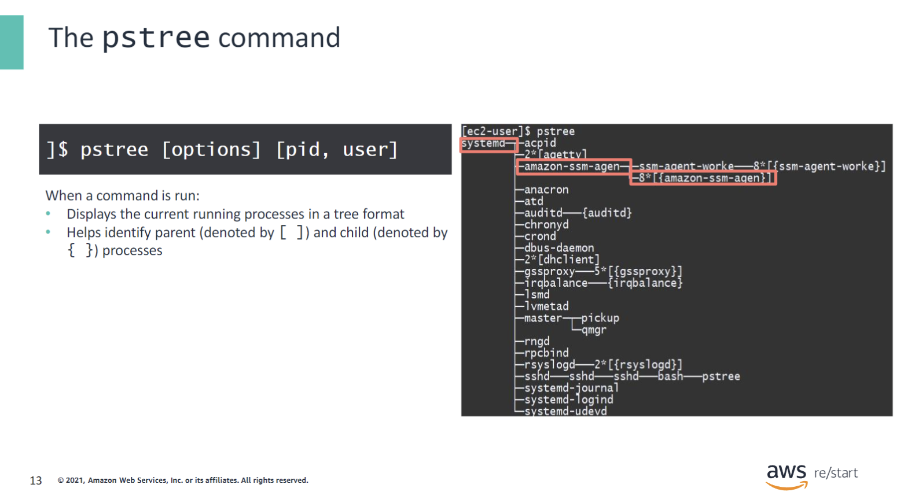

#### What is the `pstree` command?

The `pstree` command displays the current running processes in a tree format. This command merges identical branches denoted by square brackets `[ ]` and child processes that are under the parent processes denoted by curly brackets `{ }`.

#### Why would you want to use the `pstree` command?

The root of the tree will be either the process, such as `systemd` (as used in this example), or `init`. Within the given process, you can see processes in a hierarchical way to understand the output. You can also visualize parent and child processes.

#### Example syntax

- `pstree [options] [pid, user]`

This slide includes an example of how `pstree` merges identical branches. In the example on this slide:

- `systemd` is the root of the process.
- `Amazon-ssm-agent` is a process.
- The `8*` in front of `[{amazon-ssm-agent}]` indicates that there are eight `amazon-ssm-agent` processes running.
- In `[{amazon-ssm-agent}]`, the square brackets `[ ]` indicate a parent process, and the curly brackets `{ }` indicate a child process.

#### Common options you can use with `pstree`

- `-a` -> Shows arguments in the command line within the output.
- `-p` -> Shows the PID, displayed in decimal numbers inside parentheses after a process name.
- `-c` -> Expands identical subtrees (and by default, compacts the tree).
- `-n` -> Sorts by the same parent PID instead of process name.

### The `top` command

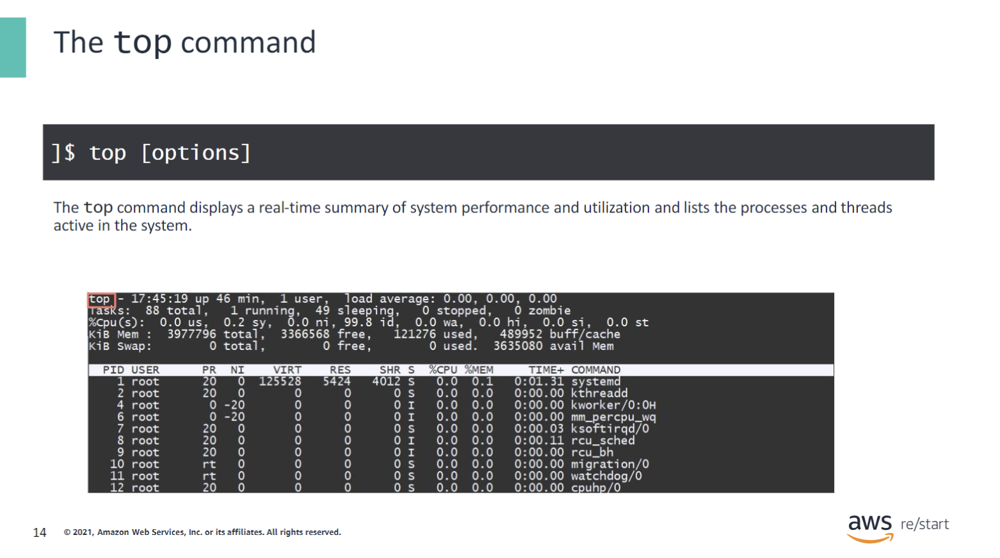

#### What is the `top` command?

The `top` command displays a real-time system summary and information of a running system. It displays information and a list of processes or threads being managed.

#### Why would you want to use the `top` command?

- It displays system summary information and a list of processes or threads that the Linux kernel is currently managing.
- It provides a limited interactive interface for process manipulation and a more extensive interface for personal configuration. It encompasses every aspect of operation.

#### Common `top` options

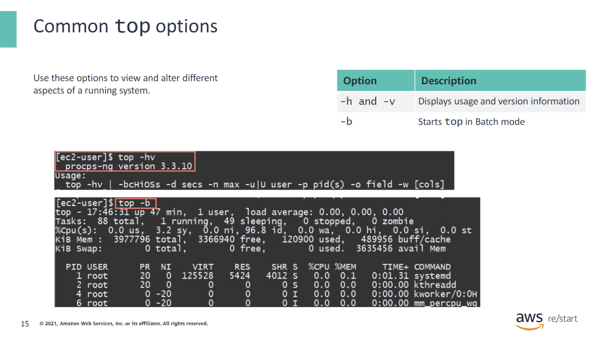

To view or alter different aspects of a running system, use `top [option]`:

- `-h, -v` -> Use these options for help and to show the version.
  - The `-h` option gives you the help section for the `top` command.
  - The `-v` option shows the library version.
- `-b` -> Use this option to start in batch mode.
  - This option starts `top` in batch mode, which is used primarily when sending output from `top` to other programs or files.

#### Task status in `top`

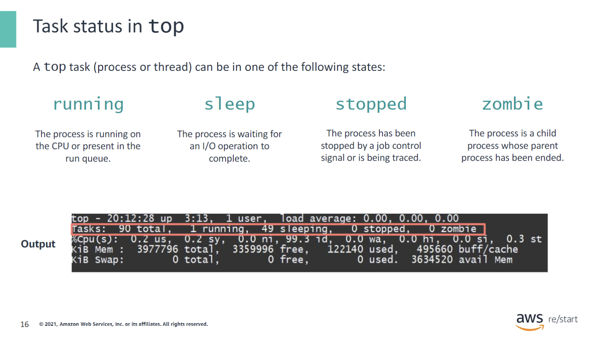

The `top` command shows tasks (processes or threads) in one of the following states:

- **Running**: A process that is actively running on the CPU or is in the run queue.
- **Sleep**: A process that is waiting for an I/O operation to complete.
- **Stopped**: A process that has been stopped by a job control signal or is being traced.
- **Zombie**: A child process whose parent process has been ended.

The output of the `top` command under `Tasks` contains this information.

#### CPU values in `top`

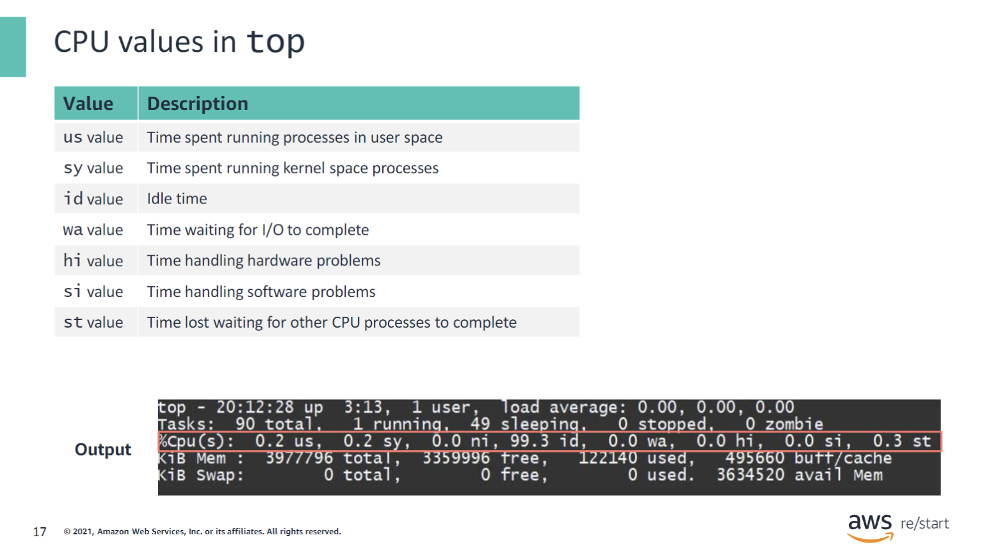

CPU values in `top` are sections that show the various CPU usages throughout the system. These are used to analyze the effectiveness of the system. It is measured in percentages based on the latest interval from the most recent refresh.

- **us**: Time spent running processes in user space.
- **sy**: Time spent running kernel space processes.
- **id**: Idle time.
- **wa**: Time waiting for I/O to complete.
- **hi**: Time handling hardware interrupts.
- **si**: Time handling software interrupts.
- **st**: Time lost waiting for other CPU processes to complete.

#### Memory use and swap in `top`

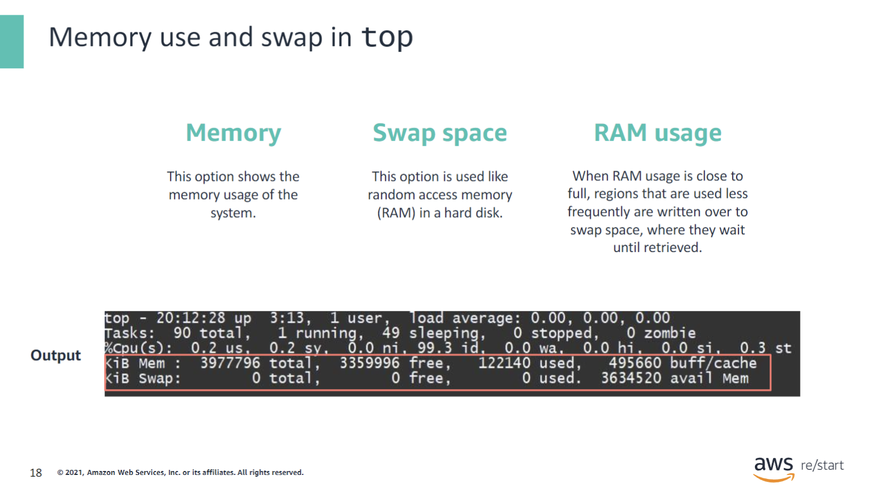

There are three major memory uses and swaps in `top`:

- **Memory**: Shows the memory usage of the system.
- **Swap space**: Used like random access memory (RAM) on a hard disk. When RAM usage gets close to full, less frequently used regions are written over to swap space, where they wait until retrieved.
- **RAM usage**: Information is viewed at the top of the page after running `top`. The value KiB stands for kibibytes, can be expressed as exbibytes (EiB) based on scaling, and can be enforced with the `-E` option.

`KiB Mem` shows the physical memory and indicates how much is free, used, and buffered or cached. `KiB Swap` shows virtual memory and indicates how much is free, used, and available (note: available memory here refers to physical memory).

The output of the `top` command under `KiB Mem` and `KiB Swap` contains this information.

### The `kill` command

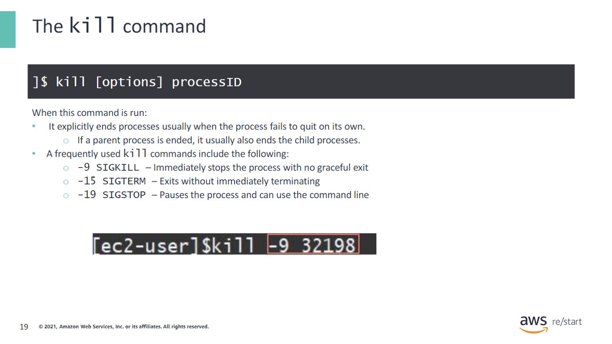

What is the `kill` command?

The `kill` command explicitly ends processes, usually when the process fails to quit on its own.

Why would you want to use the `kill` command?

If you’ve ever tried to close a program and it doesn’t respond but freezes instead, you might have used Task Manager to end the program. The `kill` command provides a similar functionality on Linux.

The following are `kill` command signals that you can use:

- `-9` (`SIGKILL`) – Stops any process immediately.
- `-15` (`SIGTERM`) – Requests the process to exit gracefully.
- `-19` (`SIGSTOP`) – Pauses the process; can be resumed using the command line.

Note that the name of the `kill` command will not be changed in the future.

### The `nice` and `renice` commands

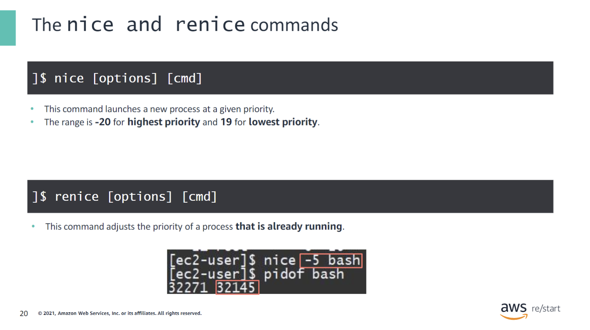

#### What is the `nice` command?

The `nice` command manages processes scheduled to run at specific times on the CPU by adjusting their scheduling priority. The highest priority for the `nice` command is -20, and the lowest priority is 19.

#### Why would you use the `nice` command?

The `nice` command helps in running programs on a schedule with certain priorities. When a program is given a high priority using `nice`, the kernel allocates more CPU resources to process that request.

#### What is the `renice` command?

The `renice` command adjusts the priority of a running process.

#### Why would you use the `renice` command?

You would use the `renice` command when you need to modify or adjust the scheduling priority of a process that is already running.

### The `jobs` command

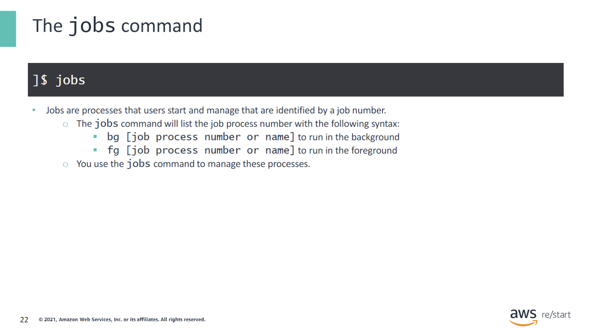

Jobs are processes that users start and manage, identified by a job number. You use the `jobs` command to manage these processes.

Jobs that run in the foreground consume the shell until they are completed. You can move jobs to the foreground with:

- `fg %jobnumber`

Jobs that run in the background continue to run while the shell becomes available for use. To move jobs to the background:

1. Suspend the job with `CTRL+Z` first.
2. Use `bg %jobnumber` to move the job to the background.

The `jobs` command lists job process numbers with the following syntax:

- `bg [job process number or name]` to run in the background
- `fg [job process number or name]` to run in the foreground

### The `at` and `cron` commands

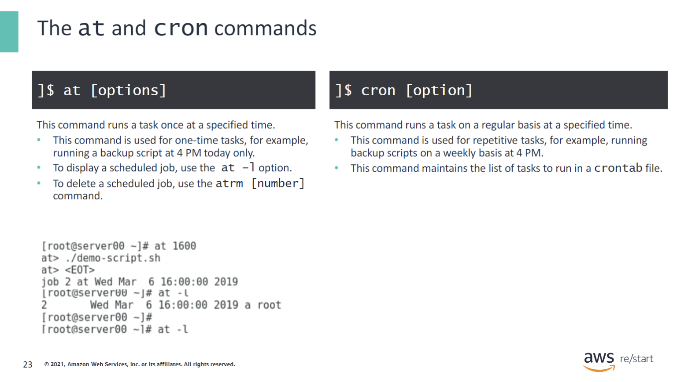

#### What are the `at` and `cron` commands?

- The `at` command is used to schedule a task to run only once at a specified time.
- The `cron` daemon is used to schedule tasks to run on a regular basis at specified times.

#### Why would you use the `at` and `cron` commands?

You can use the `at` and `cron` commands to schedule tasks. Administrators often use these commands to automate the execution of services or scripts at specified times without manual intervention.

There are also `cron` directories which are precreated and prescheduled directories where administrators can store scripts that will run at specified intervals:

- `/etc/cron.daily`
- `/etc/cron.hourly`
- `/etc/cron.monthly`
- `/etc/cron.weekly`

### The `crontab` command

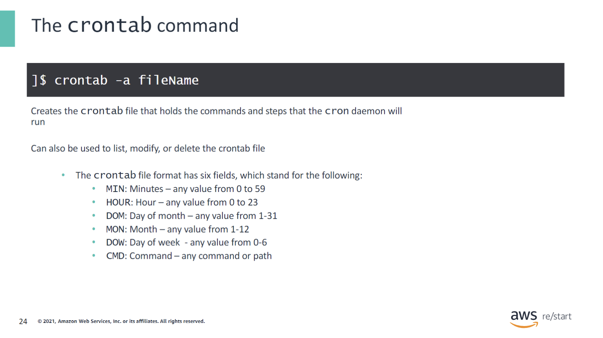

#### What is `crontab`?

`crontab` stands for cron table and is a file that consists of a list of commands. It is also used to manage this table. The following fields make up the table:

- Minute
- Hour
- Day of the month
- Month of the year
- Day of the week
- Command

`crontab` specifies commands or scripts to be run at specific times, which the user can modify.

The `cron` daemon checks the `crontab` file each minute for scheduled tasks, and executes these tasks according to the specified schedule.

#### Why would you use it?

`crontab` is useful for scheduling tasks that need to be performed regularly, such as backups, clean-up scripts, log rotation scripts, or reminder messages.

#### Editing and listing the crontab file

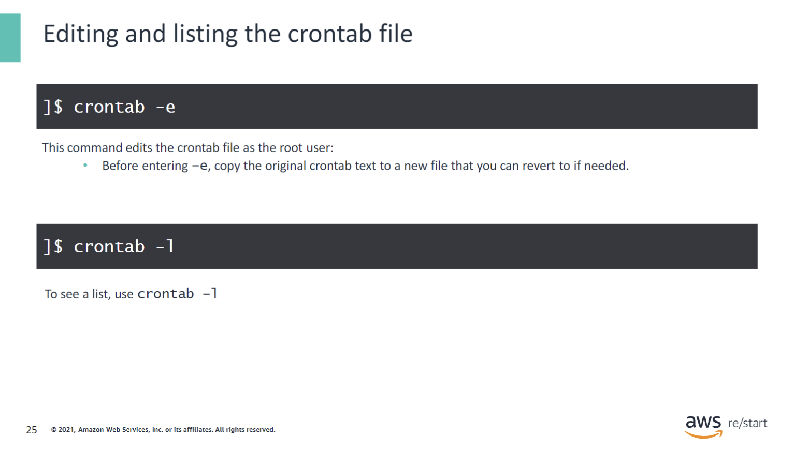

To edit the `crontab` file as the root user, use the `crontab -e` command. This command automatically installs the new `crontab` file, applying all changes immediately. It utilizes the system's default text editor, typically Vim.

**Best practices:**

- Use `crontab -l` to list existing `crontab` entries before making changes.
- Before using `-e`, copy the original `crontab` text to a new file for backup purposes, allowing easy reversion if needed.

**System crontab and user crontab:**

- System-wide scheduled tasks are managed by the root user and are located at `/etc/crontab`.
- Each user manages their own specific tasks in their user-specific `crontab` file, typically found at `/var/spool/cron/crontabs/$USERNAME`.

Always use `crontab -e` for editing `crontab` files to ensure proper installation and application of changes.

### Checkpoint Questions

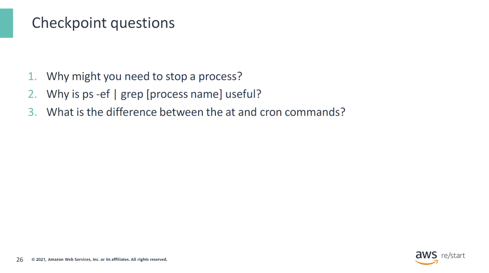

Answers:

1. If a process becomes unresponsive, you must manually shut it down. An example would be a web server that, despite running at 100% CPU, fails to serve webpages. If standard procedures for stopping the web server do not work, manual intervention to stop the process is necessary.
2. An administrator can use this command to verify whether a program, process, or application is running.
3. You use the `at` command to run a single task at a specified time, and you use `cron` to schedule and run repeated tasks.

### Key takeaways

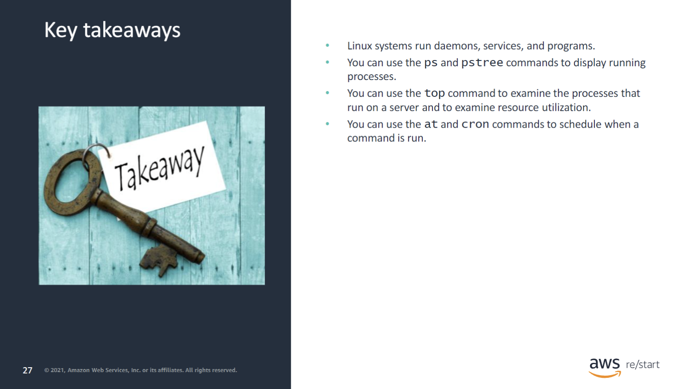

Some of the key takeaways include the following:

- Linux systems run daemons, services, and programs.
- You can use the `ps` and `pstree` commands to display running processes.
- You can use the `top` command to examine processes running on a server and to analyze resource utilization.
- You can use the `at` and `cron` commands to schedule when a command is run.

## Managing Linux Services

tba