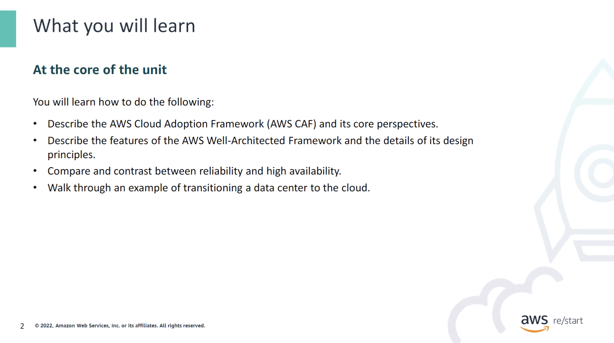

:::tip[You will learn how to do the following:]

- Describe the AWS Cloud Adoption Framework (AWS CAF) and its core perspectives.
- Describe the features of the AWS Well-Architected Framework and the details of its design principles.
- Compare and contrast between reliability and high availability.
- Walk through an example of transitioning a data center to the cloud.

:::
