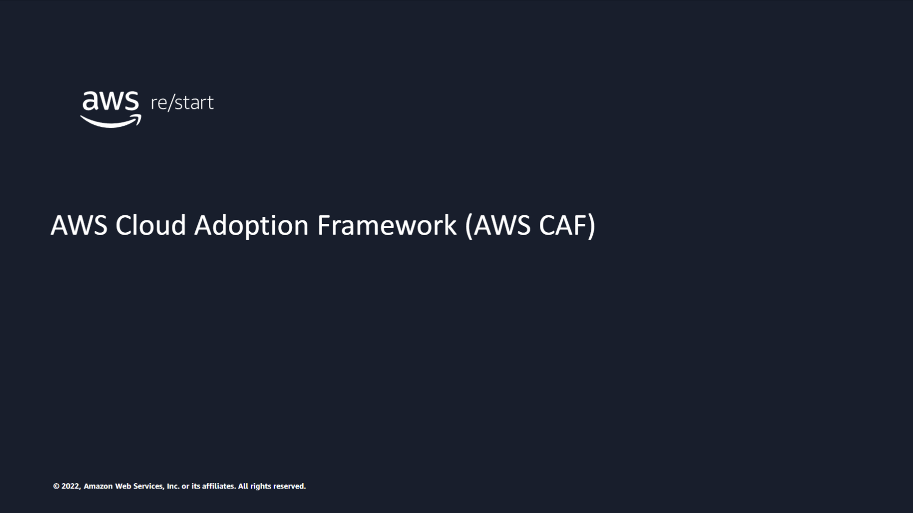
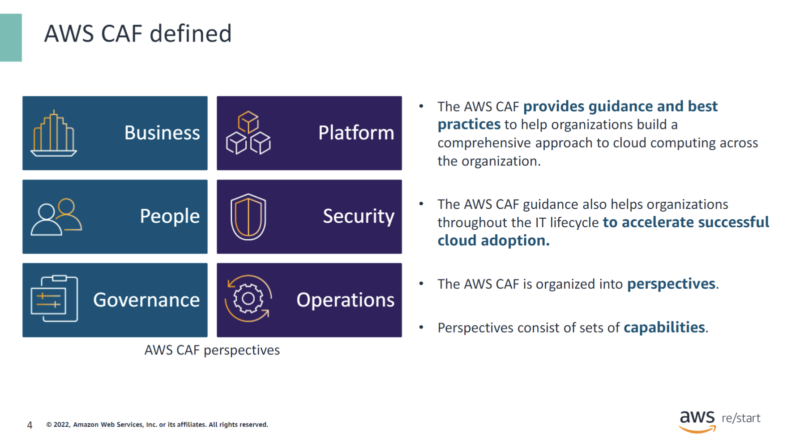
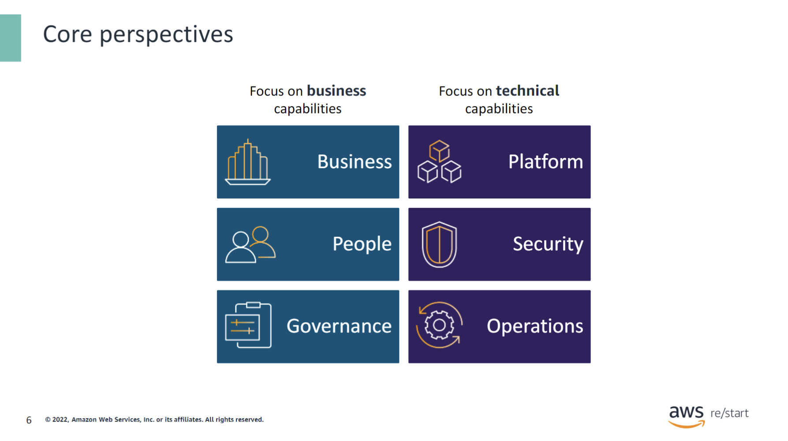
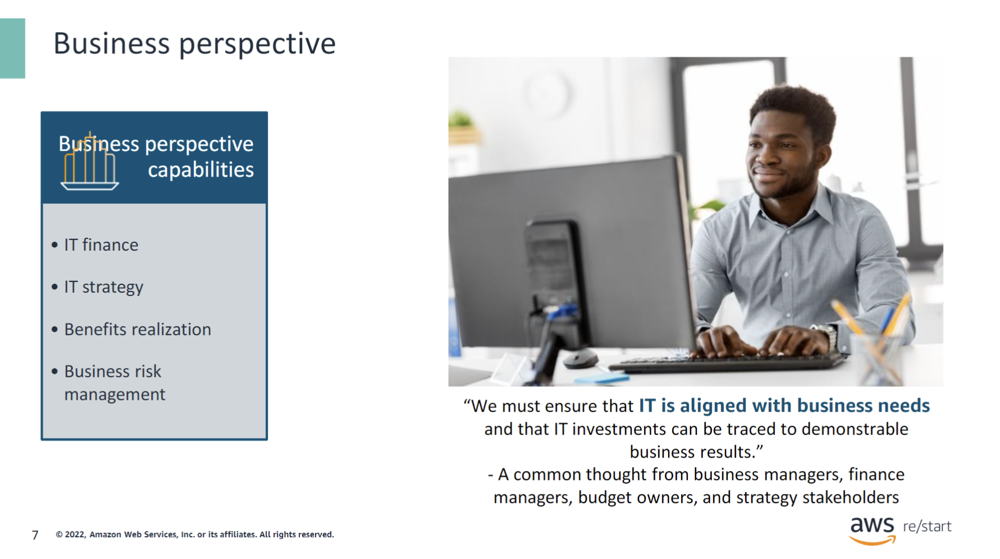
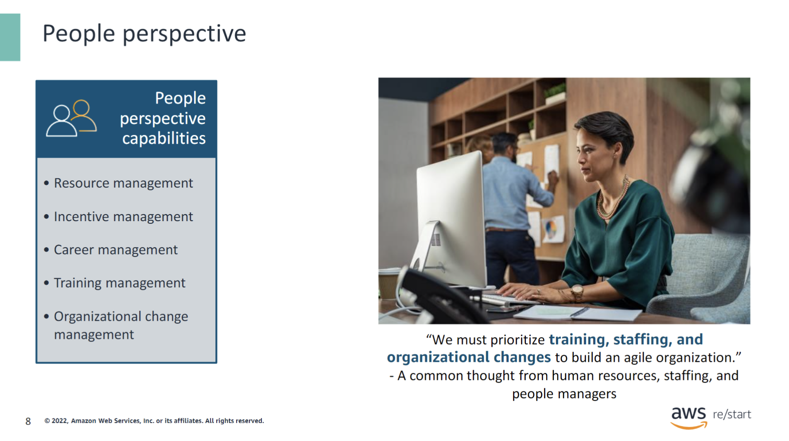
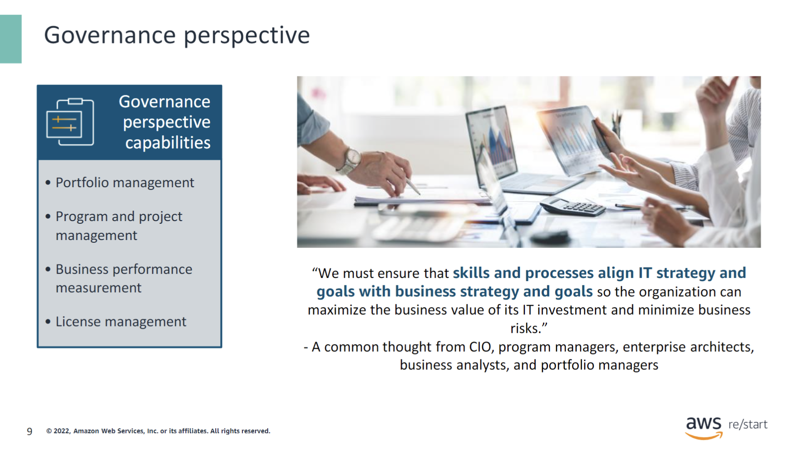
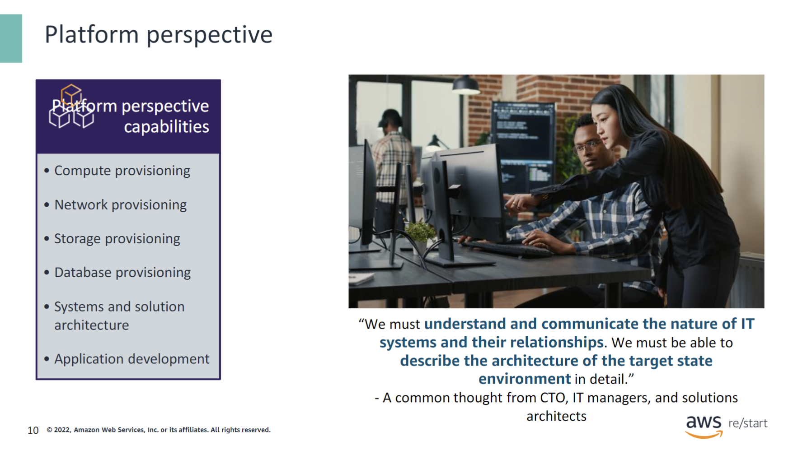
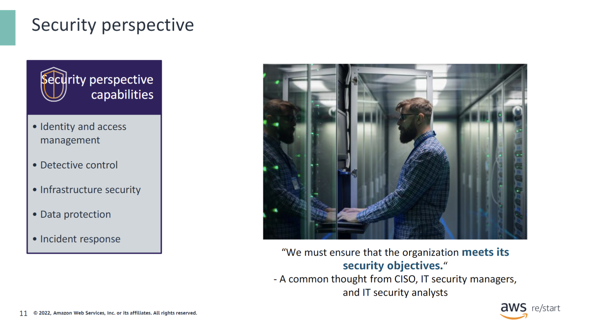
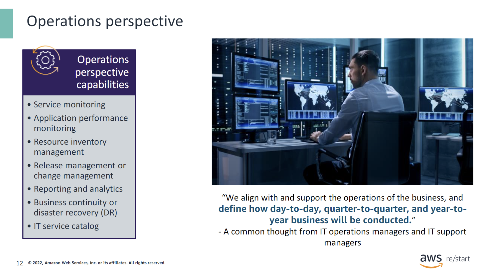
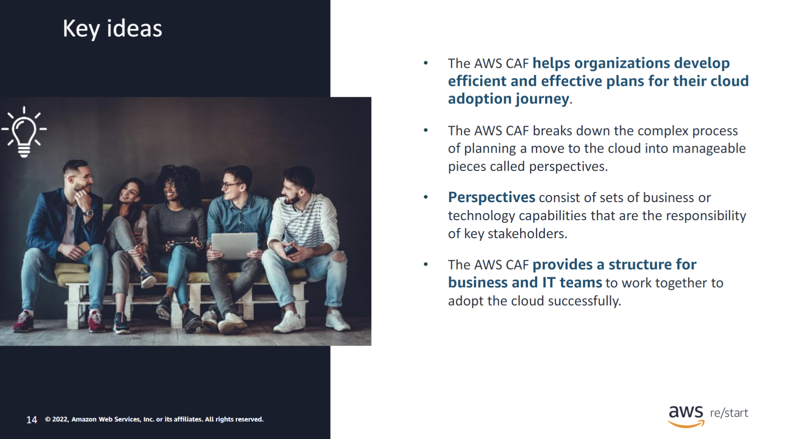

:::tip[You will learn how to do the following:]

- Describe the AWS Cloud Adoption Framework (AWS CAF).
- Explore the core perspectives of the AWS CAF.In this lesson, you will learn how to explain the AWS Cloud Adoption Framework (AWS CAF) and its core perspectives.

:::

## AWS CAF

---

### AWS CAF defined

---

Each organization’s cloud adoption journey is unique. However, for any organization to successfully migrate its IT portfolio to the cloud, three elements—people, process, and technology—must be aligned. Business and technology leaders in an organization must understand the organization’s current state and target state. They also must understand the transition that is needed to achieve the target state so that they can set goals and create processes for staff.

The AWS CAF helps organizations develop efficient and effective plans for their cloud adoption journey. The guidance and best practices that the framework provides help you build a comprehensive approach to cloud computing across your organization and throughout your IT lifecycle.

The AWS CAF breaks down the complex process of planning a move to the cloud into manageable pieces that are called perspectives. Perspectives represent essential areas of focus that span people, processes, and technology. Capabilities within each perspective identify which areas of your organization require attention. From that viewpoint, actions are organized into prescriptive work streams that support a successful cloud journey.

:::note

- The AWS CAF provides guidance and bestpractices to help organizations build acomprehensive approach to cloud computing across the organization.
- The AWS CAF guidance also helps organizations throughout the IT lifecycle to accelerate successful cloud adoption.
- The AWS CAF is organized into perspectives.
- Perspectives consist of sets of capabilities.

:::

## Core perspectives of the AWS CAF

### Core perspectives

---

At the highest level, the AWS CAF organizes guidance into areas of focus called perspectives.

Each perspective covers distinct responsibilities that functionally related stakeholders own or manage. In general, the Business, People, and Governance perspectives focus on business capabilities. The Platform, Security, and Operations perspectives focus on technical capabilities.

### Business perspective

---

Stakeholders from the Business perspective include business managers, finance managers, budget owners, and strategy stakeholders. They can use the AWS CAF to create a strong business case for cloud adoption and prioritize cloud adoption initiatives. Stakeholders should ensure that an organization’s business strategies and goals align with its IT strategies and goals.

### People perspective

---

Stakeholders from the People perspective include human resources, staffing, and people managers. They can use the AWS CAF to evaluate organizational structures and roles, assess new skill and process requirements, and identify gaps. Performing an analysis of needs and gaps can help prioritize training, staffing, and organizational changes to build an agile organization.

### Governance perspective

---

Stakeholders from the Governance perspective include the chief information officer (CIO), program managers, enterprise architects, business analysts, and portfolio managers. They can use the AWS CAF to focus on the skills and processes needed to align IT strategy and goals with business strategy and goals. This focus helps the organization maximize the business value of its IT investment and minimize the business risks.

### Platform perspective

---

Stakeholders from the Platform perspective include the chief technology officer (CTO), IT managers, and solutions architects. They use a variety of architectural dimensions and models to understand and communicate the nature of IT systems and their relationships. They must be able to describe the architecture of the target state environment in detail. The AWS CAF includes principles and patterns for implementing new solutions on the cloud and for migrating on-premises workloads to the cloud.

### Security perspective

---

Stakeholders from the Security perspective include the chief information security officer (CISO), IT security managers, and IT security analysts. They must ensure that the organization meets security objectives for visibility, auditability, control, and agility. Security perspective stakeholders can use the AWS CAF to structure the selection and implementation of security controls that meet the organization’s needs.

### Operations perspective

---

Stakeholders from the Operations perspective (for example, IT operations managers and IT support managers) define how day-to-day, quarter-to-quarter, and year-to-year business is conducted. Stakeholders from the Operations perspective align with and support the operations of the business. The AWS CAF helps these stakeholders define current operating procedures. It also helps them identify the process changes and training that are needed to implement successful cloud adoption.

## Checkpoint questions

---

What is the AWS CAF?

The AWS CAF is guidance that helps organizations develop efficient and effective plans for their cloud adoption journey.

Why is the AWS CAF important?

For any organization to successfully migrate its IT portfolio to the cloud, three elements—people, process, and technology—must be aligned. The AWS CAF provides guidance to support a successful migration to the cloud.

Which core perspectives of the AWS CAF focus on business capabilities?

Business, people, and governance focus on business capabilities.

Which of the core perspectives of the AWS CAF focus on technical capabilities?

Platform, security, and operations focus on technical capabilities.

## Key ideas

---

- The AWS CAF helps organizations develop efficient and effective plans for their cloud adoption journey.

- The AWS CAF breaks down the complex process of planning a move to the cloud into manageable pieces called perspectives.

- Perspectives consist of sets of business or technology capabilities that are the responsibility of key stakeholders.

- The AWS CAF provides a structure for business and IT teams to work together to adopt the cloud successfully.

:::tip

For more information about the AWS CAF, visit the AWS Cloud Adoption Framework (AWS CAF) webpage at [https://aws.amazon.com/professional-services/CAF/](https://aws.amazon.com/professional-services/CAF/).

:::
