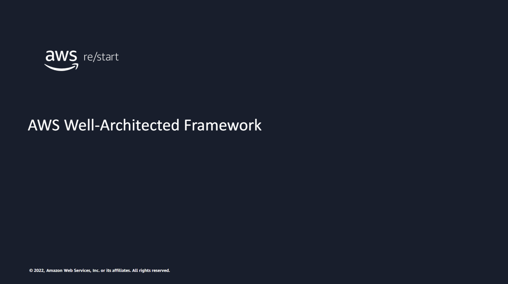

---

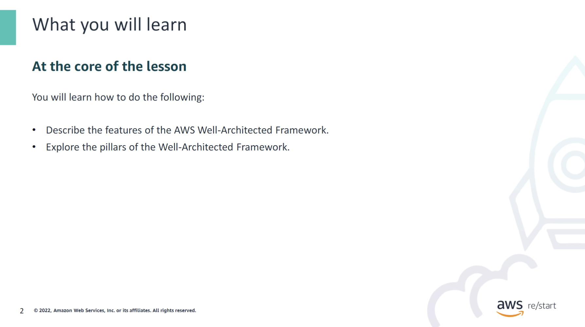

:::tip[What you will learn]

The goal of this lesson is to help you understand cloud architecting. You will learn about the AWS Well-Architected Framework, which you can use to improve your cloud architecture. You can also use the Well-Architected Framework to gain a better understanding of how design decisions can impact your business. You will review each of the pillars that make up the Well-Architected Framework: operational excellence, security, reliability, performance efficiency, cost optimization, and sustainability.

:::

## Features of the Well-Architected Framework

### What is the Well-Architected Framework?

---

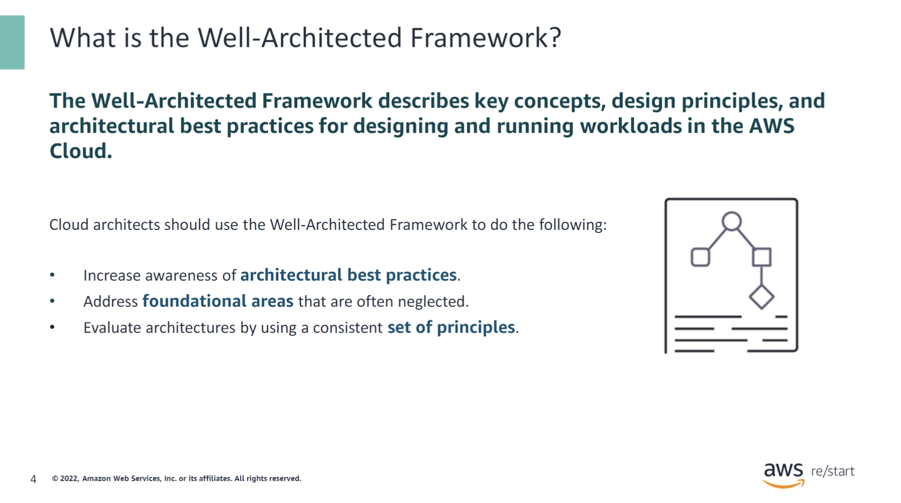

Architecture is the art and science of designing and building large structures. Large systems require architects to manage their size and complexity. Cloud architects engage with decision makers to identify business goals, align technology deliverables with those goals, and work with delivery teams to implement appropriate solutions.

The Well-Architected Framework documents a set of foundational questions that help you to understand whether a specific architecture aligns well with cloud best practices. The Well-Architected Framework provides a consistent approach to evaluating systems against the qualities that you expect from modern cloud-based systems. It offers the remediation that would be required to achieve those qualities. The Well-Architected Framework helps cloud architects assess and improve their architectures and get a better understanding of how their design decisions can impact their business. It provides a set of questions that AWS experts have developed to help customers think critically about their architecture, such as "Does your infrastructure follow best practices?"

As cloud technologies continue to evolve, AWS is continually improving and refining the definition of the Well-Architected Framework.

### Well-Architected Framework features

---

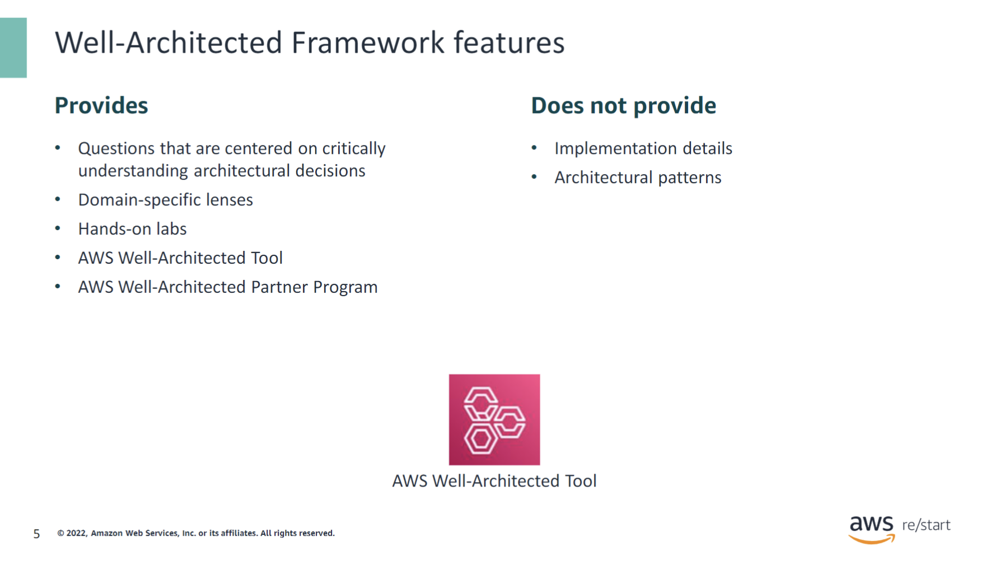

The Well-Architected Framework provides a set of foundational questions that help you to understand whether a specific architecture aligns well with cloud best practices. It also includes information about services and solutions that are relevant to each question and references to relevant resources. These resources include domain-specific lenses, hands-on labs, the AWS Well-Architected Tool, and AWS Well-Architected Partner Program. The AWS WA Tool, available at no cost in the AWS Management Console, provides a mechanism for regularly evaluating workloads, identifying high-risk issues, and recording improvements.

AWS also provides access to a network of hundreds of members in the AWS Well-Architected Partner Program. You can engage a partner in your area to help analyze and review your applications.

Although the Well-Architected Framework provides substantial information, it does not provide exact implementation details or architectural patterns.

## Pillars of the Well-Architected Framework

### Well-Architected Framework pillars

---

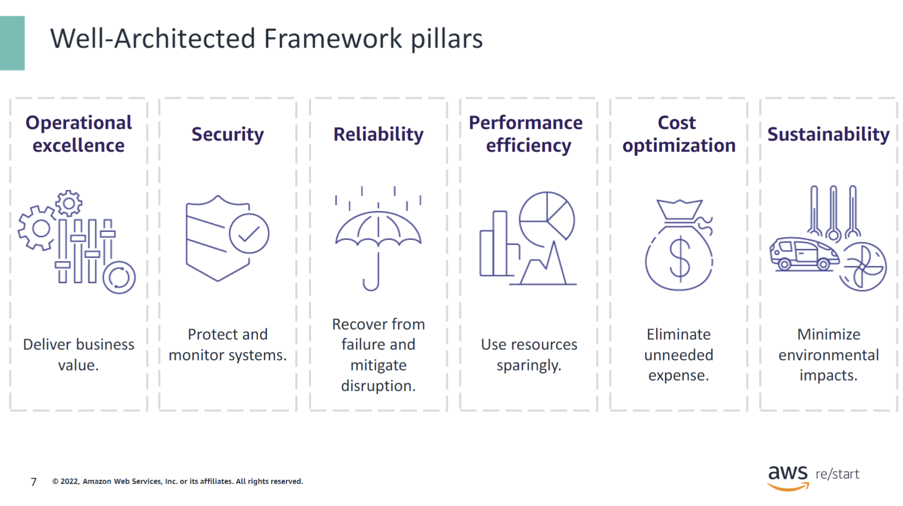

The Well-Architected Framework helps you design your architecture from different perspectives, or pillars. The pillars are operational excellence, security, reliability, performance efficiency, cost optimization, and sustainability. Each pillar contains a set of design principles and best practices.

You will learn about each pillar in more detail and discuss the design principles for each pillar in the next slides.

### Operational excellence

---

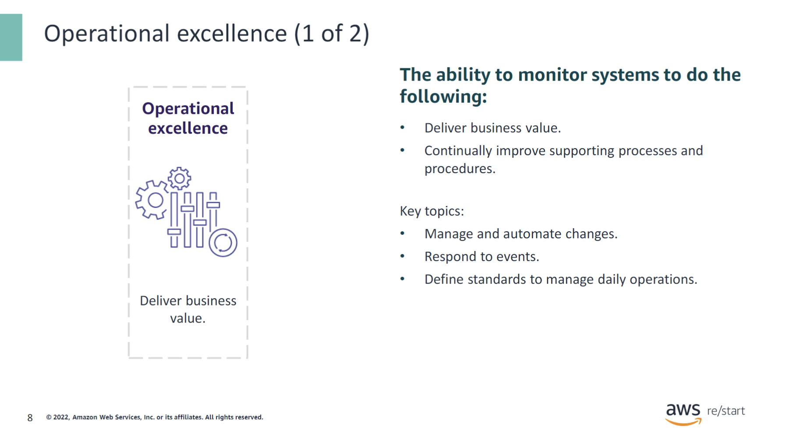

The first pillar is the operational excellence pillar. This pillar includes how your organization supports your business objectives and your ability to run workloads effectively. It also includes how your organization supports your ability to gain insight into their operations and to continuously improve supporting processes and procedures to deliver business value.

An example of an operational excellence best practice is to continuously monitor the health and performance of your workloads using a service such as Amazon CloudWatch. You can use this service to initiate automated responses to adjust the resources that your workloads use and to prevent performance issues or failures.

Key topics include managing and automating changes, responding to events, and defining standards to successfully manage daily operations.

---

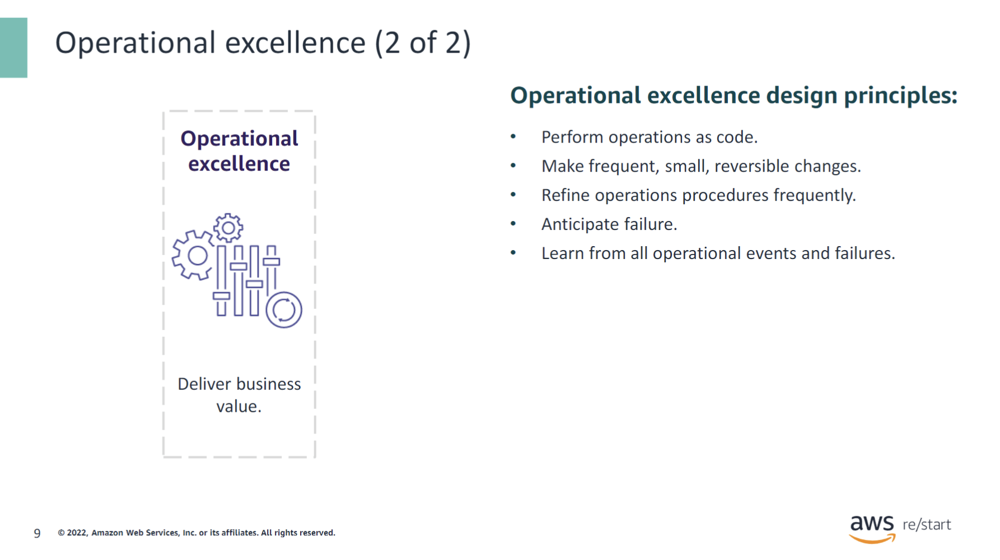

**Perform operations as code:** In the cloud, you can define your entire workload (applications, infrastructure, and more) as code and update it with code. You can script your operations’ procedures and automatically start them by initiating them in response to events. By performing operations as code, you limit human error and help ensure consistent responses to events.

**Make frequent, small, reversible changes:** Design workloads for components to be updated regularly to increase the flow of beneficial changes into your workload. Make changes in small increments that can be reversed if they fail to aid in the identification and resolution of issues introduced to your environment. When possible, make these changes without affecting customers.

**Refine operations procedures frequently:** As you use operations procedures, look for opportunities to improve them. As you evolve your workload, evolve your procedures appropriately. Set up regular game days to review and validate that all procedures are effective and that teams are familiar with them.

**Anticipate failure:** Perform pre-mortem exercises to identify potential sources of failure so that they can be removed or mitigated. Test your failure scenarios and validate your understanding of their impact. Test your response procedures to help ensure that they are effective and that teams are familiar with their launch. Set up regular game days to test workload and team responses to simulated events.

**Learn from all operational failures:** Drive improvement through lessons learned from all operational events and failures. Share what is learned across teams and through the entire organization.

### Security

---

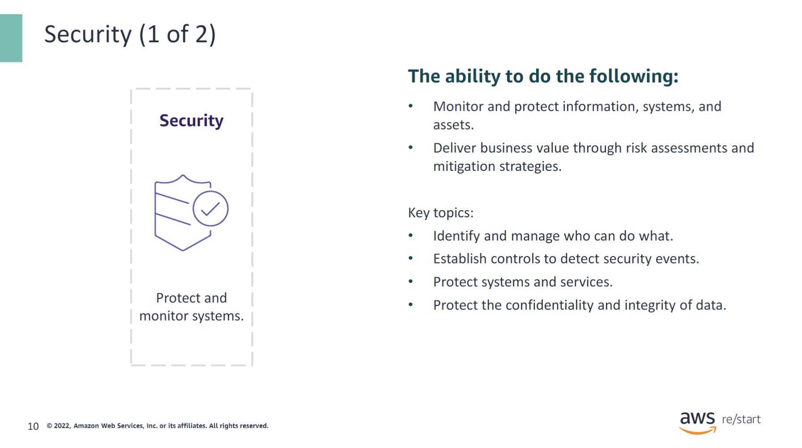

The security pillar describes how to take advantage of cloud technologies to protect data, systems, and assets in a way that can improve your security posture. The security pillar involves the ability to monitor and protect systems while delivering business value through risk assessments and mitigation strategies. An example of security in the cloud would be staying up to date with AWS and industry recommendations and threat intelligence. Automation can be used for security processes, testing, and validation to scale security operations.

Key topics include protecting data confidentiality and integrity, identifying and managing who can do what (privilege management), protecting systems, and establishing controls to detect security events.

---

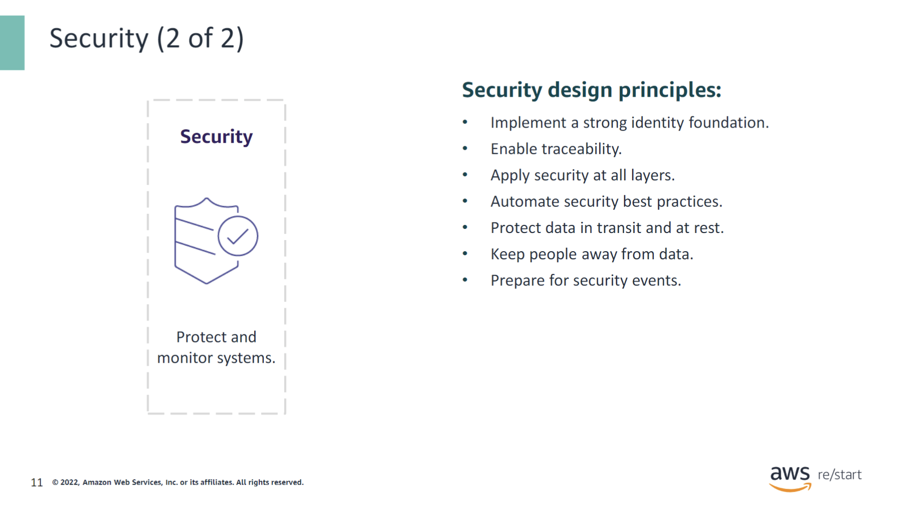

Design principles that can help you strengthen your workload security are as follows:

- **Implement a strong identity foundation**: Implement the principle of least privilege, and enforce separation of duties with appropriate authorization for each interaction with your AWS resources. Centralize identity management, and aim to eliminate reliance on long-term static credentials.

- **Enable traceability**: Monitor, alert, and audit actions and changes to your environment in real time. Integrate log and metric collection with systems to automatically investigate and take action.

- **Apply security at all layers**: Apply a defense in-depth approach with multiple security controls. Apply to all layers (for example, edge of network, virtual private cloud [VPC], load balancing, every instance and compute service, operating system, application, and code).

- **Automate security best practices**: Automated software-based security mechanisms improve your ability to securely scale more rapidly and cost-effectively. Create secure architectures, including the implementation of controls that are defined and managed as code in version-controlled templates.

- **Protect data in transit and at rest**: Classify your data into sensitivity levels and use mechanisms, such as encryption, tokenization, and access control where appropriate.

- **Keep people away from data**: Use mechanisms and tools to reduce or eliminate the need for direct access or manual processing of data. This practice reduces the risk of mishandling, modification, or human error when handling sensitive data.

- **Prepare for security events**: Prepare for an incident by having incident management and investigation policy and processes that align to your organizational requirements. Run incident response simulations, and use tools with automation to increase your speed for detection, investigation, and recovery.

### Reliability

---

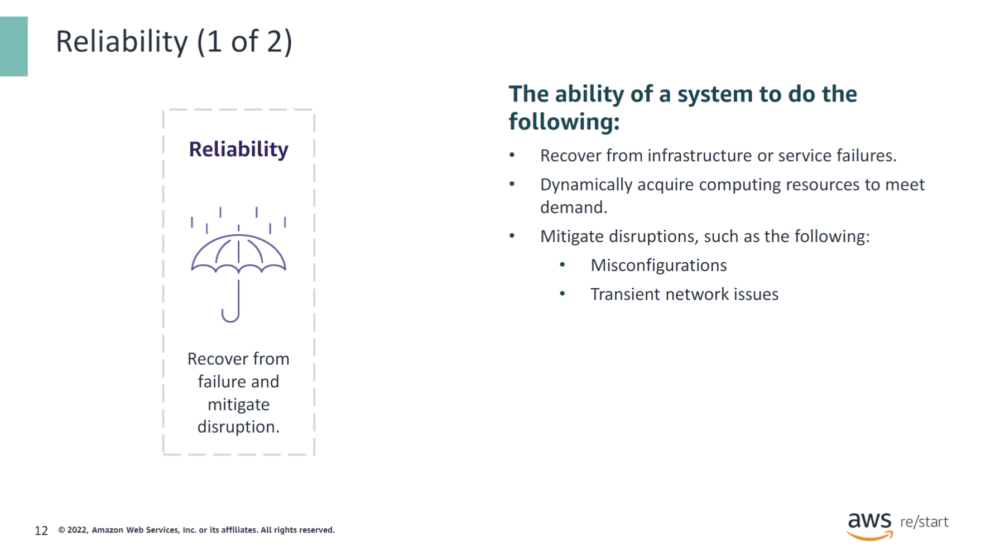

The reliability pillar encompasses the ability of a workload to perform its intended function correctly and consistently when it is expected to. This ability includes operating and testing the workload through its total lifecycle.

Reliability in the cloud comprises four areas:

- **Foundations**: To achieve reliability, your architecture and system must have a well-planned foundation that can handle changes in demand or requirements. It also must be able to detect failure and automatically heal itself.

- **Architecture**: Before architecting any system, foundational requirements that influence reliability should be in place. The workload architecture of the distributed system must be designed to prevent and mitigate failures.

- **Change management**: It is important to fully understand how change can affect your system. If you plan proactively and monitor your systems, you can accommodate change and adjust to it quickly and reliably.

- **Failure management**: To ensure your architecture is reliable, it is key to anticipate, become aware of, respond to, and prevent failures. In a cloud environment, you can take advantage of automation with monitoring, replacing systems in your environment, and troubleshooting failed systems. This automation is cost-effective and reliable. By carefully evaluating each of these elements, you can anticipate, respond to, and prevent failures.

---

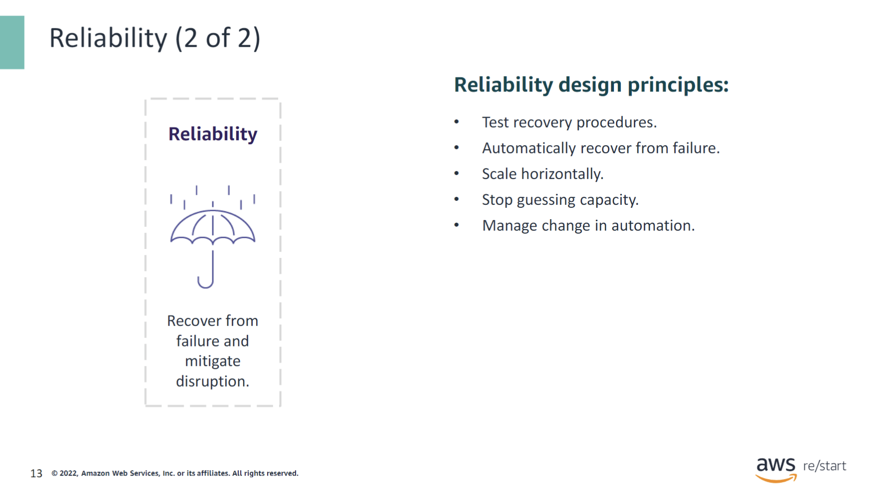

Design principles to increase reliability are as follows:

- **Test recovery procedures**: In an on-premises environment, testing often focuses on proving that the workload works under certain scenarios. In the cloud, you can test how your workload fails and validate your recovery procedures. Use automation to simulate different failures or recreate scenarios that led to past failures. This approach helps expose failure pathways that you can test and fix before a real failure occurs, thus reducing risk.

- **Automatically recover from failure**: Monitor a workload for key performance indicators (KPIs) and initiate automation when a threshold is breached. This allows for automatic notification and tracking of failures, and for automated recovery processes that work around or repair the failure. Sophisticated automation can even anticipate and remediate failures before they occur.

- **Scale horizontally to increase aggregate workload availability**: Replace one large resource with multiple smaller resources to reduce the impact of a single failure on the overall workload. Distribute requests across multiple, smaller resources to help ensure that they don’t share a common point of failure.

- **Stop guessing capacity**: Resource saturation, where demands exceed capacity, is a common cause of failure in on-premises workloads. In the cloud, monitor demand and workload utilization, and automate the addition or removal of resources to maintain optimal levels. This approach helps avoid overprovisioning or underprovisioning, even though some quotas are controlled by limits.

- **Manage change in automation**: Changes to your infrastructure should be made using automation. This includes managing changes to the automation itself, which can be tracked and reviewed.

### Performance efficiency

---

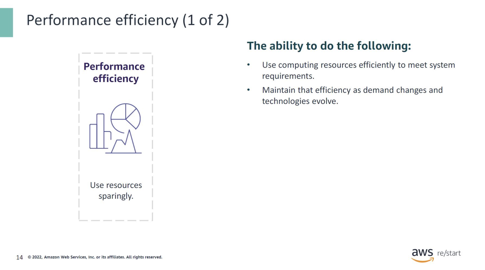

The performance efficiency pillar refers to using computing resources efficiently while meeting system requirements. It involves maintaining that efficiency as demand fluctuates and technologies evolve. To implement performance efficiency, take a data-driven approach to building a high-performance architecture. Gather data on all aspects of the architecture, from high-level design to the selection and configuration of resource types.

Reviewing your choices regularly helps ensure that you are taking advantage of the continually evolving AWS Cloud. Monitoring helps ensure you are aware of any deviations from expected performance. Make trade-offs in your architecture to improve performance, such as using compression or caching, or relaxing consistency requirements.

Factors that influence performance efficiency in the cloud include:

- **Selection**: Choose the best solution that will optimize your architecture. Solutions vary based on the workload, and AWS offers many ways to customize solutions with different configurations.

- **Review**: Continually innovate your solutions and leverage newer technologies and approaches that become available. These newer releases could improve the performance efficiency of your architecture.

- **Monitoring**: After implementation, monitor performance to address issues before they affect customers. Use tools such as Amazon CloudWatch, Amazon Kinesis, Amazon Simple Queue Service (Amazon SQS), and AWS Lambda to automate monitoring.

- **Trade-offs**: Make trade-offs, such as trading consistency, durability, and space against time or latency, to achieve higher performance.

---

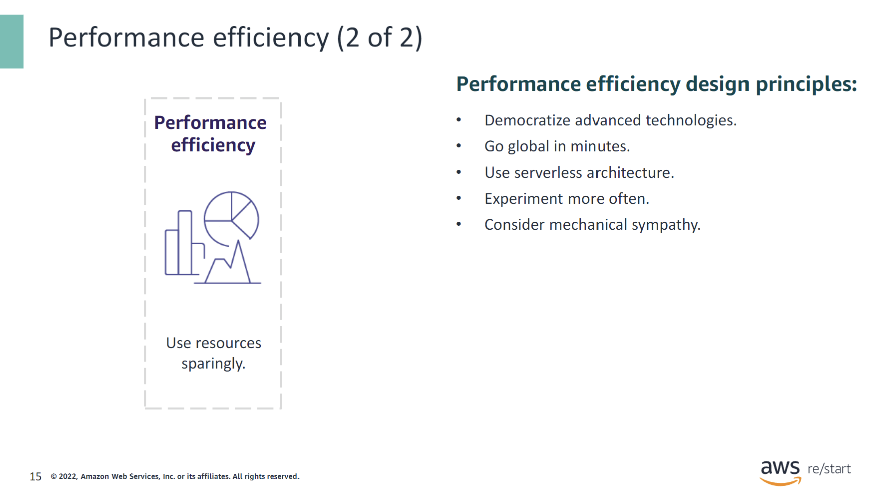

The following design principles can help you achieve and maintain efficient workloads in the cloud:

- **Democratize advanced technologies**: Technologies that are difficult to implement can become simpler to consume by pushing that knowledge and complexity into the cloud vendor’s domain. Instead of having your IT team learn how to host and run a new technology, they can consume it as a service.

- **Go global in minutes**: With AWS, you can deploy your system in multiple AWS Regions around the world. This provides lower latency and a better experience for your customers at minimal cost.

- **Use a serverless architecture**: Serverless computing is a cloud computing runtime model where the cloud provider dynamically manages the allocation of machine resources. Pricing is based on the actual amount of resources that an application consumes instead of on pre-purchased units of capacity. This approach reduces the need to run and maintain traditional servers for compute activities, removes operational burdens, and can lower transactional costs.

- **Experiment more often**: With virtual and automatable resources, you can quickly carry out comparative testing using different types of instances, storage, or configurations.

- **Have mechanical sympathy**: This principle suggests using the technology approach that best aligns with what you are trying to achieve. For example, consider data access patterns when selecting database or storage approaches.

### Cost optimization

---

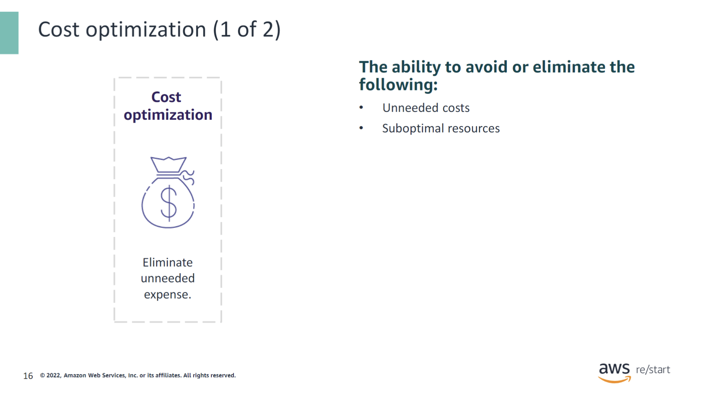

Cost optimization refers to the ability to avoid or eliminate unneeded expenses and resources. It is a continual process of refinement and improvement over the span of a workload’s lifecycle.

Cost optimization in the cloud has five focus areas:

- **Practice cloud financial management**.
- **Be aware of expenditure and usage**.
- **Maintain cost-effective resources**.
- **Manage demand and supply resources**.
- **Optimize over time**.

Similar to the other pillars within the Well-Architected Framework, cost optimization has trade-offs to consider. For example, you want to consider whether to optimize for speed-to-market or for cost. In some cases, it’s best to optimize for speed—going to market quickly, shipping new features, or meeting a deadline—rather than investing in upfront cost optimization.

Design decisions are sometimes directed by haste rather than data. The temptation always exists to overcompensate rather than spend time benchmarking for the most cost-optimal deployment. Overcompensation can lead to over-provisioned and under-optimized deployments. However, it might be a reasonable choice if you must lift and shift resources from your on-premises environment to the cloud and then optimize afterward.

It's important to invest the right amount of effort in a cost optimization strategy upfront. By doing so, you can realize the economic benefits of the cloud more readily by helping ensure a consistent adherence to best practices and avoiding unnecessary overprovisioning. The following sections provide techniques and best practices for the initial and ongoing implementation of cloud financial management and cost optimization for your workloads.

---

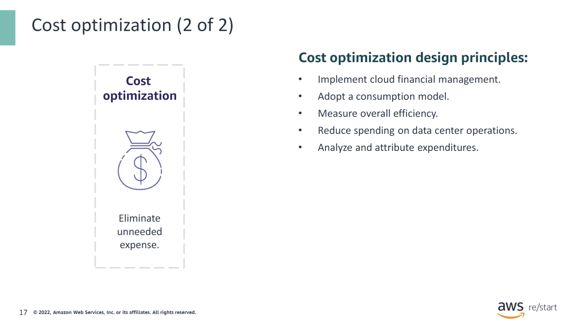

Consider the following design principles for cost optimization:

- **Implement cloud financial management**: To achieve financial success and accelerate business value realization in the cloud, you must invest in cloud financial management. Your organization must dedicate the necessary time and resources for building capability in this new domain of technology and usage management. Similar to your security or operations capability, you must build capability through knowledge building, programs, resources, and processes to help you become a cost-efficient organization.

- **Adopt a consumption model**: Pay for only the computing resources that you consume, and increase or decrease usage depending on business requirements. For example, development and test environments are typically used for only 8 hours a day during the work week. You can stop these resources when they’re not in use for a potential cost savings of 75 percent (40 hours compared to 168 hours).

- **Measure overall efficiency**: Measure the business output of the workload and the costs associated with delivery. Use this data to understand the gains that you make from increasing output, increasing functionality, and reducing cost.

- **Reduce spending on data center operations**: AWS does the heavy lifting of data center operations like racking, stacking, and powering servers. It also removes the operational burden of managing operating systems and applications with managed services. As a result, you can focus on your customers and business projects rather than on IT infrastructure.

- **Analyze and attribute expenditure**: The cloud simplifies accurate identification of cost and usage of workloads, which then offers transparent attribution of IT costs to revenue streams and individual workload owners. It helps measure return on investment (ROI) and gives workload owners an opportunity to optimize their resources and reduce costs.

### Sustainability

---

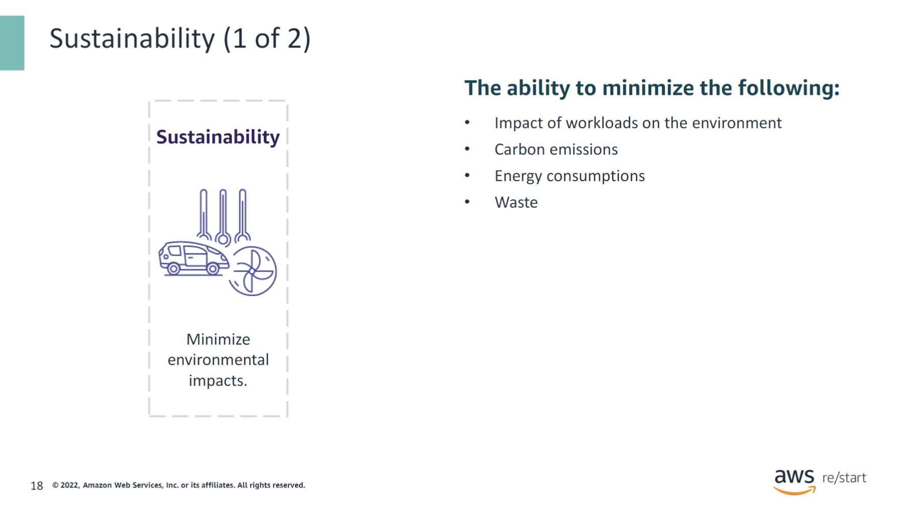

The discipline of sustainability addresses the long-term environmental, economic, and societal impact of your business activities. When building cloud workloads, the practice of sustainability includes the following:

- **Understanding the impacts of the services used**: Assess the environmental footprint of the cloud services you utilize.

- **Quantifying impacts through the entire workload lifecycle**: Measure and analyze the environmental impact from the inception to the decommissioning of your workloads.

- **Applying design principles and best practices to reduce these impacts**: Implement strategies and techniques to minimize the environmental footprint of your cloud architecture.

This pillar focuses on environmental impacts, especially energy consumption and efficiency. They are important levers for architects to inform direct action to reduce resource usage.

You can use the AWS Cloud to run workloads designed to support your wider sustainability challenges. Examples of these challenges include reducing carbon emissions, lowering energy consumption, recycling water, or reducing waste in other areas of your business or organization.

Sustainability through the cloud is when you use AWS technology to solve a broader sustainability challenge. For example, you can use a machine learning service like Amazon Monitron to detect abnormal behavior in industrial machinery. Using this detection data, you can conduct preventive maintenance to reduce the risk of environmental incidents caused by unexpected equipment failures. Thus, you can help ensure that the machinery continues to operate at peak efficiency.

---

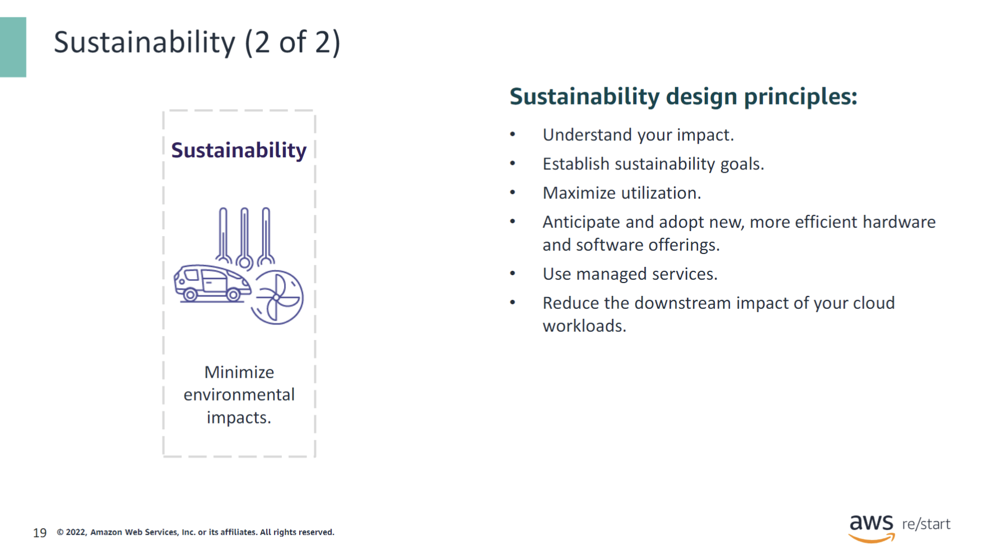

Apply these design principles when architecting your cloud workloads to maximize sustainability and minimize impact:

- **Understand your impact**: Measure the impact of your cloud workload, and model the future impact of your workload. Include all sources of impact, including impacts that result from customer use of your products and from their eventual decommissioning and retirement. Compare the productive output with the total impact of your cloud workloads by reviewing the resources and emissions required per unit of work. Use this data to establish KPIs, evaluate ways to improve productivity while reducing impact, and estimate the impact of proposed changes over time.

- **Establish sustainability goals**: For each cloud workload, establish long-term sustainability goals, such as reducing the compute and storage resources required per transaction. Model the ROI of sustainability improvements for existing workloads, and give owners the resources that they need to invest in sustainability goals. Plan for growth. Architect your workloads so that growth results in reduced impact intensity measured against an appropriate unit, such as per user or per transaction. These goals help you support the wider sustainability goals of your business or organization, identify regressions, and prioritize areas of potential improvement.

- **Maximize utilization**: Right-size workloads and implement efficient design to help ensure high utilization and maximize the energy efficiency of the underlying hardware. Two hosts running at 30 percent utilization are less efficient than one host running at 60 percent due to baseline power consumption per host. At the same time, eliminate or minimize idle resources, processing, and storage to reduce the total energy required to power your workload.

- **Anticipate and adopt more efficient hardware and software offerings**: Support upstream improvements that your partners and suppliers make to reduce the impact of your cloud workloads. Continually monitor and evaluate new, more efficient hardware and software offerings. Design for flexibility to facilitate the rapid adoption of new efficient technologies.

- **Use managed services**: Sharing services across a broad customer base helps maximize resource utilization, which reduces the amount of infrastructure needed to support cloud workloads. For example, customers can share the impact of common data center components like power and networking by migrating workloads to the AWS Cloud and adopting managed services. Use managed services that can help minimize your impact, such as automatically moving infrequently accessed data to cold storage, to adjust capacity to meet demand. For example, use Amazon Simple Storage Service (Amazon S3) Lifecycle configurations or Amazon EC2 Auto Scaling.

- **Reduce the downstream impact of your cloud workloads**: Reduce the amount of energy or resources required to use your services. Reduce or eliminate the need for customers to upgrade their devices to use your services. Test using device farms to understand expected impact, and test with customers to understand the actual impact from using your services.

## Checkpoint questions

---

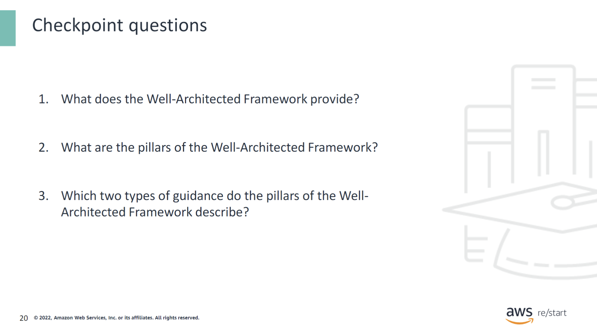

  
What does the Well-Architected Framework provide?

  The Well-Architected Framework provides the following:
  - Questions that are centered on critically understanding architectural decisions
  - Domain-specific lenses
  - Hands-on labs
  - AWS Well-Architected Tool
  - AWS Well-Architected Partner Program

  
What are the pillars of the Well-Architected Framework?

  The pillars are operational excellence, security, reliability, performance efficiency, cost optimization, and sustainability.

  
Which two types of guidance do the pillars of the Well-Architected Framework describe?

  Each pillar contains a set of design principles and best practices.

## Key ideas

---

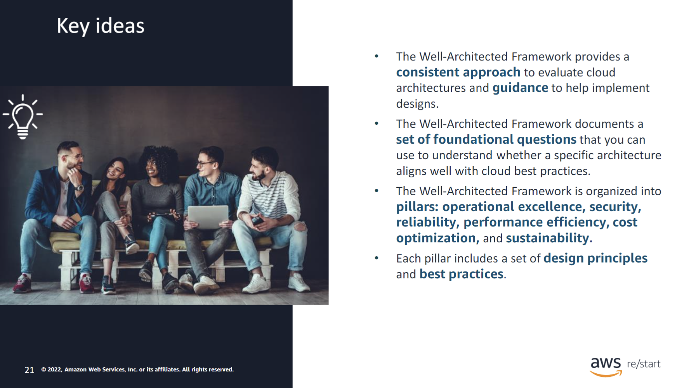

:::tip[Key ideas:]

- The Well-Architected Framework provides a consistent approach to evaluate cloud architectures and guidance to help implement designs. The Well-Architected Framework documents a set of foundational questions that you can use to understand whether a specific architecture aligns well with cloud best practices.
- The Well-Architected Framework is organized into pillars: operational excellence, security, reliability, performance efficiency, cost optimization, and sustainability.
- Each pillar includes a set of design principles and best practices.

For more information, see the [AWS Well-Architected webpage](https://aws.amazon.com/architecture/well-architected/).

:::
