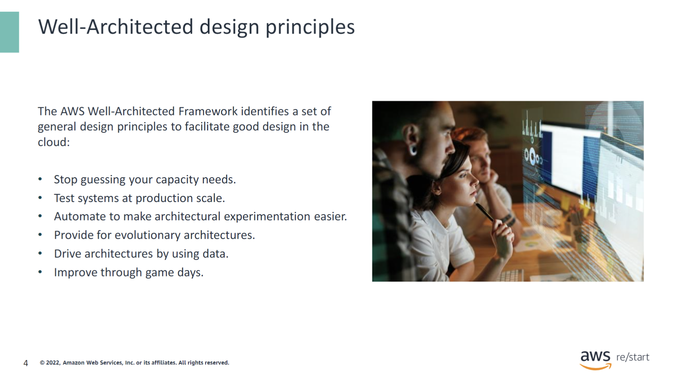
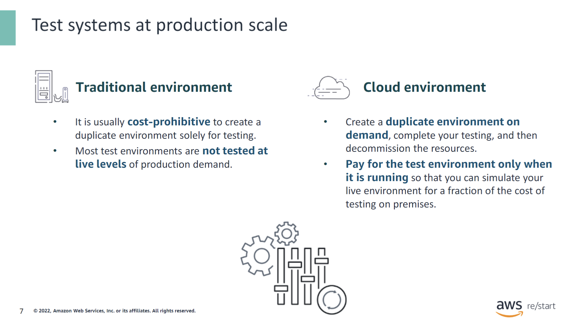
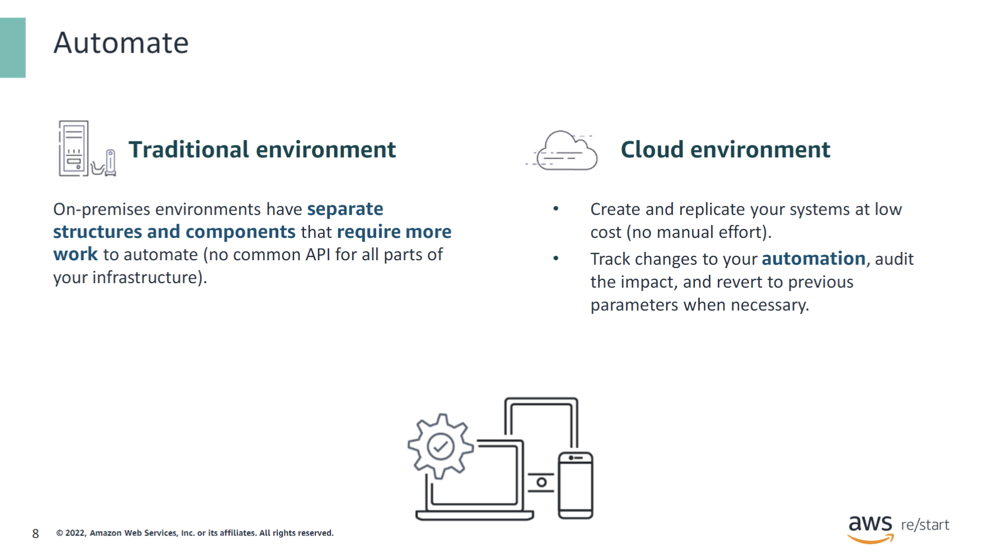
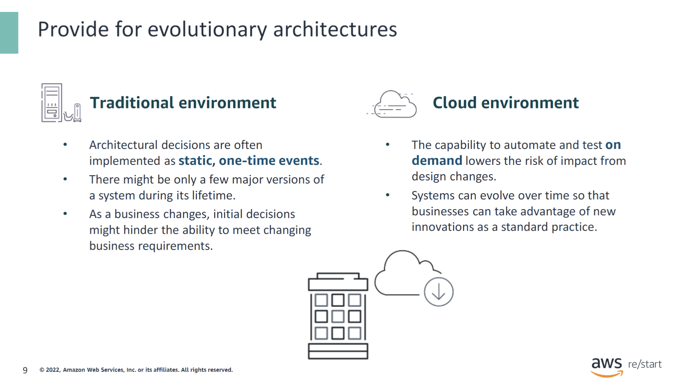
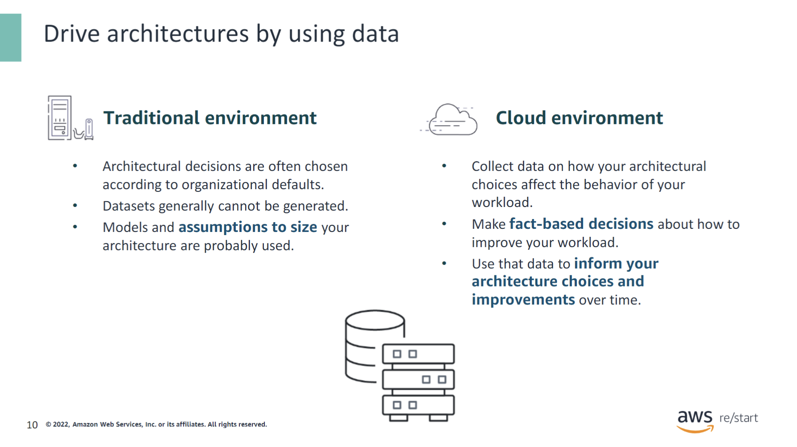
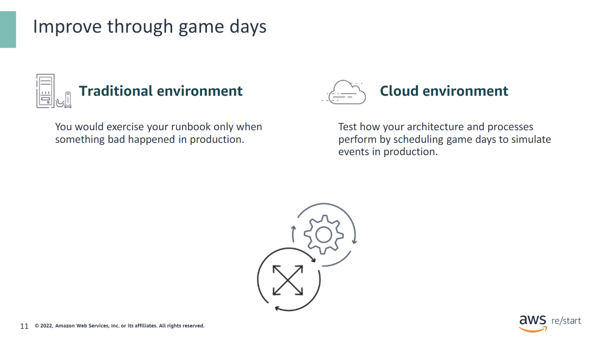
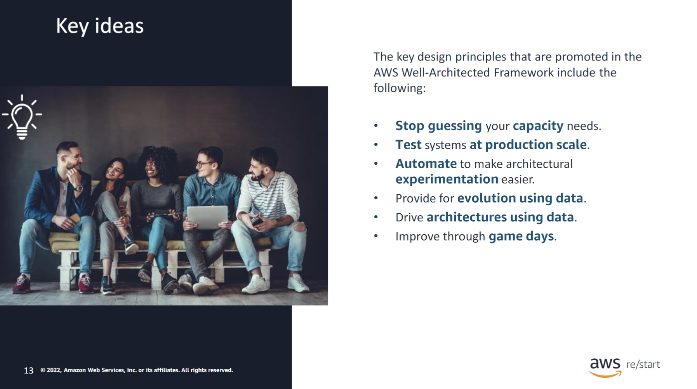

:::tip[You will learn how to do the following:]

- Identify key design principles of the AWS Well-Architected Framework.
- Describe the details of key well-architected design principles.

:::

## Key design principles

### Well-Architected design principles

The AWS Well-Architected Framework identifies a set of
general design principles to facilitate good design in the
cloud:

- Stop guessing your capacity needs.
- Test systems at production scale.
- Automate to make architectural experimentation easier.
- Provide for evolutionary architectures.
- Drive architectures by using data.
- Improve through game days.

## Well-architected design principles details

### Stop guessing your capacity needs

In a traditional environment, the company would have to estimate the number of customers who will be visiting, purchasing, and interacting with the environment. In a cloud environment, you do not need to guess your infrastructure capacity needs. Start with as much or as little capacity as you need, and scale up and down automatically as your need changes. You can achieve this flexibility by monitoring demand and system usage. You can also automate the addition or removal of resources to maintain the optimal level for satisfying demand.

For example, consider these two companies, one with a traditional environment and one with a cloud environment. Both companies are preparing for a sale that will increase the workload on their systems. With a traditional environment, the company would have to estimate the number of customers who will be visiting, purchasing, and interacting with their environment. After estimating, the company must provide funds up front to build out their system in time for the increase in workload. If the company overestimates the size of the system that they build, it will result in unnecessary spending and idle resources. If the company underestimates the size of the system, it will result in performance problems and potential loss of customers and revenue.

With a cloud environment, the company would be able to set workload thresholds, which would initiate increases or decreases in resources to match demand (scaling). By staying as close to the real amount as possible, the company is more efficient in expenditures and resource utilization.

### Test systems at production scale

In a traditional, non-cloud environment, it is usually cost-prohibitive to create a duplicate environment that is used only for testing. Consequently, most test environments are not tested at live levels of production demand. In the cloud, you can create a duplicate environment on demand, complete your testing, and then decommission the resources. You pay for the test environment only when it is running. Therefore, you can simulate your live environment for a fraction of the cost of testing on premises.

For example, when new updates come out, some might impact the system in unexpected ways. To prevent unexpected issues with operations, you can create a test environment that simulates the production environment on a similar scale to test the impact of the updates. Any issues that might come up can be mitigated before the production rollout.

### Automate

On-premises environments have separate structures and components that require more work to automate, with no common API for all parts of your infrastructure. In contrast, cloud environments allow you to use automation to create and replicate your systems at low cost with minimal manual effort. You can track changes to your automation, audit the impact, and revert to previous parameters when necessary.

For example, test environments mentioned in previous examples can be spun up using automation. Rolling out updates within that environment can also be automated by setting specific parameters. If an update fails, you can use automation to select the appropriate action (such as reverting to the previous update version or retrying the update) and then execute that action.

### Provide for evolutionary architectures

In a traditional environment, architectural decisions are often implemented as static, one-time events, with only a few major versions of a system throughout its lifetime. As a business and its context evolve, these initial decisions might hinder the system’s ability to adapt to changing business requirements.

In the cloud, the capability to automate and test on demand lowers the risk associated with design changes. This allows systems to evolve over time, enabling businesses to take advantage of new innovations as a standard practice.

For example, in a traditional environment, physical infrastructure would need to be swapped, moved, disconnected, and reconnected with new equipment. Depending on the size of the company, it could take hours or days to get the new setup operational. However, in the cloud, the infrastructure can be updated with the click of a button, allowing businesses to keep pace with technological advancements.

### Drive architectures by using data

In a traditional, non-cloud environment, architectural choices are often made according to organizational defaults rather than through a data-driven approach. Typically, you cannot generate datasets that would help you make informed decisions, so you might rely on models and assumptions to size your architecture.

In the cloud, you can collect data on how your architectural choices affect the behavior of your workload. This enables you to make fact-based decisions about how to improve your workload. Since your cloud infrastructure is code, you can use this data to inform your architecture choices and make continuous improvements over time.

### Improve through game days

In a traditional environment, you would exercise your runbook only when something bad happened in production.

In the cloud, you can test how your architecture and processes perform by regularly scheduling game days to simulate events in production. This process will help you identify areas for improvement and develop organizational experience in dealing with events.

An example of this is Chaos Monkey, a software tool that Netflix engineers developed in 2011 to test the resiliency and recoverability of their AWS environment. The software simulates failures of instances of services running within AWS Auto Scaling groups by shutting down one or more of the virtual machines. Chaos Monkey operates on the principle that the best way to avoid major failures is to fail constantly. It is now part of a larger suite of tools called the Simian Army, which is designed to simulate and test responses to various system failures and edge cases.

## Checkpoint questions

  
What is the benefit of a cloud environment when it comes to understanding capacity?

  In a cloud environment, developers do not need to guess their infrastructure capacity needs. They can monitor demand and system usage and then scale up and down automatically as their need changes. They can also automate the addition or removal of resources to maintain the optimal level for satisfying demand.

  
How can developers effectively test their system at a production scale in a cloud environment?

  In the cloud, developers can create a duplicate environment on demand, complete their testing, and then decommission the resources.

  
How does a cloud environment facilitate future design changes?

  In the cloud, the capability to automate and test on demand lowers the risk of impact from design changes.

  
How can developers use game days to improve their design?

  By regularly scheduling game days to simulate events in production, developers can gain a better understanding of where they can make improvements. Game days can also help develop organizational experience in dealing with events.

## Key ideas

:::tip[The key design principles that are promoted in the AWS Well-Architected Framework include the following:]

- Stop guessing your capacity needs.
- Test systems at production scale.
- Automate to make architectural experimentation easier.
- Provide for evolution using data.
- Drive architectures using data.
- Improve through game days.

:::
