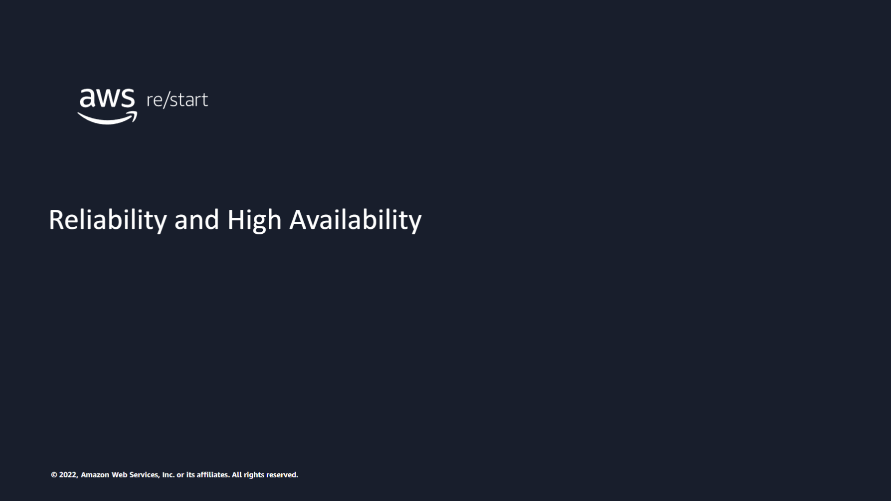
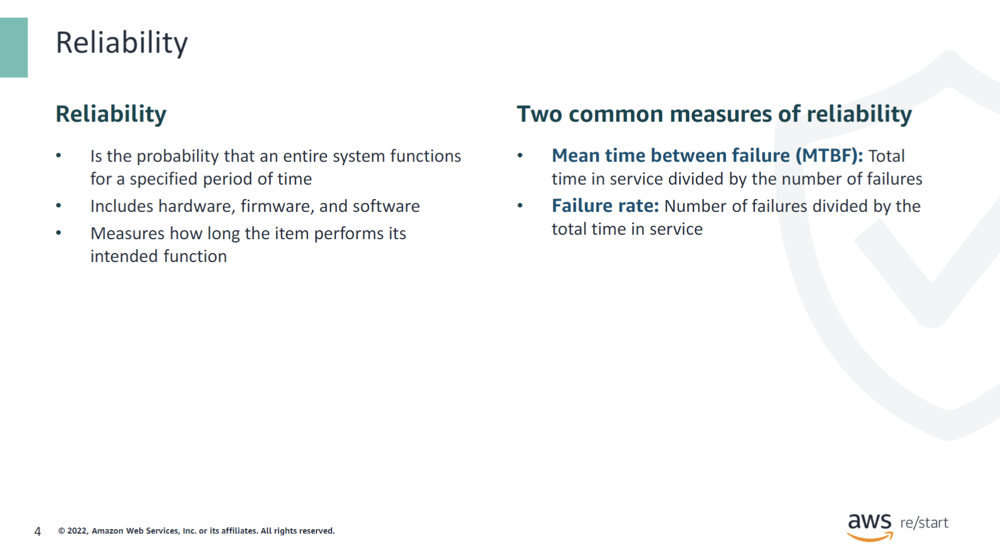
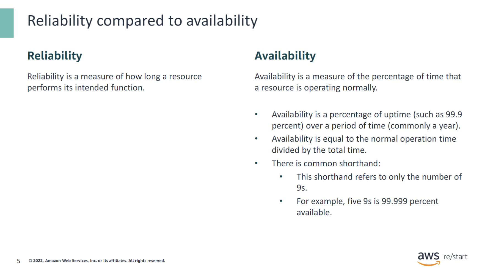
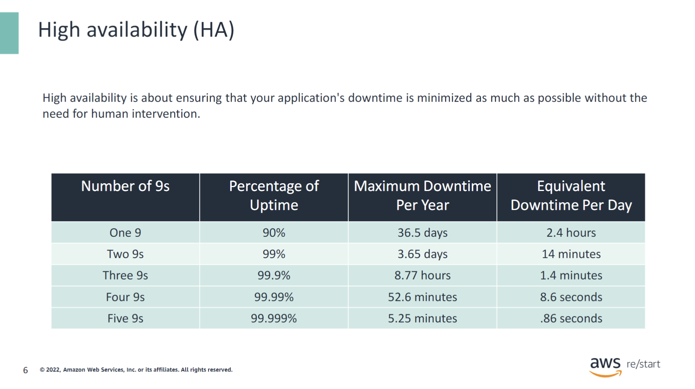
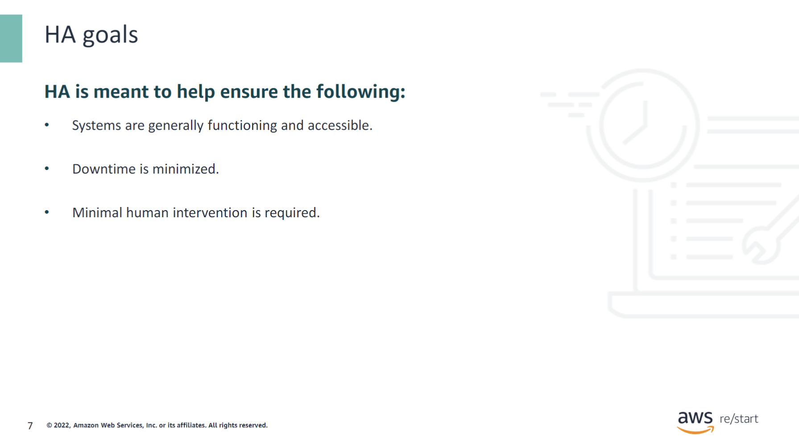
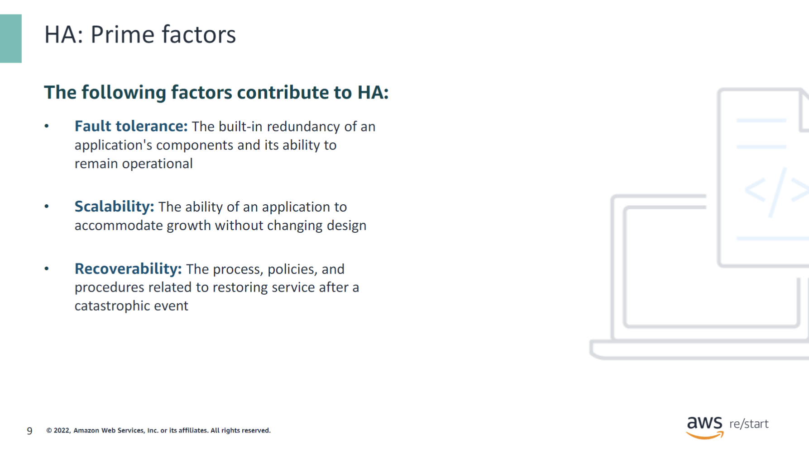
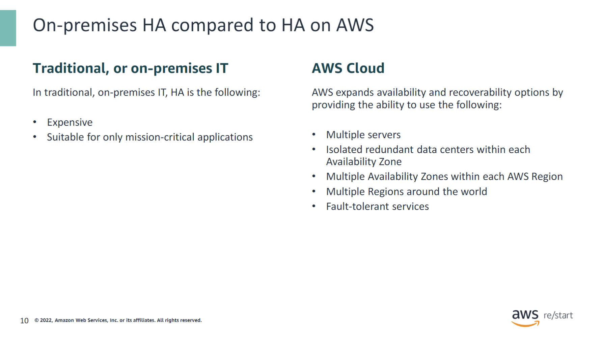
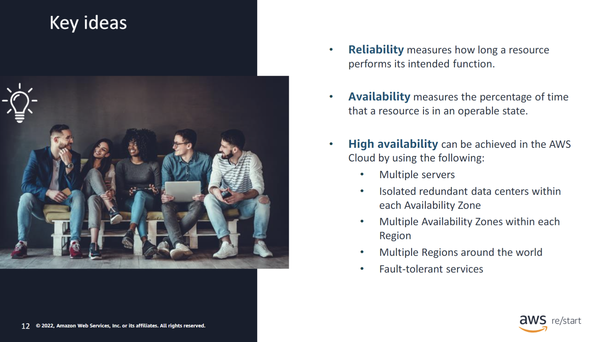

:::tip[You will learn how to do the following:]

- Compare and contrast between reliability and high availability.
- Explore the prime factors of high availability.

:::

## Reliability and high availability defined

Werner Vogels, CTO of Amazon.com, said, “Everything fails, all the time.”

Failures are costly to businesses. Reliability and high availability are crucial to preventing and mitigating failures.

### Reliability

Reliability is the probability that an entire system (including all hardware, firmware, and software) will satisfactorily function for a specified period of time. Reliability is a measure of how long the item performs its intended function.

There are two common measures of reliability. The first one is the mean time between failure (MTBF), which is the total time in service divided by the number of failures. The second one is the failure rate, which is the number of failures divided by the total time in service.

For example, when you purchase a vehicle, you purchase a system, or a collection of subsystems, that must work together for the vehicle to be considered reliable. The reliability of each of the subsystems—including the cooling, the ignition, and the brakes—is a part of determining the reliability of the vehicle. So, if you try to start the vehicle and the ignition fails, reliability is negatively impacted. Keep in mind that reliability is based on the entire system functioning as designed.

### Reliability compared to availability

Reliability is a measure of how long a resource performs its intended function. 

**What is the difference between reliability and availability?**

Reliability is closely related to availability. Reliability measures how long a resource performs its intended function. In contrast, availability measures the percentage of time that resources are in an operable state.

When looking at Amazon Web Services (AWS) services, you might see numbers like 99.99 percent. These numbers refer to the availability, or the percentage of time that a system or application is correctly performing the operations expected. A common shorthand refers to only the number of 9s. For example, five 9s is 99.999 percent available.

For more information, see Reliability Pillar at [AWS Well-Architected Framework](https://docs.aws.amazon.com/wellarchitected/latest/reliability-pillar/wellarchitected-reliability-pillar.pdf#welcome).

### High availability (HA)

Availability specifically refers to the amount of time that your system is in a functioning condition. In general terms, your availability is referred to as 100 percent minus your system's downtime.

High availability (HA) is about ensuring that your application's downtime is minimized as much as possible without the need for human intervention. It does not consider availability to be a series of replicated physical components. Instead, HA considers availability to be a set of system-wide, shared resources that cooperate to guarantee essential services. HA combines software with open standard hardware to minimize downtime by quickly restoring essential services when a system, component, or application fails. Though the restore actions are not instantaneous, services are restored rapidly, often in less than 1 minute.

Because events that can disrupt your system's availability are never entirely predictable, there are always ways to make an application more available. However, keep in mind that improving availability usually leads to increased cost. When considering how to make your environment more available, it is important to balance the cost of the improvement with the benefit to your users.

Does HA mean that you ensure that your application is always alive or reachable? Or does it mean that the application will service requests with an acceptable level of performance?

### HA goals

HA is a concept that regards the entire system. Its goal is to help ensure that your systems are always functioning and accessible and that downtime is minimized as much as possible without needing human intervention.

Users can use the AWS Cloud to build fault-tolerant, highly available systems and architectures. Users can build these systems with minimal human interaction and upfront financial investment. It is all customizable to your needs.

## High availability prime factors

### HA: Prime factors

Fault tolerance, recoverability, and scalability are the prime factors that determine the overall availability of your application.

Fault tolerance is often confused with high availability. Fault tolerance refers to the built-in redundancy of an application's components and its ability to remain operational even if some of that system’s components fail. Fault tolerance relies on specialized hardware to detect a hardware fault and instantaneously switch to a redundant hardware component. This redundancy applies whether the failed component is a processor, memory board, power supply, I/O subsystem, or storage subsystem. The fault-tolerant model does not address software failures, which is by far the most common reason for downtime.

Scalability is a question of how quickly your application's infrastructure can respond to increased capacity needs. Its goal is to ensure that your application is available and performs within your required standards. It does not guarantee availability, but it is one part of your application's availability.

Recoverability is often overlooked as a component of availability. If a natural disaster makes one or more components unavailable or destroys your primary data source, can you restore service quickly and without lost data?

It is these non-functional requirements that typically define the design of your infrastructure. A highly available and fault-tolerant environment can span multiple Availability Zones and AWS Regions. However, this design has costs associated with it that must be balanced with the availability requirements.

### On-premises HA compared to HA on AWS

To understand the differences between availability solutions in on-premises environments and in the cloud, you can compare them.

Traditionally, ensuring high availability (HA) in your local data centers can be expensive. Building overhead costs and system maintenance can add up quickly depending on the level of availability required. Maintaining highly available servers not located in the same Region can also be costly.

However, on AWS, you can expand availability and recoverability among whatever servers you choose with options customizable to your needs. AWS provides options within each service that you can implement to increase availability and recoverability.

For example, Amazon Relational Database Service (Amazon RDS) databases provide options to automatically deploy databases with a standby replica in a different Availability Zone.

## Checkpoint questions

What is the definition of reliability?

Reliability is a measure of how long a resource performs its intended function.

What is the difference between high availability and fault tolerance?

Fault tolerance combined with scalability and recoverability make up high availability. Fault tolerance on its own refers to the built-in redundancy of an application's components and its ability to remain operational even if some of the components of that system fail.

How is high availability made possible in the cloud?

In order to deliver high availability in the cloud to customers, AWS uses the following:
- Multiple servers
- Isolated redundant data centers within each Availability Zone
- Multiple Availability Zones within each Region
- Multiple Regions around the world
- Fault-tolerant services

## Key ideas

:::tip[Key ideas:]

- Reliability measures how long a resource performs its intended function.

- Availability measures the percentage of time that a resource is in an operable state.

- High availability can be achieved in the AWS Cloud by using the following:
  - Multiple servers
  - Isolated redundant data centers within each Availability Zone
  - Multiple Availability Zones within each Region
  - Multiple Regions around the world
  - Fault-tolerant services

:::
