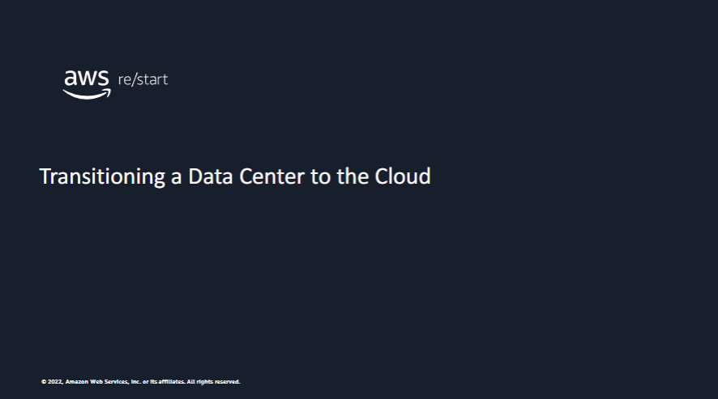
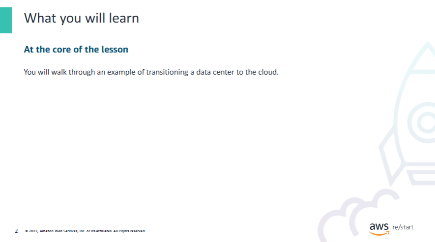
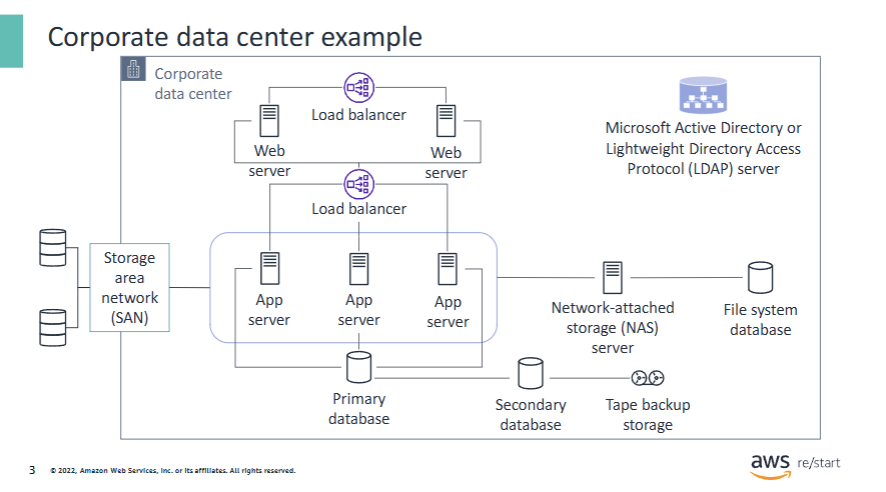
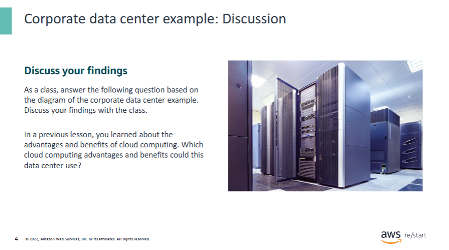
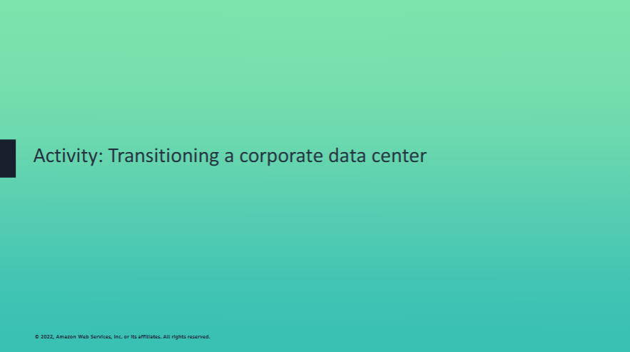
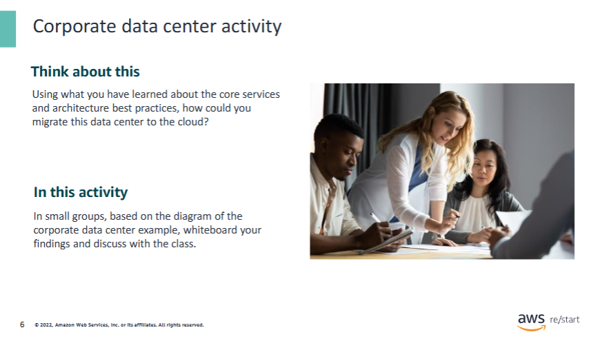
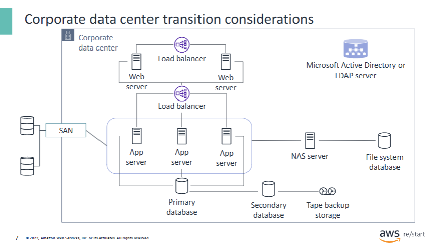
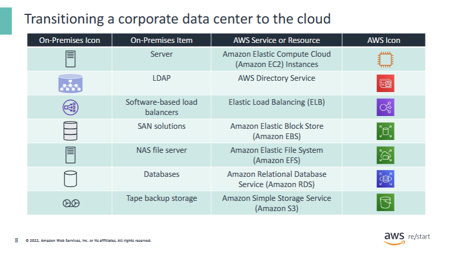
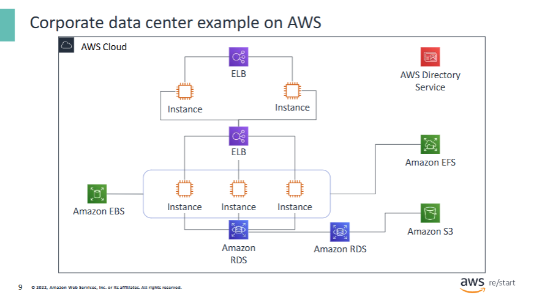
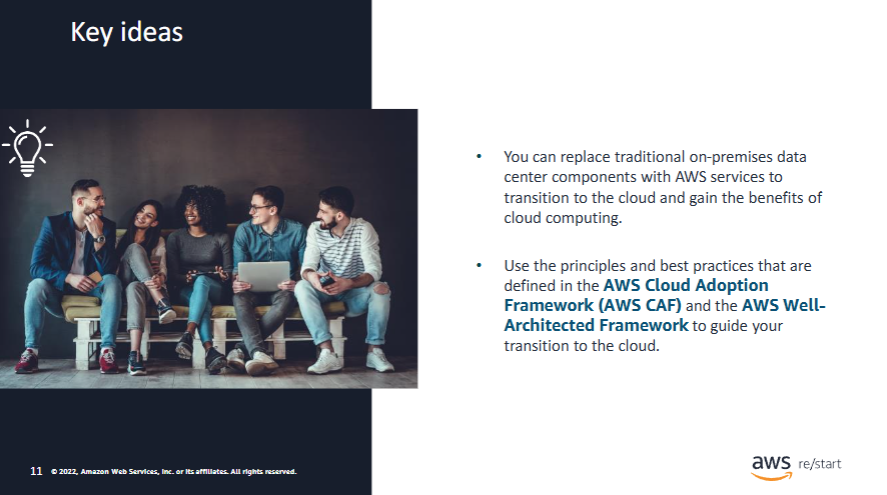

Welcome to Transitioning a Data Center to the Cloud.

In this lesson, you will walk through an example of transitioning a data center to the cloud. You will first learn about the components and characteristics of an example corporate data center. Then, you will walk through how an environment like this example could be set up and run on Amazon Web Services (AWS) instead.

A traditional **on-premises infrastructure** (or corporate data center) might include a setup that is similar to this example.

This diagram represents a **three-tier, client-server architecture** in a corporate data center.  
The box labeled **Corporate Data Center** indicates what is contained in the data center.

---

### Database Tier (Bottom of the diagram)

- **Database servers** with attached **tape backup devices**  
- Responsible for the **database logic**

---

### Application Tier (Middle of the diagram)

- **Application servers**:  
  - Component-based products in the middle tier of a server-centric architecture  
  - Provide **middleware services** such as:
    - **Security**
    - **State maintenance**
    - **Data access and persistence**
  - Contain the **business logic**

- **Network-Attached Storage (NAS)**:  
  - File servers providing a **centralized location** for users to:
    - Store
    - Access
    - Edit
    - Share files

---

### Web Tier (Top of the diagram)

- **Web servers**:  
  - Responsible for the **presentation logic**

- **Load balancers**:  
  - Efficiently **distribute incoming network traffic** across a group of backend servers

---

### Additional Infrastructure Components

- **Microsoft Active Directory** or **Lightweight Directory Access Protocol (LDAP)** server:  
  - Acts like a **phone book** to locate:
    - Organizations
    - Individuals
    - Resources (e.g., files, devices) on a network  
  - Used on the **public internet** or a **corporate intranet**

---

### Storage Area Network (SAN)

- Labeled in a box **outside the corporate data center**  
- SAN is a specialized, **high-speed network** that provides **block-level** network access to storage  
- SANs are used to:
  - Improve **application availability** (e.g., multiple data paths)  
  - Enhance **application performance** (e.g., offload storage functions, separate networks, etc.)

Earlier, you learned about the advantages and benefits of cloud computing.  
Consider the following advantages during your group discussions:

- **Trade upfront costs for variable costs**:  
  Stop buying hardware.

- **Benefit from massive economies of scale**:  
  Benefit from the purchasing power of AWS.

- **Eliminate guessing your capacity needs**:  
  Construct a flexible, highly available solution by using **scaling**.

- **Increase speed and agility**:  
  Deploy and decommission with just a few clicks.

- **Stop spending money to run and maintain data centers**:  
  Purchase only the services that you need.

- **Go global in minutes**

While in your small group, try to draw the diagram and replace components with AWS services.

Consider the following items and which **AWS core services** could replace them:

- **Servers**  
- **LDAP server**  
- **Software-based load balancers**  
- **SAN solutions**  
- **NAS file server**  
- **Databases**

You could replace a traditional on-premises or corporate data center with the following **AWS Cloud services**:

---

### 🖥️ Servers → Amazon EC2

- Replace on-premises **web servers** and **app servers** with **Amazon Elastic Compute Cloud (EC2)** instances.
- EC2 supports various OS types: Microsoft Windows Server, Red Hat, SuSE, Ubuntu, Amazon Linux.
- Run the same server applications in the cloud.

---

### 🧾 LDAP Server → AWS Directory Service

- Replace your LDAP server with **AWS Directory Service**, which supports **LDAP authentication**.
- Set up and run **Microsoft Active Directory in the cloud** or connect to an existing on-premises Active Directory.

---

### ⚖️ Software-Based Load Balancers → Elastic Load Balancing (ELB)

- Use **Elastic Load Balancing (ELB)** to replace traditional load balancers.
- ELB is fully managed, auto-scales, and performs **health checks** and **traffic redistribution**.

---

### 💽 SAN Solutions → Amazon Elastic Block Store (EBS)

- Replace SAN (Storage Area Network) solutions with **Amazon EBS**.
- Attach **EBS volumes** to EC2 instances to store persistent data and share across instances.

---

### 📁 NAS File Server → Amazon Elastic File System (EFS)

- Use **Amazon EFS** to replace a NAS file server.
- EFS is a scalable **file storage** service for EC2 instances.
- Automatically **grows and shrinks** as files are added or removed.
- Alternative: Run NAS software on EC2, available via [AWS Marketplace](https://aws.amazon.com/marketplace/).

---

### 🗄️ Databases → Amazon RDS

- Use **Amazon Relational Database Service (RDS)** to replace traditional database servers.
- Supports: **Amazon Aurora**, **PostgreSQL**, **MySQL**, **MariaDB**, **Oracle**, **Microsoft SQL Server**.
- AWS manages patching, backups, and failover.

---

### ☁️ Backup Storage → Amazon S3

- Automatically back up **RDS instances** to **Amazon S3**.
- Replace on-premises backup hardware with **object storage**.
- S3 supports:
  - Objects up to 5 GB
  - **Versioning**
  - Web-based access

After transitioning to the **AWS Cloud**, the example data center might look like this diagram:

- The **ELB (Elastic Load Balancer)** distributes traffic to the **web servers** that are now located on **EC2 instances**.

- The **LDAP server** is now replaced by **AWS Directory Service**.

- **ELB** has replaced **software-based load balancers** and continues to **distribute traffic** to EC2 instances.

- **Amazon EBS** has replaced the **SAN solutions**.

- **Amazon EFS** has replaced the **NAS file server**.

- **Amazon RDS** has replaced the **databases**.

1. Which AWS services can organizations use to transition a data center to the cloud?

Organizations can transition components of traditional data centers to AWS services by selecting the appropriate service to fulfill the business need.  
Like in the lesson example, organizations can transition the following over to the associated AWS services:

- A traditional **web server** → **Amazon EC2**
- **LDAP** → **AWS Directory Service**
- **Software-based load balancers** → **Elastic Load Balancing (ELB)**
- **SAN solutions** → **Amazon EBS**
- **NAS file server** → **Amazon EFS**
- **Databases** → **Amazon RDS**
- **Tape backup storage** → **Amazon S3**

2. What are some of the benefits of transitioning a data center to the cloud?

- **Trade upfront costs for variable costs**: Stop buying hardware.  
- **Benefit from massive economies of scale**: Leverage AWS's purchasing power.  
- **Eliminate guessing your capacity needs**: Use auto scaling for flexibility and high availability.  
- **Increase speed and agility**: Deploy and decommission with just a few clicks.  
- **Stop spending money to run and maintain data centers**: Pay only for what you use.  
- **Go global in minutes**.

3. Which AWS service can replace a data center SAN system?

**Amazon EBS** (Elastic Block Store)

