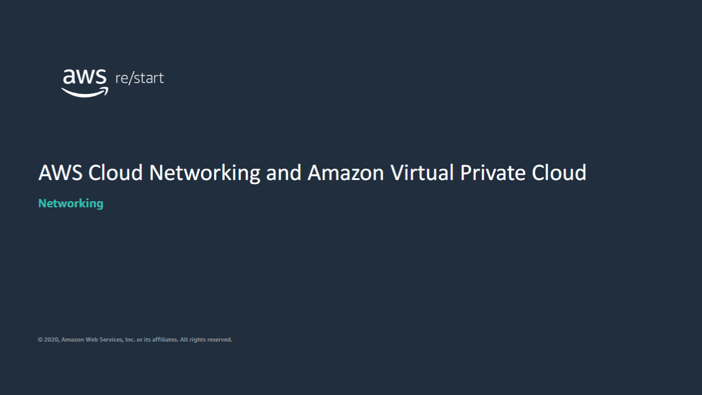

Welcome to AWS Cloud Networking and Amazon Virtual Private Cloud. This lesson will introduce cloud networking and Amazon Virtual Private Cloud (Amazon VPC).

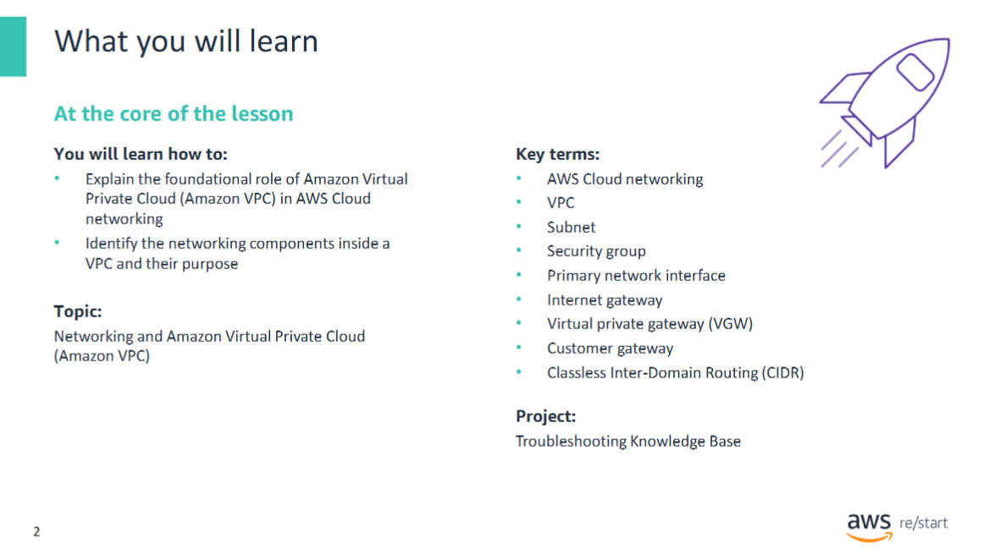

## Learning Objectives

At the end of this module, you will be able to:

- Explain the foundational role of **Amazon Virtual Private Cloud (VPC)** in AWS Cloud networking.
- Identify the networking components inside a VPC and their purpose.

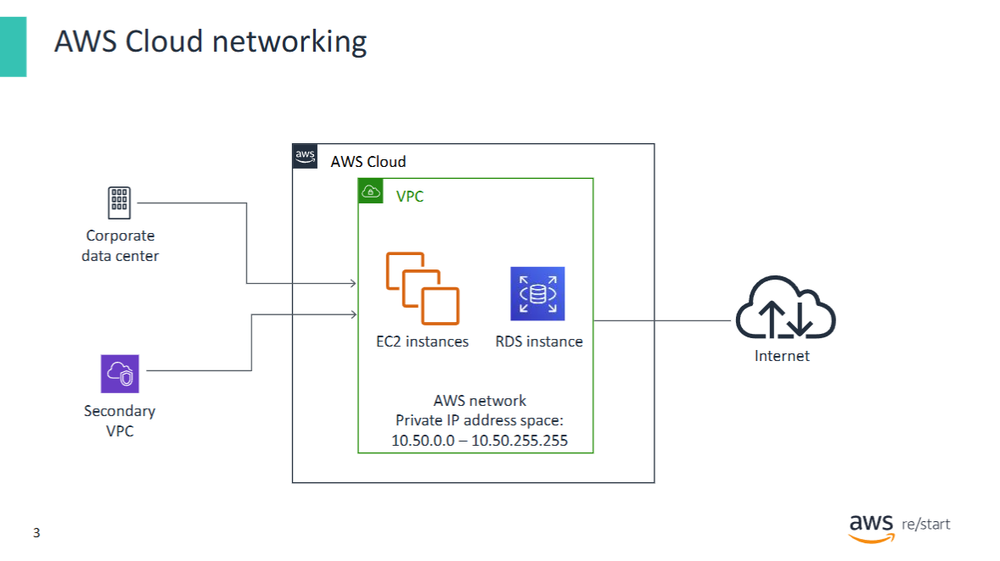

## Introduction to Cloud-Based Networking and VPC

In its most basic form, a cloud-based network is a **private IP address space** where you can deploy computing resources.

In **Amazon Web Services (AWS)**, a **Virtual Private Cloud (VPC)** provides this private network space. A VPC enables you to define a virtual network in your own **logically isolated area** within the AWS Cloud.

Inside this virtual network, you can deploy AWS computing resources, such as:

- **Amazon Elastic Compute Cloud (Amazon EC2)**
- **Amazon Relational Database Service (Amazon RDS)**

You can also define how—and whether—your private network space connects to endpoints in your network topology.

### Example Scenario

In the example:

- A VPC contains **three EC2 instances** and **one RDS instance**.
- The VPC is connected to:
  - The **internet**
  - The **corporate data center**
  - A **secondary VPC**

---

## Networking Components in a VPC

As a **systems operator**, you have control over the VPC networking components. Therefore, it's important to understand how to **configure** and **use** them effectively.

Even if you've seen some of these components before, a **brief review** of what they are and how they relate to each other is beneficial before examining them in more detail.

> You will review this topic next.

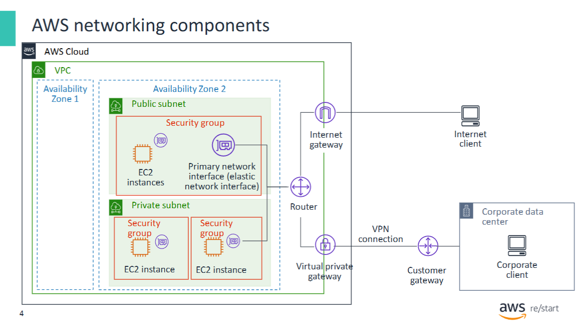

## Key AWS Networking Components in a VPC

This diagram shows the main **AWS networking components** that reside in a **Virtual Private Cloud (VPC)**. It also highlights the key components that enable connectivity to external clients.

A VPC can **span multiple Availability Zones**, and its key component types include:

### • Subnet

- Subnets are **logical network segments** within your VPC.
- They subdivide the VPC network into smaller networks **within a single Availability Zone**.
- A subnet is:
  - **Public** if it is attached to an internet gateway
  - **Private** if it is not
- A subnet is **required** to deploy an instance into a VPC.

### • Security Group

- A security group is a set of **firewall rules** that secure instances.
- They **allow or block inbound and outbound traffic** (stateful).
- If no group is specified at launch, the instance is assigned to the **default security group**.
- Security groups are **associated with instances**.

### • Primary Network Interface (Elastic Network Interface)

- An **Elastic Network Interface (ENI)** is a virtual network interface (NIC) that connects an instance to a network.
- Each instance in a VPC has a **default primary network interface**, which **cannot be detached** from the instance.

### • Router

- A **router** is a component that **routes traffic** within the VPC.

### • Internet Gateway

- An **internet gateway** enables communication between **instances in a VPC and the internet**.

### • Virtual Private Gateway

- A **virtual private gateway** is defined on the **AWS side** of a **VPN connection**.
- It provides a **secure and encrypted tunnel** between two network endpoints.

### • Customer Gateway

- A **customer gateway** is a **physical device or software application** on the **client side** of a VPN connection.

---

Throughout the rest of this topic, you will examine the **purpose and use** of these networking components in more detail.

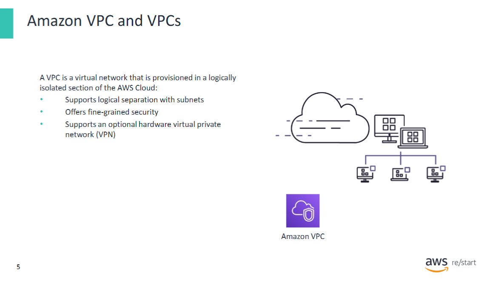

## Definition and Characteristics of a VPC

This slide shows the **formal definition of a Virtual Private Cloud (VPC)** and a description of some of its main characteristics.

- A **VPC is an isolated portion** of the AWS Cloud.
- You **provision a VPC** to deploy AWS infrastructure services.
- It is a **virtual network** that supports:
  - Multiple **subnets**
  - **Routing**
  - **Fine-grained security mechanisms**

### VPC Configuration

When you **create a VPC**, you define:

- The **IP address range**
- The **subnets**
- The **route tables**

Additionally, you can **optionally connect** your VPC to **on-premises corporate networks** using:

- **Network gateways**
- **Hardware VPN solutions**

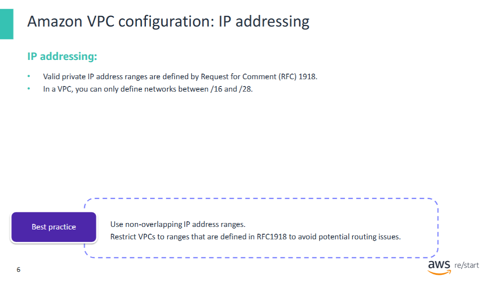

## Amazon VPC configuration: IP addressing

When you **create a VPC**, you must specify its **allowable IP address range**.

### IPv4 CIDR Block

- The range must be expressed in the form of a **Classless Inter-Domain Routing (CIDR) block**.
- This required range is called the **VPC’s primary CIDR block**.
- After creation, you can **optionally add up to four secondary CIDR blocks**.

> **CIDR Block Size Limits:**  
> VPCs can only have CIDR blocks ranging from **/16 to /28**, which equates to **16 to 65,536 IP addresses**.

### Best Practices

- Use IP address ranges defined in **RFC 1918**, which are reserved for private networks.
- Avoid address ranges that **overlap with other VPCs** to prevent conflicts, especially when connecting VPCs using a **hardware VPN**.

### IPv6 CIDR Block (Optional)

- You can assign an **IPv6 CIDR block** to a VPC.
- This block is:
  - **Provided by AWS**
  - Uses a **fixed prefix length of /56**
  - Cannot be customized by the user
- The block is **assigned from AWS’s pool of IPv6 addresses**.

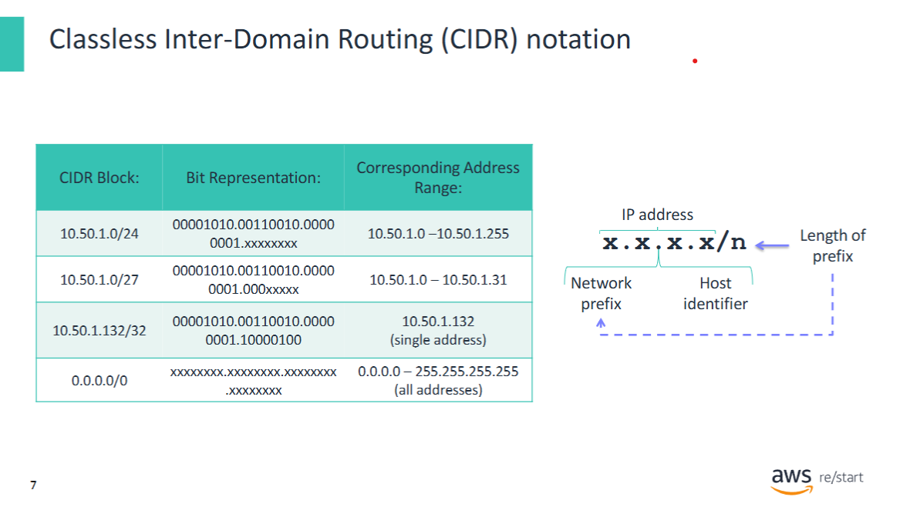

## Understanding CIDR Format in AWS

The **Classless Inter-Domain Routing (CIDR)** format is used to specify **IP address ranges** when you create a **VPC or a subnet**.

### CIDR Block Format

CIDR blocks follow the format:  
`x.x.x.x/n`

Where:

- `x.x.x.x` is an **IP address**:
  - An **IPv4 address** is a 32-bit number represented as four 8-bit numbers (bytes), separated by periods.
  - Each byte (`x`) can have a value between **0 – 255**.
  - The IP address is logically divided into:
    - A **network prefix**
    - A **host identifier**  
    These identify the **network** and the **host within the network**, respectively.

- `/n` specifies the **length in bits** of the **network prefix** (starting from the leftmost bit):
  - For IPv4, `n` can be in the range **0 – 32**.
  - In a VPC, `n` is restricted to values between **16 – 28**.

> **Note:**  
> The **larger the value of `n`**, the **smaller** the CIDR block becomes.  
> This means **fewer usable IP addresses** in the range.

### CIDR Block Examples

The following table illustrates how different CIDR blocks translate into IP address ranges and usable host addresses:

| CIDR Block | Total Addresses | Usable Addresses | Comment |
|------------|------------------|------------------|---------|
| /28        | 16               | 11               | Very small subnet |
| /24        | 256              | 251              | Common for local networks |
| /16        | 65,536           | 65,531           | Maximum size for VPC |

*(Usable addresses may vary slightly depending on AWS reserved addresses)*


## Creating a VPC via AWS CLI

The following screen shows the **AWS Command Line Interface (AWS CLI)** command used to create a VPC. The resulting output represents the **created VPC**, as it would appear in the AWS Console.

### Example AWS CLI Command

```bash
aws ec2 create-vpc --cidr-block 10.0.0.0/16
{
  "Vpc": {
    "CidrBlock": "10.0.0.0/16",
    "DhcpOptionsId": "dopt-32058557",
    "State": "pending",
    "VpcId": "vpc-012345678912",
    "InstanceTenancy": "default",
    "Ipv6CidrBlockAssociationSet": [],
    "CidrBlockAssociationSet": [
      {
        "AssociationId": "vpc-cidr-assoc-04ae2a5af46e7bb7c",
        "CidrBlock": "10.0.0.0/16",
        "CidrBlockState": {
          "State": "associated"
        }
      }
    ],
    "IsDefault": false,
    "Tags": []
  }
}
```
Note:
The "State": "pending" indicates that the VPC creation process has started and will transition to "available" once completed.

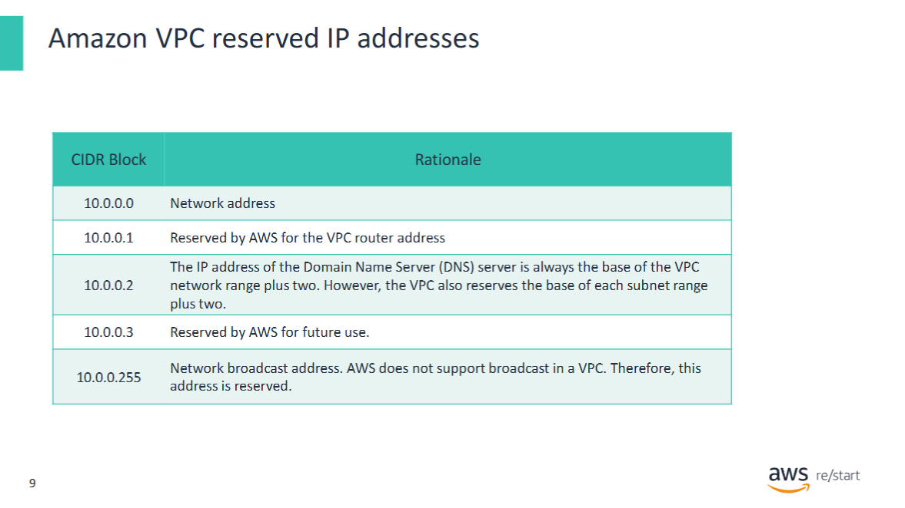

## Reserved IP Addresses in a Subnet

When working with subnets in a VPC, keep in mind:

- The **first four IP addresses** and the **last IP address** in each **subnet CIDR block** are **reserved** by AWS.
- These IPs **cannot be assigned to instances**.

### Example: Reserved IPs in `10.0.0.0/24`

In a subnet with CIDR block `10.0.0.0/24`, the following IP addresses are **reserved**:

| IP Address      | Purpose                           |
|------------------|------------------------------------|
| 10.0.0.0        | Network address                    |
| 10.0.0.1        | Reserved by AWS for VPC router     |
| 10.0.0.2        | Reserved by AWS                    |
| 10.0.0.3        | Reserved for future use            |
| 10.0.0.255      | Network broadcast address          |

---

## DNS Server IP in VPCs with Multiple CIDR Blocks

In **VPCs with multiple CIDR blocks**, the **DNS server IP address** is located within the **primary CIDR block**.


## Amazon VPC Overview

This diagram illustrates the **main characteristics** of a **Virtual Private Cloud (VPC)**:

- **VPCs can span multiple Availability Zones** within an AWS Region.
- **VPCs have an implicit router** that automatically routes traffic within the VPC.
- **VPCs include a default route table** that defines allowed outbound routes.

### Default Route Table Behavior

- The default route table includes a rule that **routes all traffic within the VPC's CIDR block locally**.
- For example, if the VPC's address range is `10.0.0.0/16`, the route table includes:

```text
Destination: 10.0.0.0/16  
Target: local
```
This rule ensures that traffic between instances in the same VPC is routed internally, without leaving the AWS network.

Next, you will explore how subnets and route tables are used in a VPC.

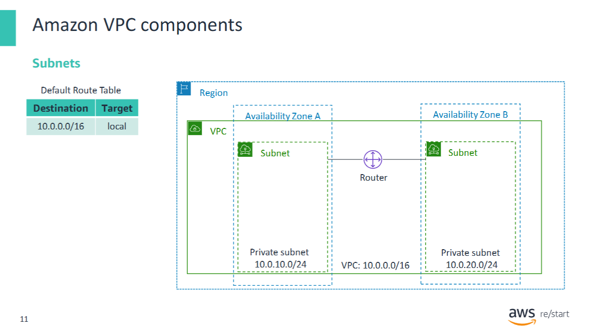

## Amazon VPC components

Subnets are used to further segment the **VPC address range** and to provide **logical groupings** for resources.  
For example, you can create separate subnets for:

- Different resource types (e.g., **Amazon EC2 instances**, **database instances**)
- Different visibility (**public** or **private**)
- Organizational divisions (**teams** or **departments**)

### Subnet Limits and Sizes

- You can create **up to 200 subnets per VPC**.
- For **IPv4**:
  - The **minimum subnet size** is **/28** (16 IP addresses).
- For **IPv6**:
  - The subnet size is **fixed to /64**.
  - Only **one IPv6 CIDR block** can be allocated per subnet.

### Examples of Private IPv4 Subnet Ranges for Amazon VPC

- `10.0.0.0 – 10.255.255.255` (`10.0.0.0/8`)
- `172.16.0.0 – 172.31.255.255` (`172.16.0.0/12`)
- `192.168.0.0 – 192.168.255.255` (`192.168.0.0/16`)

### Subnet Characteristics

This diagram illustrates the following key subnet characteristics:

- **Subnets can exist in only one Availability Zone**.
- The CIDR block of each subnet must be a **subset** of the **VPC's CIDR block**.
  - Example:
    - Subnet A (AZ A): `10.0.10.0 – 10.0.10.255`
    - Subnet B (AZ B): `10.0.20.0 – 10.0.20.255`
    - Both are within VPC range: `10.0.0.0 – 10.0.255.255`
- **Subnet CIDR blocks must not overlap**.
  - Example: `10.0.10.0/24` vs. `10.0.20.0/24` – valid and non-overlapping.
- **Traffic flows** to/from subnets via the **VPC’s implicit router**.

> **Note:**  
> Use a `/16` or smaller CIDR block from the private ranges listed. Examples:

| CIDR Block             | IP Range                        | Usable Hosts |
|------------------------|----------------------------------|---------------|
| 10.0.0.0/16            | 10.0.0.0 – 10.0.255.255          | 65,534        |
| 10.1.0.0/16            | 10.1.0.0 – 10.1.255.255          | 65,534        |
| 172.16.0.0/16          | 172.16.0.0 – 172.16.255.255      | 65,534        |
| 172.17.0.0/16          | 172.17.0.0 – 172.17.255.255      | 65,534        |
| 192.168.0.0/17         | 192.168.0.0 – 192.168.127.255    | 32,766        |
| 192.168.128.0/17       | 192.168.128.0 – 192.168.255.255  | 32,766        |

For more information, refer to **VPCs and subnets**.

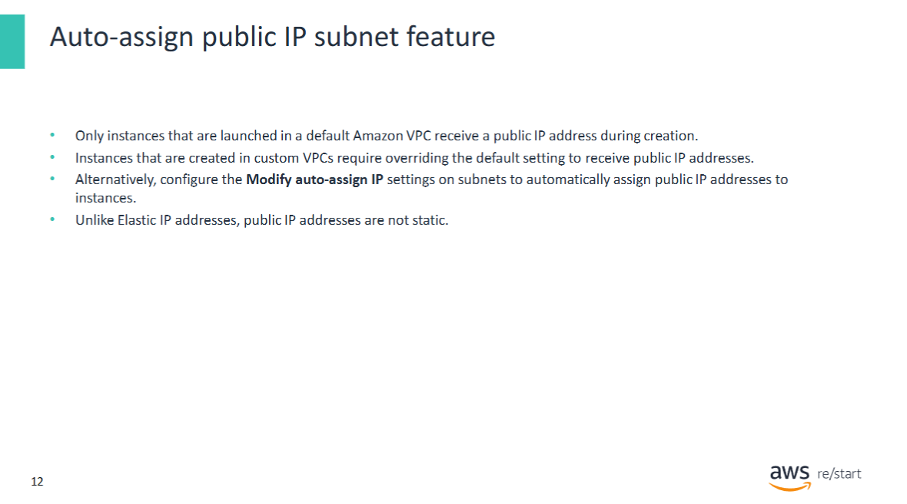

## Auto-Assigning Public IP Addresses to Subnet Instances

After you create a **subnet**, you can configure whether **new EC2 instances** launched into it should automatically receive a **public IP address**.

This setting is especially useful for **public subnets** that host EC2 instances intended to be accessible from the **internet**.

### Requirements for Public Access

Before an instance can be accessed publicly:

- It **must have a public IP address** assigned.
- You can enable **automatic assignment** of a public **IPv4 or IPv6 address** for all instances launched into the subnet.

### How to Enable Auto-Assign in the VPC Console

1. Open the **VPC Console**.
2. Go to the **Modify auto-assign IP settings** configuration page for the subnet.
3. Check the box:
   - `Enable auto-assign public IPv4/IPv6 address`

### Important Notes

- The auto-assigned IP address is **not an Elastic IP address**.
- It is **released** from the instance when the instance is **stopped or terminated**.
- An **Elastic IP address** is a **static IPv4 address** that remains associated with your AWS account and is **reachable from the internet**.


## VPC Routing and Route Tables

Each **VPC** comes with an **implicit router** that directs traffic:

- Between resources in each **subnet**
- **Out of the subnet**, depending on route rules

The router uses a **route table** to determine:

- Valid **IP destinations**
- The **target** to reach each destination

### Route Table Overview

A **route table** is a mechanism used for routing traffic originating from a subnet in a VPC.  
It contains a set of **rules** (called **routes**) that determine where traffic is sent.

Each **route** consists of:

- **Destination** – the IP range for the traffic
- **Target** – where to send the traffic

The router interprets the route as:  
> "Any traffic that goes to *destination* should be routed through *target*."

Possible **targets** include:

- A specific **instance ID**
- An **elastic network interface ID**
- An **internet gateway**
- A **virtual private gateway**

### Default Route Table

When a **VPC is created**, a **default route table** is also created.

- This table includes a rule that **routes all traffic within the VPC’s CIDR range locally**.
- **New subnets** are automatically **associated** with the default route table.
- You can:
  - **Add more routes** to the default table
  - Create a **custom route table** and **associate it** with a subnet

### Internet Gateway Integration

A VPC can have an **internet gateway** attached.

- This gateway enables **traffic to the internet**
- **Public subnets** can use it via route table entries

---

### Diagram Example

- **Subnet 2**:
  - Associated with the **default route table**
  - Contains a **single route**:
    - `Destination: 10.0.0.0/16`
    - `Target: local`
  - Traffic is only allowed within the VPC's address range.

- **Subnet 1**:
  - Associated with a **custom route table**
  - Contains **two routes**:
    1. `Destination: 10.0.0.0/16` → `Target: local`  
       (same as default, allows local traffic)
    2. `Destination: 0.0.0.0/0` → `Target: IGW-ID`  
       (allows all other traffic to go through the **internet gateway**)

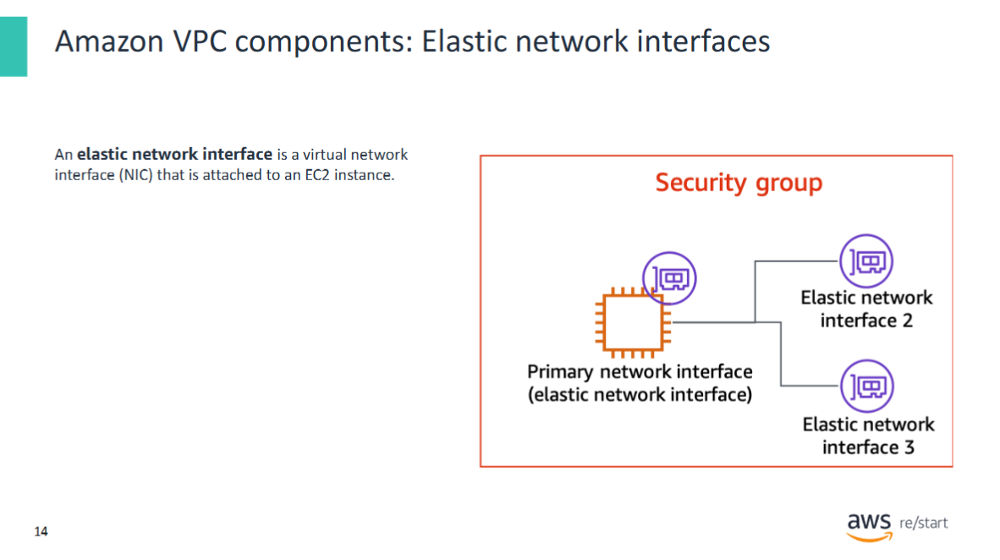

## Elastic Network Interfaces (ENIs)

An **Elastic Network Interface (ENI)**, also called a **network interface (NIC)**, is a **virtual network interface** that is attached to an **EC2 instance**.

### Purpose and Features

- Provides the **connection point** between an instance and the network
- Each ENI has:
  - One **primary IP address**
  - Optionally, **secondary IP addresses**
  - A **MAC address**
  - One or more **security groups**

### Primary Network Interface

- Every EC2 instance in a VPC has a **default NIC**, called the **primary network interface**
- It is assigned a **private IPv4 address** from the VPC’s address range
- The **primary NIC cannot be detached** from the instance

### Secondary Network Interfaces

- You can **create and attach additional NICs** to an instance
- The **number of attachable NICs** depends on the **instance type**
- A secondary NIC can:
  - Be **attached** to an instance
  - Be **detached** from one instance
  - Be **re-attached** to another instance
- The NIC retains its **attributes** (IP addresses, MAC, security groups) when moved
- When moved, **network traffic is redirected** to the new instance

---

## Use Cases for Multiple NICs

### • Network and Security Appliances in a VPC

- Appliances like **load balancers**, **NAT servers**, and **proxy servers** may benefit from multiple NICs
- You can:
  - Attach **secondary NICs** to instances running such applications
  - Configure them with separate **public/private IPs** and **security groups**

### • Management-Only Network Interface

- A separate ENI can be used for **administrative tasks**, such as:
  - Uploading software updates
  - Downloading log files
- This ensures the **main (customer-facing) interface** bandwidth is not affected by management traffic

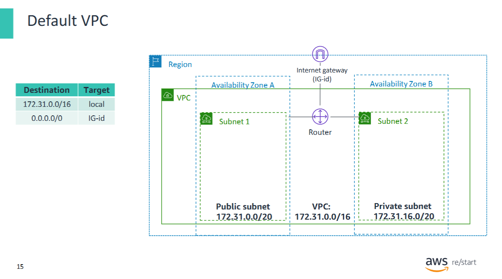

## AWS Default VPC

When you **create an AWS account**, AWS **automatically creates a default VPC** for you.

### Default VPC Characteristics

- **CIDR block**: `172.31.0.0/16`
- Provides up to **65,536 private IPv4 addresses**:
  - IP range: `172.31.0.0 – 172.31.255.255`
- Enables you to **immediately use VPC features** without manual setup

### Automatically Created Components

AWS also provisions the following resources in the default VPC:

- **Internet Gateway**  
  - Enables communication with the **internet**

- **Default Route Table**  
  - Routes traffic:
    - Within the VPC’s address range → **local**
    - To any other address → **internet gateway**

- **Public Subnets**  
  - One public subnet **per Availability Zone**
  - Subnet size: **/20** (up to 4,096 IP addresses)
  - **Auto-Assign Public IP** option is **enabled**
  - Any EC2 instance launched in the default VPC:
    - **Automatically receives a public IP**
    - Is placed in a **public subnet**, because the subnet is associated with a **route table** that allows internet access via the **internet gateway**

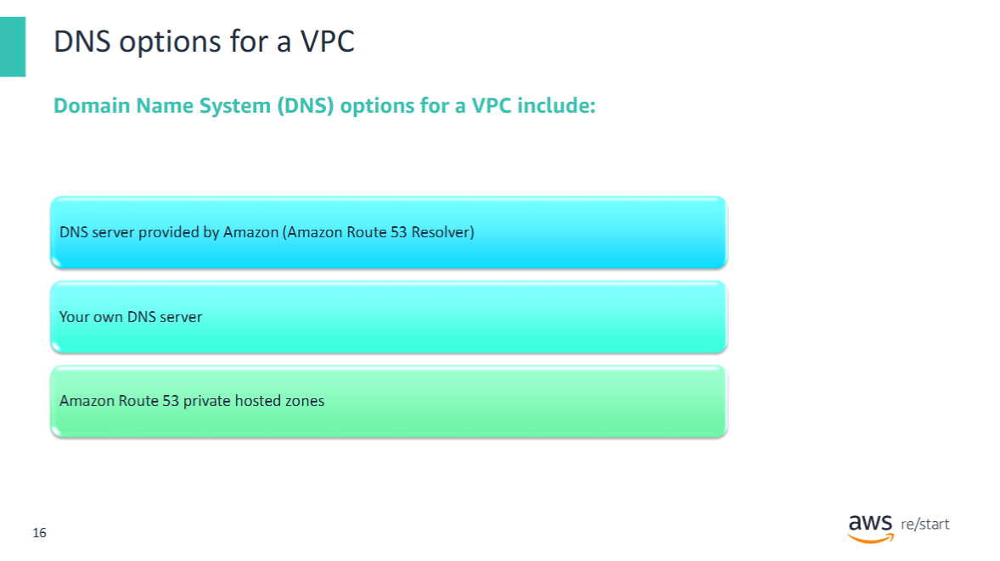

## DNS options for a VPC

A **Domain Name System (DNS)** server is used to **resolve hostnames** (e.g., `www.example.com`) to their corresponding **IP addresses** (e.g., `192.0.2.1`).

### Default DNS Behavior in a VPC

- When you **create a VPC**, AWS **automatically assigns a DNS server** to it.
- This DNS server is provided by Amazon and, since **December 2018**, is known as the **Amazon Route 53 Resolver**.
- By default, **Amazon Route 53 Resolver**:
  - Directly answers DNS queries for **domain names within the VPC**
  - Performs **recursive lookups** against public name servers for **external domains**

---

## Alternatives for Custom DNS Configuration

You can **customize DNS resolution** in your VPC with the following options:

### • Use Your Own DNS Server

- Requires configuring a custom **DHCP options set** for the VPC

### • Use an Amazon Route 53 Private Hosted Zone

- A **hosted zone** is a container that holds DNS information for domains within a VPC
- Two types:
  - **Public Hosted Zone**:
    - Routes **internet traffic** to resources inside a VPC
    - Example: A customer accesses a company website hosted on an EC2 instance
  - **Private Hosted Zone**:
    - Routes **internal traffic** within one or more VPCs
    - Does **not expose resources to the internet**

---

## Split-Horizon DNS

A common use case for private hosted zones is implementing a **split-horizon DNS**:

- Uses **both a private and a public hosted zone** for the **same domain name**
- DNS resolution differs depending on where the query originates:
  - **Inside the VPC**: hostname resolves to **internal IP**
  - **Outside the VPC**: hostname resolves to **external IP**
- **Use case example**:
  - Host an **internal** and **external** version of the same website
  - Use the **same domain name** for both versions
  - Allows users inside the VPC to access the internal version seamlessly

---

## Further Reading

- [Using DNS with your VPC](https://docs.aws.amazon.com/vpc/latest/userguide/vpc-dns.html)
- [Working with private hosted zones](https://docs.aws.amazon.com/Route53/latest/DeveloperGuide/hosted-zone-private.html)

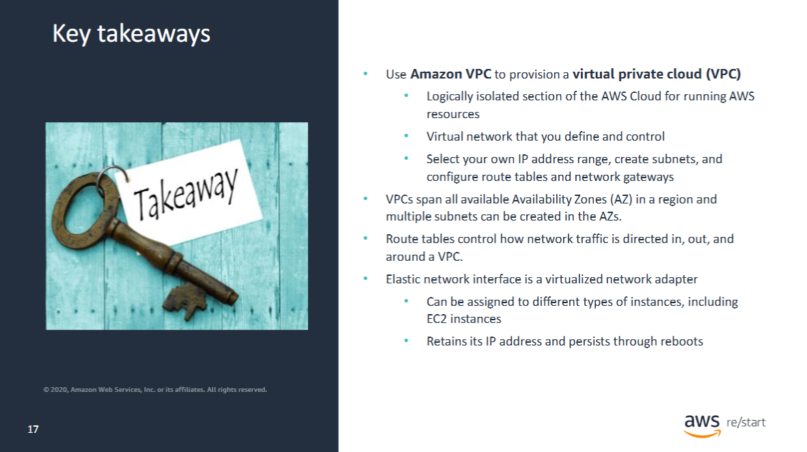

## Key Takeaways from This Module

- Use **Amazon VPC** to provision a **Virtual Private Cloud**
- A VPC is a **logically isolated section** of the AWS Cloud for running AWS resources
- It is a **virtual network** that **you define and control**

### VPC Capabilities

- Select your own **IP address range**
- Create **subnets**
- Configure **route tables** and **network gateways**
- VPCs can:
  - Span **multiple Availability Zones**
  - Contain **multiple subnets**

### Network Routing

- **Route tables** control how network traffic is:
  - Directed **into**, **out of**, and **within** a VPC

### Elastic Network Interface (ENI)

- A **virtualized network adapter**
- Can be assigned to different types of instances (e.g., **EC2**)
- **Retains its IP address** and **persists through instance reboots**
