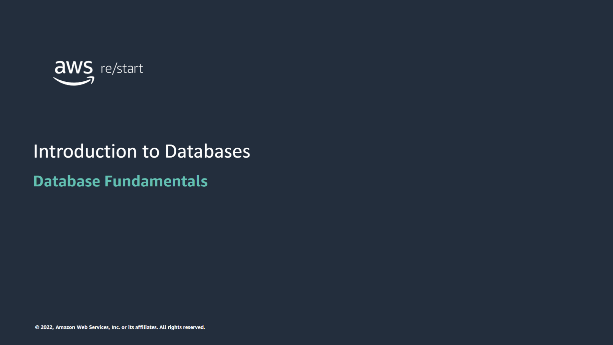

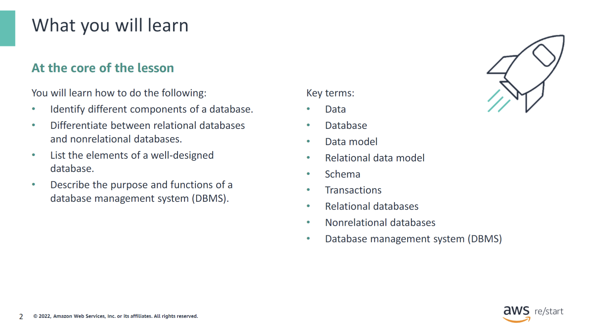

:::tip[In this module, you will learn how to do the following:]

- Identify different components of a database.
- Differentiate between relational databases and nonrelational databases.
- List the traits of a well-designed database.
- Describe the purpose and functions of a database management system (DBMS).

:::

## Data and databases

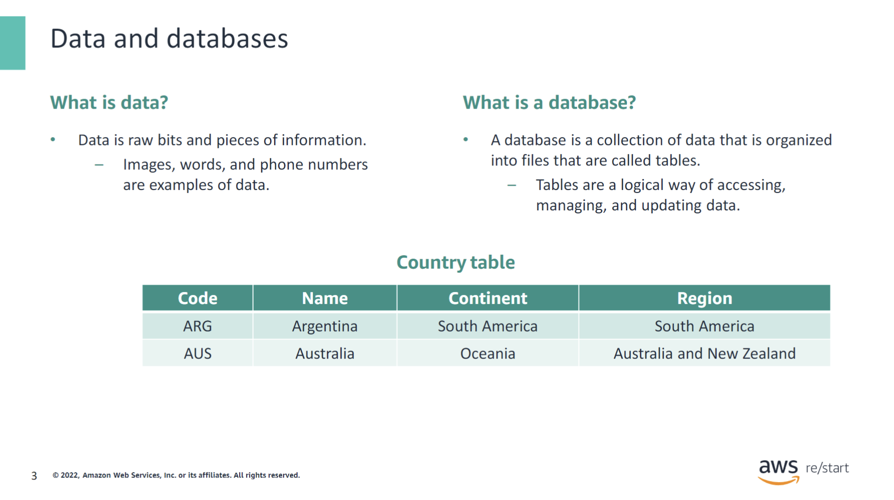

Data is raw bits and pieces of information. The bits of information that make up images, words, and phone numbers that you see on mobile phones or computer monitors are examples of data.

A database is a collection of bits of data that is organized into files, which are called tables. Tables are a logical way of accessing, managing, and updating data.

In a database, data can also appear in other formats, such as figures, graphics, images, and audio-video recordings.

## Data models

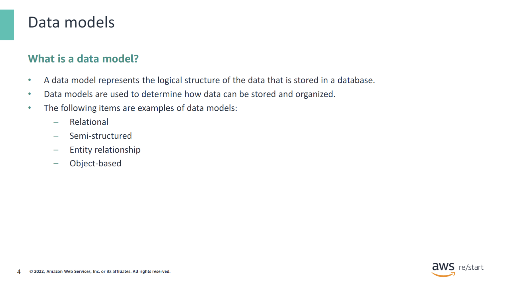

A data model represents the logical design and structure of adatabase. Data models are used to determine howdatacan be stored and organized. Relational, semi-structured, entity relationship, and object-based are all data model types. This course focuses mainly on the relational data model.

## Relational model

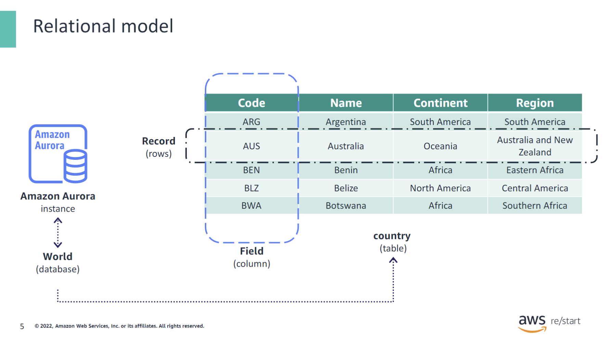

The relational model is a data model thatDr. Edgar F. Codd, a mathematician at IBM, developed in the late 1960s. Codd developed it to improve handling of large amounts of data. The relational model is based on a mathematical domain that is called relational algebra.

This slide provides an example of a relational model. Looking at the model, start with the database that is named World. Inside the Worlddatabase is a table. Tables are used to hold information about the objects to be represented in the database.The countrytable can have multiple records(which are also known as rows) and fields(which are also known as columns). Each row is a set of values for the columns of the table. In this example, each record or row contains information about a country. This table contains the country code, the country name, the country’s continent name, and the country’s region name.

Databases exist on the backend,or behind most data-driven applications, data-driven websites, and data-driven mobile apps.

## Schema

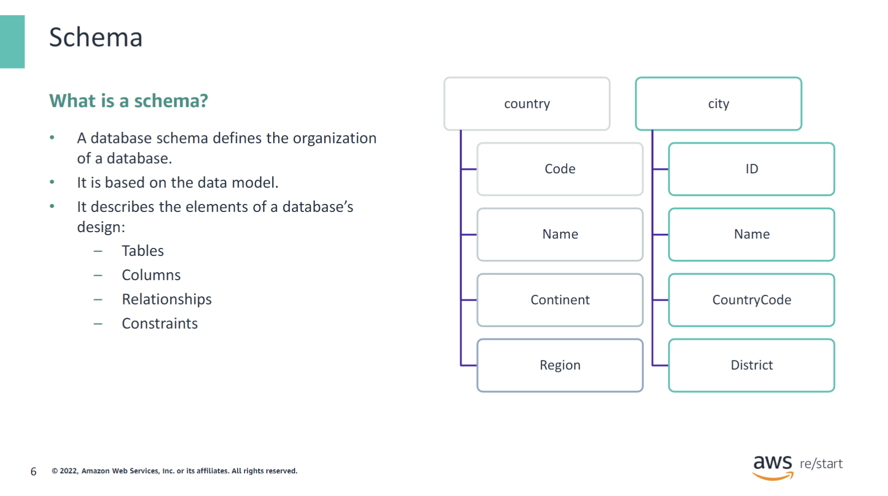

A database schema describes the organization of the data in a database. It contains the definition of tables, columns, constraints, and other elements identified in the database’s data model. The following are examples of elements defined in a schema:

- **Tables** represent the objects in the data model. For example, in the World database, `country` and `city` are tables.
- **Columns** represent the attributes of the objects in a table. For example, an object in the `country` table has a `Code`, `Name`, `Continent`, and `Region` attribute.
- **Relationships** represent the relations that exist between tables. For example, a `city` is located in a `country`. Therefore, in the `city` table, an attribute named `CountryCode` holds the code for the `country` where the `city` is located.
- **Constraints** represent the rules that affect the types of data or object relationships in the database. For example, a `CountryCode` value in the `city` table must exist as a `Code` value in the `country` table.

## Small scale or distributed

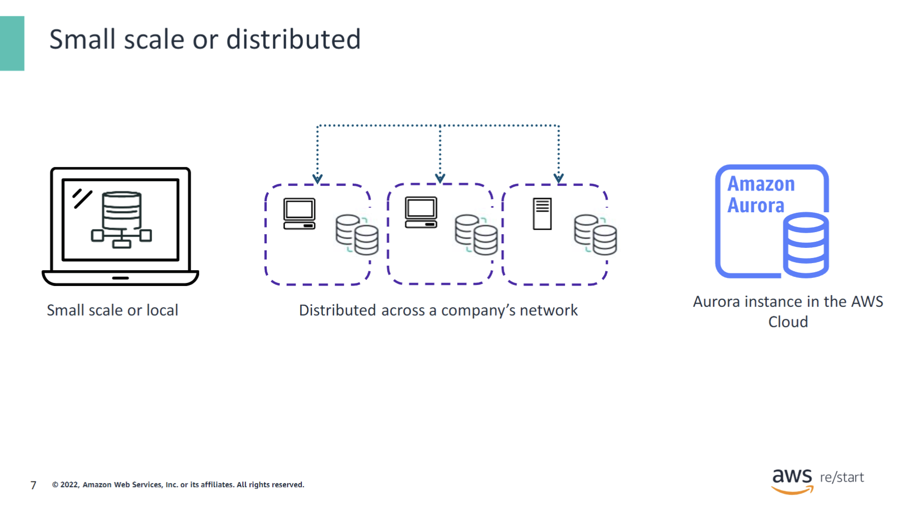

Databases can operate on a small scale. They might run on one computer and support a single user.

Other databases are distributed across multiple systems and locations across a company’s network, or they can be cloud-based databases that support millions of users.

## Relational databases

### Relational database basics

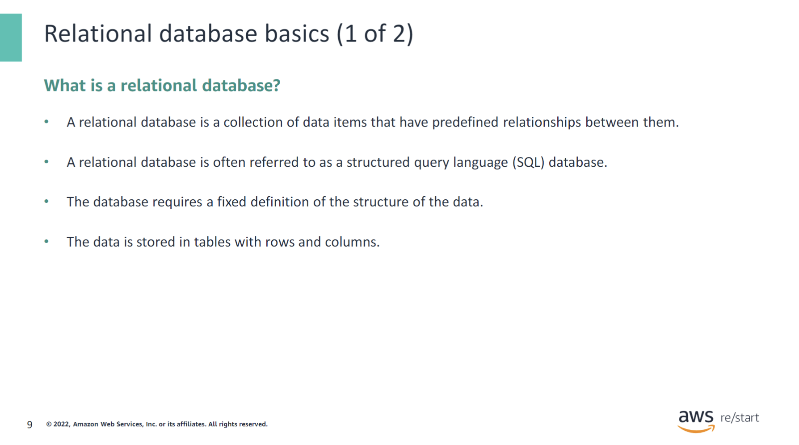

The following information describes relational database design:

- Tables are used to hold information about the objects to be represented in the database.
- The data is spread across multiple tables and stored inrows and columns.
- Data is accessed and queried based on the database schema.

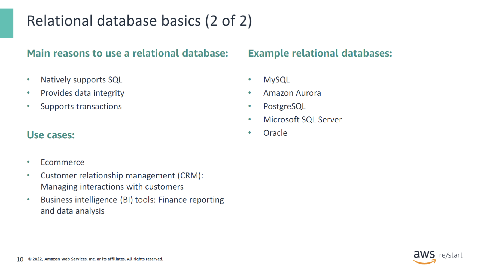

Relational databases are popular and continue to be used because they provide many benefits. For example, they support SQL, a language that is relatively simple to learn and get started with to query the data in a relational database. Also, a relational database provides features to protect the integrity of the data that you store. For example, each column attribute in a table is defined to hold only a certain type of data. If you attempt the enter a value that is of a different data type, the database will not allow it.

### Relational database examples

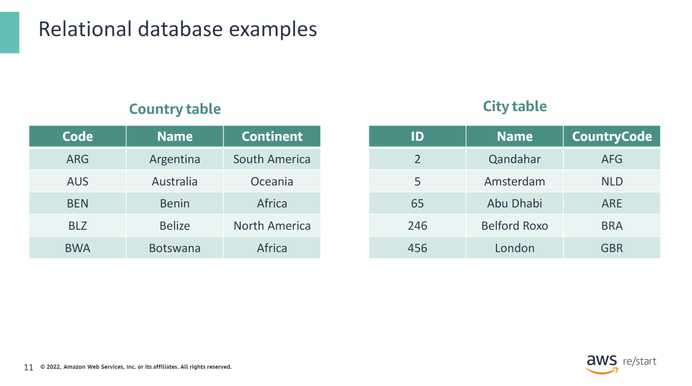

In relational databases, tables are used to hold information about the objects to be represented in the database. Each table is organized in columns and rows. Each column (or field) holds a special type of data, such as numbers, strings, or dates. Each row is a set of values for the columns of the table. Each row in a table can also be marked with a unique identifier, which is called a primary key. Rows among multiple tables can become related by using foreign keys. The following information provides examples:

- Each column in the table holds a certain type of data and stores the actual value of an attribute. In the `country` table, under the `Name` column, the kind of data expected is text or strings. "Argentina" and "Belize" are examples of actual values.
- The rows in the table represent a collection of related values of one object or entity. In the `city` table, the row that has an `ID` of 2 represents the attributes of the city of "Qandahar." The `ID` value is followed by the values of "Qandahar" and "AFG," which represent the city’s name and country code, respectively.

Can you identify how the first table can relate to the second table? The tables can be related by the `CountryCode` field. These related fields can link multiple tables and are called primary keys and foreign keys.

## Nonrelational databases

### Nonrelational database basics

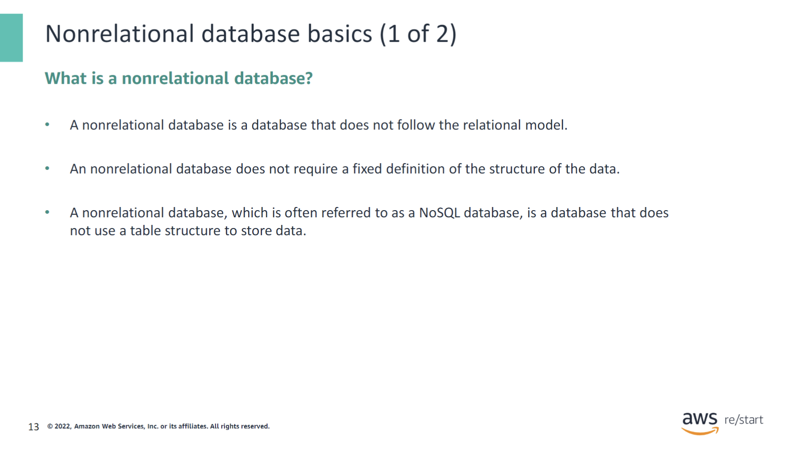

A nonrelational database is often referred to as a NoSQL database. NoSQLstands for Not only SQLbecause you can use other languages in addition to SQL to access and query a nonrelational database.

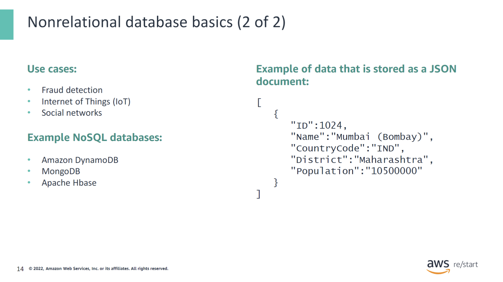

In a relational database, objects are broken down into multiple tables (customers, orders, and more) by using a fixed schema. With a nonrelational database, objects are stored instead with flexible schemas with no constraints, or as documents in JSON or XML formats.

NoSQL databases use various data models for accessing and managing data. These types of databases are optimized specifically for applications that require large data volumes, low latency, and flexible data models. These requirements are achieved by relaxing some of the restrictions around data consistency that other databases use.

## Pros and cons of relational and nonrelational databases

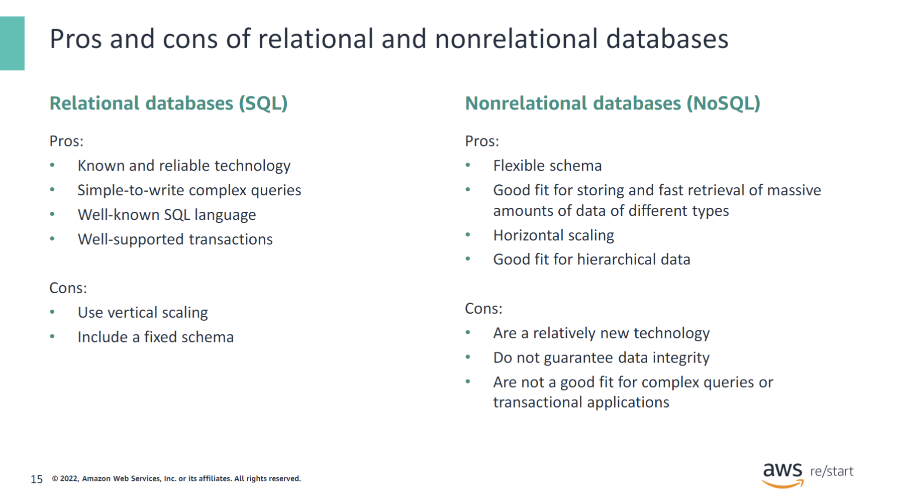

## DBMS (Database Management Software)

### DBMS basics

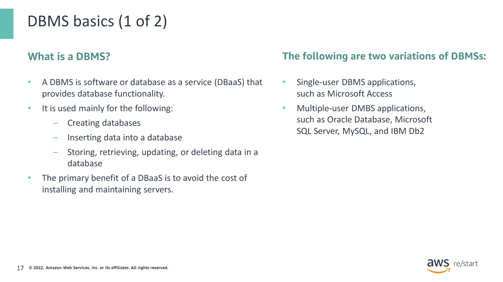

How do you store and manage data in a database? You use a DBMS.

A DBMS is software or database as a service(DBaaS). It is used mainly for creating databases; inserting data into a database; and storing, retrieving, updating, or deleting data in the database.

If you want to avoid the cost of installing and maintaining the servers that your database uses, use a DBaaS service. A DBaaS manages the infrastructure to support your database so that you can focus on designing, creating, and maintaining the data in your database.

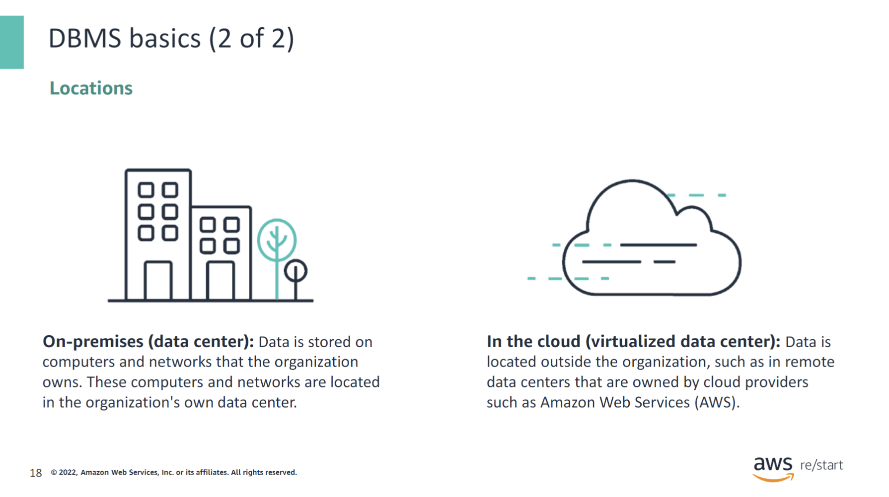

With traditional database management, a company uses a DBMS in an on-premises data center. The company must invest in the hardware and software resources needed to support the DBMS.

With DBaaS, the DMBS is in the cloud in a virtualized data center. The company needs to pay for only the database-related cloud resources that they use.

### DBaaS

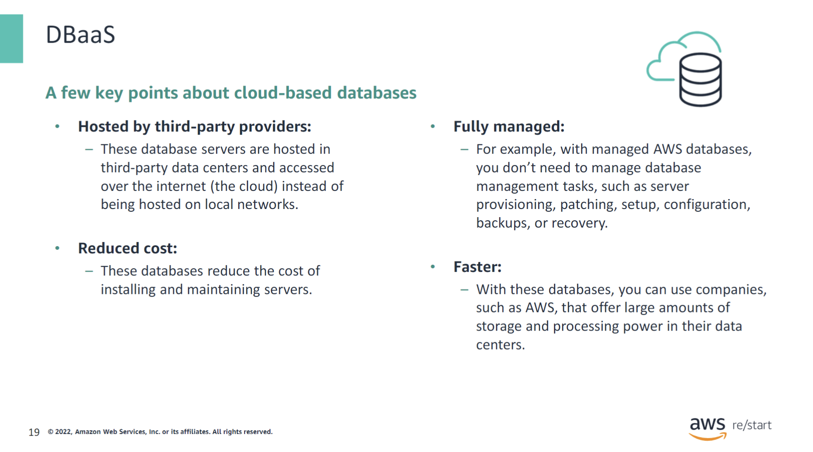

With DBaaS, database servers are hosted in third-party data centers. They are accessed over the internet (the cloud) instead of being hosted on local networks.

#### DBaaS examples

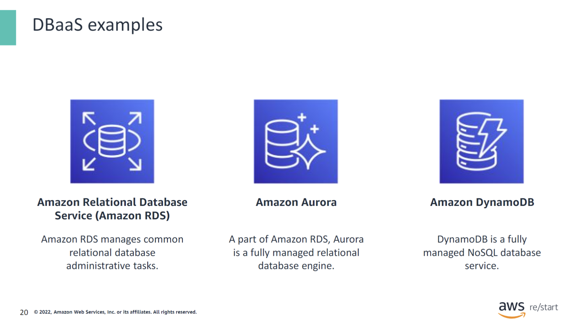

Amazon Relational Database Service (Amazon RDS) is a web service that facilitates setting up, operating, and scaling a relational database in the cloud. It provides cost-efficient, resizable capacity for an industry-standard relational database and manages common database administration tasks.

Amazon Aurora is a fully managed relational database engine that is compatible with MySQL and PostgreSQL. Aurora is part of the managed database service Amazon RDS.

Amazon DynamoDB is a fully managed NoSQL database service. You can use DynamoDB to create a database table that stores and retrieves any amount of data and serves any level of request traffic. DynamoDB automatically spreads the table’s data and traffic over a sufficient number of servers to handle the request capacity that the customer specifies. It can handle the amount of data that is stored while maintaining consistent and fast performance.

## Checkpoint questions

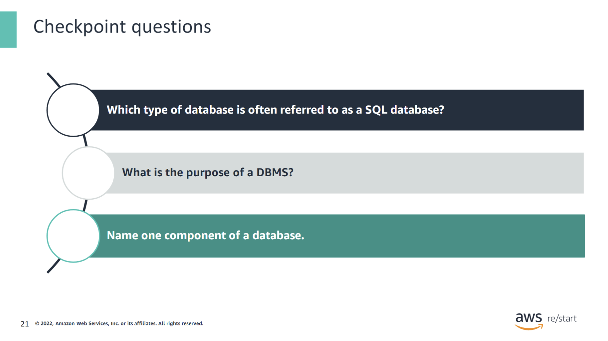

1. Which type of database is often referred to as a SQL database?
   

   
Answer

   A relational database.
   

2. What is the purpose of a DBMS?
   

   
Answer

   A DBMS is software that provides database functionality.
   

3. Name one component of a database.
   

   
Answer

   Any one of the following answers is correct: data, data models, schema, and small scale or distributed.
   

## Key Takeaways

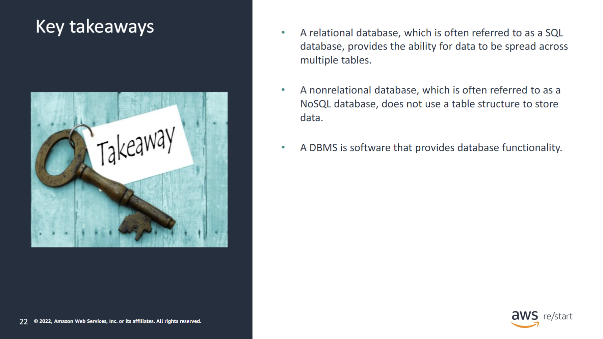

:::tip[This module includes the following key takeaways:]

- A relational database, which is often referred to as a SQL database, provides the ability for data to be spread across multiple tables.
- A nonrelational database, which is often referred to as a NoSQL database, does not use a table structure to store data.
- A DBMS is software that provides database functionality.

:::
