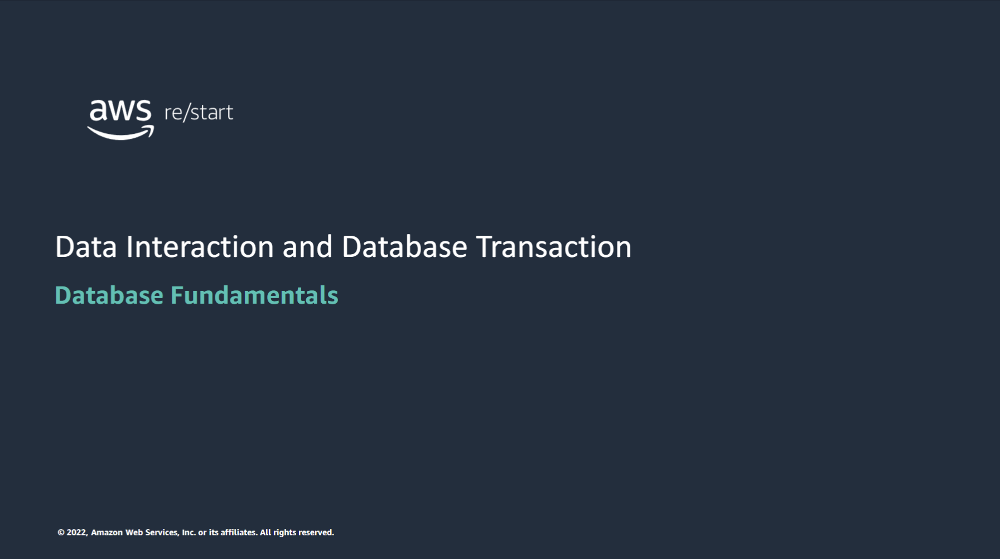

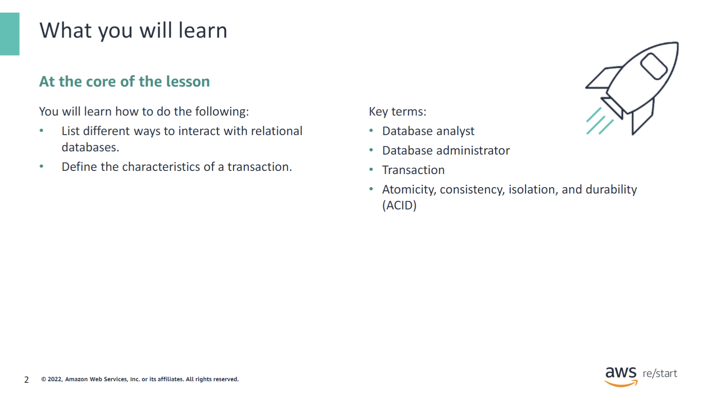

:::tip[You will learn how to do the following:]

- List different ways to interact with relational databases.
- Define the characteristics of a transaction.

:::

## Data sharing

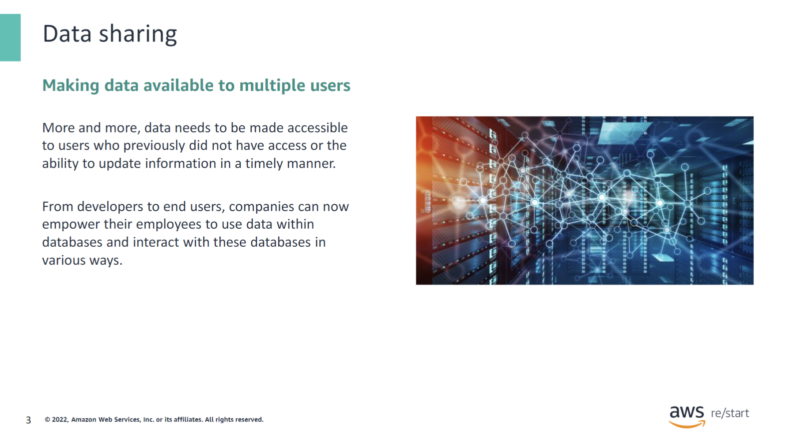

A database provides an efficient solution to share the same data between multiple users who are using different applications.

## Database interaction: Database roles

### Roles interacting with relational databases

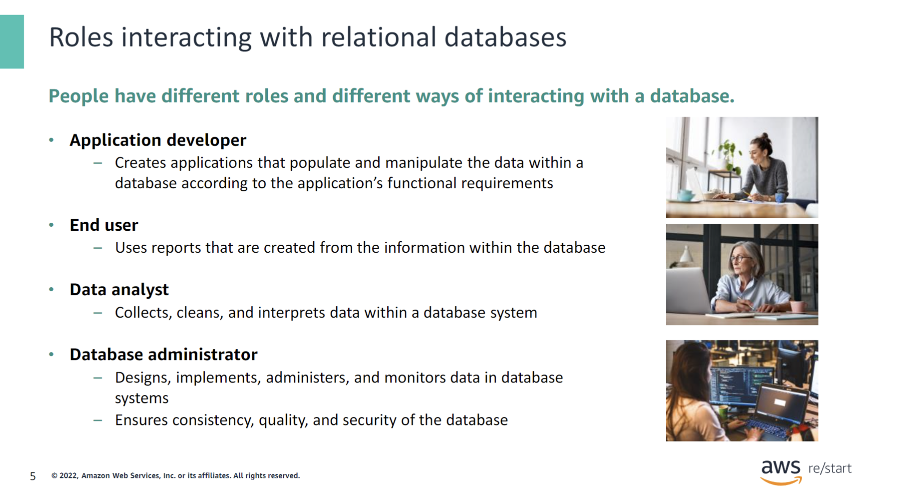

This slide lists the roles of individuals who commonly interact with a database. Each role has differing ways of interacting with the database. Direct interaction requires the user to know how to issue a structure query language (SQL) command in a specific database management system (DBMS). Therefore, roles that might have less knowledge of SQL would interact with the database in other ways.

### Role interaction types

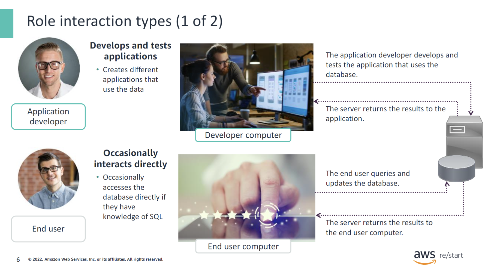

A database is typically accessed through an application that an application developer creates. The developer embeds the SQL statements needed to interact with the database in the application’s code. Therefore, end users can query and update the data in the context of a business task without having to know SQL.

If the end user has a little SQL knowledge, they might occasionally access the database directly, typically to perform read-only queries.

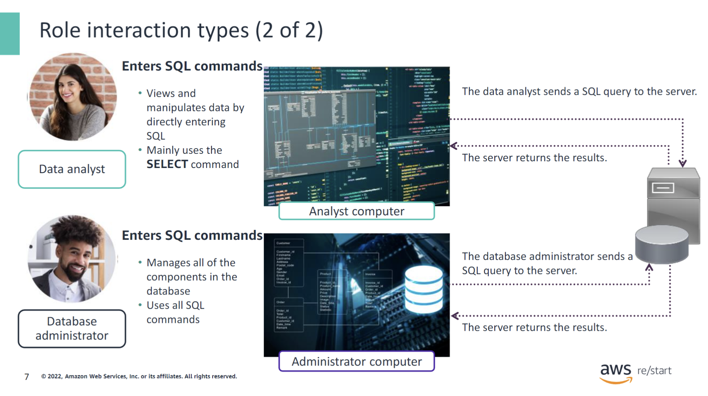

Data analysts and database administrators also interact with databases. Individuals in these roles have a greater level of expertise than a typical end user. Data analysts and database administrators would be able to create and run a SQL command.

## Data interaction models

### Interacting with relational databases

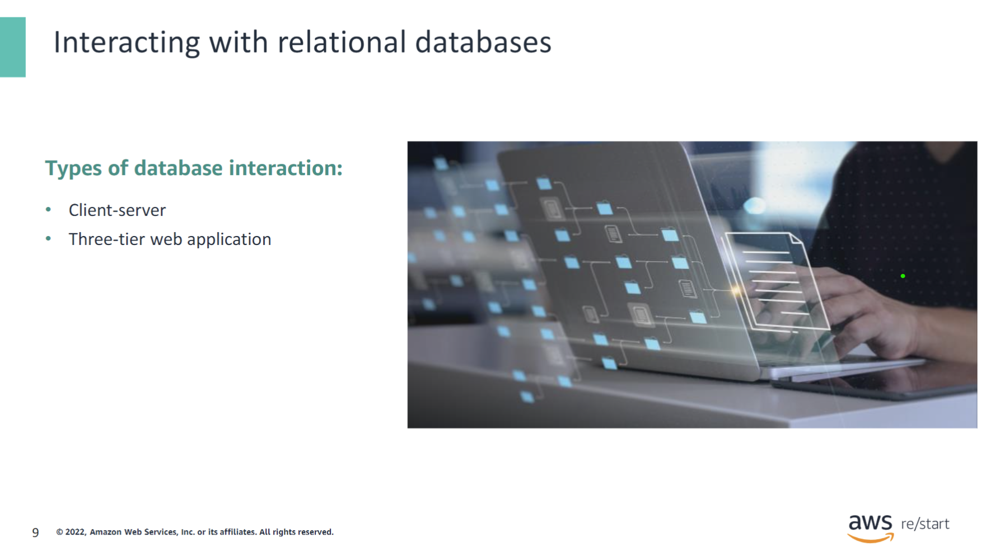

The roles mentioned previously in the section on database interaction and database roles list the ways that different job roles interact with databases. In this section, you will learn about two primary models for database interaction:

- Client-server
- Three-tier web application

### Client-server interaction

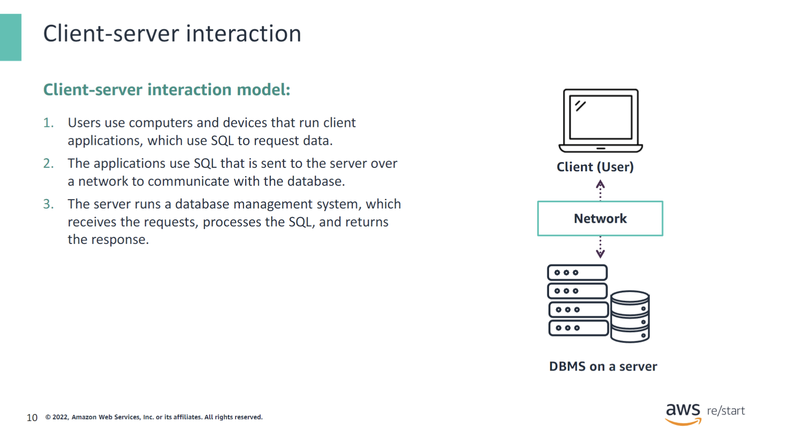

In the client-server model,the user can use an application on the client machine to send a SQL command to the server over the network.The DBMS interface on the server receives the command, runs it, and returns the result back to the client.

### Three-tier web application interaction

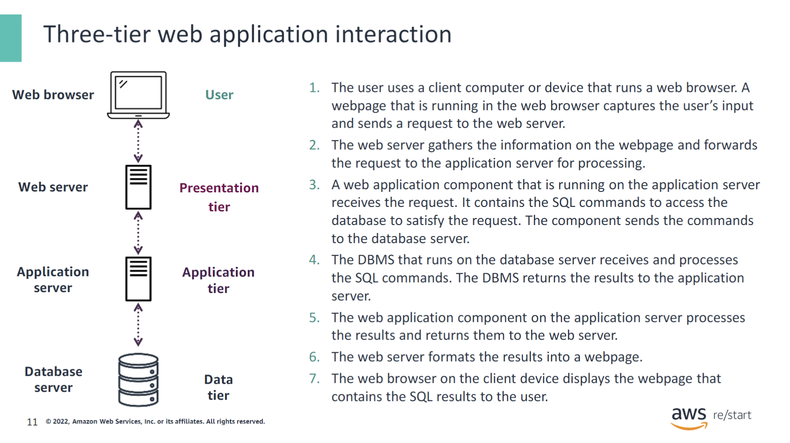

This slide illustrates and describes the typical steps that are performed when a user accesses a database by using a three-tier web application.

### Embedded SQL in application code

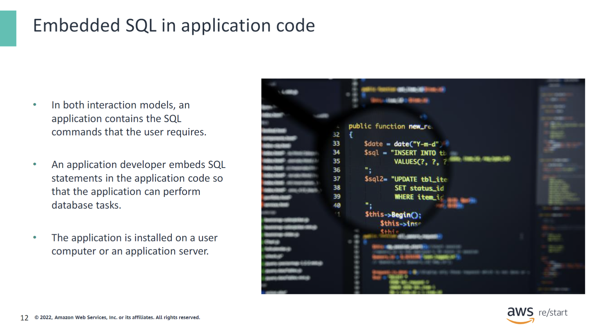

An application developer can create an application that users can use to perform database tasks. This way, users do not need to know the details of the database or learn SQL. This approach is used in both the client-server and three-tier web application models.

## Transactions in databases

### What are transactions?

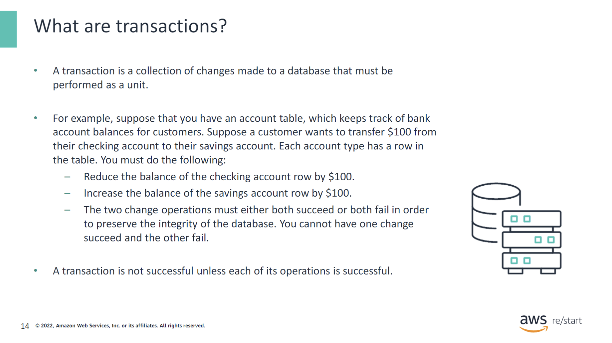

A transaction is also called a logical unit of work. In other words, either all of its operations succeed, and the transaction succeeds, or if one or more operations fail, then the entire transaction fails.

At the database level, either all the database changes related to the transaction are performed, or no change is made to the database at all. It’s an all or nothing modification.

### Status of a transaction

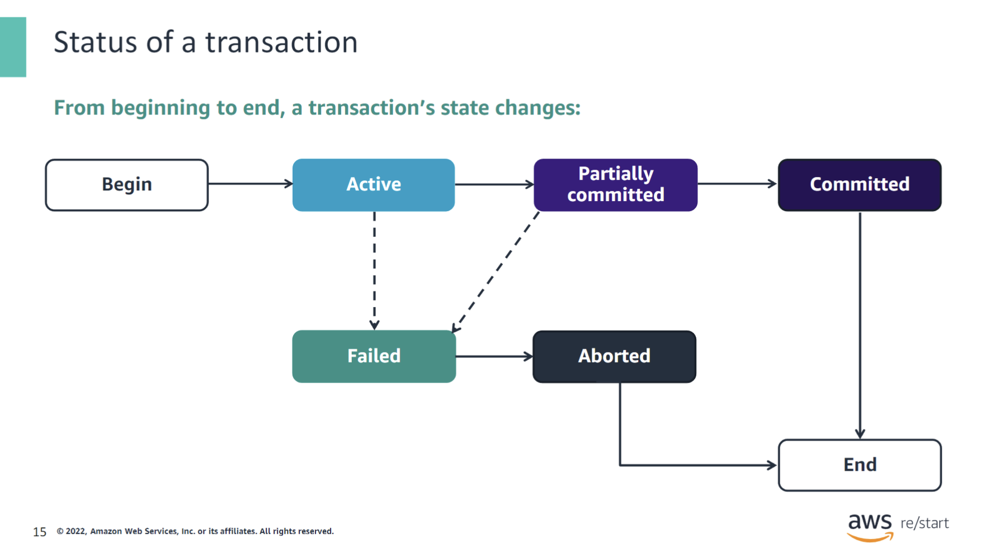

The status of a transaction can change as it moves from beginning to end. The statuses are as follows:

- **Active state:** In the initial state of every transaction and when the transaction is being run, the status is active.
- **Partially committed:** A transaction is in a partially committed state when it is completing its final operation.
- **Failed state:** A transaction is in a failed state when any checks made by the database recovery system fail.
- **Aborted state:** An aborted transaction occurs if the transaction is in a failed state, and the database rolls back to its original state before running the transaction.
- **Committed state:** When all of the operations within a transaction have been successfully performed, the transaction is considered committed.

### Transactions use cases

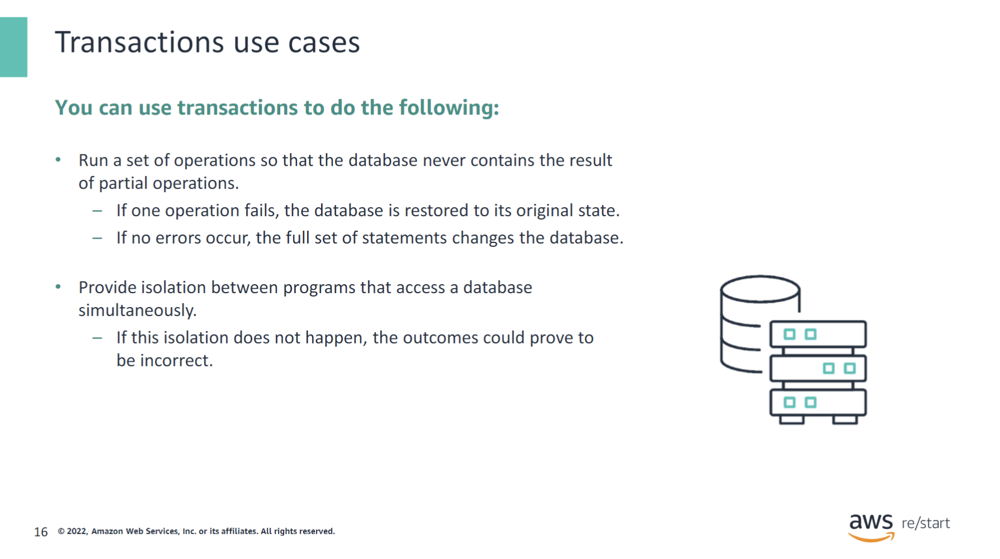

Without transactions, if two or more requests attempt to change the same data in a database simultaneously, the order and effect of the changes are unpredictable. As a result, the database might end up in a corrupted state. Transactions provide a mechanism, called isolation, which ensures that the simultaneous change requests are processed one at a time and do not interfere with each other.

### Properties of transactions

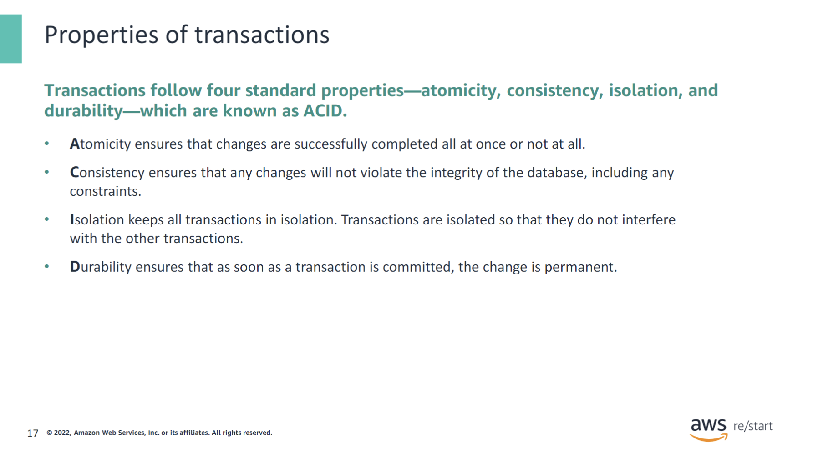

This slide lists the four important benefits of transactions, which are commonly referred to as the ACID properties.

## Checkpoint questions

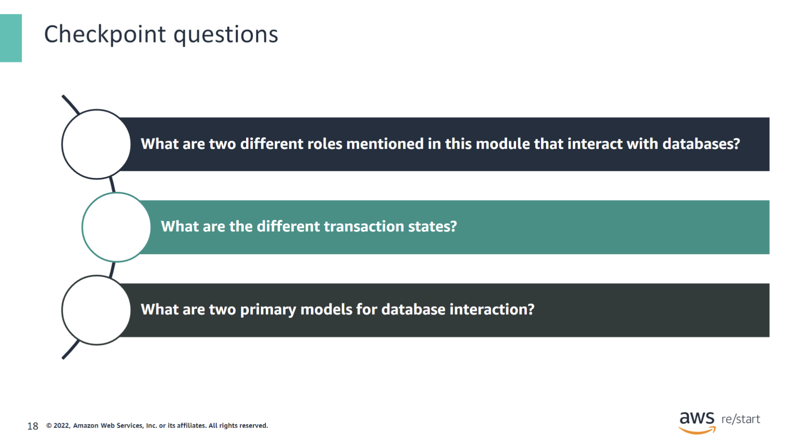

  
1. What are two different roles mentioned in this module that interact with databases?

  End users, data analysts, database administrators, and application developers.

  
2. What are the different transaction states?

  Active state, partially committed, failed state, aborted state, and committed state.

  
3. What are two primary models for database interaction?

  Client-server model and three-tier web application model.

## Key Takeaways

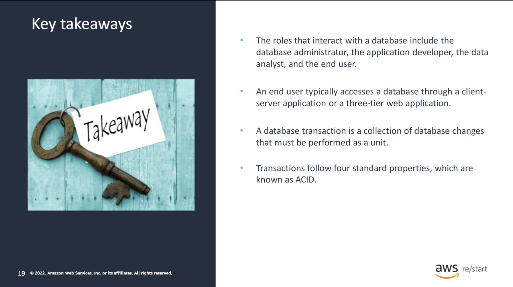

:::tip[This module includes the following keytakeaways:]

- The roles that interact with a database include the database administrator, the application developer, the data analyst, and the end user.
- An end user typically accesses a database through a client-server application or a three-tier web application.
- A database transaction is a collection of database changes that must be performed as a unit.
- Transactions follow four standard properties, which are known as ACID.

:::
