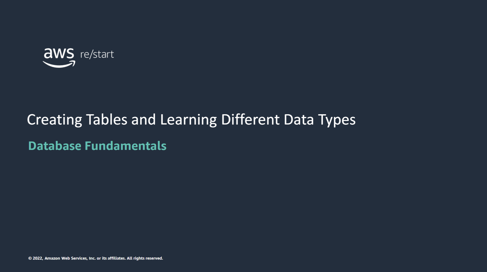

:::tip[You will learn how to do the following:]

- Describe how to create a new table in a database.
- Describe how to use data types when creating a table.

:::

:::tip[Key terms:]

- Data manipulation language (DML)
- Data definition language (DDL)
- Data control language (DCL)
- Predefined data types
- Numeric data types
- Character string types
- Primary key (PK)
- Foreign key (FK)

:::

### Anatomy of a relational database

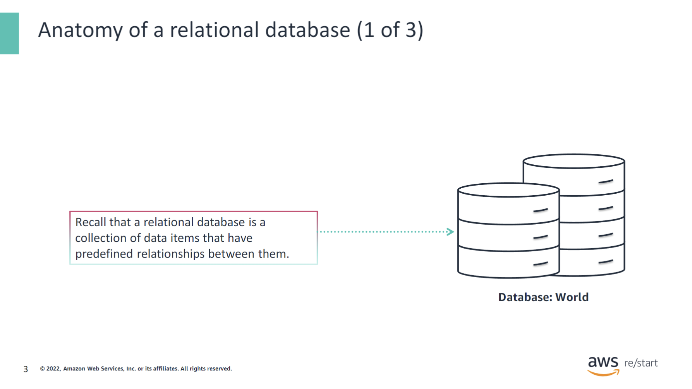

The example database used in this course is the World database.

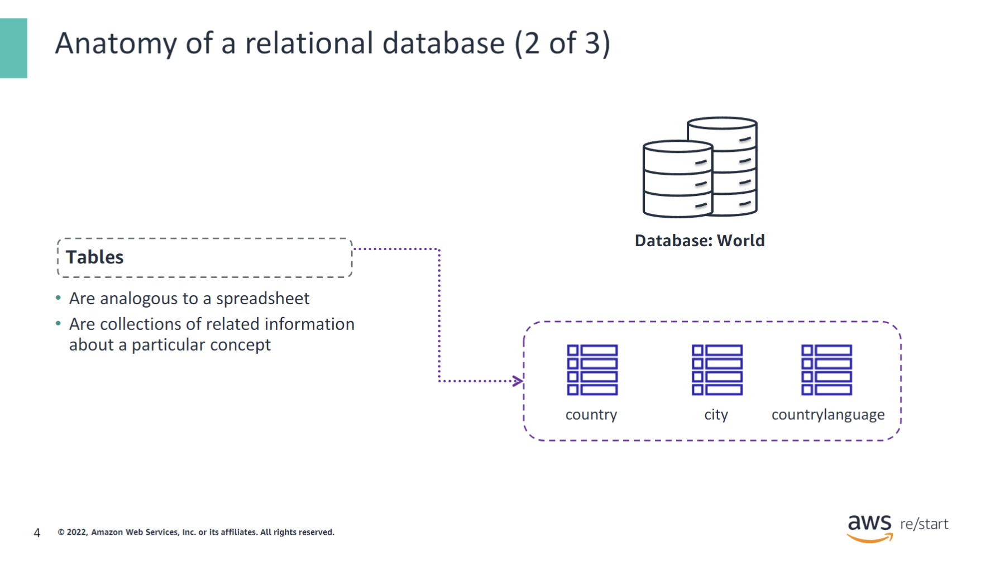

Items in a database are organized as a set of tables with columns and rows. Tables are used to hold information about the objects that will be represented in the database.

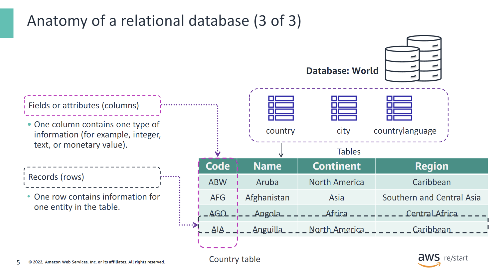

Each column in a table holds data that represents the value of an attribute. The rows in the table represent a collection of related values of one object or entity. Each row in a table could be marked with a unique identifier, which is called a primary key (PK). You can use foreign keys (FKs) to relate rows among multiple tables.

Over the next few slides, you will discuss the structured query language (SQL) language elements that are used to build a database.

## SQL

Recall that **SQL** (pronounced *SEE-kwell*) is the language that is used for querying and manipulating data. SQL is also used for defining structures in databases. SQL is a standard programming language for relational databases.

### SQL is a powerful yet simple language

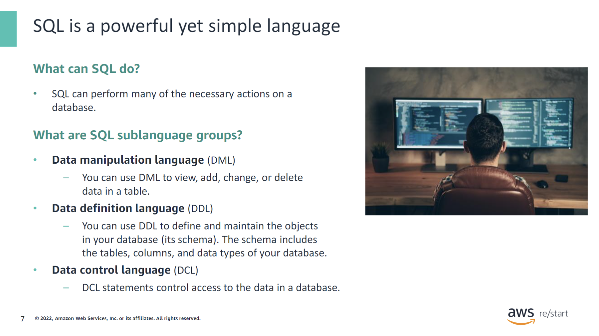

What can SQL do?

- SQL can perform many of the necessary actions on a database.

What are SQL sublanguage groups?

- **Data manipulation language (DML)**: You can use DML to view, add, change, or delete data in a table.

- **Data definition language (DDL)**: You can use DDL to define and maintain the objects in your database (its schema). The schema includes the tables, columns, and data types of your database.

- **Data control language (DCL)**: DCL statements control access to the data in a database.

:::note

SQL is the language that is used to create, query, modify, secure, and configure a relational database. SQL statements can be grouped into the major groups on the slide.

:::

### DML

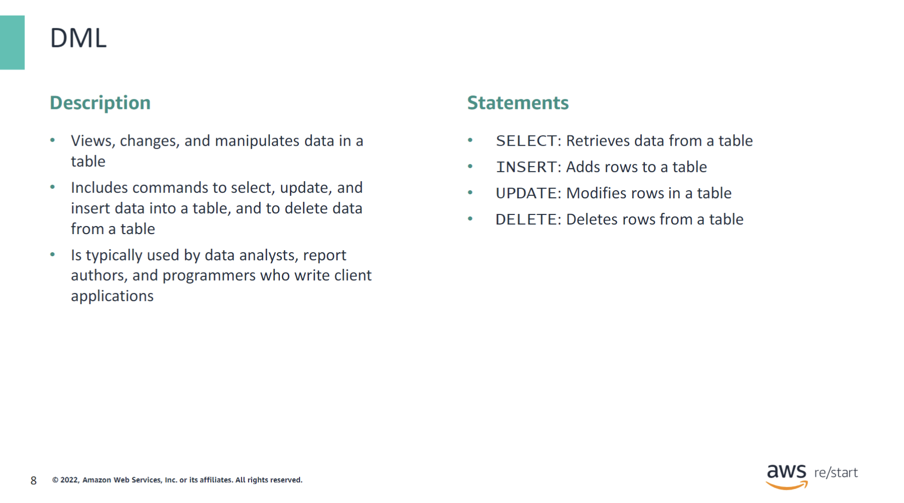

Description

- Views, changes, and manipulates data in a table
- Includes commands to select, update, and insert data into a table, and to delete data from a table
- Is typically used by data analysts, report authors, and programmers who write client applications

Statements

- **SELECT**: Retrieves data from a table
- **INSERT**: Adds rows to a table
- **UPDATE**: Modifies rows in a table
- **DELETE**: Deletes rows from a table

:::note

Note that the `SELECT` statement is a limited form of a DML statement. Technically, it is used only to read data, but in doing so, you can operate on the accessed data before returning the query results.

:::

### DDL

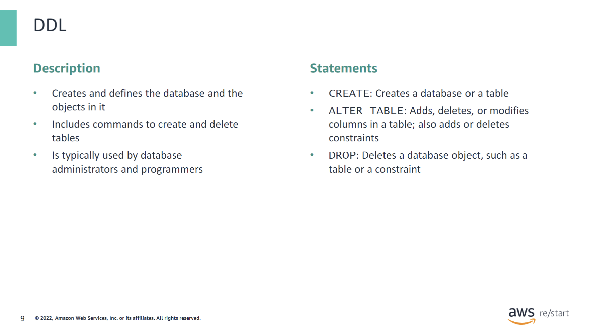

Description

- Creates and defines the database and the objects in it
- Includes commands to create and delete tables
- Is typically used by database administrators and programmers

Statements

- **CREATE**: Creates a database or a table
- **ALTER TABLE**: Adds, deletes, or modifies columns in a table; also adds or deletes constraints
- **DROP**: Deletes a database object, such as a table or a constraint

:::note

In addition to creating a database or table, the `CREATE` statement can also be used to create other database objects, such as a view or an index.

:::

### DCL

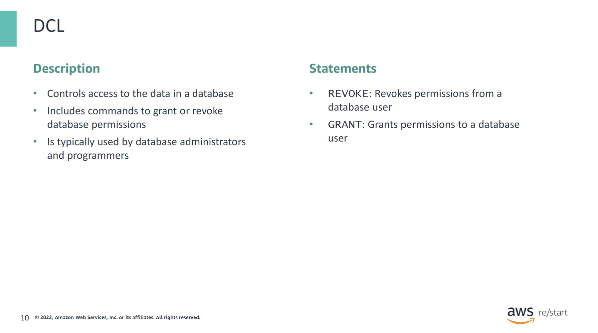

Description

- Controls access to the data in a database
- Includes commands to grant or revoke database permissions
- Is typically used by database administrators and programmers

Statements

- **REVOKE**: Revokes permissions from a database user
- **GRANT**: Grants permissions to a database user

:::note

You can use DCL statements to grant and revoke permissions to objects and enforce security in a database.

:::

## Basic SQL elements

### Predefined data types

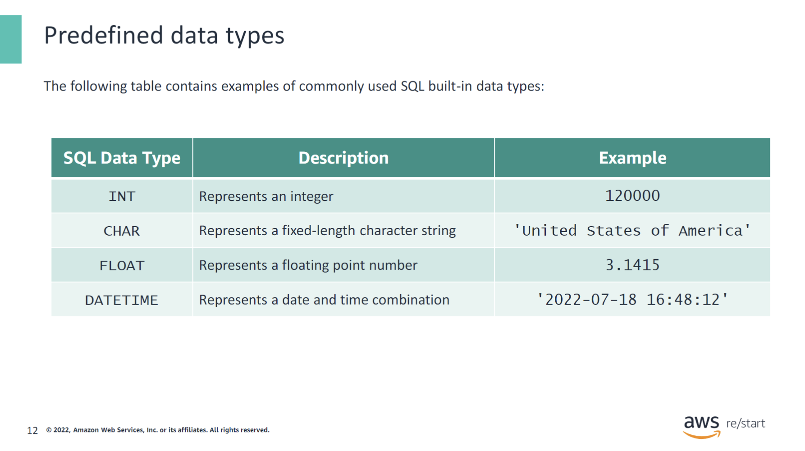

| SQL Data Type | Description                                    | Example                        |
|---------------|------------------------------------------------|--------------------------------|
| INT           | Represents an integer                          | 120000                         |
| CHAR          | Represents a fixed-length character string     | 'United States of America'      |
| FLOAT         | Represents a floating point number             | 3.1415                         |
| DATETIME      | Represents a date and time combination         | '2022-07-18 16:48:12'           |

:::note

Predefined data types are also known asbuilt-in data types. This slide shows some of the commonly used built-in SQL data types and provides example values for each. For numeric data types, the range of permissible values depends on the database management systems (DBMS).

:::

### Identifiers

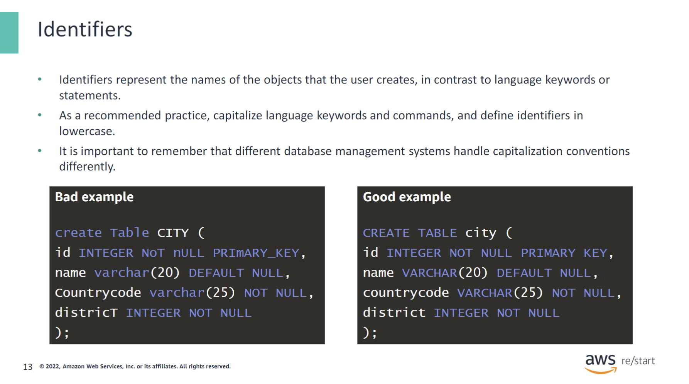

In the example shown in the slide, `city`, `id`, `name`, `countrycode`, and `district` are all identifiers. Different database management systems handle capitalization conventions differently. The following are some examples:

- **IBM and Oracle**: When you are processing code that you write, IBM and Oracle database management systems automatically convert identifiers to uppercase. (That is, they will ignore the case that you used.) To retain the case that you used for your identifiers, you must enclose them in double quotation marks (" ").

- **Microsoft SQL Server**: Microsoft SQL Server can be configured to be case sensitive or not case sensitive, but it is case sensitive by default. Case sensitivity is associated with the collation properties of SQL Server, which determine the sorting rules, case, and accent sensitivity properties for your data.

- **MySQL Server**: MySQL Server is case sensitive by default except in Microsoft Windows.

:::note

- Identifiers represent the names of the objects that the user creates, in contrast to language keywords or
statements.
- As a recommended practice, capitalize language keywords and commands, and define identifiers in
lowercase.
- It is important to remember that different database management systems handle capitalization conventions
differently.

:::

### Constraints on data

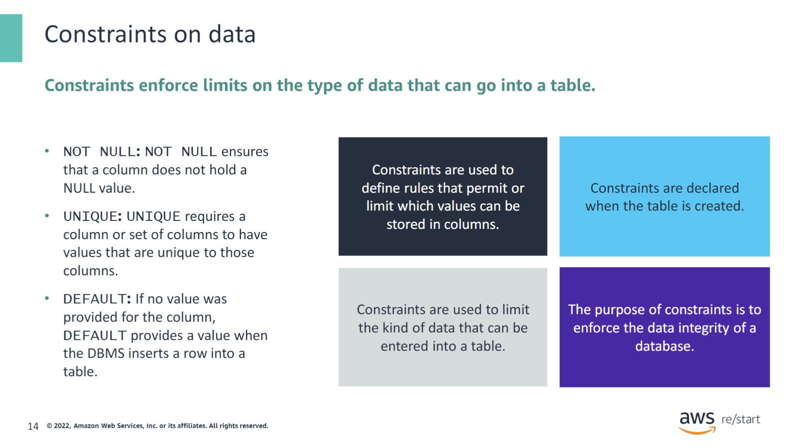

| **Aspect**       | **Details**                                                                                             |
|------------------|---------------------------------------------------------------------------------------------------------|
| **Purpose**      | Constraints are used to enforce the data integrity of a database.                                      |
| **Declaration**  | Constraints are declared when the table is created.                                                     |
| **Usage**        | Constraints are used to limit the kind of data that can be entered into a table.                        |
| **Function**     | Constraints define rules that permit or limit which values can be stored in columns.                    |

- **NOT NULL**: `NOT NULL` ensures that a column does not hold a NULL value.

- **UNIQUE**: `UNIQUE` requires a column or set of columns to have values that are unique to those columns.

- **DEFAULT**: If no value was provided for the column, `DEFAULT` provides a value when the DBMS inserts a row into a table.

:::note

You can use the `NOT NULL` constraint to define a column as requiring a value. In addition, you can use the `UNIQUE` constraint to make sure that each row in the table has a unique value for the column.

Another SQL constraint that is commonly used is the `PRIMARY KEY` constraint. It identifies the associated column as the table’s primary key and, therefore, enforces that the column’s values are unique.

:::

### Reserved terms and key words

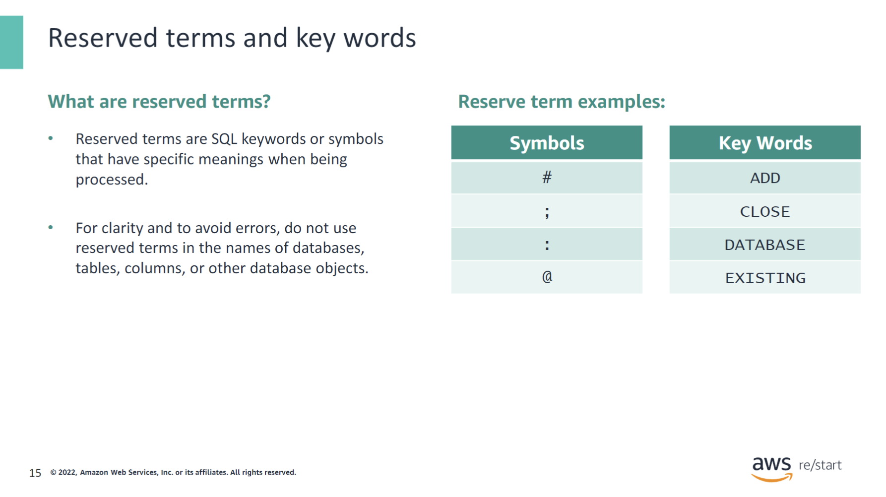

What are reserved terms?

- Reserved terms are SQL keywords or symbols
that have specific meanings when being
processed.

- For clarity and to avoid errors, do not use
reserved terms in the names of databases,
tables, columns, or other database objects.

| **Symbols** | **Key Words** |
|---------------------------|---------------|
| #                   | ADD           |
| ;                         | CLOSE         |
| :                         | DATABASE      |
| @                         | EXISTING      |

:::note

Even though some database management systems provide a way to use reserved keywords as object names, it is not a recommended practice.

:::

## Tables

### Naming tables

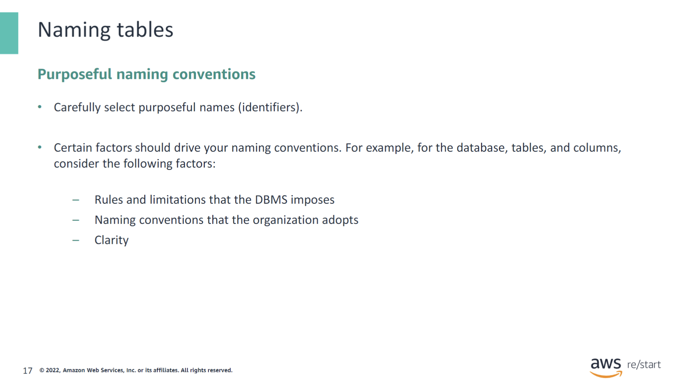

Purposeful naming conventions

- Carefully select purposeful names (identifiers).

- Certain factors should drive your naming conventions. For example, for the database, tables, and columns,
  consider the following factors:

  - Rules and limitations that the DBMS imposes
  - Naming conventions that the organization adopts
  - Clarity


:::note[Some additional recommended practices when naming tables and table elements include the following:]

- Use descriptive names. The name should be meaningful and should describe the entity that is being modeled.
- Be consistent when choosing to use singular or plural table names.
- Use a consistent format in table names. For example, if you create a table to store order details, you can use camel case (orderDetails) or underscore (order_details) for the compound table name. Whichever convention you select, use it consistently.

:::

### `CREATE TABLE` statement


A table is a logically organized unit of data storage in
SQL.

To create a table, use the CREATE TABLE
statement:

```sql
CREATE TABLE city ( ... ) ;
```

To create a table only if a table with the same name
does not already exists, add the IF NOT EXISTS
clause:

```sql
CREATE TABLE IF NOT EXISTS city ( ... );
```

```sql
CREATE TABLE city (
id INTEGER NOT NULL PRIMARY KEY,
name VARCHAR(20) DEFAULT NULL,
countrycode VARCHAR(25) NOT NULL,
district INTEGER NOT NULL
);
```

:::note

Use the `IF NOT EXISTS` clause to ensure that the table name does not duplicate the name of an already existing table.

In the example, the SQL statement creates a table named `city`. The table includes four columns: `id`, `name`, `countrycode`, and `district`. 

- The `id` column is the table’s primary key, has a data type of `INTEGER`, and cannot have a `NULL` value.
- The `name` and `countrycode` columns are of type `VARCHAR` (a variable length set of character data). The `name` field has a default value of `NULL`.

:::

### Columns

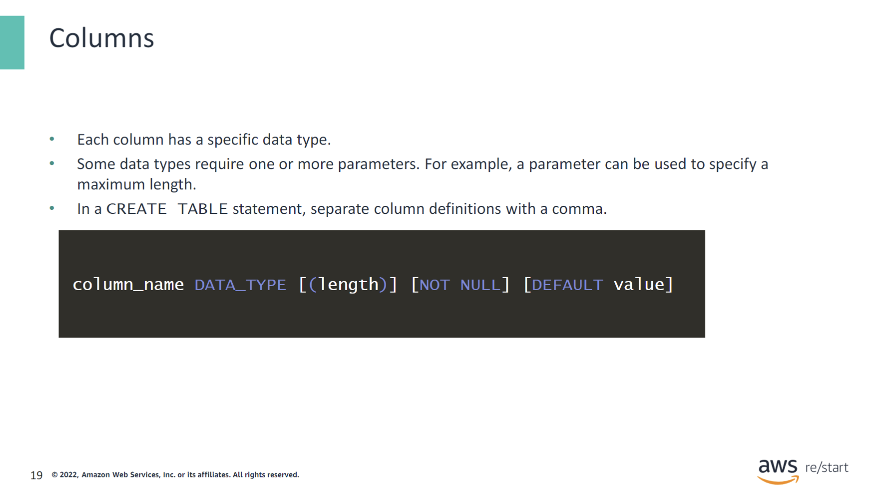

- Each column has a specific data type.
- Some data types require one or more parameters. For example, a parameter can be used to specify a
maximum length.
- In a `CREATE TABLE` statement, separate column definitions with a comma.

```ruby
column_name DATA_TYPE [(length)] [NOT NULL] [DEFAULT value]
```

:::note

The SQL example in the slide shows a typical format for a column definition. The column name is followed by the data type name and optional length, `NOT NULL`, and `DEFAULT` value clauses.

:::

### Primary keys (PKs) and foreign keys (FKs)

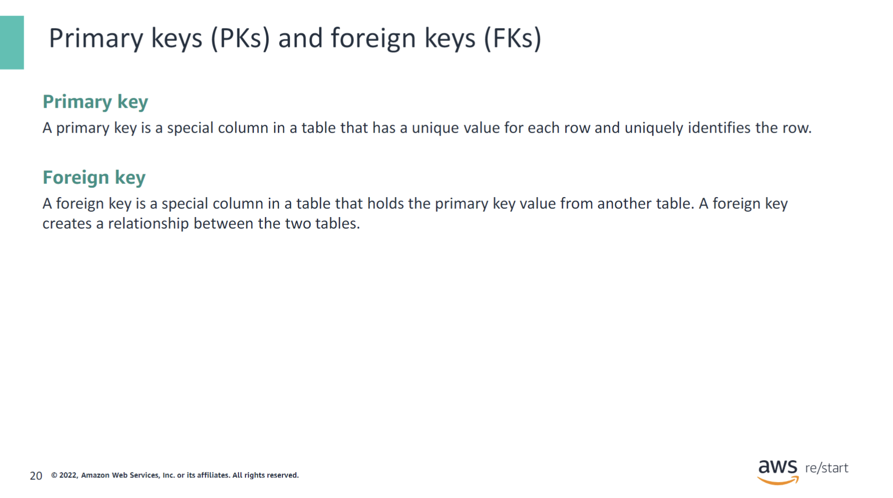

**Primary key**

A primary key is a special column in a table that has a unique value for each row and uniquely identifies the row.

**Foreign key**

A foreign key is a special column in a table that holds the primary key value from another table. A foreign key
creates a relationship between the two tables.

:::note

A table can have zero or one primary key (PK). The PK can consist of one column or multiple columns (compound PK). The PK of one table can be defined as a foreign key (FK) of another table to establish a relationship between the two tables.

:::

### Referential integrity

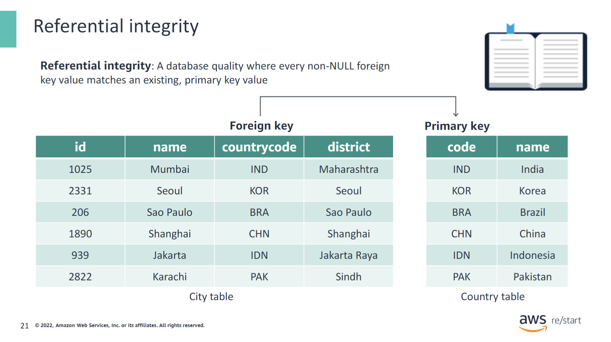

Referential integrity is a database quality where every non-NULLforeign key value matches an existing, PK value.

For example, examine the city table and the country table that are shown in the slide. The country code column in the city table is an FK that matches the PK from the country table.

### `DROP TABLE` statement

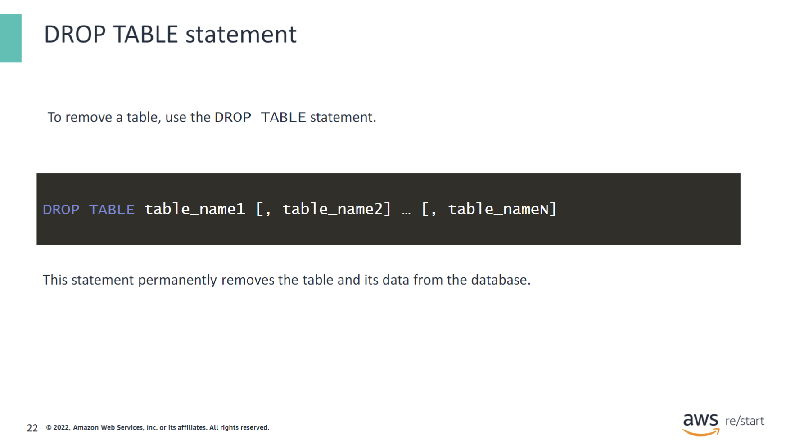

To remove a table, use the DROP TABLE statement.

```ruby
DROP TABLE table_name1 [, table_name2] ... [, table_nameN]
```

This statement permanently removes the table and its data from the database.

## Character string data types

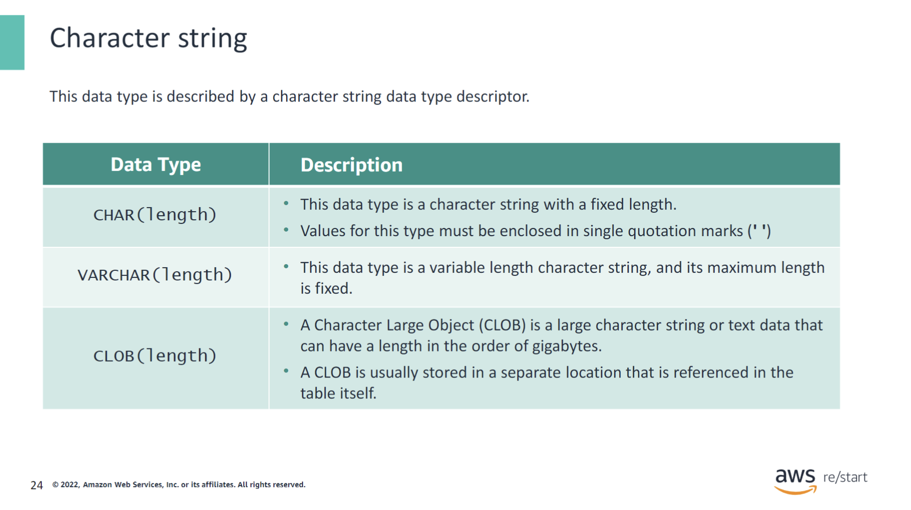

This data type is described by a character string data type descriptor.

| Data Type     | Description                                                                                          |
|---------------|------------------------------------------------------------------------------------------------------|
| CHAR (length) | This data type is a character string with a fixed length. Values for this type must be enclosed in single quotation marks (' '). |
| VARCHAR (length) | This data type is a variable length character string, and its maximum length is fixed.               |
| CLOB (length) | A Character Large Object (CLOB) is a large character string or text data that can have a length in the order of gigabytes. A CLOB is usually stored in a separate location that is referenced in the table itself. |

This table lists some commonly used SQL data types to represent character strings.

:::note[The following is some general guideline:]

- Use fixed-length character data types for consistent-length data, such as a postal code, product code, or telephone number.
- Use variable-length data types when the length of data is widely variable. Make sure that variable-length columns are not wider than they need to be.
- Make sure that you understand how CLOB storage is allocated in the system that you use.

:::

## Numeric and date data types

### Numeric types

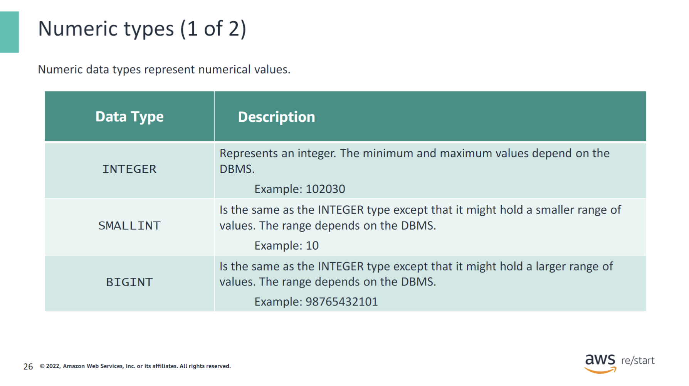

| Data Type | Description                                                                                 | Example           |
|-----------|---------------------------------------------------------------------------------------------|-------------------|
| INTEGER   | Represents an integer. The minimum and maximum values depend on the DBMS.                   | 102030            |
| SMALLINT  | Is the same as the INTEGER type except that it might hold a smaller range of values. The range depends on the DBMS. | 10                |
| BIGINT    | Is the same as the INTEGER type except that it might hold a larger range of values. The range depends on the DBMS. | 98765432101       |

:::note

The `INTEGER`, `SMALLINT`, and `BIGINT` data types represent whole numbers that can be positive, negative, or zero. They are exact numeric data types.

When choosing which integer data type to use for a numeric column, select the type with the smallest range that is enough to accommodate the values that will be stored. In other words, do not over-allocate and waste storage.

Note that the `INTEGER` data type can also be abbreviated as `INT`.

:::

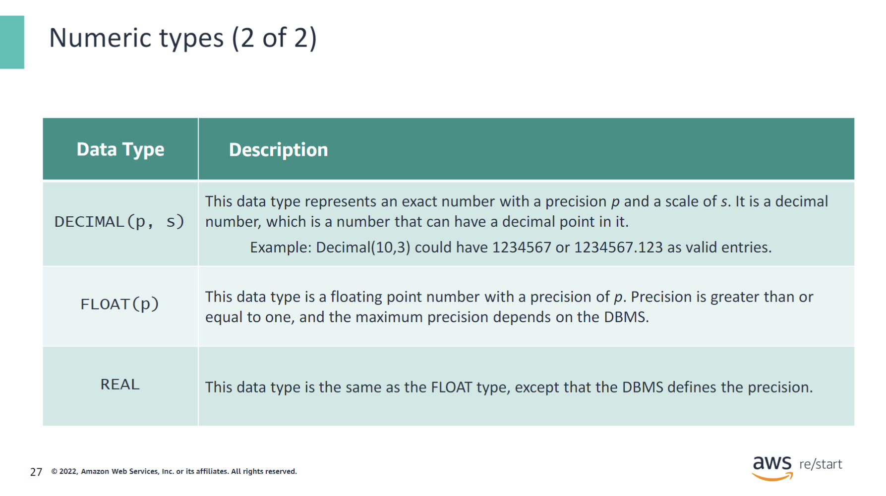

| Data Type         | Description                                                                                                                     | Example                           |
|-------------------|--------------------------------------------------------------------------------------------------------------------------------- |-----------------------------------|
| DECIMAL (p, s)    | This data type represents an exact number with a precision p and a scale of s. It is a decimal number, which can have a decimal point in it. | DECIMAL(10,3) could have 1234567 or 1234567.123 as valid entries. |
| FLOAT (p)         | This data type is a floating point number with a precision of p. Precision is greater than or equal to one, and the maximum precision depends on the DBMS. |                                   |
| REAL              | This data type is the same as the FLOAT type, except that the DBMS defines the precision.                                       |                                   |

:::note

A `DECIMAL` data type represents an exact fixed-point number. It has two arguments: precision and scale. Precision defines the total number of digits in the number. Scale defines the number of digits after the decimal point. The scale cannot exceed the precision. An example use case for a `DECIMAL` is to store monetary values.

The `FLOAT` and `REAL` data types represent approximate numbers. They are stored more efficiently and can generally be processed faster than `DECIMAL` values. They work well for scientific calculations that must be fast but not necessarily exact to a digit.

:::

### Date and time data types

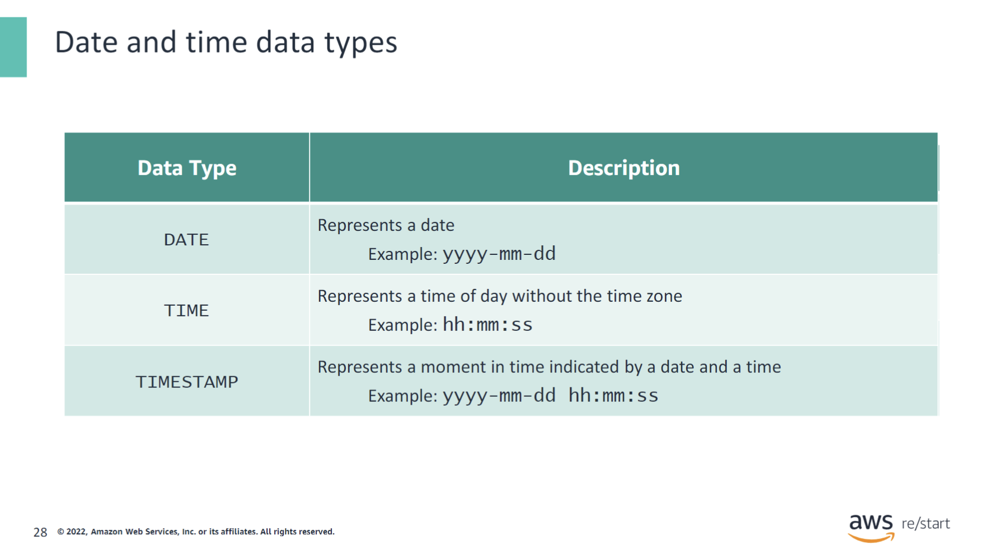

| Data Type   | Description                                            | Example                     |
|-------------|--------------------------------------------------------|-----------------------------|
| DATE        | Represents a date                                     | yyyy-mm-dd                  |
| TIME        | Represents a time of day without the time zone       | hh:mm:ss                    |
| TIMESTAMP   | Represents a moment in time indicated by a date and a time | yyyy-mm-dd hh:mm:ss        |

:::note

In a `DATE` value, `yyyy` represents the four-digit year, `mm` the two-digit month, and `dd` the two-digit day.

In a `TIME` value, `hh` represents the two-digit hour, `mm` the two-digit minute, and `ss` the two-digit second.

A `TIMESTAMP` combines the values of a `DATE` and a `TIME`.

Notice that different database management systems might store date-related and time-related data types differently.

:::

## Checkpoint questions

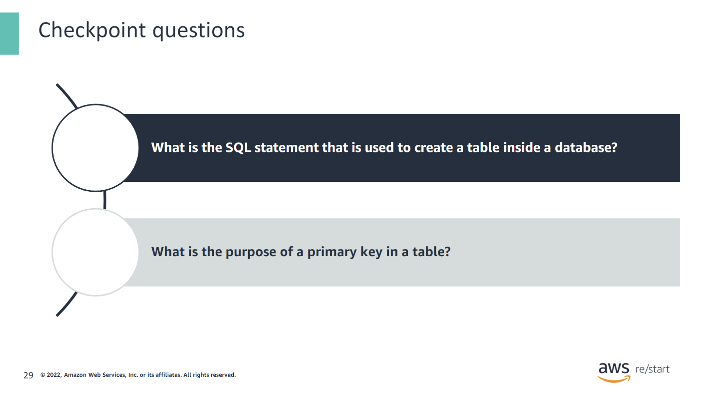

<details>
<summary>1. What is the SQL statement that is used to create a table inside a database?</summary>

The statement `CREATE TABLE` is used to create a table in a database.
</details>

<details>
<summary>2. What is the purpose of a primary key in a table?</summary>

A primary key is used to create a unique identifier for each row in a table.
</details>

## Key Takeaways

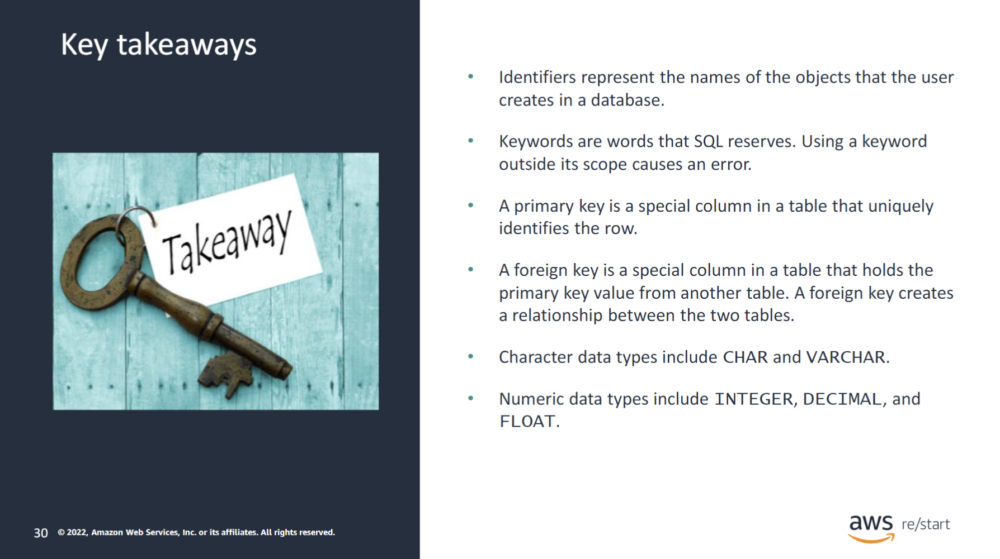

:::tip[This module includes the following key takeaways:]

- Identifiers represent the names of the objects that the user creates in a database.
- Keywords are words that SQL reserves. Using a keyword outside its scope causes an error.
- A primary key is a special column in a table that uniquely identifies the row.
- A foreign key is a special column in a table that holds the primary key value from another table. A foreign key creates a relationship between the two tables.
- Character data types include `CHAR` and `VARCHAR`.
- Numeric data types include `INTEGER`, `DECIMAL`, and `FLOAT`.

:::
