:::tip[In this module, you will learn how to do the following:]

- Import a comma-separated values (.csv) file into a table.
- List common reasons for cleansing data before importing into a database.
- Insert rows into an existing table.

:::

## What is a .csv file?

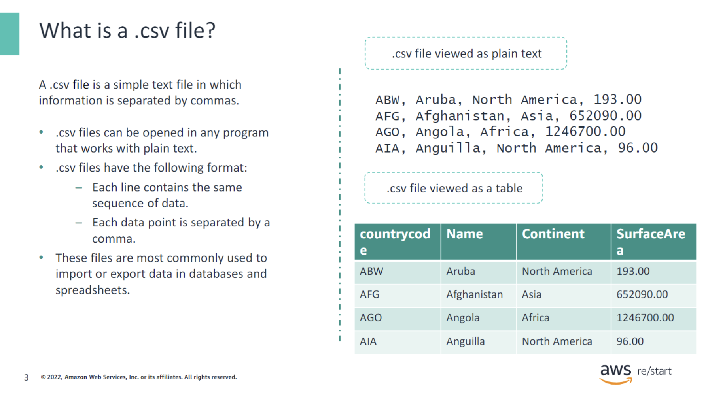

A `.csv` file is a simple text file in which information is separated by commas.

- `.csv` files can be opened in any program that works with plain text.
- `.csv` files have the following format:
  - Each line contains the same sequence of data.
  - Each data point is separated by a comma. A semicolon, space, or other characters can also be used instead of a comma. However, the comma is the most common.
- These files are most commonly used to import or export data in databases and spreadsheets.

## Importing data and exporting data

### Importing a CSV

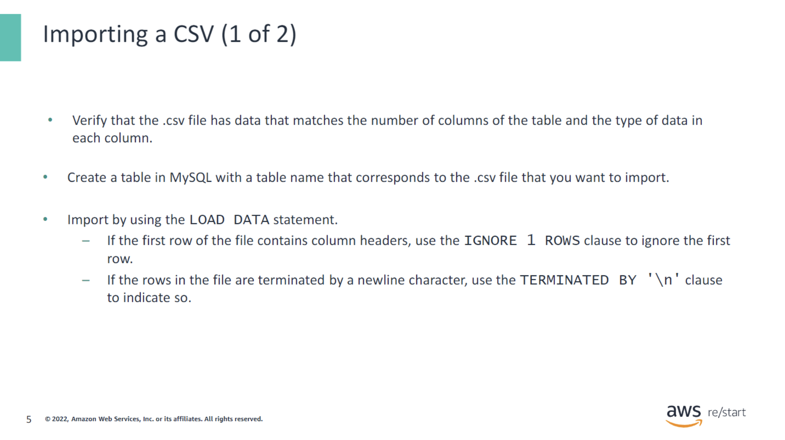

Often, you might have a `.csv` file that must be imported into a database. It is straightforward to import if you follow these steps:

1. **Verify** that the `.csv` file has data that matches the number of columns of the table and the type of data in each column.

2. **Create** a table in MySQL with a table name that corresponds to the `.csv` file that you want to import.

3. **Import** by using the `LOAD DATA` statement.
   - If the first row of the file contains column headers, use the `IGNORE 1 ROWS` clause to ignore the first row.
   - If the rows in the file are terminated by a newline character, use the `TERMINATED BY '\n'` clause to indicate so.

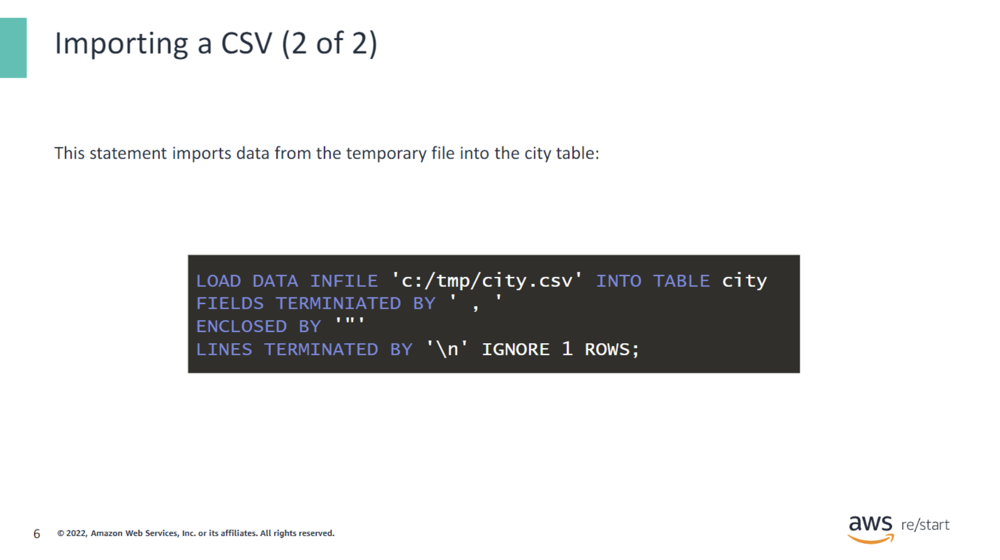

This statement imports data from the temporary file into the `city` table:

```sql
LOAD DATA INFILE 'c:/tmp/city.csv' INTO TABLE city
FIELDS TERMINATED BY ','
ENCLOSED BY '"'
LINES TERMINATED BY '\n'
IGNORE 1 ROWS;
```
Note that the `ENCLOSED BY` clause indicates that each field in the file is enclosed by the specified character. For example, a line in the .csv file appears as follows:

```sql
"ABW", "Aruba", "North America", "193.00"
```

### Exporting a CSV

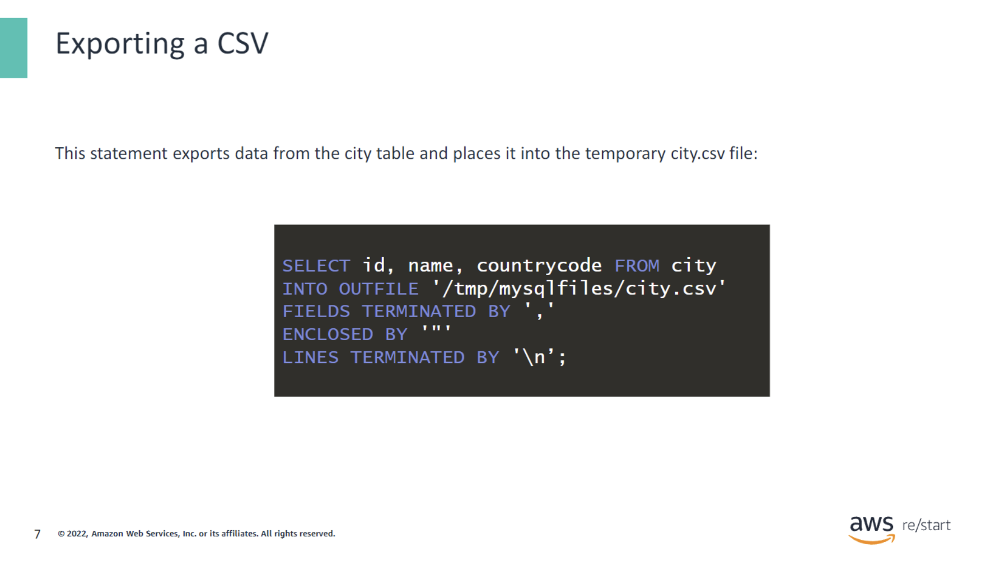

This statement exports data from the `city` table and places it into the temporary `city.csv` file:

```sql
SELECT id, name, countrycode FROM city
INTO OUTFILE '/tmp/mysqlfiles/city.csv'
FIELDS TERMINATED BY ','
ENCLOSED BY '"'
LINES TERMINATED BY '\n';
```

This will output the selected columns from the `city` table into the specified file.

## Cleaning Data

### Why clean data?

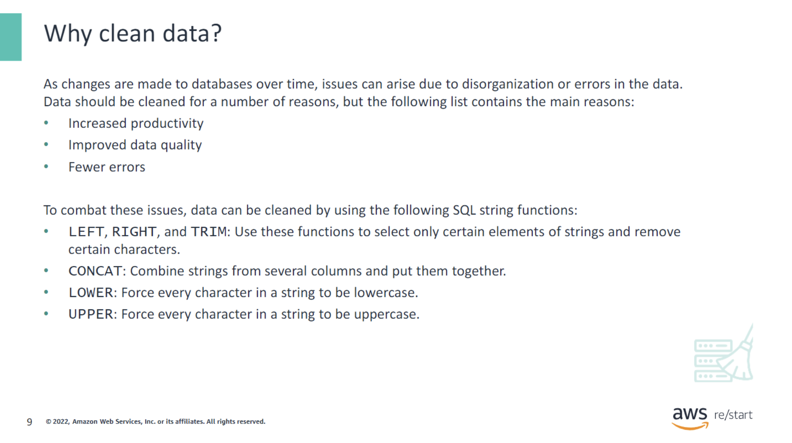

As changes are made to databases over time, issues can arise due to disorganization or errors in the data. Data should be cleaned for a number of reasons, but the following list contains the main reasons:

- **Increased productivity**
- **Improved data quality**
- **Fewer errors**

To combat these issues, data can be cleaned by using the following SQL string functions:

- `LEFT`, `RIGHT`, and `TRIM`: Use these functions to select only certain elements of strings and remove certain characters.
- `CONCAT`: Combine strings from several columns and put them together.
- `LOWER`: Force every character in a string to be lowercase.
- `UPPER`: Force every character in a string to be uppercase.

### Activity: Database Errors

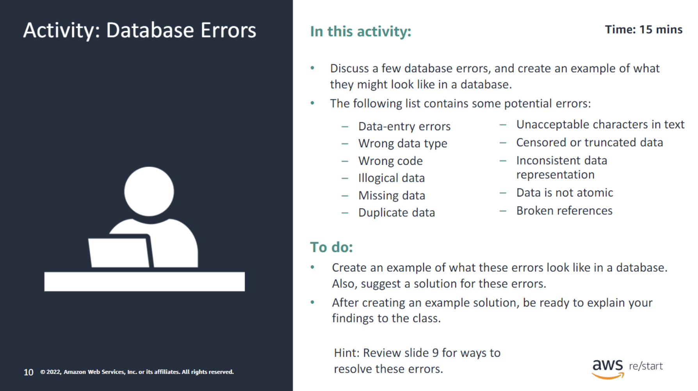

For this activity, your instructor will have you divide into groups and will assign each group a few errors. Discuss what these errors might look like in a database. Also, discuss possible techniques for addressing these errors. Present information back to the class in a discussion.

A database might encounter the following types of errors:

- **Data-entry errors**
- **Wrong data type**
- **Wrong code**
- **Illogical data**
- **Missing data**
- **Duplicate data**
- **Unacceptable characters in text**
- **Censored or truncated data**
- **Inconsistent data representation**
- **Data is not atomic**
- **Broken references**

**To do:**

- Create an example of what these errors look like in a database. Also, suggest a solution for these errors.
- After creating an example solution, be ready to explain your findings to the class.

**Consider the following example:**

- **Data-entry errors:** In a database, this type of error could include entries with additional spaces in front of or behind the entry. These errors could be resolved by using the `TRIM` command to remove the spaces.

## DESCRIBE Statement

Before moving into the INSERTstatement, you’ll discuss the use of the DESCRIBEstatement.

### DESCRIBE statement syntax

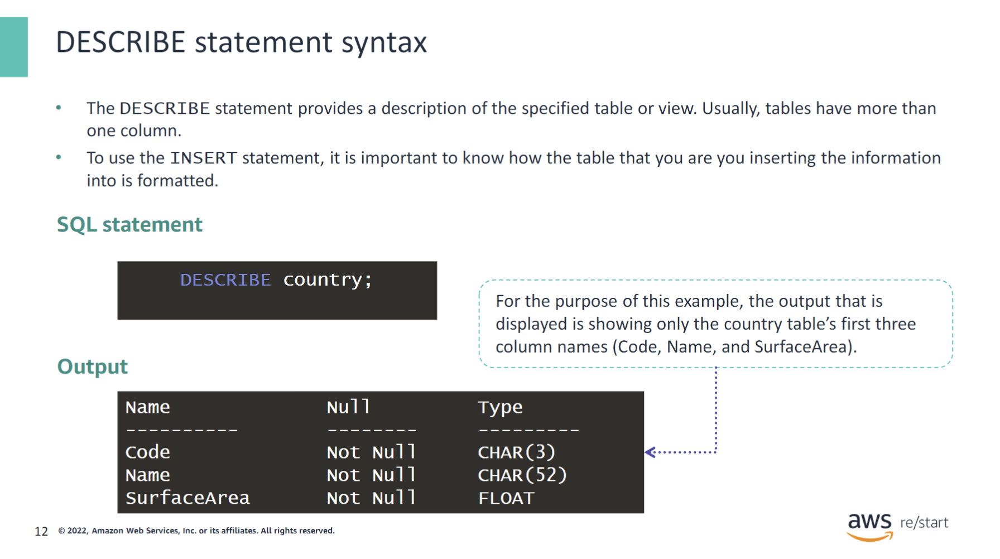

The `DESCRIBE` statement provides a description of the specified table or view. Usually, tables have more than one column. To use the `INSERT` statement, it is important to know how the table that you are inserting the information into is formatted.

**Note:** This output is not the entirety of the output for this command. Only the first three column names have been shown as an example.

## INSERT statement

### INSERT INTO

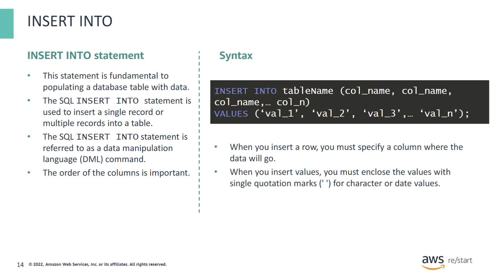

The `INSERT INTO` statement has the following properties:

- This statement is fundamental to populating a database table with data.
- The SQL `INSERT` statement is used to insert a single record or multiple records into a table.
- The SQL `INSERT` statement is referred to as a data manipulation language (DML) command.
- The order of the columns is important.

The syntax uses the following structure:

- When you insert a row, you must specify a column where the data will go. If the column is not specified, values are added to all the columns of the table, which results in adding a single row.
- When you insert values, you must enclose the values with single quotation marks (`' '`) for character or date values.
- If you insert values for one or more specific columns, then you must specify the names of the columns in structured query language (SQL).

### Syntax for the INSERT statement

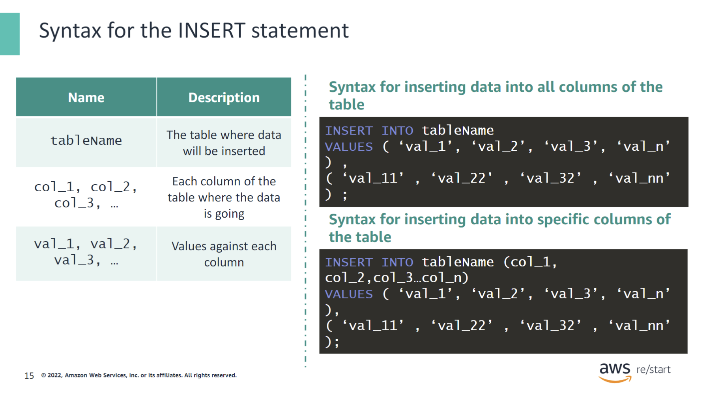

Remember the following in the syntax for the `INSERT INTO` statement:

- **Column** represents the field titles.
- **Values** represents the data that is being inserted into the fields.

First, specify the table name and a list of comma-separated columns inside parentheses after the `INSERT INTO` clause. Then, put a comma-separated list of values of the corresponding columns inside the parentheses that follow the `VALUES` keyword.

You can use the `INSERT INTO` statement in two ways. In the first example, when you add values for all the columns of the table, you do not need to specify the column names. In the second example, both the column name and the values are written. The number of columns and values must be the same. In addition, the positions of columns must correspond to the positions of their values.

### INSERT statement example

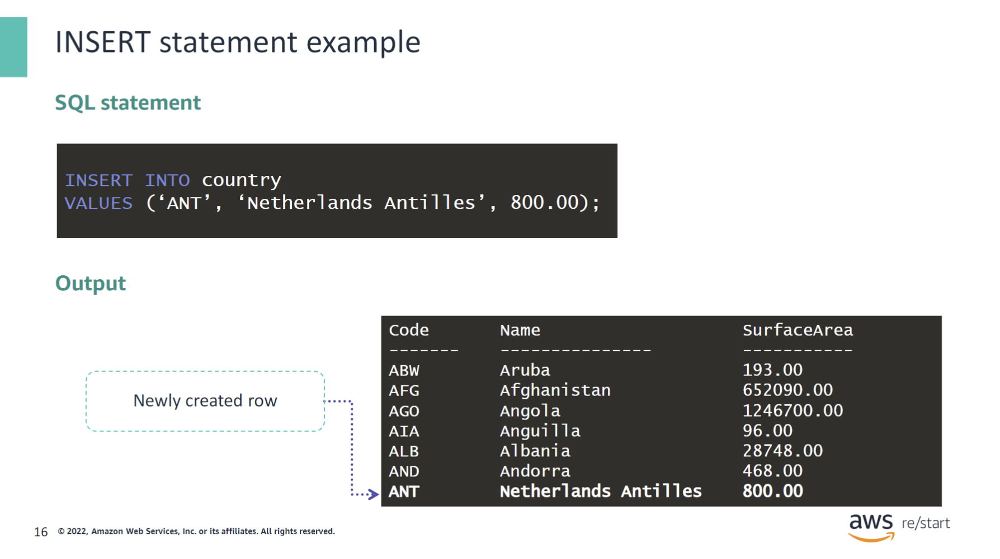

The example illustrates the syntax of the `INSERT` statement:

```sql
INSERT INTO country VALUES ('ANT', 'Netherlands Antilles', 800.00);
```

The output illustrates how the information is placed in the new row in the table:

### Discussion: Why Do Tables Need Rows?

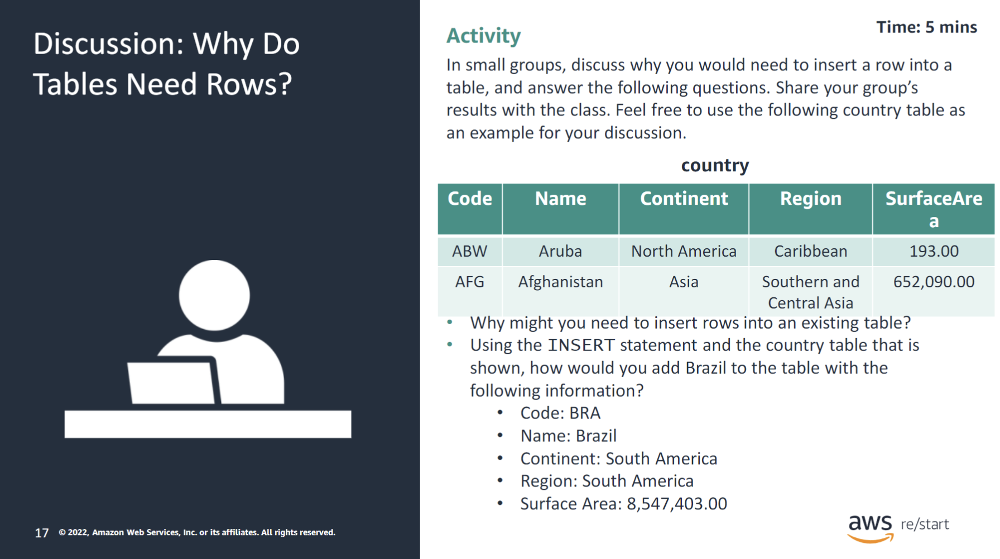

In small groups, take 5–10 minutes to discuss why you would need to insert a row into a table, and answer the following questions. Share your group’s results with the class. Feel free to use the `country` table as an example for your discussion.

**Why might you need to insert rows into an existing table?**

If new information needs to be added to a table, then a new row would need to be inserted. 

Using the `INSERT` statement and the table shown, how would you add Brazil to the table with the following information?

- **Code:** BRA
- **Name:** Brazil
- **Continent:** South America
- **Region:** South America
- **Surface Area:** 8,547,403.00

**Answer:**

```sql
INSERT INTO country (Code, Name, Continent, Region, Surface_Area) 
VALUES ('BRA', 'Brazil', 'South America', 'South America', 8547403.00);
```

## NULL statement

### NULL statement purpose and syntax

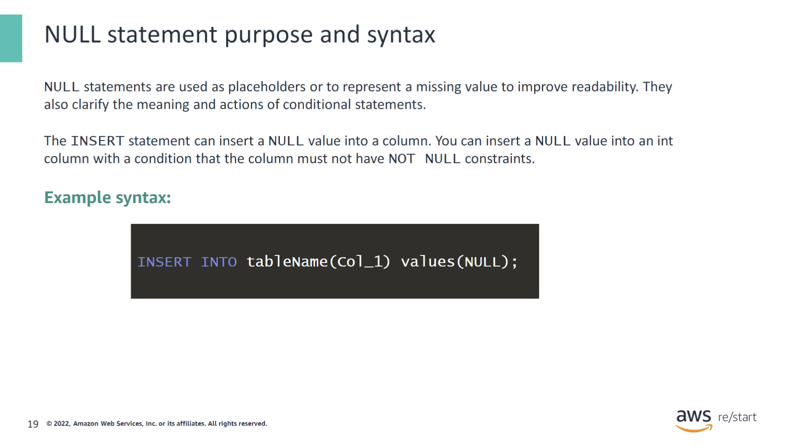

Null statements are used as placeholders to improve readability. They also clarify the meaning and actions of conditional statements. The `INSERT` statement can insert a `NULL` value into a column. You can insert a `NULL` value into an `INT` column with a condition that the column must not have `NOT NULL` constraints.

**Example Syntax:**

```sql
INSERT INTO tableName (Col_1) VALUES (NULL);
```

### Key points about the NULL statement

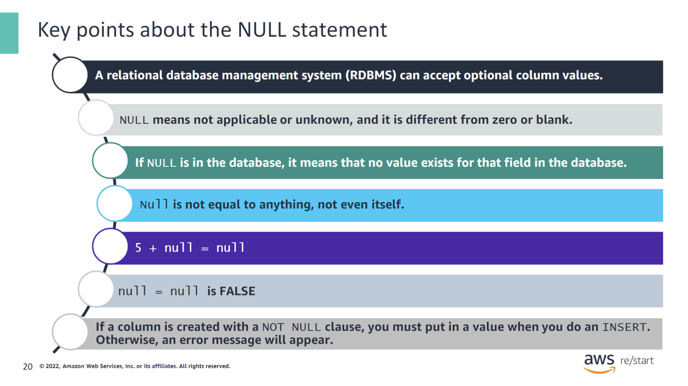

The following statements are a few key points about the `NULL` statement:

- A relational database management system (RDBMS) can accept optional column values.
- `NULL` means not applicable or unknown, and it is different from zero or blank.
- If `NULL` is in the database, it means that no value exists for that field in the database.
- `NULL` is not equal to anything, not even itself.
  - `5 + NULL = NULL`
  - `NULL = NULL` is `FALSE`
- If a column is created with a `NOT NULL` clause, you must put in a value when you do an `INSERT`. Otherwise, an error message will appear.

## Checkpoint questions

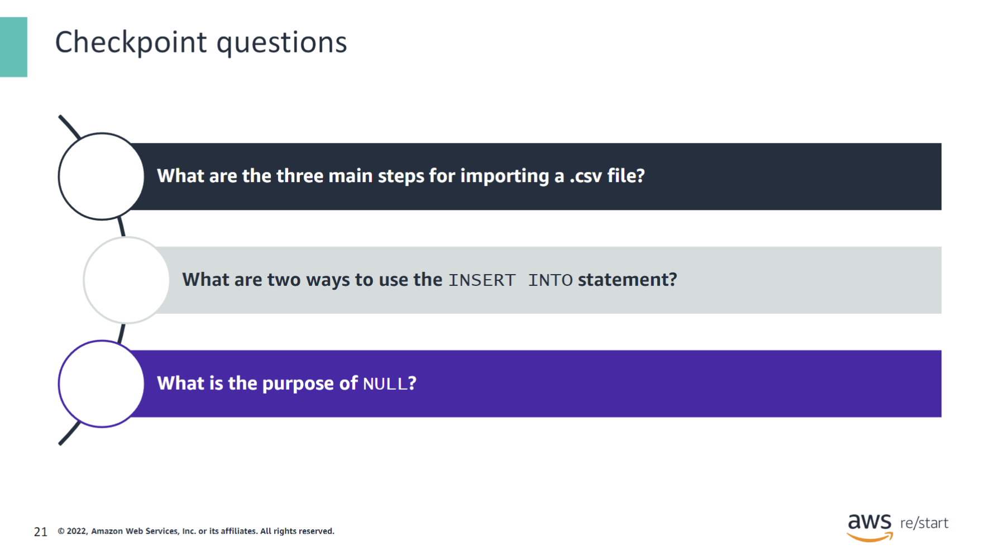

<details>
<summary>What are the three main steps for importing a .csv file?</summary>
Verify, create, and import
</details>

<details>
<summary>What are two ways to use the INSERT INTO statement?</summary>
The INSERT INTO statement can be used to add a row with values for all columns in a table or only for select columns.
</details>

<details>
<summary>What is the purpose of NULL?</summary>
The term NULL is used to represent a missing value.
</details>

## Key Takeaways


:::tip[This module includes the following key takeaways:]

- When importing a .csv file, confirm that the file has data that matches with the number of columns of the table. Also, it must match the type of data in each column that it will be imported into.
- Databases can become disorganized over time, and issues can occur. You can use SQL string functions, such as TRIMand CONCAT, to clean data and maintain a well-functioning database.
- You can use the SQL INSERTstatement to insert a single record or multiple records into a table.

:::
