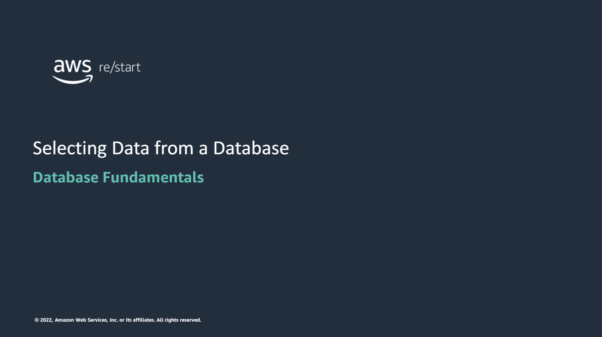

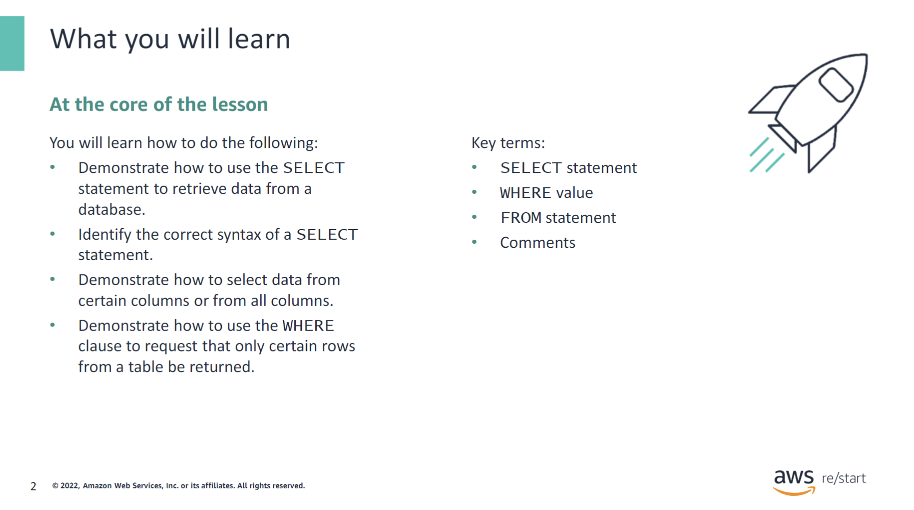

:::tip[In this module, you will learn how to do the following:]

- Demonstrate how to use the `SELECT` statement to retrieve data from a database.
- Identify the correct syntax of a `SELECT` statement.
- Demonstrate how to select data from certain columns or from all columns.
- Demonstrate how to use the `WHERE` clause to request that only certain rows from a table be returned.

:::

## `SELECT` statement

### The `SELECT` keyword

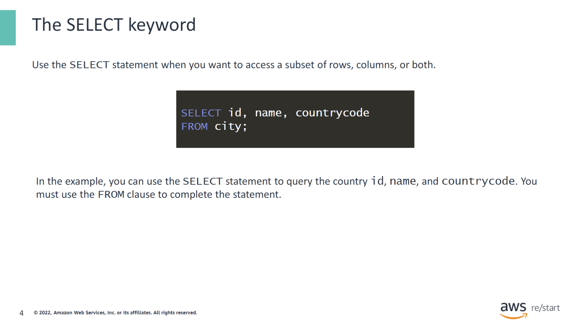

You use the `SELECT` statement to select one or more columns from a table. You can also use the `SELECT` statement when you want to access a subset of rows, columns, or both. When you query tables, you must include the `FROM` clause in your syntax. The result of the `SELECT` statement is called a result set. It lists rows that contain the same number of columns.

```sql
// world.sql
SELECT id, name, countrycode
FROM city;
```

As you read from left to right, the statement begins with `SELECT`. Next, you see which columns should be returned and from which table. The `FROM` clause follows immediately after the `SELECT` portion.

### How it works

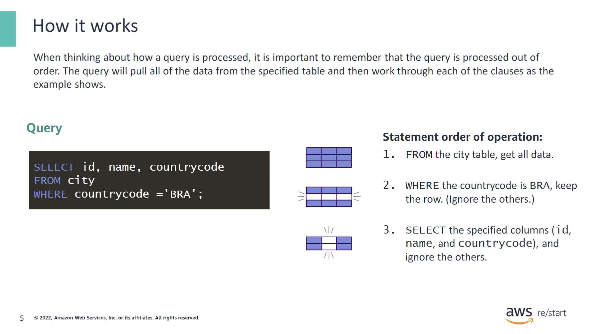

When thinking about how a query is processed, it is important to remember that the query is processed out of order. The query will pull all of the data from the specified table and then work through each of the clauses as the
example shows.

The following query is for this example:

```sql
// world.sql
SELECT id, name, countrycode
FROM city
WHERE countrycode ='BRA' ;
```

However, the order in which the query is processed is as follows:

- `FROM` the city table, get all data.
- `WHERE` the countrycode is BRA, keep the row, and ignore the others.
- `SELECT` the specified columns (id, name, and countrycode), and ignore the others.

### Using the `SELECT` statement

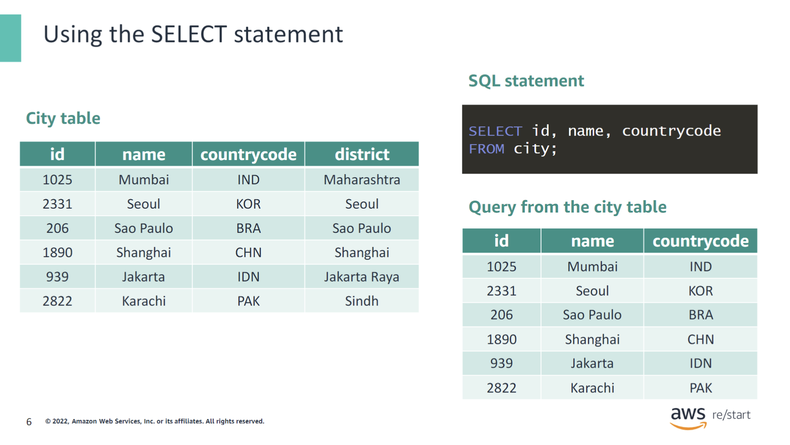

The original table includes the following: `id`, `name`, `countrycode`, and district. By using the `SELECT` statement, the queried table shows the data limited to the columns requested in the query (`id`, `name`, and `countrycode`).

## SQL SELECT statement syntax structure

### Syntax

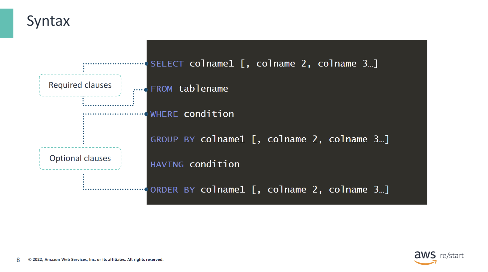

The syntax for selecting data follows a precise order. The required clauses must precede the optional clauses.

The first clause contains `SELECT` and the column names, and the `FROM` clause with the table name immediately follows it.

All optional clauses will follow these first two required clauses.

### `SELECT` statement considerations

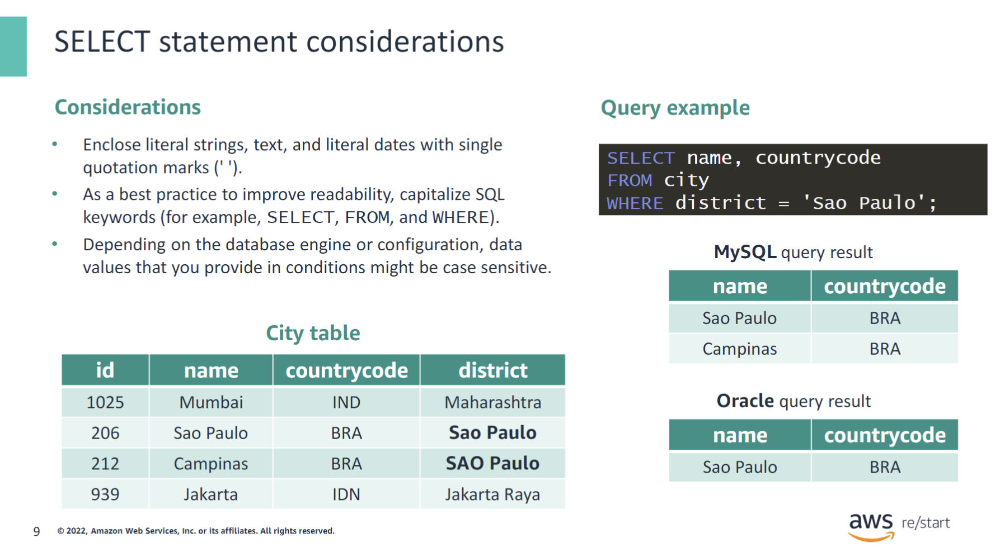

This slide lists some considerations when using the SQL SELECTstatement. In particular, data values that you provide in conditions might be case sensitive depending on the SQL database engine or configuration that you are using. In the example that’s shown, the same query returns two different results depending on whether your database is MySQL or Oracle. MySQL is not case sensitive, but Oracle is.

### Different ways to `SELECT` columns

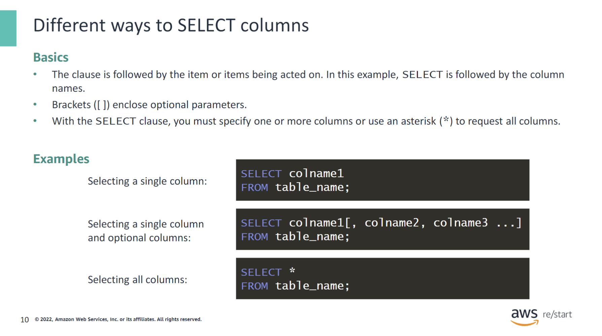

The following information is about syntax notation. The following are the basics of syntax:

- The clause is followed by the specific items that are acted on. In this example, the column names follow the `SELECT` clause.
- Brackets (`[ ]`) enclose optional parameters.
- With the `SELECT` clause, you must specify one or more columns or use an asterisk (`*`) to request all columns.

Here are some examples:

- Selecting a single column:
  `SELECT colname1 FROM table_name;`
- Selecting a single column and optional columns:
  `SELECT colname1 [, colname2, colname3 ...] FROM table_name;`
- Selecting all columns:
  `SELECT * FROM table_name;`

### Selecting all columns

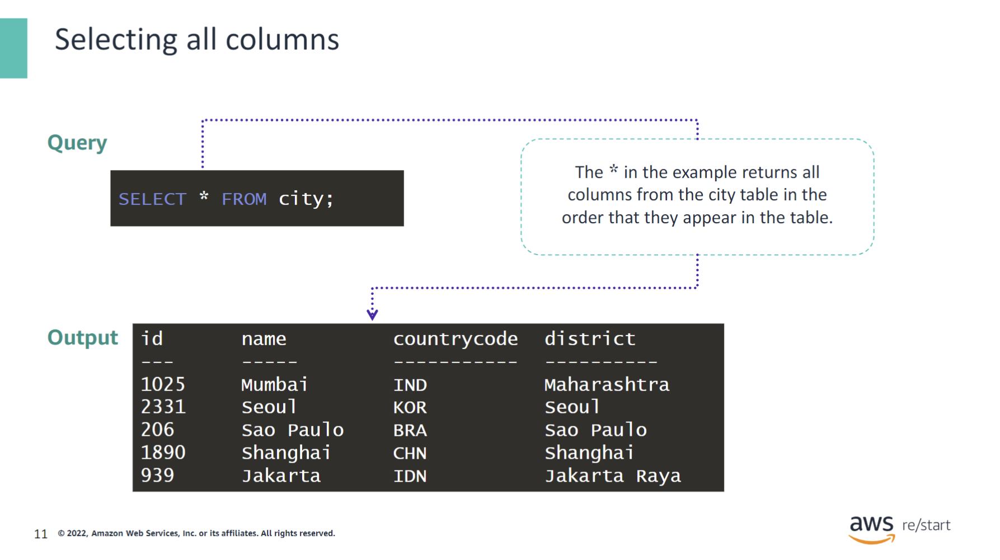

The * in the example returns all columns from the city table in the order that they appear in the table.

Syntax:

`SELECT * FROM city;`

## Optional clauses

### Optional clauses of the SELECT statement

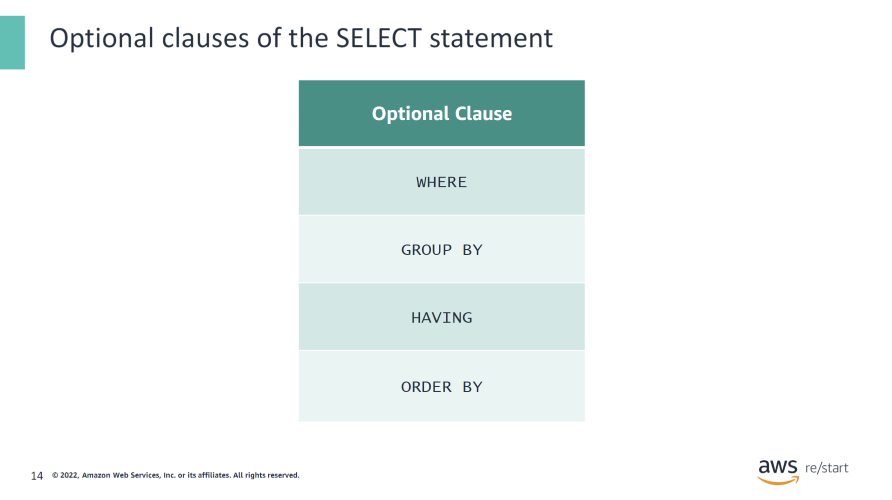

The table lists some optional clauses that you can use with the SELECTstatement. The next few slides briefly cover the use case and syntax for each of the optional clauses.

### Optional clauses of the `SELECT` statement: `WHERE`

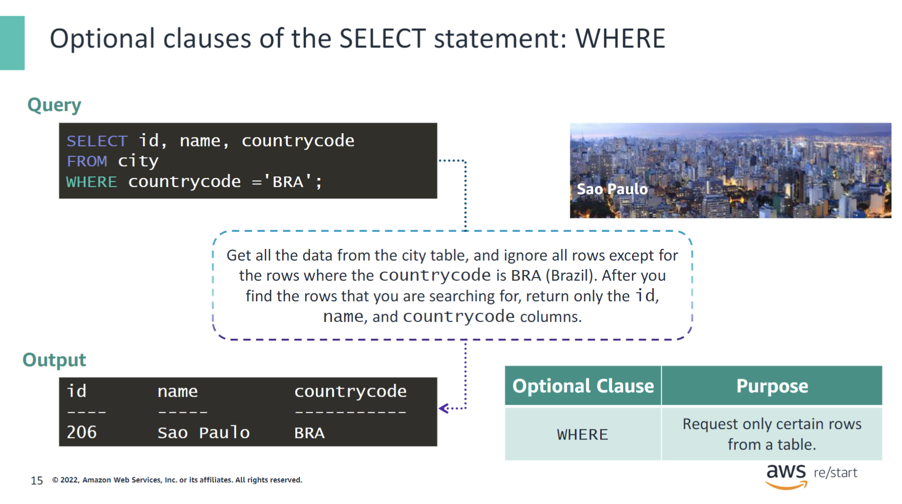

In SQL, you can use the `WHERE` clause to apply a filter that selects only certain rows from a table. In a `SELECT` statement, the `WHERE` clause is optional. The `SELECT-FROM-WHERE` block can be useful for locating certain information in rows.

You could use this construct if you needed a list of all the cities that are located within a country. For this example, the following is the request: Get all the data from the `city` table, and ignore all rows except the rows where the `countrycode` is `BRA` (Brazil). After you find the rows that you are searching for, return only the `id`, `name`, and `countrycode` columns.

The SQL query is as follows:

```sql
SELECT id, name, countrycode 
FROM city 
WHERE countrycode = 'BRA';
```

### Optional clauses of the `SELECT` statement: `GROUP BY`

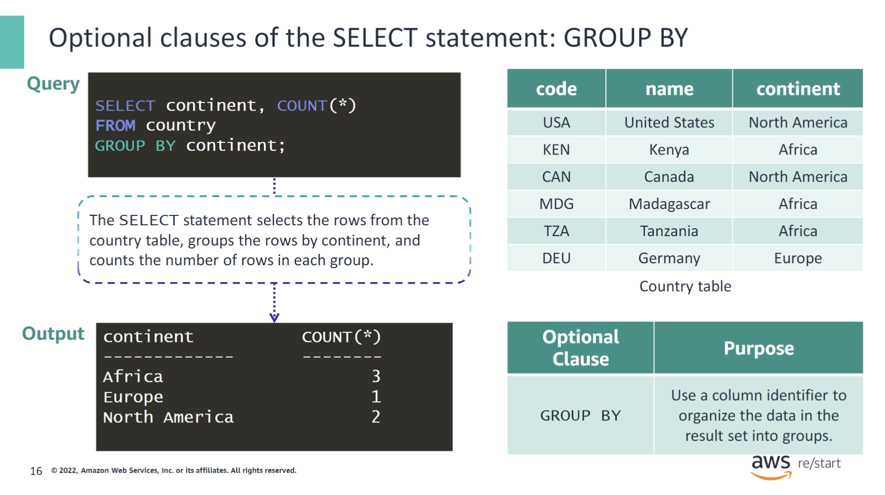

Here, the `SELECT` statement selects the rows from the `country` table, groups the rows by `continent`, and counts the number of rows in each group. The result is a listing of the number of countries in each continent.

Notice that the `GROUP BY` clause typically requires an aggregate function in the `SELECT` clause. In this case, the `COUNT()` aggregate function is used to count the number of rows in a table.

### Optional clauses of the `SELECT` statement: `HAVING`

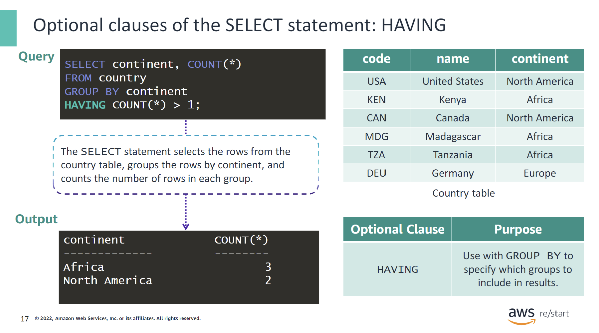

The `HAVING` clause filters the results of a `GROUP BY` clause in a `SELECT` statement. In this example, the query selects only the continents that have more than one country after the rows in the table are grouped by `continent`.

### Optional clauses of the `SELECT` statement: `ORDER BY`

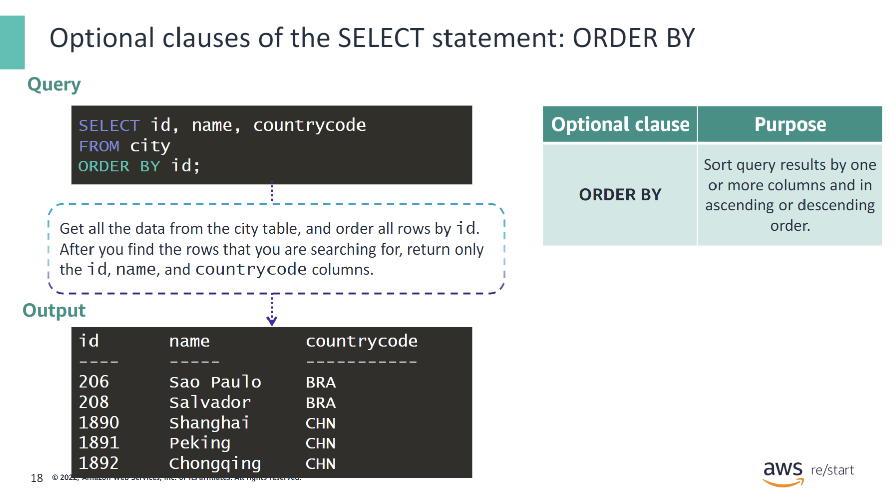

Use the `ORDER BY` clause to sort query results by one or more columns in ascending or descending order. If the items in the table are needed in a specific order of importance, you might need to order the results in ascending or descending order. This example makes the following request: Get all the data from the `city` table, and order all rows by `id`. After you find the rows that you are searching for, return only the `id`, `name`, and `countrycode` columns.

The SQL query is as follows:

```sql
SELECT id, name, countrycode
FROM city
ORDER BY id;
```

:::note
The output that is shown is partial and does not list all of the rows in the table that the query would normally return.
:::

## Comments

### Comment syntax

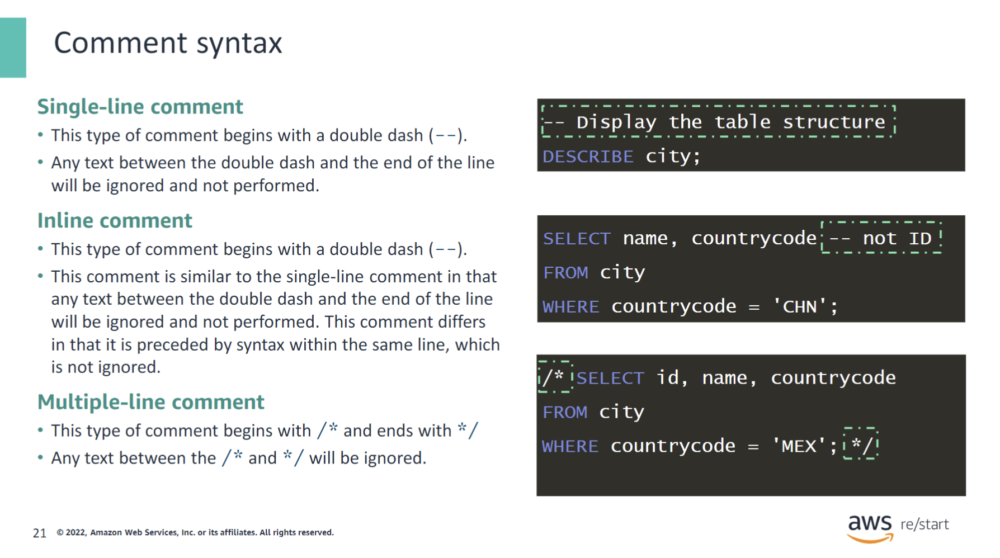

Comments begin with specific characters to denote that they are to be ignored and not executed. This example shows different ways to write comments in SQL.

#### Single-line comment

- This type of comment begins with a double dash (`--`).
- Any text between the double dash and the end of the line will be ignored and not performed.

```sql
-- Display the table structure
DESCRIBE city;
```

#### Inline Comment

- This type of comment also begins with a double dash (--).
- The comment is similar to the single-line comment in that any text between the double dash and the end of the line will be ignored and not performed. However, it differs in that it is preceded by syntax within the same line that is not ignored.

```sql
SELECT name, countrycode -- not ID
FROM city 
WHERE countrycode = 'CHN';
```

#### Multiple-line comment

- This type of comment begins with /* and ends with */.
- Any text between /* and */ will be ignored.

```sql
/* 
SELECT id, name, countrycode
FROM city 
WHERE countrycode = 'MEX'; 
*/
```

## Checkpoint Questions

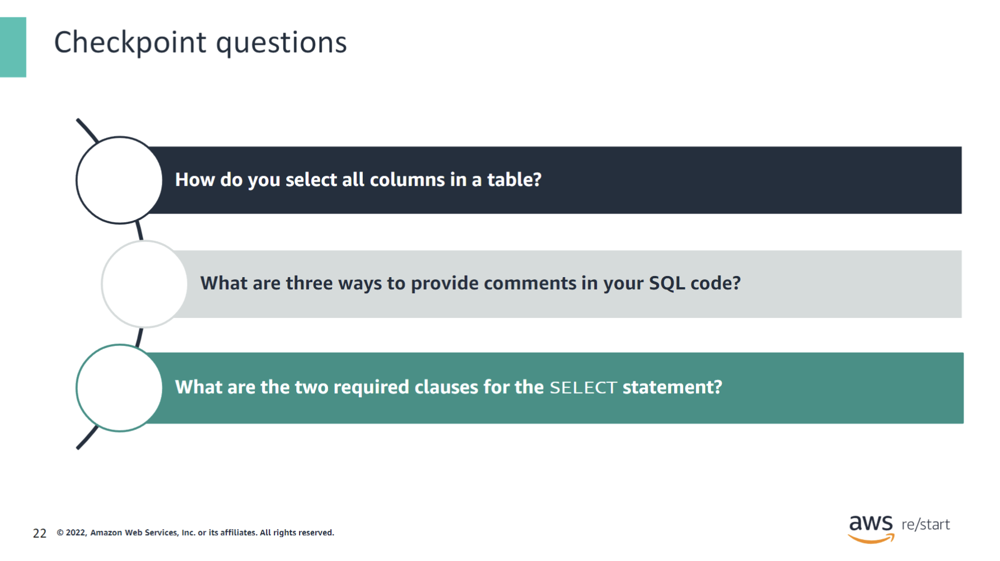

<details>
<summary>1. How do you select all columns in a table?</summary>
Use the `SELECT *` statement.
</details>

<details>
<summary>2. What are three ways to provide comments in your SQL code?</summary>

- Single-line comments
- Multi-line comments
- Inline comments

</details>

<details>
<summary>3. What are the two required clauses for the SELECT statement?</summary>
The `SELECT` clause with column names and the `FROM` clause with the table name.
</details>

## Key Takeaways

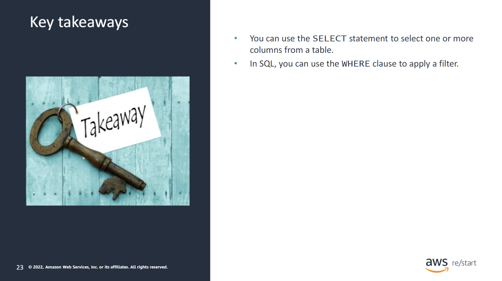

:::tip[This module includes the following key takeaways:]

- You can use theSELECTstatement to select one or more columns from a table.
- In SQL, you can use theWHEREclause to apply a filter.

:::
