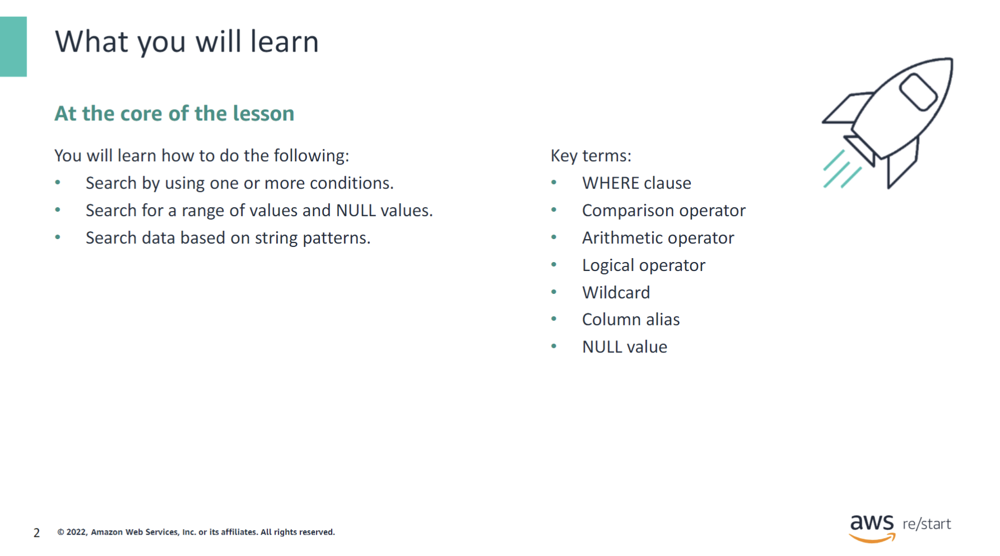

:::tip[In this module, you will learn how to do the following:]

- Search using one or more conditions.
- Search for a range of values and NULL values.
- Search data based on string patterns.

#### Key Terms

- WHERE clause
- Comparison operator
- Arithmetic operator
- Logical operator
- Wildcard
- Column alias
- NULL value

:::

## Simple search conditions

### Overview of search conditions

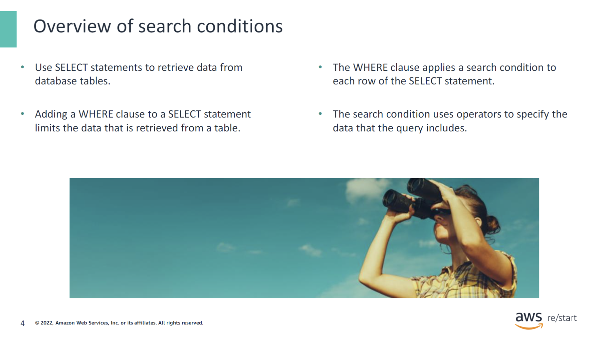

The `SELECT` statement has five main clauses:

- `FROM` clause (required)
- `WHERE` clause
- `GROUP BY` clause
- `HAVING` clause
- `ORDER BY` clause

The `WHERE` clause is used to filter the data that the query returns. The `WHERE` clause sets up a search condition that uses a logical test to decide whether a row should be included in a query.

Search conditions compare two values by using an operator to test whether the search condition is met. If the search condition is met, the query returns the data items from the table.

### Search condition in a WHERE clause

This query introduces the country table, which contains data about countries from around the world. The example shows a conditional search that uses the WHERE clause with the equal to (=) comparison operator.

Specifically, this query returns the continent, surface area, population, and gross national product (GNP) data for the country named Ireland.

## Operators

### Types of operators

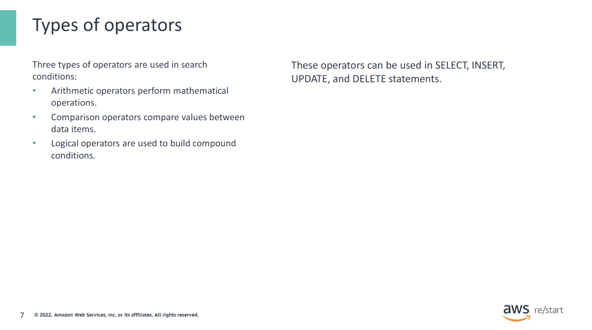

Three types of operators are used in search conditions:

- **Arithmetic operators** perform mathematical operations.
- **Comparison operators** compare values between data items.
- **Logical operators** are used to build compound conditions.

These operators can be used in `SELECT`, `INSERT`, `UPDATE`, and `DELETE` statements.

## Arithmetic operators and comparison operators

### Arithmetic operators

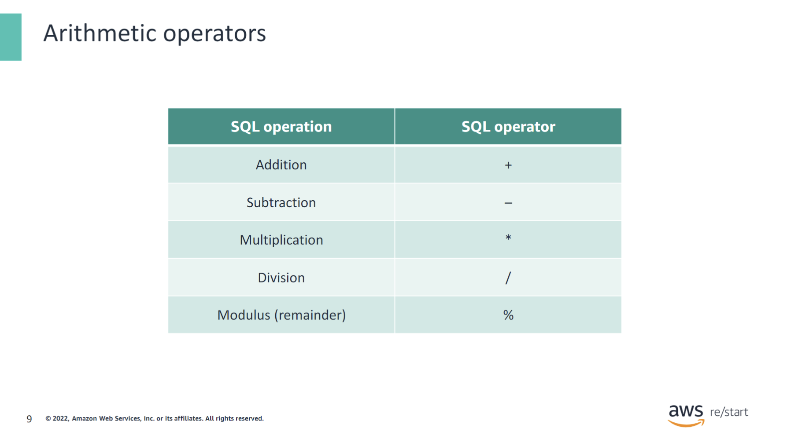

The SQL arithmetic operators are addition, subtraction, multiplication, division, and modulus (remainder after division).

### Comparison operators

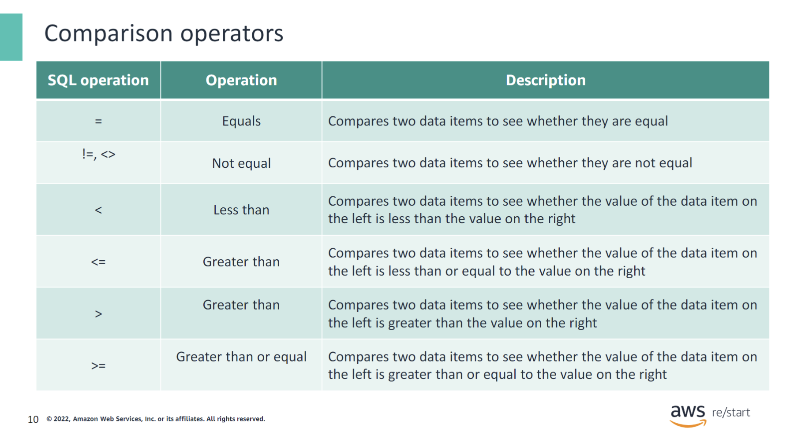

| SQL Operation | Operation                | Description                                                                                      |
|---------------|--------------------------|--------------------------------------------------------------------------------------------------|
| `=`           | Equals                   | Compares two data items to see whether they are equal.                                           |
| `!=`, `<>`    | Not equal                | Compares two data items to see whether they are not equal.                                       |
| `<`           | Less than                | Compares two data items to see whether the value of the data item on the left is less than the value on the right. |
| `<=`          | Less than or equal       | Compares two data items to see whether the value of the data item on the left is less than or equal to the value on the right. |
| `>`           | Greater than             | Compares two data items to see whether the value of the data item on the left is greater than the value on the right. |
| `>=`          | Greater than or equal    | Compares two data items to see whether the value of the data item on the left is greater than or equal to the value on the right. |

:::note
The not-equal-to operator has two options:!= and<>. Which operator you use might be your personal preference, or it might be formally defined according to a company’s established coding standards and practices.
:::

### Addition arithmetic operator

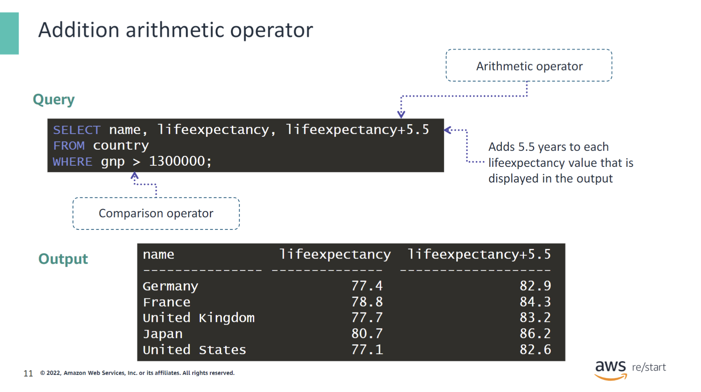

Suppose research shows that the average life expectancy is expected to increase by 5.5 years for countries whose GNP is greater than $1.3 trillion.

This query calculates the new life expectancy for these countries. It adds 5.5 to the current value for life expectancy and then displays that calculated value in the query result.

### Subtraction arithmetic operator

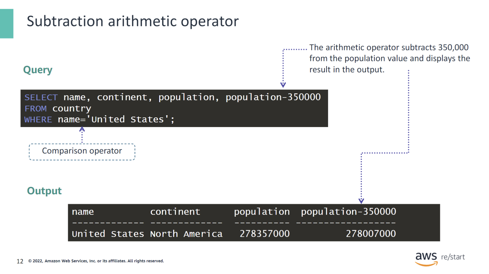

Suppose research shows that the United States population is expected to decline by 350,000 people due to lower birth rates and emigration to other countries.

This query calculates that the new population of the United States will be 278,007,000 people following that decline. It displays that calculated value in the query result.

### Multiplication arithmetic operator

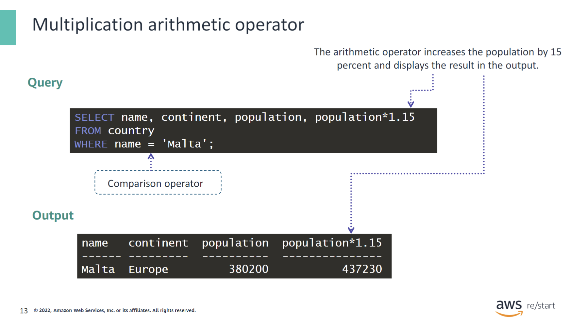

Suppose research shows that Malta expects a 15 percent increase in population as people from around the world move there to live following their retirement.

This query calculates the new population for Malta by multiplying the current value for population by 1.15. It then displays that calculated value in the query result.

### Division arithmetic operator

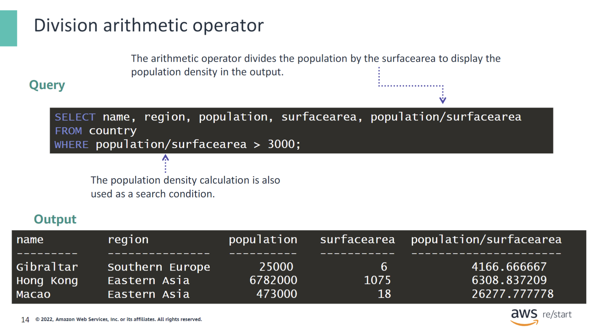

Suppose you want to find the countries whose population density is more than 3,000 people per square kilometer.

This query divides the total population by the country size (surface area in square kilometers) to calculate the population density.

The `WHERE` clause uses the same calculation to limit the query results to only those countries whose population density is greater than 3,000 people per square kilometer.

### Modulus arithmetic operator

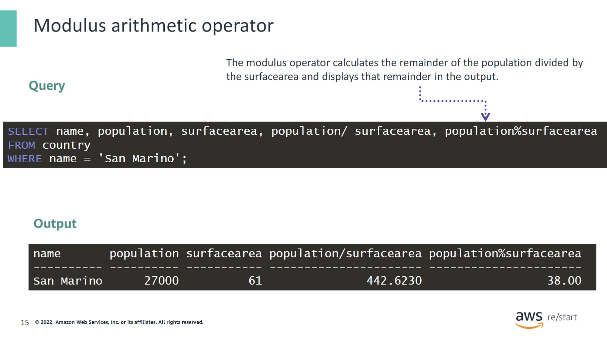

This query shows an example of using the modulus function. It calculates the remainder of 38 square kilometers after dividing the population of San Marino by its surface area.

## Logical operators

### Logical operators explained

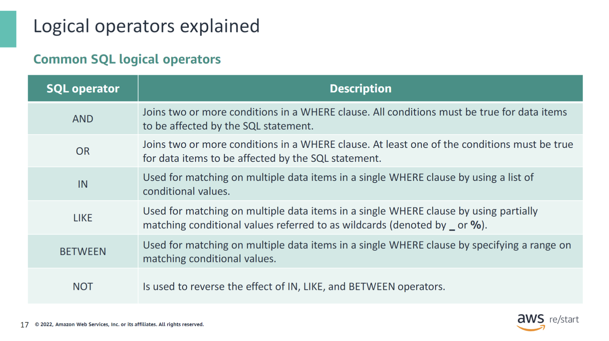

| SQL Operator | Description                                                                                                  |
|--------------|--------------------------------------------------------------------------------------------------------------|
| `AND`        | Joins two or more conditions in a `WHERE` clause. All conditions must be true for data items to be affected by the SQL statement. |
| `OR`         | Joins two or more conditions in a `WHERE` clause. At least one of the conditions must be true for data items to be affected by the SQL statement. |
| `IN`         | Used for matching on multiple data items in a single `WHERE` clause by using a list of conditional values. |
| `LIKE`       | Used for matching on multiple data items in a single `WHERE` clause by using partially matching conditional values referred to as wildcards (denoted by `_` or `%`). |
| `BETWEEN`    | Used for matching on multiple data items in a single `WHERE` clause by specifying a range on matching conditional values. |
| `NOT`        | Is used to reverse the effect of `IN`, `LIKE`, and `BETWEEN` operators.|

This table explains some commonly used SQL logical operators.

### `AND` logical operator

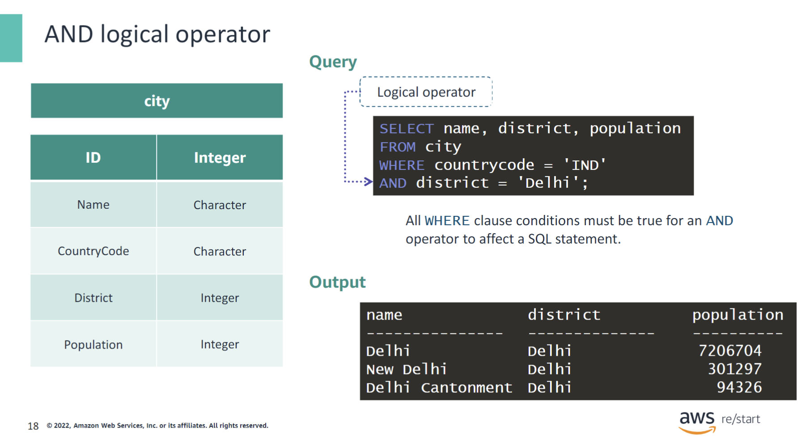

This query introduces the city table, which contains data about cities from all around the world.

This query uses the `AND` operator to return data items for cities in India (IND) whose district is called Delhi.

A city must meet both of these conditions to be included in the query result set.

### `OR` logical operator

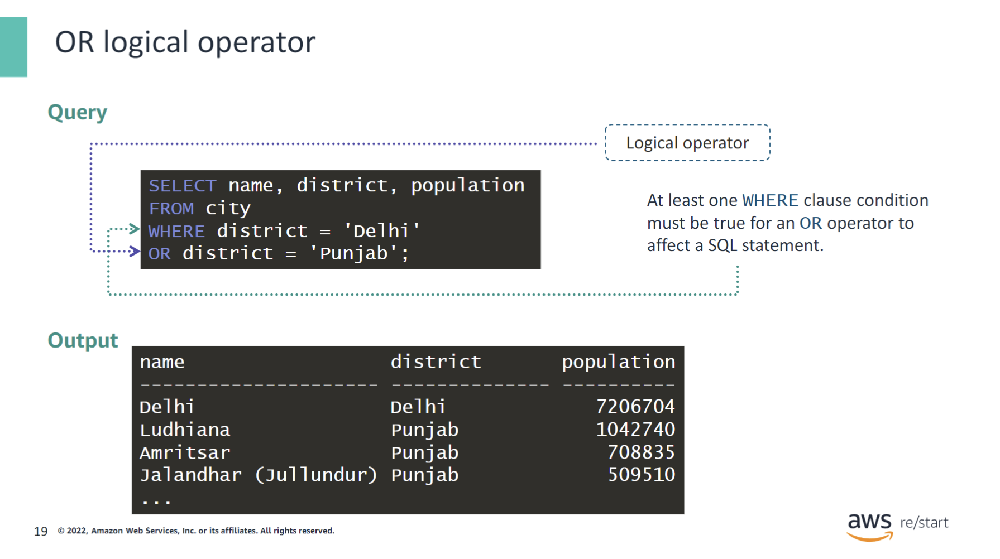

The query uses the `OR` operator to return data items for cities with districts called Delhi or Punjab.

A city must meet one or the other of these district conditions to be included in the query result set.

### `IN` logical operator

The query uses the `IN` operator to return data items for cities with districts called Delhi, Punjab, and Kerala.

The query result set will include any city with a name that matches one of the district names in this list.

### `LIKE` logical operator using the % wildcard

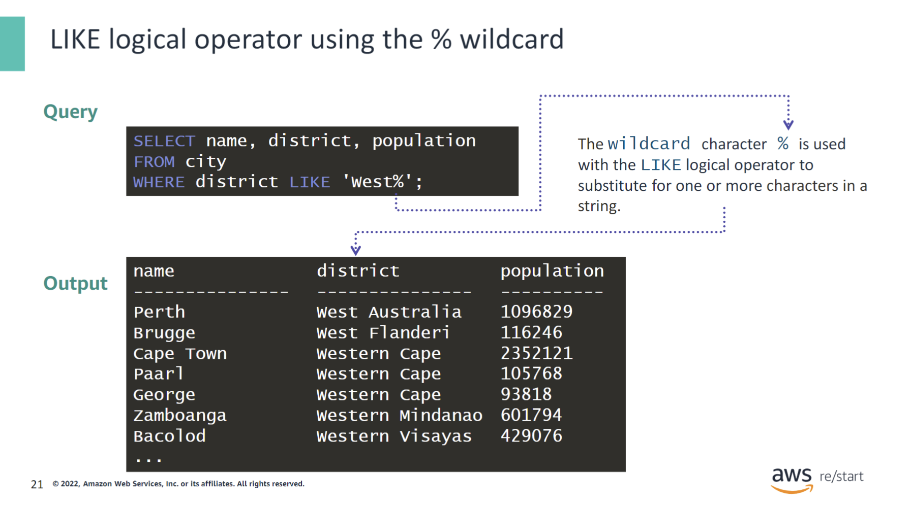

The query uses the `LIKE` operator with a wildcard to return data items for cities whose district names start with the name West.

The rest of the name can consist of any number and type of characters.

### `LIKE` logical operator using the _ wildcard

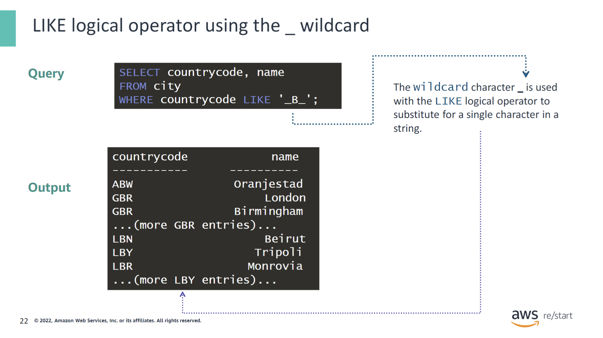

The query uses the `LIKE` operator with a wildcard. It returns data items for cities whose country code has the letter B as second character of the three-character code.

The first and third characters can be any value.

### `BETWEEN` logical operator

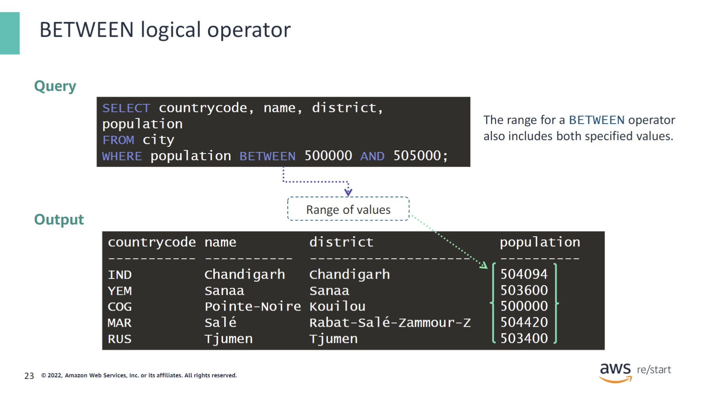

The query uses the `BETWEEN` operator to return data items for cities whose populations are between 500,000 and 505,000 people.

The first and last value for a `BETWEEN` clause are included in the range.

Therefore, the query result set will also include any city whose population is exactly 500,000 or 505,000.

### `NOT` logical operator

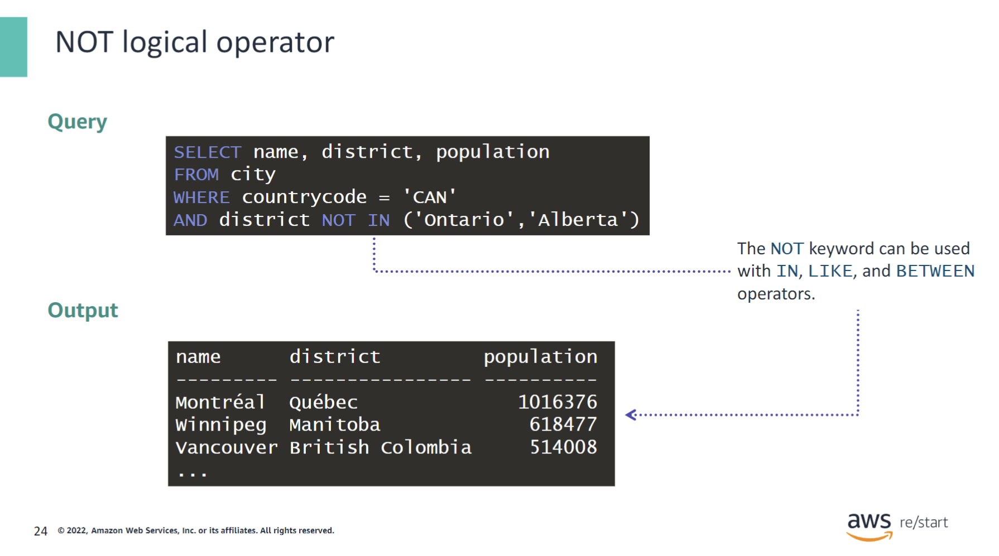

The query uses the `NOT` operator to return data items for cities in Canada, except for cities in Ontario and Alberta. The query result set will omit any city with a name that matches one of the names in this list. The `NOT` operator can be used to modify other SQL operators. For example, you can use the following:

- `NOT IN`
- `NOT BETWEEN`
- `NOT LIKE`

### Operators can be used in flexible ways

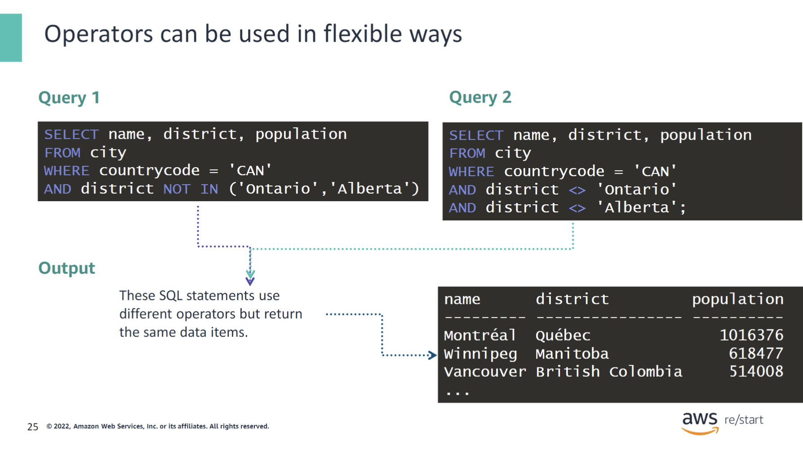

Depending on which SQL operators you use, it is possible to achieve the same results by using different SQL statements.

Neither option is correct or incorrect. Which operators you use can be driven by your personal preferences or might be formally defined according to a company’s established coding standards and practices.

## Operator precedence

### Operator precedence explained

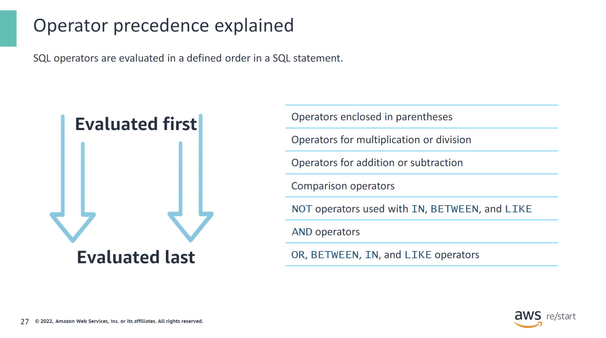

By default, SQL operators are evaluated in a defined order in a SQL statement.

You might need to have your search criteria evaluated in a different order. You can use parentheses in the `WHERE` clause to force your criteria to be evaluated in a different order.

### Using parentheses to enforce operator precedence

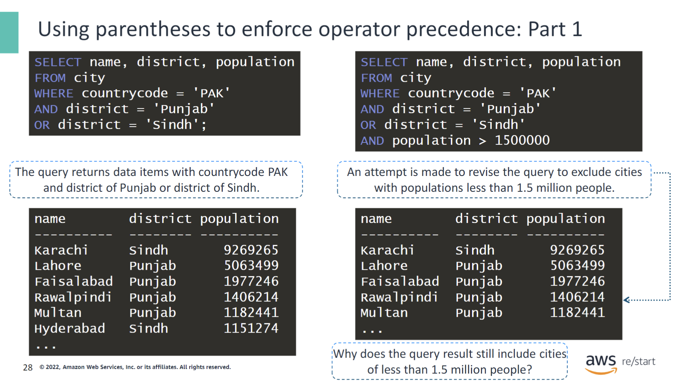

The first query lists all the data items with `countrycode` `PAK` and a district of either Punjab or Sindh. The second query adds an additional search condition to limit the result set to only those cities with populations of more than 1.5 million people.

However, adding this additional condition to the `WHERE` clause did not produce the desired result. This unexpected result happens because, by default, `AND` conditions are applied to the query before `OR` conditions. Therefore, the second query still returns rows for Rawalpindi and Multan, both of which have populations smaller than 1.5 million people.

The next slide shows how to fix this issue by using parentheses.

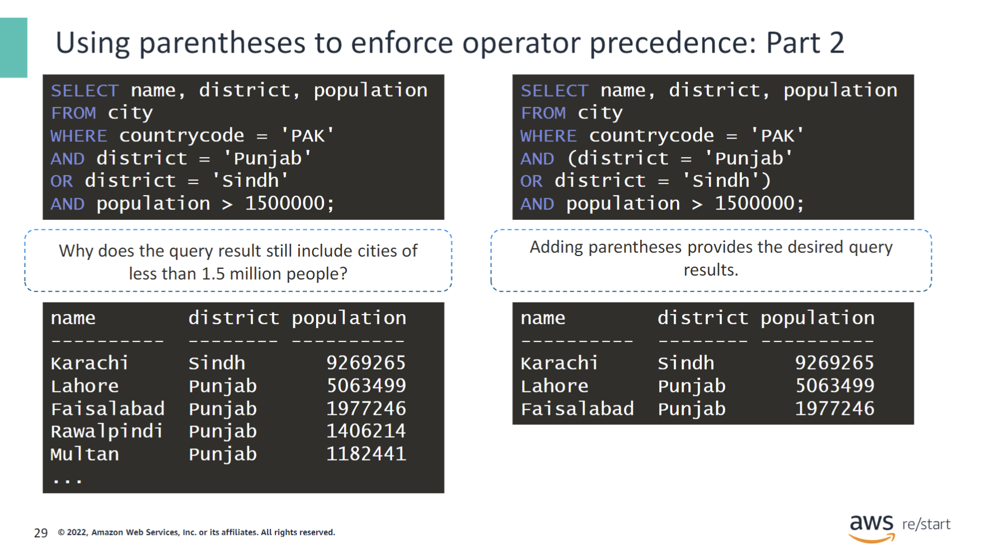

Note that the query on the left is repeated output from the previous slide for reference. The goal of the query on the left is to limit the result set to cities with populations of more than 1.5 million people.

However, adding this to the `WHERE` clause as an additional search condition did not produce the desired result. The query still returns rows for Rawalpindi and Multan, both of which have populations smaller than 1.5 million. This result occurs because SQL processes `AND` operators before `OR` operators.

Therefore, the following is the search condition in this query:

- List data items for cities with a district of Punjab. The population size condition is never applied to cities with a district of Punjab. Therefore, you see cities with populations less than 1.5 million in the query result set.
- List data items for cities with a district of Sindh that are also larger than 1.5 million.

The query on the right shows that adding parentheses to the query can cause the population size condition to be applied after the district name condition. Enclosing that portion of the query in parentheses causes the `OR` condition to be evaluated first, followed by the population condition. This adjustment provides the desired query results.

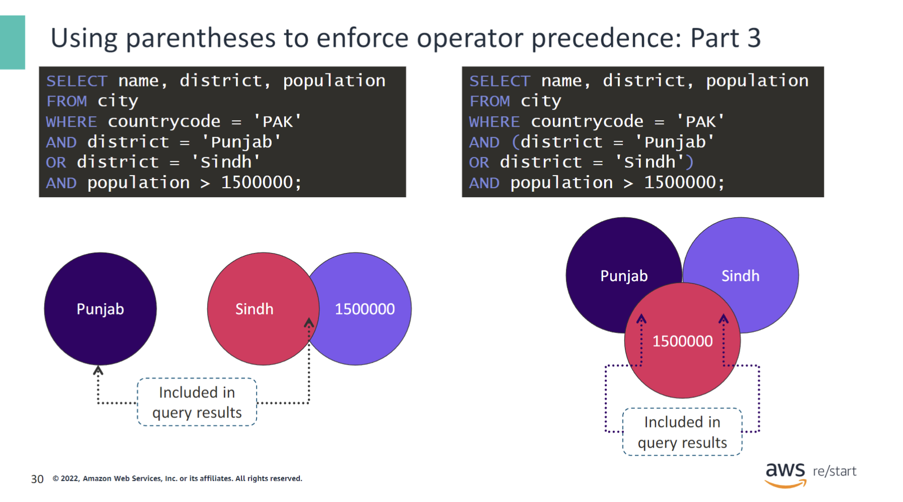

This visual presentation shows how the use of parentheses around the `OR` operator in the previous slide helped to achieve the desired query results.

In the first query, all of the data items for Punjab are included in the query results. This result occurs because the population size condition is never applied to cities with a district of Punjab.

In the second query, the query results include all of the data items for Punjab that have more than 1.5 million people. The results also include the data items for Sindh that have more than 1.5 million people.

## Aliases

In previous examples, the returned results sets used column names that matched the column name or field name in the database. In this section, you use aliases to return query results.

### Overview of an alias

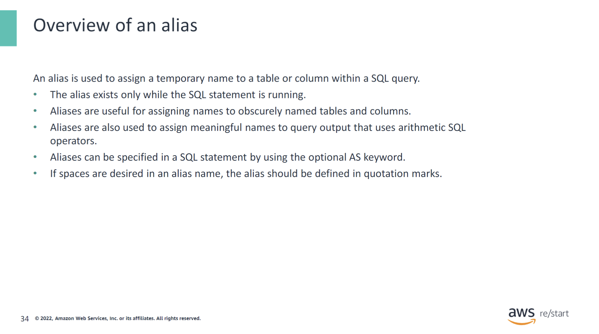

An alias is used to assign a temporary name to a table or column within a SQL query.

- The alias exists only while the SQL statement is running.
- Aliases are useful for assigning names to obscurely named tables and columns.
- Aliases are also used to assign meaningful names to query output that uses arithmetic SQL operators.
- Aliases can be specified in a SQL statement by using the optional `AS` keyword.
- If spaces are desired in an alias name, the alias should be defined in quotation marks.

:::note
You can use aliases to include a column header of your choosing in a query result set.

In some situations, aliases can make your SQL statements simpler to write and easier to read.

You can use the `AS` keyword after the column name to create a new column name.
:::

### An alias applied to arithmetic operator

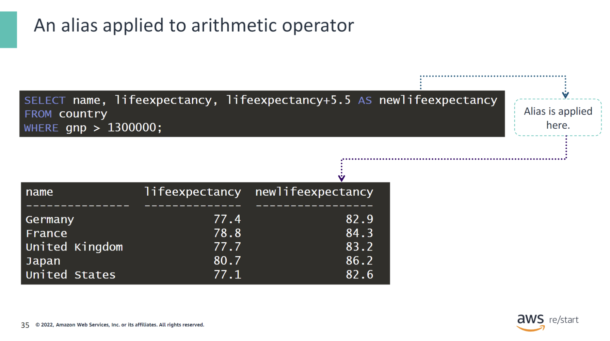

Suppose research shows that average life expectancy is expected to increase by 5.5 years for countries whose GNP is greater than $1.3 trillion.

The query lists the new life expectancy for these countries, with the alias `newlifeexpectancy` used for the column name in the query output.

Without this alias, the column in the query output would use the default column name of `lifeexpectancy + 5.5`.

### Including spaces in an alias

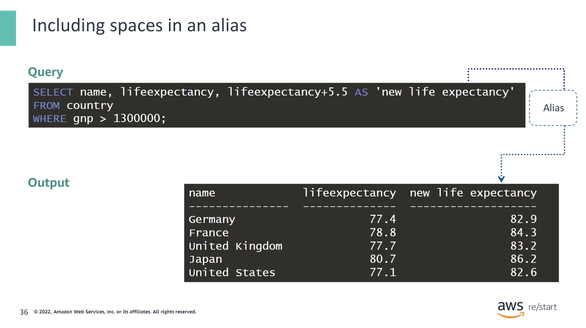

Suppose research shows that average life expectancy is expected to increase by 5.5 years for countries whose GNP is greater than $1.3 trillion.

The query lists the new life expectancy for these countries, with the resulting alias `new life expectancy` (with spaces) used for the column name in the query output.

Without this alias, the column in the query output would use the default column name of `lifeexpectancy+5.5`.

## NULL values

### Overview of NULL values

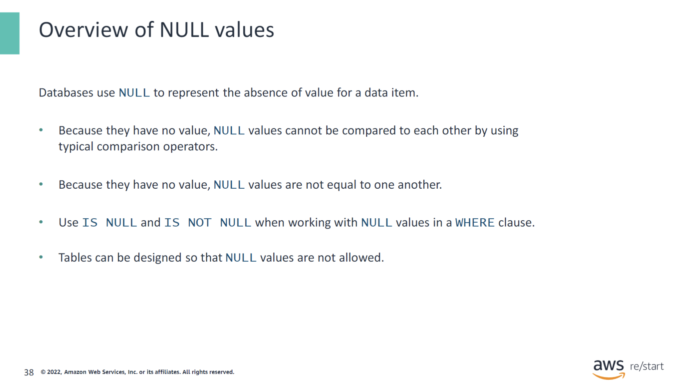

Databases use NULL to represent the absence of value for a data item.

- Because they have no value, NULL values cannot be compared to each other by using typical comparison operators.
- Because they have no value, NULL values are not equal to one another.
- Use `IS NULL` and `IS NOT NULL` when working with NULL values in a WHERE clause.
- Tables can be designed so that NULL values are not allowed.

:::note
A `NULL` is the absence of any value. A zero is not a `NULL` value. A blank space created by pressing the keyboard space bar is not a `NULL` value.

Primary key columns in tables cannot contain `NULL` values.

Non-primary key columns in tables can also be defined as `NOT NULL` if needed.
:::

### Example of querying for NULL values

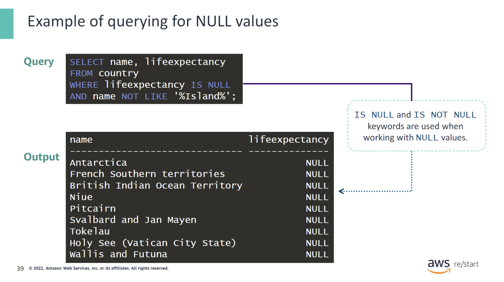

Suppose you want to create some reports related to life expectancy for different countries. You might want to begin by making certain that you have life expectancy data for all the countries in the database.

Countries with no data for life expectancy will have `NULL` values for this column in the table.

By using the `IS NULL` operator as a search condition, this query returns data items for countries that do not have values for life expectancy.

### NULL values can affect query results

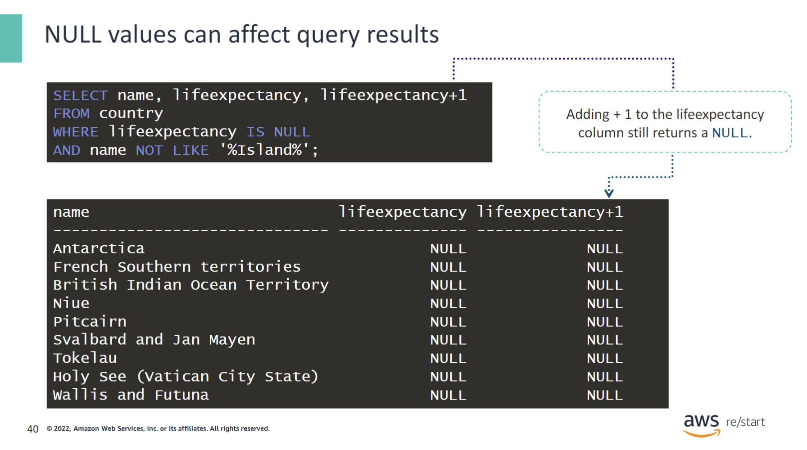

Because `NULL` is the absence of a value, any mathematical or comparison operation on `NULL` values will always return a `NULL` value.

This property can lead to unexpected query results.

In this query, the + 1 is being added to data items that have a `NULL` value for lifeexpectancy.

The result of this calculation returns a `NULL` value for these items.

## Checkpoint questions

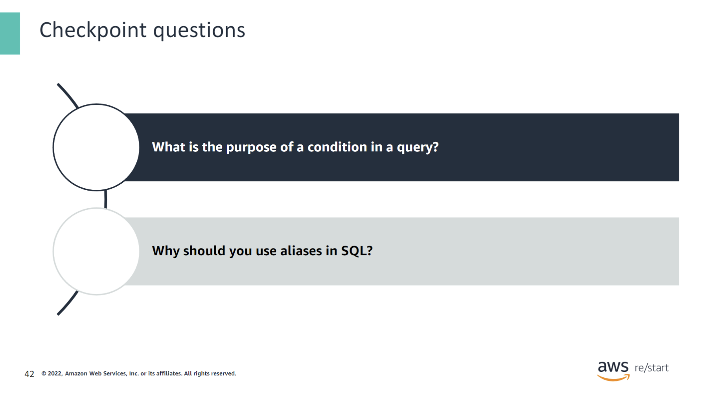

1. What is the purpose of a condition in a query?

You can use conditions in a query to filter your search results.

2. Why should you use aliases in SQL?

Aliases are often used to make column names more understandable.

## Key Takeaways

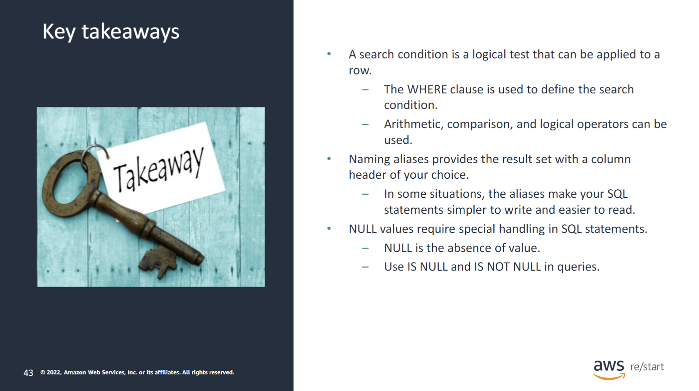

:::tip[This module includes the following key takeaways:]

- A search condition is a logical test that can be applied to a row.
- The `WHERE` clause is used to define the search condition.
- Arithmetic, comparison, and logical operators can be used.
- Naming aliases provides the result set with a column header of your choice.
- In some situations, the aliases make your SQL statements simpler to write and easier to read.
- `NULL` values require special handling in SQL statements.
- `NULL` is the absence of value.
- Use `IS NULL` and `IS NOT NULL` in queries.

:::
