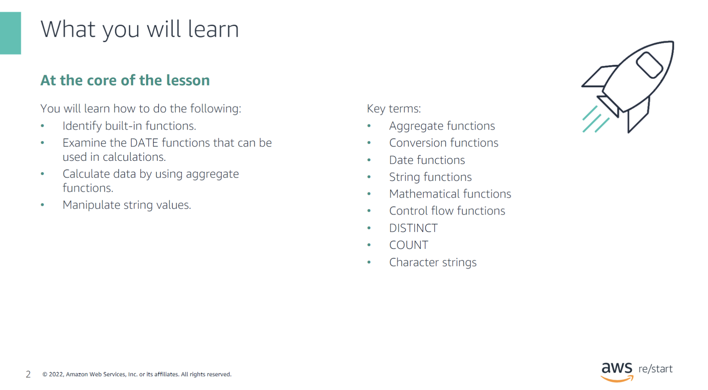

:::tip[You will learn how to do the following:]

- Identify built-in functions.
- Examine the DATE functions that can be used in calculations.
- Calculate data by using aggregate functions.
- Manipulate string values.

Key Terms:

- Aggregate functions
- Conversion functions
- Date functions
- String functions
- Mathematical functions
- Control flow functions
- DISTINCT
- COUNT
- Character strings

:::

## Functions

### Built-in functions

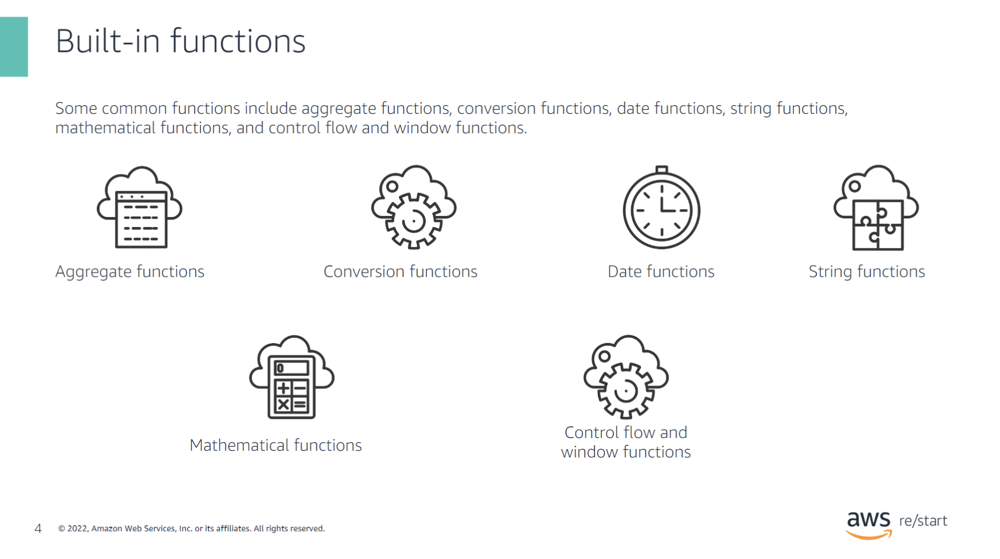

Some common functions include aggregate functions, conversion functions, date functions, string functions, mathematical functions, and control flow and window functions.

### Example syntax

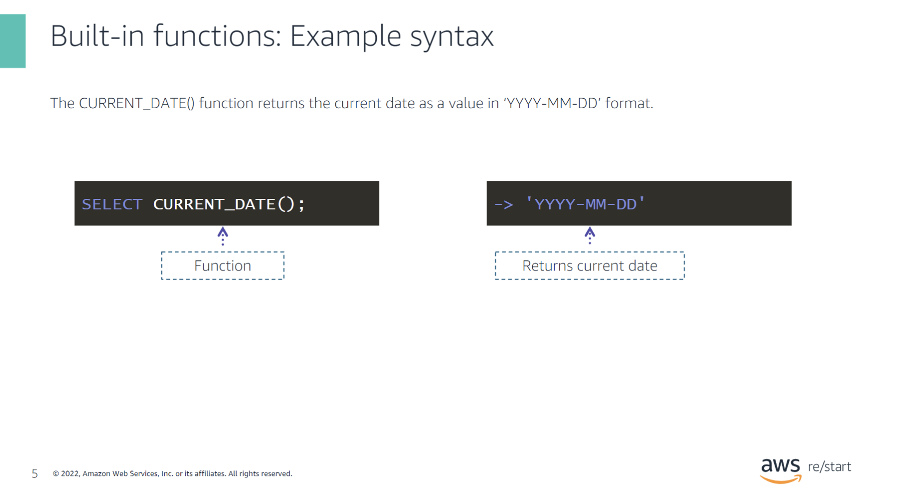

The `CURRENT_DATE()` function returns the current date as a value in `'YYYY-MM-DD'` format.

### Another example syntax

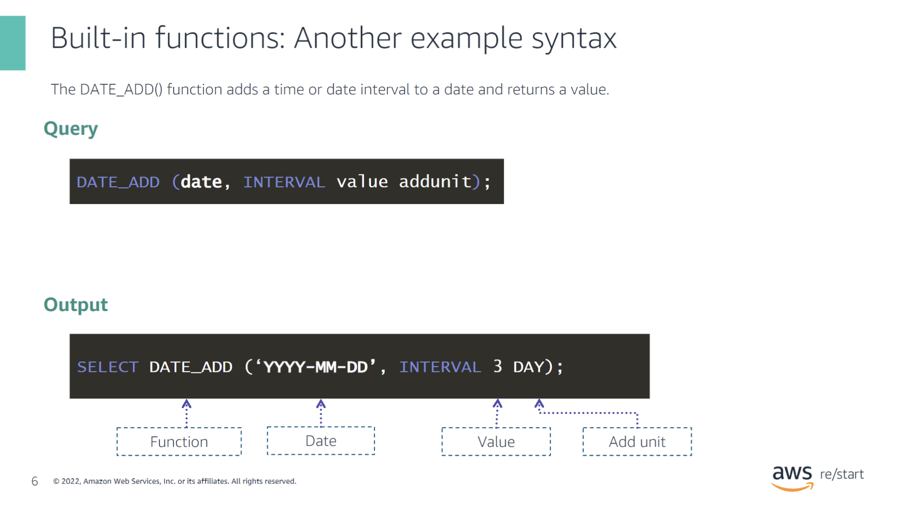

The `DATE_ADD()` function adds a time or date interval to a date and returns a value.

## Aggregate functions

### Common aggregate functions

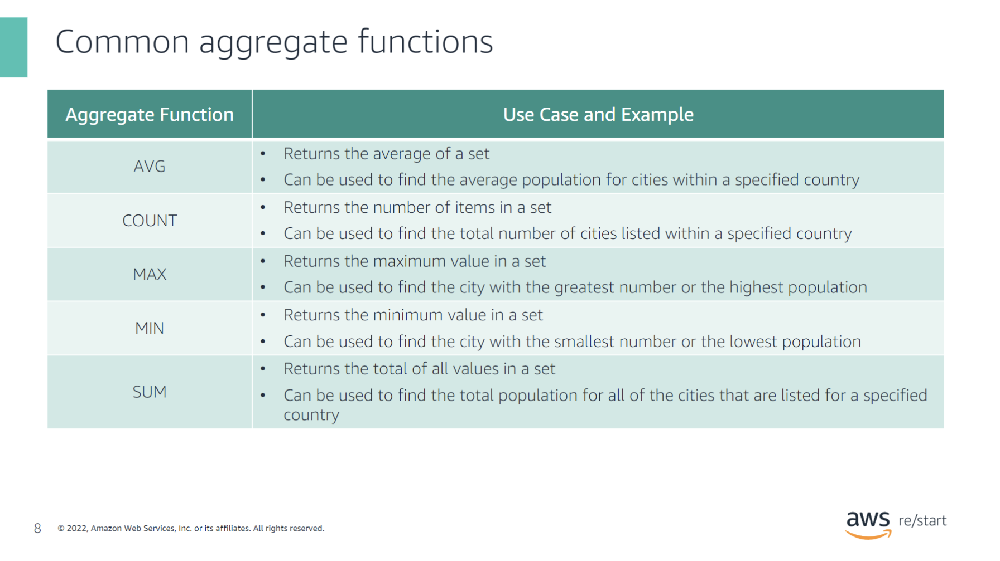

| Aggregate Function | Use Case and Example                                                                                                                                           |
|--------------------|----------------------------------------------------------------------------------------------------------------------------------------------------------------|
| **AVG**            | · Returns the average of a set · Can be used to find the average population for cities within a specified country                                            |
| **COUNT**          | · Returns the number of items in a set · Can be used to find the total number of cities listed within a specified country                                     |
| **MAX**            | · Returns the maximum value in a set · Can be used to find the city with the greatest number or the highest population                                       |
| **MIN**            | · Returns the minimum value in a set · Can be used to find the city with the smallest number or the lowest population                                        |
| **SUM**            | · Returns the total of all values in a set · Can be used to find the total population for all of the cities that are listed for a specified country           |

### Example syntax

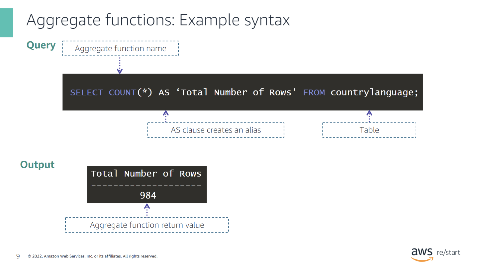

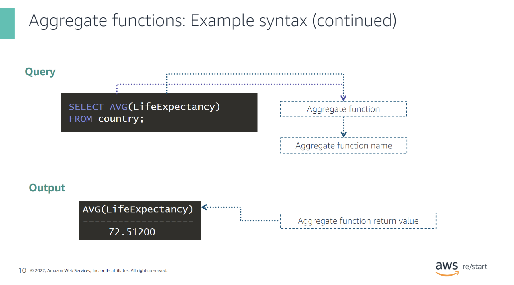

## Activity

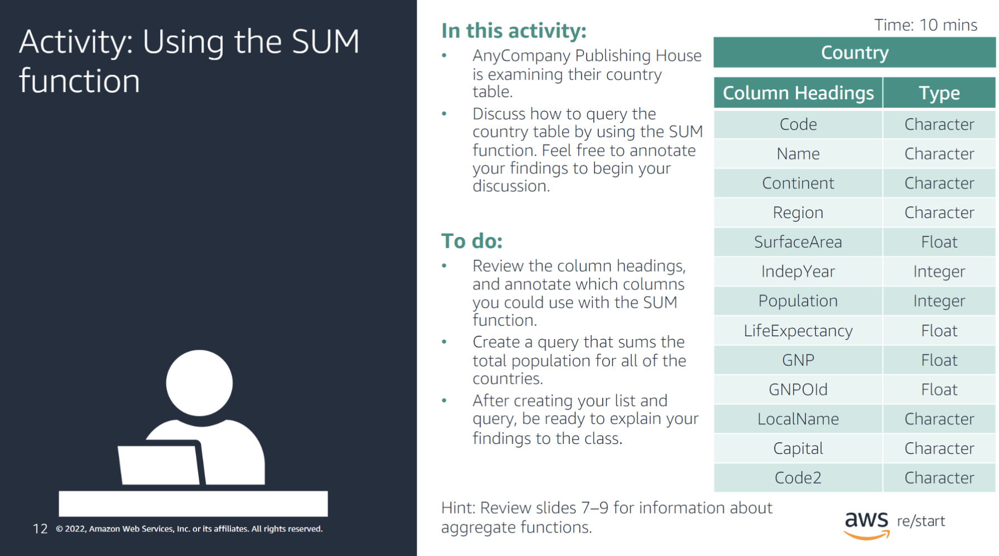

## `DISTINCT` keyword

### `DISTINCT` (different) keyword

### `DISTINCT` in a `COUNT` function

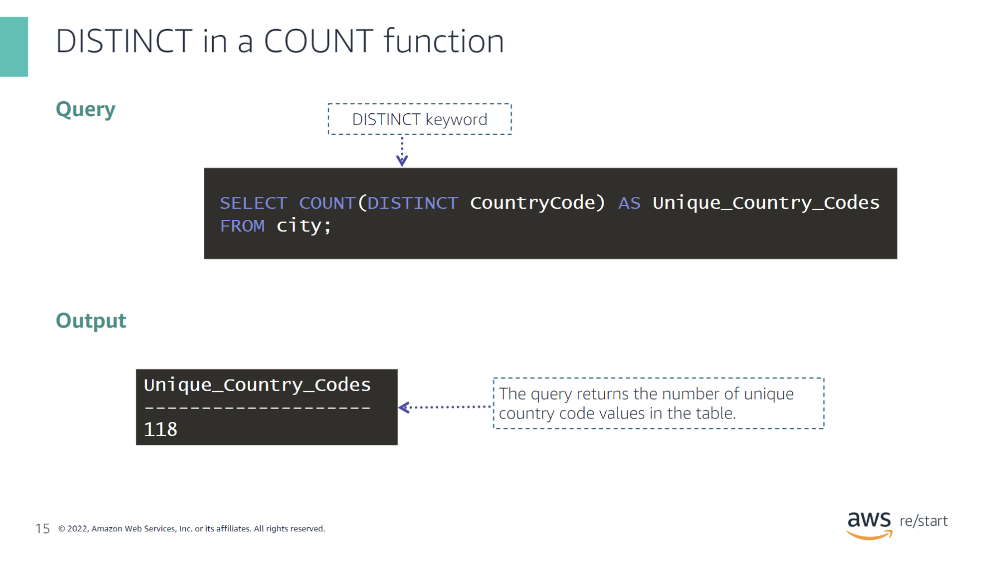

## Character strings and string functions

### String function: `CHAR_LENGTH()`

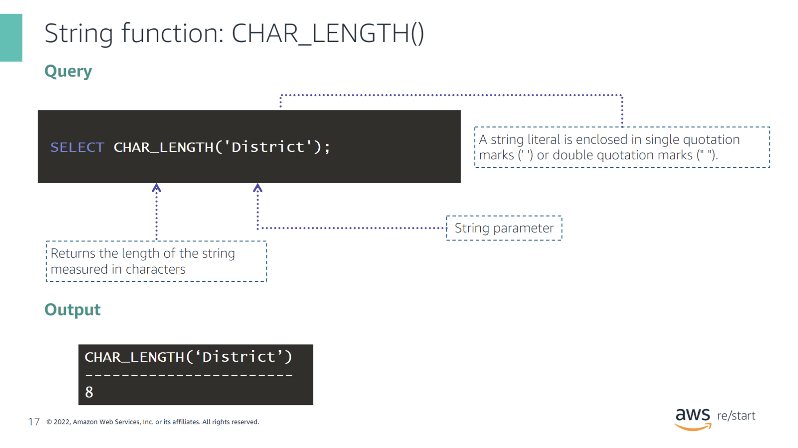

### String function: `INSERT()`

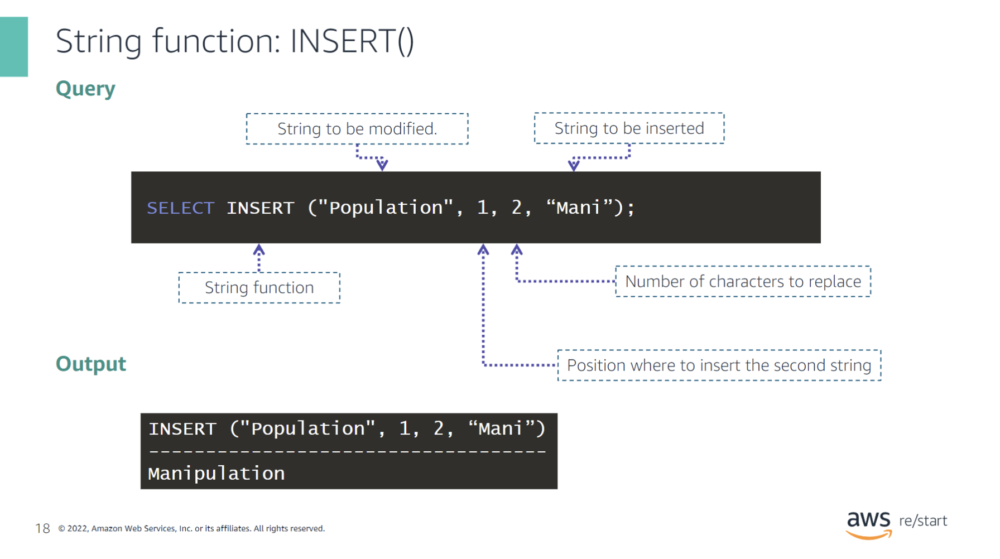

### Leading and trailing spaces in a string

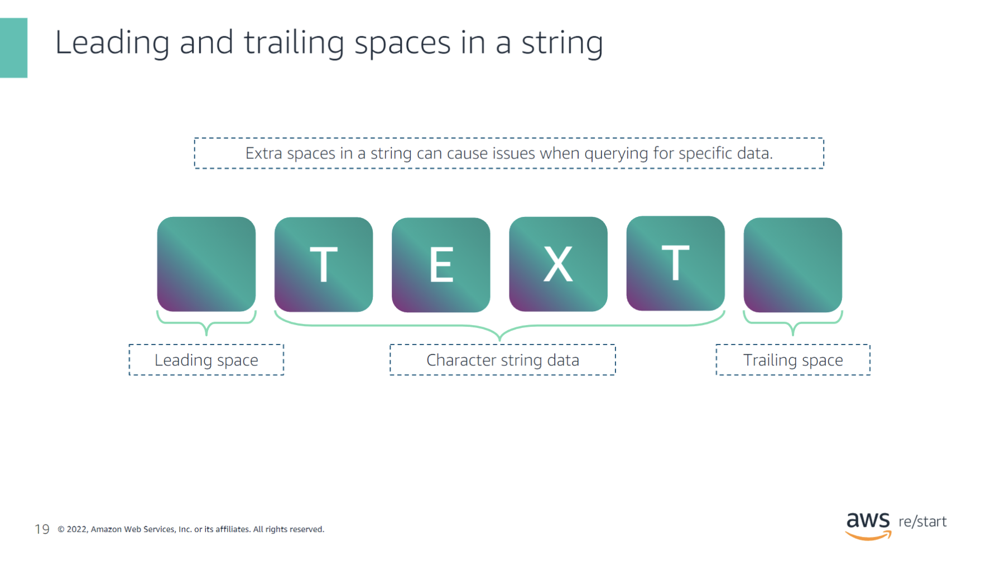

### TRIM functions: RTRIM() and LTRIM()

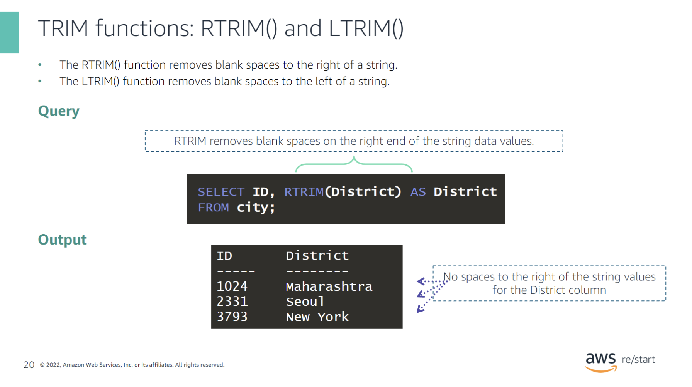

- The `RTRIM()` function removes blank spaces to the right of a string.
- The `LTRIM()` function removes blank spaces to the left of a string.

## Checkpoint questions

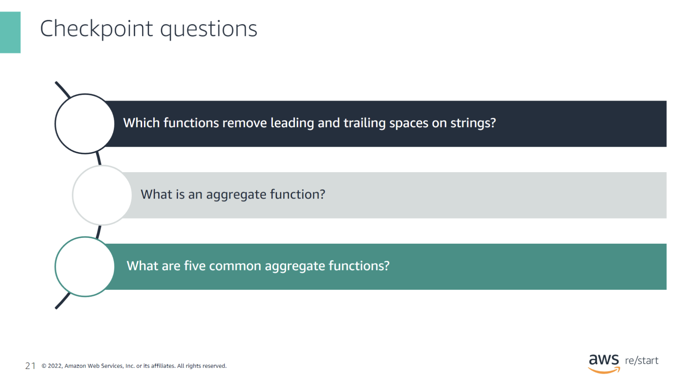

Which functions remove leading and trailing spaces on strings?

The `TRIM()` function is used to remove leading and trailing spaces from strings.

What is an aggregate function?

An aggregate function performs a calculation on a set of values and returns a single value. It is commonly used in SQL to summarize data.

What are five common aggregate functions?

Five common aggregate functions are:
- `AVG()`
- `COUNT()`
- `MAX()`
- `MIN()`
- `SUM()`

## Key Takeaways

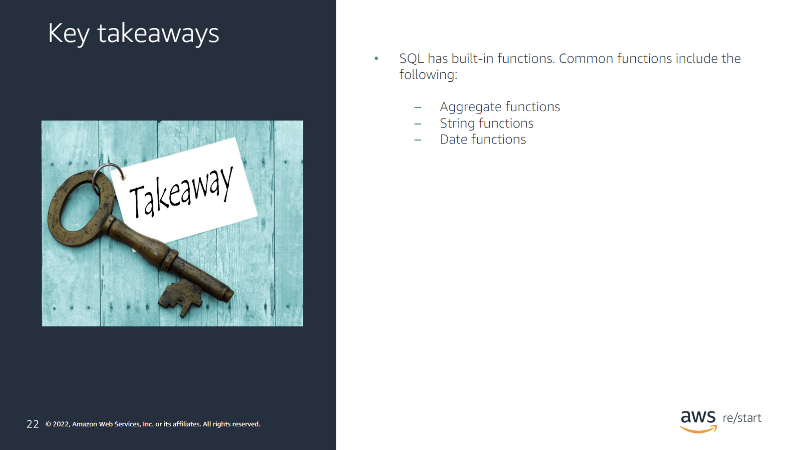

