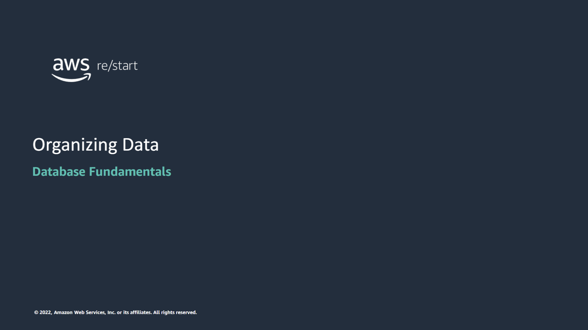

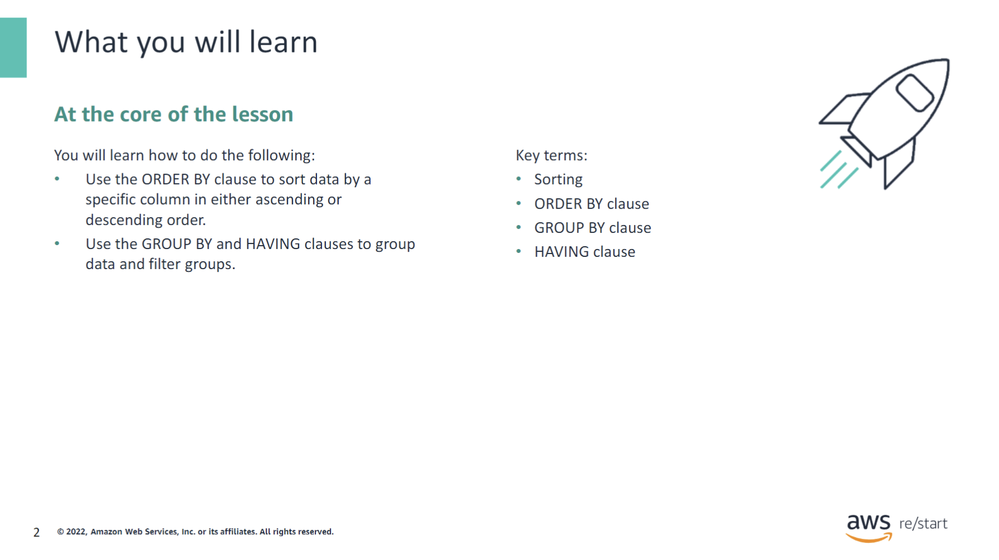

:::tip[In this module, you will learn how to do the following:]

- Use the `ORDER BY` clause to sort data by a specific column in either ascending or descending order.
- Use the `GROUP BY` and `HAVING` clauses to group data and filter groups.

:::

:::note[Key terms include the following:]

- Sorting
- ORDER BY clause
- GROUP BY clause
- HAVING clause

:::

## Organizing data by using SQL

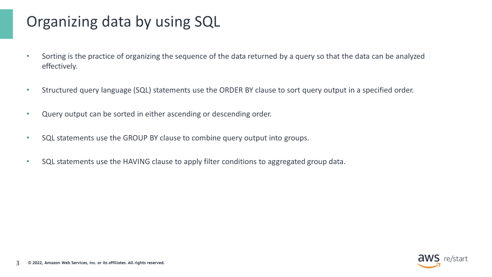

- You can use the SQL `ORDER BY` clause to return query results in a specific sort order of your choosing.
- You can use the `GROUP BY` clause to aggregate query results into smaller result sets.
- You can use the `HAVING` clause to limit the results of a query that includes aggregated data.

## Sorting and `ORDER BY` keyword

### Query output with no sorting

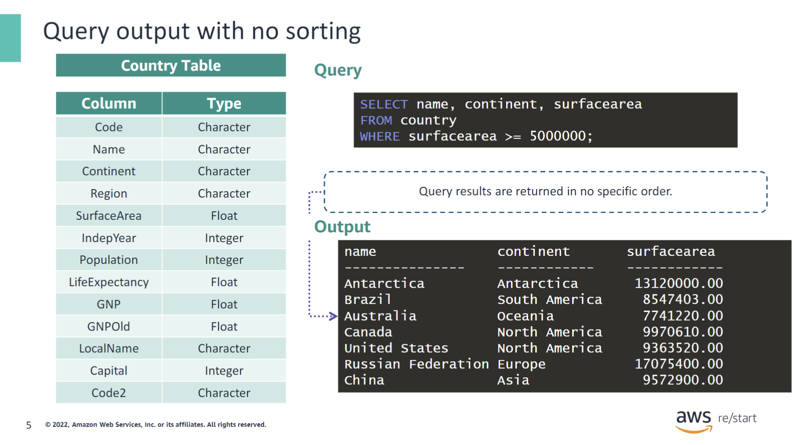

This query does not include any SQL clauses for sorting. Therefore, the data is returned in no specific order. Some SQL databases return the rows in the order in which they were originally loaded into the table.

You can add an `ORDER BY` clause to the SQL statement if you want the query output to be returned in a specific order.

### Query output sorted in ascending order

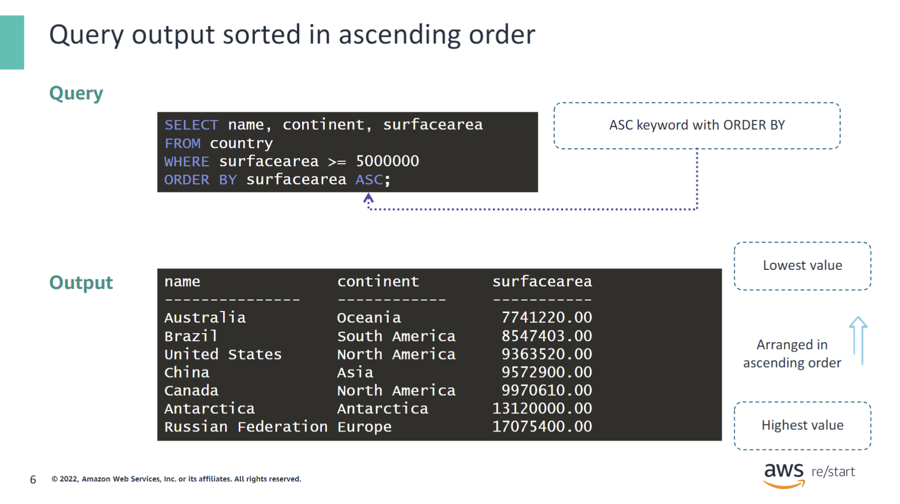

This query includes an `ORDER BY` clause, which sorts the query results in a specific order. In this case, it orders by the values of the surfacearea column from smallest to largest. Ordering data from smallest to largest value is referred to as ascending order.

Ascending order sorts are specified by including the ASC keyword, which follows the `ORDER BY` clause. Because ascending order sorts are the default sort order for an `ORDER BY` clause, omitting the ASC keyword will still provide the same results.

### Query output sorted in descending order

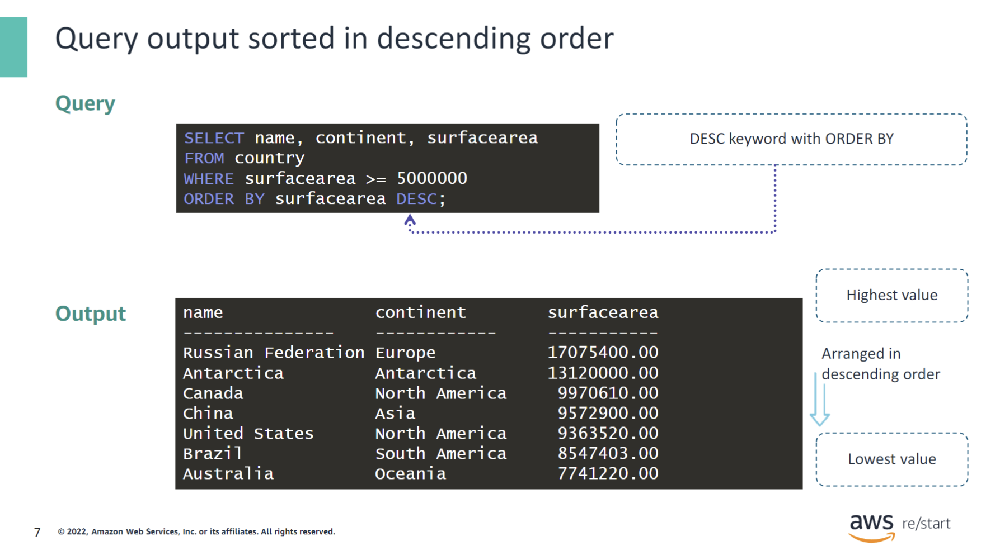

This query also includes a SQL clause with an `ORDER BY` clause. This time the query results are sorted by the values of the surfacearea column from largest to smallest.  Ordering data from largest to smallest values is referred to as descending order.

Descending sorts are specified by including the `DESC` keyword, which follows the `ORDER BY` clause.

### Query output by using multiple sort operations

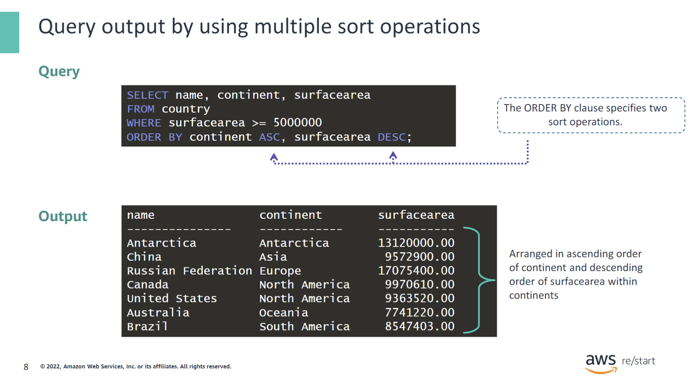

An `ORDER BY` clause can contain more than one sort operation. This example first sorts the query results by continent name in ascending order. This sort is called the primary sort order because this sort is listed first in the `ORDER BY` clause. Next, the results of the primary sort are sorted again in descending order of surfacearea. This sort is called a secondary sort because this sort is listed second in the `ORDER BY` clause.

`ORDER BY` clauses are not limited to two sort operations. The available columns in the table or tables that are being queried drive the list of columns by which you can sort.

### Query output by using implicit columns in sort operations

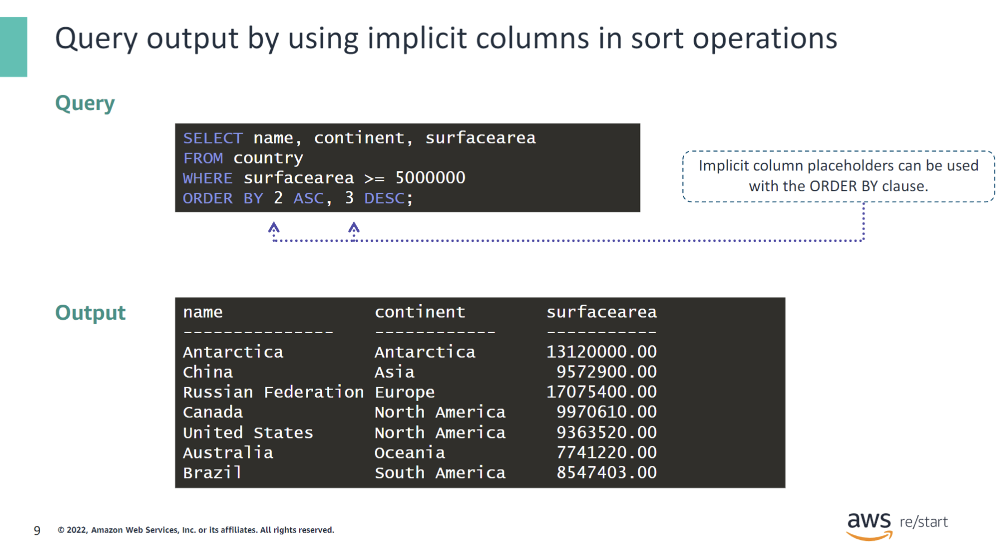

Instead of spelling out entire column names in an `ORDER BY` clause, you can also use implicit column placeholders. 

This query has `continent` and `surfacearea` columns as the second and third columns in the `SELECT` clause. You can use those implicit numeric placeholder values in the `ORDER BY` clause in place of the actual column names themselves.

In this example:

- The number `2` in the `ORDER BY` clause represents the `continent` column from the `SELECT` clause.
- The number `3` represents the `surfacearea` column from the `SELECT` clause.

You can choose the method that you use to specify the sort columns based on your personal preferences. Alternatively, a company’s established coding standards and practices might formally define this method.

## Grouping and filtering data

### Grouping data in query output

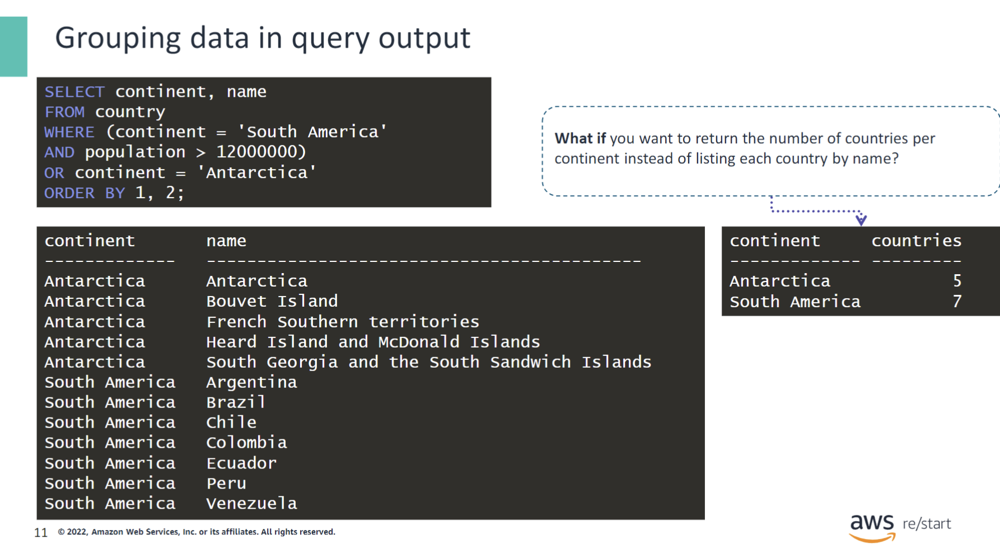

This query returns the continent and name of each country that has one of the following characteristics:

- The country is in South America and has a population of more than 12 million people.
- The country is on the continent of Antarctica.

The results are ordered by country name within continent. However, not all queries require such detailed results. In some situations, data that is grouped together and summarized is more useful for analysis.

For example, what if you were interested in only the total number of countries per continent and not the individual names of each country? You can use the `GROUP BY` clause to summarize data in this way.

### Grouping data in query output by using GROUP BY

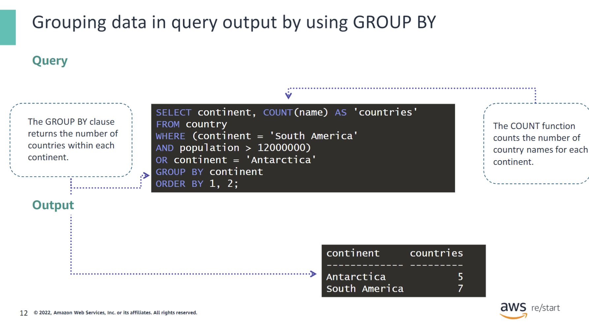

You can use the `GROUP BY` clause in a SQL statement to group data items of the same value together.

The `GROUP BY` clause is typically used in conjunction with `SELECT` statements that include SQL aggregation functions such as `COUNT`, `MAX`, `MIN`, `SUM`, and `AVG`. The `GROUP BY` clause groups the query results together by using the specified aggregation function.

In this example, the `GROUP BY` clause groups together all the data items that have the same value for continent name. Then, it counts how many country names are included in that group.

### Using GROUP BY items with filter conditions

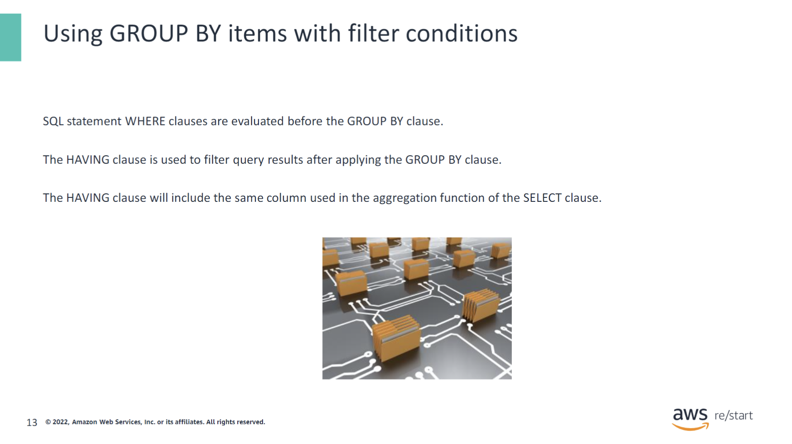

The `WHERE` clause is evaluated before the `HAVING` clause in a SQL statement.

### Adding the HAVING clause as filter condition

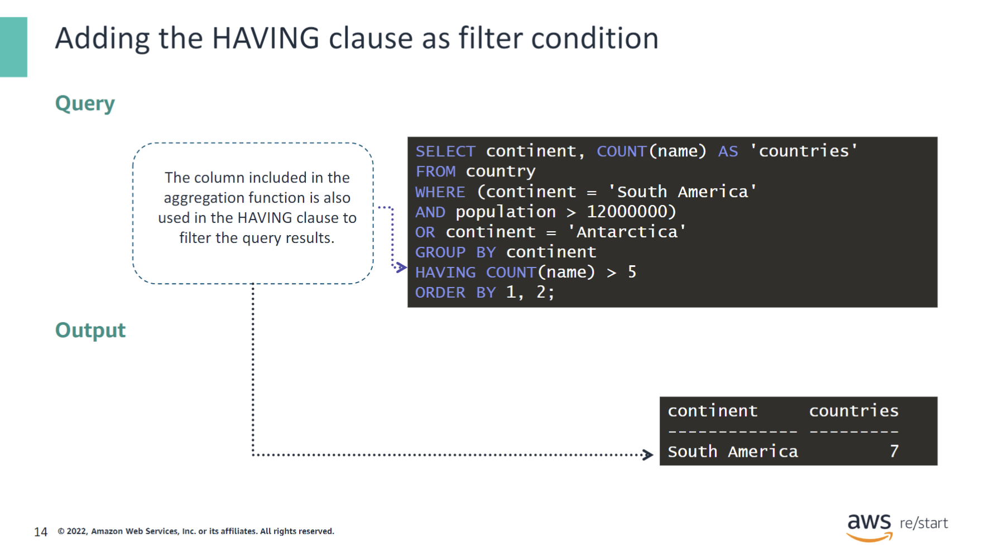

The `HAVING` clause in a SQL statement is used with the `GROUP BY` clause to add a filter condition based on the aggregated value. In this example, the `GROUP BY` clause returns two rows. The `HAVING` clause then further filters those rows to return only the continents that have more than five countries in them.

## Checkpoint questions

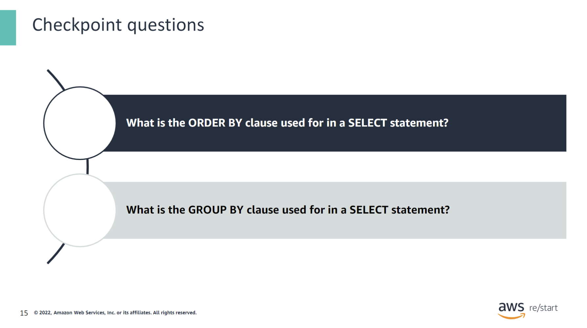

What is the ORDER BY clause used for in a SELECT statement?

The `ORDER BY` clause is used to sort the rows in a query result set in a certain order.

What is the GROUP BY clause used for in a SELECT statement?

The `GROUP BY` clause combines rows into groups based on matching values.

## Key Takeaways

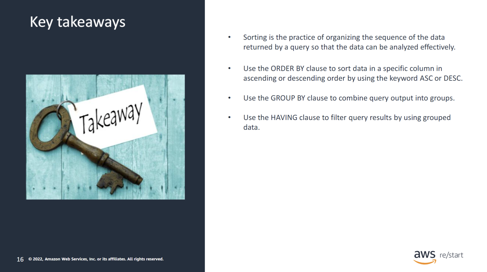

:::tip[This lesson includes the following takeaways:]

- Sorting is the practice of organizing data into a structured format so that it can be analyzed effectively.
- Use the `ORDER BY` clause to sort data in a specific column in ascending or descending order by using the keyword `ASC` or `DESC`.
- Use the `GROUP BY` clause to combine query output into groups.
- Use the `HAVING` clause to filter query results by using grouped data.

:::
