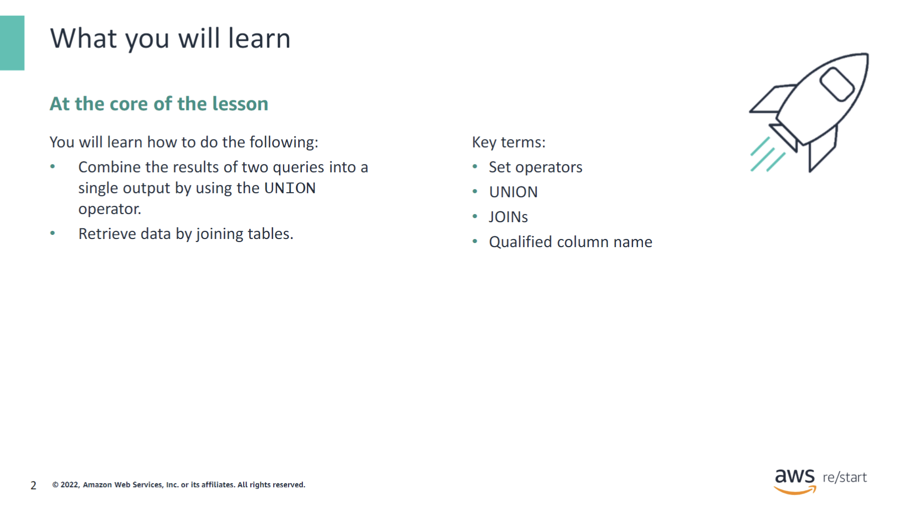
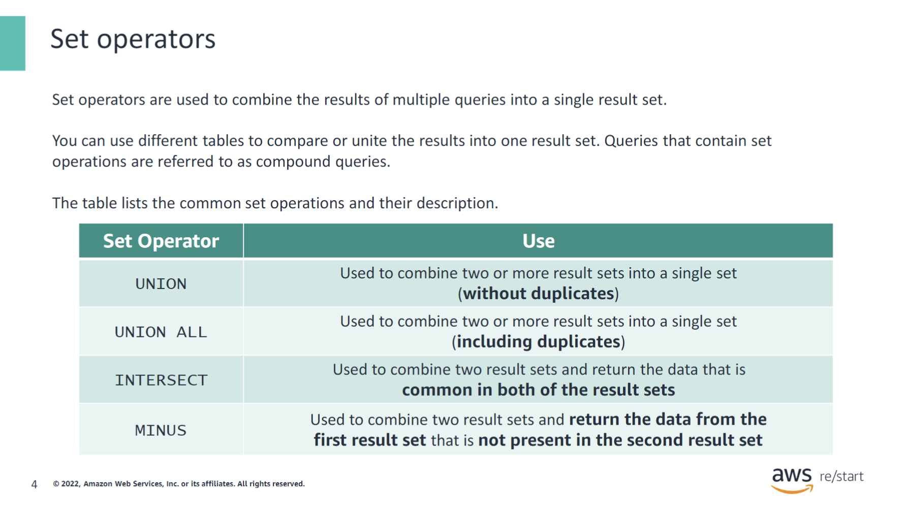
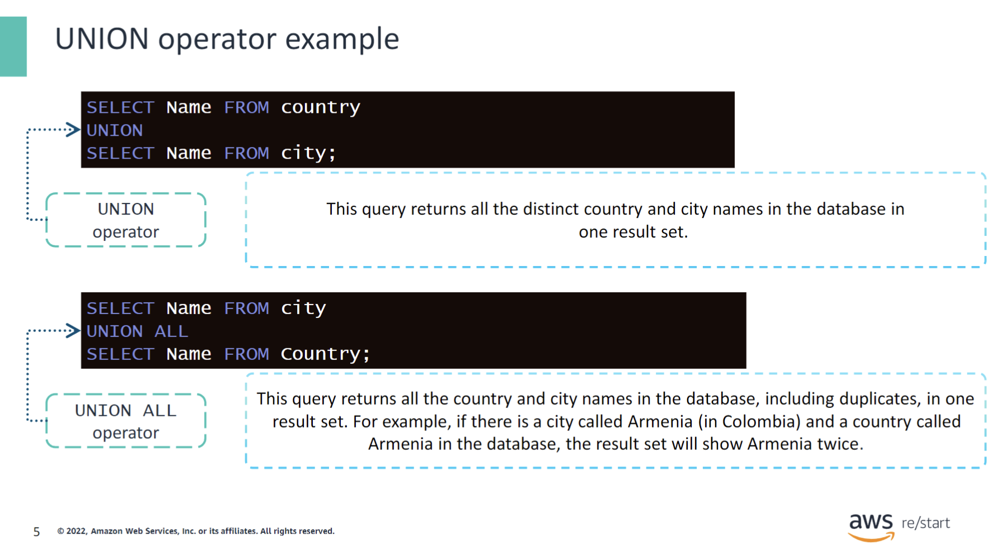
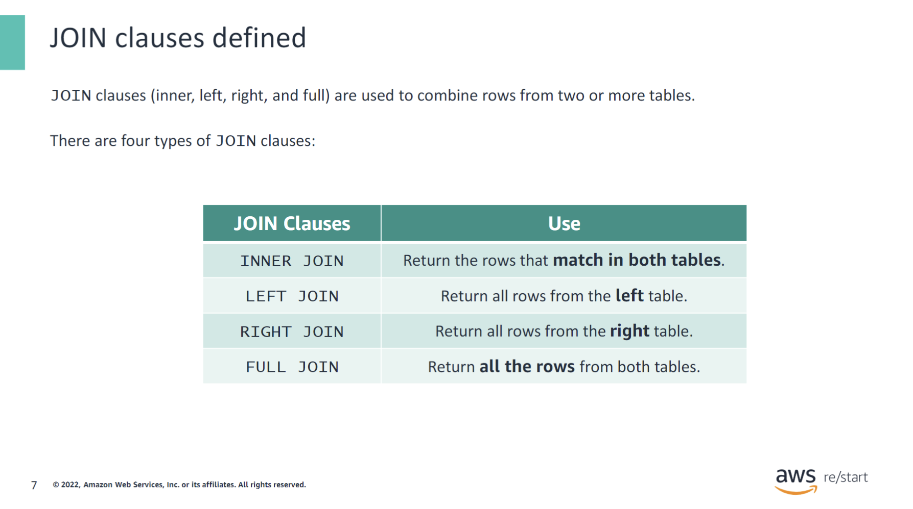
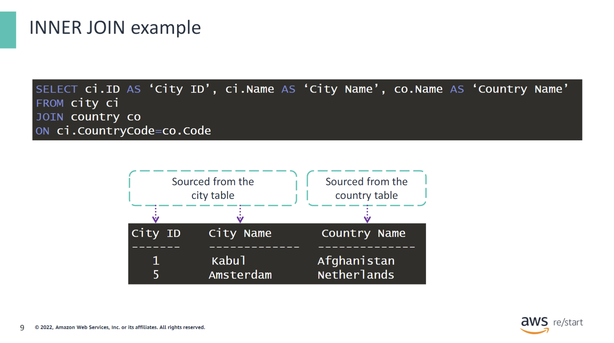
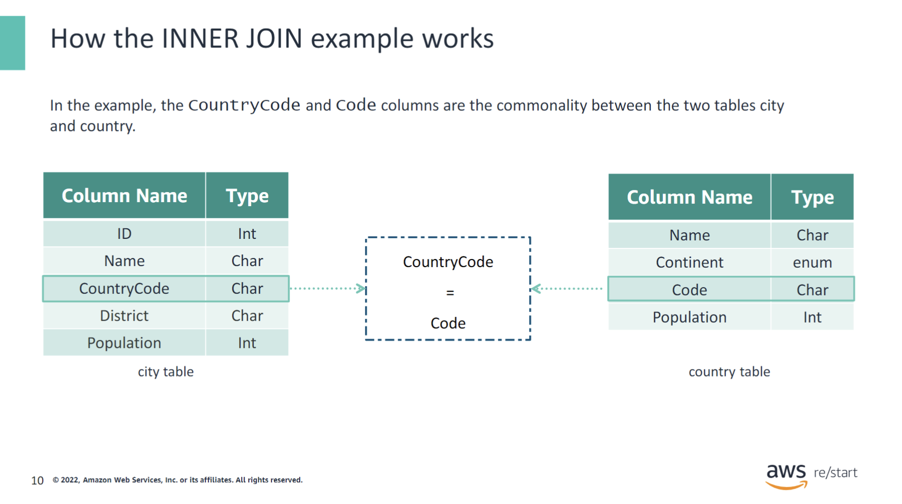
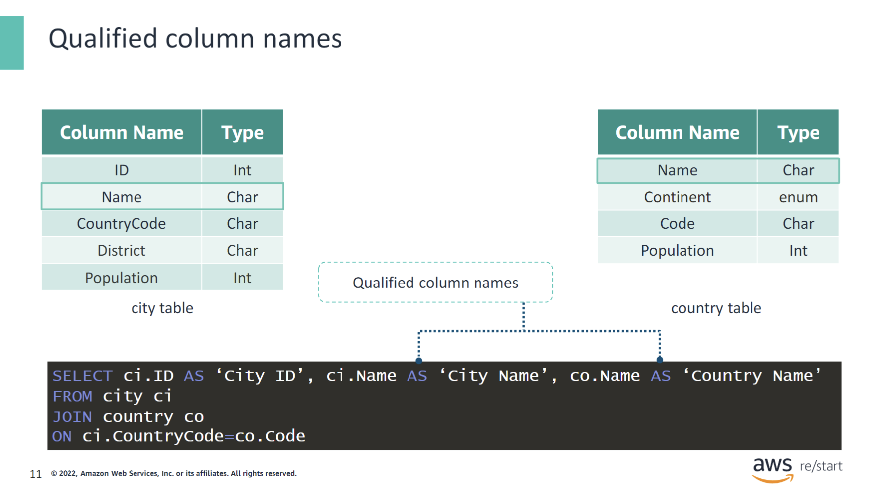
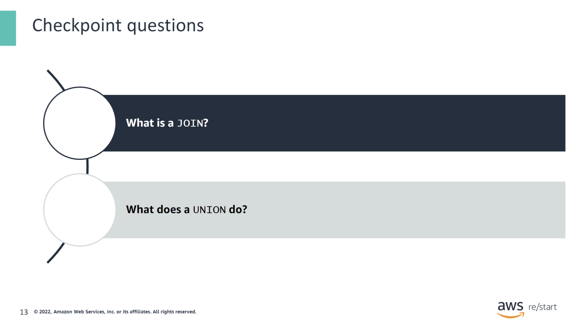
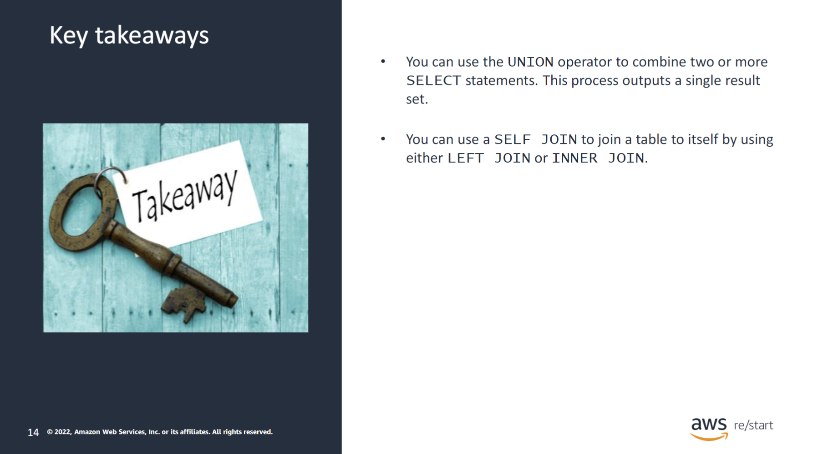

---



:::tip[You will learn how to do the following:]

- Combine the results of two queries into a single output by using the UNIONoperator.
- Retrieve data by joining tables.

:::

:::note[Key Terms]

- Set operators
- UNION
- JOINS
- Qualified column name

:::

## Set operators



Set operators are used to combine the results of multiple queries into a single result set. You can use different tables to compare or unite the results into one result set. Queries that contain set operations are referred to as compound queries.

| Set Operator | Use |
|--------------|-----|
| `UNION`      | Used to combine two or more result sets into a single set (without duplicates) |
| `UNION ALL`  | Used to combine two or more result sets into a single set (including duplicates) |
| `INTERSECT`  | Used to combine two result sets and return the data that is common in both of the result sets |
| `MINUS`      | Used to combine two result sets and return the data from the first result set that is not present in the second result set |

With set operations, the results of multiple queries can be combined into a single result set. You can use different tables to compare or unite the results into one result set. Queries that contain set operations are referred to as compound queries.

### UNION operator example



```sql title=/world.sql
SELECT Name FROM country
UNION
SELECT Name FROM city;
```

You can use the `UNION` operator to combine the results of two or more `SELECT` statements into a single result set. Using `UNION` without the `ALL` operator will remove duplicate rows from the resulting set. The keyword `ALL` lists duplicate rows and displays them in the result set.

```sql title=/world.sql
SELECT Name FROM city
UNION ALL
SELECT Name FROM country;
```

## JOINs

### `JOIN` clauses defined



JOIN clauses (inner, left, right, and full joins) are used to combine rows from two or more tables. There are four types of JOIN clauses:

- **Inner joins** return the rows that match in both tables.
- **Left joins** return the rows that match in both tables and the rows from the left table that do not have a match.
- **Right joins** return the rows that match in both tables and rows from the right table that do not have a match.
- **Full joins** return the rows that match in both tables and the rows from the left and right tables that do not have a match.

Each table must have related columns between them when combining tables.

### How JOIN clauses work


Queries can link two or more tables through the use of JOINs. The diagram on the slide shows the output of the JOIN types by using Venn diagrams and illustrates the following:

- **INNER JOIN**: This JOIN returns only the overlapping data between the two tables.
- **LEFT JOIN**: This JOIN returns the overlapping data between the two tables and the non-matching data from the left table.
- **RIGHT JOIN**: This JOIN is the opposite of LEFT JOIN. It returns the overlapping data between the two tables and the non-matching data from the right table.
- **FULL JOIN**: This JOIN returns the overlapping data between the two tables and the non-matching data from both the left and right tables.

The critical thing to remember is that JOINs are clauses in SQL that link two tables together. A JOIN is usually based on the key or common value that defines the relationship between those two tables.

### INNER JOIN example



The `JOIN` clause could be used to combine the records from the `city` and `country` tables. The column names pulled from each do not need to match. For example, the `JOIN` column name is called `CountryCode` in the `city` table and `Code` in the `country` table.

In this example, the query displays the ID, name, and country name of each city in the `city` table.

### How the INNER JOIN example works



To combine tables, each table must have related columns between them. In the example, the `CountryCode` and `Code` columns are the commonality between the `city` and `country` tables. The two tables are joined together by combining rows whose `CountryCode` value in the `city` table is equal to the `Code` value in the `country` table.

### Qualified column names



You'll notice in this example that both tables include the `Name` column. When developing queries, columns with the same name in two different tables can create confusion. To avoid this confusion, use a qualifier with the column name to identify the source table.

A qualifier for a column name can be a table name, an alias name, a synonym, or a correlating name. To use a qualified column name, use the following format:

```sql
Table or alias name.column name
```

## Checkpoint questions



<details>
<summary>What is a JOIN?</summary>

You can use a `JOIN` to combine data from two or more tables.

</details>

<details>
<summary>What does a UNION do?</summary>

A `UNION` operation combines the results of two queries into one result.

</details>

## Key Takeaways



:::tip[This module includes the following key takeaways:]

- You can use the `UNION` operator to combine two or more `SELECT` statements. This process outputs a single result set.
- You can use a `SELF JOIN` to join a table to itself by using either a `LEFT JOIN` or an `INNER JOIN`.

:::
