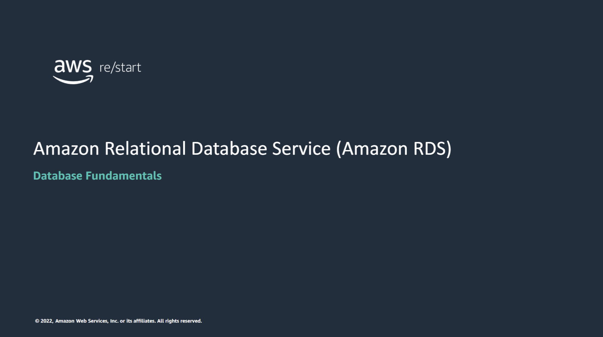

Welcome to Amazon Relational Database Service (Amazon RDS).

In this module, you’ll discover key concepts that are related to database solutions, including the following:
- Identifying the different database services in the cloud
- Discovering the differences between unmanaged and managed database solutions

The goal of this module is to help you understand the database resources that are available to power your solution. You will also review the different service features that are available so that you can understand how different choices affect solution availability.

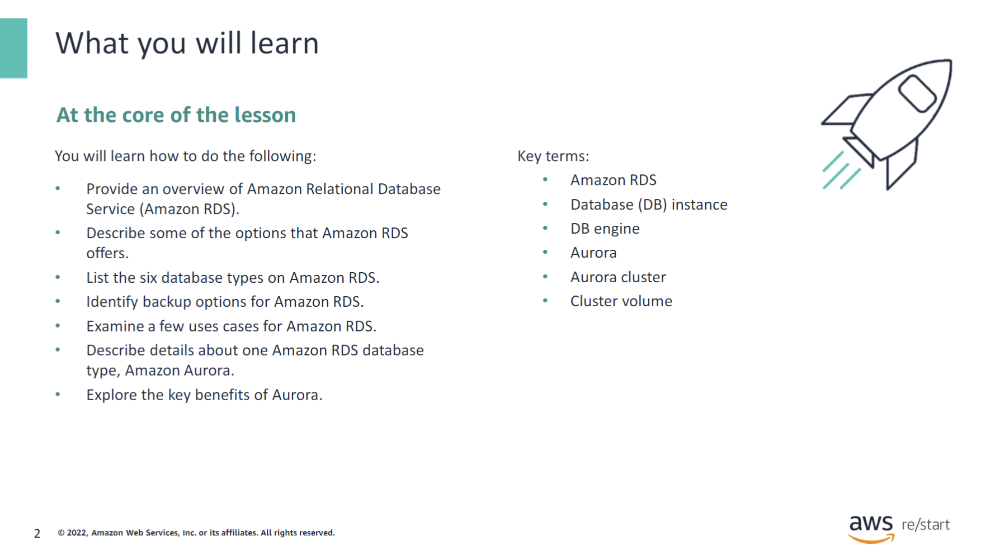

:::tip[In this module, you will learn how to do the following:]

- Provide an overview of Amazon RDS.
- Describe some of the options that Amazon RDS offers.
- List the six database types on Amazon RDS.
- Identify backup options for Amazon RDS.
- Examine a few use cases for Amazon RDS.
- Describe details about one Amazon RDS database type, Amazon Aurora.
- Explore the key benefits of Aurora.

:::

:::note[Key Terms:]

- Amazon RDS
- Database (DB) instance
- DB engine
- Aurora
- Aurora cluster
- Cluster volume

:::

## Amazon RDS

### Amazon RDS defined

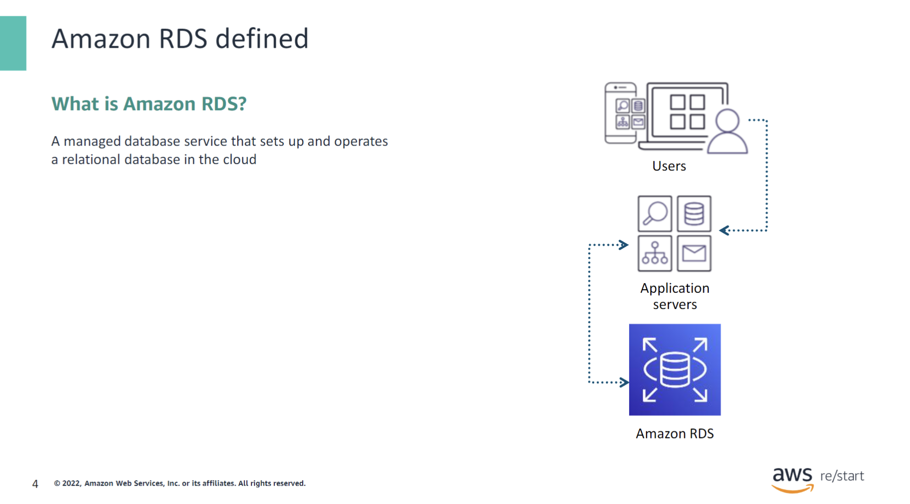

Amazon RDS is a managed database service that sets up and operates a relational database in the cloud. Running an unmanaged, standalone relational database can be time-consuming and have limited scope. To address these challenges, AWS provides a service that sets up, operates, and scales the relational database without any ongoing administration.

Amazon RDS provides cost-efficient and resizable capacity while automating time-consuming administrative tasks. Amazon RDS frees you to focus on your applications so that you can give them the performance, high availability, security, and compatibility that they need. With Amazon RDS, your primary focus is your data and optimizing your application.

### Amazon RDS use cases

Amazon RDS works well for web and mobile applications that need a database with high throughput, extensive storage scalability, and high availability. Because Amazon RDS does not have any licensing constraints, it fits the variable usage pattern of these applications.

For small and large ecommerce businesses, Amazon RDS provides a flexible, secured, and low-cost database solution for online sales and retailing.

Mobile and online games require a database platform with high throughput and availability. Amazon RDS manages the database infrastructure so that game developers do not need to worry about provisioning, scaling, or monitoring database servers.

### DB instance

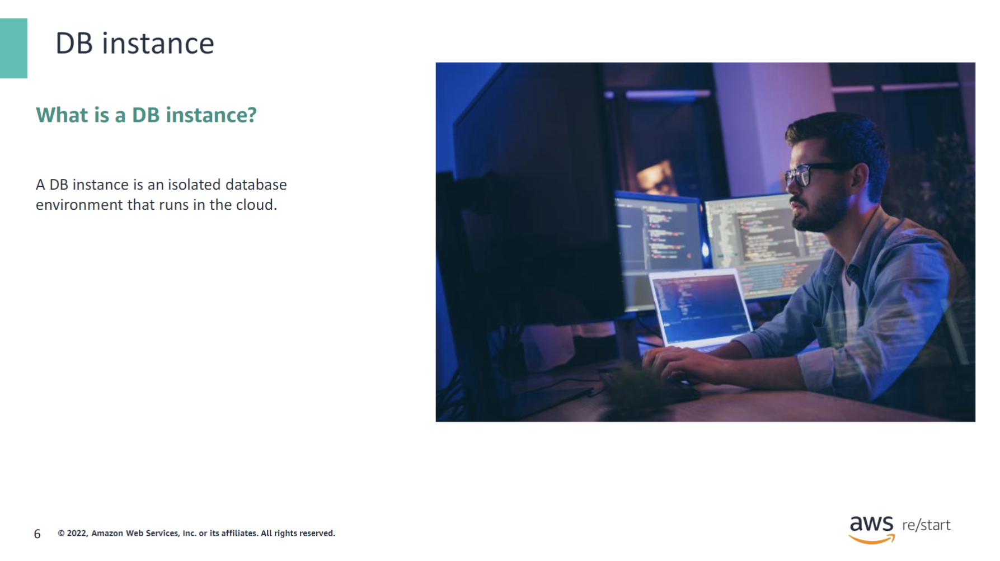

What is a DB instance ?

A DB instance is an isolated database environment that runs in the cloud. It is the basic building block of Amazon RDS.

### Amazon RDS DB instances

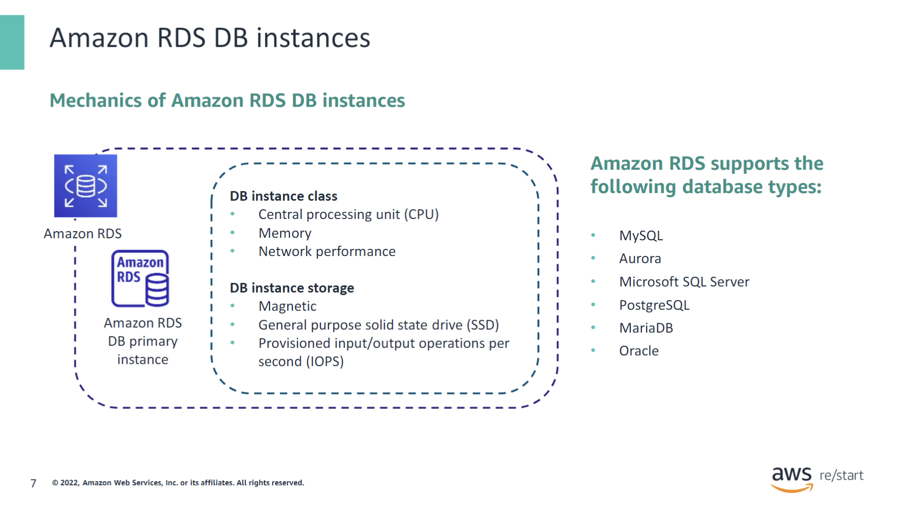

The basic building block of Amazon RDS is the DB instance. A DB instance is an isolated database environment. It can contain multiple user-created databases, and you can access it by using the same tools and applications that you use with a standalone database instance. The resources in a database instance are determined from its database instance class, and the type of storage is determined from the type of disks.

Database instances and storage differ in performance characteristics and price so that you can customize your performance and costs to the needs of your database. When you choose to create a DB instance, you must first specify which database engine to run. Amazon RDS currently supports the following databases: MySQL, Aurora, Microsoft SQL Server, PostgreSQL, MariaDB, and Oracle.

### Amazon RDS backup

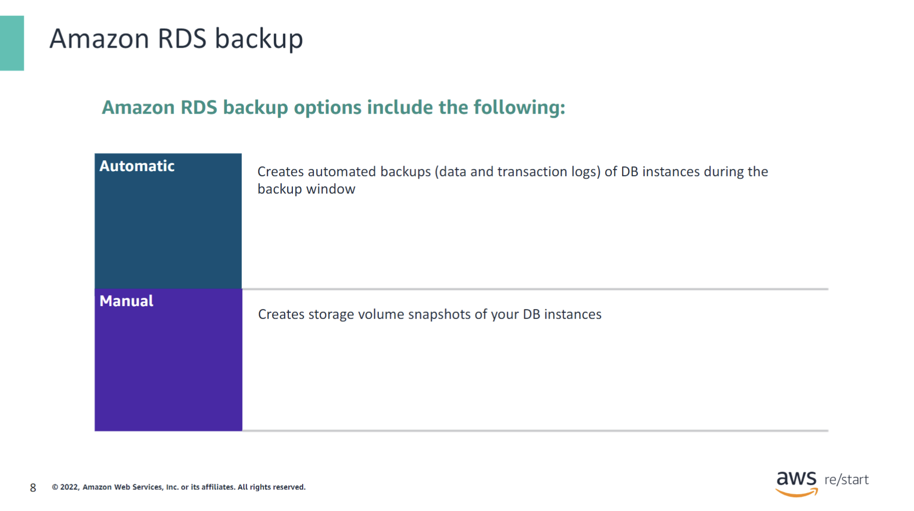

Because Amazon RDS is a fully managed service, one task that it automatically performs is the periodic backup of a DB instance. The entire instance is backed up to a storage volume snapshot during a specified backup window. It is retained according to a specified backup retention period. The first snapshot of a DB instance contains the full data. Subsequent snapshots are incremental and contain only the data that changed since the most recent snapshot.

Optionally, you can back up a database instance manually by creating a snapshot.

For more information about working with backups and managing Amazon RDS backups and snapshots, see [Backing up and restoring an Amazon RDS DB instance](https://docs.aws.amazon.com/AmazonRDS/latest/UserGuide/CHAP_CommonTasks.BackupRestore.html).

For more information about Amazon RDS, see [Amazon RDS FAQs](https://aws.amazon.com/rds/faqs/).

## Easy Create method in Amazon RDS

This section covers a sample configuration that uses the Easy Create method to create a database in Amazon RDS. This section also examines some of the differences between the Standard method and Easy Create method.

### Creating a DB instance in Amazon RDS

You can create a DB instance in Amazon RDS in two ways. The management console offers an Easy Create method and a Standard method. If you choose to use the Easy Create method, the configuration options are based on Amazon best practices. You can specify a DB engine and instance size and can choose an identifier. You also have an opportunity to select Standard to create your instance. You determine or choose your configurations.

### How to create a DB instance

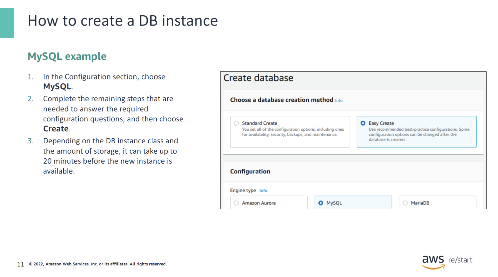

This slide describes the main steps tocreate a DB instance using the Easy Create method.

## High availability with Amazon RDS

### High availability with Multi-AZ deployment: Replication

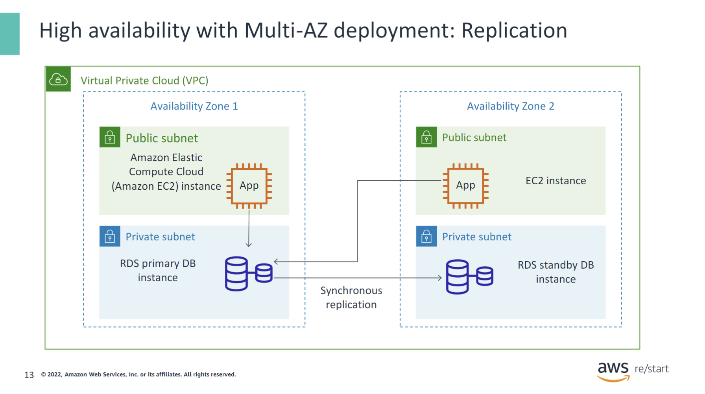

One of the main features of Amazon RDS is that you can configure a database instance with high availability by using a Multi-AZ deployment. This configuration automatically generates a standby copy of the database instance in another Availability Zone in the same virtual private cloud (VPC). After you make the initial full copy, transactions are synchronously replicated to the standby copy. Running a database in multiple Availability Zones can enhance availability during planned system maintenance. It can help protect your database against database failure and disruptions to Availability Zones.

In the diagram, an RDS DB instance is configured with high availability. The primary instance runs in Availability Zone 1, and it serves requests from applications that run in Availability Zones 1 and 2. The standby replica runs in Availability Zone 2, and it provides data redundancy. It is synchronously replicated from the primary instance.

### High availability with Multi-AZ deployment: Failover

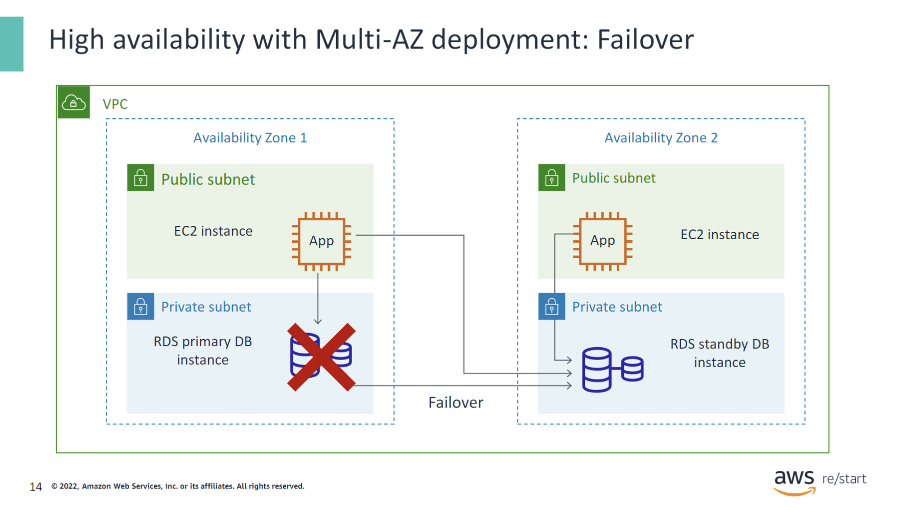

If the primary database instance fails, Amazon RDS automatically brings the standby database instance online as the new primary instance. Requests from both applications are then directed to the new primary instance. The requesting applications use the Amazon RDS Domain Name System (DNS) endpoint to reference the database by name. As a result, the failover happens without needing to change the application code. Also, notice that no data loss occurs because of the synchronous replication.

## Scalability with Amazon RDS

### Amazon RDS read replicas and scaling

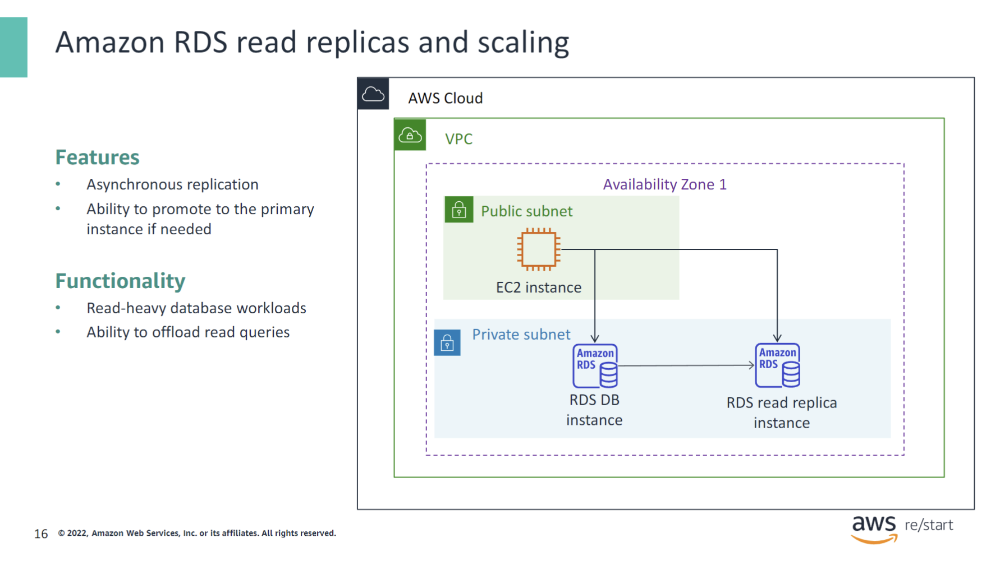

In addition to a high availability configuration, Amazon RDS offers other ways of providing scalability. For example, you can create read replicas for MySQL, MariaDB, PostgreSQL, and Aurora. Updates to the source DB instance are asynchronously copied to the read replica instance. You can reduce the load on your source DB instance by routing read queries from your applications to the read replica. You can also use read replicas to scale out beyond the capacity constraints of a single DB instance for read-heavy database workloads.

Read replicas can also be promoted to become the primary DB instance. However, because it uses asynchronous replication, this option requires manual action. Read replicas can be created in a different Region from the primary DB instance. This feature can direct reads to a read replica in a geographic area that is closer to the user. Thus, it can help satisfy disaster recovery (DR) requirements or reduce latency.

For more information about scaling, refer to [Scaling Your Amazon RDS Instance Vertically and Horizontally](https://aws.amazon.com/blogs/database/scaling-your-amazon-rds-instance-vertically-and-horizontally/).

For information about storage types, refer to [Working with storage for Amazon RDS DB instances](https://docs.aws.amazon.com/AmazonRDS/latest/UserGuide/USER_PIOPS.StorageTypes.html).

For information about read replicas, refer to [Amazon RDS Read Replicas](https://aws.amazon.com/rds/details/read-replicas/).

### Amazon RDS scaling

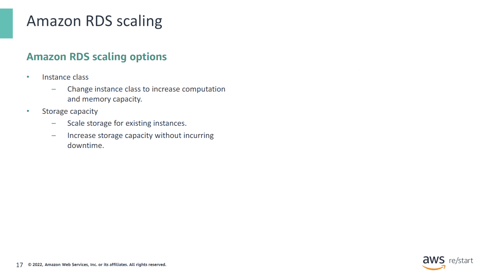

You can also increase the capacity of a database server by changing its instance class or storage capacity. By changing the instance class, you can increase the CPU and memory that are available to the instance. By modifying the allocated storage, you can increase storage capacity without incurring downtime.

:::note
Note that changing an instance class requires downtime.
:::

## Aurora

### Aurora defined

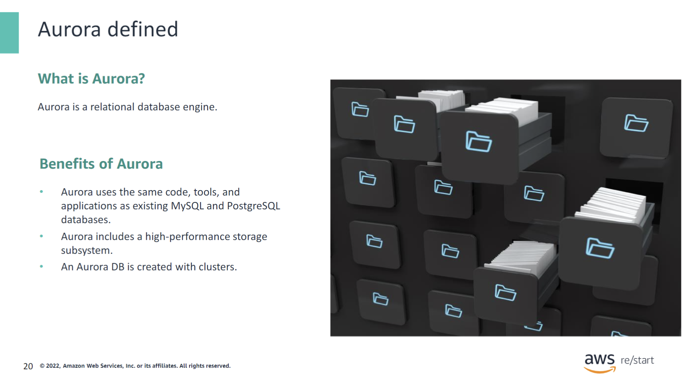

**What is Aurora?**

- Aurora is part of the managed database service Amazon RDS. Aurora is a relational database engine.
- A database engine is a service for storing, processing, and securing data.

Some of the benefits of Aurora include the following:

- Aurora uses the same code, tools, and applications as existing MySQL and PostgreSQL databases.
- Aurora includes a high-performance storage subsystem. Its database engine is customized to take advantage of that fast distributed storage.
- An Aurora DB has clusters that consist of one or more DB instances and a cluster volume that manages the data for those DB instances.

### An Aurora DB cluster

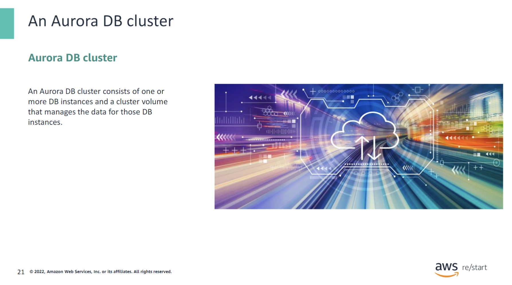

**What is an Aurora DB cluster?**  
An Aurora DB cluster consists of one or more DB instances and a cluster volume that manages the data for those DB instances.

**What is an Aurora cluster volume?**  
An Aurora cluster volume is a virtual database storage volume that spans multiple Availability Zones. Each Availability Zone has a copy of the DB cluster data.

### Contents of an Aurora DB cluster

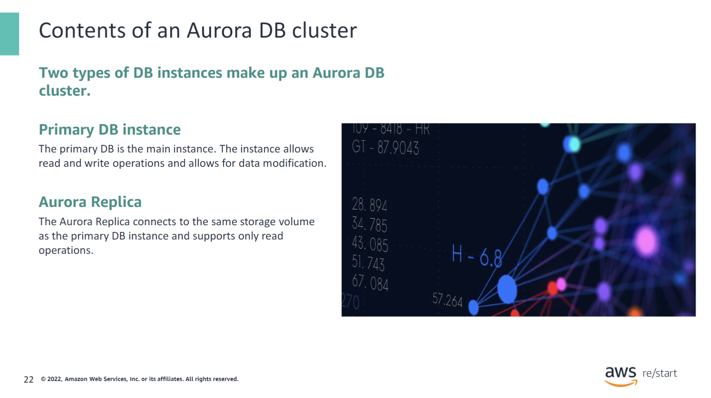

A primary DB instance and up to 15 Aurora replicas make up an Aurora DB cluster.

### Aurora use cases

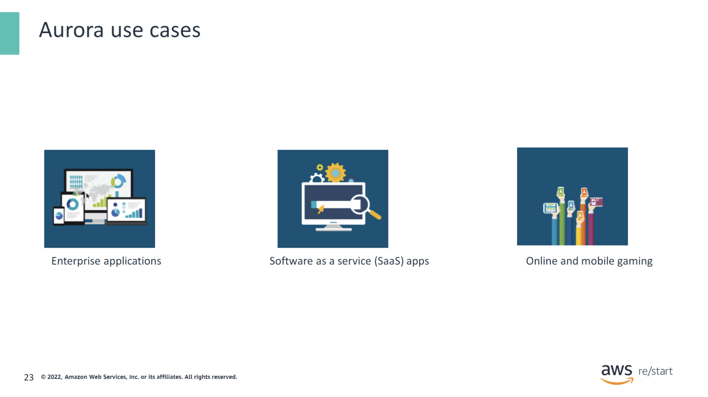

**Enterprise applications**  
Compared to commercial databases, Aurora can help cut down your database costs by 90 percent or more while improving the database’s reliability and availability.

**Software as a service (SaaS) applications**  
The Aurora managed database offering provides benefits to SaaS applications. SaaS companies can focus on building high-quality applications without worrying about the underlying database that powers the application.

**Online and mobile gaming**  
Because web and mobile games are built to operate at a very large scale, they require a database with high throughput and massive storage scalability. Aurora provides enough room for future growth.

## Checkpoint questions

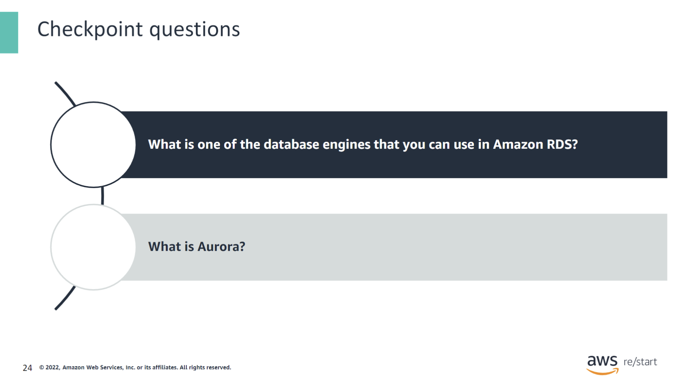

What is one of the database engines that you can use in Amazon RDS?

Amazon RDS supports the following database types:
- MySQL
- Aurora
- Microsoft SQL Server
- PostgreSQL
- MariaDB
- Oracle Database

What is Aurora?

Aurora is a fully managed relational database engine that is compatible with MySQL and PostgreSQL.

## Key Takeaways

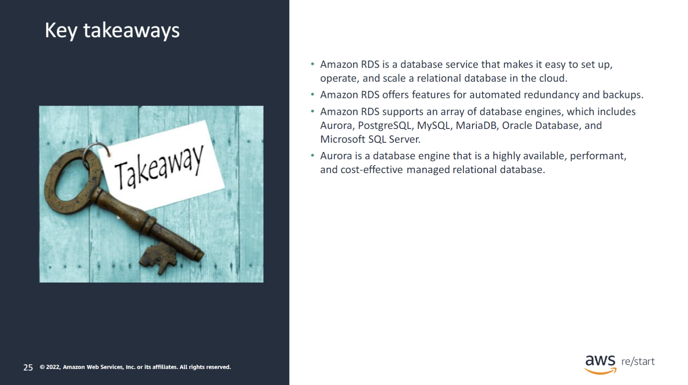

:::tip[Key takeaways from this module include the following:]

- Amazon RDS is a database service that makes it easy to set up, operate, and scale a relational database in the cloud.
- Amazon RDS offers features for automated redundancy and backups.
- Amazon RDS supports an array of database engines, which includes Aurora, PostgreSQL, MySQL, MariaDB, Oracle Database, and Microsoft SQL Server.
- Aurora is a database engine that is a highly available, performant, and cost-effective managed relational database.

:::
