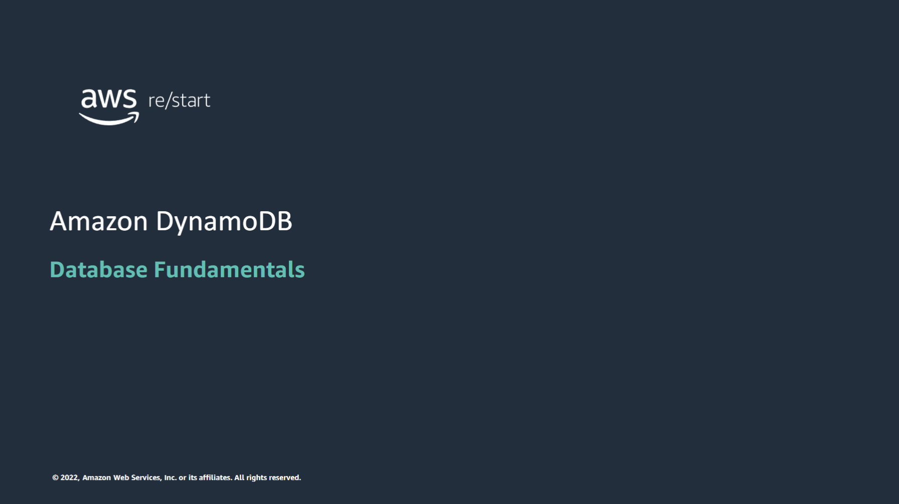

---

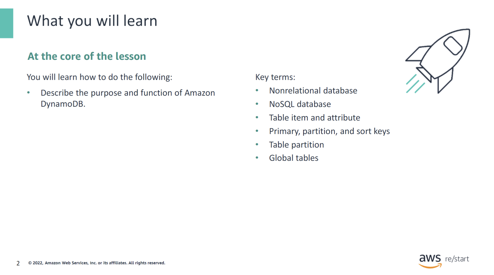

:::tip[You will learn how to do the following:]

In this module, you will discover key concepts that are related to database solutions. The module will highlight the differences between relational and nonrelational databases in general and explore concepts and terminology related to the Amazon DynamoDB NoSQL database.You will learn how to describe the purpose and function of DynamoDB.

:::

:::note[Key Terms]

- Nonrelational database
- NoSQL database
- Table item and attribute
- Primary, partition, and sort keys
- Table partition
- Global tables

:::

## Introduction to DynamoDB

### Relational and nonrelational NoSQL databases: Comparison

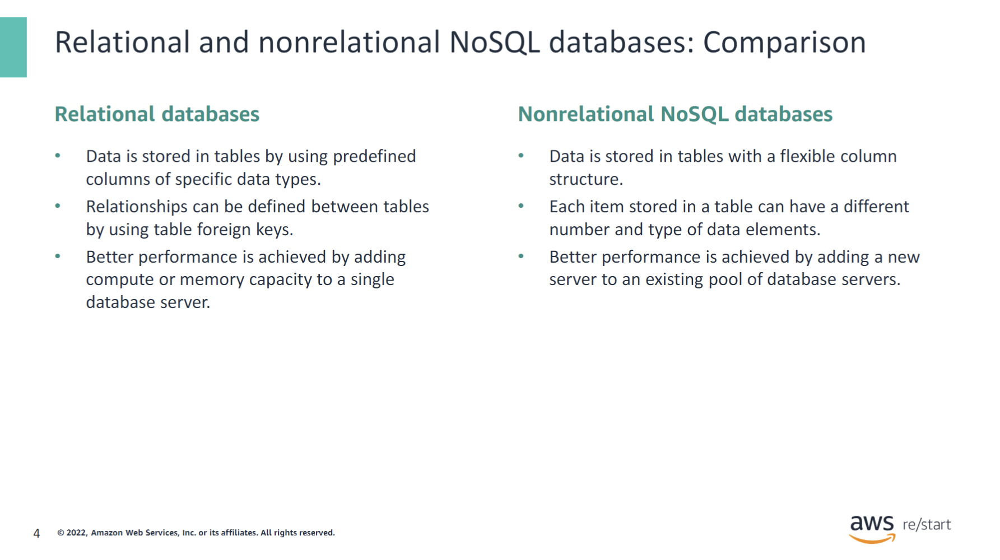

Relational databases are designed to store data in a structured way, typically using normalized database table designs. This means that data is distributed across multiple tables, with well-defined relationships between these tables. Each table follows a specific schema, ensuring that all records adhere to the same structure, though the actual data varies from record to record.

Relational databases generally operate on a single, large database server, which has a fixed amount of memory and computing power. To improve performance, you would replace the existing server with a larger one that has more memory and compute capacity.

In contrast, non-relational databases, also known as NoSQL databases, offer greater flexibility in data storage. In a NoSQL database, the format, type, and size of data can vary between records, allowing for more diverse data layouts.

NoSQL databases typically run on a cluster of servers, each with its own fixed amount of memory and compute capacity. To enhance performance, you can scale the system by adding more servers to the cluster, rather than upgrading a single server.

### DynamoDB is a NoSQL database

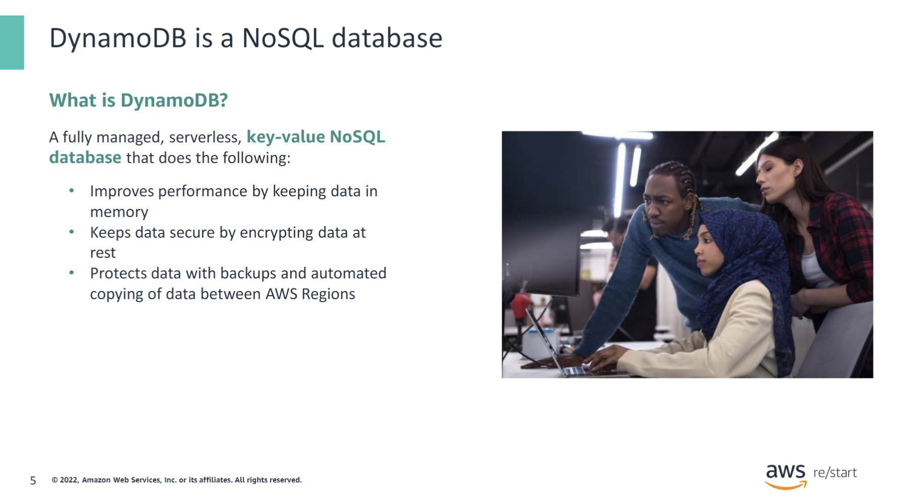

DynamoDB provides several key advantages:

- **Fully managed service**: AWS handles all underlying compute and storage operations required to manage your data.
- **Scalability**: DynamoDB automatically scales compute and storage capacity to accommodate growing data needs.
- **Redundancy**: Data is replicated across multiple AWS Regions to prevent data loss.
- **Recoverability**: DynamoDB supports data restoration from automatic backups.
- **Low latency**: Data retrieval from DynamoDB tables typically occurs within milliseconds.
- **Security**: Integration with AWS Identity and Access Management (IAM) allows you to control access to DynamoDB tables.
- **Flexibility**: DynamoDB supports various data types, and each record can have different attributes and data types. JSON is commonly used for data storage in DynamoDB.

## How it works

### Key concepts: Tables

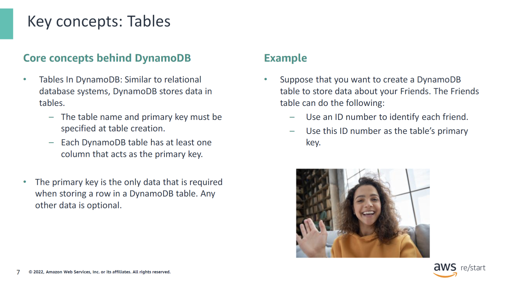

Core concepts behind DynamoDB:

- **Tables in DynamoDB**: Much like relational database systems, DynamoDB organizes data into tables.
  - When creating a table, you must specify a table name and a primary key.
  - Each DynamoDB table includes at least one column that serves as the primary key.

- **Primary Key**: The primary key is the only mandatory data required when inserting a row into a DynamoDB table. Any additional data is optional.

:::note
Each DynamoDB table must have a primary key.

Each row in a DynamoDB table must have a distinct value for the primary key.
:::

### Key concepts: Attributes

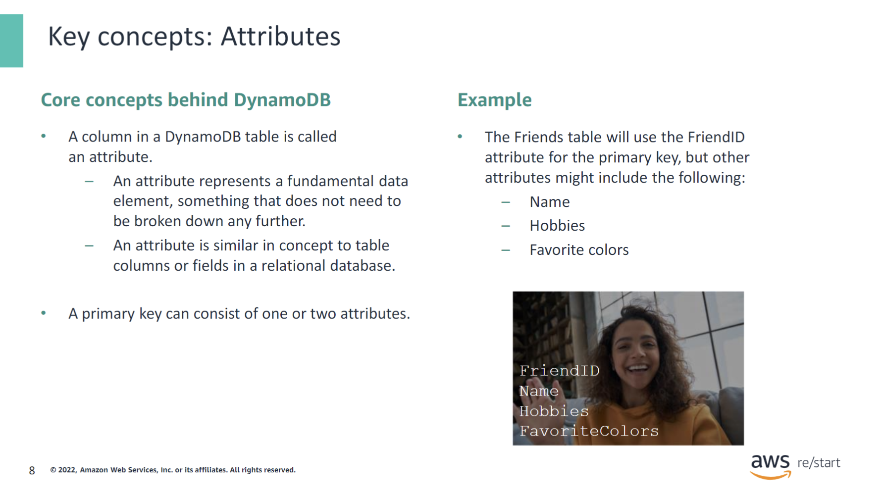

Core concepts behind DynamoDB:

- **Attributes**: In DynamoDB, a column in a table is referred to as an attribute.
  - An attribute represents a fundamental data element that does not need further decomposition.
  - It is conceptually similar to table columns or fields in a relational database.

- **Primary Key**: The primary key in DynamoDB can be composed of one or two attributes.

:::note

- Relational databases use tables, made up of columns, to store data.
- DynamoDB uses tables, made up of attributes, to store data.
- The primary key for a DynamoDB table can consist of one or two attributes.

:::

### Key concepts: Items

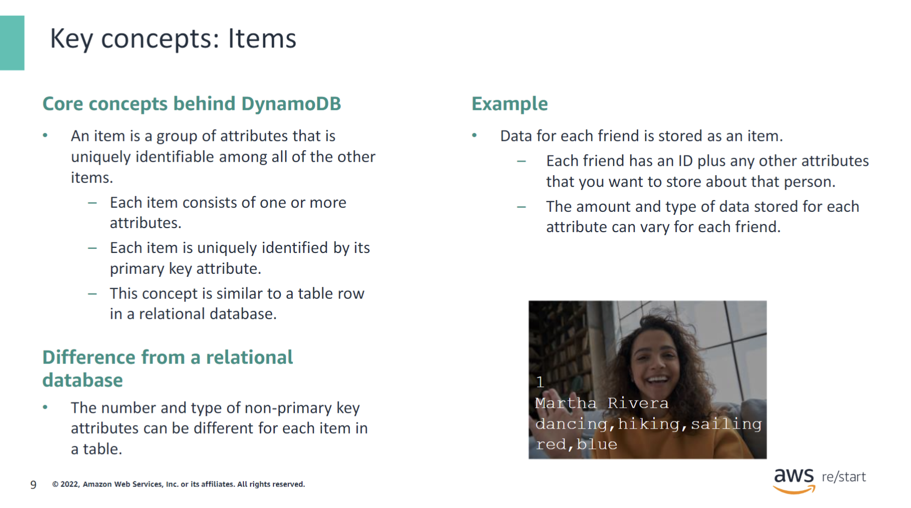

Core concepts behind DynamoDB

- An item is a group of attributes that is uniquely identifiable among all other items.
  - Each item consists of one or more attributes.
  - Each item is uniquely identified by its primary key attribute.
  - This concept is similar to a row in a relational database.

Difference from a relational database

- The number and type of non-primary key attributes can vary for each item in a table.

:::note

- Relational databases use tables, made up of columns, to store data as rows.
- DynamoDB uses tables, made up of attributes, to store data as items.
- Each item stored in a DynamoDB table does not need to have the same number or type of attributes.
- This property is a difference between NoSQL tables and relational database tables. With relational tables, the number and type of data in each row must match the table’s structure.

:::

### Key concepts: Primary keys

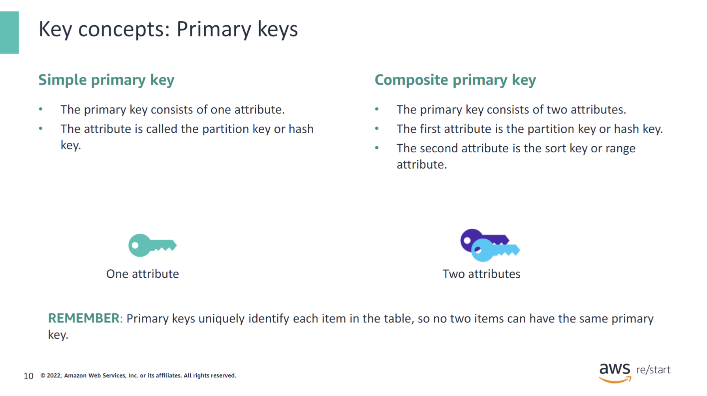

A primary key that is based on a single table attribute is called a simple primary key. The attribute that the primary key is based on is known as the partition key or hash key.

A primary key that is based on two table attributes is called a composite primary key. In this case:

- The first attribute is called the partition key or hash key.
- The second attribute is called the sort key or range attribute.

Whether using a simple or composite primary key, each item in the table must have a unique value for its primary key attributes.

## The concept of partitioning

### Key concepts: Partitions

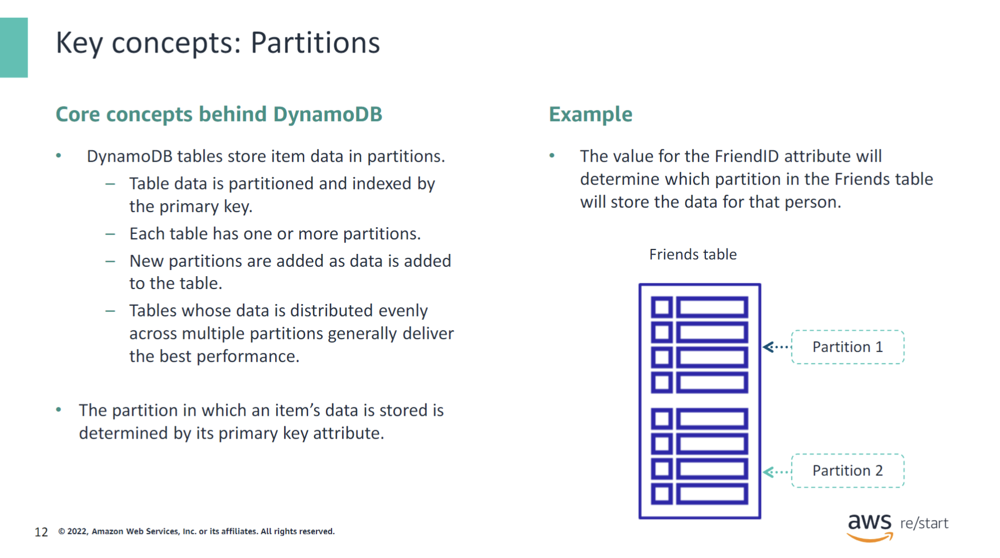

Core concepts behind DynamoDB

- DynamoDB tables store item data in partitions.
  - Table data is partitioned and indexed by the primary key.
  - Each table has one or more partitions.
  - New partitions are added as data is added to the table.
  - Tables with data distributed evenly across multiple partitions generally deliver the best performance.

- The partition in which an item's data is stored is determined by its primary key attribute.

:::note

- DynamoDB tables store data in partitions. Each table comprises one or more partitions.

- DynamoDB automatically adds new partitions to a table when the existing partitions fill with data.

:::

### Key concepts: Storing items in partitions

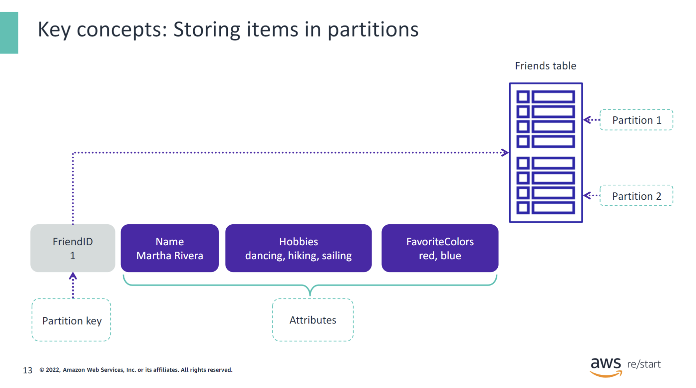

This example shows the item data for Martha Rivera being stored in the Friends table.

When choosing the partition to store the data, DynamoDB applies a function to the partition key attribute of the primary key. In the case of the Friends table, which uses a simple primary key, the partition key attribute is the same as the primary key, which is `FriendID`.

The value that the function returns will determine whether the data is stored in `Partition 1` or `Partition 2`, depending on the value for the `FriendID` attribute. In this case, the function chose `Partition 1` to store Martha’s data.

### Key concepts: Storing attributes in partitions

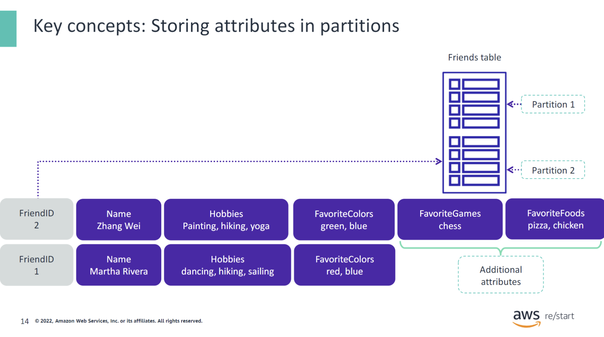

This example shows the item data for another friend, Zhang Wei, being stored in the Friends table.

When choosing the partition to store the data, DynamoDB applies a function to the partition key attribute, `FriendID`. In this case, the function chooses `Partition 2` to store Zhang’s data.

Notice that Zhang has two additional attributes stored compared to Martha. This difference in the number of attributes does not present a problem. DynamoDB allows each item to have varying numbers and types of attributes, as long as the primary key value is unique.

## DynamoDB global tables

### Using global tables

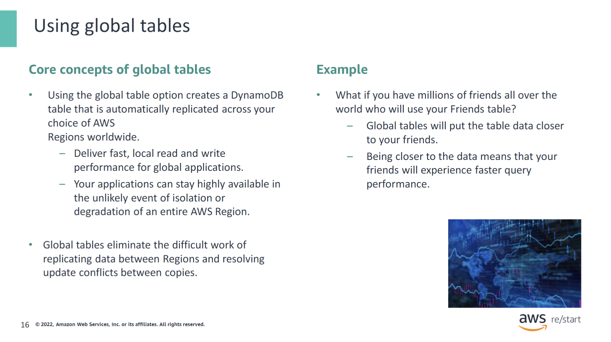

Core concepts of global tables

- Using the global table option creates a DynamoDB table that is automatically replicated across your choice of AWS Regions worldwide.
  - This setup delivers fast, local read and write performance for global applications.
  - Your applications can remain highly available even if an entire AWS Region experiences isolation or degradation.

- Global tables eliminate the challenging tasks of manually replicating data between Regions and resolving update conflicts between copies.

---

The DynamoDB global tables feature provides high availability and scalability across AWS Regions. Here are the key points:

- **Global Table Definition:** A global table is a collection of one or more DynamoDB tables, all owned by a single AWS account. These tables, known as replica tables, store the same set of data items.

- **Regional Availability:** When creating a global table, you specify the AWS Regions where you want the table to be available. DynamoDB handles the creation of identical tables in these Regions.

- **Data Synchronization:** DynamoDB automatically manages the ongoing replication of data across all replica tables to keep their contents synchronized.

- **Use Case:** Global tables are well-suited for large-scale applications with globally dispersed users, as they can access the replica table that is closest to them, ensuring low latency and high performance.

### Global tables example

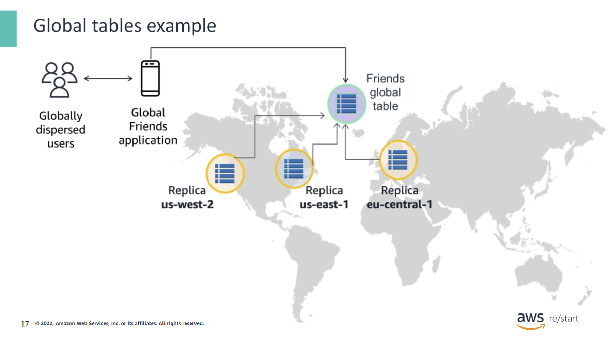

This example illustrates how globally dispersed friends benefit from DynamoDB global tables through a mobile application:

- **Geographic Proximity:** Users access the table replica that is geographically closest to them. 

- **Enhanced Experience:** By interacting with the nearest replica, users experience improved response times for both reading and writing data to the DynamoDB Friends table.

- **Improved Performance:** This setup ensures that friends around the world enjoy a faster and more responsive experience with the application.

## Checkpoint questions

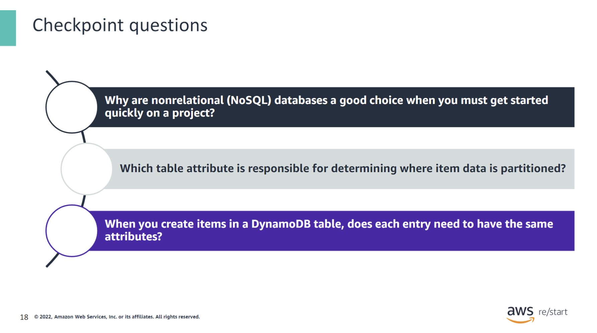

  
Why are nonrelational (NoSQL) databases a good choice when you must get started quickly on a project?

  NoSQL databases have flexible schemas, so it is not necessary to do any data engineering. Developers can quickly and easily work with the data without needing to understand relationships between data.

  
What table attribute is responsible for determining where item data is partitioned?

  The partition key is responsible for where the data is partitioned.

  
When you create items in a DynamoDB table, does each entry need to have the same attributes?

  No. Because DynamoDB is a NoSQL database, individual items can have different attributes from other entries.

## Key Takeaways

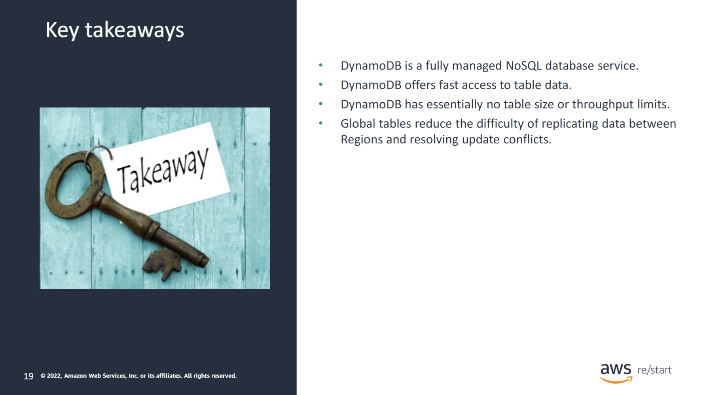

:::tip[This module includes the following keytakeaways:]

- DynamoDB is a fully managed NoSQL database service.
- DynamoDB offers consistent, single-digit millisecond latency at any scale.
- DynamoDB has essentially no table size or throughput limits.
- Global tables reduce the difficulty of replicating data between Regions and resolving update conflicts.

:::
