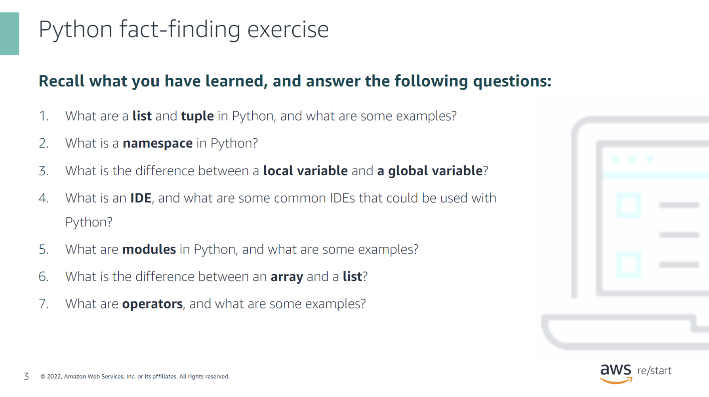
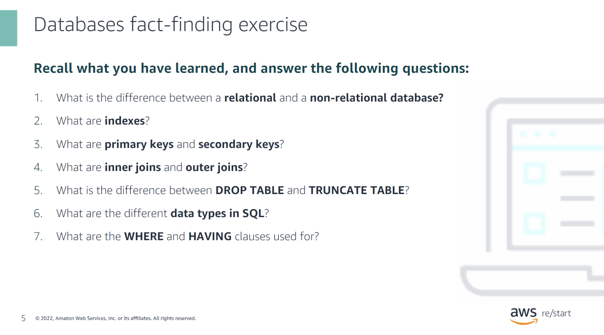
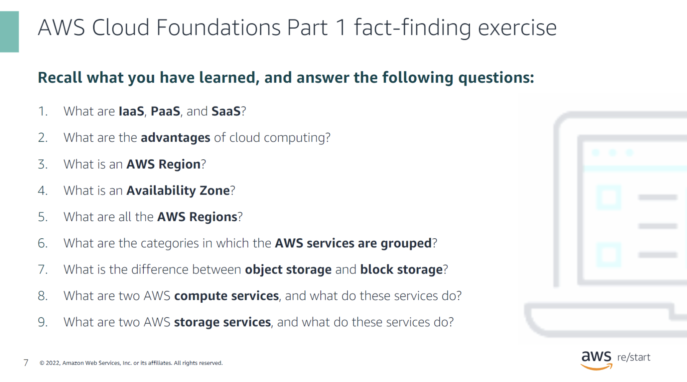
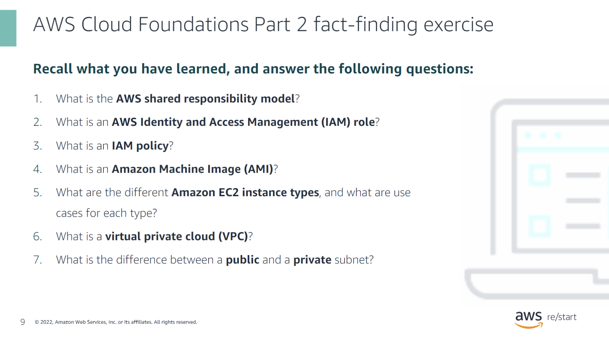
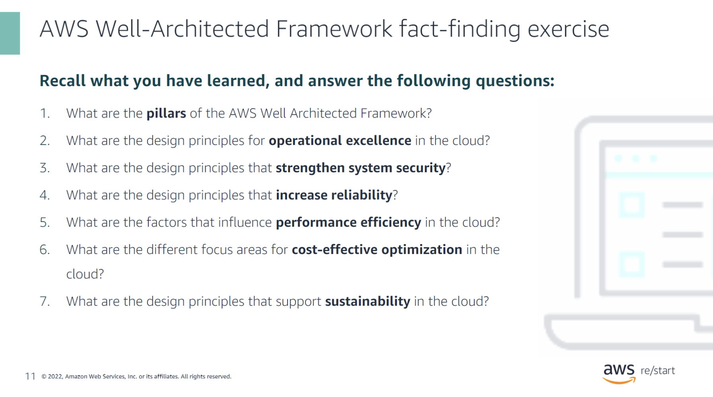
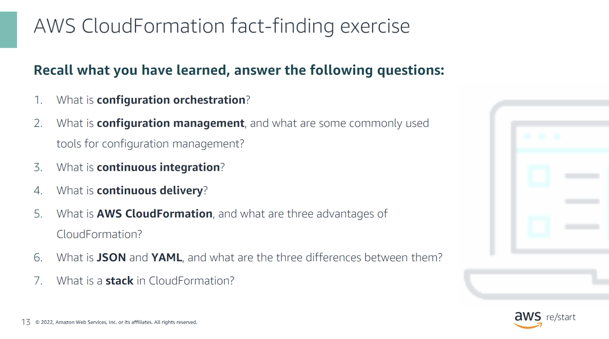
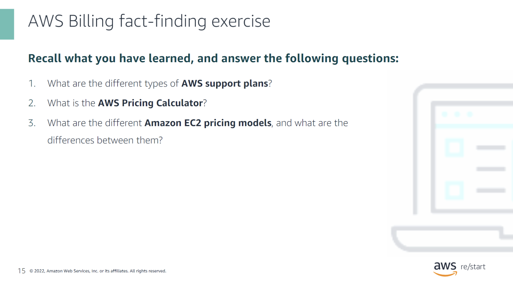

## Python

### Python fact-finding exercise

What are a list and tuple in Python, and what are some examples?

- **List**: A list in Python is a mutable, ordered sequence of elements. You can modify, add, or remove elements after the list is created.
  - Example: `my_list = [1, 2, 3, "apple", "banana"]`

- **Tuple**: A tuple in Python is an immutable, ordered sequence of elements. Once a tuple is created, it cannot be modified.
  - Example: `my_tuple = (1, 2, 3, "apple", "banana")`

What is a namespace in Python?

A **namespace** in Python is a container that holds a set of identifiers (variable and function names) and maps them to corresponding objects. Namespaces ensure that names are unique and can be used without conflicts in different parts of a program.

What is the difference between a local variable and a global variable?

- **Local Variable**: A local variable is a variable that is defined within a function and is only accessible within that function.
  
- **Global Variable**: A global variable is a variable that is defined outside of any function and can be accessed from any part of the program.

What is an IDE, and what are some common IDEs that could be used with Python?

An **Integrated Development Environment (IDE)** is a software application that provides comprehensive facilities to programmers for software development. It typically includes a code editor, debugger, and build tools.

- **Common Python IDEs**: 
  - PyCharm
  - Visual Studio Code
  - Jupyter Notebook
  - Spyder

What are modules in Python, and what are some examples?

**Modules** in Python are files containing Python code that can define functions, classes, and variables. They can be imported and used in other Python programs.

- **Examples**:
  - `math`: Provides mathematical functions like `sqrt()` and `pow()`.
  - `os`: Allows interaction with the operating system, like reading or writing to the file system.
  - `datetime`: Provides classes for manipulating dates and times.

What is the difference between an array and a list?

- **Array**: An array is a collection of elements that are of the same data type. In Python, arrays are available via the `array` module.
  
- **List**: A list can contain elements of different data types. It is more versatile than an array but typically slower for certain operations.

What are operators, and what are some examples?

**Operators** are symbols in Python that perform operations on variables and values.

- **Examples**:
  - **Arithmetic Operators**: `+`, `-`, `*`, `/` (e.g., `5 + 3`)
  - **Comparison Operators**: `==`, `!=`, `>`, `<` (e.g., `5 > 3`)
  - **Logical Operators**: `and`, `or`, `not` (e.g., `True and False`)

## Databases

### Databases fact-finding exercise

What is the difference between a relational and a non-relational database?

- **Relational Database**: Stores data in structured tables with predefined schemas, where relationships between data are defined through foreign keys. Commonly used for structured data with clear relationships, such as SQL databases (e.g., MySQL, PostgreSQL).

- **Non-Relational Database**: Also known as NoSQL databases, they store data in flexible formats like key-value pairs, documents, or graphs. They are used for unstructured or semi-structured data without strict schemas, such as MongoDB or DynamoDB.

What are indexes?

**Indexes** are special database structures that improve the speed of data retrieval operations on a database table. They are created using one or more columns of a table and allow for faster querying, at the cost of additional storage and slower write operations.

What are primary keys and secondary keys?

- **Primary Key**: A unique identifier for each record in a table. It ensures that no two rows have the same primary key value, and it cannot be null.
  
- **Secondary Key** (or Foreign Key): A column or set of columns that establish and enforce a link between the data in two tables. Secondary keys reference the primary key in another table.

What are inner joins and outer joins?

- **Inner Join**: Combines rows from two or more tables based on a related column between them. It returns only the records that have matching values in both tables.
  
- **Outer Join**: Combines rows from two or more tables and returns all the records from one table and the matched records from the other table. If there is no match, it returns null for non-matching rows. Outer joins can be further classified into:
  - **Left Outer Join**: Returns all records from the left table, and matched records from the right table.
  - **Right Outer Join**: Returns all records from the right table, and matched records from the left table.
  - **Full Outer Join**: Returns all records when there is a match in either the left or right table.

What is the difference between DROP TABLE and TRUNCATE TABLE?

- **DROP TABLE**: Completely removes a table and all its data, indexes, triggers, and constraints from the database. This operation is irreversible.

- **TRUNCATE TABLE**: Removes all rows from a table, but the table structure, columns, indexes, and constraints remain intact. It is faster than DELETE but cannot be rolled back.

What are the different data types in SQL?

**SQL Data Types**: Define the type of data that can be stored in a column. Some common data types include:

- **Numeric**: `INT`, `FLOAT`, `DECIMAL`
- **Character**: `CHAR`, `VARCHAR`, `TEXT`
- **Date and Time**: `DATE`, `TIME`, `DATETIME`
- **Boolean**: `BOOLEAN`
- **Binary**: `BLOB`

What are the WHERE and HAVING clauses used for?

- **WHERE Clause**: Filters records before any groupings are made. It is used to specify conditions that must be true for rows to be included in the result set.

- **HAVING Clause**: Filters records after the GROUP BY clause has been applied. It is used to specify conditions on aggregate functions for groups.

## AWS Cloud Foundations Part 1

### AWS Cloud Foundations Part 1 fact-finding exercise

What are IaaS, PaaS, and SaaS?

- **IaaS (Infrastructure as a Service)**: Provides virtualized computing resources over the internet. Users can manage operating systems, storage, and network configurations. Example: AWS EC2.

- **PaaS (Platform as a Service)**: Offers hardware and software tools over the internet, usually for application development. It allows users to focus on deploying and managing applications without worrying about the underlying infrastructure. Example: AWS Elastic Beanstalk.

- **SaaS (Software as a Service)**: Delivers software applications over the internet, on a subscription basis. Users can access the software through a web browser without managing the underlying infrastructure. Example: Google Workspace.

What are the advantages of cloud computing?

- **Scalability**: Easily scale resources up or down based on demand.
- **Cost Efficiency**: Pay only for what you use, reducing upfront capital expenses.
- **Flexibility**: Access resources from anywhere with an internet connection.
- **Security**: Benefit from advanced security features and compliance standards.
- **Disaster Recovery**: Easily set up disaster recovery solutions across multiple regions.

What is an AWS Region?

An **AWS Region** is a physical location around the world where AWS data centers are clustered. Each region is a separate geographic area that consists of multiple, isolated, and physically separate Availability Zones.

What is an Availability Zone?

An **Availability Zone (AZ)** is one or more discrete data centers within an AWS Region, each with redundant power, networking, and connectivity. AZs offer high availability by ensuring that data and services are resilient to failure in a single data center.

What are all the AWS Regions?

As of now, AWS has multiple regions across the world, including but not limited to:

- **North America**: US East (N. Virginia), US West (Oregon), Canada (Central)
- **South America**: South America (São Paulo)
- **Europe**: EU (Ireland), EU (Frankfurt), EU (London)
- **Asia Pacific**: Asia Pacific (Sydney), Asia Pacific (Tokyo), Asia Pacific (Mumbai)
- **Middle East & Africa**: Middle East (Bahrain), Africa (Cape Town)

New regions are periodically added by AWS.

What are the categories in which the AWS services are grouped?

AWS services are grouped into several categories, including:

- **Compute**
- **Storage**
- **Database**
- **Networking & Content Delivery**
- **Security, Identity, & Compliance**
- **Machine Learning**
- **Analytics**
- **Developer Tools**
- **Management & Governance**
- **Internet of Things (IoT)**

What is the difference between object storage and block storage?

- **Object Storage**: Stores data as objects, each with its own metadata and unique identifier. It is ideal for storing large amounts of unstructured data like files, images, and backups. Example: AWS S3.

- **Block Storage**: Stores data in fixed-size blocks and manages them in a storage volume. It is used for applications that require low-latency access and high-performance storage, such as databases. Example: AWS EBS.

What are two AWS compute services, and what do these services do?

- **AWS EC2 (Elastic Compute Cloud)**: Provides resizable virtual servers in the cloud, allowing users to run applications on virtual machines.

- **AWS Lambda**: Enables users to run code in response to events without provisioning or managing servers. It is a serverless compute service.

What are two AWS storage services, and what do these services do?

- **Amazon S3 (Simple Storage Service)**: Provides scalable object storage for any type of data, accessible from anywhere on the web. Ideal for storing and retrieving large amounts of unstructured data.

- **Amazon EBS (Elastic Block Store)**: Offers persistent block storage volumes for use with EC2 instances. It is designed for applications requiring high performance and low latency.

## AWS Cloud Foundations Part 2

### AWS Cloud Foundations Part 2 fact-finding exercise

What is the AWS shared responsibility model?

The **AWS Shared Responsibility Model** outlines the division of security responsibilities between AWS and the customer. 

- **AWS's Responsibility (Security *of* the Cloud)**: AWS is responsible for protecting the infrastructure that runs all the services offered in the AWS Cloud. This includes hardware, software, networking, and facilities.

- **Customer's Responsibility (Security *in* the Cloud)**: Customers are responsible for securing their data, managing identities, access management, operating system configurations, network controls, and encryption.

What is an AWS Identity and Access Management (IAM) role?

An **AWS IAM role** is an identity within your AWS account that has specific permissions. Roles are similar to IAM users but are meant to be assumable by anyone who needs them, including AWS services, applications, or users. Roles allow temporary access to your AWS resources without the need to share long-term credentials.

What is an IAM policy?

An **IAM policy** is a JSON document that defines permissions to access AWS services and resources. Policies can be attached to users, groups, or roles and specify which actions are allowed or denied for specific resources.

What is an Amazon Machine Image (AMI)?

An **Amazon Machine Image (AMI)** is a pre-configured template that contains the information needed to launch an EC2 instance. An AMI includes the operating system, application server, and applications, allowing users to quickly deploy new instances.

What are the different Amazon EC2 instance types, and what are use cases for each type?

Amazon EC2 instance types are categorized based on their computing, memory, storage, and networking capabilities:

- **General Purpose (e.g., t3, m5)**: Balanced compute, memory, and networking resources. Suitable for web servers, development environments, and small databases.

- **Compute Optimized (e.g., c5, c6g)**: Optimized for compute-intensive tasks like high-performance computing (HPC) and batch processing.

- **Memory Optimized (e.g., r5, x1e)**: Designed for workloads that require large amounts of memory, such as databases and real-time big data analytics.

- **Storage Optimized (e.g., i3, d2)**: Best for workloads that require high, sequential read and write access to large data sets on local storage, such as NoSQL databases and data warehousing.

- **Accelerated Computing (e.g., p3, inf1)**: Include GPUs or FPGAs for graphics-intensive applications, machine learning, and scientific simulations.

What is a virtual private cloud (VPC)?

A **Virtual Private Cloud (VPC)** is a logically isolated section of the AWS cloud where you can launch AWS resources in a virtual network that you define. VPCs allow you to control your network settings, including IP address ranges, subnets, route tables, and gateways.

What is the difference between a public and a private subnet?

- **Public Subnet**: A subnet within a VPC that is connected to the internet via an Internet Gateway (IGW). Resources in a public subnet can communicate directly with the internet.

- **Private Subnet**: A subnet that does not have a route to the Internet Gateway. Resources in a private subnet cannot directly access the internet; they typically communicate through a NAT gateway or VPN.

## AWS Well-Architected Framework

### AWS Well-Architected Framework fact-finding exercise

What are the pillars of the AWS Well-Architected Framework?

The **AWS Well-Architected Framework** consists of six pillars that guide cloud architects in designing reliable, secure, efficient, and cost-effective systems:

1. **Operational Excellence**: Focuses on operations in the cloud that support business objectives.
2. **Security**: Protects data, systems, and assets through risk assessments and mitigation strategies.
3. **Reliability**: Ensures a workload performs its intended function correctly and consistently.
4. **Performance Efficiency**: Uses computing resources efficiently to meet system requirements.
5. **Cost Optimization**: Avoids unnecessary costs by utilizing the appropriate number of resources.
6. **Sustainability**: Focuses on reducing environmental impact by maximizing resource efficiency.

What are the design principles for operational excellence in the cloud?

The design principles for **operational excellence** include:

1. **Perform operations as code**: Use automation for operations to minimize human error.
2. **Annotate documentation**: Keep documentation up-to-date with operational processes.
3. **Make frequent, small, reversible changes**: Implement changes in smaller, manageable segments to reduce risks.
4. **Refine operations procedures frequently**: Continuously improve processes to adapt to new situations.
5. **Anticipate failure**: Plan for failure and design for recovery.
6. **Learn from all operational failures**: Use failures as learning opportunities to improve the system.

What are the design principles that strengthen system security?

The design principles that strengthen **system security** include:

1. **Implement a strong identity foundation**: Use the principle of least privilege, enforce separation of duties, and centralize privilege management.
2. **Enable traceability**: Monitor, alert, and audit actions and changes within the environment.
3. **Apply security at all layers**: Protect data at all layers, not just the perimeter.
4. **Automate security best practices**: Automate repetitive tasks and ensure security measures are integrated into the cloud environment.
5. **Protect data in transit and at rest**: Encrypt data to maintain confidentiality and integrity.
6. **Keep people away from data**: Minimize direct access to data by using automated processes and reducing human access.

What are the design principles that increase reliability?

The design principles that increase **reliability** include:

1. **Automatically recover from failure**: Anticipate and automatically recover from failures.
2. **Test recovery procedures**: Regularly test recovery plans to ensure they work as intended.
3. **Scale horizontally to increase availability**: Distribute workload across multiple resources to prevent any single point of failure.
4. **Stop guessing capacity**: Use elastic systems that automatically scale to meet demand.
5. **Manage change in automation**: Use automation to manage infrastructure changes, reducing the risk of human error.

What are the factors that influence performance efficiency in the cloud?

Factors that influence **performance efficiency** include:

1. **Selection**: Choose the right resource types (e.g., instances, storage, and database options) to meet workload requirements.
2. **Review**: Continuously review new services and features that may offer better performance.
3. **Monitoring**: Use monitoring tools to gain insights into system performance and make adjustments as necessary.
4. **Trade-offs**: Balance performance with other aspects, such as cost, to optimize efficiency.

What are the different focus areas for cost-effective optimization in the cloud?

The focus areas for **cost-effective optimization** include:

1. **Right-sizing**: Choose the appropriate instance sizes and types to match the workload.
2. **Elasticity**: Use auto-scaling to align resource usage with demand.
3. **Reserved instances and savings plans**: Pre-pay or commit to consistent usage for discounts.
4. **Monitor and track usage**: Continuously monitor resource usage and adjust to avoid overspending.
5. **Optimize storage**: Use the right storage class (e.g., S3 Standard, S3 Glacier) for the data's access needs.

What are the design principles that support sustainability in the cloud?

The design principles that support **sustainability** include:

1. **Understand your impact**: Measure the environmental impact of your cloud workload.
2. **Establish sustainability goals**: Set clear goals for reducing carbon footprint and improving energy efficiency.
3. **Maximize utilization**: Optimize resources to reduce waste and unnecessary energy consumption.
4. **Use managed services**: Leverage AWS managed services that are designed to be energy efficient.
5. **Consider location**: Choose data centers in regions that use renewable energy sources.

## AWS CloudFormation

### AWS CloudFormation fact-finding exercise

What is configuration orchestration?

**Configuration orchestration** refers to the automated management and coordination of complex IT tasks and workflows across multiple systems and environments. Orchestration ensures that processes run in a specific order, integrating and automating tasks like deployment, configuration, and scaling of infrastructure resources.

What is configuration management, and what are some commonly used tools for configuration management?

**Configuration management** is the process of maintaining consistency in a system's performance, functionality, and design by managing and automating the configuration of infrastructure resources. It helps in tracking and controlling changes in software, servers, and network configurations. 

Commonly used configuration management tools include:
- **Ansible**: Open-source tool that automates software provisioning, configuration management, and application deployment.
- **Chef**: Automation platform that manages infrastructure by turning it into code.
- **Puppet**: Configuration management tool that automates the management of infrastructure and application configurations.
- **SaltStack**: Provides event-driven automation for IT operations and configuration management.

What is continuous integration?

**Continuous integration (CI)** is a software development practice where developers regularly integrate their code changes into a shared repository. Each integration is automatically built and tested to detect and fix errors quickly, ensuring that the software is always in a working state. CI helps in reducing integration problems and improves code quality by enabling frequent testing and feedback.

What is continuous delivery?

**Continuous delivery (CD)** is a software development practice where code changes are automatically prepared for release to production. It builds on continuous integration by ensuring that the codebase is always in a deployable state. Continuous delivery involves automated testing, configuration management, and release processes, allowing developers to deploy new features or fixes quickly and with reduced risk.

What is AWS CloudFormation, and what are three advantages of CloudFormation?

**AWS CloudFormation** is a service that allows you to model and set up your Amazon Web Services (AWS) resources using templates. You define the desired infrastructure in JSON or YAML format, and CloudFormation takes care of provisioning and configuring those resources.

Three advantages of CloudFormation include:

1. **Infrastructure as Code**: You can manage and provision resources through a simple text file, enabling version control and easier automation.
2. **Consistency and Standardization**: Ensures that environments are set up consistently, reducing human error.
3. **Simplified Management**: Automates the provisioning and updating of AWS resources, reducing manual intervention and saving time.

What is JSON and YAML, and what are the three differences between them?

**JSON (JavaScript Object Notation)** and **YAML (YAML Ain't Markup Language)** are data serialization formats commonly used for configuration files and data exchange.

Three differences between JSON and YAML:

1. **Syntax**:
   - JSON: Uses curly braces `{}`, square brackets `[]`, and double quotes `"`.
   - YAML: Uses indentation for structure and relies on key-value pairs without the need for braces or quotes.

2. **Readability**:
   - JSON: More compact and machine-readable, but can be harder for humans to read and write.
   - YAML: More human-readable with a cleaner and less cluttered format.

3. **Comments**:
   - JSON: Does not support comments.
   - YAML: Allows comments using the `#` symbol.

What is a stack in CloudFormation?

A **stack** in AWS CloudFormation is a collection of AWS resources that you can manage as a single unit. You create, update, and delete a stack by specifying the resources, their configurations, and dependencies within a CloudFormation template. Stacks enable the automation and management of resources together, ensuring consistent deployments across environments.

## AWS Billing

### AWS Billing fact-finding exercise

What are the different types of AWS support plans?

AWS offers several support plans to meet different customer needs:

1. **Basic Support**: 
   - Free of charge.
   - Includes 24/7 access to customer service, documentation, whitepapers, and AWS Trusted Advisor's core checks.

2. **Developer Support**:
   - Paid plan for developers experimenting with AWS.
   - Includes all Basic Support features plus business hours access to Cloud Support Associates via email, a case severity/response time of less than 12 hours for general guidance, and access to architectural guidance.

3. **Business Support**:
   - Designed for production workloads.
   - Includes all Developer Support features, 24/7 access to Cloud Support Engineers via phone and chat, faster response times, and access to infrastructure event management.

4. **Enterprise Support**:
   - For mission-critical workloads.
   - Includes all Business Support features, a dedicated Technical Account Manager (TAM), concierge support, and a response time of 15 minutes for critical issues.

What is the AWS Pricing Calculator?

The **AWS Pricing Calculator** is a web-based tool that allows you to estimate the cost of AWS services based on your specific use cases. You can customize inputs like region, usage amounts, and service configurations to get a detailed cost estimate. This tool helps you plan your AWS costs and optimize your spending before deploying resources.

What are the different Amazon EC2 pricing models, and what are the differences between them?

Amazon EC2 offers several pricing models to fit different use cases:

1. **On-Demand Instances**:
   - Pay for compute capacity by the hour or second with no long-term commitments.
   - Ideal for short-term, unpredictable workloads or for applications being developed or tested.

2. **Reserved Instances (RIs)**:
   - Offer significant discounts (up to 75%) compared to On-Demand pricing in exchange for committing to a one- or three-year term.
   - Suitable for stable, predictable workloads.

3. **Spot Instances**:
   - Allow you to bid on spare Amazon EC2 capacity at discounted prices, up to 90% off On-Demand rates.
   - Best for flexible, fault-tolerant workloads, as instances can be terminated by AWS when the spot price exceeds your bid.

4. **Savings Plans**:
   - A flexible pricing model that offers lower prices on EC2 usage in exchange for a commitment to a consistent amount of usage (measured in $/hour) over a one- or three-year term.
   - Provides savings similar to Reserved Instances but with more flexibility.

5. **Dedicated Hosts**:
   - Physical servers fully dedicated to your use, providing complete control over instance placement.
   - Useful for meeting compliance requirements and reducing costs by using existing software licenses.

