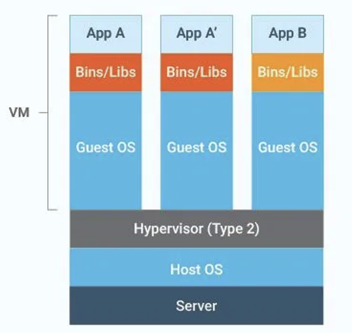
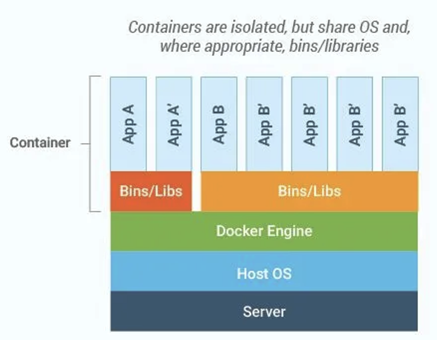

## Lernziele

Am Ende dieser Lektion können die Lernenden:

* **Definieren**, was Virtuelle Maschinen (VMs) und Container (Docker) sind.
* **Erklären**, wie sich hypervisorbasierte Virtualisierung und Containerisierung architektonisch unterscheiden.
* **Vergleichen** von Ressourcenverbrauch, Startzeiten, Isolationsgrad und Sicherheitsaspekten.
* **Identifizieren**, in welchen Anwendungsfällen VMs bzw. Docker-Container sinnvoll sind.
* **Praktisch durchführen**: eine VM starten und einen Docker-Container laufen lassen.

---

## 1. Einführung: Was ist Virtualisierung?

**Virtualisierung** ist der Prozess, eine oder mehrere simulierte „Maschinen“ auf einem einzigen physischen Host auszuführen. Diese Technologie ermöglicht eine effiziente Nutzung von Hardware-Ressourcen, indem sie in mehrere unabhängige Computerumgebungen abstrahiert werden.

Wichtige Komponenten der Virtualisierung:

* **Host-OS**: Das reale Betriebssystem, das auf der physischen Hardware installiert ist.
* **Hypervisor (Virtual Machine Monitor, VMM)**: Software, die CPU-, Speicher- und I/O-Ressourcen an Gastsysteme verteilt.
* **Guest-OS**: Ein vollständiges Betriebssystem, das innerhalb jeder Virtuellen Maschine läuft.

---

## 2. Virtuelle Maschinen (VMs)

### 2.1 Architektur



### 2.2 Funktionsweise

1. Der Hypervisor reserviert CPU-, Speicher- und Festplattenressourcen.
2. Jede VM startet ein vollständiges Gast-OS inklusive Kernel und User Space.
3. Die Isolation erfolgt auf Hardwareebene durch virtualisierte Geräte.

### 2.3 Vor- & Nachteile

| **Vorteile**                                               | **Nachteile**                                     |
| ---------------------------------------------------------- | ------------------------------------------------- |
| ✔️ Volle Isolation mit eigenen Kernen                      | ⏱️ Lange Bootzeiten (Minuten)                     |
| ✔️ Beliebige Betriebssysteme möglich (Windows, Linux, BSD) | 💾 Hoher Ressourcenverbrauch (RAM, Speicherplatz) |
| ✔️ Ausgereiftes Ökosystem und Sicherheitstools             | 🔧 Komplexes Management bei vielen VMs            |

---

## 3. Docker-Container

### 3.1 Architektur



### 3.2 Funktionsweise

1. Der Docker-Daemon nutzt **Namespaces** (für Prozess-, Netzwerk- und Mount-Isolation) und **cgroups** (für Ressourcenzuweisung).
2. Container teilen sich den Host-Kernel, enthalten aber ihre eigene Anwendung mit allen benötigten Abhängigkeiten.
3. Images sind schichtbasiert und wiederverwendbar – nur geänderte Schichten werden gespeichert, was die Verteilung effizient macht.

### 3.3 Vor- & Nachteile

| **Vorteile**                                     | **Nachteile**                                         |
| ------------------------------------------------ | ----------------------------------------------------- |
| ✔️ Start in weniger als einer Sekunde            | 🔐 Schwächere Isolation (geteilter Kernel)            |
| ✔️ Leichtgewichtig und ressourcenschonend        | 🐧 Kernel-Kompatibilität erforderlich (Linux-basiert) |
| ✔️ Portable Images über Registries (Docker Hub)  | ⚙️ Sicherheit abhängig von korrekter Konfiguration    |
| ✔️ Ideal für CI/CD-Pipelines dank Layered Builds | 🔄 Keine Windows-Apps auf Linux-Hosts (und umgekehrt) |

---

## 4. Vergleich: VMs vs. Docker

| Merkmal              | Virtuelle Maschine               | Docker-Container                           |
| -------------------- | -------------------------------- | ------------------------------------------ |
| **Isolationsgrad**   | Hardware (eigener Kernel pro VM) | OS-Level (Namespaces & cgroups)            |
| **Bootzeit**         | Minuten                          | Sekunden oder Millisekunden                |
| **Ressourcenbedarf** | Hoch (vollständiges OS pro VM)   | Gering (geteilter Kernel)                  |
| **Portabilität**     | VM-Formate (OVA, VMDK)           | Docker-Images (OCI-Standard)               |
| **Skalierbarkeit**   | Begrenzt durch Boot & Overhead   | Sehr hoch, funktioniert mit Orchestratoren |
| **Sicherheit**       | Stark, gut erforscht             | Im Wandel, benötigt Härtung                |

---

## 5. Performance

* **Virtuelle Maschinen**: Simulieren virtuelle Hardware, wodurch Overhead bei CPU- und I/O-Operationen entsteht.
* **Container**: Laufen direkt auf dem Host-Kernel und erreichen nahezu Bare-Metal-Performance.

---

## 6. Sicherheitsaspekte

* **VMs**:

  * Jedes Gast-OS ist vollständig isoliert.
  * Hypervisor-Schwachstellen sind selten, aber möglich.

* **Container**:

  * Ein kompromittierter Kernel kann alle Container betreffen.
  * Nutze Linux-Sicherheitsframeworks wie **SELinux**, **AppArmor** und rootless Docker zur Härtung.

---

## 7. Netzwerk

* **VMs**: Nutzen virtuelle Netzwerkkarten (NICs), die vom Hypervisor verwaltet werden. Optionen: NAT, Bridged, Host-only.
* **Container**:

  * Verwenden Docker-Netzwerke (bridge, host, overlay).
  * Eingebaute DNS-Auflösung.
  * Feingranulare Mikrosegmentierung für Microservices.

---

## 8. Speicher

* **VMs**: Nutzen virtuelle Festplatten-Images (qcow2, VDI, VMDK). Volle Snapshots werden unterstützt.
* **Container**: Verwenden schichtbasierte Images und Copy-on-Write-Speicher. Volumes ermöglichen persistente Datenspeicherung.

---

## 9. Anwendungsfälle

### Virtuelle Maschinen

* Mehrere verschiedene Betriebssysteme auf demselben Host ausführen.
* Unterstützung von Legacy-Anwendungen, die ein vollständiges OS benötigen.
* Workloads mit strikten Isolations- und Compliance-Anforderungen (z. B. Finanzwesen, PCI).

### Docker-Container

* Microservices-Architekturen (ein Service pro Container).
* CI/CD-Pipelines (schnelle Build- und Testzyklen).
* Leichte, kurzlebige Dev-/Test-Umgebungen.
* Verteilte Systeme im großen Maßstab mit Orchestrierung (z. B. Kubernetes).

---

## 10. Wichtigste Erkenntnisse

* **VMs** bieten starke Isolation, Unterstützung mehrerer OS-Typen, haben aber hohen Overhead und langsame Startzeiten.
* **Docker-Container** sind leichtgewichtig, schnell und portabel, benötigen aber zusätzliche Sicherheitsmaßnahmen.
* Die Wahl zwischen VMs und Containern hängt von den Workload-Anforderungen ab:

  * Bei **strikter Isolation und OS-Flexibilität** → VMs.
  * Bei **Geschwindigkeit, Skalierbarkeit und Effizienz** → Container.

---

## 11. Praktische Übungen

1. **Virtuelle Maschine starten**:

   * Installiere VirtualBox oder VMware.
   * Erstelle eine VM und installiere ein Gast-OS (z. B. Ubuntu).
   * Untersuche Systemressourcen und Netzwerkeinstellungen.

2. **Docker-Container ausführen**:

   * Installiere Docker.

   * Führe `docker run hello-world` aus, um die Installation zu prüfen.

   * Starte eine containerisierte App:

     ```bash
     docker run -d -p 8080:80 nginx:latest
     ```

   * Stoppe und entferne Container über die Docker-CLI.

---

## 12. Weiterführende Links

* [Docker-Dokumentation](https://docs.docker.com/)
* [KVM & QEMU Virtualization Guide](https://jamesnorth.net/post/qemu-guide)
* [CNCF Cloud Native Landscape](https://github.com/cncf/landscape)
* [VMware vSphere Dokumentation](https://www.vmware.com/products/cloud-infrastructure/vsphere/resources)
