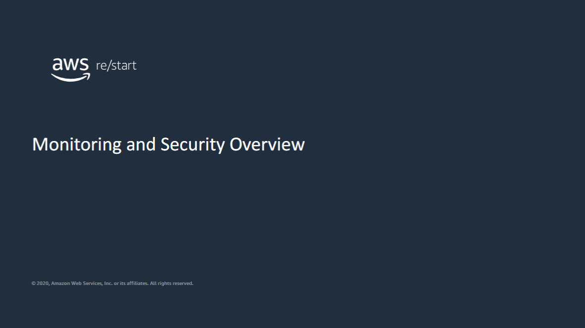
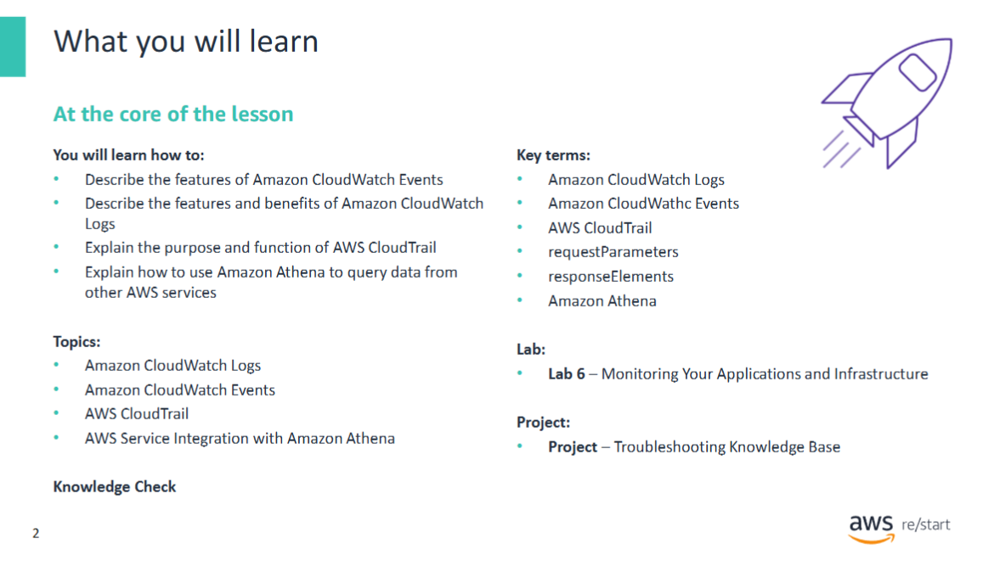
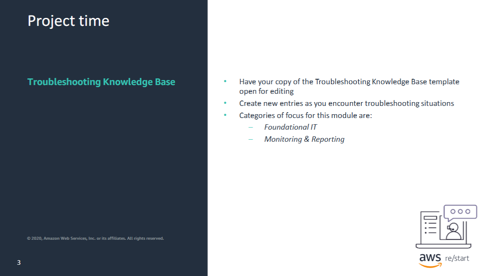

Welcome to Monitoring and Security Overview.

## Module Overview: Monitoring Your Cloud Infrastructure

In this module, you will learn how to monitor the health of your cloud infrastructure with services such as **Amazon CloudWatch** and **AWS CloudTrail**.

### Learning Objectives

By the end of this module, you will be able to:

- Describe the features of **Amazon CloudWatch Events**
- Describe the features and benefits of **Amazon CloudWatch Logs**
- Explain the purpose and function of **AWS CloudTrail**
- Explain how to use **Amazon Athena** to query data from other AWS services

### Module Content

This module includes a technical discussion of the key features of:

- **Amazon CloudWatch Events**
- **Amazon CloudWatch Logs**
- **AWS CloudTrail**
- **Amazon Athena**

### Hands-On Lab

The module ends with a hands-on lab. In this lab, you will use **CloudWatch** to monitor an **Amazon Elastic Compute Cloud (Amazon EC2)** instance and an application that runs on that instance.

Be ready to create some entries based on the topics that will be covered in this module. These topics include the Foundational ITand Monitoring & Reporting categories. 