## Module Overview: Introduction to AWS Monitoring

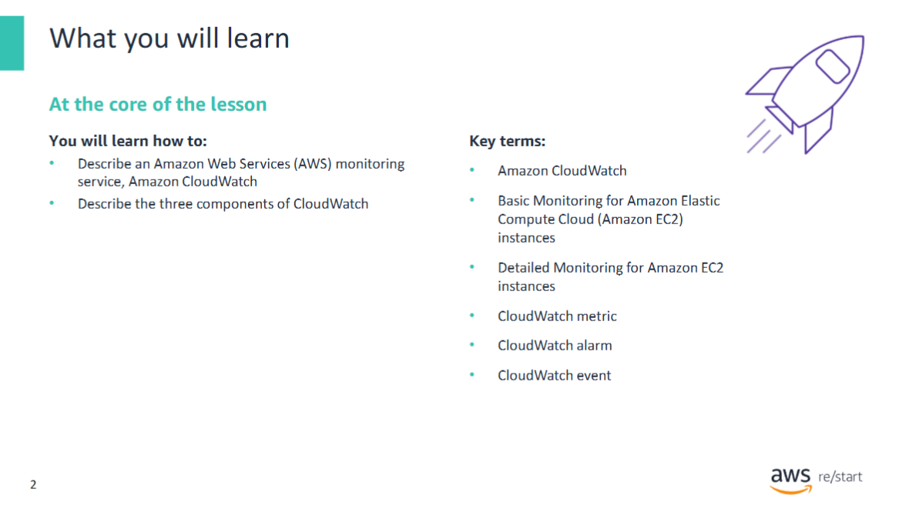

In this module, you will learn how to:

- Describe an AWS monitoring service: **Amazon CloudWatch**
- Describe the three components of **CloudWatch**

### Goal of This Module

The goal of this module is to help you understand the monitoring resources that are available to power your solution.  
You will also review the different service features that are available, so you can begin to understand how different choices affect things like **solution availability**.

## Why Monitoring Matters

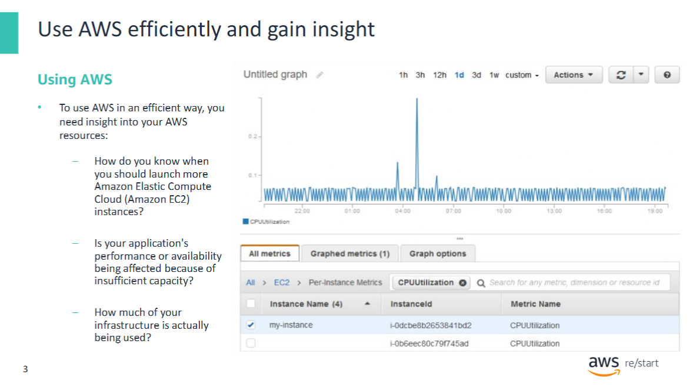

How do you capture this information?  
Without any kind of instrumentation, you are at a disadvantage. To use resources efficiently, you need insight into your resources.

You should understand:

- How to know when you should launch more **Amazon Elastic Compute Cloud (Amazon EC2)** instances  
- Whether your application’s performance or availability is being affected because of insufficient capacity  
- How much of your infrastructure is actually being used

## Monitoring with Amazon CloudWatch and Scaling with EC2 Auto Scaling

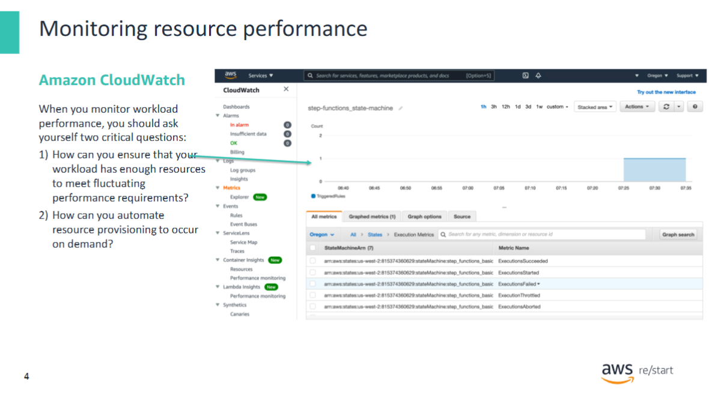

You can capture this information with **Amazon CloudWatch**.

When you run your applications on **EC2 instances**, it is critical to monitor the performance of your workload by using Amazon CloudWatch.

### Key Questions to Consider

When monitoring workload performance, ask yourself:

1. How can you ensure that your workload has enough **Amazon EC2** resources to meet fluctuating performance requirements?  
2. How can you automate **Amazon EC2** resource provisioning to occur on demand?

### CloudWatch and EC2 Auto Scaling

- **CloudWatch** helps with performance monitoring. However, by itself, it will not add or remove EC2 instances.  
- **Amazon EC2 Auto Scaling** can help in this situation.

With **Amazon EC2 Auto Scaling**, you can:

- Maintain the health and availability of your fleet  
- Dynamically scale your EC2 instances to meet demands during spikes and lulls

## Amazon CloudWatch Overview


The primary function of **Amazon CloudWatch** is to monitor the performance and health of your **AWS resources and applications**.

You can also use CloudWatch to collect and monitor log files from:

- EC2 instances  
- AWS CloudTrail  
- Amazon Route 53  
- Other sources

### What CloudWatch Does

Amazon CloudWatch is a **distributed statistics-gathering system**. It:

- Collects and tracks metrics from your applications  
- Allows you to create and use custom metrics  
- Sends notifications when an **alarm** goes off

### Monitoring Options for Amazon EC2

CloudWatch offers two levels of monitoring for EC2 instances:

- **Basic Monitoring** (no additional charge):  
  - Seven pre-selected metrics at a **5-minute frequency**  
  - Three status check metrics at a **1-minute frequency**

- **Detailed Monitoring** (additional charge):  
  - All Basic Monitoring metrics at a **1-minute frequency**  
  - Additional aggregation by **Amazon EC2**, **AMI ID**, and **instance type**

### Metric Retention

CloudWatch retains metrics for **15 months** (free of charge), following these retention schedules:

- **1-minute data points**: available for **15 days**  
- **5-minute data points**: available for **63 days**  
- **1-hour data points**: available for **455 days**

> 📘 To learn more, refer to the [Amazon CloudWatch webpage](https://aws.amazon.com/cloudwatch).

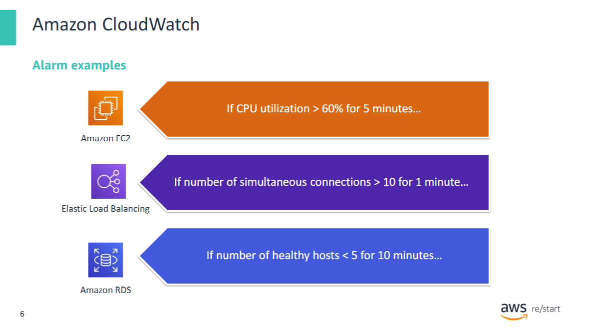

These examples show some CloudWatch alarms. Take a moment to review each one.

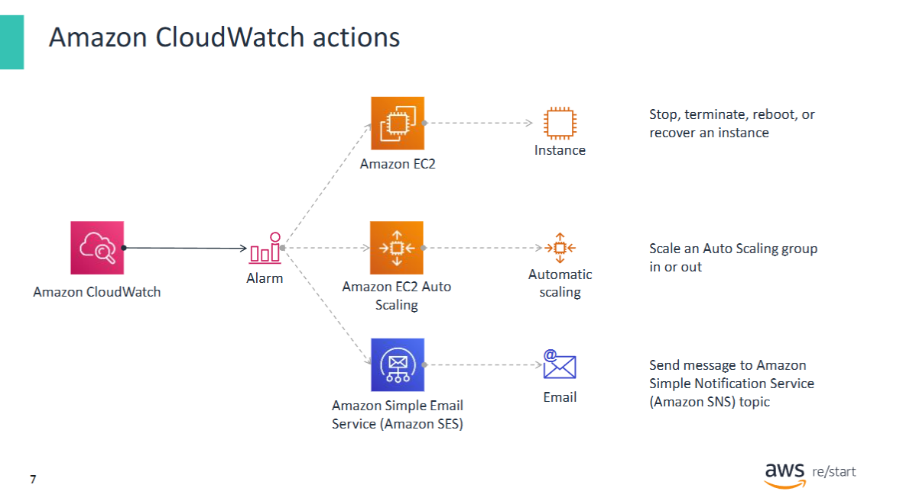

You can choose a number of actions to take based on the CloudWatch alarms.

## CloudWatch Alarms

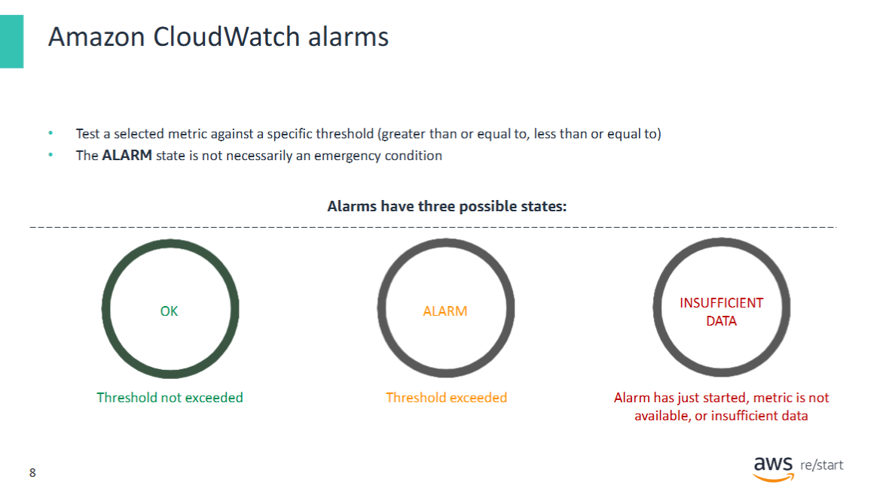

You can create a **CloudWatch alarm** that watches either:

- A single **CloudWatch metric**, or  
- The result of a **math expression** based on multiple CloudWatch metrics

The alarm performs one or more actions based on the **value of the metric or expression relative to a threshold** over several time periods.

### Alarm States

A CloudWatch alarm can be in one of the following three states:

- **OK** – The metric is within the defined threshold  
- **ALARM** – The metric is outside the defined threshold  
- **INSUFFICIENT_DATA** – The alarm has just started, the metric is not available, or not enough data is available to determine the alarm state

> **Note:**  
> The term **ALARM** is simply a label for the state. It does **not necessarily signal an emergency** that requires immediate action.  
> It indicates that the monitored metric is equal to, greater than, or less than the specified threshold value.

### Example Use Case

You could define an alarm that notifies you when your **CPUCreditBalance** for a **T2 instance** is running low.

You might then process this notification **programmatically** to suspend a CPU-intensive job on the instance until the credit balance is restored.

## Example: CloudWatch Monitoring in Action


The diagram depicts an example of **CloudWatch monitoring** in action.

### Setup

- On the left, an **EC2 instance** has a **CloudWatch agent** installed, and **detailed monitoring** is enabled.
- Two metrics are being sent from the agent:
  - **CPU utilization**:  
    - A standard metric available in CloudWatch  
    - Collected automatically and easily
  - **Memory utilization of the `httpd` service**:  
    - Not visible at the hypervisor level  
    - Requires a **custom metric** to be defined

### Alarm Configuration and Notification Flow

- A **CloudWatch alarm** is configured to trigger when **CPU utilization** exceeds a defined threshold (`x%`).
- When the alarm is triggered:
  - A message is sent using **Amazon SNS**
  - An **email notification** is generated
  - A **third-party paging or tracking system** receives the alert  
    → This could trigger actions like **paging on-shift IT personnel**
- The same CloudWatch alarm also sends a message to an **Amazon SQS** topic  
  → This generates a **work item** for further processing

## CloudWatch Alarm Thresholds and Evaluation Periods

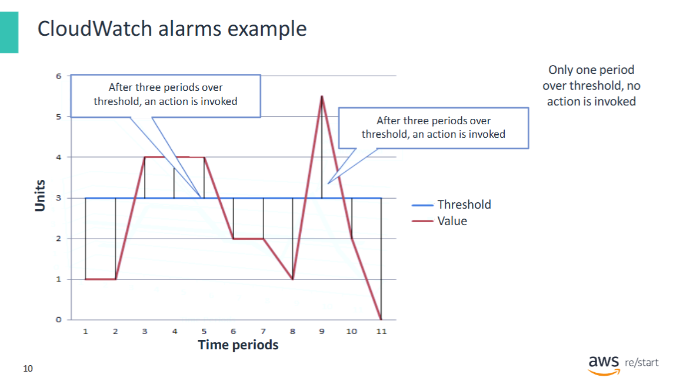

In the diagram, the **CloudWatch alarm threshold** is set to `3`, and the **minimum breach duration** is set to **3 periods**.

This means:

- The alarm **only triggers** (invokes its action) when the threshold is **breached for three consecutive periods**.

### Alarm State Transitions (Example)

- **Periods 3–5**:  
  The metric exceeds the threshold in all three periods → Alarm state changes to **ALARM**

- **Period 6**:  
  The metric drops below the threshold → Alarm state returns to **OK**

- **Period 9**:  
  The threshold is breached again, but **not for three consecutive periods**  
  → Alarm state **remains OK**

---

> 📘 For more information, refer to [Using Amazon CloudWatch Alarms](https://docs.aws.amazon.com/AmazonCloudWatch/latest/monitoring/AlarmThatSendsEmail.html)

## Understanding CloudWatch Metrics

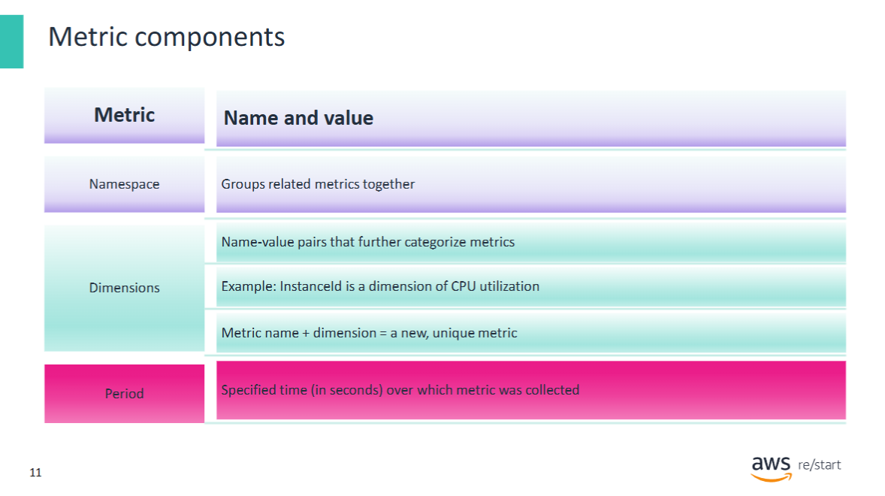

**Metrics** are the fundamental concept in CloudWatch.  
A metric represents a **time-ordered set of data points** that are published to CloudWatch.

> Think of a metric as a variable to monitor — the data points represent the values of that variable over time.

### Example

The **CPU usage** of a particular **EC2 instance** is a standard metric provided by Amazon EC2.  
Data points can also originate from any **application** or **business activity** that you collect data from.

---

### Metric Properties

Metrics are uniquely defined by:

- **Metric name**
- **Namespace**
- Zero or more **dimensions**

Each data point includes:

- A **timestamp**
- Optionally: a **unit of measure**

When you request statistics, the returned data is identified by:

- **Namespace**
- **Metric name**
- **Dimension(s)**
- (Optionally) **Unit**

> 📌 **Important:** Metrics exist only in the **AWS Region** where they are created.

---

### Namespace

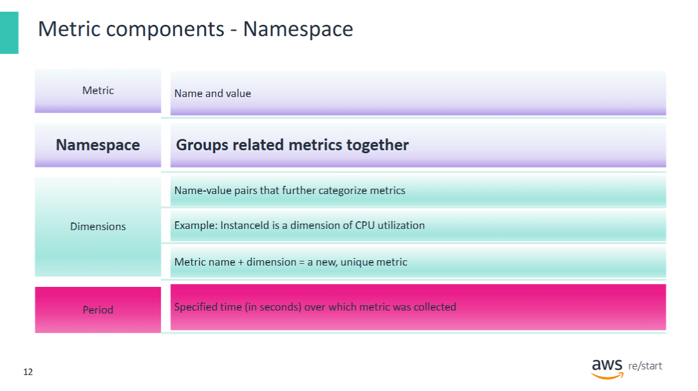

A **namespace** is a container for **CloudWatch metrics**.

- Metrics in different namespaces are **isolated** from each other  
  → This prevents metrics from different applications from being **mistakenly aggregated** into the same statistics.
- AWS uses the naming convention: `AWS/<service>`

**Example:**

- Amazon EC2 uses the namespace: `AWS/EC2`

### Dimension

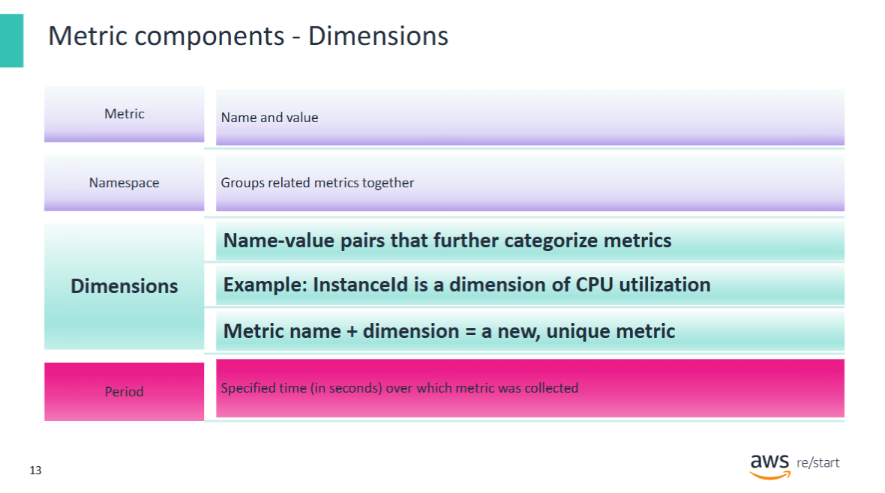

A **dimension** is a **name-value pair** that uniquely identifies a metric.

- You can assign **up to 10 dimensions** to a metric.
- Each metric has specific characteristics, and dimensions act as **categories** for those characteristics.
- Dimensions help you **design a structure** for your statistics plan.
- They also allow you to **filter** the results that CloudWatch returns.

**Example:**

To get statistics for a specific EC2 instance, you can specify the dimension: `InstanceId`.

### Period

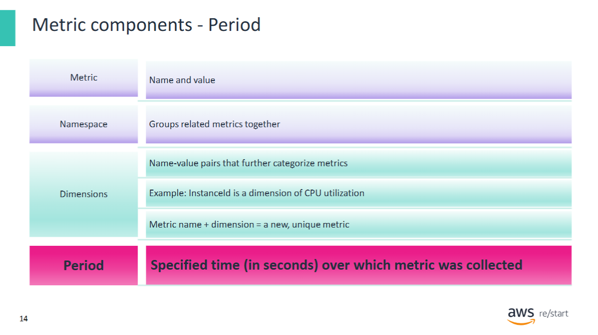

A period is the length of time that is associated with a specific CloudWatch statistic. Periods are defined in numbers of seconds. You can adjust how the data is aggregated by varying the length of the period. A period can be as short as 1 second or as long as 1 day (86,400 seconds).

### Example: Listing Metrics for an S3 Bucket

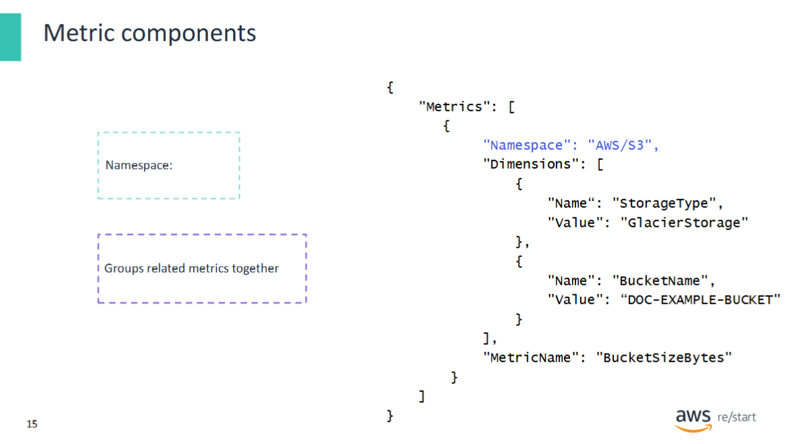

Suppose you have **only one S3 bucket** defined in your AWS account.

You run the following AWS CLI command:

```bash
aws cloudwatch list-metrics --namespace AWS/S3
```
The returned metric data will look similar to the following:

The namespace AWS/S3 indicates that the metric is related to the Amazon S3 service.

The bucket name (e.g. DOC-EXAMPLE-BUCKET) is included.

The response also includes two dimensions as name-value pairs.

These dimensions help uniquely identify the metric and provide additional context for monitoring and filtering.

## Standard and Custom CloudWatch Metrics

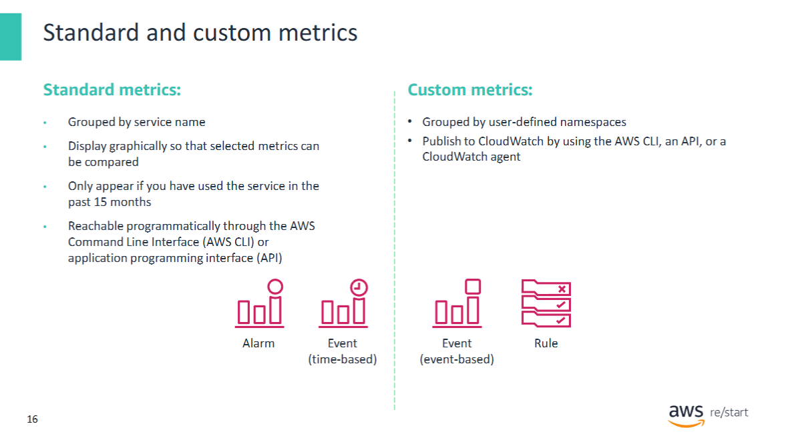

As mentioned previously, CloudWatch provides two types of metrics:

- **Standard metrics**
- **Custom metrics**

### Standard Metrics

- Standard metrics are **grouped by AWS service**.
- In the **AWS Management Console**, you can navigate to the CloudWatch service and select a link (e.g. EC2) to view all relevant metrics.
- These metrics are displayed **graphically**, allowing for easy comparison.
- You can also use the AWS CLI to view available metrics.

**Example (AWS CLI):**

```bash
aws cloudwatch list-metrics --namespace AWS/S3
```

This command lists all available standard Amazon S3 metrics.

📌 Note: Metrics cannot be deleted manually.
However, they automatically expire after 15 months if no new data is published.
As new data points are added, data older than 15 months is dropped on a rolling basis.

### Custom Metrics
- AWS services send standard metrics to CloudWatch by default.
- You can also publish your own custom metrics using:
    - The AWS CLI
    - The CloudWatch API
    - A CloudWatch agent
- Custom metrics are grouped by the namespace you define when you create them.

## Using CloudWatch for Security Monitoring: Billing Alerts

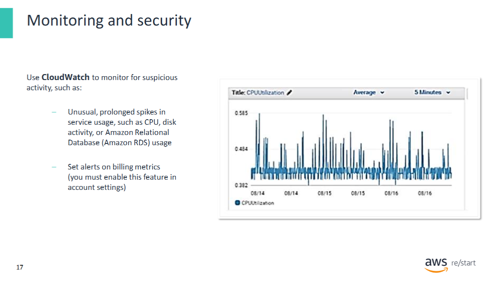

One common use of **Amazon CloudWatch** is to **monitor account resources for suspicious activity**.

### Example: Billing-Based Alerts

Generating alerts based on **billing data** is an effective way to detect potential **security violations** in your AWS account.

Some customers only discover that their **credentials or IAM access keys** were compromised when they receive a bill for **thousands of dollars** in unexpected charges.

### Proactive Monitoring Strategy

To detect this situation **proactively**, you can:

1. **Enable billing alerts** in your AWS account preferences
2. Create **CloudWatch alarms** that notify you if your **estimated monthly billing charges** exceed a specified threshold

This setup allows you to act quickly and investigate any unusual activity before it results in high costs.

---
## Amazon CloudWatch Dashboards

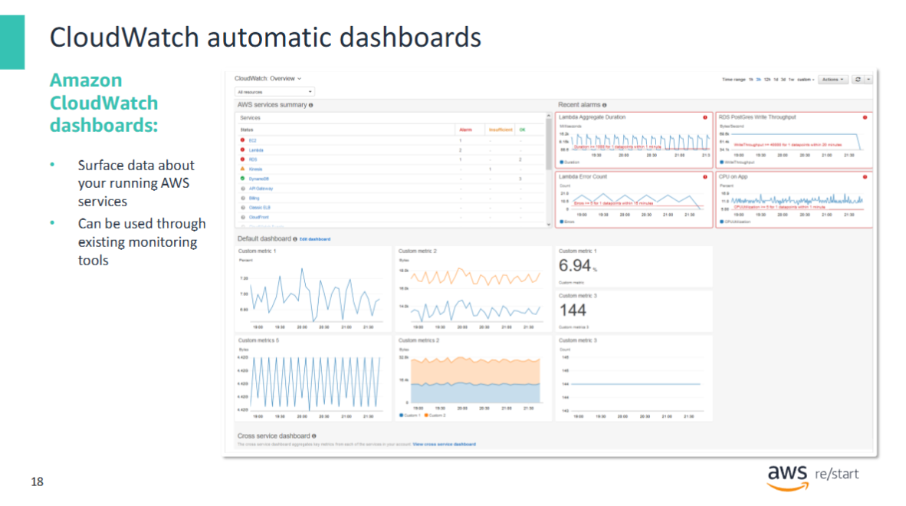

**Amazon CloudWatch dashboards** are customizable homepages in the CloudWatch Console that allow you to **monitor your resources in a single view**.

### Custom Dashboards

- Create **customized views** of metrics and alarms for your AWS resources
- Monitor key metrics from your **own applications or services**
- Highlight additional important metrics from AWS services of your choice

### Automatic Dashboards

- **Aggregated views** of the health and performance of all AWS resources
- Provide **account-based** and **resource-based** perspectives
- Enable you to **drill down** into specific issues to identify root causes
- Automatically **update dynamically** to reflect the latest state of metrics
- Follow **AWS best practices**, and remain **resource-aware**

### Console Layout Overview (Example)

- **Upper-left area**:  
  Lists all AWS services currently in use and the state of their associated alarms

- **Upper-right area**:  
  Displays **recently triggered alarms** (only if alarms have been both configured and triggered)

- **Lower area**:  
  - Lets you add metrics from **custom services or applications**
  - By default, shows **Cross-service dashboard metrics**
  - Provides a link to **Create a new CloudWatch-Default dashboard**

> 📌 If you name the new dashboard `CloudWatch-Default`, it will appear on the **main CloudWatch Overview** page.

## Basic vs. Detailed Monitoring for EC2 Instances

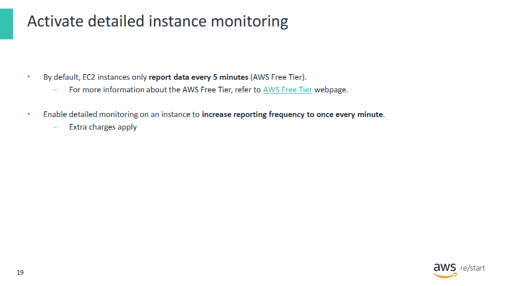

By default, **EC2 instances** are enabled for **basic CloudWatch monitoring**, which provides data in **5-minute increments** as part of the **AWS Free Tier**.

### Detailed Monitoring (Optional)

- You can enable **detailed monitoring** for an **additional cost**
- After enabling detailed monitoring, data is available in **1-minute increments**

---

### Further Information

- 📘 [AWS Free Tier – Overview](https://aws.amazon.com/free)
- 📘 [Enable or Turn Off Detailed Monitoring for Your Instances](https://docs.aws.amazon.com/AWSEC2/latest/UserGuide/using-cloudwatch-new.html)

---

## Summary: What Amazon CloudWatch Does

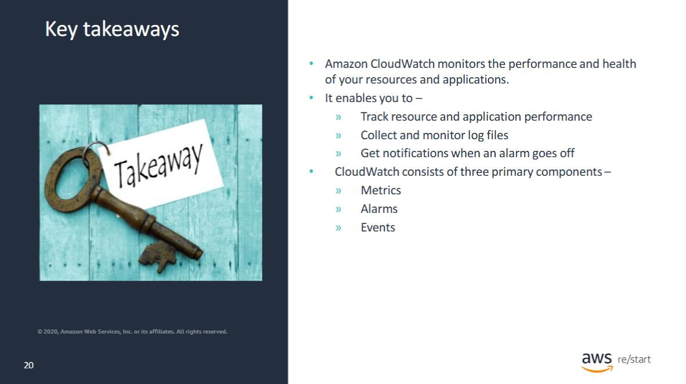

**Amazon CloudWatch** tracks and monitors the **performance and health** of your AWS resources and applications.

### Key Capabilities

CloudWatch enables you to:

- Track **resource and application performance**
- Collect and monitor **log files**
- Get **notified when an alarm goes off**

### Core Components

CloudWatch consists of three primary components:

1. **Metrics**
2. **Alarms**
3. **Events**
