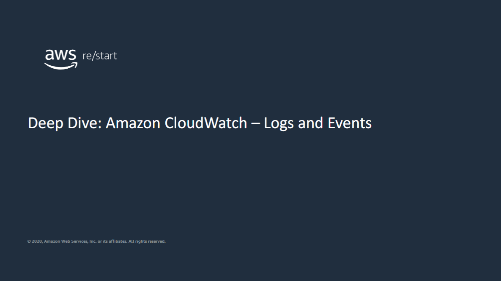
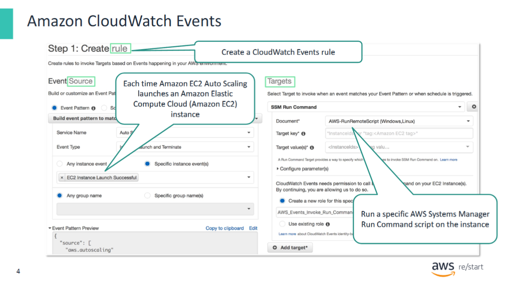
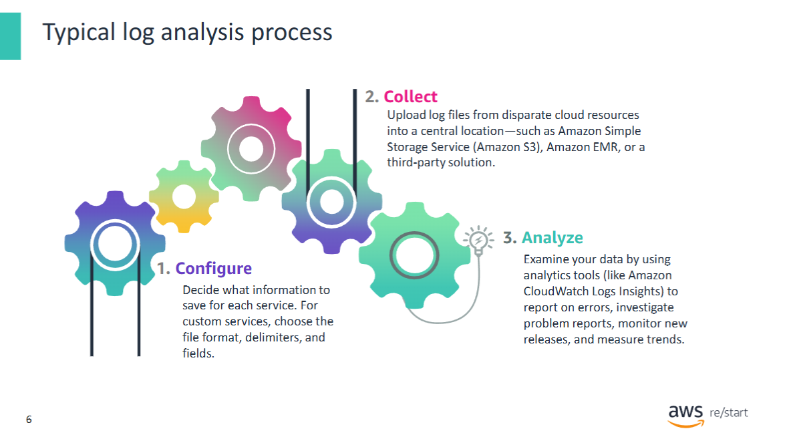
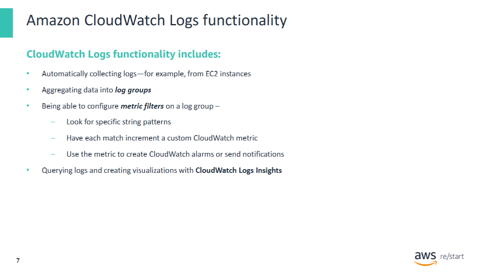
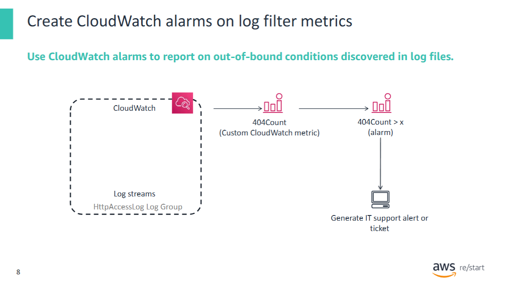
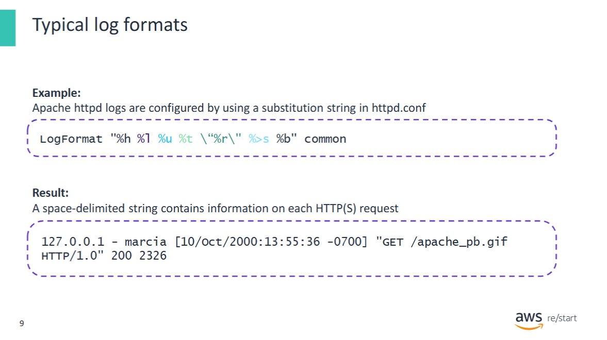
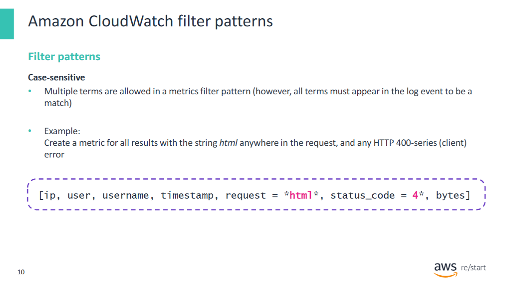
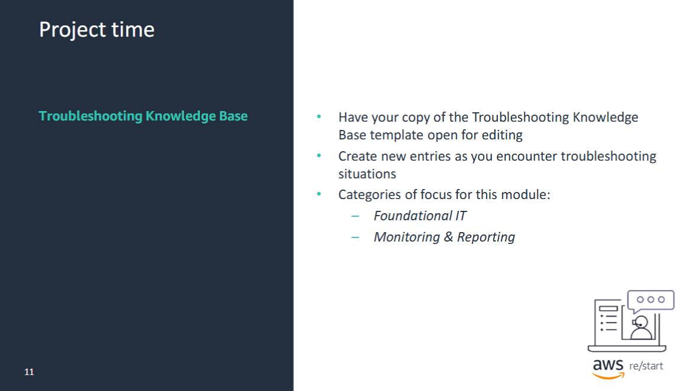
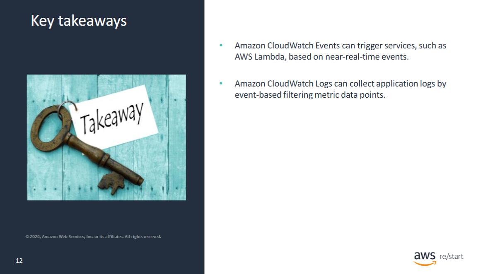

At the end of this module, you will be able to:
- Describe the features of Amazon CloudWatch Events
- Describe the features and benefits of Amazon CloudWatch Logs

---


## Amazon CloudWatch Events



**Amazon CloudWatch Events** delivers a near-real-time stream of system events that describe changes in AWS resources.

By using simple, configurable rules, you can match events and route them to one or more **target functions or streams**.

### What CloudWatch Events Can Do

CloudWatch Events becomes aware of **operational changes** as they occur. It responds by:

- Sending messages  
- Activating functions  
- Making changes  
- Capturing state information  

You can also **schedule automated actions** using **cron** or **rate expressions**.

> 📘 For details on schedule expressions, see the AWS documentation:  
> [Rate or Cron expressions in Lambda](https://docs.aws.amazon.com/lambda/latest/dg/tutorial-scheduled-events-schedule-expressions.html)

---

### Key Concepts

#### Events

An **event** indicates a **change in your AWS environment**.

- AWS resources generate events when their **state changes**.  
  - Example: **Amazon EC2** emits an event when the instance state changes from `pending` to `running`.
- You can also:
  - Generate **custom application-level events** and publish them to CloudWatch Events
  - Set up **scheduled events** that are triggered periodically

#### Targets

A **target** processes the event.

- Example targets include:
  - **EC2 instances**
  - **AWS Lambda functions**
  - **Amazon SNS** topics
  - **Amazon SQS** queues

#### Rules

A **rule** matches incoming events and **routes them to targets** for processing.

- A single rule can route to **multiple targets**, which are processed **in parallel**
- This allows different teams or services to react to the **same event independently**


### Example Use Case

A **CloudWatch Event rule** is created to trigger an **AWS Systems Manager Run Command** script every time a new EC2 instance is launched.

---


## Amazon CloudWatch Logs



**Amazon CloudWatch Logs** allows you to **monitor, store, and access** log files from:

- **EC2 instances**
- **AWS CloudTrail**
- **Amazon Route 53**
- Other sources

You can then retrieve and analyze the associated log data directly from CloudWatch Logs.

### Key Capabilities

- Monitor logs in **near real-time** for specific **phrases**, **values**, or **patterns**
- Set **alarms** based on log data (e.g. number of errors in system logs on EC2 instances)
- Visualize metrics such as **web request latency** from application logs
- View the **original log data** to investigate root causes
- **Store log data indefinitely** and **separately** from EC2 instance storage  
  → No risk of filling up hard drives

---

### The Three Phases of Log Analysis

1. **Configure**  
   Decide what information needs to be logged, where it will be stored, and how.

2. **Collect**  
   In dynamic cloud environments, instances come and go.  
   Ensure a strategy is in place to **periodically upload** log files before instances are terminated.

3. **Analyze**  
   Once data is collected, analyze it to:
   - Monitor **system health**
   - Identify **trends in customer behavior**
   - Gain insights into **how users interact** with your systems

---

## Collecting and Analyzing Logs with CloudWatch Logs



**CloudWatch Logs** enables you to **automatically collect logs** from supported services, such as **EC2 instances**.

### Log Collection Setup

- To collect log data from an EC2 instance, you must install either:
  - The **unified CloudWatch agent** (recommended), or  
  - The older **CloudWatch Logs agent**

- Log data from multiple EC2 instances can be **aggregated into log groups**.
  - Each **log group** should represent a specific type of log with a consistent format.
  - The CloudWatch agent collects the specified log data (e.g. application logs) and sends it to the appropriate log group.

### Metric Filters and Alarms

- **Filters** can be applied to log groups to search for specific strings or patterns.
- Each match can be assigned a **numeric value**, which increments a **custom CloudWatch metric**.
- These custom metrics can be used just like any other:
  - Create **CloudWatch alarms**
  - Send **notifications**

---

### CloudWatch Logs Insights

**CloudWatch Logs Insights** is a powerful log analytics feature within CloudWatch that offers:

- A **purpose-built query language** with:
  - Sample queries
  - Command descriptions
  - Automatic query completion
  - Log field discovery

This helps you quickly query and analyze log data from various AWS services.  
Predefined **sample queries** are available for many AWS service log types.

---

## Example: Monitoring HTTP Errors with CloudWatch Logs



In the following example scenario (based on the diagram), these steps occur:

1. A **CloudWatch log group** named `HttpAccessLog` contains **aggregated log data**.  
   - This data is collected by **CloudWatch agents** installed on one or more **EC2 instances**.

2. An **administrator creates a custom CloudWatch filter** on the log group.  
   - The filter searches for **`404 Page Not Found`** HTTP error messages in the log data.

3. Each match **increments a custom CloudWatch metric** called `404Count`.

4. The administrator configures a **CloudWatch alarm** to trigger when `404Count` exceeds a specified threshold (represented as `x`).

5. When the alarm is triggered, a **notification** is sent — for example, to the **IT support team**.

---

> ✅ This setup allows you to detect repeated access errors in real-time and alert the appropriate team automatically.
---

## Understanding Application Log Formats



Application logs typically generate data in a **standardized format**.  
To **successfully parse** relevant data from log files, you must understand the specific **log format** being used.

### Example: Apache Web Server Access Log

The following example shows an **access log file** generated by the **Apache web server**.

- This log file is usually located at:  
  `/var/log/httpd/access_log`  
  (on the EC2 instance where the web server is installed)

- Each time the web server receives an **HTTP request**, a new line is written to the access log.

---

### Typical Apache Log Entry Fields

Each log entry contains:

- **`%h`** – IP address of the host machine that made the HTTP(S) request  
- **`%l`** – Identity of the client machine  
  - Typically not available, shown as a dash (`-`)
- **`%u`** – User ID of the person making the request  
  - If login was not required, this is unknown  
  - Example: a user named `marcia` made the request
- **`%t`** – Time the request was received
- **`%r`** – Request line  
  - Includes the request type (e.g. `GET`) and the requested resource (e.g. HTML page, image, CSS file)
- **`%s`** – HTTP status code returned by the server  
  - Example: `200` for success, `404` for not found
- **`%b`** – Size of the object returned to the client

> 📘 Understanding the structure of log entries is essential for building effective **metric filters**, **alerts**, and **log queries**.

---

## Creating a Metric Filter in CloudWatch Logs



To create a **metric filter**, you must define a **filter pattern**.

### Steps in the AWS Management Console

1. Open the **CloudWatch Console**  
2. In the navigation pane, choose **Logs**  
3. In the contents pane, select a **log group**, then choose **Create Metric Filter**  
4. Define your **filter pattern**

---

### Filter Pattern Syntax

- You must follow the **established filter pattern syntax**  
- **Filter patterns are case-sensitive**
- Multiple terms are allowed, but all terms must be present **within a single log event** for a match to occur

**Example:**

If your filter pattern is:

```
ERROR Exception
```

Then only log entries that contain **both** `ERROR` and `Exception` in the **same event** will match.

> 📘 To learn more, refer to the official documentation:  
> [Filter and Pattern Syntax](https://docs.aws.amazon.com/AmazonCloudWatch/latest/logs/FilterAndPatternSyntax.html)

---



Be ready to create some entries based on the topics that will be covered in this module. These topics include the Foundational ITand the Monitoring & Reporting categories.

---

