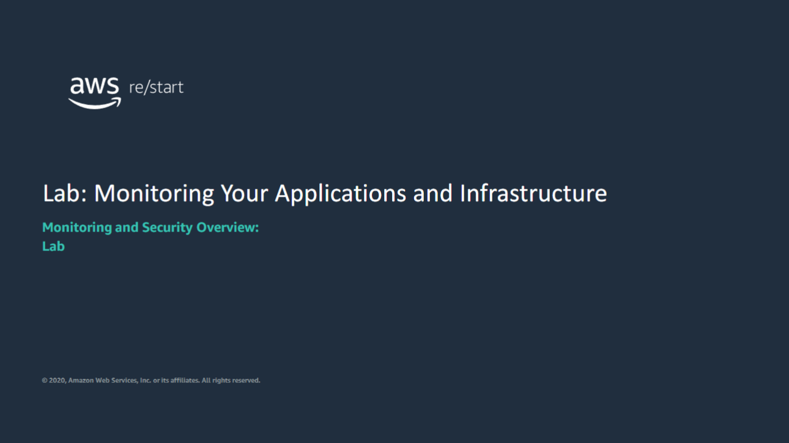
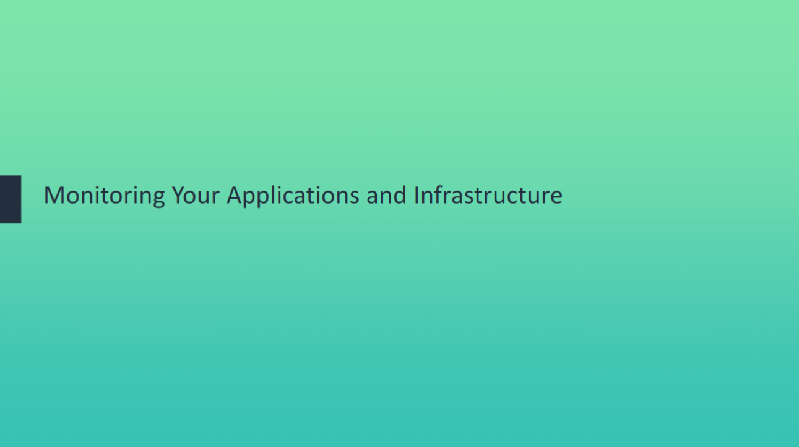
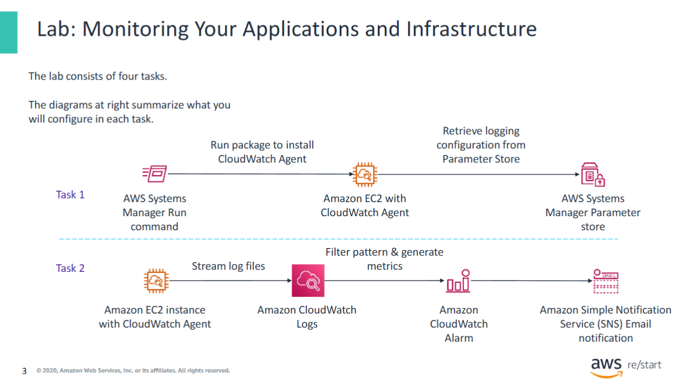
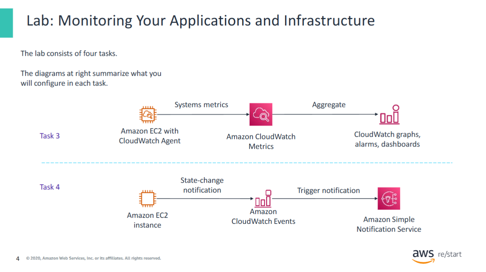

Lab: Monitoring Your Applications and Infrastructure

Begin lab: Monitoring Your Applications and Infrastructure

The lab demonstrates how to:

- Use the AWS Systems Manager **Run Command** to install the Amazon CloudWatch Agent on Amazon Elastic Compute Cloud (Amazon EC2) instances  
- Monitor application logs by using **Amazon CloudWatch Logs**  
- Monitor system metrics by using **Amazon CloudWatch Metrics**  
- Create real-time notifications by using **Amazon CloudWatch Events**  
- Track infrastructure compliance by using **AWS Config**

The lab demonstrates how to:

- Use the AWS Systems Manager **Run Command** to install the Amazon CloudWatch Agent on Amazon Elastic Compute Cloud (Amazon EC2) instances  
- Monitor application logs by using **Amazon CloudWatch Logs**  
- Monitor system metrics by using **Amazon CloudWatch Metrics**  
- Create real-time notifications by using **Amazon CloudWatch Events**  
- Track infrastructure compliance by using **AWS Config**
