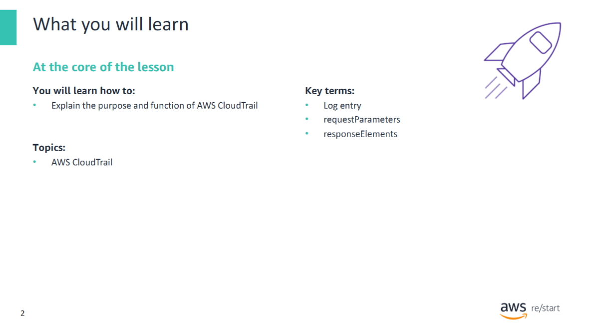
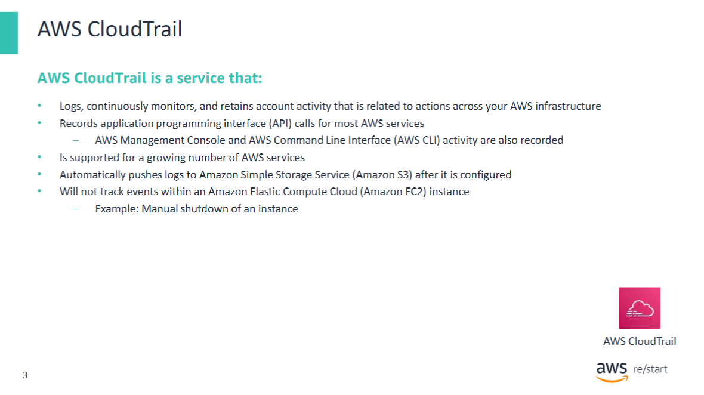
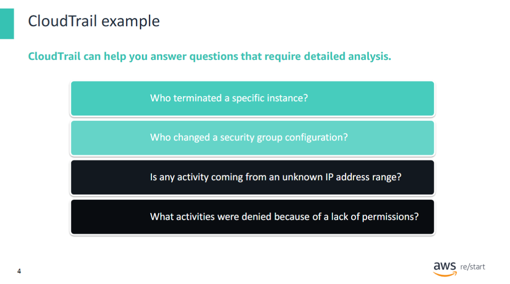
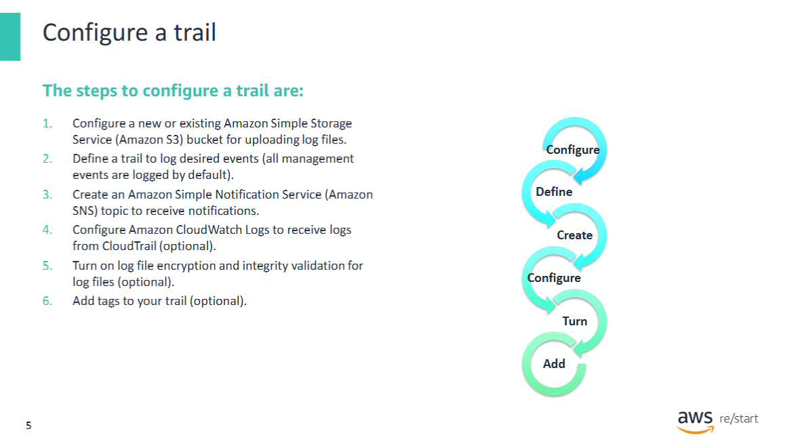
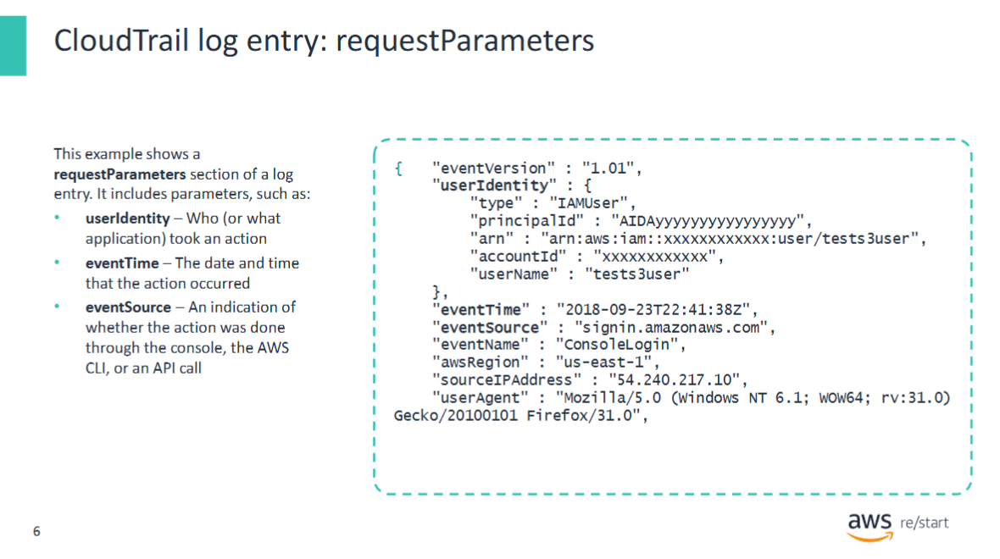
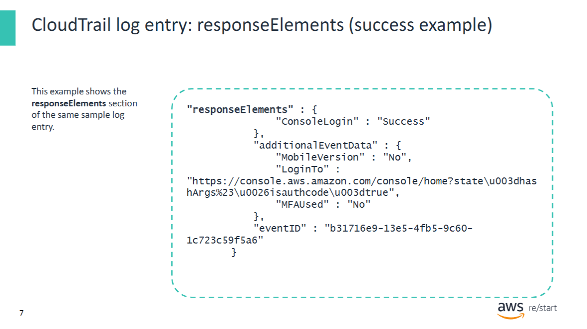
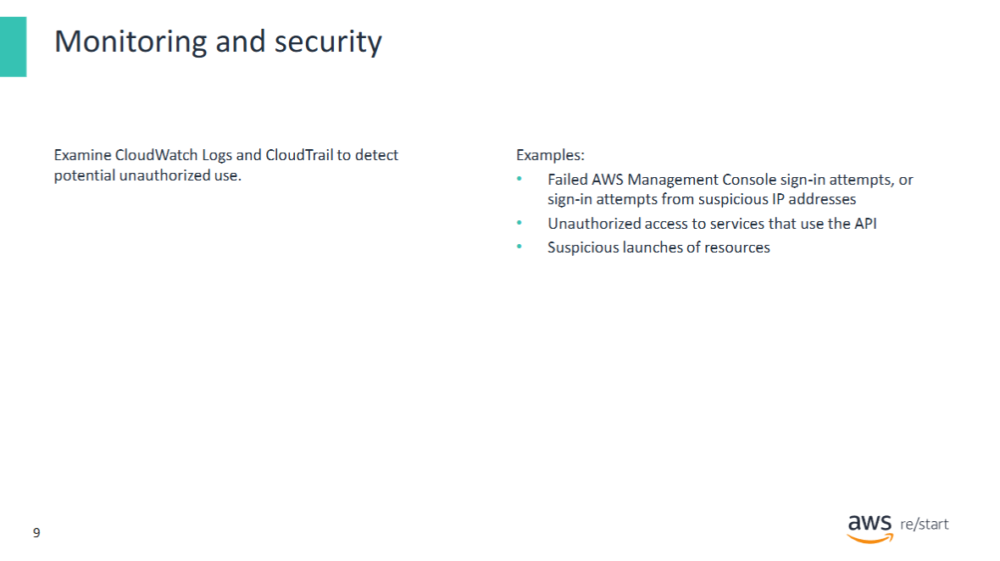
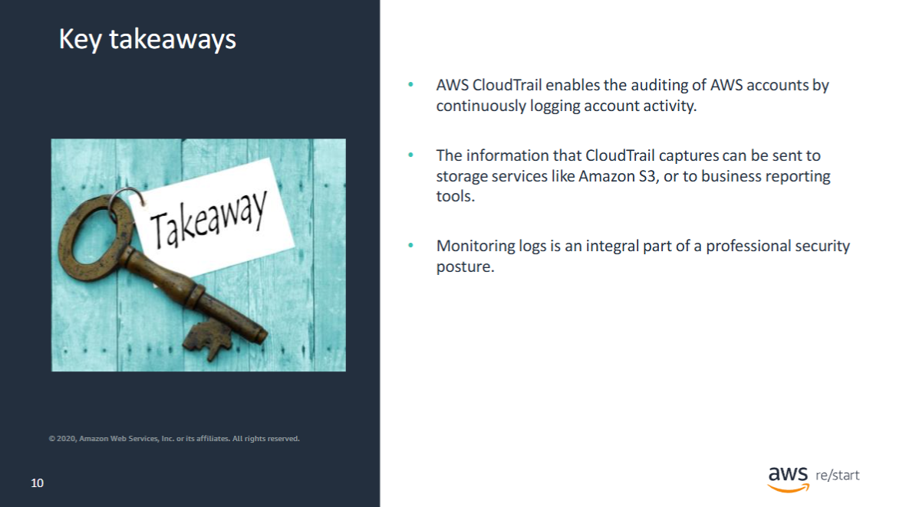

The lesson will now explore AWS CloudTrail.



At the end of this module, you will be able to:
- Explain the purpose and function of AWS CloudTrail.

## AWS CloudTrail



**AWS CloudTrail** is an AWS service that generates logs of calls to the AWS application programming interface (API). The AWS API underlies both the AWS Command Line Interface (AWS CLI) and the AWS Management Console. Thus, CloudTrail can record all activity against the services that it monitors.

It enables governance, compliance, operational auditing, and risk auditing of AWS accounts. A large (and growing) number of AWS services are supported. For details, refer to *CloudTrail Supported Services and Integrations*.

After CloudTrail is configured, it pushes the auditing logs to **Amazon Simple Storage Service (Amazon S3)**.

Though AWS CloudTrail is full-featured, it does **not** track events that occur *within* an **Amazon Elastic Compute Cloud (Amazon EC2)** instance.  
For example, CloudTrail does not track when someone manually shuts down an instance by using a **Secure Shell (SSH)** session connection to the instance. They could issue a command such as:

```bash
sudo shutdown –h now
```

## CloudTrail Example



By using **CloudTrail**, you can store logs on API usage in an **S3 bucket**. Later, you can analyze those logs to answer a number of questions, such as:

- Why was a long-running instance terminated, and who terminated it?  
  The answers could be useful for organizational traceability and accountability.

- Who changed a security group configuration?  
  Accountability and security auditing teams might want to know this information.

- Is any activity coming from an unknown IP address range?  
  Such activity could indicate a potential external attack, which is a security concern.

- What activities were denied because of a lack of permissions?  
  Such activity could indicate internal or external attack attempts.

## Configure a trail



By default, when you access the **CloudTrail event history** for the Region that you are viewing, CloudTrail shows only the results from the **last 90 days**. These events are limited to **management events** with create, modify, and delete API calls, as well as account activity.

For a **complete record** of account activity—including all management events, data events, and read-only activity—you must configure a **CloudTrail trail**.

You can create a trail by using the **CloudTrail console** or the **AWS CLI**. The following options can be configured:

1. **Create an S3 bucket** or specify an existing bucket where you want the log files to be stored.
2. **Configure your trail** to log read-only, write-only, or all management and data events.  
   By default, trails log all management events.
3. **Create an Amazon Simple Notification Service (SNS) topic** to receive notifications when log files are delivered.
4. *Optionally*, configure **Amazon CloudWatch Logs** to receive logs from CloudTrail so that you can monitor for specific log events.
5. *Optionally*, **turn on log file encryption** for added security.
6. *Optionally*, **add tags** (custom key-value pairs) to your trail.

For more information, refer to *[What Is AWS CloudTrail?](https://docs.aws.amazon.com/awscloudtrail/latest/userguide/cloudtrail-user-guide.html)*.

## CloudTrail log entry

### requestParameters



Each **JavaScript Object Notation (JSON)**-formatted CloudTrail log file can contain one or more **log entries**.  
A log entry represents a single request from any source. It includes information about the **requested action** and **response**.

The example shows the `requestParameters` section of a log entry. It includes parameters such as:

- **userIdentity** – Who (or what application) took an action.  
- **eventTime** – The date and time the action occurred.  
- **eventSource** – An indication of whether the action was done through the console, the AWS CLI, or an API call.  

Additional parameters can also be included.  
The actual list of parameters depends on the type of action that was logged.

> ⚠️ **Note:**  
> Log entries are **not guaranteed to be in any particular order**.  
> They are **not** an ordered stack trace of API calls.

### responseElements (success example)



This example shows the `responseElements` section of the same sample log entry.

In this case:

- The attempt to log in to the **console was successful**.
- The user did **not** use the **mobile version** of the console.
- The user **used multi-factor authentication (MFA)** to log in.

### responseElements (failure example)

![CloudTrail log entry: responseElements (failure example)](../../../assets/jumpstart/cloudtrail/cloudtrail_log_example_failure.png

This example is the `responseElements` section of a login attempt for a different sample log entry.

In this example:

- The **login attempt was unsuccessful**.

## Monitoring and security



When you monitor the activity on your account and secure your resources and data, the features of **CloudWatch** and **CloudTrail** are **complementary**.  
Using both services is considered a **best practice**.

For example, you can:

- Examine the logs from **CloudWatch Logs**
- Analyze **CloudTrail entries** to detect potential unauthorized use

Other example uses of these services include:

- Monitoring for **failed AWS Management Console sign-in attempts**, especially from suspicious IP addresses  
- Detecting **unauthorized access to services** through API calls  
- Identifying the **suspicious launching of AWS resources**

## Key Takeaways



**Key Takeaway**

- **AWS CloudTrail** enables auditing of AWS accounts by continuously logging account activity.
- The information that CloudTrail captures can be sent to storage services like **Amazon S3**, or to **business reporting tools**.
- **Monitoring logs** is an integral part of a professional security posture.
