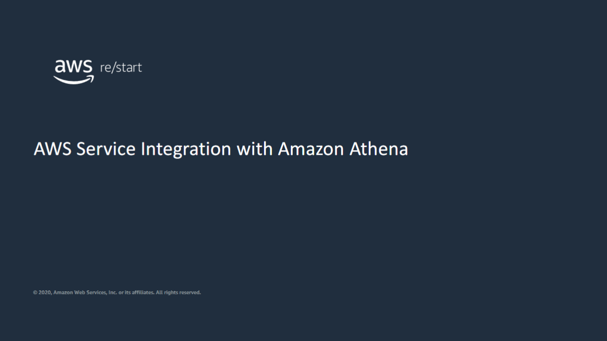
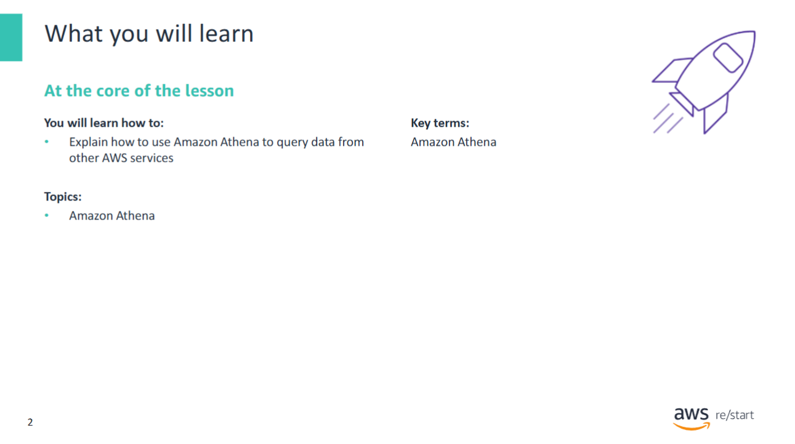
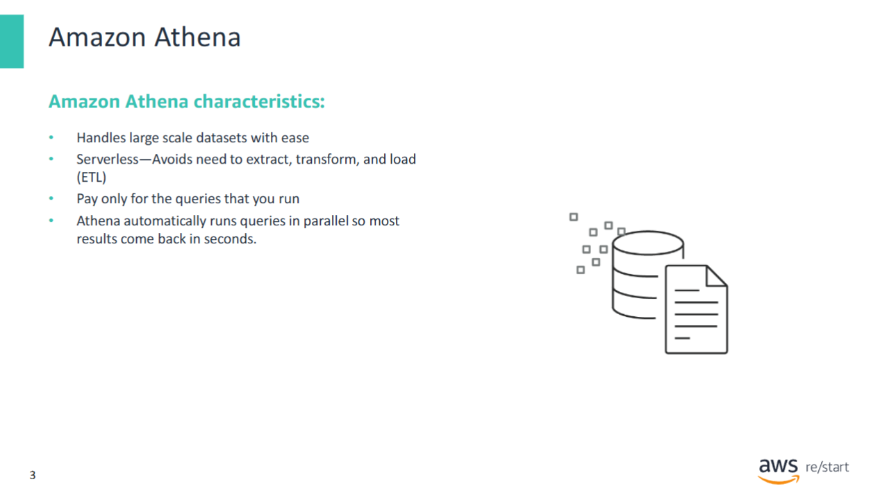
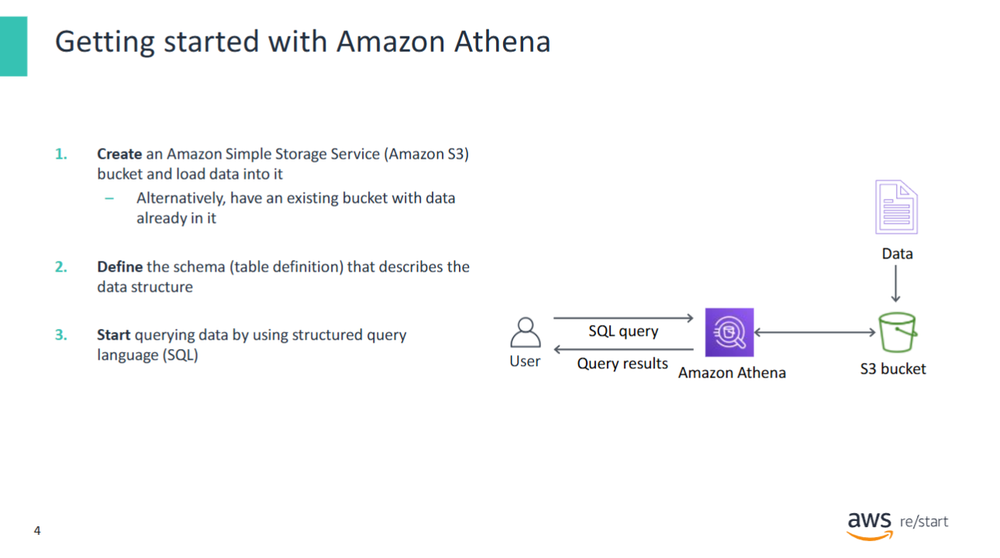
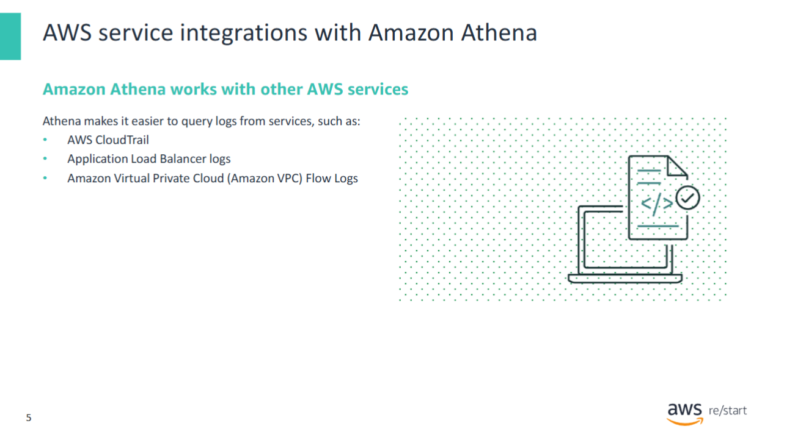
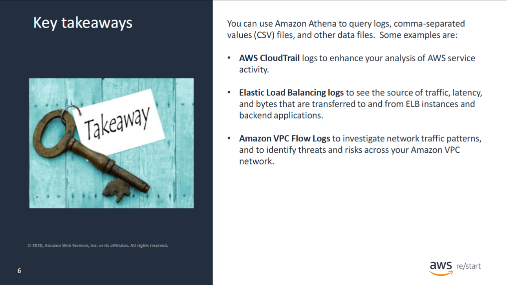

The module will now explore AWS Service Integration with Amazon Athena.

This module includes a technical discussion of AWS service integration with Amazon Athena. Amazon Athena is an interactive query service that makes it easy to analyze data in Amazon Simple Storage Service (Amazon S3) by using standard structured query language (SQL). 

At the end of this module, you will be able to:
- Explain how to use Amazon Athena to query data from other AWS services

## Amazon Athena

To use **Amazon Athena**, point to your data in **Amazon Simple Storage Service (Amazon S3)**, define the schema, and start querying using standard **SQL**.  
Most results are delivered within seconds.

With Athena:

- You do **not** need complex **ETL jobs** to prepare your data for analysis.
- It is easy for anyone with **SQL skills** to quickly analyze large-scale datasets.
- It supports standard data formats such as:
  - **CSV** (Comma-Separated Values)
  - **JSON** (JavaScript Object Notation)
  - **ORC** (Optimized Row Columnar)
  - **Apache Avro**
  - **Apache Parquet**

Athena is ideal for **quick, ad hoc querying**, but it can also handle **complex analysis**, including **large joins** and **arrays**.

Additional benefits:

- Athena uses **Amazon S3** as its underlying data store, providing **high availability** and **durability**.
- Athena is **serverless** – there is no infrastructure to manage.
- You **pay only for the queries you run**.
- No need to set up or manage **servers or data warehouses**.
- You can query all your data in S3 **without complex ETL processes**.
- Athena offers **fast, interactive query performance** by automatically running queries in **parallel**.

> 💡 Most results return **within seconds**, even for large datasets.

## Getting started with Amazon Athena

To use **Athena**, point to your data in **Amazon S3**, define the schema, and start querying using the **built-in query editor**.

### Steps to Get Started

1. **Open the Athena Query Editor**  
   - Go to the **Amazon Athena service** in the **AWS Management Console**, and choose **Get Started**.  
   - The **Athena Query Editor** opens, listing databases and tables in the left column.  
   - You can create a database by running a command like:  
     `CREATE DATABASE mydatabase;`  
   - Then, create a **table** to define the schema of your data.  
     Athena table definitions are similar to relational database table definitions.  
     To see an example, refer to the *Getting Started* section in the [Amazon Athena documentation](https://docs.aws.amazon.com/athena/latest/ug/getting-started.html).  
     The table definition ends with a `LOCATION` statement, which points to the **S3 bucket** where your data resides (or will reside).

2. **Run SQL Queries**  
   After defining the table, you can run **standard SQL queries** using the Athena Query Editor. For example:  
   `SELECT * FROM tableName WHERE columnName = 'value';`

3. **View and Export Results**  
   - Query results are displayed directly in the **Athena Query Editor**.  
   - You can also **download the results as CSV files**.  
   - Additionally, you can **create a client application** to access Athena and run SQL queries programmatically.  
     For a Java example, see the *Code Samples* page in the [Amazon Athena documentation](https://docs.aws.amazon.com/athena/latest/ug/code-samples.html).

## AWS service integrations with Amazon Athena

You can query data from other **AWS services** in **Athena**, including services that monitor and secure your account (which is why Athena is covered in this module).

For example:

- Using **Athena with CloudTrail logs** can enhance your analysis of AWS service activity.  
  You can automatically create tables for querying CloudTrail logs directly from the **CloudTrail console**, and use those tables to run queries in Athena.  
  You can then identify trends and further isolate activity by attributes such as **source IP address** or **user**.

- Querying **Application Load Balancer logs** with Athena enables you to see:
  - The **source of traffic**
  - **Latency**
  - **Bytes transferred** to and from **Elastic Load Balancing instances** and backend applications

- **Amazon VPC flow logs** capture information about the IP traffic that goes to and from network interfaces in a **VPC**.  
  You can query these logs in Athena to:
  - Investigate **network traffic patterns**
  - Identify **threats and risks** across your Amazon VPC network

For the full list of AWS services that integrate with Amazon Athena, refer to  
[*AWS Service Integrations with Athena*](https://docs.aws.amazon.com/athena/latest/ug/what-is.html#service-integration).

## Key takeaways

- Use **Athena with CloudTrail logs** to enhance your analysis of AWS service activity.
- Use **Athena to query Application Load Balancer logs**.  
  This enables you to see the **source of traffic**, **latency**, and **bytes transferred** to and from **ELB instances** and **backend applications**.
- Use **Athena with Amazon Virtual Private Cloud (VPC) Flow Logs** to capture information about **IP traffic** that goes to and from **network interfaces (NIC)** in a VPC.  
  Query the logs in Athena to investigate **network traffic patterns** and identify **threats and risks** across your Amazon VPC network.
