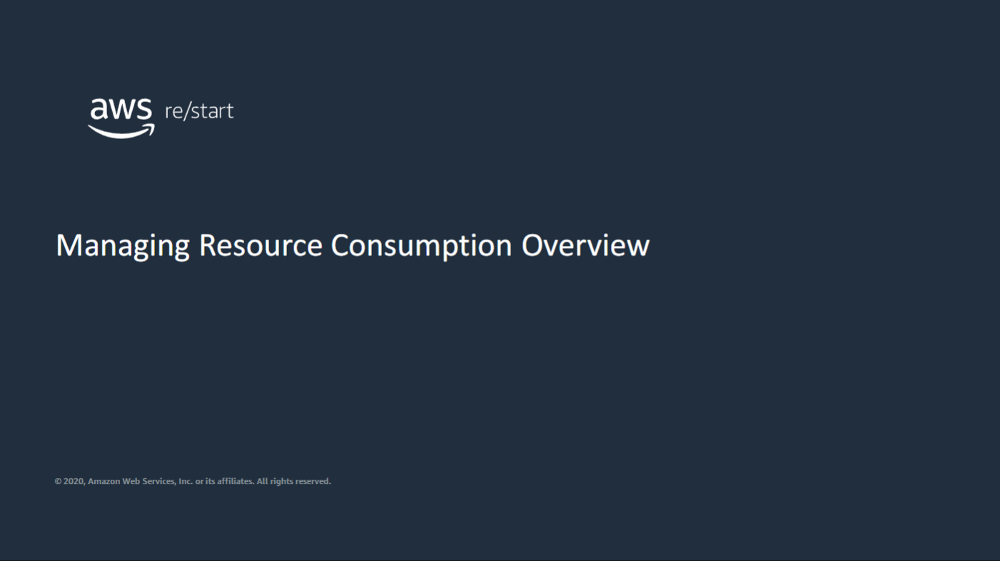
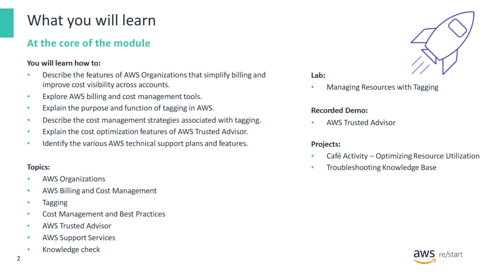
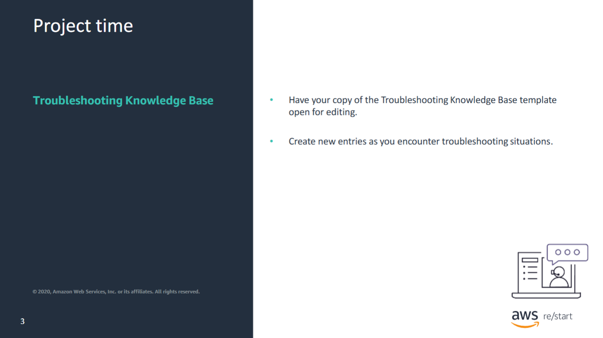

Welcome to Managing Resource Consumption Overview.

At the end of this module, you will be able to:

- Describe the features of **AWS Organizations** that simplify billing and improve cost visibility across accounts
- Explore **AWS billing and cost management tools**
- Explain the purpose and function of **tagging** in AWS
- Describe the **cost management strategies** associated with tagging
- Explain the **cost optimization features** of **AWS Trusted Advisor**
- Identify the various **AWS technical support plans and features**

You will also have the opportunity to complete a **knowledge check**.

Be ready to create some entries in your Troubleshooting Knowledge Base document based on the topics that will be covered in this module.