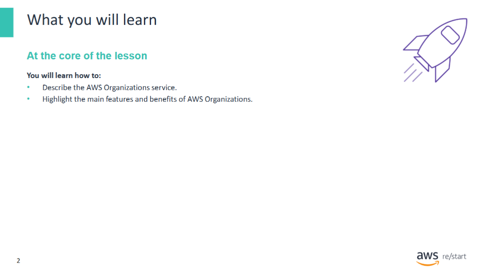
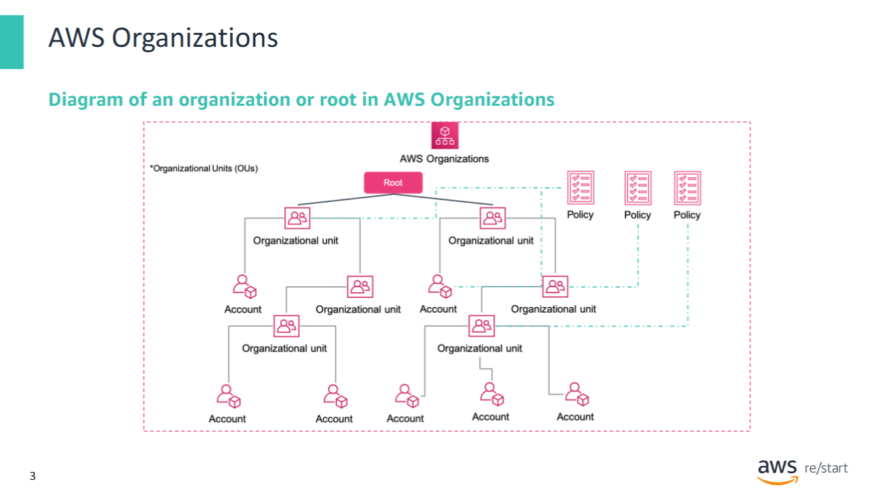
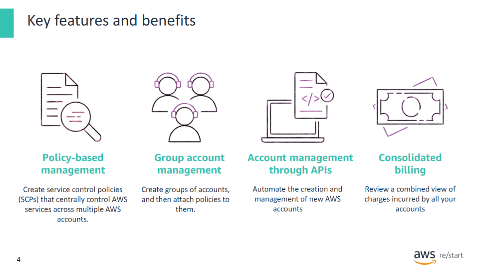
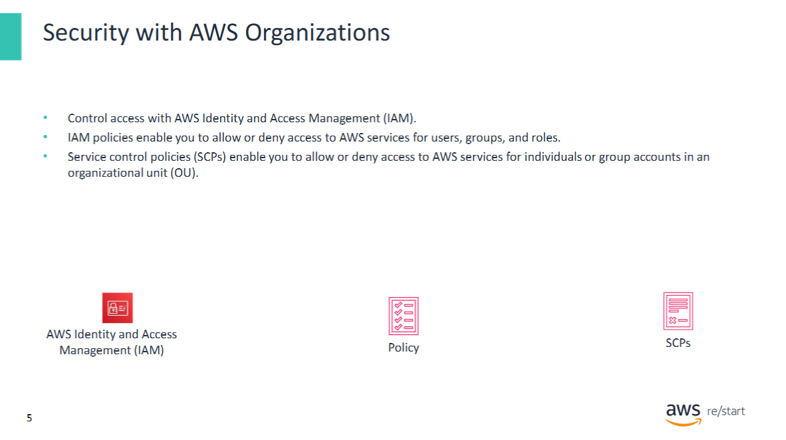
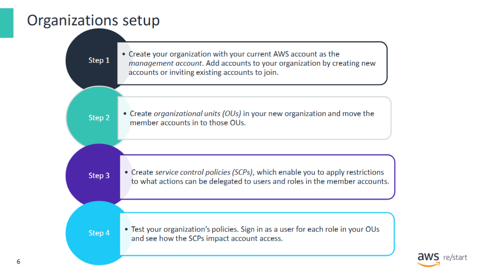
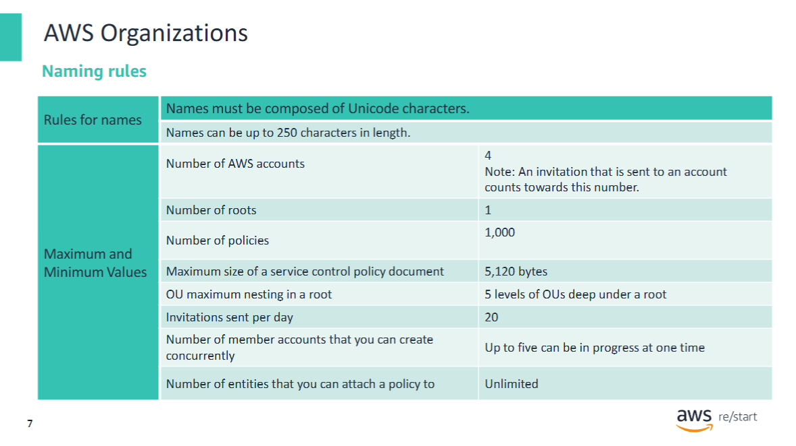
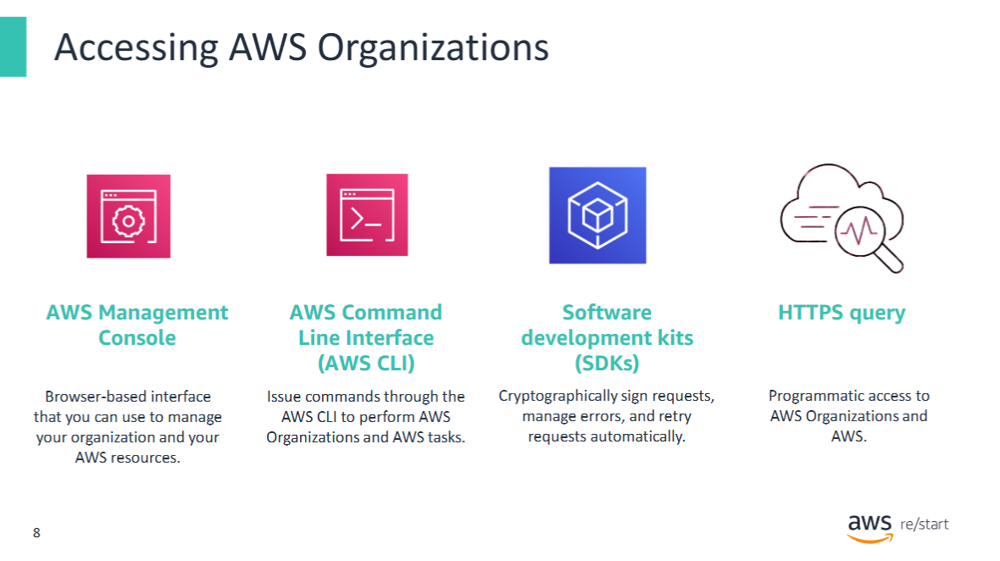
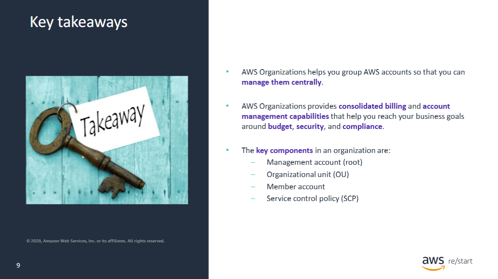

Welcome to Introduction to AWS Organizations

In this lesson, you will learn how the AWS Organizations service provides billing and support functions. You will also review the main features and benefits of AWS Organizations.

## AWS Organizations

**AWS Organizations** is an account management service that enables you to consolidate multiple AWS accounts into an **organization** that you create and centrally manage.

AWS Organizations includes:

- **Consolidated billing**
- **Account management capabilities**

These features help you better meet the **budgetary**, **security**, and **compliance** needs of your business.

---

The diagram shows a basic **organization**, or **root**.  
This example organization consists of **seven accounts** that are organized into **six organizational units (OUs)**.

- An **OU** is a container for accounts within a root.
- An OU can also contain **other OUs**, which enables you to create a **hierarchy** that resembles an **upside-down tree**:
  - The **root** is at the top.
  - The **branches** are OUs.
  - The **leaves** are the individual accounts.

When you attach a **policy** to one of the nodes in the hierarchy, it flows down and affects **all the branches and leaves**.

Key points:

- This organization has several policies attached to OUs or directly to accounts.
- An OU can have **only one parent**.
- Each account can be a member of **exactly one OU**.
- An **account** is a standard AWS account that contains your AWS resources.
- You can attach a policy to an individual account to apply controls **only to that account**.

## Key features and benefits

**The main benefits of AWS Organizations are:**

- **Centrally managed access policies** across multiple AWS accounts  
- **Controlled access** to AWS services  
- **Automated AWS account creation and management**  
- **Consolidated billing** across multiple AWS accounts

## Security with AWS Organizations

**AWS Organizations** does **not** replace associating **AWS Identity and Access Management (IAM) policies** with users, groups, and roles within an AWS account.

- **IAM policies** enable you to allow or deny access to:
  - AWS services (e.g., **Amazon S3**)
  - Individual AWS resources (e.g., a specific **S3 bucket**)
  - Individual API operations (e.g., `s3:CreateBucket`)

- An **IAM policy** can be applied only to:
  - IAM **users**
  - IAM **groups**
  - IAM **roles**

> 🔒 **Note:** IAM policies **cannot** restrict the **AWS account root user**.

---

In contrast, with **AWS Organizations**, you use **Service Control Policies (SCPs)** to allow or deny access to specific AWS services for:

- Individual AWS accounts
- Groups of accounts in an **Organizational Unit (OU)**

The specified actions from an attached **SCP** affect **all IAM users, groups, and roles** for an account — **including the root user**.

## Organizations setup

**To create and set up an organization, follow these steps:**

1. **Create your organization**  
   Use your current AWS account as the **management account**.  
   > This process assumes that you have **administrator permissions** in your current account.  
   After creating the organization, you can:
   - Create **new accounts**, or
   - **Invite existing accounts** to join using the management account.

2. **Create Organizational Units (OUs)**  
   In your new organization, create OUs and **move the member accounts** into those OUs.

3. **Create Service Control Policies (SCPs)**  
   SCPs enable you to apply **restrictions** to what actions can be delegated to **users and roles** in the member accounts.  
   > An SCP is a type of **organization control policy**.

4. **Test your organization’s policies**  
   - Sign in as a user for each **role in your OUs** to see how SCPs impact account access.
   - Alternatively, use the **IAM policy simulator** to test and troubleshoot:
     - IAM policies
     - Resource-based policies  
     > These can be attached to IAM users, groups, or roles in your AWS account.  
     > To learn more, refer to: *[Testing IAM policies with the IAM policy simulator](https://docs.aws.amazon.com/IAM/latest/UserGuide/access_policies_testing-policies.html)*.

### Naming rules

When you create names in **AWS Organizations**—including names of **accounts**, **organizational units (OUs)**, **roots**, and **policies**—you must follow certain rules.

- Names must be composed of **Unicode characters**
- Names can be up to **250 characters** in length

There are a number of other **maximum and minimum values** for entities in AWS Organizations.  
Some of the main values are shown in the table (refer to the official documentation for the complete list).

## Accessing AWS Organizations

**AWS Organizations** is available to all AWS customers **at no additional charge**.  
It can be managed through different interfaces:

- **AWS Management Console**  
  A browser-based interface to manage your organization and AWS resources.  
  > You can perform any task in your organization using the console.

- **AWS Command Line Interface (AWS CLI)**  
  Enables you to issue commands to perform AWS Organizations and other AWS tasks.  
  > The CLI can be faster and more convenient than using the console.

- **AWS Software Development Kits (SDKs)**  
  Help you manage tasks like:
  - Cryptographically signing requests
  - Managing errors
  - Retrying requests automatically

  AWS SDKs consist of libraries and sample code for various programming languages and platforms, such as:
  - Java
  - Python
  - Ruby
  - .NET
  - iOS
  - Android

- **AWS Organizations HTTPS Query API**  
  Provides programmatic access to AWS Organizations via **direct HTTPS requests**.  
  > When using this API, you must **digitally sign requests** using your credentials.

## Key takeaways

**Key Takeaways from this Lesson**

- **AWS Organizations** helps you **group AWS accounts** so that you can manage them centrally.
- It provides **consolidated billing** and **account management capabilities** that support your business goals around **budget**, **security**, and **compliance**.

**Key components in an organization:**

- **Management account (root)**
- **Organizational unit (OU)**
- **Member account**
- **Service control policy (SCP)**
