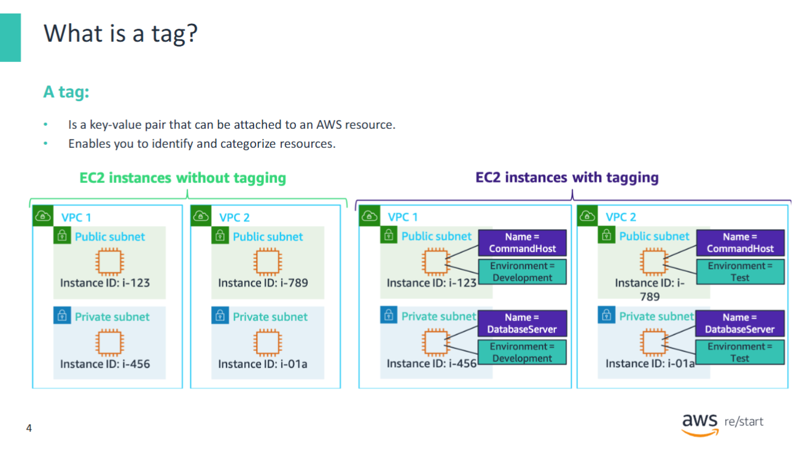
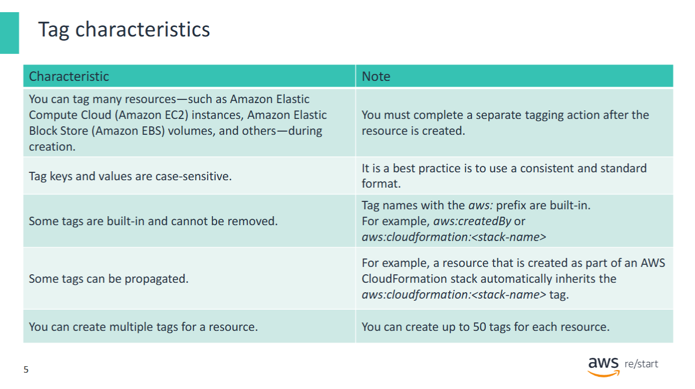
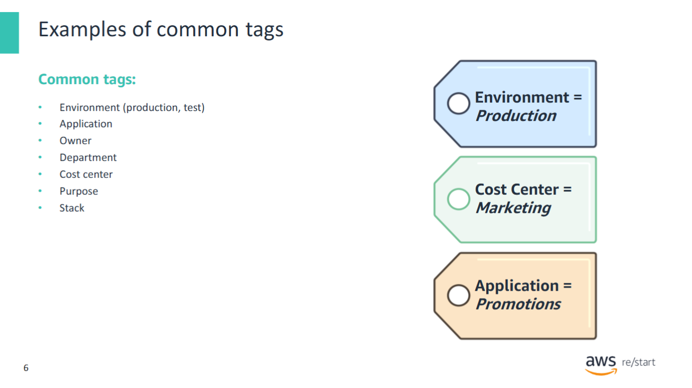
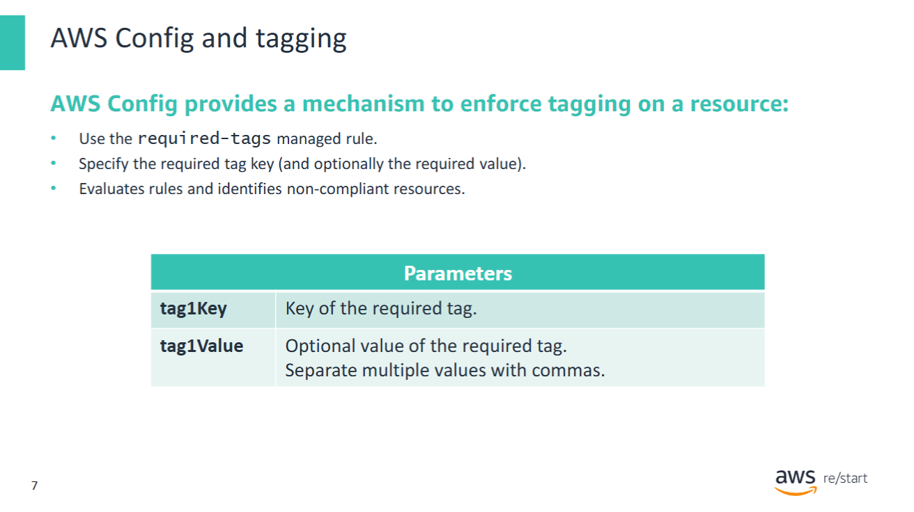
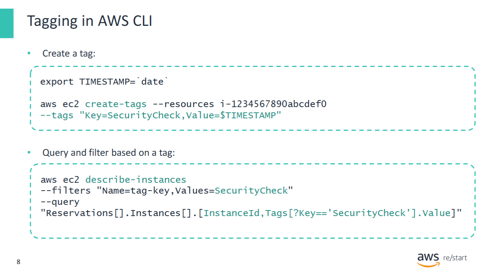
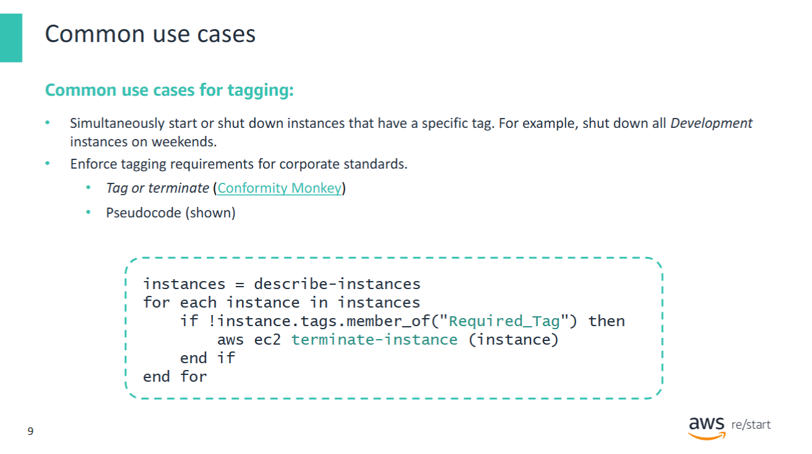
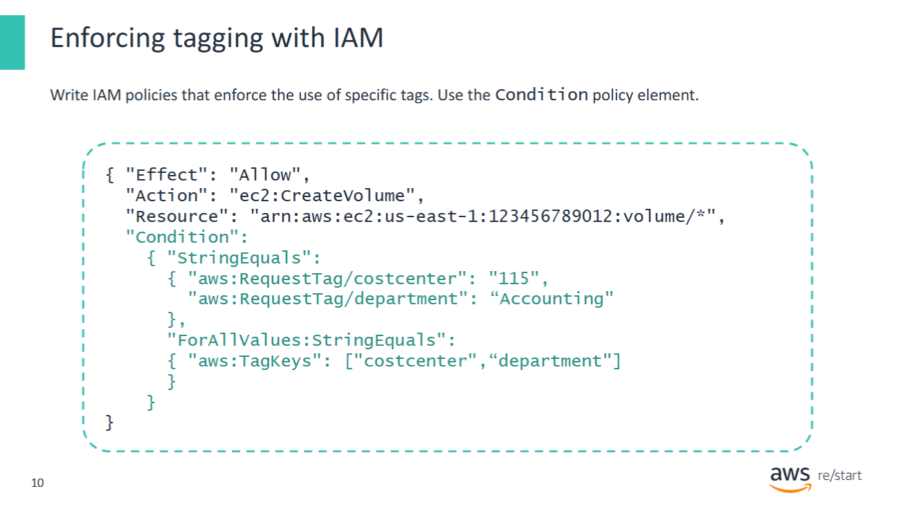
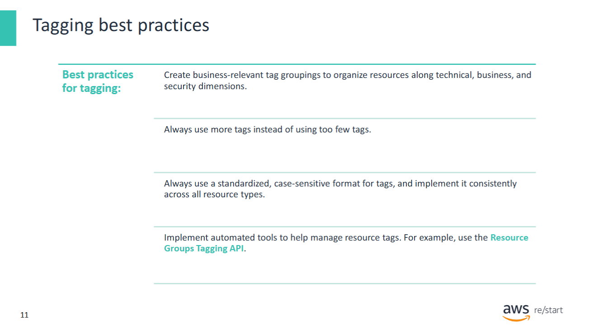
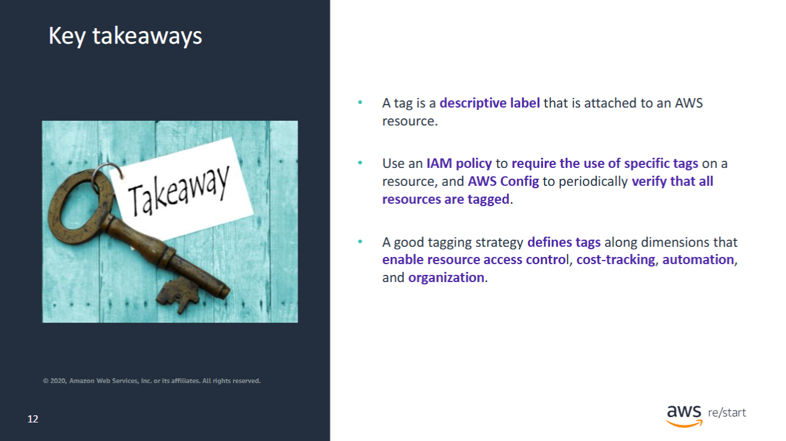

Welcome to Tagging.


In this lesson, you will learn how to **manage resource consumption** in an AWS account by using **tags**.  
You will also review examples of common tagging use cases that involve **AWS Config** and **AWS Identity and Access Management (IAM)**.

**Specifically, you will learn how to:**

- Explain the **purpose and function of tagging** in AWS  
- Describe the **cost management strategies** associated with tagging  
- **Enforce tagging** by using **IAM policies**


This video introduces what a **tag** is and what you can do with them.

It can be viewed on the **Amazon Web Services YouTube channel** at:  
**AWS Q&A with an SA: What are tags and what can I do with them?**

[Watch on YouTube: AWS Q&A with an SA – What are tags and what can I do with them?](https://www.youtube.com/results?search_query=AWS+Q%26A+with+an+SA+What+are+tags+and+what+can+I+do+with+them)

## What is a Tag



A **tag** is a label that you assign to an **AWS resource**.  
It enables you to **identify** or **categorize** the resource in a meaningful way.

A tag consists of a **key** and a **value**, both of which you define.

### Example:

If you have two **Amazon EC2 instances** in a **development environment**, you might assign:

- A tag with the key: `Name`
- Values:
  - `CommandHost` for the first instance
  - `DatabaseServer` for the second instance

These tags allow you to quickly identify each instance and its purpose—something that would be difficult using only instance IDs.

Additionally, if you created similar instances in another environment (e.g., **Test**), you could assign another tag with:

- Key: `Environment`
- Values:
  - `Development`
  - `Test`

This enables you to **categorize resources by environment**.

---

The diagram illustrates this concept:

- On the **left**, EC2 instances in two **VPCs** do **not** have tags.  
  → It's hard to determine their purpose or environment (Development or Test).

- On the **right**, EC2 instances have both a `Name` tag and an `Environment` tag.  
  → You can **clearly identify** their **purpose** and **running environment**.

## Tag characteristics



**Important Characteristics of Tags in AWS**

- You can **only assign a tag to a resource after it has been created**.

- **Tag keys and values are case-sensitive**.  
  > ✅ *Best practice:* Use a consistent and standardized format.

- You **cannot edit or delete** tag keys or values with the `aws:` prefix.  
  These tags are assigned by AWS and are **reserved for AWS use**. Examples:
  - `aws:createdBy` – Automatically generated by AWS to identify the creator of a resource (used for cost allocation).
  - `aws:cloudformation:<stack-name>` – Automatically assigned by **AWS CloudFormation** to every stack to identify its name.

- **Tags can be inherited or propagated**.  
  Services like **AWS CloudFormation** and **AWS Elastic Beanstalk** can create other resources (e.g., **Amazon RDS** or **EC2 instances**).  
  → These services often tag the created resources with a **reference to themselves**.  
  > For example: A resource created by an AWS CloudFormation stack will **automatically inherit** the stack’s `aws:cloudformation:<stack-name>` tag.

- You can create up to **50 tags per resource**.  
  > 🔸 Tags with the `aws:` prefix **do not** count toward this limit.

### Examples of common tags



**Tags should represent organizationally relevant dimensions.**

Meaningful tags support the ability to:

- Manage **resource inventory**
- Control **access**
- Track **costs**
- Enable **automation**
- Improve **organization**

> ✅ This slide lists examples of meaningful tags that align with these goals.

## AWS Config and tagging



**AWS Config** provides **AWS managed rules**, which are predefined, customizable rules used to evaluate whether your AWS resources comply with common best practices.

You can **customize** the behavior of a managed rule to suit your needs.

#### Example: `required-tags` Managed Rule

- Use this rule to quickly assess whether a **specific tag** is applied to your resources.
- You can specify the **key** of the required tag and, optionally, its **value**.
- Once the rule is **activated**, AWS Config:
  - Compares your resources to the defined conditions
  - Reports any **non-compliant resources**

#### Rule Evaluation Timing

- Evaluation occurs **when a resource changes**, or
- On a **periodic basis**

---

📘 **For more information**, refer to the  
[required-tags page in the AWS Config Developer Guide](https://docs.aws.amazon.com/config/latest/developerguide/required-tags.html)

## Tagging in AWS CLI



The examples show how to use the **AWS Command Line Interface (AWS CLI)** to:

1. **Create a tag**
2. **Query resources using a tag**

---

### Example 1: Creating a Tag

This command creates a tag named `SecurityCheck` on an EC2 instance with the ID `i-1234567890abcdef0`.  
The tag's value is set to the **current timestamp**.

**Command:**

```bash
aws ec2 create-tags \
  --resources i-1234567890abcdef0 \
  --tags Key=SecurityCheck,Value="$(date -u +%Y-%m-%dT%H:%M:%SZ)"
```

- The `--tags` option specifies the **key** and **value** of the tag.
- You can use this method to tag:
  - **EC2 instances**
  - **Amazon EBS volumes**
- Tags can also be specified as part of the **API call that creates instances and volumes**.
  > If a call creates both instances and volumes, you can assign **distinct tags** to each.

---

### Example 2: Querying Resources by Tag

This command lists the **instance IDs** and **tag values** of all EC2 instances in the current Region  
that have a tag with the key `SecurityCheck`.

**Command:**

```bash
aws ec2 describe-instances \
  --filters "Name=tag:SecurityCheck,Values=*" \
  --query "Reservations[*].Instances[*].[InstanceId, Tags[?Key=='SecurityCheck'].Value | [0]]" \
  --output table
```

- The `--filters` option filters the instances based on the **tag key**.
- The `--query` option controls the **output structure** (Instance ID and tag value).

---

✅ This is a powerful way to **organize, track, and audit** your AWS resources using tags via CLI.

## Common use cases


Two common use cases for tagging include:

1. Using a tag to **shut down and restart** all instances that have a specific tag
2. The **"tag or terminate"** compliance check

---

### Use Case 1: Scheduled Shutdowns

In this scenario, all instances are tagged with an attribute that indicates their environment, such as:

- Development
- Test
- Production

To **save costs**, you can create a script that automatically:

- Shuts down `Development` instances on **weekends**
- Restarts them at the **beginning of the week**

---

### Use Case 2: Tag or Terminate Strategy

This strategy is illustrated in pseudocode. A company or division defines policies that require certain **tags** on running resources.  
A script regularly checks all instances in an AWS account to ensure that the **required tags exist**.

If an instance **does not** have the required tags, it is considered **non-compliant** and may be terminated.

In practice, companies usually roll out this strategy in **phases**:

- **Phase 1:**  
  - Non-compliant machines are **not immediately shut down**.
  - The script sends an **email** to the **IAM user** who created the instance.
  - The message warns the user that the instance may soon be shut down due to **non-compliance**.

- **Phase 2:**  
  - Non-compliant instances are actually **shut down**.
  - An **explanation** of the shutdown is sent to the IAM user.

---

Once instances are **properly tagged** to describe their role and function:

- Companies can implement **automated cost-saving processes**
- Tags help **organize billing reports** to reflect internal cost structures
- Tagging supports **accurate cost allocation reporting**

---

📘 **For more information** about the Conformity Monkey compliance check, refer to the Netflix blog post:  
*Conformity Monkey – Keeping your cloud instances following best practices*

## Enforcing tagging with IAM



You can also write **IAM policies** that enforce the use of specific **tags**.

For example, when you create a resource, you can enforce the use of the `department` and `costcenter` tags to support more **accurate cost allocation reporting**.

---

### Other tag-related scenarios you can enforce with IAM policies:

- **Blocking the deletion** of tags required by corporate standards
- **Disallowing the creation** of new tags for specific existing resources
- **Requiring encryption** for any **EBS volume** created with a specific tag value

---

These tagging requirements are expressed in an IAM policy through the `Condition` policy element.

### Example Scenario:

When a request is made to **create an EBS volume**, the IAM policy enforces the following:

- The request **must include** a `costcenter` and `department` tag, and **only those tags**  
  → This is enforced using the `ForAllValues` modifier.

- The values for these tags **must be**:
  - `costcenter` = `115`
  - `department` = `Accounting`  
  → This is expressed using the keys `aws:RequestTag/costcenter` and `aws:RequestTag/department`

---

🧾 **Effect of this IAM policy:**

All newly created EBS volumes **must** have:

- A `costcenter` tag with the value `115`
- A `department` tag with the value `Accounting`

---

📘 **For more information** on tagging EC2 instances and EBS volumes at creation time, refer to the AWS News Blog post:  
*New – Tag EC2 Instances & EBS Volumes on Creation*

## Tagging best practices



This slide lists some **best practices** for building a useful and effective **tagging strategy**.

---

### Best Practice: Use Automated Tools to Manage Tags

Use tools such as the **Resource Groups Tagging API**, which enables **programmatic control** of tags.

This approach helps you to **automatically manage, search, and filter** tags and resources.

---

### Example tasks with the Tagging API:

- **Tag and untag** supported resources  
- **Use tag-based filters** to search for resources  
- **List all existing tag keys**  
- **List all existing values** for specified keys

---

📘 **For more information:**

- *Tagging Best Practices* AWS whitepaper  
- *Resource Groups Tagging API Reference documentation*

## Key takeaways



**Key Takeaways from this Lesson**

- A **tag** is a descriptive label that is attached to an **AWS resource**.

- Use an **IAM policy** to mandate the use of specific tags on a resource,  
  and use **AWS Config** to periodically verify that all resources are properly tagged.

- A good **tagging strategy** defines tags along dimensions that enable:
  - **Resource access control**
  - **Cost tracking**
  - **Automation**
  - **Organization**
