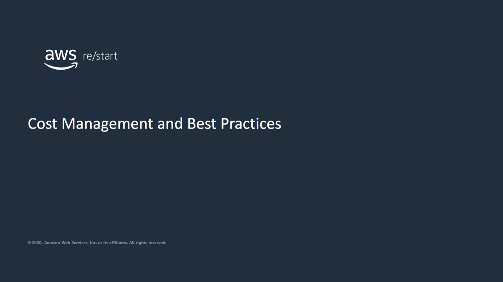

Welcome to Cost Management and Best Practices.

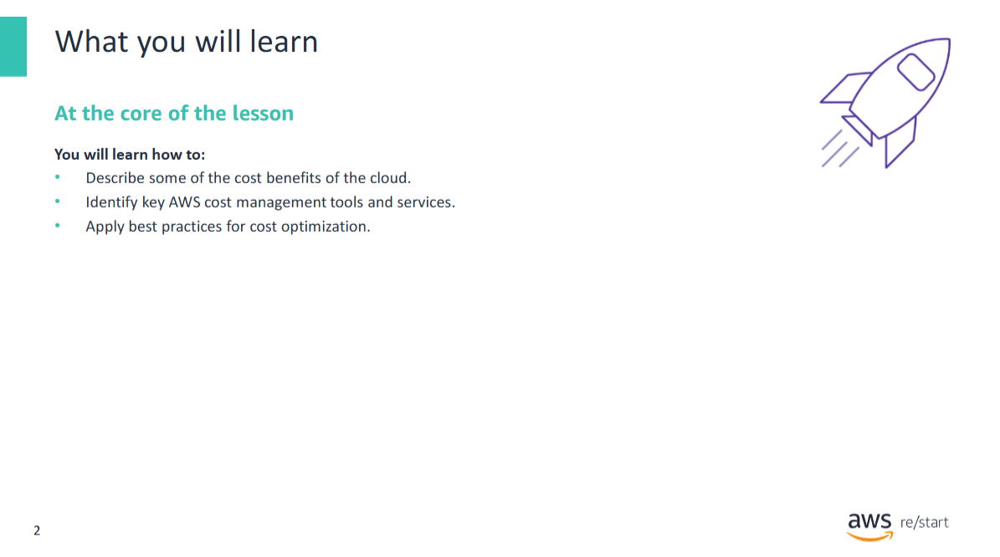

In this module, you will learn **strategies**, **tools**, and **best practices** for reducing cost in the AWS Cloud.

**Specifically, you will learn how to:**

- Describe some of the **cost benefits** of the cloud  
- Identify key **AWS cost management tools and services**  
- Apply **best practices for cost optimization**

## Cost benefits of the cloud and opportunities for cost reduction

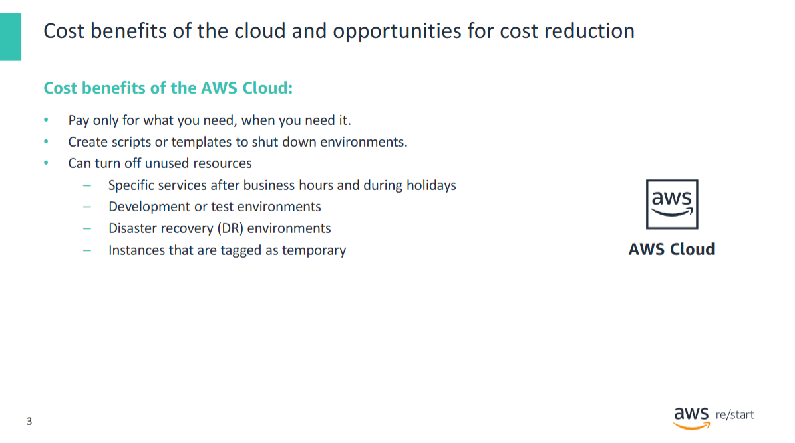

One of the fundamental benefits of **cloud computing** is that you **pay only for what you need, when you need it**.  
Because of this principle, you can find ways to **use cloud resources efficiently** and **reduce cost**.

You can apply various strategies to achieve this goal, including:

- Creating **scripts or templates** that can easily start up and shut down entire environments
- **Turning off unused resources**, for example:
  - **Development** or **test environments** can be shut down at project termination
  - Specific services can be shut down **after business hours** and **during holidays**
  - **Disaster recovery (DR)** environments can remain **inactive** until needed
  - **Temporary instances** (tagged accordingly) can be turned off after a **specified time period**

## AWS cost management tools and services

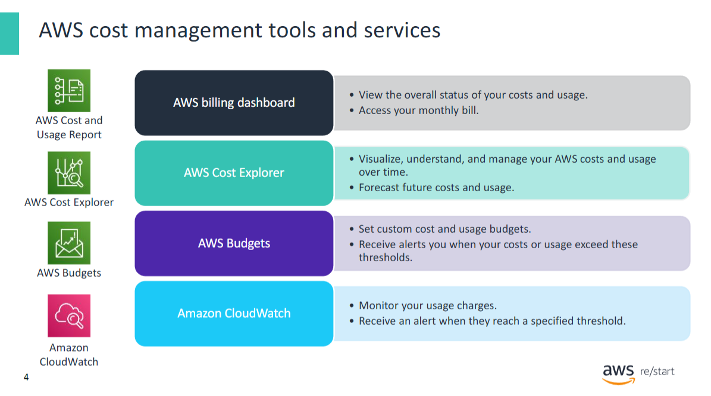

You can also use **AWS cost management tools and services** to help you **access**, **organize**, **understand**, **control**, and **optimize** your AWS costs and usage.

For example:

- You can access the overall status of your AWS costs and usage in the **AWS Billing Dashboard**.  
  - The **Bills** page shows the most up-to-date information about your monthly bill and a detailed breakdown of the AWS services you use.  
  - The **Cost and Usage Reports** page allows you to generate reports with the **most granular data**, helping you analyze and understand specific product usage and associated costs.

- You can dive deeper into your data with **AWS Cost Explorer** to:  
  - Identify **trends**  
  - Pinpoint **cost drivers**  
  - Detect **anomalies**  
  - It provides an intuitive interface to create **custom reports** (charts and tables) for both high-level and detailed analysis.

- You can set **custom cost targets and usage budgets** with **AWS Budgets**.  
  - This service alerts you when your defined thresholds are exceeded.

- You can monitor your **usage charges** using **Amazon CloudWatch**.  
  - Create **alarms** to notify you when usage charges exceed a specified threshold.

---

📘 You will learn more about these tools and services in the **next slides**.

## AWS billing dashboard

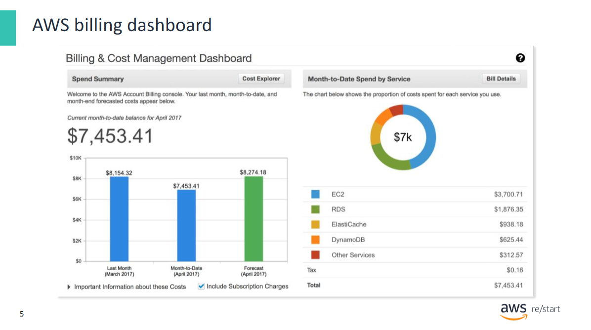

The **AWS Billing Dashboard** enables you to view the **status of your month-to-date AWS expenditure**.  
You can also use it to:

- Identify the **services** that account for the **majority of your overall expenditure**
- Get a **high-level understanding** of how your **costs are trending**

---

### Key Graphs in the Billing Dashboard:

- **Spend Summary**  
  - Shows how much you spent **last month**
  - Displays your **month-to-date usage cost**
  - Provides a **forecast** of your likely total spending for the current month

- **Month-to-Date Spend by Service**  
  - Shows the **top services** you use the most
  - Indicates the **proportion of your costs** attributed to each service

---

You can also access several **other cost management tools** directly from the billing dashboard, including:

- **AWS Bills**
- **AWS Cost Explorer**
- **AWS Budgets**
- **AWS Cost and Usage Reports**

These tools help you **estimate**, **monitor**, and **plan** your AWS costs effectively.

## AWS Bills

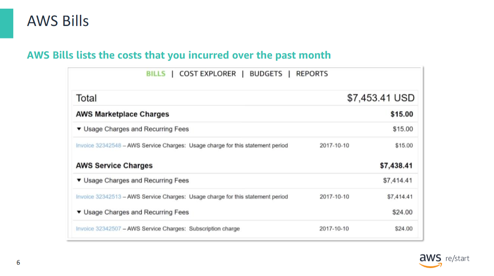

The **AWS Bills** page lists the **costs incurred over the past month** for each AWS service.  
It also provides a **detailed breakdown** by:

- **AWS Region**
- **Linked account**

This tool gives you access to the **most up-to-date information** about your:

- **Monthly bill**
- **Usage details**
- **Service-level cost breakdown**

It is a key resource for tracking and understanding your AWS expenses.

## AWS Cost Explorer

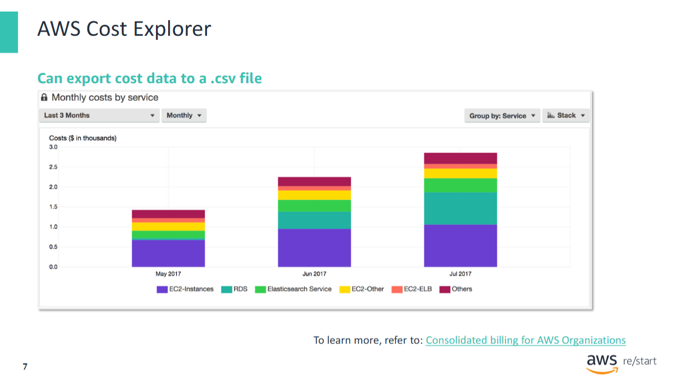

**AWS Cost Explorer** enables you to **view and analyze** your **costs and usage** to identify **trends**.

You can **filter** and **group** data along various dimensions, such as:

- **Service**
- **Instance type**
- **Tag**

---

### Cost Explorer provides two types of default reports:

- **Cost and Usage Reports**  
  - Help you understand your costs and usage across **all services**  
  - Example: **Monthly costs by service** (last 3 months), showing:
    - Top 5 services individually
    - Remaining services grouped as **"Others"**

- **Reserved Instance (RI) Reports**  
  - Specific to **Reserved Instance usage**
  - Help compare costs between **Reserved Instances** and **On-Demand Instances**

---

### Additional Features

- View data for up to the **last 13 months**
- **Forecast** costs for the **next 3 months**
- Get **recommendations** for purchasing Reserved Instances

---

If you use **consolidated billing** with **AWS Organizations**, you can:

- View costs **across all linked accounts**
- Monitor individual **daily** and **monthly** spend for each linked account

## AWS Budgets

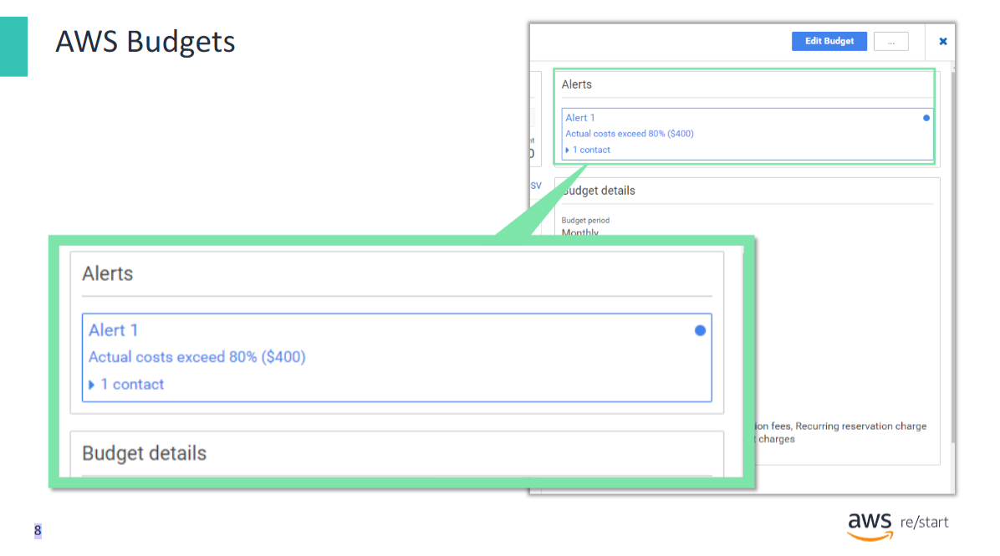

**AWS Budgets** enables you to set **custom budgets** that alert you when **costs or usage** exceed  
(or are forecasted to exceed) your defined **budgeted amount**.

---

### Key Features of AWS Budgets:

- Uses **Cost Explorer** visualization to:
  - Show the **status of your budgets**
  - Provide **forecasts** of estimated costs

- Allows you to:
  - Create **notifications** when:
    - Actual costs exceed your budget
    - Estimated costs are forecasted to exceed your budget

- **Budget tracking options:**
  - Monthly
  - Quarterly
  - Yearly
  - You can also **customize the start and end dates**

- **Budget alerts** can be sent via:
  - **Email**
  - **Amazon Simple Notification Service (SNS)** topic

---

### Example Scenario

An **alert notification** was generated by AWS Budgets because **actual costs exceeded 80%** of the defined budget.  
As a result, **one person was notified** based on the configured alert settings.

## AWS Cost and Usage Reports 

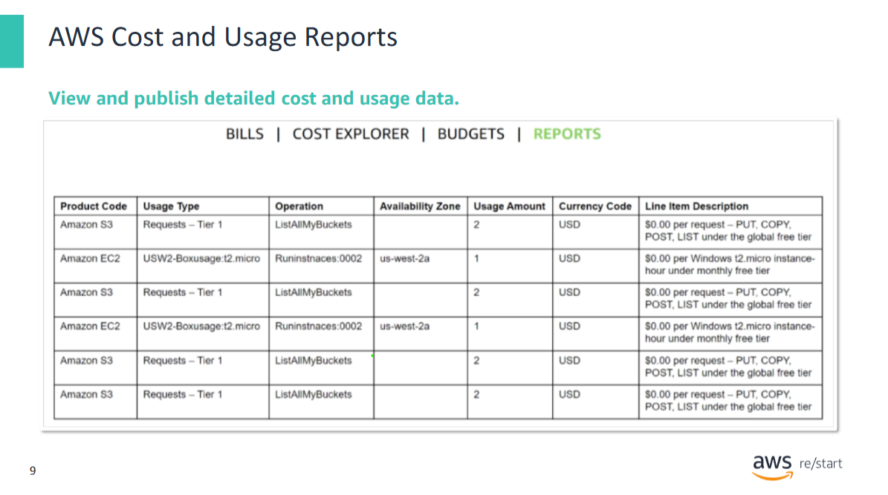

The **AWS Cost and Usage Reports** page is a central location for accessing **comprehensive information** about your AWS **costs and usage**.

---

### Key Features:

- Generate **detailed reports** with **line items** for each unique combination of:
  - AWS **product**
  - **Usage type**
  - **Operation**

- Customize reports to **aggregate data**:
  - **Hourly**
  - **Daily**

- **Publish reports** to an **Amazon S3 bucket**:
  - AWS automatically **updates** the reports in your bucket **once per day**

---

This tool is ideal for organizations that need **granular billing data** for in-depth analysis, cost tracking, or integration with external analytics systems.

## Amazon CloudWatch billing alarms

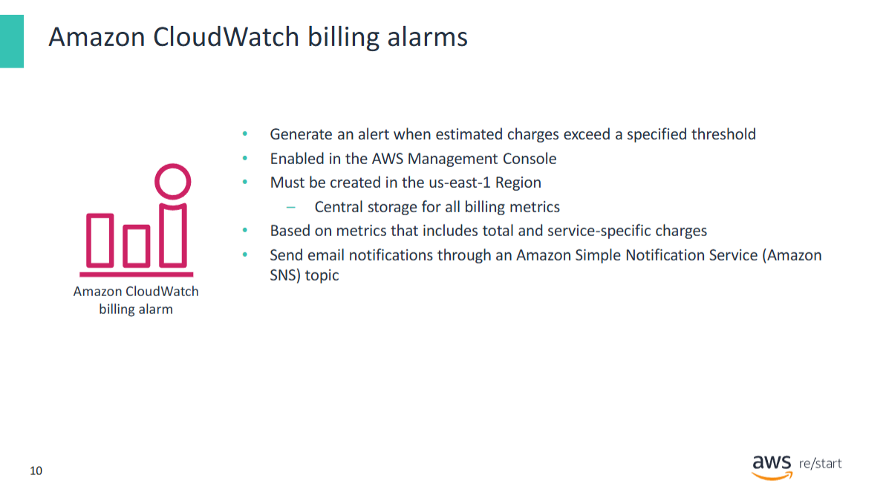

You can monitor your **estimated AWS charges** by using **Amazon CloudWatch** to generate an **alert**  
when your charges exceed a specified **threshold**.

---

### How it works:

- When **billing monitoring** is enabled:
  - **Estimated charges** are calculated and sent **several times daily** to CloudWatch as **metric data**
  - This data is stored in the **US East (N. Virginia)** Region and represents **worldwide charges**
  - It includes:
    - Estimated charges **per AWS service**
    - The **overall total** estimated charges

- You can create a **CloudWatch alarm** that triggers when your **actual billing** exceeds a defined threshold  
  > ⚠️ The alarm does **not** use projected values — only **actual billing data**

---

### Alarm Behavior:

- If your charges have **already exceeded** the threshold at the time of creation,  
  the alarm immediately enters the **ALARM** state

- **Notifications** are sent via **Amazon SNS** to a configured **email address**

## Designing for cost reduction

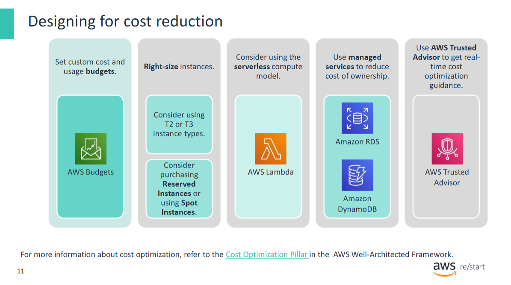

With the aid of **cost management tools**, you can devise a **cost-reduction strategy** for your AWS services.

A good strategy includes the following **cost-optimization principles**:

- **Set custom cost and usage budgets**  
  → Helps you follow the cloud computing principle: *"Pay only for what you need, when you need it"*

- **Right-size instances**  
  - Use **T2 or T3 instances** for workloads that occasionally need to burst to full performance  
    → These instance types provide a **baseline CPU performance** with the ability to **burst when needed**  
    → **T3 instances** use the latest **Intel Xeon Scalable processors** and offer up to **30% better price/performance** than T2

  - Consider purchasing **Reserved Instances** for groups of **long-running instances**

  - Use **Spot Instances** for **batch-processing jobs** and to optimize pricing  
    → Analyze **Spot Instance history reports** to fine-tune bid strategies

- **Use AWS Lambda**  
  → The **serverless model** lets you run code **without managing servers**  
  → You **pay only for compute time used** and incur **no charges** when your code is idle

- **Use managed services**  
  → Services like **Amazon S3** and **Amazon RDS** reduce operational overhead and allow you to operate at **cloud scale**  
  → They also offer a **lower cost per transaction or service**

- **Use AWS Trusted Advisor**  
  → Get **specific, actionable recommendations** to help **reduce cost**

## Finding and eliminating waste

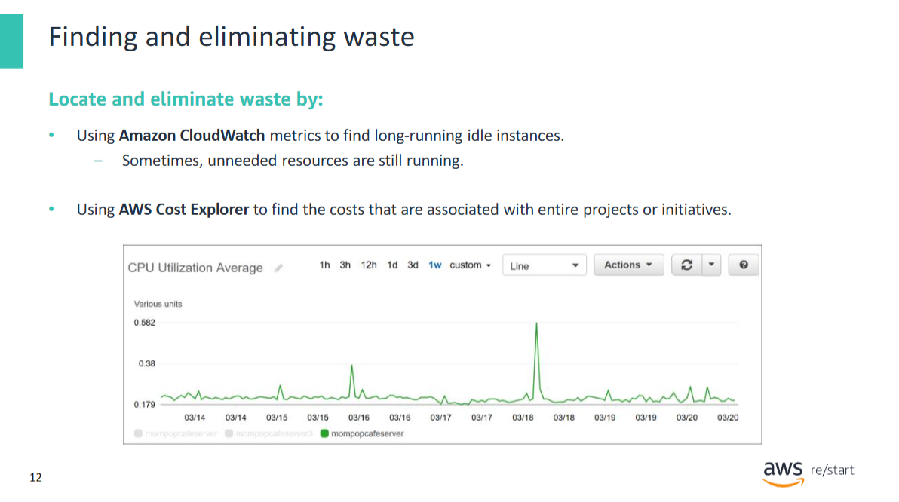

Another effective **cost-reduction technique** is to **find and eliminate waste**.

For example, the ease of provisioning resources can sometimes lead to situations where **unneeded resources remain running**.

---

### Tools and Techniques to Identify Waste:

- Use **Amazon CloudWatch metrics and alarms** to:
  - Detect **long-running idle instances**
  - **Shut them down** automatically or with review

- A **CloudWatch utilization graph** (as shown in the example) can help identify:
  - Instances that are **idle**
  - Instances that are **rarely used**

- Use **AWS Cost Explorer** to:
  - Find costs associated with **entire projects or initiatives**
  - Identify the **most costly projects**
  - **Prioritize** which projects to examine first for **cost-reduction opportunities**

## Using a stopinator script

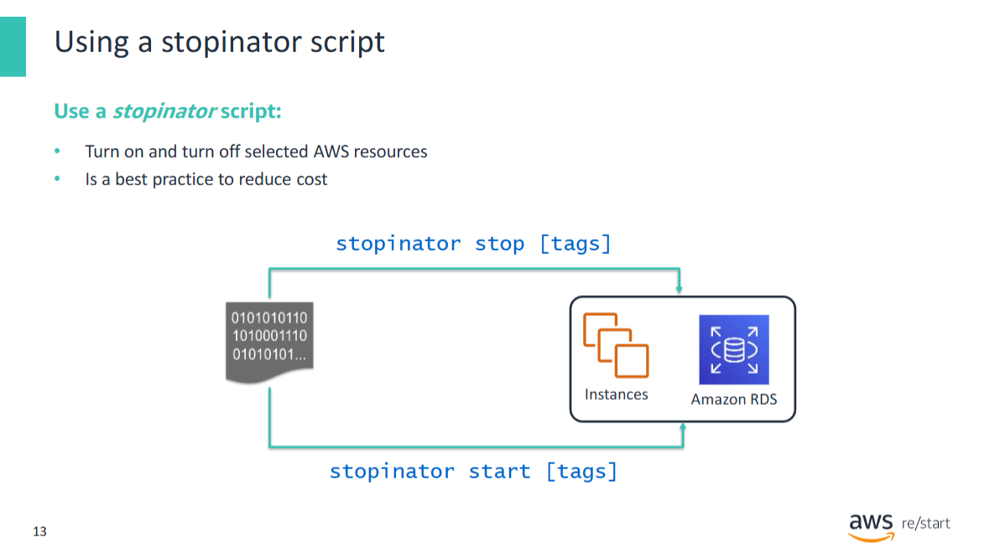

**Writing and using a Stopinator script** is a technique for **automating the shutdown of instances**.

A **Stopinator** is a generic term for any **script or application** written to interact with the **AWS Cloud**,  
designed to **identify and stop unused instances**.

---

### Key Characteristics:

- Typically runs **in the evenings and on weekends**
- Helps to **automatically stop** instances that are not in use
- Can lead to **significant cost savings** for an organization
- **Frees up budget** for other cloud projects

---

### Dual Functionality:

A Stopinator is often also designed to **start resources when needed**,  
for example at the **beginning of the workday** — making it a **useful automation utility**.

## Serverless stopinator

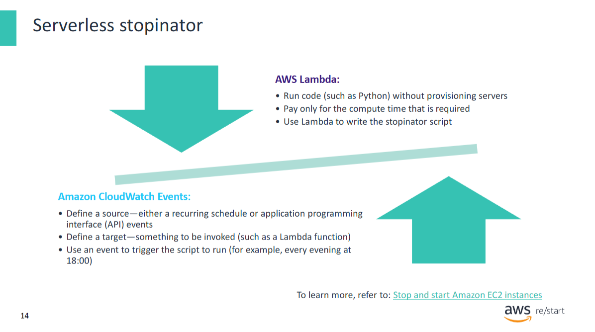

You do **not** need to create or use an **Amazon EC2 instance** to run a Stopinator.

A **simple and efficient design** is to use a **serverless solution** that combines:

- An **AWS Lambda function**  
- An **Amazon CloudWatch Events** (now known as EventBridge) **event**

---

### How it works:

- The **logic** to **stop and start instances** is implemented in a **Lambda function**
- The function is triggered by a **CloudWatch Events rule** based on a **defined schedule**

This approach is lightweight, cost-efficient, and easy to manage.

---

📘 For a complete example of a **serverless Stopinator**, refer to the **resource provided in the presentation**.

## What is AWS Trusted Advisor?

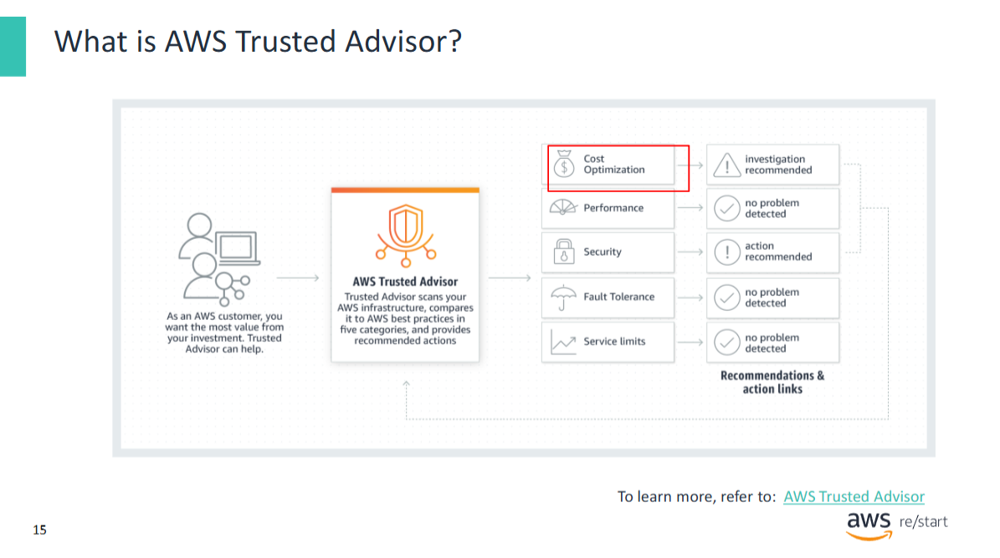

**AWS Trusted Advisor** is an online resource that helps you:

- **Reduce cost**
- **Increase performance**
- **Improve security**

It works by **analyzing your AWS environment** and providing **recommendations** for best practices in five key categories:

---

### Cost Optimization
- Advice on **saving money** by:
  - Eliminating **unused or idle resources**
  - Making **commitments to reserved capacity**

### Performance
- Tips to **improve service performance** by:
  - Checking **service limits**
  - Ensuring use of **provisioned throughput**
  - Monitoring for **overutilized instances**

### Security
- Guidance to **improve application security** by:
  - **Closing security gaps**
  - Enabling **AWS security features**
  - Reviewing **IAM permissions**

### Fault Tolerance
- Help to **increase availability and redundancy** by using:
  - **Auto Scaling**
  - **Health checks**
  - **Multi-AZ deployments**
  - **Backup capabilities**

### Service Limits
- Alerts when service usage **exceeds 80%** of the defined **service limits**

## AWS Trusted Advisor cost optimization features 

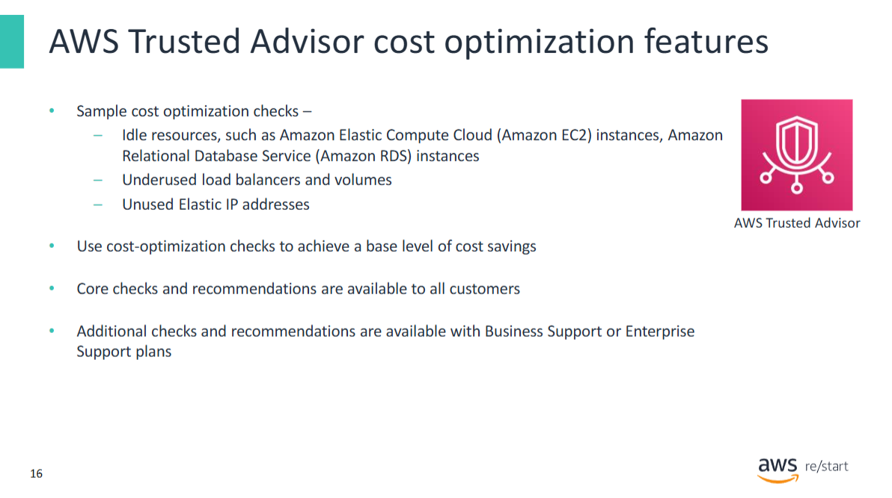

You can use **AWS Trusted Advisor** to identify **idle resources**, such as:

- **EC2 instances**
- **Underused load balancers and volumes**
- **Unused Elastic IP addresses**

---

Trusted Advisor is also a powerful tool for **cost optimization**.  
It provides **checks and recommendations** that help you identify **cost-saving opportunities**.

---

### Support Plans

To unlock additional checks and recommendations, AWS Trusted Advisor is available through:

- **Business Support**
- **Enterprise Support**

## AWS Trusted Advisor recommendations 

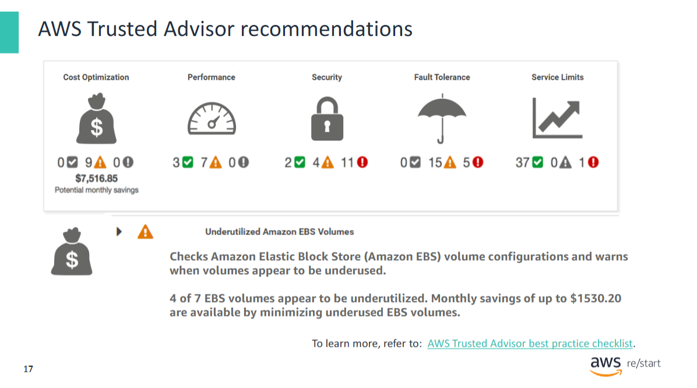

**AWS Trusted Advisor** analyzes your AWS environment and provides **recommendations for best practices**.

- Recommendations include **direct links** to take action
- Offers **real-time guidance** to help you **provision resources** according to **AWS best practices**

## Key takeaways

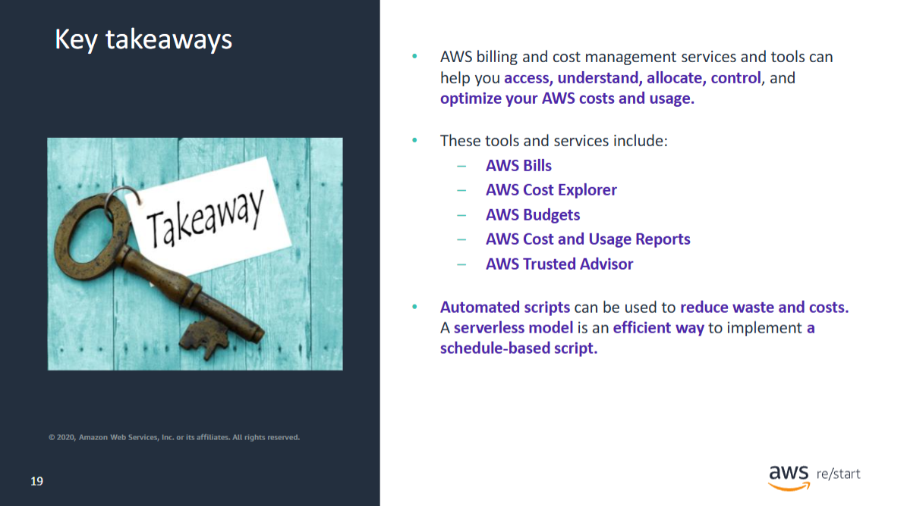

**Key Takeaways from this Lesson**

- **AWS billing and cost management services and tools** help you:
  - **Access**
  - **Understand**
  - **Allocate**
  - **Control**
  - **Optimize** your AWS costs and usage

---

#### These tools and services include:

- **AWS Bills**
- **AWS Cost Explorer**
- **AWS Budgets**
- **AWS Cost and Usage Reports**
- **AWS Trusted Advisor**

---

- **Automated scripts** can be used to **reduce waste and costs**  
  → A **serverless model** (e.g., using AWS Lambda and CloudWatch Events) is an **efficient way** to implement **schedule-based scripts**
