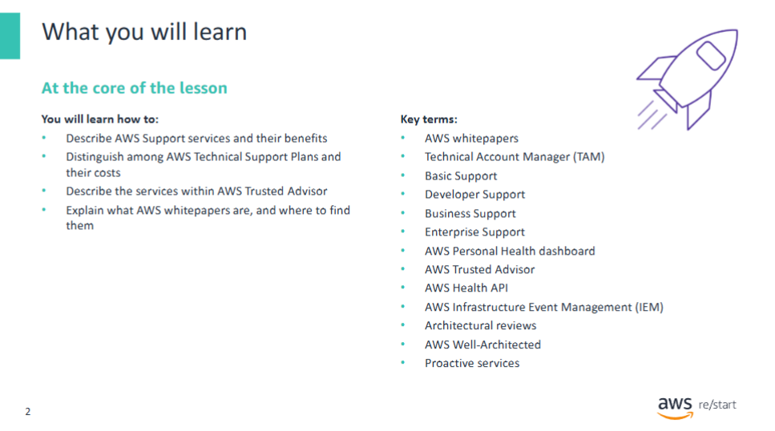

This presentation covers **AWS Technical Support Plans**  
and how to find **AWS whitepapers** about services, features, and resources.

---

#### You will learn how to:

- **Describe** AWS support services and their **benefits**
- **Distinguish** among AWS Technical Support Plans and their **costs**
- **Recognize** the services within **AWS Trusted Advisor**
- **Identify** available **AWS documentation and whitepapers** for support

---

## AWS Support Services

**Support** is an essential part of any system.  
Outages can lead to:

- **Loss of productivity**
- **High overhead costs**
- **Lost customers**

In such cases, support that provides **deep technical insight** into AWS services can be invaluable.

To prevent these issues and ensure access to expert resources, you must understand your available support options.

This section covers:

- **AWS Support**
- **AWS Support Plans**

---

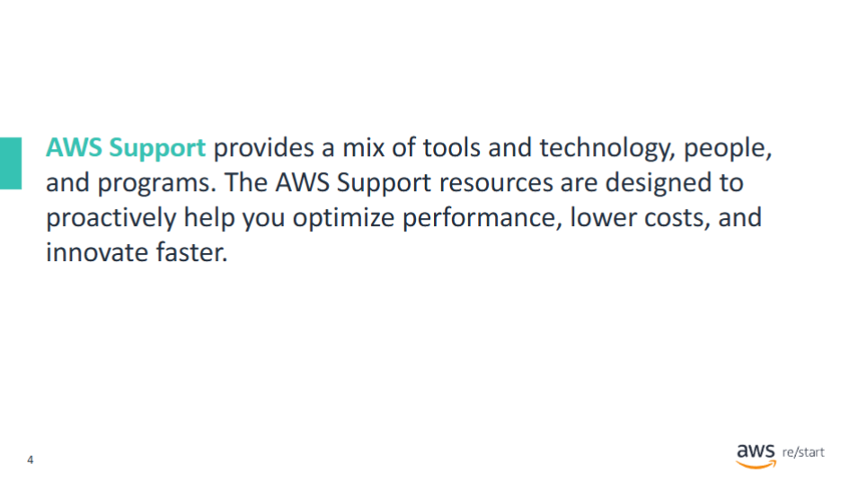  
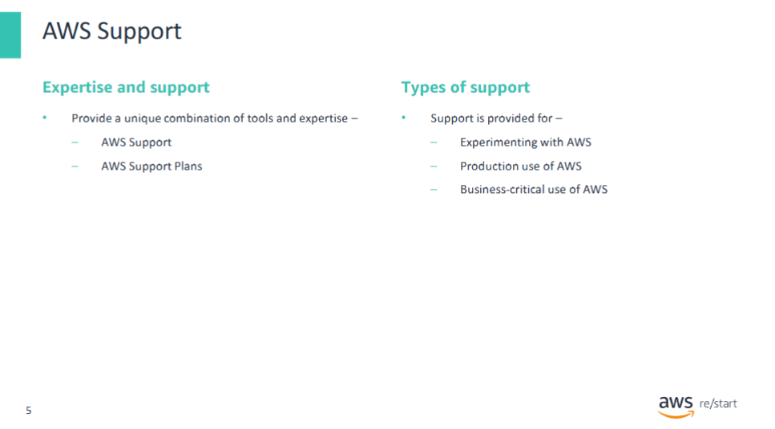

**AWS Support** offers a combination of **tools and expertise** to support customers at all stages—  
from initial adoption to mission-critical workloads.

It is designed to provide:

- **Complete support**
- **Proactive guidance**
- Tailored assistance based on **current and future use cases**

AWS Support is available for:

- Customers **experimenting** with AWS
- Customers preparing for **production workloads**
- Customers using AWS as a **business-critical platform**

Support can be tailored to meet the customer's **needs and goals**.

---

## AWS Support Plans

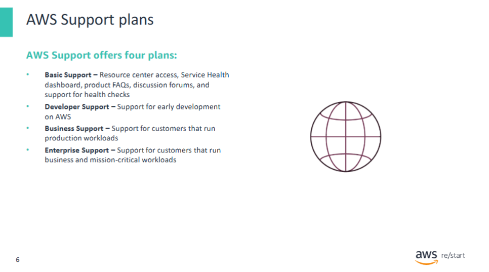

AWS offers four distinct **Support Plans**:

- **Basic Support**  
  Includes access to documentation, whitepapers, forums, and health checks.

- **Developer Support**  
  Intended for early-stage development and testing.

- **Business Support**  
  Designed for production environments.

- **Enterprise Support**  
  Tailored for mission-critical use cases requiring extensive support.

---

## Benefits of AWS Support Services

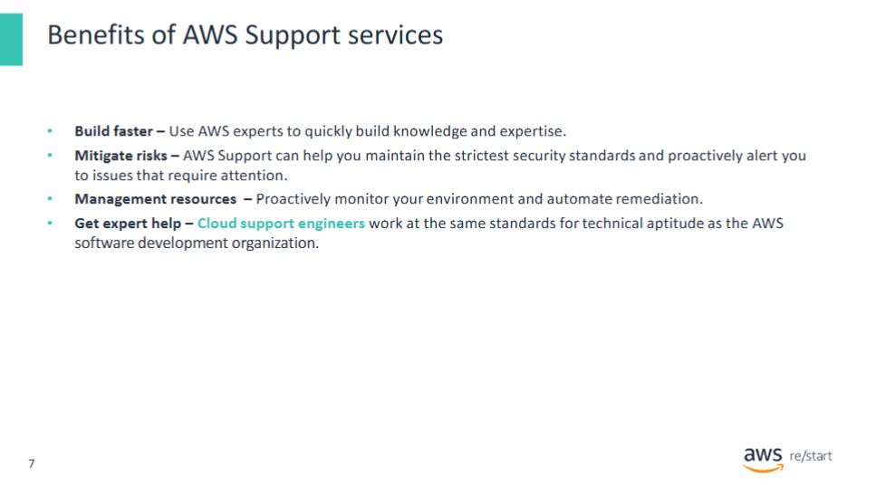

Using AWS Support helps you:

- **Build faster** – Leverage AWS expertise to gain skills quickly
- **Mitigate risks** – Maintain high security standards with proactive alerts
- **Manage resources** – Monitor environments and automate issue remediation
- **Get expert help** – Support engineers meet AWS-level technical standards

---

## How AWS Support Works

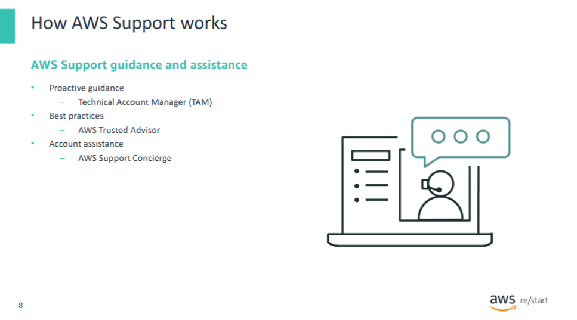

With AWS, customers can **plan**, **deploy**, and **optimize** confidently.

Key roles in AWS Support:

- **TAM (Technical Account Manager)** – Provides personalized guidance and ongoing communication
- **AWS Trusted Advisor** – Delivers recommendations for performance, cost, and security improvements
- **Support Concierge** – Handles billing and account inquiries efficiently

---

## AWS Support: Technology and Programs

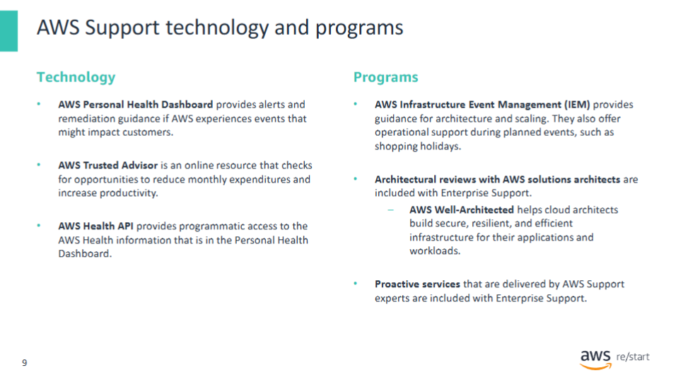

**Technology resources** available:

- **AWS Personal Health Dashboard** – Alerts and remediation guidance for AWS events
- **AWS Trusted Advisor** – Recommendations to optimize cost, security, and performance
- **AWS Health API** – Programmatic access to health events affecting your resources

**Support programs** include:

- **AWS Infrastructure Event Management (IEM)** – Assistance during major launches or planned events
- **Architectural reviews** – With AWS Solutions Architects (Enterprise Support)
- **AWS Well-Architected Tool** – Free tool for evaluating infrastructure regularly
- **Proactive services** – Delivered by AWS experts (Enterprise Support)

---

## The Role of AWS Support

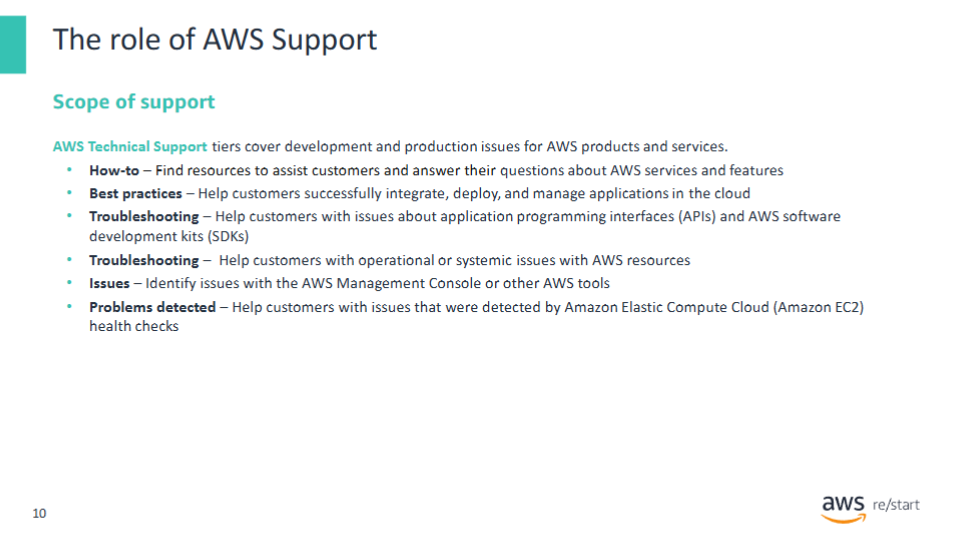

AWS Technical Support covers development and production issues across services.

Typical activities:

- **How-to assistance** – Guidance on using AWS features
- **Best practices** – Support for integration and cloud-native design
- **Troubleshooting** – Help with APIs, SDKs, and AWS tools
- **Issue resolution** – Including problems detected via EC2 health checks

---

## AWS Support Plans: Pricing and Services

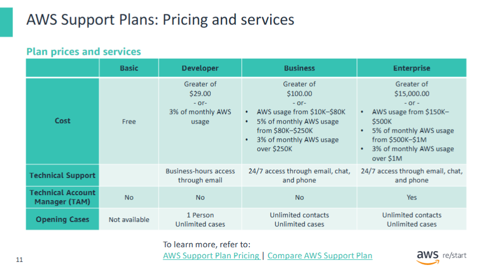  
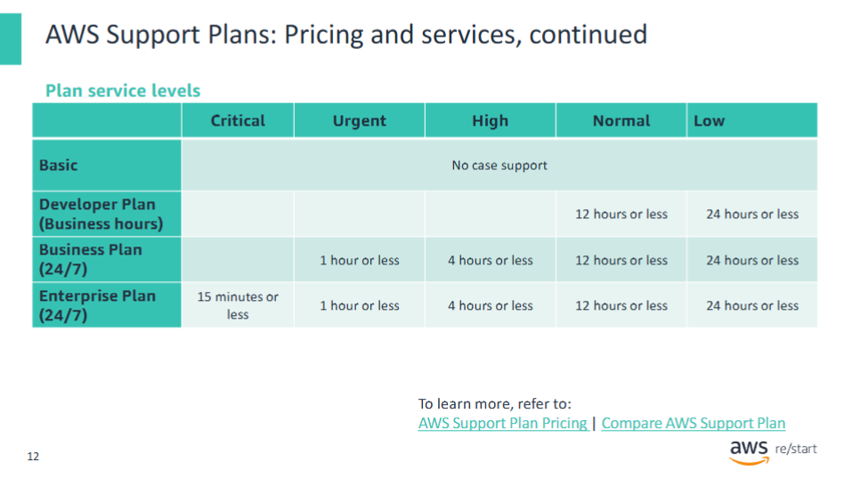

Understanding both **costs** and **service levels** is key when selecting a support plan.

AWS Support uses five **case severity levels**:

- **Critical** – Business at risk; critical functions unavailable
- **Urgent** – Significant impact; key functions unavailable
- **High** – Functionality degraded
- **Normal** – Non-critical abnormal behavior or dev-related question
- **Low** – General question or feature request

⚠️ The **Basic Support Plan** does **not** include case support.

---

## AWS Trusted Advisor

  

**AWS Trusted Advisor** helps optimize your AWS environment by offering:

- **Cost-saving recommendations**
- **Security checks**
- **Performance insights**
- **Fault-tolerance reviews**

Examples:

- Identify unused resources still incurring charges
- Detect open security groups or single-zone deployments

Two options available:

- **Core checks** – Available to all accounts
- **Full Trusted Advisor** – Included with Business and Enterprise Support

---

## AWS Whitepapers and Documentation

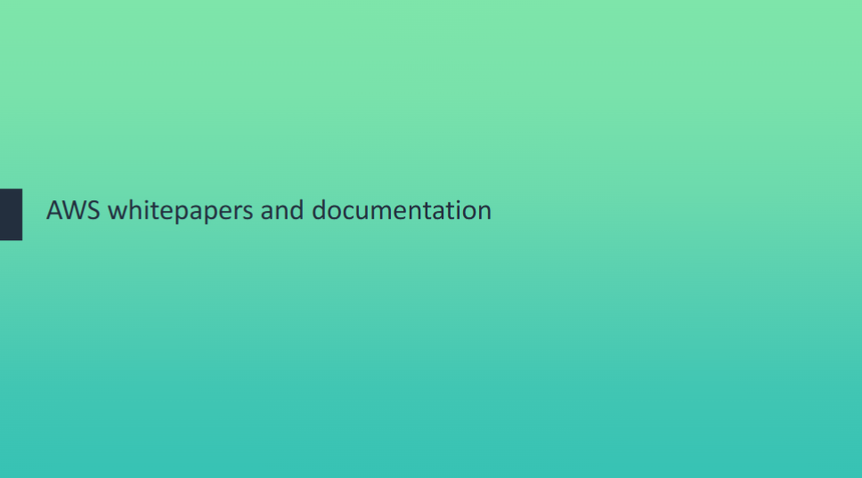  
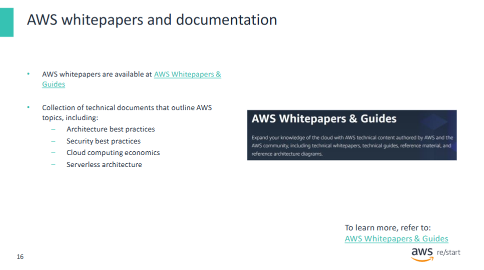

**AWS whitepapers** are technical documents covering a wide range of cloud topics, such as:

- **Architectural best practices**
- **Security guidance**
- **Cloud economics**
- **Serverless design**

These documents are ideal for deepening your understanding of AWS services and concepts.

---

## Key Takeaways

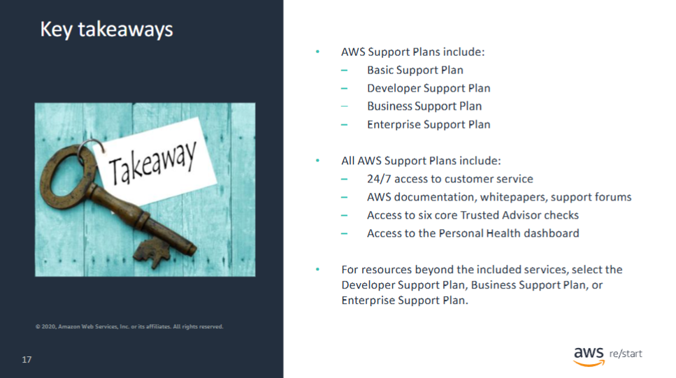

AWS offers multiple support plans:

- **Basic**
- **Developer**
- **Business**
- **Enterprise**

All plans include:

- 24/7 access to **customer service**
- Access to **documentation**, **whitepapers**, and **forums**
- **Six core Trusted Advisor checks**
- **Personal Health Dashboard**

For additional technical support, customers should consider:

- **Developer**, **Business**, or **Enterprise Support Plans**
