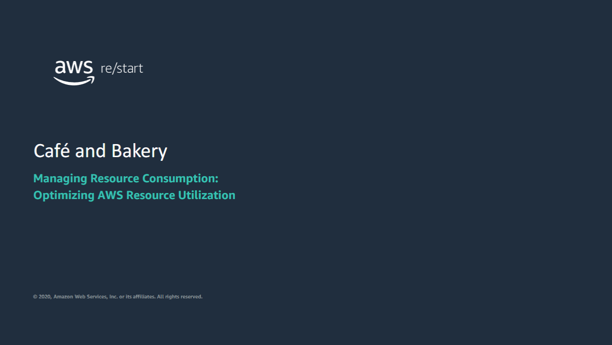
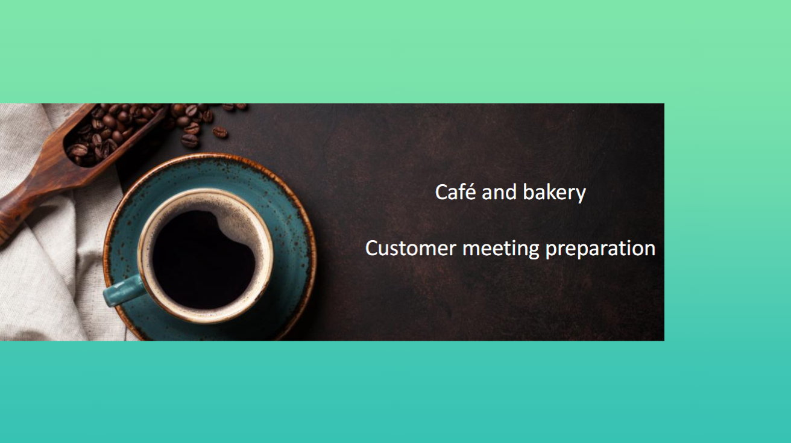
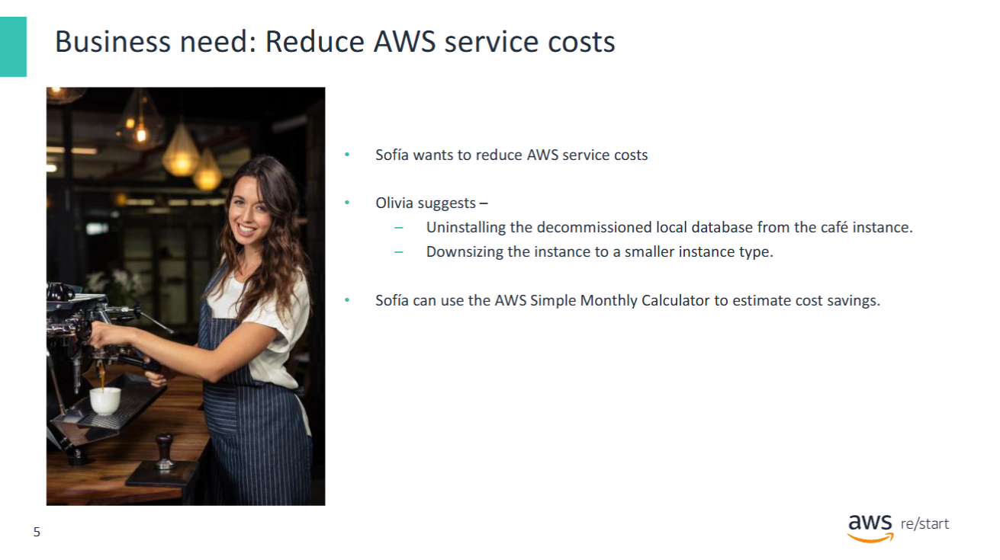
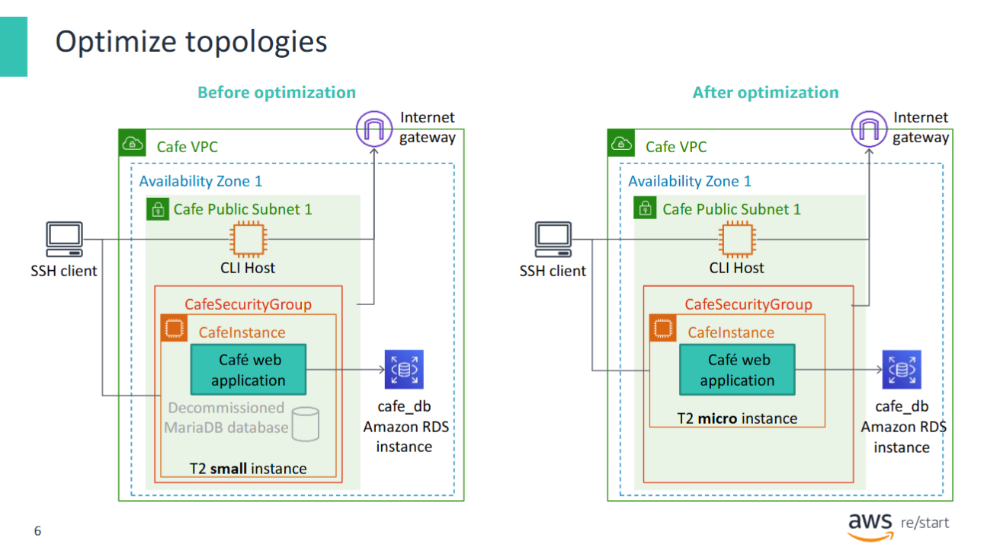
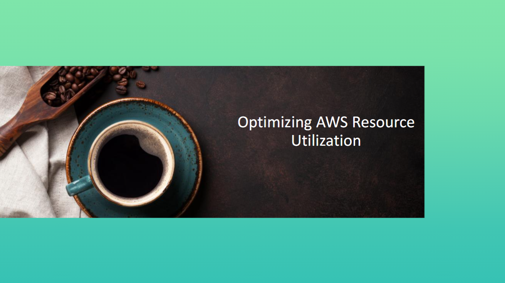
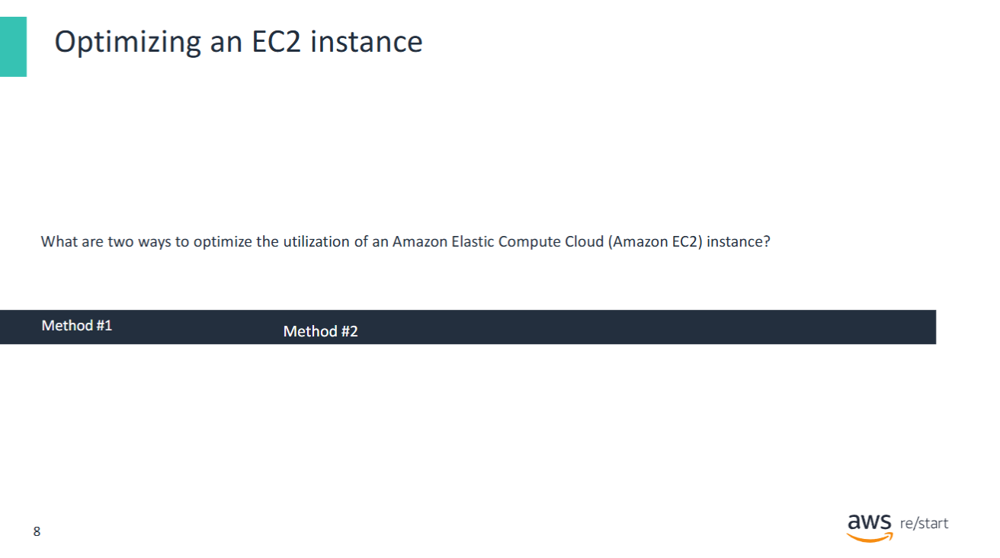
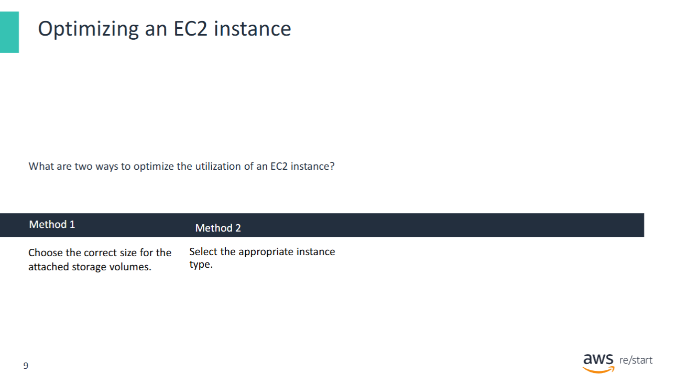
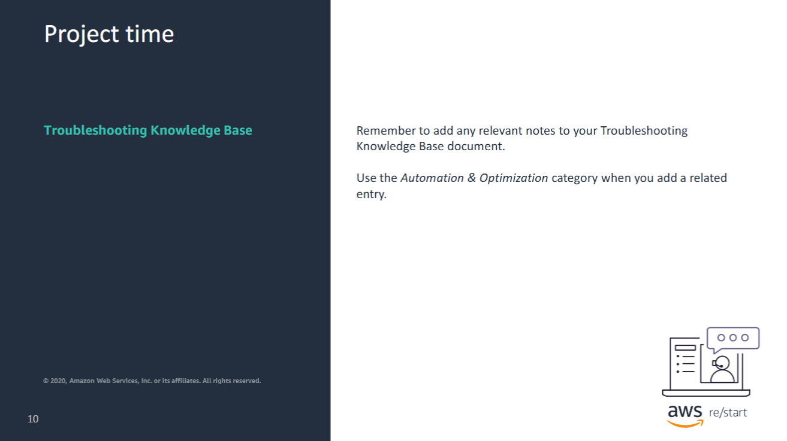

Welcome back to the Café and Bakery project.

## Learning Outcomes

On completion of this project, you will be able to:

- Experience the **communication challenges** faced when applying technology to solve business problems.
- **Translate customer requirements** into a proposed technical solution.
- **Present** the proposed solution to the customer.
- Use **AWS best practices** to design a **frugal**, **resilient**, and **secure** solution.

You will now begin to prepare for yourcustomer meeting, where a new problem will be proposed and where you will assist them in finding a solution.

## Cost Optimization Dialogue

**Sofía:** Olivia, I would like to reduce the cost of the AWS services that we use.  
Can you identify some opportunities where we can optimize resource utilization?

**Olivia:** The database migration to **Amazon Relational Database Service (Amazon RDS)** is complete.  
You could uninstall the decommissioned **local database** from the café instance,  
which would reduce its **storage requirements**.  
You could also **downsize the instance** to a smaller instance type  
because the database no longer runs on it.  
These actions should result in some **cost savings**.

**Sofía:** Can we estimate the amount that we would save?

**Olivia:** You could use the **AWS Simple Monthly Calculator**  
to project the savings from these changes.

---

## Activity: Optimize AWS Resources for the Café Web Application

In this activity, you will **optimize** the AWS resources used to run the **café web application**.

### Specifically, you will:

1. **Uninstall** the decommissioned local database from the café instance  
   → This reduces the **storage requirements** of the instance.

2. **Change the instance type** to `t2.micro`  
   → This reduces **compute costs**.

---

The following diagram illustrates the **topology of the café web application runtime environment**  
**before and after** the optimization.

You can now begin the activity. Feel free to ask your instructor for help.

## Optimizing EC2 Cost: Instance and Storage Sizing

What are two ways to optimize the utilization of an Amazon Elastic Compute Cloud (Amazon EC2) instance? Explain why.

There are multiple ways to reduce costs and optimize your AWS resources:

- **Choose the correct storage volume size**  
  Estimate your current storage needs and add extra capacity to accommodate future growth.

- **Select the appropriate instance type**  
  Choose based on the **CPU** and **memory requirements** of your workloads.

Remember to add any relevant notes to your Troubleshooting Knowledge Base document. Use the Automation & Optimization category when you add a related entry.