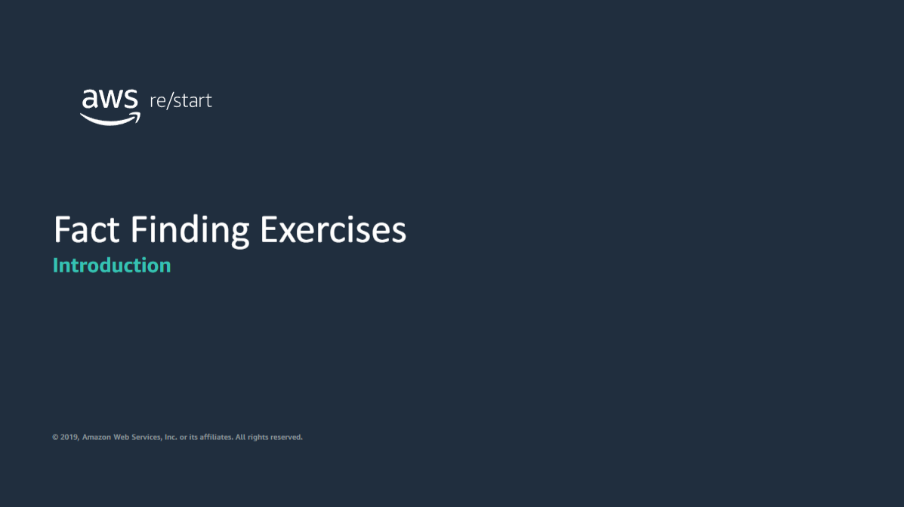

This presentation contains slides that introduce the fact finding exercises in the re/Start v2.4 curriculum.

## Pyhton
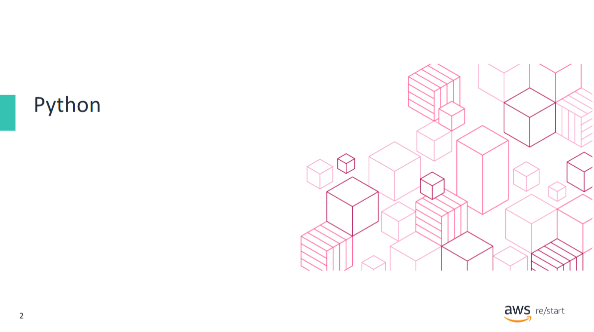

This topic introduces the Python fact finding exercise.

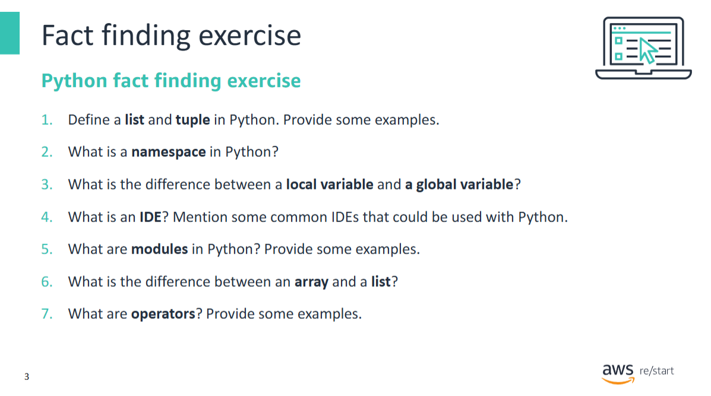

## Databases
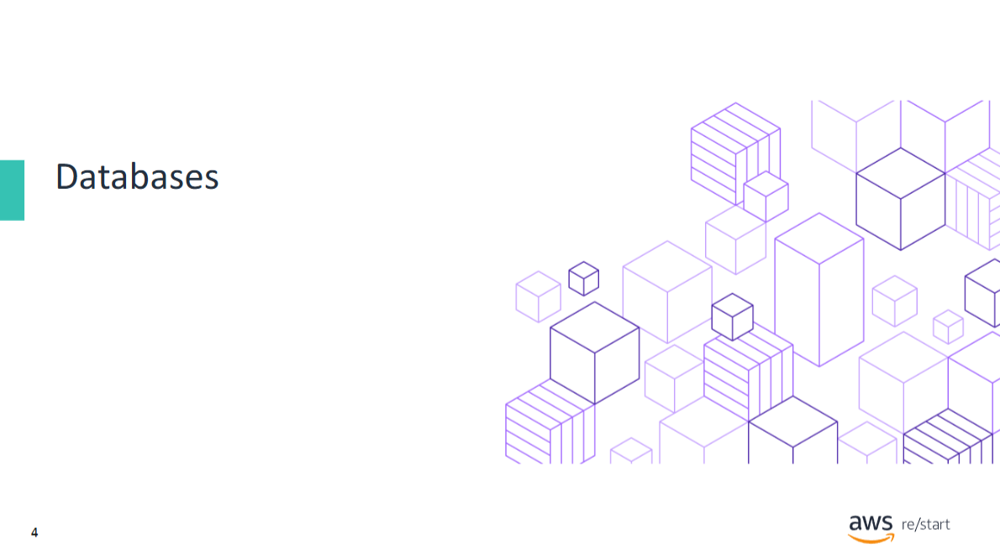

This topic introduces the databases fact finding exercise.

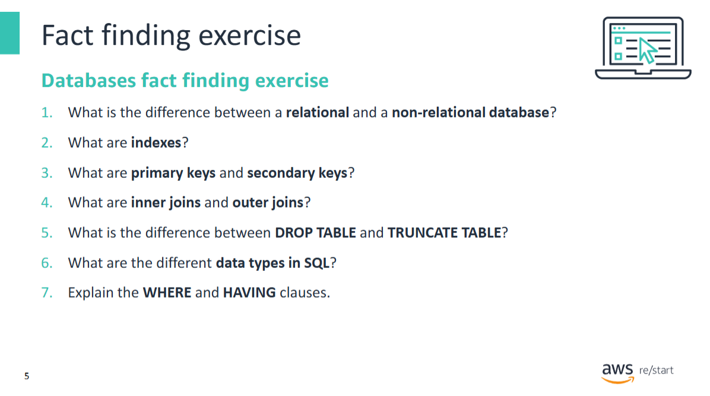

Answer the questions shown in this slide using your own words. Use your notes, your student guide, and the AWS website to refresh your knowledge if necessary.

## AWS Cloud Foundations – One

This topic introduces the Cloud Foundations –Part one fact finding exercise.

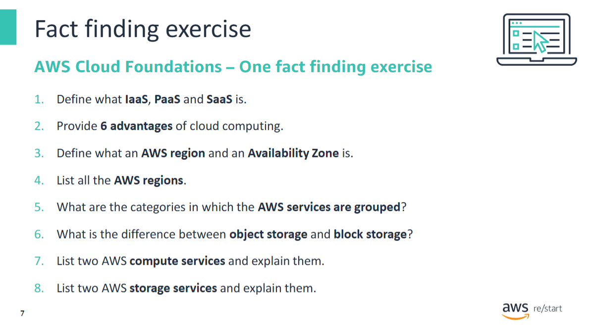

Answer the questions shown in this slide using your own words. Use your notes, your student guide, and the AWS website to refresh your knowledge if necessary.

## AWS Cloud Foundations – Two
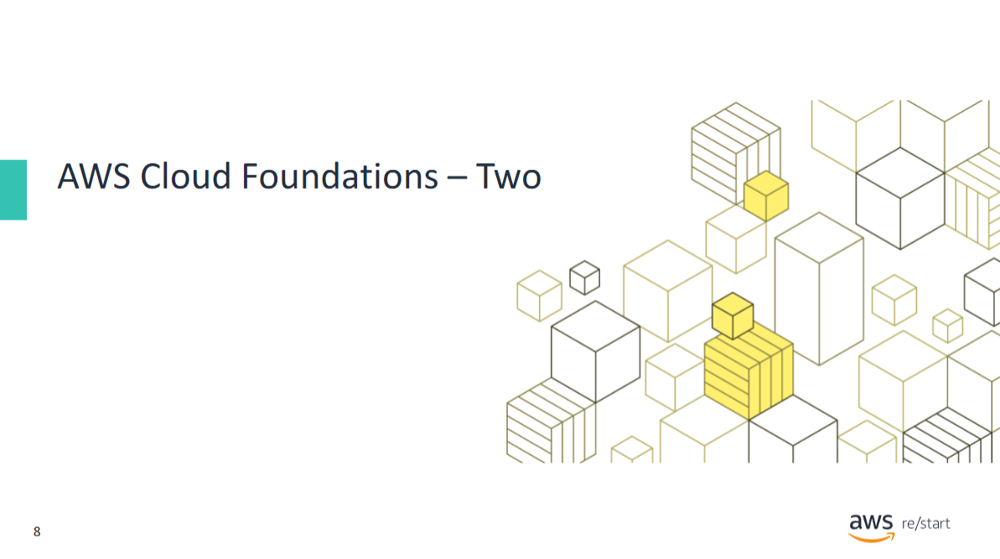

This topic introduces the Cloud Foundations –Part two fact finding exercise.

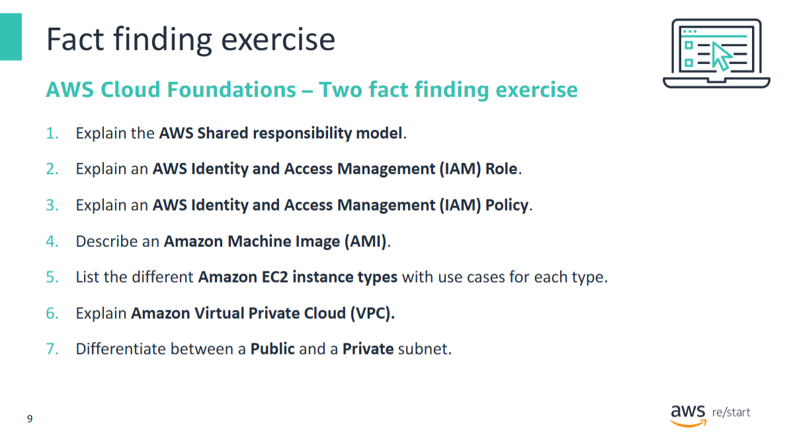

Answer the questions shown in this slide using your own words. Use your notes, your student guide, and the AWS website to refresh your knowledge if necessary.

## AWS Well-Architected Framework
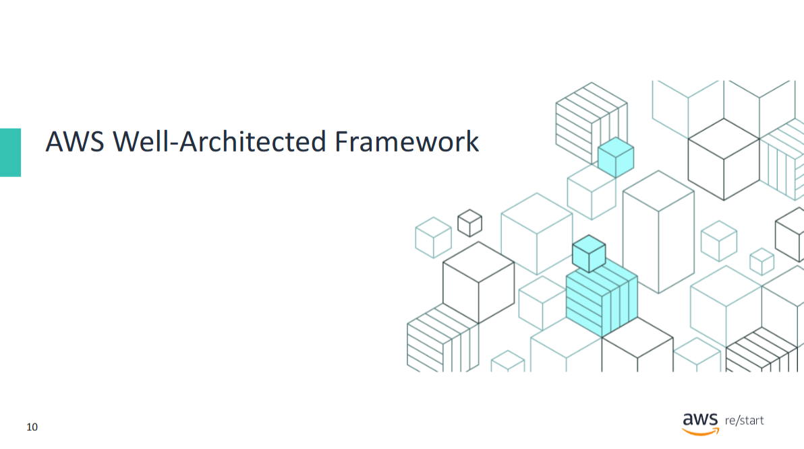

This topic introduces the AWS Well-Architected Framework fact finding exercise.

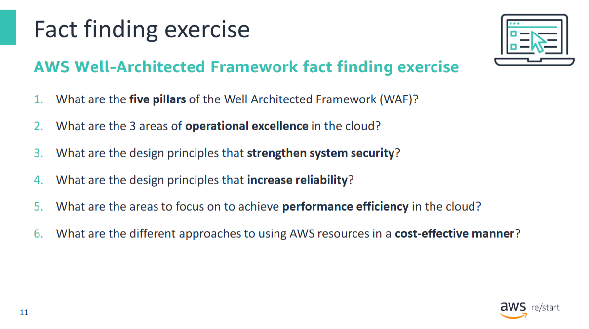

Answer the questions shown in this slide using your own words. Use your notes, your student guide, and the AWS website to refresh your knowledge if necessary.

## AWS CloudFormation
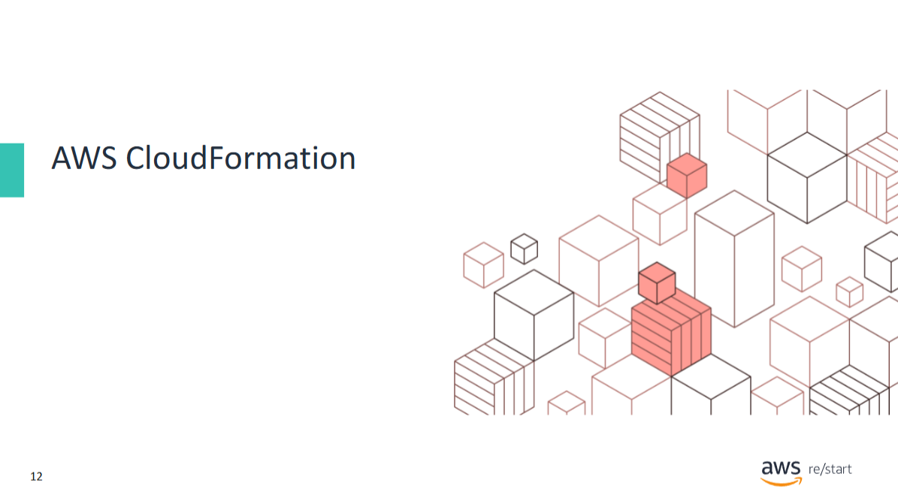

This topic introduces the AWS CloudFormation fact finding exercise.

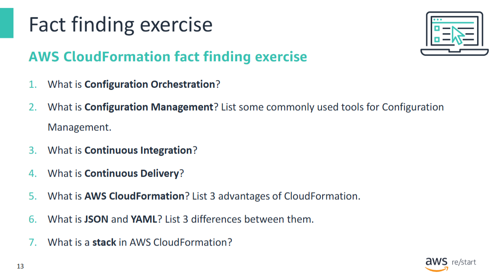

Answer the questions shown in this slide using your own words. Use your notes, your student guide, and the AWS website to refresh your knowledge if necessary.

## AWS Billing
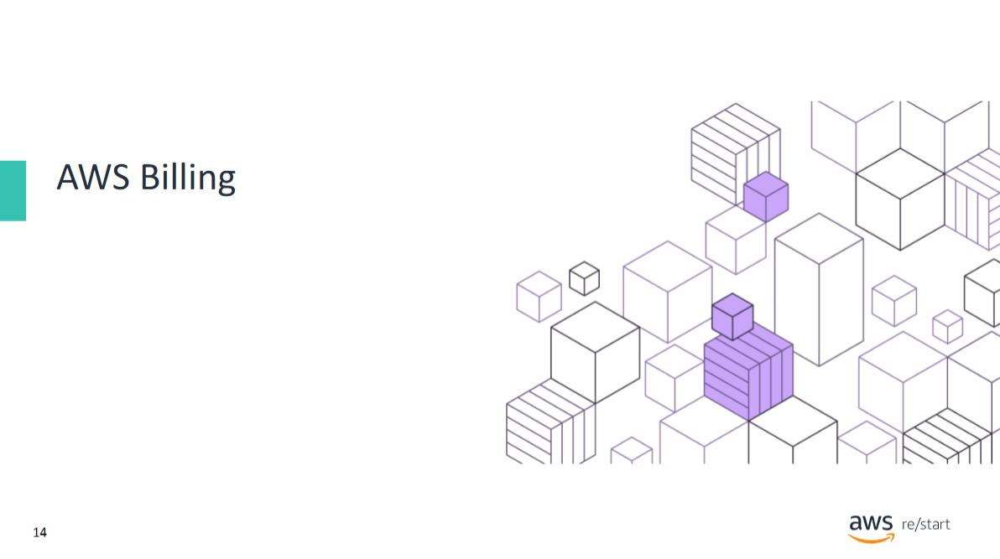

This topic introduces the billing fact finding exercise.

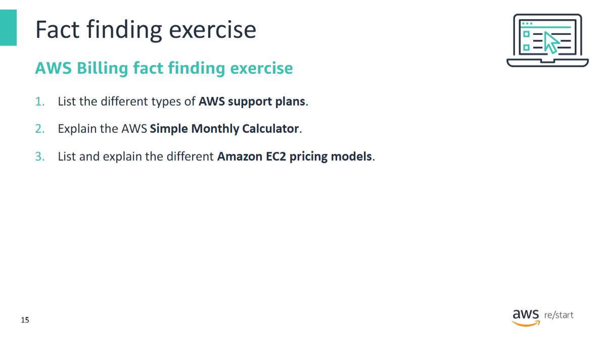

Answer the questions shown in this slide using your own words. Use your notes, your student guide, and the AWS website to refresh your knowledge if necessary.