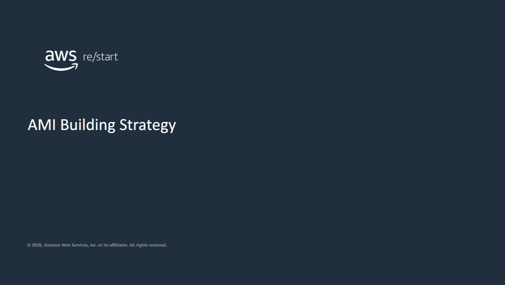
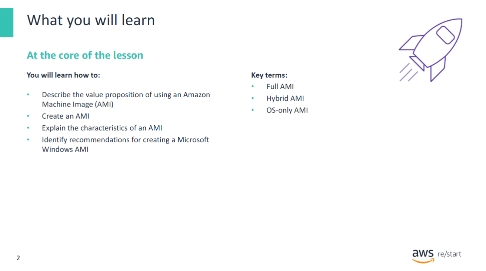
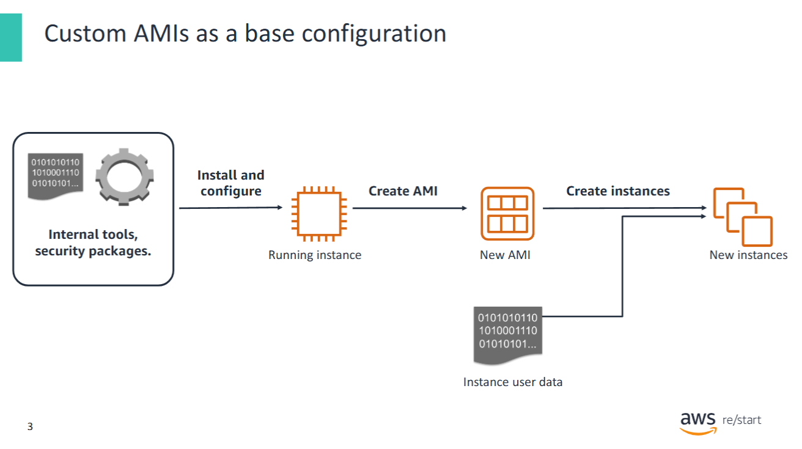
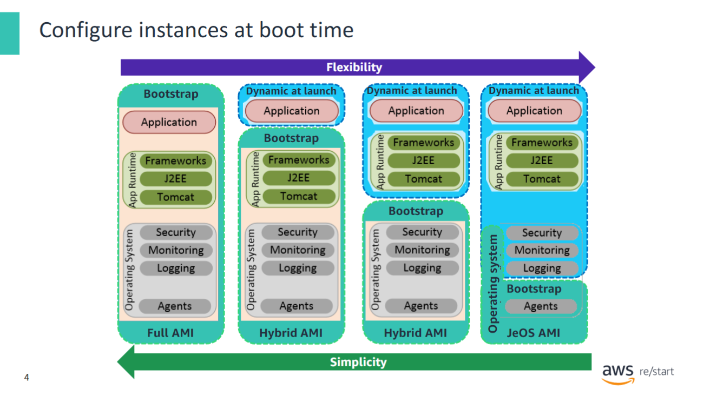
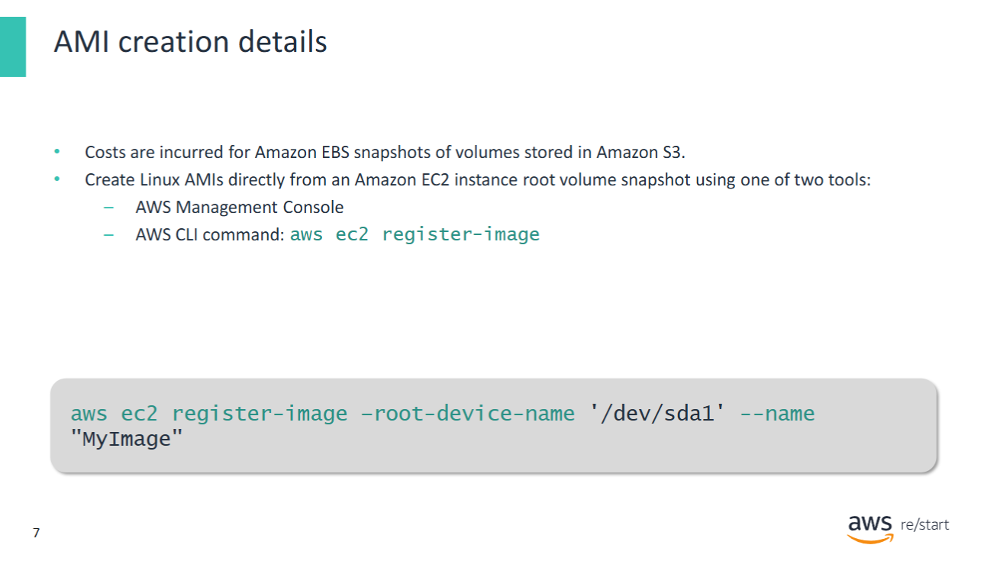
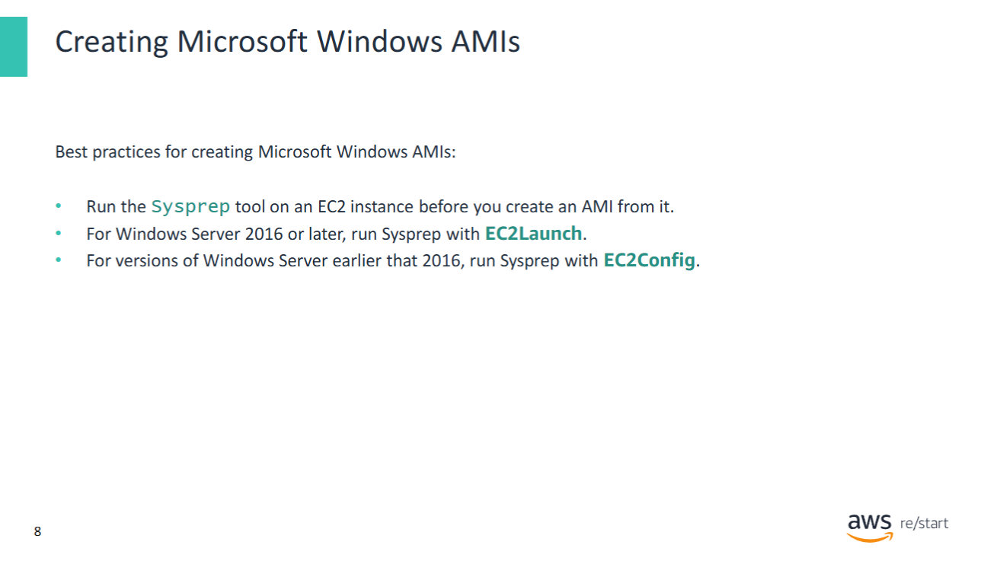
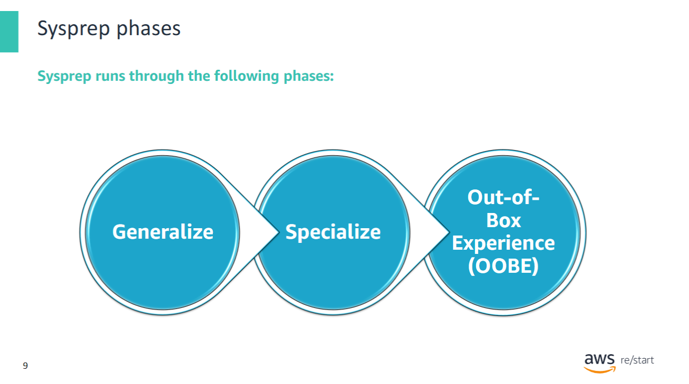
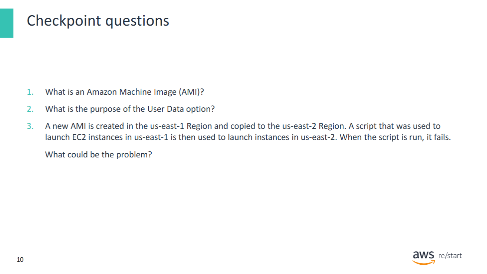
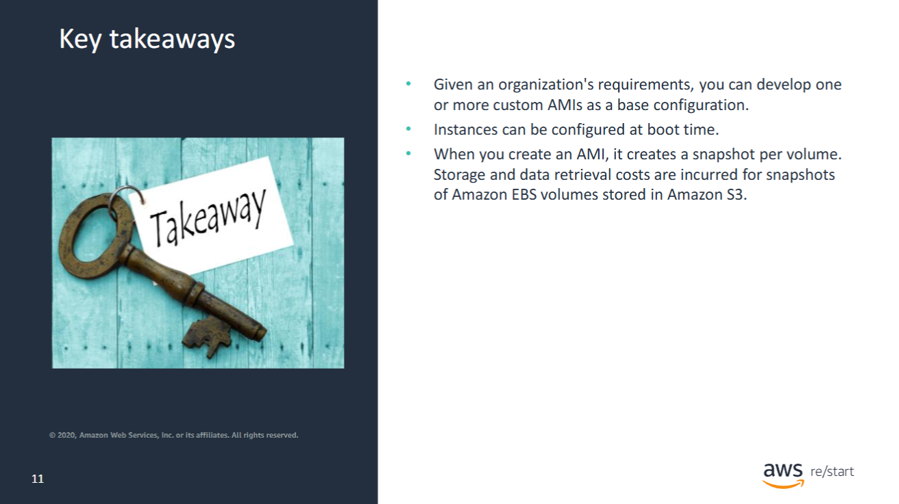

In this lesson, you will learn about strategies and recommendations on how to create an Amazon Machine Image (AMI).

## Lesson Overview: Amazon Machine Images (AMIs)



In this lesson, you will learn how to:

- **Describe** the value proposition of using an Amazon Machine Image (AMI)
- **Create** an AMI
- **Explain** the characteristics of an AMI
- **Identify** recommendations for creating a **Microsoft Windows AMI**

---

## Custom AMIs as a base configuration



Suppose your organization requires that all Amazon EC2 instances launched in the AWS Cloud include a **predefined set of software**.  
This software might include:

- Internal utilities developed by the organization  
- Tools for interacting with AWS services  
- Enterprise-grade software (e.g., for monitoring or intrusion detection)

To meet this requirement, you can create one or more **custom Amazon Machine Images (AMIs)** as base configurations.

### Steps to Create a Custom AMI

1. **Launch an EC2 instance** from a standard (public) AMI.
2. **Install and configure** all required software on that instance.
3. **Create a custom AMI** from the preconfigured instance.

This custom AMI becomes the **standard image** used to launch all future EC2 instances across the organization.

### Enforcing the Use of Standard AMIs

To ensure compliance:

- Create **automated processes** that **scan all running EC2 instances** in your account.
- **Terminate any instance** that is **not based** on the approved custom AMIs.

---

## Configure instances at boot time



An alternative to fully preconfigured AMIs is configuring instances at **boot time**.  
This is often done using the **user data** feature, which runs a script when the EC2 instance launches.

> ✅ This approach is **compatible** with custom AMIs.

Many organizations adopt a **hybrid strategy**, where:

- **Base configurations** are built into a **custom AMI**
- **Dynamic configurations** are applied **at launch time**

### Choosing the Right Approach

The ideal method depends on the **tradeoffs between simplicity and flexibility**. Consider the following factors:

---

### Tradeoffs

| Approach               | Boot Time       | Build Time      | Shelf Life     | Notes |
|------------------------|-----------------|-----------------|----------------|-------|
| **Full AMI**           | Fast            | Long            | Shorter        | All apps and dependencies pre-installed. Fast boot, but harder to maintain. |
| **Partially Configured AMI** | Moderate         | Moderate         | Longer         | Only core software pre-installed. Good balance of speed and flexibility. |
| **OS-only AMI**        | Slow            | Short           | Long           | All configuration happens at launch. Most flexible, but slow to boot. |

---

### Additional Considerations

- **Build Times**:  
  Including more software in an AMI increases the **time to produce the build**.

- **Boot Times**:  
  Minimal AMIs (OS-only) result in **longer boot times**.  
  Prepackaged AMIs launch faster.

- **Shelf Life**:  
  Full AMIs age quickly due to security patches and dependency updates.  
  The more dependencies you bake in, the **more frequently** you need to refresh the AMI.

---

#### Further Reading

For more on AMI design and best practices, refer to:  
**AWS Marketplace Seller Guide – Best Practices for Building AMIs**

---

## Creating an AMI


To create an **Amazon Machine Image (AMI)**, you can use one of the following tools:

- **AWS Management Console**
- **AWS Command Line Interface (CLI)**
- **AWS Application Programming Interface (API)**

---

### AMIs are Region-Specific

An AMI is **anchored to the AWS Region** in which it was created.

For example:  
If you create an AMI in **`eu-west-2` (London)**, the AMI exists **only in that Region**.

> 🔁 To use the AMI in another Region (e.g. `us-east-1`), you must **manually copy** it to that Region.

---

### Automatic Reboot (Default)

When you create an AMI from a running instance:

- The instance is **automatically rebooted** by default
- This ensures the **file system integrity** of the image

You can **suppress the reboot**, but then:
- **AWS does not guarantee** the consistency of the image

---

### EBS Volumes and AMIs

If the EC2 instance has **additional EBS volumes attached**,  
those volumes are **included** in the AMI during creation.

---

#### 📟 Example: Create AMI via AWS CLI

You can use the AWS CLI to create an AMI with the following command:

```bash
aws ec2 create-image \
  --instance-id i-1234567890abcdef0 \
  --name "MyCustomAMI"
``` 
---

## Copying an AMI to Another Region


An **Amazon Machine Image (AMI)** is anchored to a **specific AWS Region**.

If you want to **launch an EC2 instance** from an AMI that was created in a **different Region**,  
you must **first copy** that AMI to the target Region.

---

### Methods for Copying an AMI

You can copy an AMI **in or across Regions** using:

- **AWS Management Console**
- **AWS Command Line Interface (CLI)**
- **Amazon EC2 API**

---

### AWS CLI Example

```bash
aws ec2 copy-image \
  --source-image-id ami-0abcdef1234567890 \
  --source-region eu-west-1 \
  --region us-east-1 \
  --name "CopiedAMI"
```
Expected result:

```json
{
  "ImageId": "ami-abcdef01234567890"
}
```

### AMI Types You Can Copy

- **Amazon EBS-backed AMIs**
- **Instance store-backed AMIs**
- **Encrypted AMIs**
- **AMIs with encrypted snapshots**

---

### Encrypted Snapshots

You can encrypt snapshots using:

- Your **default AWS Key Management Service (AWS KMS)** customer master key (CMK)
- A **custom KMS key** that you specify

> ✅ You **must have permission** to use the selected key.

If the AMI has **encrypted snapshots**, you can **re-encrypt them** with a different KMS key during the `CopyImage` action.

---

### Important Behavior of `CopyImage`

- `CopyImage` **accepts only one KMS key** at a time.
- All of an image's **snapshots (root & data)** will be encrypted with that single key.
- To use **multiple KMS keys**, you must manually **build a new AMI** from snapshots encrypted with different keys.

---

### Potential Copy Failure

An AMI copy can fail if AWS cannot find a **corresponding Amazon Kernel Image (AKI)** in the **target Region**.

---

### Learn More

Refer to the **Amazon EC2 User Guide for Linux Instances**:

- [Using encryption with EBS-backed AMIs](https://docs.aws.amazon.com/AWSEC2/latest/UserGuide/AMIEncryption.html)
- [Copying an AMI](https://docs.aws.amazon.com/AWSEC2/latest/UserGuide/CopyingAMIs.html)

---

## AMI creation details



When you **create an AMI**, Amazon EC2 automatically creates **snapshots** of:

- The instance's **root volume**
- Any **attached EBS volumes**

> 💡 You are **charged** for these snapshots **until** you:
> - Deregister the AMI
> - Delete the associated snapshots

---

### Creating an Amazon EBS-Backed Linux AMI

To create an EBS-backed Linux AMI:

1. Start from an **EC2 instance** that was launched using an **EBS-backed Linux AMI**.  
   - This source AMI can be:
     - From the **AWS Marketplace**
     - An **imported AMI**
     - Any other **accessible AMI**

2. Optionally, you can also create a Linux AMI **directly from a root volume snapshot**  
   using the AWS CLI:

```bash
aws ec2 register-image \
  --name "my-linux-ami" \
  --architecture x86_64 \
  --root-device-name /dev/xvda \
  --block-device-mappings "[{\"DeviceName\": \"/dev/xvda\", \"Ebs\":{\"SnapshotId\":\"snap-0abcdef1234567890\"}}]"
```

---

## Creating Microsoft Windows AMIs



The **Microsoft System Preparation (Sysprep)** tool simplifies the process of **duplicating a customized Windows installation**. It is **recommended** to use Sysprep when creating a **standardized AMI** for Windows.

Once created, you can use this **standardized AMI** to launch new **Amazon EC2 instances for Windows**.

---

### Recommended Tools

#### EC2Launch (Windows Server 2016 and later)
- **EC2Launch** starts **when the instance boots**.
- Performs tasks such as:
  - Setting the **computer name**
  - Sending instance information to the **EC2 console**
  - Setting a **random password** for the `Administrator` account

📘 More info: [Configuring a Windows instance using EC2Launch](https://docs.aws.amazon.com/AWSEC2/latest/WindowsGuide/ec2launch.html)

#### EC2Config (Windows Server 2012 R2 and earlier)
- **EC2Config** is an optional service (`EC2Config.exe`)
- Starts **on instance boot** and runs at **each stop/start cycle**
- Can perform **on-demand tasks**
- Some features are:
  - Enabled by default
  - Others require **manual activation**
- Although optional, EC2Config gives access to **advanced instance features**

📘 More info: [Create a standardized AMI using Sysprep](https://docs.aws.amazon.com/AWSEC2/latest/WindowsGuide/Creating_EBSbacked_WinAMI.html#ami-create-standard)

---

### Important Notes

- **Do NOT use Sysprep** for EC2 **instance backups**:
  - Sysprep **removes system-specific information**
  - This may cause **unintended consequences** when restoring a backup
- Sysprep is used to:
  - **Prepare an EC2 image** for AMI creation
  - Remove tools, configurations, and user-specific identifiers from the system

---

## Sysprep Phases



When preparing a Windows instance for AMI creation, **Sysprep** runs through the following three phases:

---

### 1. Generalize

- **Removes image-specific information** and configurations:
  - Security Identifier (**SID**)
  - **Computer name**
  - **Event logs**
  - **Specific drivers**
- After this phase, the **Operating System (OS)** is ready for **AMI creation**.

---

### 2. Specialize

- **Plug and Play** scans the instance and **installs drivers** for detected hardware.
- Generates OS-level settings such as:
  - **New SID**
  - **Computer name**
- You can configure this phase to run **custom commands**.

---

### 3. Out-of-Box Experience (OOBE)

- Runs a **minimal version of Windows Setup**
- Prompts for:
  - **Language settings**
  - **Time zone**
  - **Organization name**
- When using **Sysprep with EC2Config**, an **answer file** automates this step.

---

💡 These phases are essential to ensure that a **custom Windows AMI** is generic, reusable, and compliant with AWS best practices.

## Checkpoint questions



---

## Key Takeaways



- Given an organization’s requirements, you can develop one or more **custom AMIs** as a base configuration.
- **Instances can be configured at boot time**, for example using user data scripts.
- When you create an **AMI**, it creates a **snapshot per volume**.
  - ⚠️ **Storage and data retrieval costs** are incurred for snapshots of **Amazon EBS volumes** stored in **Amazon S3**.
