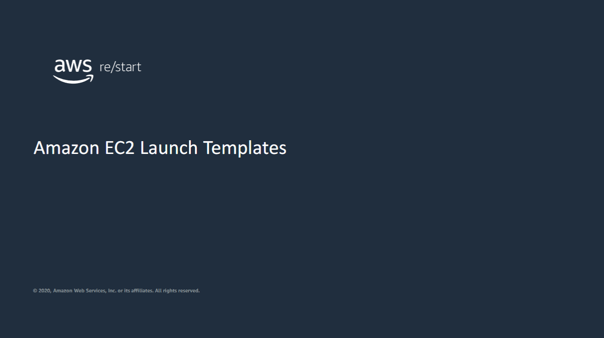
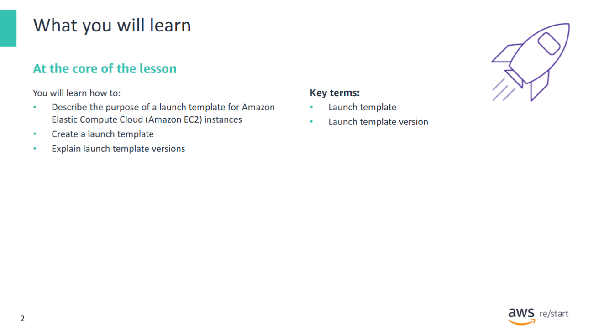
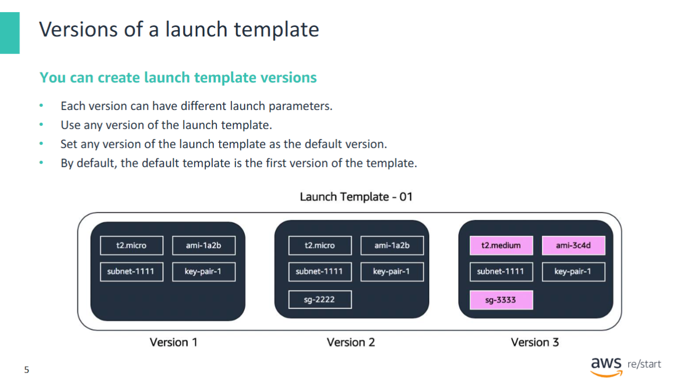
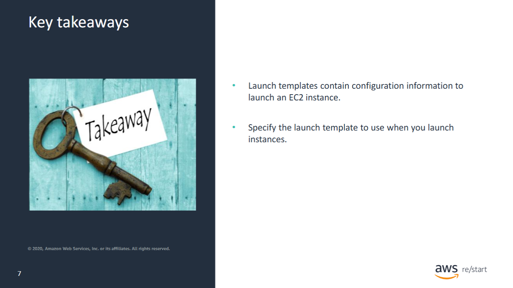

This lesson is an introduction to launch templates for Amazon Elastic Compute Cloud (Amazon EC2) instances.

---

In this lesson, you will learn how to:

- **Describe** the purpose of a launch template for Amazon Elastic Compute Cloud (Amazon EC2) instances  
- **Create** a launch template  
- **Explain** launch template versions

---

## Launch Templates

Users can launch instances using several methods, of which a **launch template** is one. Other methods include the **wizard**, using an **AMI**, or a **CloudFormation template**. (AMIs were discussed in the previous module.)

**Launch templates** enable you to create reusable templates for your launch requests. When you create a launch template, you can specify the following configurations:

- Instance type  
- Subnet to launch the instance into  
- Key pair  
- Security group  

You can store the launch parameters so that you do not have to specify them every time you launch an instance.

When you create the launch template, you decide which launch options to include in the template.

In addition, launch templates provide the following features:

- Enable you to preselect EC2 launch options  
- Support **versioning**

#### Benefits of launch templates

- Streamline and simplify the launch process for:
  - Amazon EC2 Auto Scaling  
  - Spot Fleet  
  - Spot Instances  
  - On-Demand Instances  
- Reduce the number of steps required to create an instance by capturing all launch parameters in one resource  
- Make it easier to implement standards and best practices  

As a result, you gain additional benefits:

- Help in managing **costs**  
- Improve **security**  
- Minimize the risk of **deployment errors**

---

## Versions of a launch template

For each **launch template**, you can create one or more **numbered launch template versions**.  
Each version can contain different launch parameters, as illustrated below.

#### Key points:

- When launching an instance from a launch template, you can **specify any version** of the template.
- If no version is specified, the **default version** is used.
- You can set **any version** of the launch template as the default.
  - By default, version 1 is the default version.

#### Example – Launch Template with Three Versions:

- **Version 1**:  
  Specifies:
  - Instance type  
  - Amazon Machine Image (AMI) ID  
  - Subnet  
  - Key pair

- **Version 2** *(based on version 1)*:  
  Adds:
  - Security group

- **Version 3**:  
  Uses **different values** for some of the parameters

In this example, **version 2** is set as the default version.  
If you launch an instance from this launch template without explicitly specifying a version, the parameters from **version 2** will be used.

---

You can access the Createa Launch Template video demonstration in Canvas.

---

## Key takeaways

Key takeaways from this module include:
- Launch templates contain configuration information to launch an EC2 instance.
- Specify the launch template to use when you launch instances.