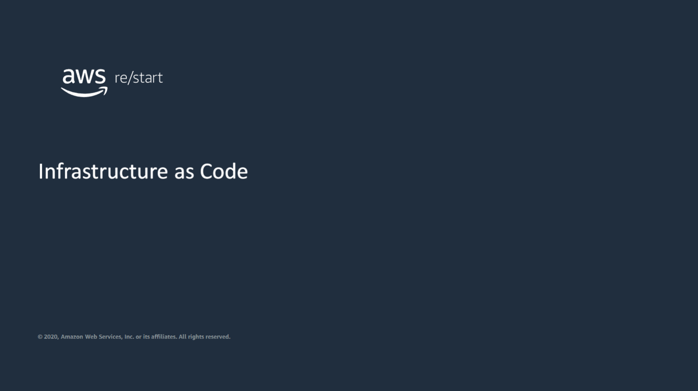
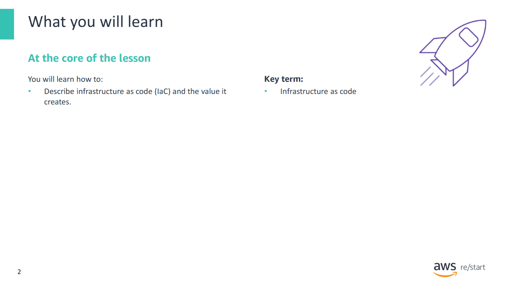
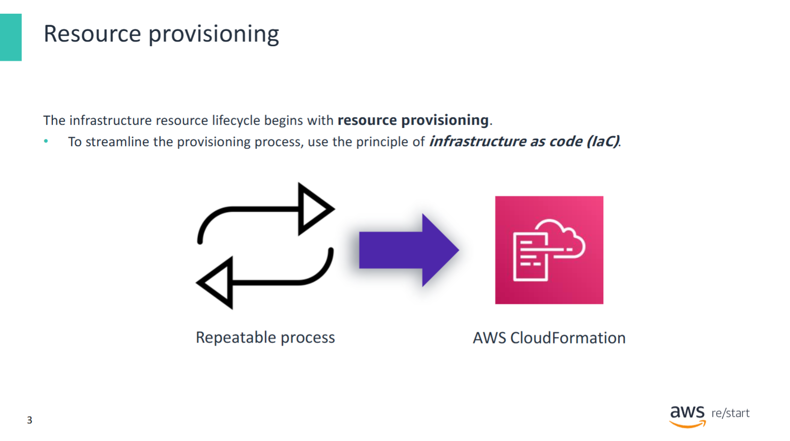
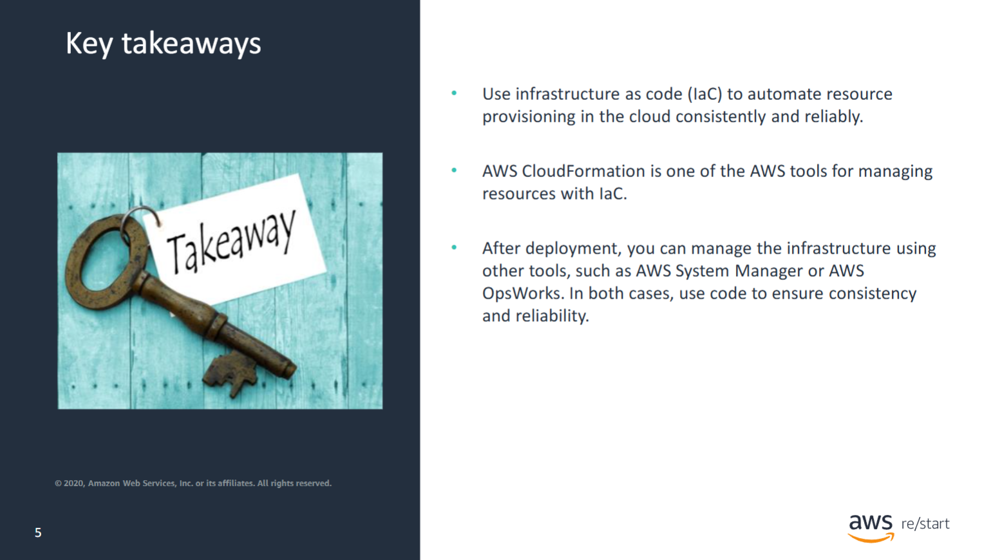

This lesson explores the concept of infrastructure as code (IaC).

---

In this lesson, you will learn how to:
- Describe infrastructure as code (IaC) and the value that it creates

---

## Resource provisioning

The creation process for infrastructure resources needs to be **consistent** and **reliable**.  
**Infrastructure as Code (IaC)** is a framework that helps implement these principles.  
**AWS CloudFormation** is a service that enables you to create infrastructure using code.

### Use cases for repeatable, consistent deployments include:

- **Creating replica environments**  
  For:
  - Experimenting with new services  
  - Testing in a production-like environment  
  - Quickly deploying recovery environments after a disaster

- **Creating temporary environments for demonstrations**  
  IaC allows you to:
  - Deploy infrastructure that closely mirrors real environments
  - Conduct realistic and reliable service demonstrations

- **On-demand development environments**  
  Benefits:
  - Environments for developers can be launched when needed
  - Environments can be deleted when no longer in use
  - Reduces costs
  - Ensures compatibility with current production systems

---

## Configuration management

After you provision your infrastructure resources and the infrastructure is up and running,  
you must address the ongoing **configuration management** needs of the environment.

### Consider the following situations:

- A **release manager** wants to deploy a new version of an application across a group of servers.  
  If issues are encountered, they want to **roll back** to a previous working version.

- A **system administrator** is asked to install a new OS package in **developer environments only**, leaving other environments unchanged.

- An **application administrator** needs to periodically update a **configuration file** across all servers running an application.

---

### Two approaches for managing configuration:

#### 1. **Immutable Infrastructure**

One way to manage changes is to **return to the provisioning stage**, create **fresh resources** with the required updates, and **remove** the previous ones.

- This is known as **infrastructure immutability**.
- Each change results in a **clean, new build** based on the current infrastructure code.
- This approach reduces **configuration drift**, where the actual state of resources deviates from the expected configuration.

#### 2. **Incremental Changes (Mutable Infrastructure)**

Some environments require **durability**, where data must persist (e.g., in databases).  
In such cases, **incremental updates** to existing resources might be preferred over full reprovisioning.

---

### AWS Tools for Configuration Management

- **AWS Systems Manager**
  - Provides insight into the AWS infrastructure.
  - Automates **repetitive tasks**.
  - Helps quickly **identify operational issues**.
  - Includes **automation capabilities** to increase accuracy and efficiency for maintenance.

- **AWS OpsWorks for Chef Automate**
  - Provides a **managed Chef server**.
  - Automates tasks like **deployments**, **testing**, **security**, and **resource monitoring**.
  - Improves visibility and operational control in your cloud environment.

## Key takeaways

Use **Infrastructure as Code (IaC)** to automate resource provisioning in the cloud **consistently** and **reliably**.

#### Key Points

- **AWS CloudFormation** is one of the core AWS tools for managing infrastructure using IaC.
  - It allows you to define and provision AWS resources using code (YAML or JSON).
  - Ideal for repeatable, version-controlled infrastructure deployments.

- After deployment, you can manage your infrastructure with tools like:
  - **AWS Systems Manager** – for operational insights, automation, and patching.
  - **AWS OpsWorks** – for configuration management using Chef or Puppet.

In both cases, the use of **code-based automation** helps ensure:
- **Consistency** across environments (dev, test, prod)
- **Repeatability** of deployments
- **Auditability** and **traceability** of changes
