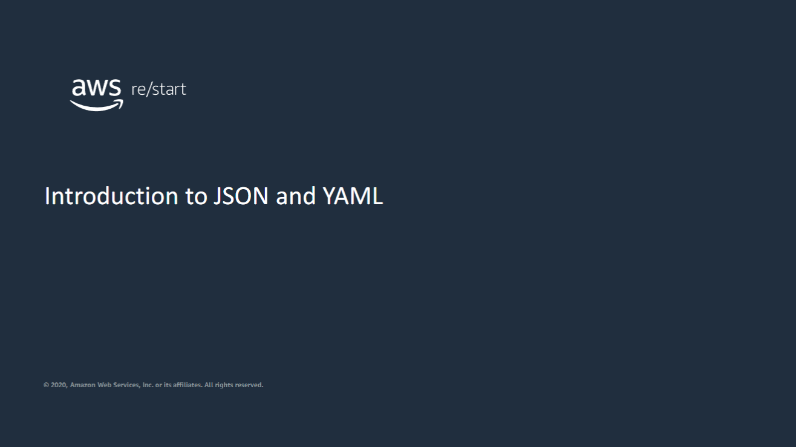

This lesson introduces you to JavaScript Object Notation (JSON) and YAML Ain’t Markup Language (YAML). 

JSON and YAML are data formats that are commonly used in automated and repeatable deployments.

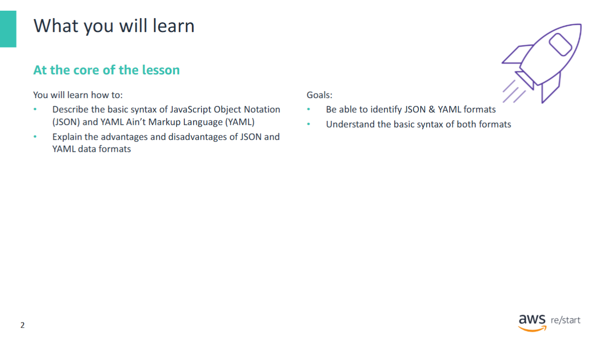

---


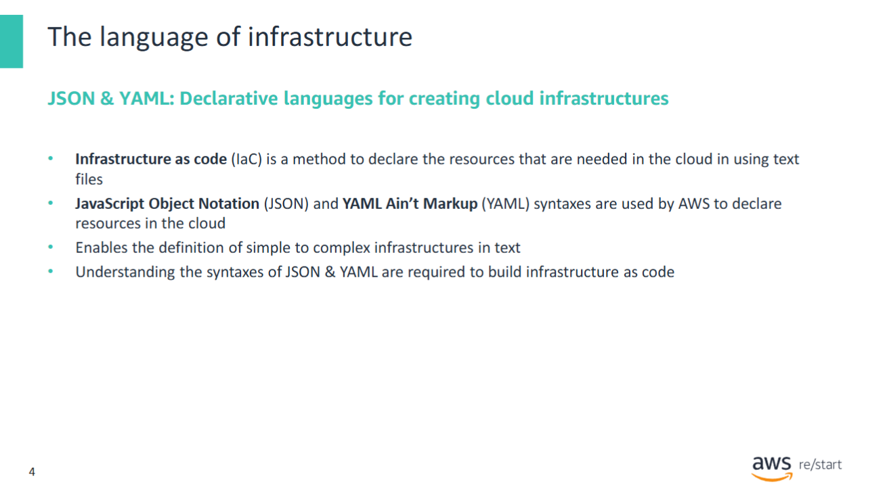

Before studying how to define infrastructure in code it is necessary to study the syntax of the two formats used by AWS CloudFormation.


## What is JSON?

**AWS CloudFormation** allows you to write or modify **templates** that can:
- **Create**, **update**, or **delete** related AWS resources
- Deploy resources together as a **stack**

To work with CloudFormation, you must understand its **template format**, which can be written in **JSON** or **YAML**.

---

## What is JSON?

**JSON (JavaScript Object Notation)** is:
- A **text-based** format for **storing and transporting data**
- **Human-readable** and easy to write
- Structured as **key-value pairs** and **arrays**

#### Key Terms

- **Key**: A unique name or identifier for a piece of data
- **Value**: The data itself, or a pointer/reference to the data

#### Example JSON Structure

```json
{
  "InstanceType": "t2.micro",
  "SecurityGroups": ["sg-123abc", "sg-456def"],
  "Tags": [
    { "Key": "Name", "Value": "WebServer" },
    { "Key": "Environment", "Value": "Dev" }
  ]
}
```

#### Why JSON?
- Supports complex data structures
- Ideal for data exchange between systems
- Widely used in APIs and configuration files
- Well-supported in AWS tooling

#### Summary:
Understanding JSON is essential for working with AWS services like CloudFormation, especially when defining infrastructure as code using structured templates.

---

## Representation of data

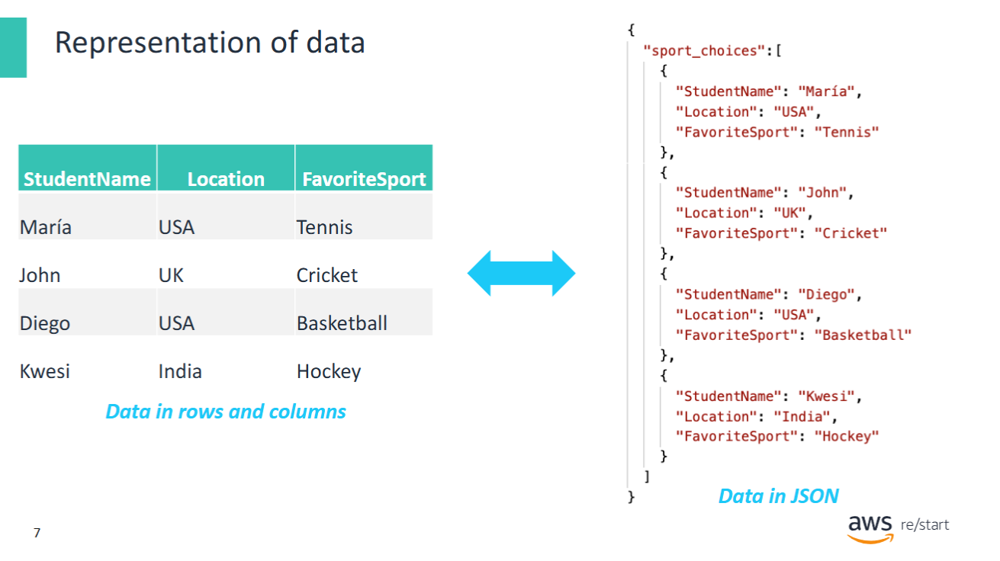

In many systems, data is presented in a **columnar format**, like in a **table**.

However, to store and exchange that data in a way that is:
- Easy for **machines** to ingest and parse
- **Human-readable**
- Suitable for **distribution across systems**

…it must be stored in a **non-graphical format**.

---

### JSON as a Storage Format

**JSON** provides a structure to store **tabular data** in a plain text format, using **objects** and **arrays**.

---

### Example: Table to JSON

Imagine a table with **three columns** and **five rows**:

| ID | Name     | Score |
|----|----------|-------|
| 1  | Alice    | 92    |
| 2  | Bob      | 87    |
| 3  | Charlie  | 95    |
| 4  | Diana    | 88    |
| 5  | Edward   | 91    |

This can be stored in JSON as:

```

json
[
  { "ID": 1, "Name": "Alice", "Score": 92 },
  { "ID": 2, "Name": "Bob", "Score": 87 },
  { "ID": 3, "Name": "Charlie", "Score": 95 },
  { "ID": 4, "Name": "Diana", "Score": 88 },
  { "ID": 5, "Name": "Edward", "Score": 91 }
]
```

#### Benefits
- Easy to read and write
- Great for interchange between APIs and applications
- Easily parsed by most programming languages

---

## Advantages and disadvantages of JSON

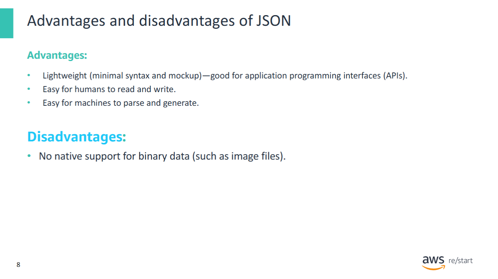

### Advantages of JSON

- **Lightweight format**  


  → JSON has minimal syntax rules and is easy to work with.

- **Widely used in APIs**  


  → Especially in modern **RESTful web services**.

- **Human-readable and easy to write**  


  → Simple structure with key-value pairs.

- **Easy for machines to parse and generate**  


  → Supported natively by many programming languages.

---

### Disadvantages of JSON

- **Verbose syntax**  


  → JSON documents can become long, especially with nested data.  
  → Many lines might contain only `{` or `}`.

- **No native multimedia support**  


  → JSON does **not** directly support storing **images**, **videos**, or other binary formats.  
  → These must be encoded (e.g., Base64), which increases file size.

---

## JSON building blocks: Objects

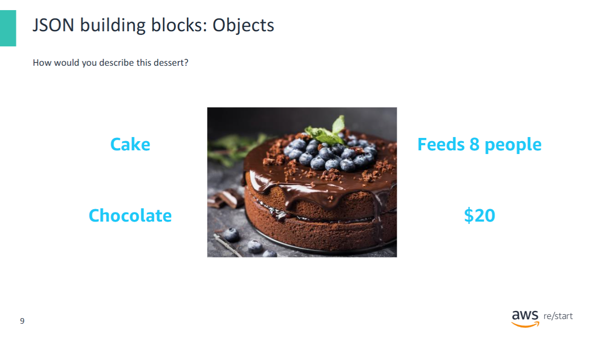

Consider how you would describe an object, such as the dessert shown here. What characteristics does it have? Four characteristics that describe this dessert are highlighted.

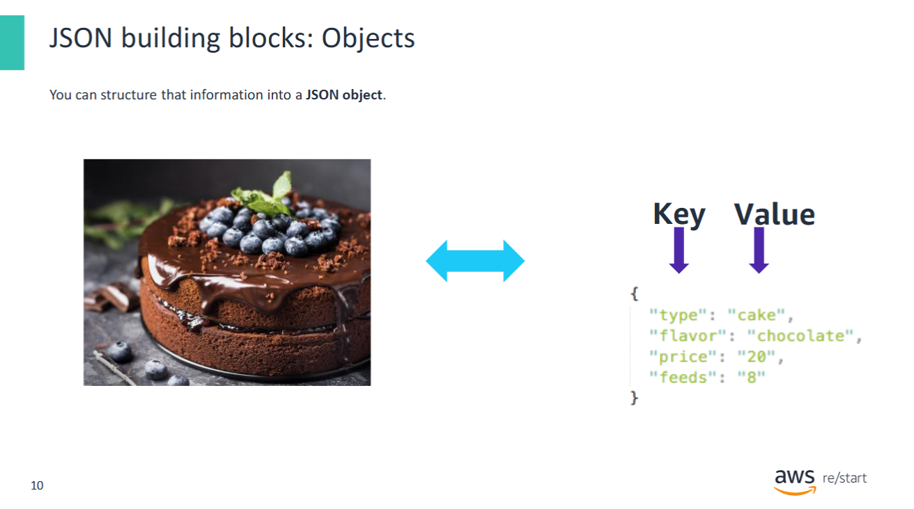

Here, you see that the cake characteristics that were identified are now captured in a JSON object.

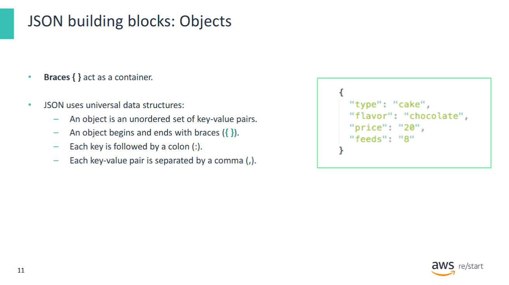

JSON objects are **enclosed in curly braces `{}`** and consist of an **unordered set of key-value pairs**.

#### Syntax Rules

- Each **key** is a string enclosed in double quotes.
- A **colon `:`** separates each key from its value.
- **Values** can be strings, numbers, objects, arrays, `true`, `false`, or `null`.
- **Commas** separate key-value pairs.
- **The last pair** must **not** be followed by a comma.

---

### Example: JSON Object

```

json
{
  "type": "pie",
  "flavor": "apple",
  "price": "16",
  "feeds": "6"
}
```
Notice that the same keys are used, but the values are different.

---

## JSON building blocks: Arrays

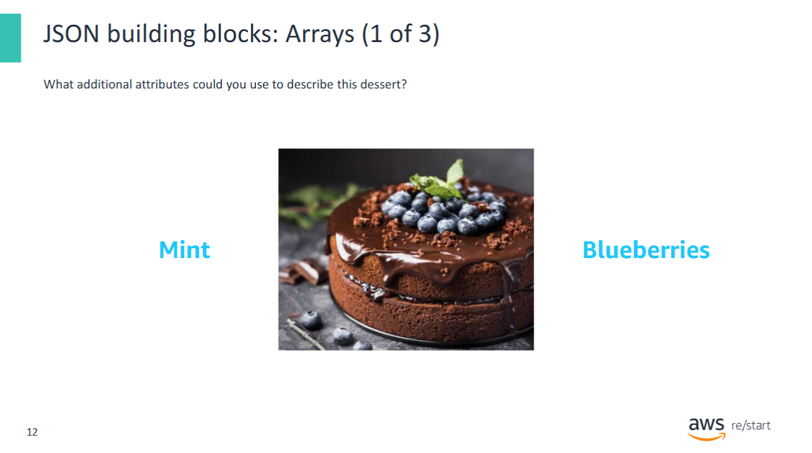

If you wanted to be more specific about this dessert, you could document additional characteristics. For example, it has both blueberries and mint as additional ingredients.

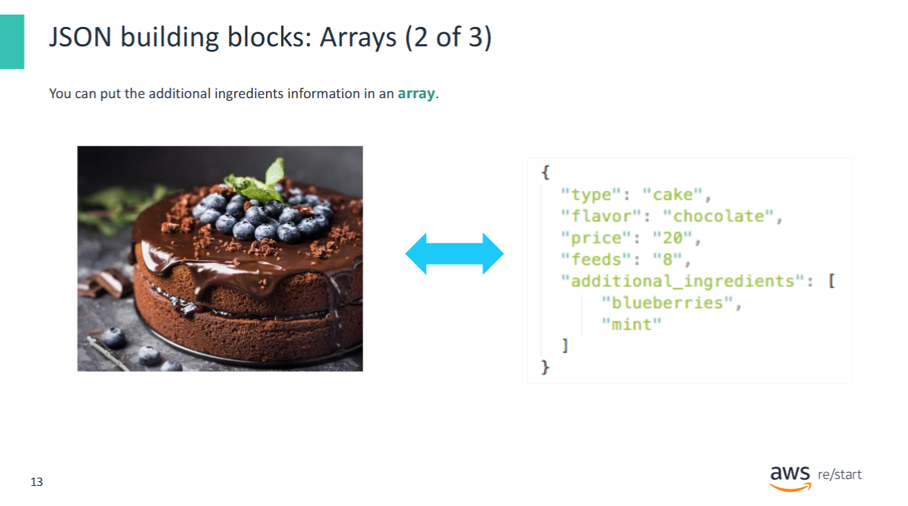

In JSON, **arrays** are used when a key can have **multiple values**. Arrays are:

- Enclosed in **square brackets `[]`**
- Each item is **comma-separated**
- Items can be strings, numbers, objects, or other arrays

---

### Example: JSON Object with an Array

```

json
{
  "type": "pie",
  "flavor": "apple",
  "price": "16",
  "feeds": "6",
  "additional_ingredients": ["blueberries", "mint"]
}
```
#### ✅ Arrays are ideal for representing:

- A list of names in a group
- Chemicals in a formula
- Models available from a car manufacturer
- Optional toppings, tags, or categories

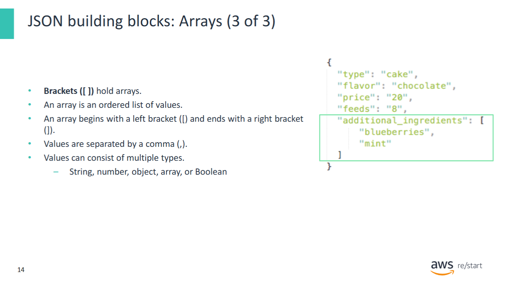

In JSON, an **array** is an **ordered collection** of values. Arrays are enclosed in **square brackets `[]`** and can store multiple items under a single key.

#### Key Points:

- Arrays preserve **order**, so you can access items by **index**.
- Valid value types inside an array:


  - **String** (e.g., `"mint"`)
  - **Number** (e.g., `42`)
  - **Object** (e.g., `{ "name": "Alice" }`)
  - **Array** (e.g., `[1, 2, 3]`)
  - **Boolean** (`true`, `false`)

---

#### Example:

```

json
{
  "type": "pie",
  "flavor": "apple",
  "price": "16",
  "feeds": "6",
  "additional_ingredients": ["blueberries", "mint"]
}
```

To access the second ingredient (`"mint"`), use:

```

json
objectName.additional_ingredients[1]
```

---

## Introduction to YAML


Some AWS services—such as **AWS CloudFormation**—support **YAML** as a data format in addition to **JSON**. To use CloudFormation effectively, it’s important to understand the **structure and syntax** of YAML.

### What is YAML?

- **YAML** stands for **"YAML Ain’t Markup Language"**
- Designed to be **simple**, **human-readable**, and **distinct** from markup languages like XML or Markdown
- YAML is used for **data representation**, not for formatting or markup

### Key Characteristics

- YAML is **text-based**, just like JSON
- Supports **key-value pairs**, **lists**, and **nested structures**
- Ideal for **configuration files** and **infrastructure-as-code templates** like CloudFormation

### YAML vs. JSON

| Feature          | YAML                        | JSON                     |
|------------------|-----------------------------|--------------------------|
| Syntax           | Indentation-based           | Brackets and braces      |
| Comments         | Yes (`#`)                   | No native support        |
| Readability      | Very human-friendly         | More structured/verbose  |
| Common use cases | Configs, CloudFormation     | APIs, data exchange      |

### Example: Key-Value Pairs

YAML:
```

yaml
- type: pie  
- flavor: apple  
- price: 16  
- feeds: 6  


```

JSON equivalent:
```

json
{  
  "type": "pie",  
  "flavor": "apple",  
  "price": "16",  
  "feeds": "6"  
}
```

### Example: List in YAML

YAML:
```

yaml
- additional_ingredients:  


  - blueberries  
  - mint  
```

JSON equivalent:
"additional_ingredients": ["blueberries", "mint"]

#### Summary

- YAML is widely used for **AWS CloudFormation templates**
- More readable than JSON but indentation-sensitive
- Supports all standard data types: strings, numbers, arrays, objects

## YAML versus JSON

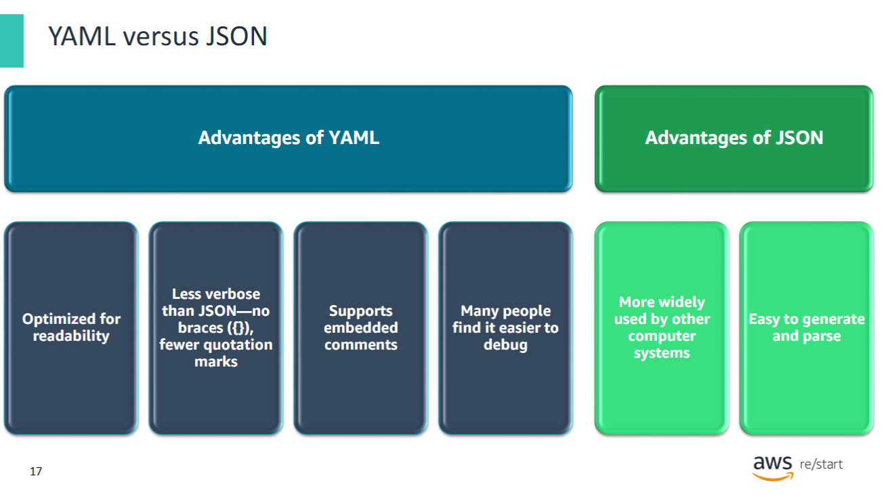

Compared to JSON, YAML is optimized for readability. It is less verbose than JSON. The same data that is stored in JSON will take fewer lines to store in YAML. The reason is that YAML does not use braces, and it uses fewer quotation marks. Another advantage of YAML is that it natively supports embedded comments. Finally, many find it easier to debug YAML documents compared with JSON. With JSON, it can be difficult to find missing or misplaced commas or braces. YAML does not have this issue.

Despite the many advantages of YAML, JSON offers some unique advantages. First, it is widely used by computer systems. Its ubiquity is an advantage because data that is stored in JSON can reliably be used with many systems without needing transformation. Also, it is usually easier to generate and parse JSON than it is to generate and parse YAML.

AWS CloudFormation, which will be discussed in detail later in this module, supports templates that are written in JSON or YAML.

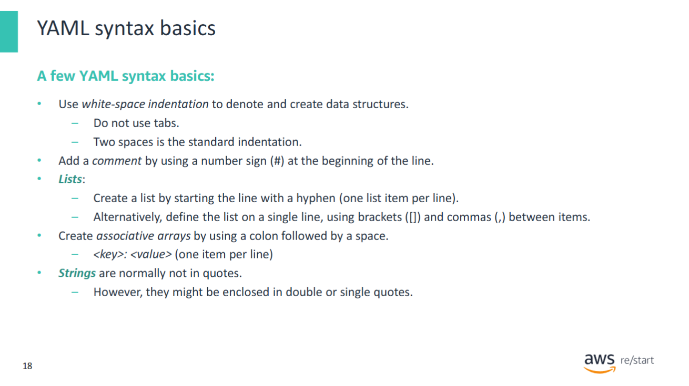

Denoting data structures  
YAML syntax uses white-space indentation to denote and create data structures. It is important to know that YAML interprets tabs as white space. You must be careful to avoid using tab spaces when you create or edit YAML documents. Inserting two white spaces is the standard indentation. However, as long as your indentation approach is consistent, the document will be valid.

Adding comments  
To add a comment, use a number sign (`#`) at the beginning of the line. Keep a blank line both preceding and following any commented line.

Creating lists  
To create a list, start the line with a hyphen, and write only one list item per line.  
Alternatively, you can define an entire list by putting multiple line items on a single line.  
However, to use this list structure, you must surround the list in brackets (`[]`) and use commas between the list items.

Creating arrays  
To create an associative array, use a colon followed by a space. You will see an example of this syntax next.

Defining key-value pairs  
Just like JSON, YAML documents store key-value pairs. To define a single key-value pair, use a colon between the key and the value (use one item per line).

Creating strings  
Finally, unlike JSON, strings in YAML are normally not enclosed in quotation marks.  
However, you might sometimes see them enclosed in double or single quotation marks.  
Usually, quotation marks are used to escape characters that appear in the string, and that would otherwise confuse a system reading a YAML document.

## Examples: JSON and YAML

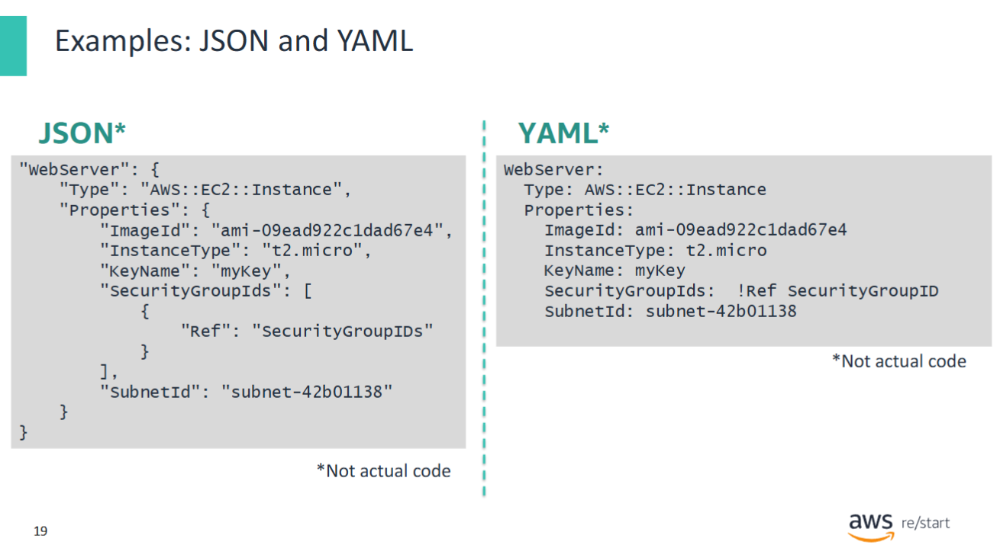

The examples show the same configuration information documented in both JSON and YAML formats.

The JSON version has more characters and includes many quotation marks, braces, and commas.  
The YAML version has fewer characters and uses indentation with spaces (not tabs) to create parent-child relationships between pieces of data.

- The JSON file uses braces to indicate that `Type` and `Properties` are children of the `WebServer` parent.
- The YAML file uses white-space indentation to indicate `Type` and `Properties` are children of the `WebServer` parent.

Notice the difference in how the key-value pairs are documented:

- In YAML, the key and the value are not in quotation marks.
- The ends of the lines do not have commas.
- The keys and values do not need to be enclosed in quotation marks.

You now have a general understanding of the syntax of both JSON and YAML.  
This understanding should help you while you start exploring the features of AWS CloudFormation in this module.

## Key takeaways

