This module describes the AWS CloudFormation service.

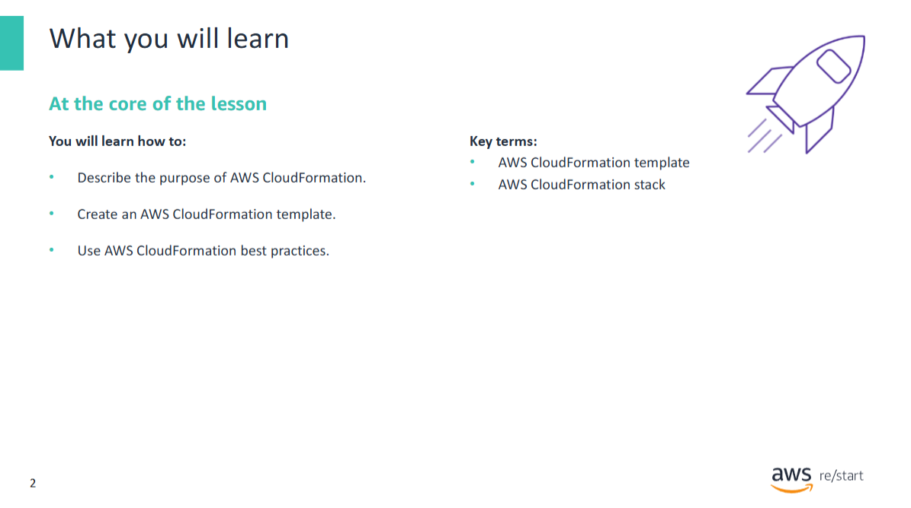

In this module, you will learn how to:

- Describe the purpose of AWS CloudFormation.
- Create a AWS CloudFormation template.
- Use AWS CloudFormation best practices.

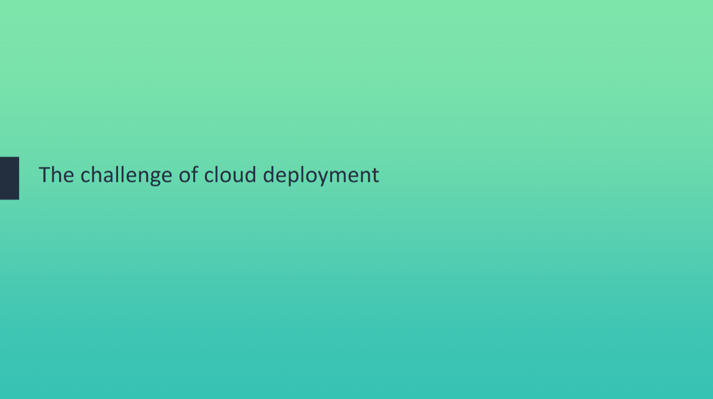

The challenge of cloud deployment. 

Before jumping into AWS CloudFormation, let’s discuss the potential issues that could come up when deploying in cloud environments.

## Challenges of Managing Cloud Infrastructure

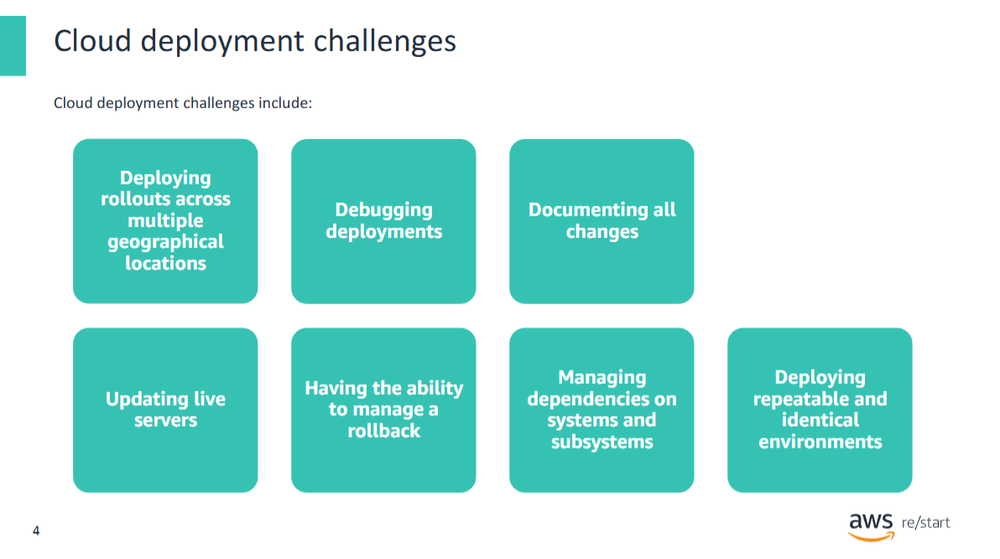

The **cloud** opens up many possibilities — but it also introduces important operational questions, such as:

- **How do you update servers** that have already been deployed into a production environment?
- **How do you consistently deploy infrastructure** across multiple AWS Regions in different geographical locations?
- **How do you roll back** a deployment that did not go as planned?  
  → In other words: how do you reclaim resources that were already created?
- **How do you test and debug** a deployment before rolling it out to production?
- **How do you manage dependencies** — not only on systems and technologies, but also on **entire subsystems**  
  (e.g. a website that depends on an underlying ecommerce infrastructure)?

---


Now that we’ve reviewed potential challenges, keep those in mind as we learn about AWS CloudFormation and think about how some of those challenges might be addressed.

## AWS CloudFormation Overview

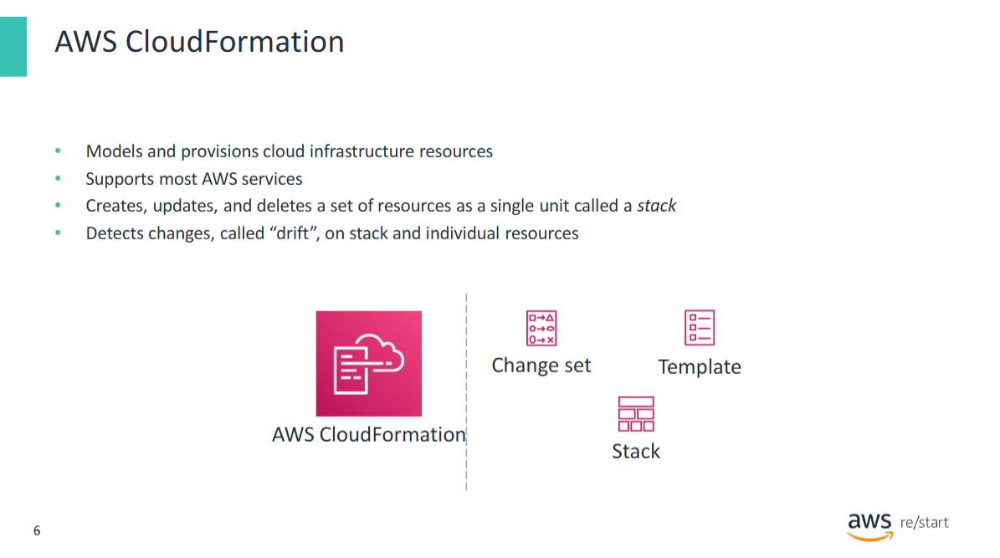

**AWS CloudFormation** enables you to **create and provision AWS infrastructure** in a **predictable and repeatable** way.

You can use AWS CloudFormation with various services, including:

- **Amazon EC2**
- **Amazon EBS**
- **Amazon SNS**
- **Elastic Load Balancing**
- **Auto Scaling**

### Template-Based Resource Management

- CloudFormation uses a **template file** to create and manage a collection of resources as a **single unit**, known as a **stack**.
- You can **create** and **delete** entire stacks with a single action.

---

### Out-of-Band Changes and Drift Detection

Although resources are managed through CloudFormation, users can still make changes **outside of CloudFormation** using the native service consoles.

**Example:**
- You update an EC2 instance in the **Amazon EC2 console**, even though it was created by a CloudFormation stack.

These external changes can:

- Be **accidental** or **intentional** (e.g. to handle urgent operational needs)
- **Complicate stack updates or deletions**

To address this, CloudFormation provides **drift detection**.

### Drift Detection

- Identifies **stack resources** whose configurations have changed **outside of CloudFormation**
- Helps ensure that your stack remains **synchronized** with its template definition

You can then:

- **Manually update drifted resources** to match the stack template
- Restore **consistency** and improve the success rate of future stack operations

---

## Templates and Stacks in AWS CloudFormation

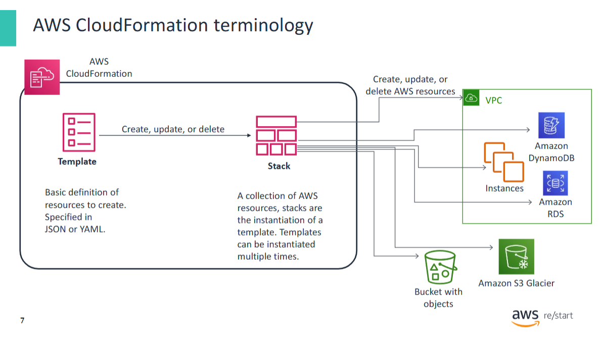

In AWS CloudFormation, two major terms are important to understand:

### Template

- A **template** is a **specification** of the AWS resources to be provisioned.
- It defines **what** should be created (e.g. EC2 instances, S3 buckets, IAM roles).

### Stack

- A **stack** is a **collection of AWS resources** that are created from a template.
- You can **provision a stack multiple times** from the same template.

---

### Stack Lifecycle

- When a **stack is provisioned**, AWS CloudFormation creates all resources defined in the template.
- **Billing starts** for each service as soon as the resources are created.
- When a **stack is deleted**, all associated resources are also deleted.
  - The **order of deletion** is automatically managed by AWS CloudFormation.
  - You **do not have control** over the deletion sequence.

> 📌 Understanding the relationship between templates and stacks is essential for predictable and manageable infrastructure deployment.

---

## Major Components of an AWS CloudFormation Template

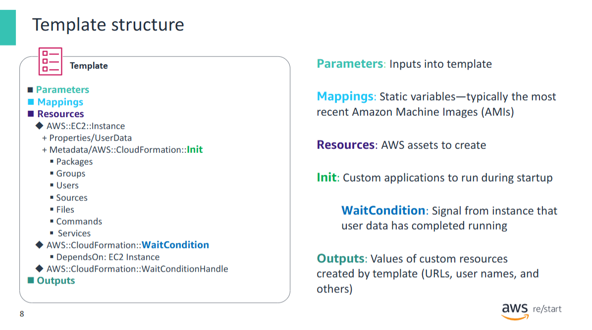

An AWS CloudFormation template is made up of several sections. Some are **optional**, while others are **required**. Here are the key components:

### Parameters *(Optional)*

- Contains **name-value pairs** provided by the user during stack creation.
- These values can be **referenced throughout the template**.
- Useful for creating **dynamic and reusable** templates.

### Mappings *(Optional)*

- Used to define **static key-value pairs**.
- Common use case: **Region-based AMI IDs**, which vary by location and change over time.

### Resources *(Required)*

- This is the **core section** of the template.
- Specifies the **AWS resources to be created**, such as:
  - **Amazon EC2**
  - **Amazon S3**
  - **Amazon VPC**
  - ...and many others
- You can define **dependencies and relationships** to control the **creation order** of resources.

### Init (Using `AWS::CloudFormation::Init`)

- Enables deployment of:
  - Applications
  - Files
  - Configuration data
- Runs on **EC2 instances** as part of the stack creation process.

### WaitCondition (Using `AWS::CloudFormation::WaitCondition`)

- Coordinates the creation of dependent resources.
- CloudFormation **waits** until certain operations (like `Init`) **signal completion**.
- Ensures that resources are created in the **correct sequence**.

### Outputs *(Optional)*

- Returns **string values** after the stack is created.
- Useful for displaying important information to users.
- Example: Output the **public DNS name** of a created EC2 instance used as a web server.

> 📌 Outputs can be especially helpful when referencing values in another stack or when sharing data across teams.

---

## Editing AWS CloudFormation Templates: Best Practices and Tools

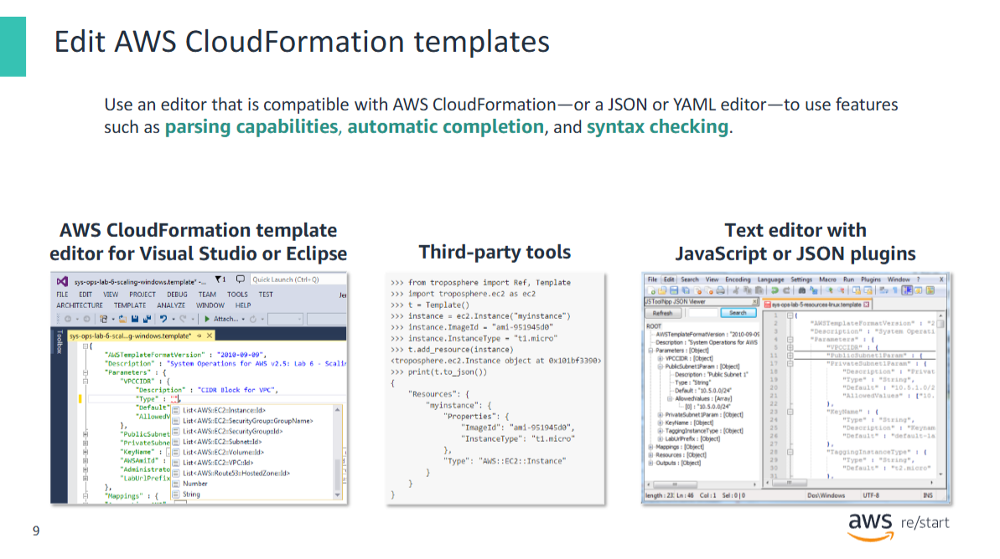

Although the **JSON** format has many advantages, it can be difficult to debug:

- A **missing or misplaced brace** can lead to syntax errors that are hard to find.
- A single mistake early in the file may cause errors that take significant time to resolve.

Similarly, **YAML** documents must be written with care — especially with respect to **spacing and indentation**.

---

### Recommended Tools

To simplify editing AWS CloudFormation templates, consider using tools with syntax support and validation:

#### IDEs with AWS Integration

- **Visual Studio** (with AWS Toolkit)
- **Eclipse** (with AWS Toolkit)

The **AWS Toolkit** for both editors adds:

- Support for **AWS CloudFormation syntax**
- **Parsing and formatting** capabilities
- **Auto-completion** for commands and keywords
- **Syntax checking**

#### Text Editors with Plugin Support

If you prefer working in lightweight editors:

- Tools like **Sublime Text**, **Notepad++**, and others support plugins for:
  - **JSON formatting**
  - **YAML validation**
  - **Syntax highlighting**

---

### Further Resources

- 📘 [Using the AWS CloudFormation Template Editor for Visual Studio](https://docs.aws.amazon.com/toolkit-for-visual-studio/latest/user-guide/cfn-editor.html)  
- 📘 [The AWS CloudFormation Template Editor for Eclipse](https://docs.aws.amazon.com/toolkit-for-eclipse/v1/user-guide/cfn-editor.html)

---

## AWS CloudFormation Designer

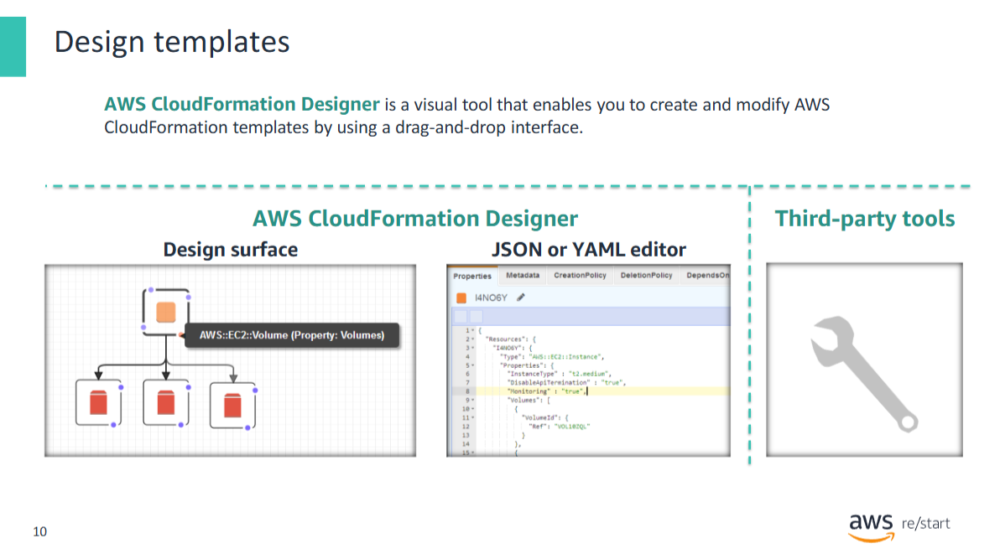

**AWS CloudFormation Designer** is a **visual tool** that allows you to **create and modify** CloudFormation templates using a **drag-and-drop interface**.

### Key Features

- Add, modify, or remove resources visually
- The underlying **JSON or YAML code is updated automatically**
- Supports **bidirectional editing** — changes in the visual editor reflect in the code, and vice versa

### Stack Updates

- If the template is associated with a **running stack**, you can **update the stack** so that it conforms to the modified template

### Third-Party Tools

In addition to the official CloudFormation Designer, there are also **third-party tools** available that assist in designing and editing CloudFormation templates.

> 📌 These tools may offer additional features like version control integration, collaboration support, or enhanced validation.

---

## Stack Rollbacks and Resource Retention in AWS CloudFormation

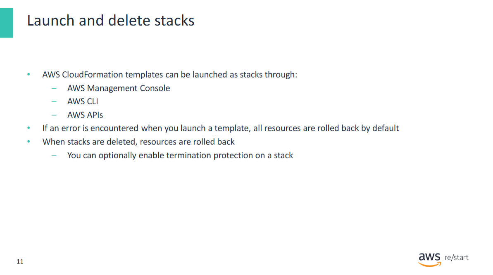

By default, if an **error occurs** during the launch of an AWS CloudFormation template, **all resources are rolled back**.

### Rollback Behavior

- AWS CloudFormation treats **stack resources as a single unit**.
- All resources must be **created or deleted successfully** for the stack operation to succeed.
- If a resource **fails to be created**, AWS CloudFormation:
  - **Rolls back** the stack
  - **Deletes any resources** that were already created during the operation
- If a resource **fails to be deleted**, AWS CloudFormation:
  - Leaves the remaining resources **intact**
  - Waits until the stack can be successfully deleted

You can **change the rollback behavior** using the **AWS CLI** by disabling the rollback option if needed.

---

### Preserving Specific Resources

To ensure that certain resources are **not deleted** during a rollback or stack deletion:

- **Amazon EBS Volumes**  
  → Set the `DeleteOnTermination` attribute to `False`

- **Any AWS Resource**  
  → Set the `DeletionPolicy` attribute to `Retain`

> 🔒 You can also **enable termination protection** on a stack to prevent accidental deletions.

---

#### Note

Some resources, such as **Amazon S3 buckets**, might not be deleted automatically due to additional constraints (e.g., containing objects).

---

## Using Parameters in AWS CloudFormation Templates

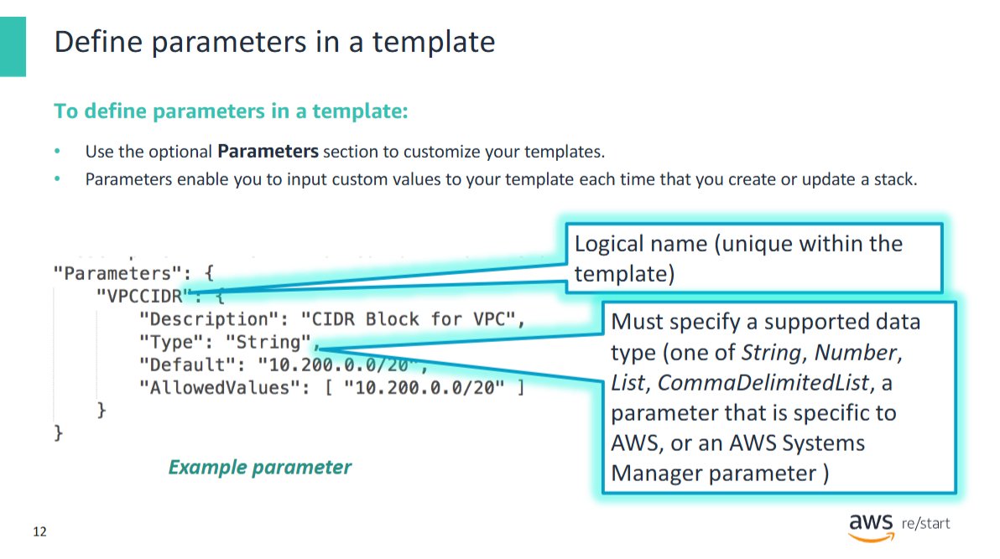

The optional **Parameters** section allows you to **customize your templates**.  
Parameters let you **input custom values** each time you create or update a stack.

### Example

In the example, the parameter is given the logical name **VPCCIDR**.  
The logical name must be **unique throughout the entire template**.

### Supported Parameter Types

AWS CloudFormation supports the following **parameter data types**:

- String  
- Number  
- CommaDelimitedList  
- AWS-specific parameter types  
- AWS Systems Manager (SSM) parameter types

### AWS-Specific Parameter Types

AWS-specific parameter types are particularly useful and user-friendly.

**Example:**  
If you use the type **AWS::EC2::KeyPair::KeyName**, and launch the stack in the **AWS Console**, it will render a **dropdown list** of all available EC2 key pairs in the account.

This helps prevent errors and simplifies selection of existing AWS resources.

---

📘 For more details, refer to the official documentation:  
[Parameters – AWS CloudFormation](https://docs.aws.amazon.com/AWSCloudFormation/latest/UserGuide/parameters-section-structure.html)

---

## Referencing Parameters in AWS CloudFormation Templates

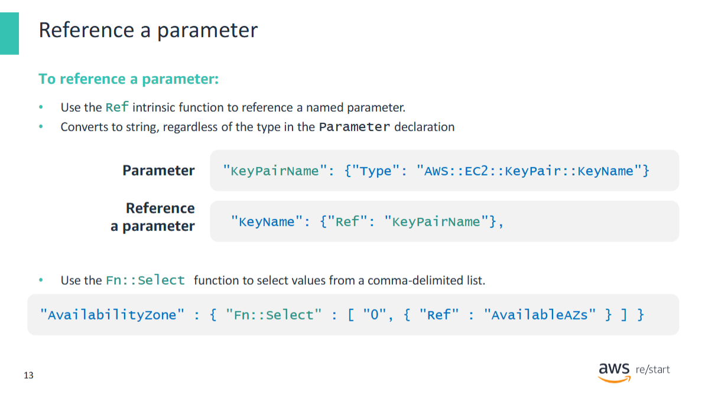

After you define a **parameter** in your template, you can reference it using the **Ref intrinsic function**.  
When you use **Ref**, AWS CloudFormation uses the **parameter's value** during stack provisioning.

Parameters can be referenced from both the **Resources** and **Outputs** sections of the same template.

### Example: Using Ref with KeyPairName

In the example, a parameter named **KeyPairName** is defined.  
- Its data type is **AWS::EC2::KeyPair::KeyName**.  
- Later, this parameter is referenced in the **Resources** section of the template.

When you choose to create a stack from this template using the **AWS Management Console**, a **dropdown list** will be rendered, showing all key pairs available in the account.  
You must select a key pair from the list before proceeding with the stack creation.

---

### Selecting a Value from a List: Fn::Select

Sometimes, you might need to refer to a specific value in a list.  
In such cases, use the **Fn::Select** intrinsic function in the **Resources** section.

- **Fn::Select** returns a single object from a list by its **index**.  
- For example, you can use it to return the **first value** from a list of **AvailableAZs**.

This approach is useful when working with dynamic values such as Availability Zones or predefined mappings.

---

## Referencing Resources Within a CloudFormation Template

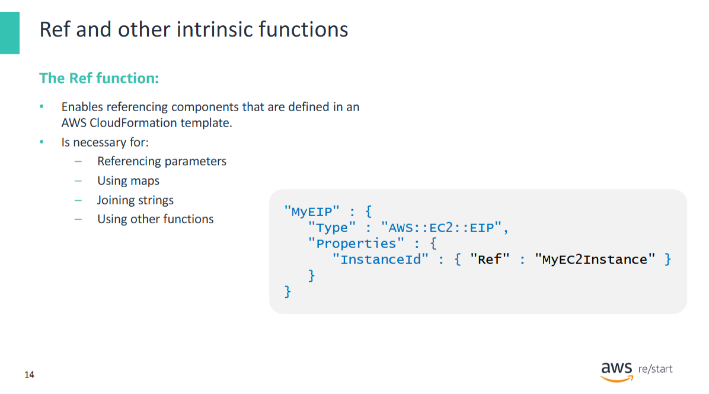

When writing AWS CloudFormation templates, a common question arises:  
**How do you reference one element of a template from another?**

### Example: EC2 Instance and Elastic IP

For example, how do you associate an **EC2 instance** with an **Elastic IP address** defined within the same template?

You can use the **Ref intrinsic function** to do this.  
In the example:

- An Elastic IP resource references an EC2 instance using `Ref`.
- This establishes a **relationship** between the two resources.

This same pattern can be used to associate:

- **Security groups** with EC2 instances
- **Route tables** with routes
- **EC2 instances** with subnets

---

### Important Considerations When Using Ref

Be aware that the **value returned by `Ref` depends on the resource type**:

- `Ref` on an **S3 bucket** returns the **bucket name**
- `Ref` on an **SQS queue** returns the **queue URL**
- `Ref` on an **EC2 instance** returns the **instance ID**

✅ Always ensure that the value returned is appropriate for the property where you're using it.

> In the EC2 + Elastic IP example, the `Ref` function correctly returns the **InstanceId**, which is required by the `AWS::EC2::EIP` resource's `InstanceId` property.

---

### Using Other Attributes: Fn::GetAtt

If you need to retrieve other **attributes** (not just the default `Ref` value), use the **`Fn::GetAtt` intrinsic function**.

---

### Further Reading

- 📘 [Ref – AWS CloudFormation Documentation](https://docs.aws.amazon.com/AWSCloudFormation/latest/UserGuide/intrinsic-function-reference-ref.html)
- 📘 [Fn::GetAtt – Retrieve Resource Attributes](https://docs.aws.amazon.com/AWSCloudFormation/latest/UserGuide/intrinsic-function-reference-getatt.html)
- 📘 [Intrinsic Function Reference](https://docs.aws.amazon.com/AWSCloudFormation/latest/UserGuide/intrinsic-function-reference.html)

---

## Using Pseudo Parameters with Ref

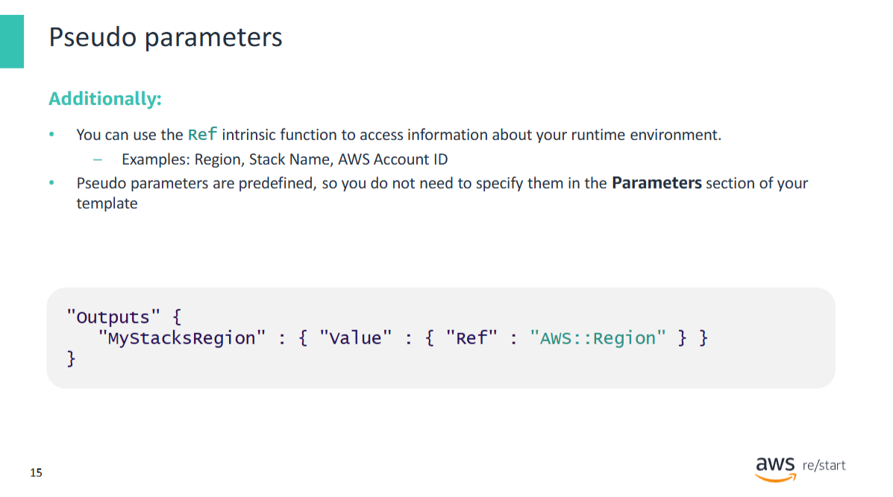

The **Ref intrinsic function** is also commonly used to access **runtime environment information** such as:

- The current **AWS Region**
- The **stack name**
- The **AWS account ID**

These values are made available through **pseudo parameters**.

### What Are Pseudo Parameters?

**Pseudo parameters** are predefined by AWS CloudFormation.  
- You **do not need to declare** them in your template.  
- You can use them just like any other parameter — as arguments to the **Ref function**.

### Example

A commonly used pseudo parameter is:

- **AWS::Region**  
  → This resolves to the **Region** in which the CloudFormation stack is being created.

This allows you to build **Region-aware templates** without hardcoding values.

---

### Further Reading

📘 For more information, see the official documentation:  
[Pseudo Parameters Reference – AWS CloudFormation](https://docs.aws.amazon.com/AWSCloudFormation/latest/UserGuide/pseudo-parameter-reference.html)

---

## Using the Mappings Section in AWS CloudFormation

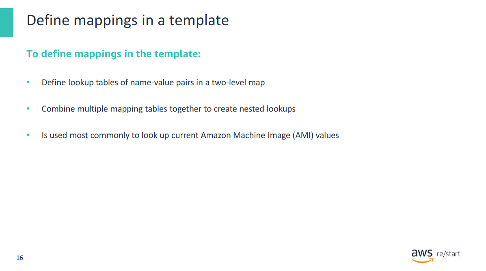

One of the optional sections in a CloudFormation template is the **Mappings** section.

A **mapping** matches a **key** to a corresponding set of **named values**.

### Example Use Case: Region-Based Values

Suppose you want to assign different values depending on the **AWS Region**.  
You can create a **mapping** that:

- Uses the **Region name** as a key
- Contains specific values for each Region (e.g. different AMI IDs)

To retrieve values from a mapping, use the **Fn::FindInMap** intrinsic function.

---

### Typical Use: AMI IDs

**Mappings** are commonly used to refer to the **AMI IDs** for different Regions because:

- **AMI IDs differ by Region**
- They change **frequently** as new versions are released

---

### Important Limitations

- You **cannot** include:
  - Parameters
  - Pseudo parameters
  - Intrinsic functions  
in the **Mappings** section.

---

### Further Reading

📘 For more information, see:  
[Mappings – AWS CloudFormation Documentation](https://docs.aws.amazon.com/AWSCloudFormation/latest/UserGuide/mappings-section-structure.html)

---

## Example: Using Mappings with Fn::FindInMap

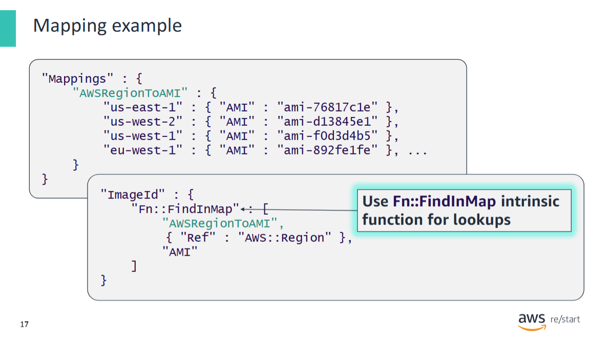

The following example illustrates how to use the **Mappings** section in a CloudFormation template.

### Mappings Section

A map named **AWSRegionToAMI** is defined. It contains:

- **Four keys**, each representing an **AWS Region name**
- Each key maps to a **name-value pair** with a **single string value** — the **AMI ID** for that Region

This is useful for deploying resources across multiple Regions while ensuring that the correct AMI is used in each.

### Using Fn::FindInMap

In the **Resources** section of the template, the intrinsic function **Fn::FindInMap** is used to look up the appropriate AMI ID from the mapping.

- It uses the pseudo parameter **AWS::Region** to dynamically resolve the Region during stack creation.
- The result is the correct AMI ID for the Region in which the stack is being launched.

---

📘 For more information, refer to the documentation:  
[Mappings – AWS CloudFormation](https://docs.aws.amazon.com/AWSCloudFormation/latest/UserGuide/mappings-section-structure.html)

---

## The Resources Section in AWS CloudFormation

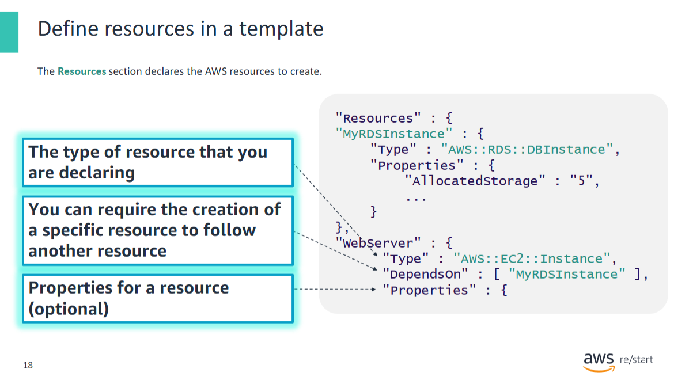

The **Resources** section is a **required** part of every AWS CloudFormation template.

It declares the **AWS resources** that you want to include in your stack, such as:

- **EC2 instances**
- **S3 buckets**
- **RDS databases**
- ...and many more

### Declaring Resources

- Each resource must be **declared separately**
- You can specify **multiple resources of the same type**
- When using JSON, separate multiple resources with **commas**

### Example Scenario

In the example:

- Two resources are created:
  1. An **Amazon RDS** instance
  2. An **EC2 instance** named **WebServer**
- The EC2 instance has a **dependency** on the RDS instance  
  → The database must be available **before** the web server application starts

### Resource Creation Order

While AWS CloudFormation performs some **automatic sequencing**, it is best to **explicitly define dependencies** using the `DependsOn` attribute.

This helps:

- Ensure **correct creation order**
- Avoid **unexpected errors**
- Improve template **clarity and reliability**

---

📘 For more information, refer to the official documentation:  
[Resources – AWS CloudFormation](https://docs.aws.amazon.com/AWSCloudFormation/latest/UserGuide/resources-section-structure.html)

---

## Using AWS::CloudFormation::Init with cfn-init

To configure EC2 instances during stack creation, you can use the **`AWS::CloudFormation::Init`** metadata resource along with the **`cfn-init`** helper script.

### What It Does

- The `cfn-init` script reads instance **metadata** that is defined under the `AWS::CloudFormation::Init` key.
- This metadata allows you to:
  - Install packages
  - Create files and users
  - Run commands
  - Configure services

---

### Linux and Windows Support

- `cfn-init` supports **all metadata types** on **Linux systems**.
- On **Microsoft Windows**, support is available with some **limitations and conditions** (see AWS documentation for details).

---

### Example Use Case

For **Amazon EC2 instances**:

- Include the `AWS::CloudFormation::Init` metadata in the resource declaration.
- Call `cfn-init` from the EC2 user data to process the configuration.

**Example resource snippet**:

```json
"MyInstance": {
  "Type": "AWS::EC2::Instance",
  "Metadata": {
    "AWS::CloudFormation::Init": {
      "webapp-config": {
        "packages": {},
        "sources": {},
        "files": {},
        "groups": {},
        "users": {},
        "commands": {},
        "services": {}
      }
    }
  }
}
```
> 📘 This snippet shows how to define various configuration blocks (packages, commands, etc.) under a named config set (`webapp-config`).

### Amazon ECS Use Case

For **Amazon ECS instances**:

- Start with an **Amazon ECS-optimized AMI** provided by AWS.
- Use **cfn-init** with CloudFormation metadata to:
  - Install additional packages
  - Run configuration commands
  - Apply updates as needed

✅ This process is **declarative**, **updatable**, and aligns with best practices for **infrastructure automation**.

---

#### Further Reading

- 📘 [cfn-init documentation](https://docs.aws.amazon.com/AWSCloudFormation/latest/UserGuide/cfn-init.html)
- 📘 [AWS::CloudFormation::Init reference](https://docs.aws.amazon.com/AWSCloudFormation/latest/UserGuide/aws-resource-init.html)
- 📘 [Deploying applications on Amazon EC2 with CloudFormation](https://docs.aws.amazon.com/AWSCloudFormation/latest/UserGuide/deploying.applications.html)
- 📘 [Bootstrapping Windows stacks](https://docs.aws.amazon.com/AWSCloudFormation/latest/UserGuide/cfn-helper-scripts-reference.html#windows)

---

## Choosing Between CloudFormation::Init and User Data

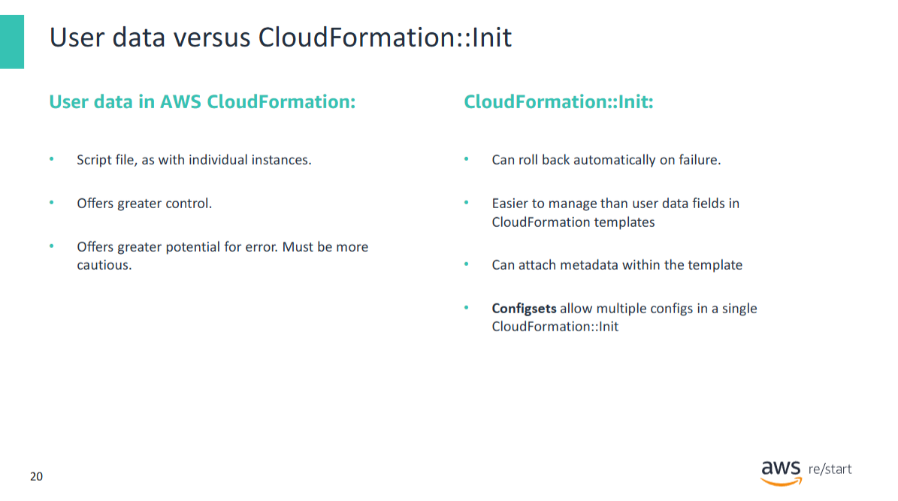

To configure an EC2 instance in AWS CloudFormation, you can choose between two main approaches:

- **`AWS::CloudFormation::Init`**
- **User data**

### User Data

**Advantages:**

- Offers **greater control** over the **order of operations**
- Supports **robust error handling** and **recovery**
- Scripts can be written in standard programming languages (e.g. Bash, PowerShell) with **loops** and **conditionals**

**Disadvantages:**

- Special characters (like double quotes `"` or newlines) must be **escaped** properly  
- This makes user data harder to maintain within a CloudFormation **JSON or YAML** template

**Tip:**  
To simplify maintenance, place your user data logic in a **separate script** and call it using `AWS::CloudFormation::Init`. This approach makes your template cleaner and easier to maintain.

---

### Using Config Sets with cfn-init

You can create **multiple config sets** and call them using your `cfn-init` script.

- Each **config set** can include:
  - A list of **config keys**
  - References to **other config sets**

**Benefits of Config Sets:**

- Enable easier **reuse of configuration code**
- Help standardize setup procedures across teams or environments

**Example Use Case:**

- Define a **default config set** for web servers that installs **Apache** and **PHP**
- Use this across multiple stacks instead of repeating installation in every user data script or AMI

---

> ✅ It's recommended to experiment with different instance initialization methods and standardize on a consistent approach within your organization.

---

## Signaling EC2 Instance Readiness with WaitCondition

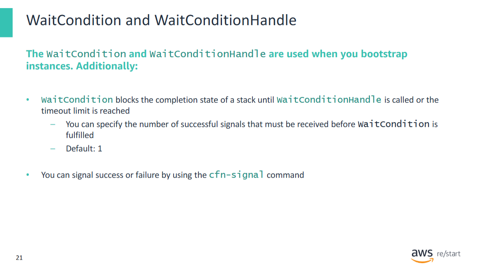

For AWS, an **EC2 instance** is considered _ready_ when it passes its **status checks**.  
However, passing status checks does **not necessarily mean** that the instance has completed all expected **installations or configurations**.

For example:

- The instance might still be installing software via **user data** or `cfn-init`
- It could be setting itself up as a **database server**, **SharePoint server**, or **data processing node**

### Using `WaitCondition`

To ensure AWS CloudFormation waits until your instance is **fully initialized**, use a `WaitCondition`.

> 🛑 A `WaitCondition` acts like a **stop sign**  
> It prevents AWS CloudFormation from marking the stack as _complete_ until it receives a signal that setup has finished.

### How It Works

- A `WaitConditionHandle` is a **textual representation** of the WaitCondition.
- Your instance initialization script (via **user data** or `CloudFormation::Init`) must explicitly send a signal using `cfn-signal`.

```bash
cfn-signal --exit-code 0 --resource MyInstanceWaitCondition --stack my-stack --region us-east-1
```
- Success Signal
→ AWS CloudFormation proceeds to create the next resource or completes the stack.
- Failure Signal or Timeout
→ AWS CloudFormation rolls back the stack (by default), deleting created resources.

### Best Practice

Use `cfn-signal` at the **end of your setup process** to confirm that all expected **services**, **configurations**, and **applications** are installed and running correctly.

---

📘 For more information, refer to the [cfn-signal documentation](https://docs.aws.amazon.com/AWSCloudFormation/latest/UserGuide/cfn-signal.html)

---

## Example: WaitCondition and cfn-signal in AWS CloudFormation

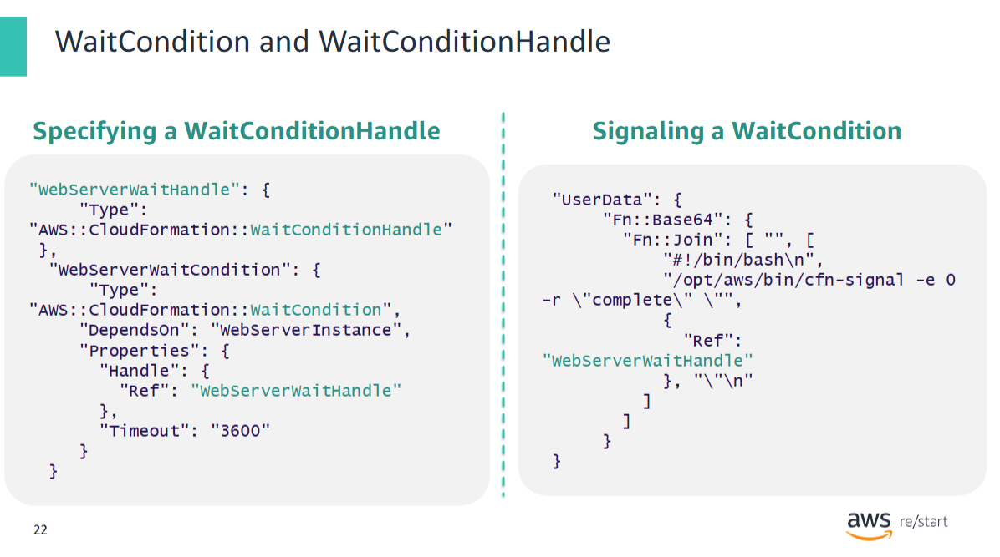

The example section of an **AWS CloudFormation template** defines a `AWS::CloudFormation::WaitConditionHandle` resource that is named `WebServerWaitHandle`.

Further down in the same JSON snippet, an `AWS::CloudFormation::WaitCondition` is defined, called `WebServerWaitCondition`. This WaitCondition **waits for a signal** sent to the associated `WaitConditionHandle`.

On the other side, the example **`UserData` section** of an `AWS::EC2::Instance` resource contains a script that:

- **Invokes** the `cfn-signal` command
- **References** the `WebServerWaitHandle`

Once the `UserData` script **finishes executing**, the `WaitConditionHandle` is **fulfilled**, and AWS CloudFormation can proceed with the stack creation process.

> 📘 This setup ensures that the EC2 instance completes its initialization tasks (like software installations) before the CloudFormation stack continues.

---

## Outputs Section in AWS CloudFormation


The `Outputs` section is an **optional** part of an AWS CloudFormation template. It returns **string values** that were created by the template and that may be useful for users.

### Common Use Case

For example, if you create an EC2 instance that functions as a **public web server**, you might want to output the **public DNS name** of that instance.

Another common example:  
You define an **Elastic Load Balancer** in the `Resources` section and use the `Outputs` section to return its **DNS name**.  
This allows users to easily locate the URL of the deployed application.

---

### Where You Can See Outputs

- **AWS Console**: After stack deployment, outputs are visible in the **"Outputs" tab**.
- **AWS CLI / API**: You can also retrieve output values **programmatically**.

> 📝 Outputs are especially useful for referencing key resources, simplifying post-deployment steps, and chaining stacks together.

---

## Stack Failure Behavior and Protection in AWS CloudFormation

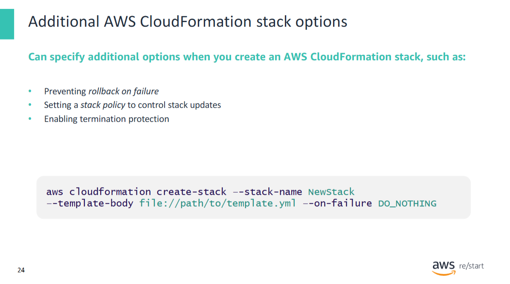

By default, **AWS CloudFormation rolls back** all changes when a stack fails to complete successfully.  
However, you can **override this behavior** and apply additional protections using stack policies.

---

### Overriding Default Rollback Behavior

When creating a stack via CLI or SDK, you can define how AWS CloudFormation behaves on failure.  
Valid options for failure behavior are:

- `DO_NOTHING`
- `ROLLBACK` (default)
- `DELETE`

> ⚠️ You can specify **either** `--on-failure` **or** `--disable-rollback`, but not both.

**Example:**

```bash
aws cloudformation create-stack \
  --stack-name my-stack \
  --template-body file://template.json \
  --on-failure DO_NOTHING
```
In this example, `DO_NOTHING` ensures that any resources created remain intact, even if the stack fails.

### Stack Policies

By default, all update actions are allowed on all resources in a stack.

To **prevent unintended updates or deletions**, you can apply a **stack policy** that:

- Restricts updates to specific resources  
- Protects critical infrastructure components

This is especially useful in **collaborative** or **production environments**.

---

### Termination Protection

You can also **prevent a stack from being accidentally deleted** by enabling **termination protection**.

- If enabled, any attempt to delete the stack **fails**.
- The stack and its state remain **unchanged**.

**To enable termination protection:**

```bash
aws cloudformation update-termination-protection \
  --stack-name my-stack \
  --enable-termination-protection
```
> 📘 Useful for production stacks and critical infrastructure.

---

## Handling Update Rollback Failures in AWS CloudFormation

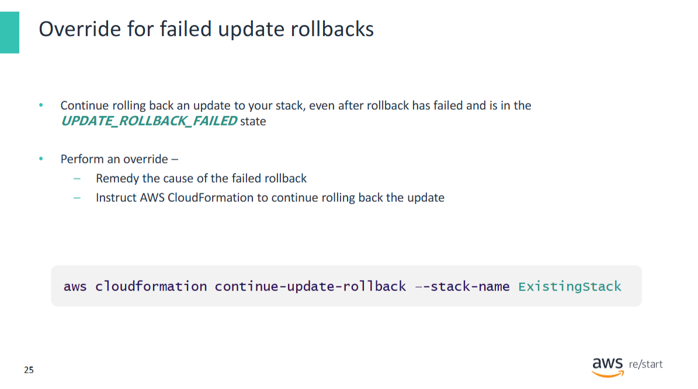

You can instruct **AWS CloudFormation** to continue rolling back an update to your stack even after the rollback has **failed**.

### Common Causes of a Failed Rollback

- Resources changed **outside of AWS CloudFormation**
- **Insufficient permissions**
- **Limitation errors**
- **Unstable resources** or failed dependencies

A stack enters the `UPDATE_ROLLBACK_FAILED` state when AWS CloudFormation **cannot roll back all changes** during an update.

📌 **Example:**  
You attempt to roll back to a database instance that was **manually deleted**, so AWS CloudFormation cannot restore it.

---

### How to Continue the Rollback

After resolving the root cause of the failure, you can **instruct CloudFormation to continue the rollback**:

- **AWS Management Console:** Use the stack's action menu
- **AWS CLI:**

```bash
aws cloudformation continue-update-rollback \
  --stack-name your-stack-name
```

#### 📘 Further Reading
[CLI Reference – continue-update-rollback](https://docs.aws.amazon.com/cli/latest/reference/cloudformation/continue-update-rollback.html)
[Continue Rolling Back an Update – AWS Documentation](https://docs.aws.amazon.com/AWSCloudFormation/latest/UserGuide/using-cfn-updating-stacks-continueupdaterollback.html)

---

## AWS CloudFormation Change Sets

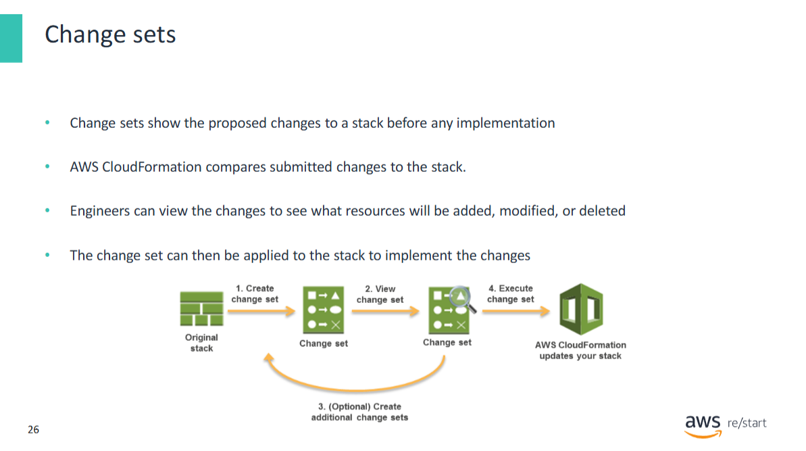

**Change sets** allow engineers to understand exactly what will happen to a stack **before** implementing any changes.  
This ensures that **all updates, changes, and deletions** are clearly identified **prior to execution**.

### Why Use Change Sets?
- Prevent unintended modifications
- Understand resource impact before deployment
- Improve collaboration and review processes

---

### Steps to Create and Use a Change Set

1. **Create changes** for the target stack  
   → AWS CloudFormation generates a **change set** based on the differences.

2. **Review the change set**  
   → Analyze the proposed actions (add, modify, delete).

3. **Make additional changes if needed**  
   → Repeat **Step 1** and **Step 2** until the change set is satisfactory.

4. **Execute the change set**  
   → Apply the changes to your stack.

---

#### 📘 Notes
- Change sets are especially useful in **production environments**.
- They help you **avoid downtime** or **unexpected behavior** from unintended changes.

---

## AWS CloudFormation – Best Practices

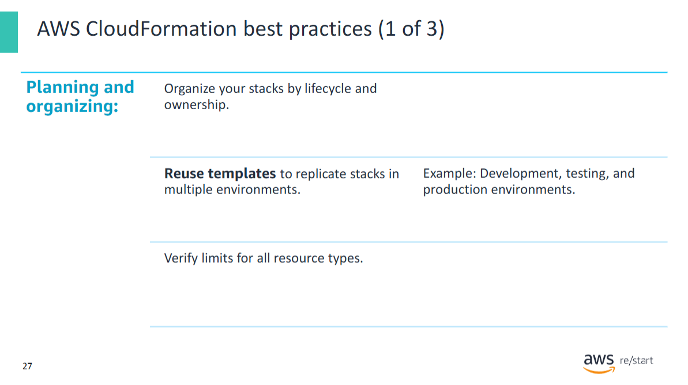

These best practices help you use **AWS CloudFormation** more effectively and securely.

---

### Planning and Organizing Your Stacks

- **Use resource lifecycle and ownership**  
  → Group resources in stacks based on common lifecycle and ownership.  
  → Smaller, focused stacks are easier to manage, update, and troubleshoot.

- **Reuse templates across environments**  
  → Use the same template to deploy environments such as **development**, **testing**, and **production**.  
  → Helps ensure consistency and enables safe testing before deploying to production.

- **Verify quotas for all resource types**  
  → Ensure that your stack will not exceed any **AWS service quotas** (formerly limits).  
  → Especially important for **EC2 instance types**, **EBS volumes**, and **Elastic IPs**.

---

### Manage Resource Limits

- Use **AWS Trusted Advisor** to monitor your account's limits and request increases where necessary.
- Watch out for:
  - **EC2 instance limits**
  - **Elastic IP limits**
  - **CloudFormation stack limits** (e.g., max number of resources per stack)

---

### Use AWS Organizations with CloudFormation

- Ensure **IAM policies and organizational controls** are applied consistently across accounts.
- Use **CloudFormation StackSets** to deploy templates across multiple AWS accounts and Regions with organizational governance.

---

📘 For more, refer to the [AWS CloudFormation Best Practices Guide](https://docs.aws.amazon.com/AWSCloudFormation/latest/UserGuide/best-practices.html).

---

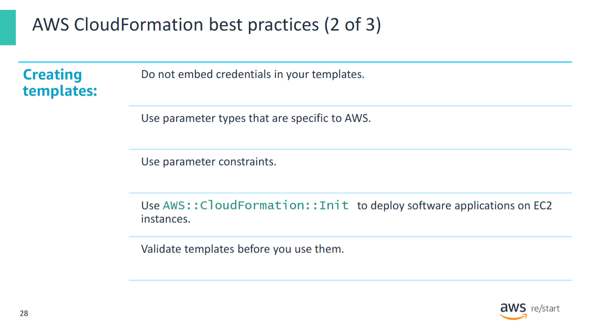

### Avoid Hardcoding Credentials
- **Do not embed credentials** (e.g., access keys, secrets) directly in templates.
- ✅ Use **input parameters** to pass sensitive information when creating or updating stacks.

### Use AWS-Specific Parameter Types
- Use AWS-specific types like `AWS::EC2::KeyPair::KeyName`, `AWS::SSM::Parameter::Value<String>`, etc.
- ✅ Enables CloudFormation to **validate inputs** automatically before stack creation.

### Apply Parameter Constraints
- Use `AllowedValues`, `MinLength`, `MaxLength`, `AllowedPattern`, etc.
- ✅ Helps catch invalid input early and improve **template robustness**.

### Use `AWS::CloudFormation::Init` for Software Deployment
- Declaratively describe **software configuration and installation** steps.
- Avoid complex, error-prone procedural scripts (like bash inside UserData).
- ✅ Enables easier **maintenance and consistency** across environments.

### Validate Templates Before Use
- Use the `aws cloudformation validate-template` command.
- ✅ Detect **syntax and semantic errors** before any resources are provisioned.

---

📘 For full documentation, refer to [AWS CloudFormation Template Anatomy](https://docs.aws.amazon.com/AWSCloudFormation/latest/UserGuide/template-anatomy.html)

---


### Manage All Resources Through CloudFormation
- Always use the **CloudFormation console, CLI, or API** to update stack resources.
- ❗ Avoid making changes to resources outside of CloudFormation.
- ✅ Prevents **drift** between template and actual infrastructure, which can cause stack update or deletion errors.

### Create Change Sets Before Updating
- Use **Change Sets** to preview how updates will impact your running stack.
- ✅ CloudFormation **won’t apply changes** until you explicitly execute the change set.
- 🧠 Useful for planning updates with confidence.

### Use Stack Policies
- Apply **Stack Policies** to protect critical resources from unintended updates.
- ✅ Prevents accidental replacement or modification during stack updates.

### Use AWS CloudTrail for Logging
- Enable **CloudTrail** to log all CloudFormation API calls.
- ✅ Gain full visibility over who did what and when.
- Logs can be sent to an S3 bucket for **auditing and compliance** purposes.

### Use Version Control and Code Reviews
- Store your CloudFormation templates in **version-controlled repositories** (e.g. Git).
- ✅ Facilitates **code reviews, collaboration, and rollbacks**.
- Helps track template changes over time and link them to stack behavior.

---

📘 **Tip:** Use tools like GitHub, GitLab, or Bitbucket together with CI/CD pipelines to automate deployment and maintain a robust infrastructure-as-code workflow.

---

## Key takeaways

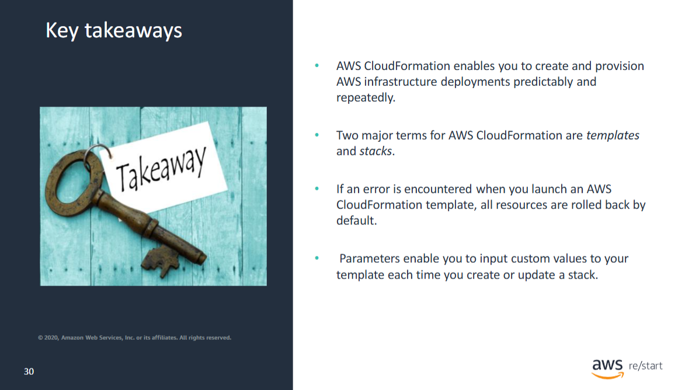


#### What is AWS CloudFormation?

AWS CloudFormation allows you to create and provision AWS infrastructure **predictably and repeatedly**.

---

#### Core Terms

##### 🔹 Templates
- A **template** defines the AWS resources to be created.

##### 🔹 Stacks
- A **stack** is a collection of resources created from a template.
- You can create multiple stacks from the same template.

---

#### Deployment Errors

- If an error occurs when launching a stack, **CloudFormation automatically rolls back all resources** by default.
- This ensures you don’t end up with incomplete or faulty infrastructure.

---

#### Parameters

- **Parameters** allow you to input custom values into your template each time you **create or update a stack**.
- They make your templates **more flexible and reusable**.

---

[](https://youtu.be/PcBQY2jZ7sg?si=aKST4krbfFNgRoKE)

