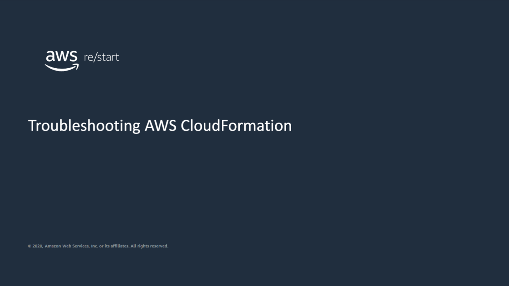
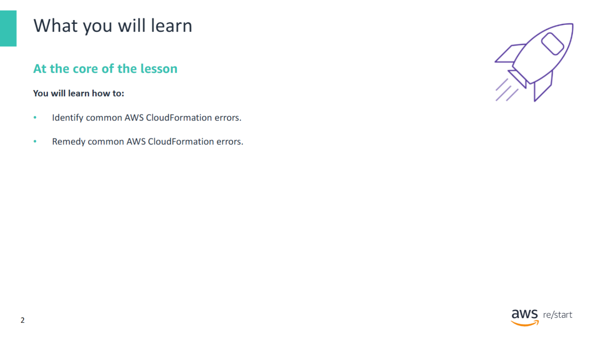
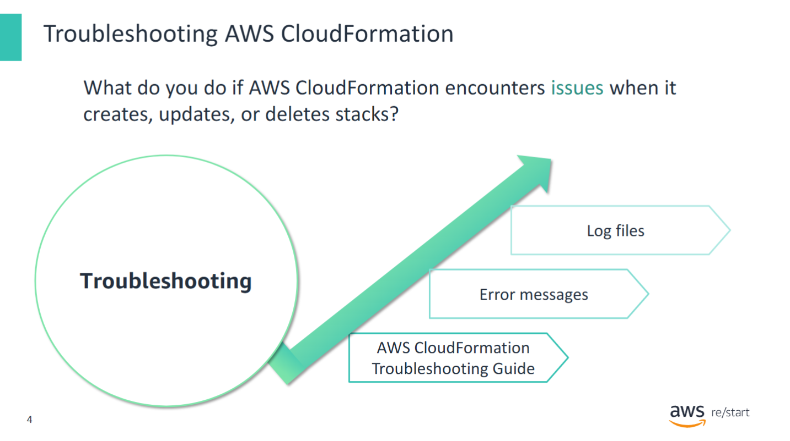
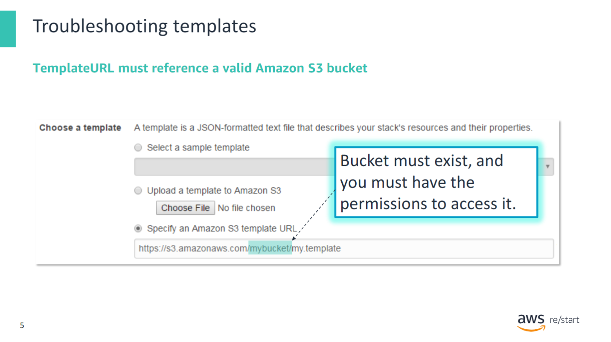
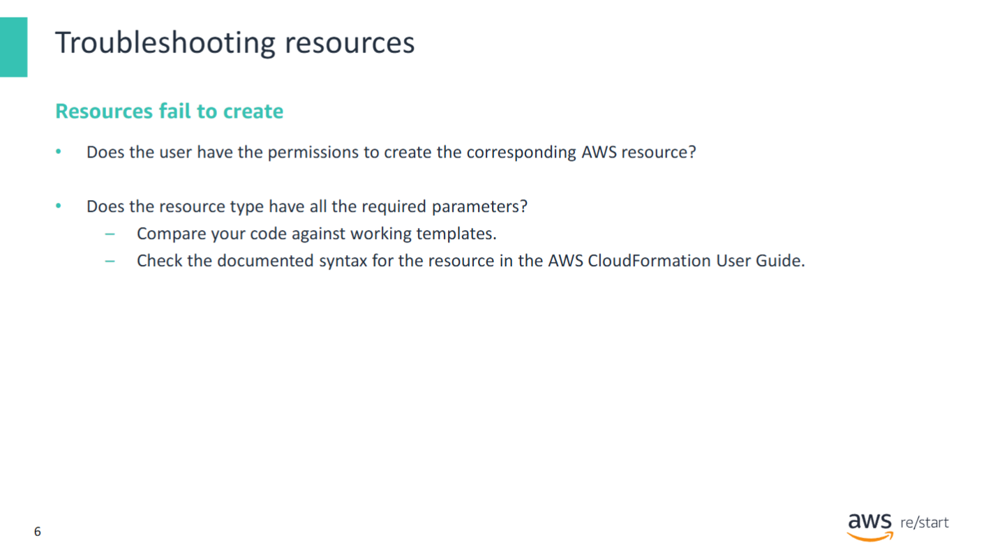
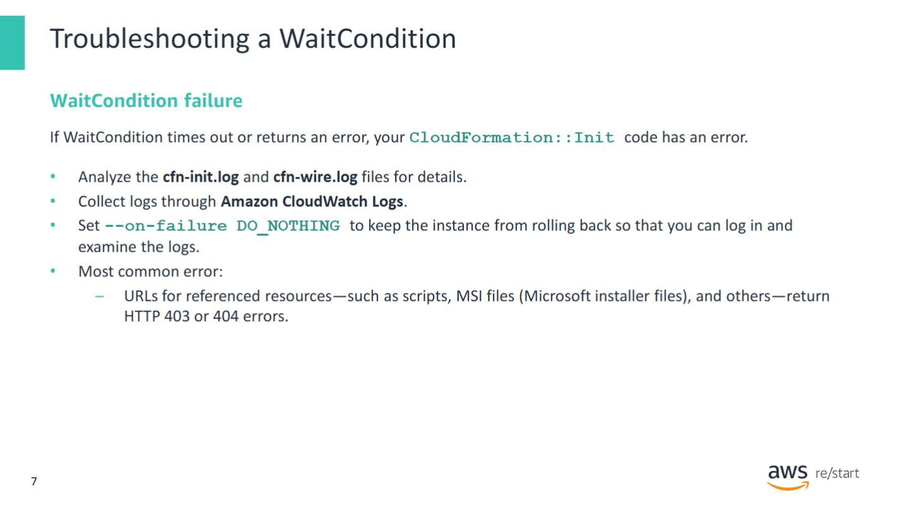
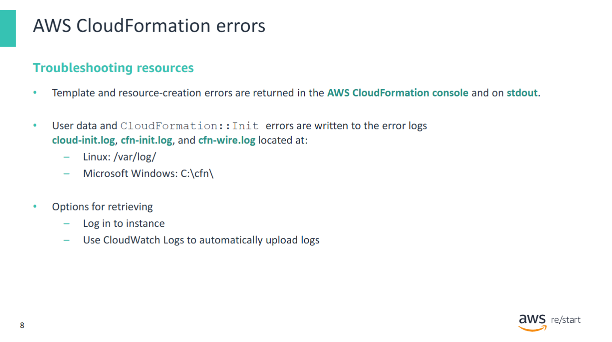
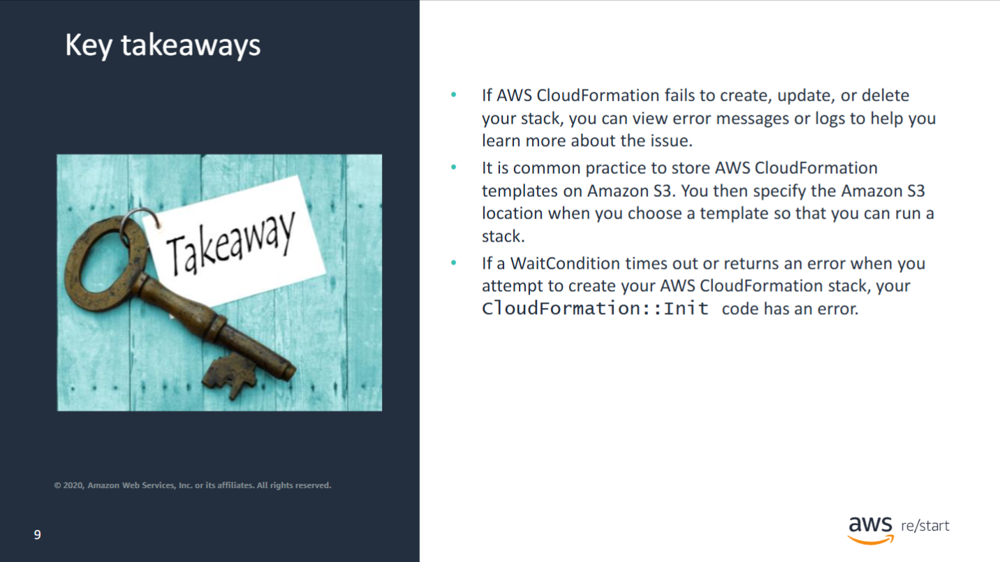

This module discusses how to troubleshoot common types of AWS CloudFormation errors.



In this module, you will learn how to:
- Identify common AWS CloudFormation errors.
- Remedy common AWS CloudFormation errors.

---


Troubleshooting AWS CloudFormation.

---

## Troubleshooting AWS CloudFormation



If **AWS CloudFormation fails** to create, update, or delete your stack, you can view error messages or logs to help understand and fix the issue.

### Where to Start?

#### 📘 AWS CloudFormation Troubleshooting Guide
- This guide offers troubleshooting advice — from **general steps** to **service-specific guidance**.
- A recommended first step is to **check error messages** in the **AWS CloudFormation Console**.

---

### EC2-Specific Errors

If the error occurred on an **Amazon EC2 instance**:
- Log in to the instance.
- Check the following log files:
  - `/var/log/cloud-init.log`
  - `/var/log/cfn-init.log`
  - `/var/log/cfn-init-cmd.log`
  - `/var/log/cfn-wire.log`

These logs can provide **detailed insights** into what went wrong during provisioning or initialization.

## Storing CloudFormation Templates in Amazon S3



It is a common practice to **store AWS CloudFormation templates** in **Amazon S3**.

### Using the Template

- You specify the **Amazon S3 URL** (`TemplateURL`) when launching a stack.
- This allows AWS CloudFormation to **retrieve and run the template** directly from S3.

### Common Error

If you receive the error:
```
TemplateURL must reference a valid S3 bucket
```

### Troubleshooting Steps

- **Ensure that the S3 bucket exists.**
- **Check your IAM permissions** — make sure you have access to read from the bucket.
- **Verify the S3 URL format** is correct (must be a public or presigned URL if accessed from outside your account).

For example:
```
https://s3.amazonaws.com/my-bucket-name/my-template.yaml
```
---

## Troubleshooting: Resource Creation Failures in AWS CloudFormation



If you attempt to create an **AWS CloudFormation** stack from a template and encounter an error indicating that a resource failed to create, consider investigating the following:

### 1. Check IAM Permissions

- **Does the user have permission to create the resource?**
- Review the **IAM policy** assigned to the user or role.
- Ensure that the user has the correct **level of access** for the AWS service related to the resource.

### 2. Verify Required Parameters

- Make sure that the **resource definition** in the template includes all **required parameters**.
- Review the relevant **JSON or YAML** code section for the resource.
- Compare it with **working examples** of the same resource type.

### 3. Use the AWS CloudFormation Documentation

Refer to the **AWS CloudFormation User Guide** for the correct resource syntax.

For example:

- For EC2 instance resources, check the [AWS::EC2::Instance](https://docs.aws.amazon.com/AWSCloudFormation/latest/UserGuide/aws-properties-ec2-instance.html) documentation.

By carefully reviewing permissions and template syntax, most resource creation errors can be identified and resolved.

---

## Troubleshooting WaitCondition Failures in AWS CloudFormation



Recall that **WaitConditions** are often used when an **EC2 instance** resource is created. If a `WaitCondition` **times out** or **returns an error** when you attempt to create your AWS CloudFormation stack, it typically indicates a problem with your `CloudFormation::Init` configuration.

### Diagnostic Steps

- If the **EC2 instance is still accessible**, analyze the following log files:
  - `/var/log/cfn-init.log`
  - `/var/log/cfn-wire.log`

- ✅ You can configure **Amazon CloudWatch Logs** to automatically collect these logs from the instance.

- 📌 Retry the `create-stack` command with the `--on-failure DO_NOTHING` flag to **prevent rollback**, allowing you to log in and investigate the issue.

```bash
aws cloudformation create-stack \
  --stack-name my-stack \
  --template-body file://mytemplate.yaml \
  --on-failure DO_NOTHING
```

### Common Error

The **most frequent issue** is with inaccessible resources:
- Resources referenced in `CloudFormation::Init` (like scripts, MSI files, etc.) return:
    - **HTTP 403** – Access denied
    - **HTTP 404** – File not found

➡️ These errors mean the instance **cannot access the referenced files**, which blocks the stack creation.

#### Tip

Ensure that:
- All referenced files are publicly accessible (if stored in S3, check bucket policy and object ACL).
- URLs are correct and reachable from the EC2 instance.

For deeper debugging, always keep rollback disabled until the issue is resolved.

---

# 🛠️ Troubleshooting AWS CloudFormation Stack Failures

If **AWS CloudFormation** fails to create, update, or delete your stack, you can view **error messages or logs** to help understand the issue.

---

## General Troubleshooting Methods



### 1. AWS CloudFormation Console
- Check the **stack status**.
- Use the **Events tab** to see a chronological list of stack operations.
- Look for the **event that failed** — it will contain:
  - The resource that failed
  - The **Status Reason** field with error messages from CloudFormation or the underlying AWS service

---

### 2. Instance-Level Logs (for EC2)

#### Linux EC2 Instances
- Log in to the instance
- Review logs in:
  - `/var/log/cloud-init.log`
  - `/var/log/cfn-init.log`
  - `/var/log/cfn-wire.log`

#### Windows EC2 Instances
- Check logs in:
  - `C:\cfn\log`
  - `%ProgramFiles%\Amazon\EC2ConfigService\Logs`

These logs capture processes and command outputs while CloudFormation configures the instance.

---

### 3. Amazon CloudWatch Logs Integration
- You can configure your template to **send logs to CloudWatch Logs**
- ✅ **Benefit**: No need to SSH or RDP into the instance
- Logs are visible directly in the **AWS Management Console**

---

#### 📘 Further Reading

Refer to the [**Troubleshooting AWS CloudFormation**](https://docs.aws.amazon.com/AWSCloudFormation/latest/UserGuide/troubleshooting.html) documentation for in-depth help.

## Key Takeaways



- If **AWS CloudFormation** fails to **create, update, or delete** your stack, you can view **error messages or logs** to help you understand the issue.

- It is a common practice to **store AWS CloudFormation templates on Amazon S3**.  
  You then specify the **Amazon S3 location (TemplateURL)** when launching a stack.

- If a **WaitCondition** times out or returns an error when you attempt to create your AWS CloudFormation stack, it typically indicates an error in your `CloudFormation::Init` code.
