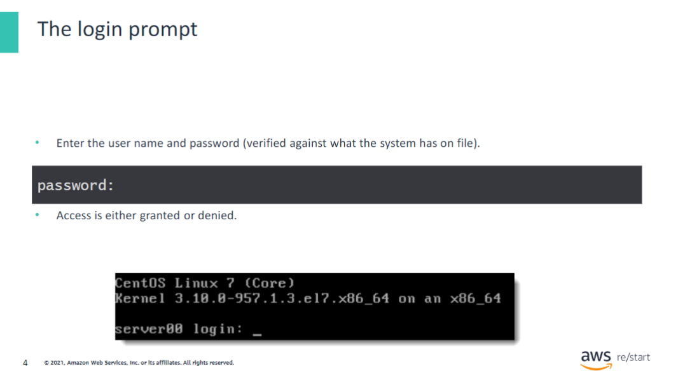
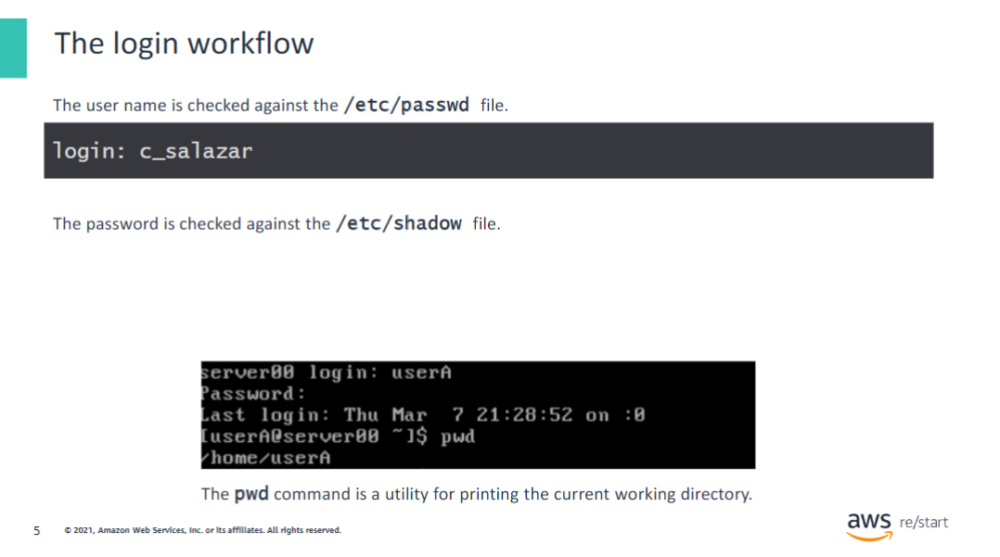
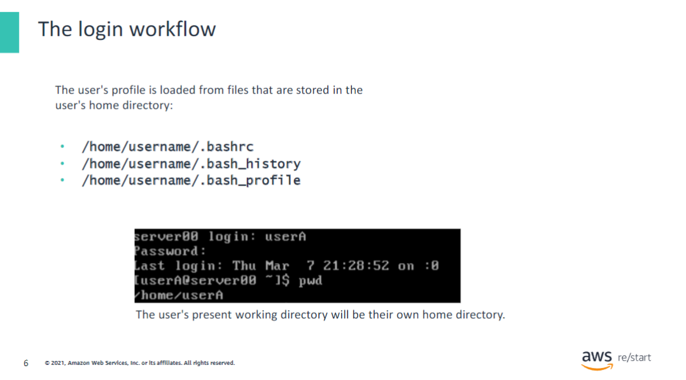

## Linux login workflow

## The login prompt

After a network connection is made, you can connect by using a program like PuTTY or by using the terminal on macOS. You will encounter the login prompt. All Linux sessions begin with the login process (default authentication process). Linux sessions start with the user entering their username at the prompt. The login prompt is used to authenticate (prove the user’s identity) before using a Linux system.

When the password is typed, it does not echo (a line of text isn’t displayed). The username is checked against the `/etc/passwd` file, which is stored in the `/etc` directory. The file represents an individual user account and contains the following fields separated by colons (:):

1. **Username or login name**
2. **Encrypted password**
3. **User ID**
4. **Group ID**
5. **User description**
6. **User’s home directory**
7. **User’s login shell**

## The login workflow

During the login workflow, the name is checked against the `/etc/passwd` file, and the password is checked against the `/etc/shadow` file. The username field has a maximum of 32 characters. To avoid any confusion, avoid using initial capitalization in usernames. For example, “salazar" is not the same as "Salazar."

Linux has moved the user's password into a separate file `/etc/shadow`. Because the user's password is stored in the `/etc/shadow` file, a placeholder is used in `/etc/passwd` as a reference.

