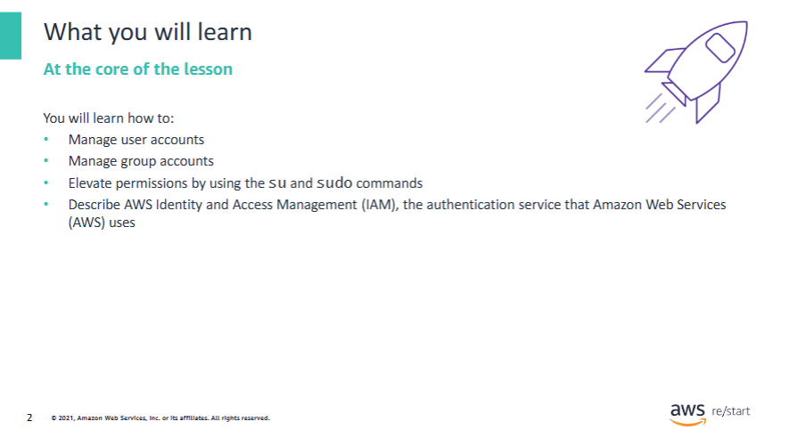

## Managing Users


In this section, you will learnhow to create users and manage their passwords.

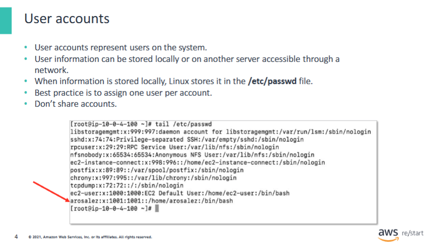

This example shows the content of the `passwd` file.  
`tail` is a command that displays the last lines of a file.  
By default, it displays the last 10 lines, but you can adjust the number of lines using the `–n` option.  
For example, the following command displays the last five lines:

```bash
tail –n 5 /etc/passwd
```

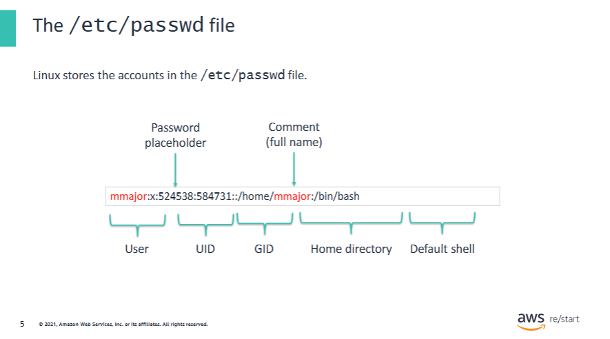

The `passwd` file contains registered users on the system.  
It is formatted as a colon-separated file that contains the following information:  
• User name  
• Encrypted password  
• User ID  
• User’s group ID  
• Full name of the user  
• Home directory of the user  
• The shell that is used after login

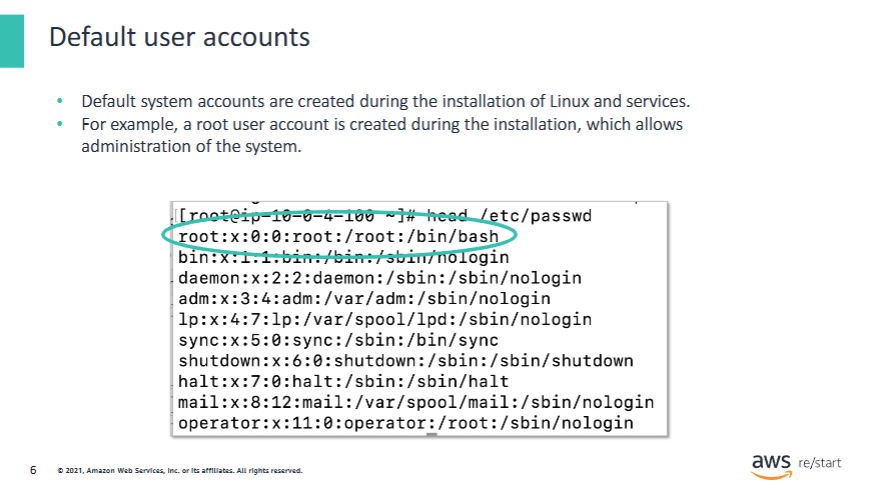

`head` is the complementary command of `tail`.  
It displays the first 10 lines of a file by default.  
You can adjust the number of lines by using the `–n` option:  

For example, the following command displays the first five lines:

```bash
head –n 5 /etc/passwd
```

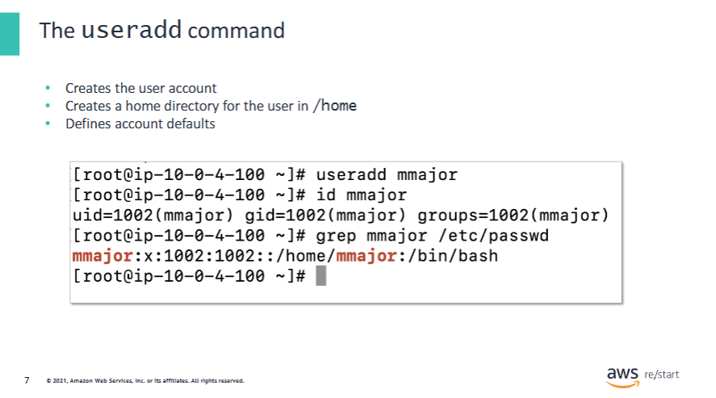

`grep` is a command that searches for a string in a file.  
For example, the following command displays all occurrences of the string `mmajor` in the file `/etc/passwd`:

```bash
grep mmajor /etc/passwd
```

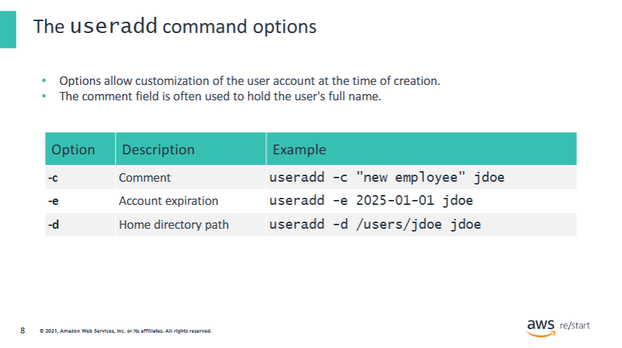

This table provides useful `useradd` command options.

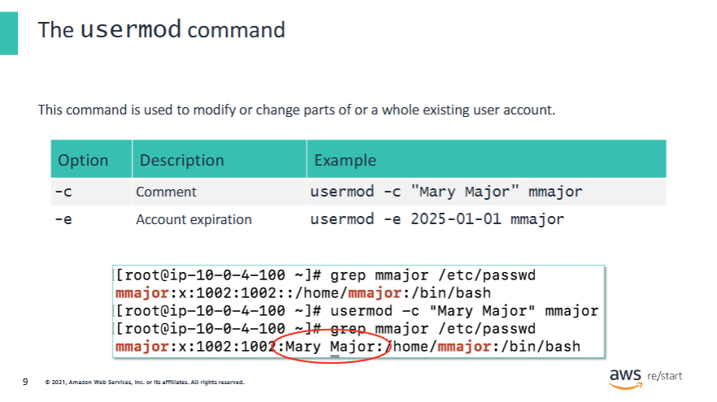

`grep` is a Linux command to search text.  
It can be used as follows to search for the word `hello` in the files that are located in `/etc/passwd`:

```bash
grep hello /etc/passwd
```

It can also be used with the pipe symbol (`|`) that redirects the output of the command to another command.

- `ls /etc/passwd | grep hello`:  
  `ls /etc/passwd` lists all the files in the `/etc/passwd` folder.  
- `|` redirects the result to the second command, `grep`, which searches for the word `hello` in the list of files.

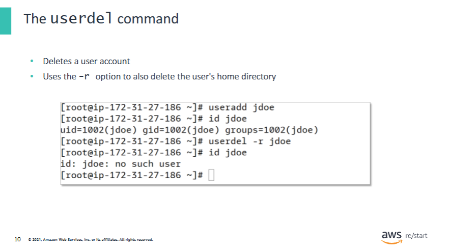

Use the `userdel` command to delete a user account.

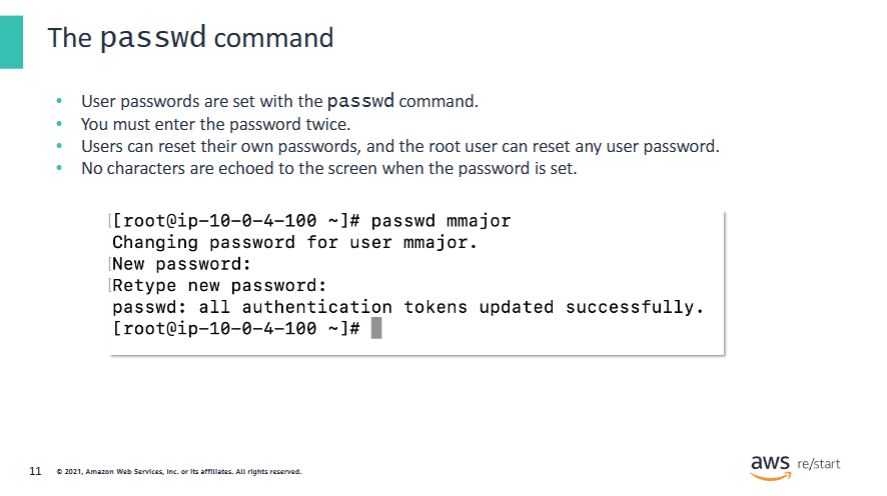

The `passwd` command is used to set user passwords.

## Managing Groups


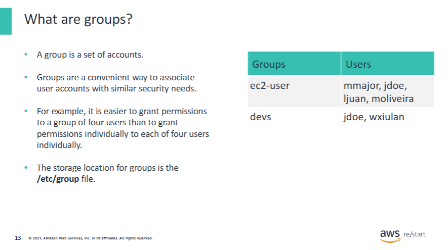

For instance, give Read access to a folder or a file to the ec2-user group instead of individually assigning the rights to each user.


The `/etc/group` file is as follows:

```bash
[ec2-user@ip-172-31-27-186 ~]$ tail /etc/group
chrony:x:994:
screen:x:84:
stapusr:x:156:
stapsys:x:157:
stapdev:x:158:
tcpdump:x:72:
ec2-user:x:1000:
jdoedevs:x:1004:jdoe,mmajor
```

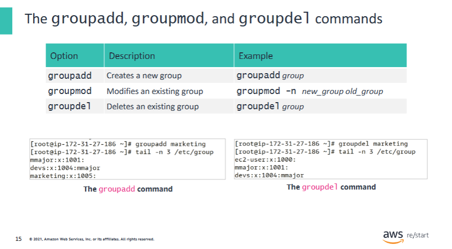

Familiarize yourself with the groupadd, groupmod, and groupdelcommands.

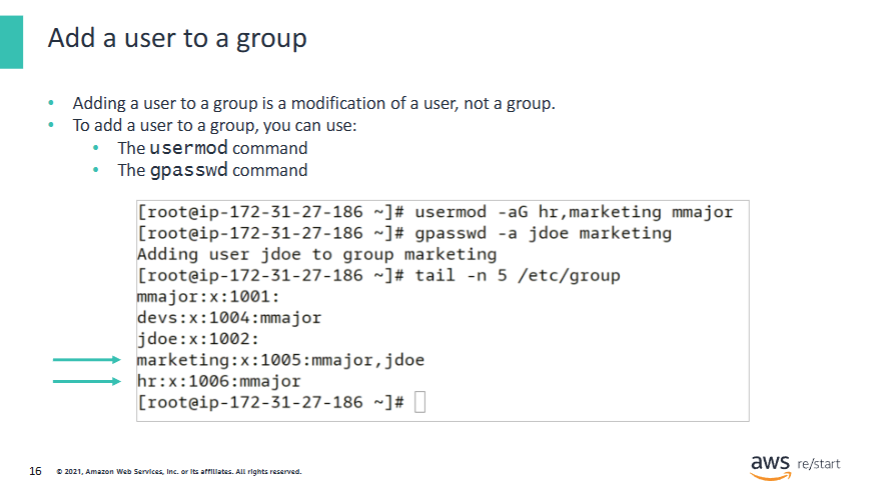

- The `usermod` command adds the user `mmajor` to the groups `hr` and `marketing`:

```bash
usermod -aG hr,marketing mmajor
```

- The `gpasswd` command adds the user `jdoe` to the `marketing` group:

```bash
gpasswd -a jdoe marketing
```

- To append a user to a group without removing them from other groups, use the `usermod` command with `-aG` options.

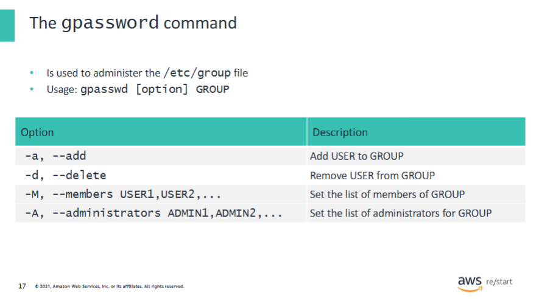

The command `gpasswd -a jdoe ec2-user` adds the user `jdoe` to the `ec2-user` group.  
The command `gpasswd -M smartinez,rroe ec2-user` sets the list of members of the `ec2-user` group to `smartinez`, `rroe`.

## User permissions


In this section, you’ll learn about user permissions and the usage of the suand sudocommands to runadmin commands. 

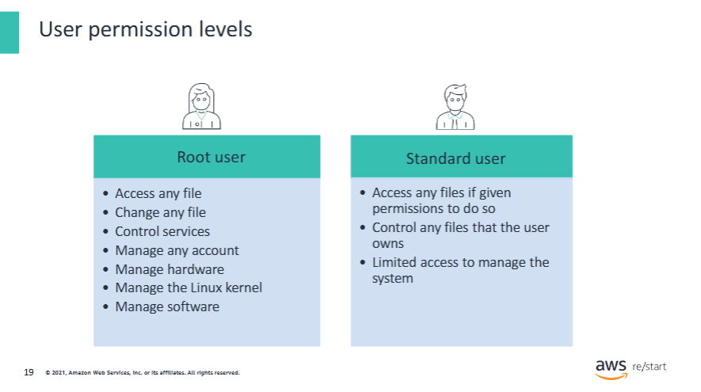

A standard user is a user that only has rights and file permissions that the user’s role requires.  
For instance, a business user might be able to run only certain programs like a document editor and a reporting tool.  
The user might be able to edit only files that are located in some specific folders.  
The `root` user can run any program and access any file. Only system administrators can use it.  
It is important to create a standard user with the right privileges to avoid unauthorized access to files or programs.

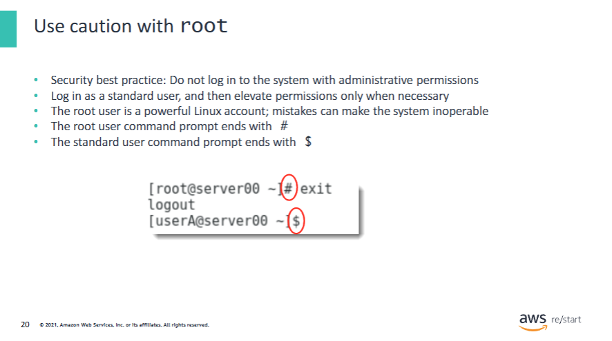

A user with root privileges could mistakenly run a command such as `delete /` that would erase the entire system.

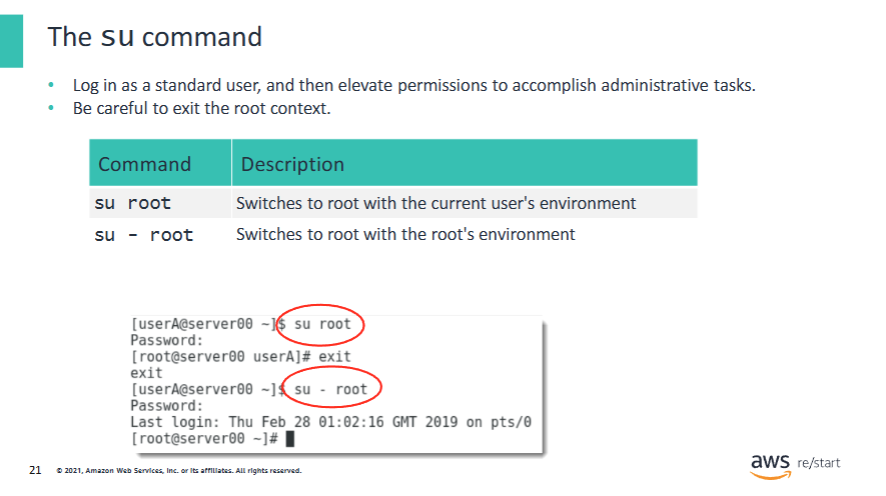

`su –` is equivalent to `su - root`.  
Only a system administrator should be authorized to run the command `su root`.  
`su` stands for substitute user, and you can use `su` to log in as any user, not only the root user.  
For example, the following command switches the current user to user `student02`:

```bash
su student02
```

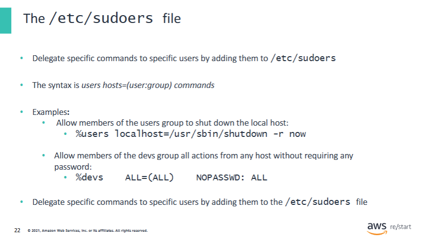

**Note:** this file must be edited by using the `visudo` command.  
It must not be edited directly.

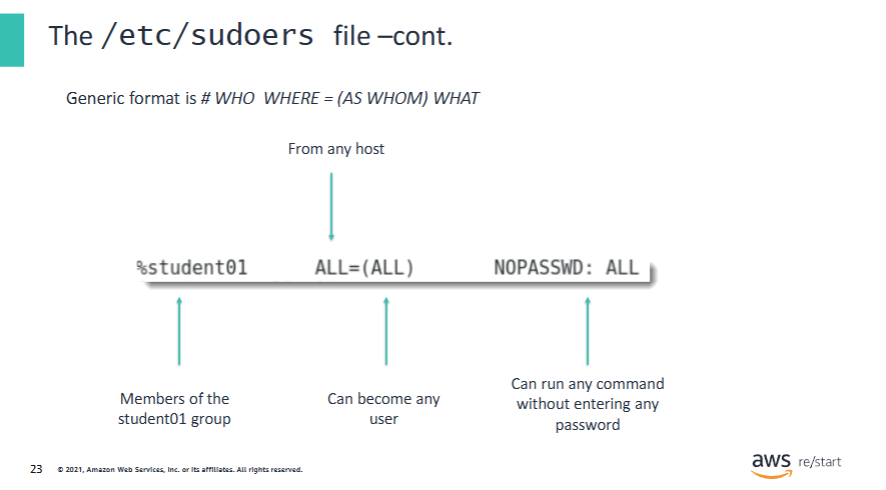

This diagram depicts the `/etc/sudoers` file.

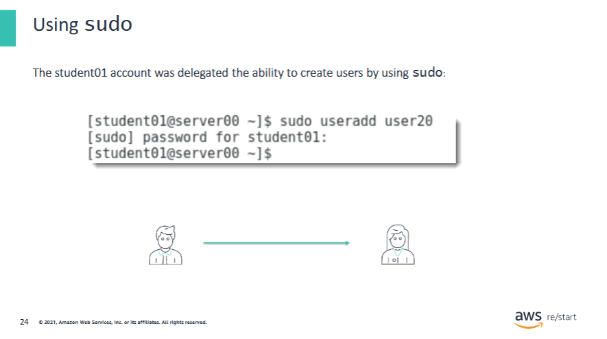

`sudo` requires the password of the current user, whereas `su` requires the password of the substitute account.  
Both of the following commands can be used to add a user:

- `[student01@server00 ~]$ sudo useradd user20`  
  - Requires the password of `student01`  
  - `student01` must be a sudoer

- `[student01@server00 ~]$ su adminuser`  
  `[adminuser@server00 student01]$ useradd user20`  
  - `student01` must know the password of the `adminuser` (could be root or another user with administrative privileges)

`sudo` is a safer method to run commands because it does not require a password exchange (student01 does not need to know the password of adminuser).


By using `sudo`, `student01` can run all the commands without any authentication that is needed on the `server00` host.

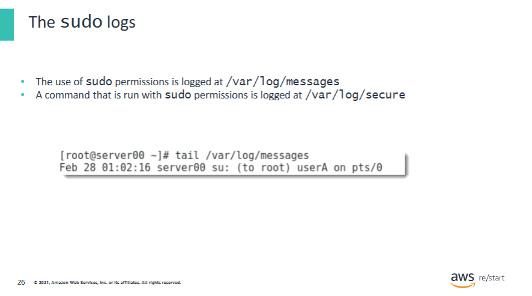

Any time a `sudo` permission is used, it is logged as shown.

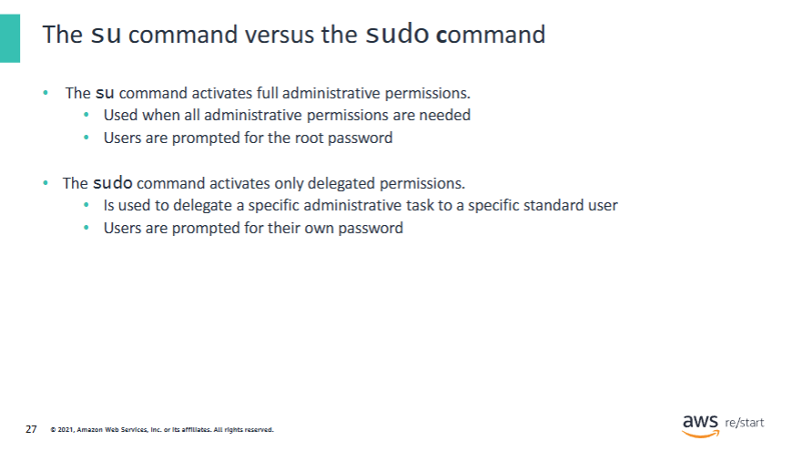

It is important to understand the differences between the `su` and `sudo` commands.

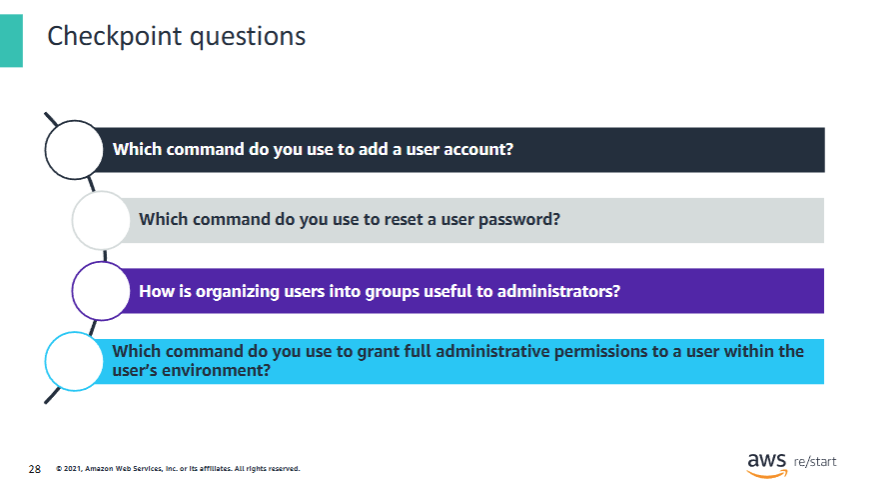

**Answers:**

1. You use the `useradd` command to add a new user account.  
2. You use the `passwd` command to reset a user password.  
3. Organizing users into groups allows you to manage their permissions as a single unit.  
4. The `su root` command elevates a user to have root permissions in the user’s environment.

## IAM


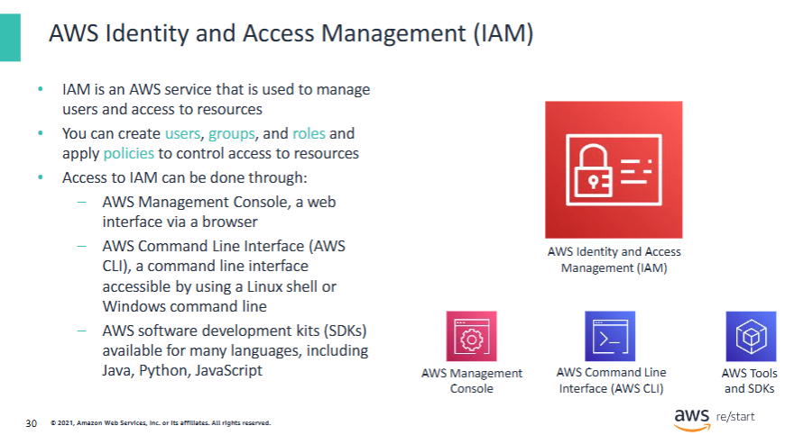

Think of IAM as the tool to centrally manage access.  
It determines who can launch, configure, manage, and remove resources.  
It provides control over access permissions for people and for systems or other applications that might make programmatic calls to AWS resources.

A **policy** is a document that you can attach to a user or a group of users and define the permission to access resources.  
Examples of such permissions might include:

- Administrator access to Amazon Relational Database Service (Amazon RDS)  
- Read-only access to Amazon Simple Storage Service (Amazon S3)

IAM will be covered in more detail later.

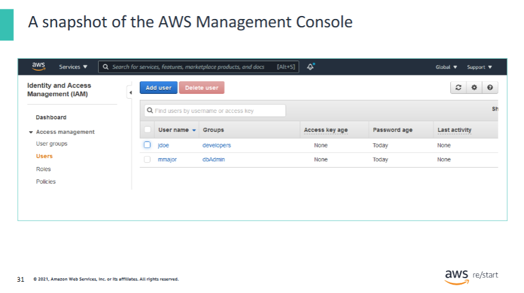

The image shows a snapshot of the AWS Management Console.

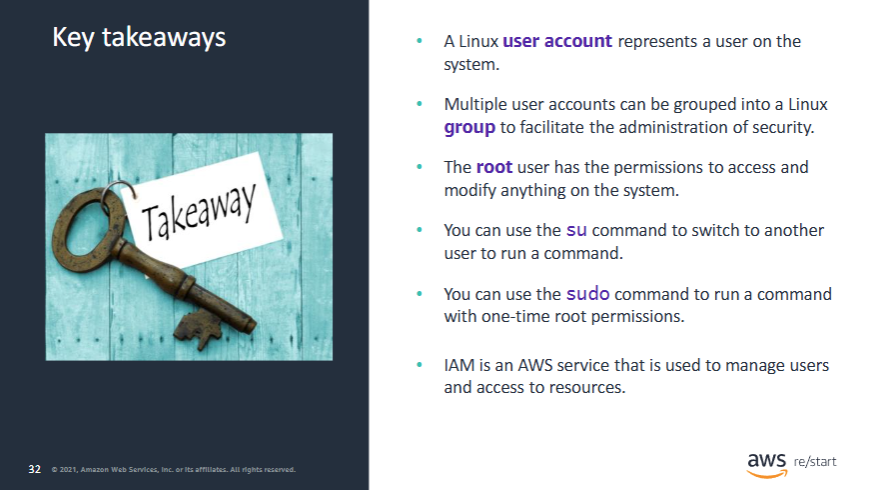

Some key takeaways from this lesson include:

- A Linux user account represents a user on the system.  
- Multiple user accounts can be grouped into a Linux group to facilitate the administration of security.  
- The `root` user has the permissions to access and modify anything on the system.  
- You can use the `su` command to switch to another user to run a command.  
- You can use the `sudo` command to run a command with one-time root permissions.  
- IAM is an AWS service that is used to manage users and access to resources.
