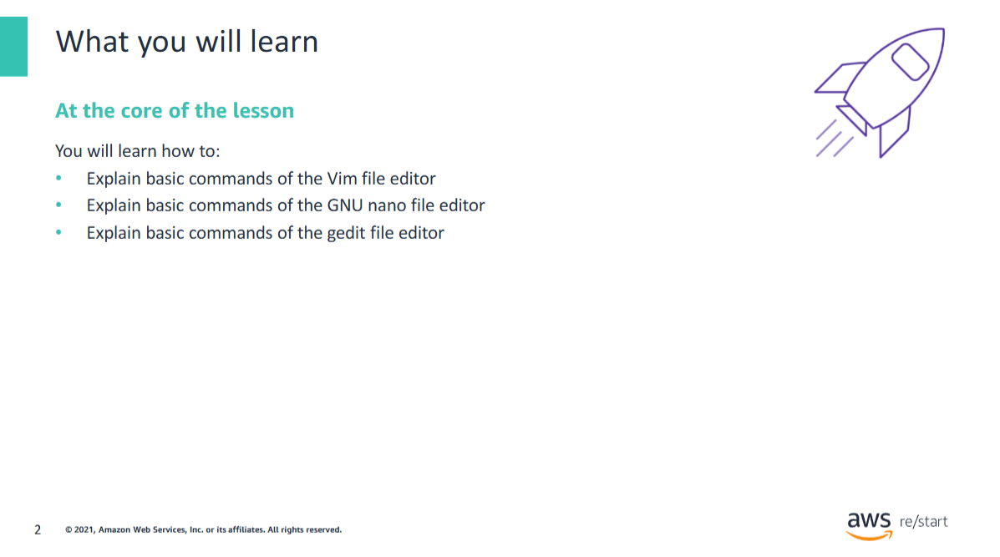

In this lesson, you will learn how to:

- Explain basic commands of the Vim file editor  
- Explain basic commands of the GNU nano file editor  
- Explain basic commands of the gedit file editor

## Vim text editor


This section introduces Vim and demonstrates some of the most widely used commands.

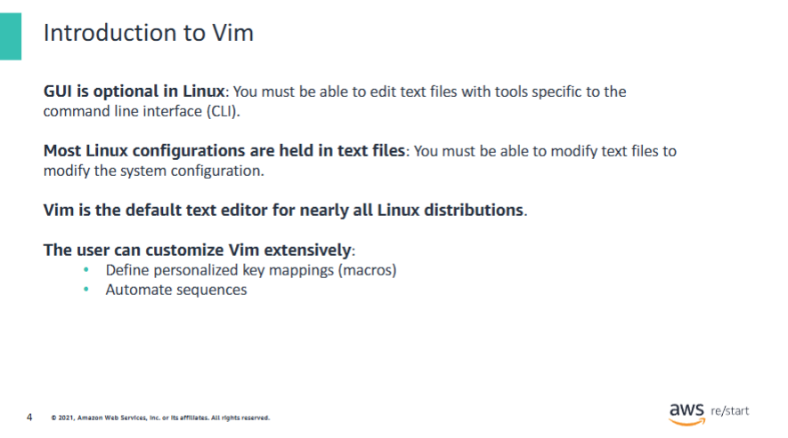

Vim is an implementation of Vi. Depending on the Linux distribution, you might find Vi or Vim. A basicunderstanding if this tool is essential.

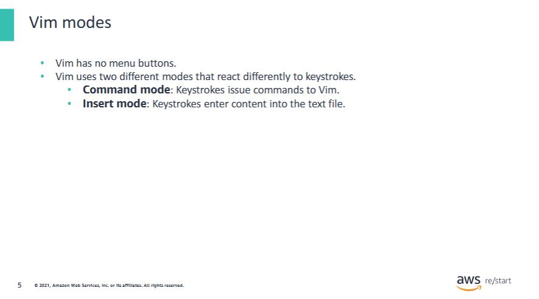

Youcan switch among the three modes as needed.

The next few slides will demonstrate some of the common commands and key strokes.

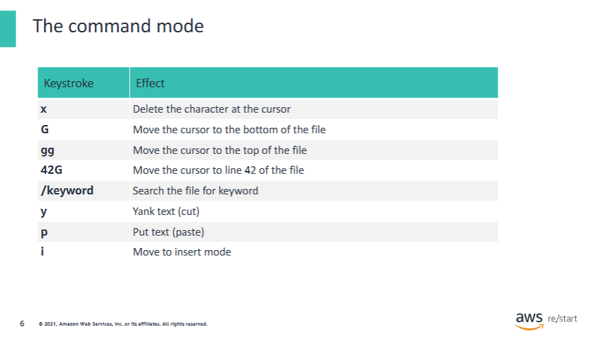

This list is not comprehensive.

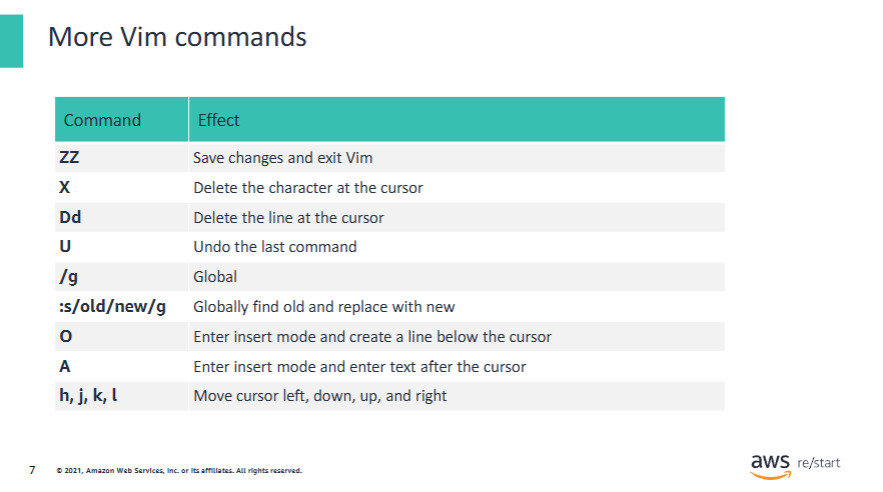

This list is not comprehensive.

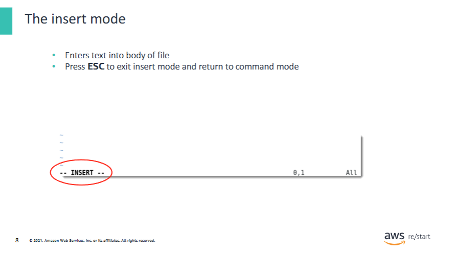

Enter i.
Enter your text.
Press ESC to exit the insert mode.

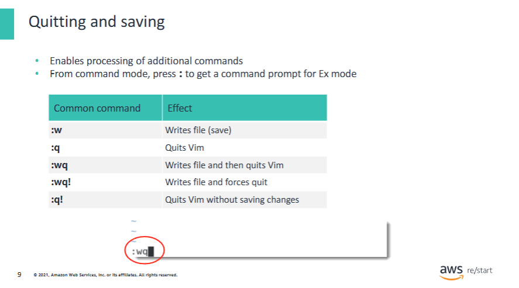

To save the file and exit VIM:

- Enter:
  ```bash
  :wq
  ```

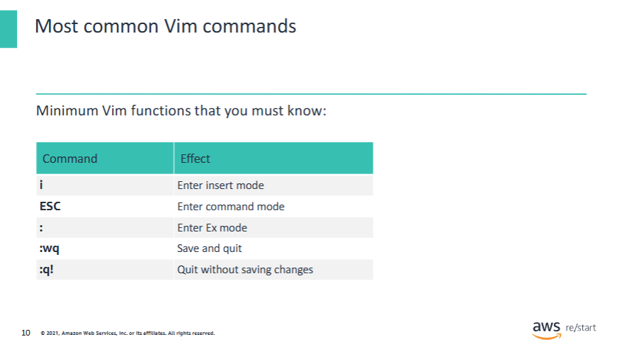

Be sure that you are comfortable with these commands, which you need to know to use Vim.

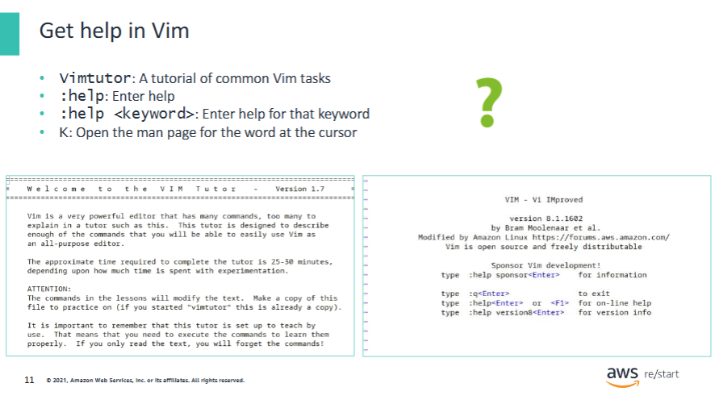

`vimtutor` is a command to enter in the shell that opens a Vim documentation.  
Other commands must be entered inside Vim, such as the following:

- Press `ESC` and enter `:help` to get general help, and then enter `:q` to exit the help page.  
- Press `ESC` and enter `:help 'textwidth'` to go directly to the part of the documentation that mentions the word `textwidth`.  
  Enter `:q` to exit the documentation.  
- Enter `useradd`, press `ESC`, and enter `K` to get help about the `useradd` command.  
  Then enter `q` to exit the help page.

## GNU nano text editor


Nano is another lightweight text editor that works directly from the shell.

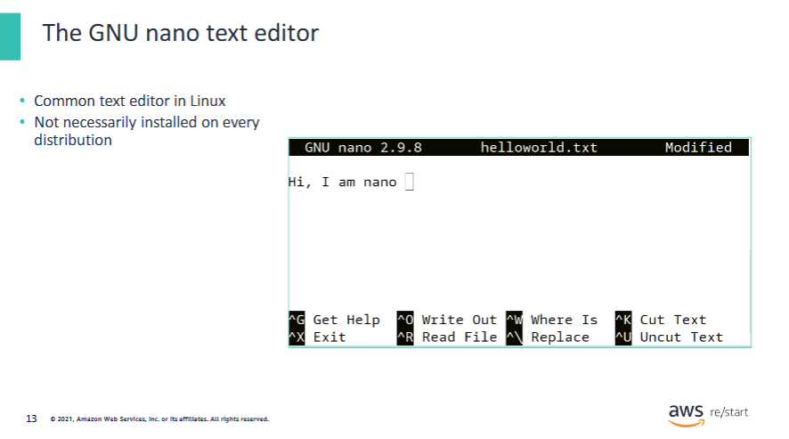

On a Debian or Ubuntu distribution, you can use the following command:

```bash
sudo apt-get install nano
```

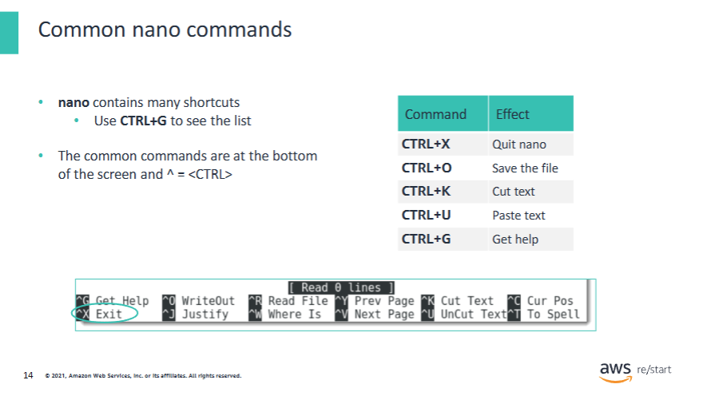

The next fewslides demonstrate some common commands and key strokes.

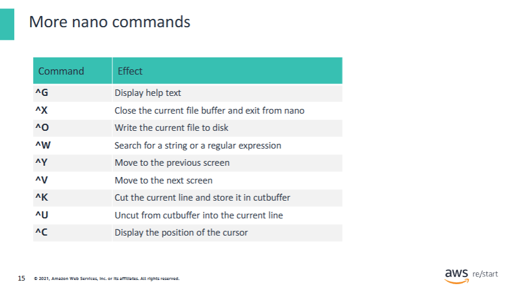

This list is not comprehensive.

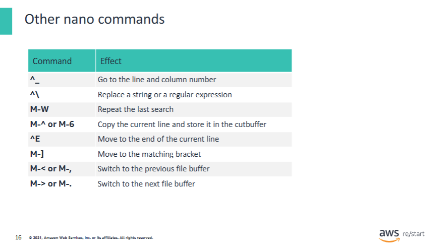

This list is not comprehensive.Familiarize yourself with these commands.

## gedit GUI-based text editor


Gedit is a graphic-basedtext editor. It requires a graphical user interface such as GNOME, Xfce, or K Desktop Environment (KDE) to be installed on the Linux distribution. It is optional.

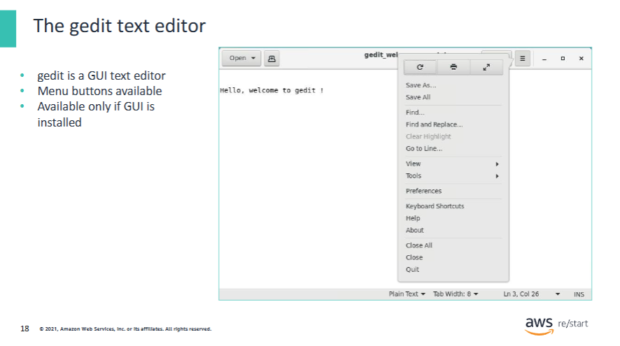

AWS offers instructions that guide you through the installation of a graphical user interface (GUI) on an Amazon Elastic Compute Cloud (Amazon EC2) Linux 2 instance.  
For more information about how to install a GUI on an EC2 instance running Amazon Linux 2, see:  
[https://aws.amazon.com/premiumsupport/knowledge-center/ec2-linux-2-install-gui/](https://aws.amazon.com/premiumsupport/knowledge-center/ec2-linux-2-install-gui/)

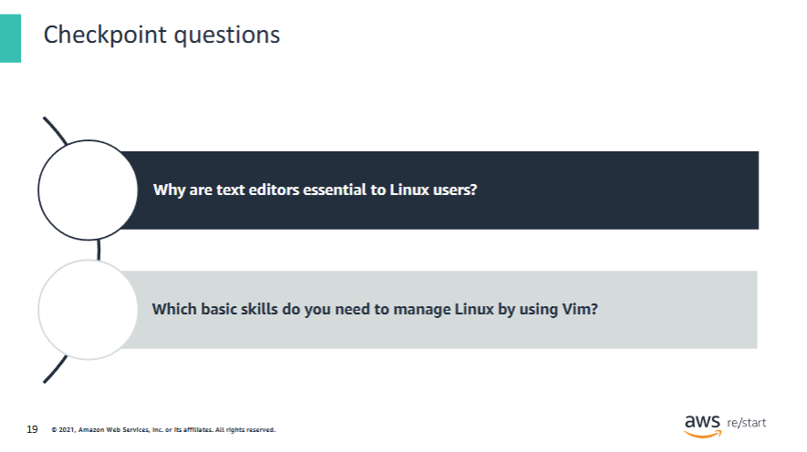

- Because the entire Linux file system is made up of files, being able to create and update files is essential.  
- The basic skills are:
  a. Opening a file for editing (enter `vi <filename>`)  
  b. Entering insert mode (press `ESC` and then enter `i`)  
  c. Entering command mode (press `ESC`)  
  d. Saving a file (enter command mode, enter `:w`, and then press `Enter`)  
  e. Exiting `vi` (enter command mode, enter `:q`, and then press `Enter`)

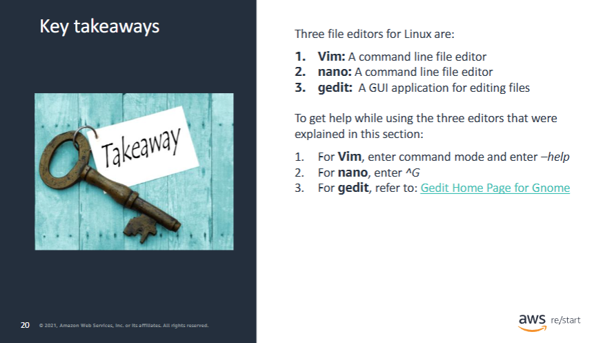

Some key takeaways from this lesson include the following:

The following are the three file editors for Linux:

1. **Vim**: A command line (CLI) file editor  
2. **nano**: A command line file editor  
3. **gedit**: A GUI application for editing files  

Help and further instructions are available for each.  
For more information about gedit, see:  
[https://help.gnome.org/users/gedit/stable/](https://help.gnome.org/users/gedit/stable/)
