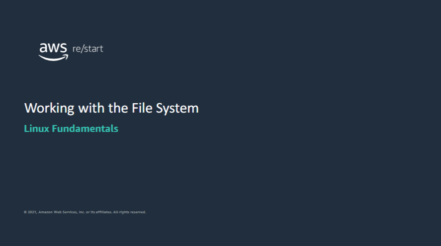

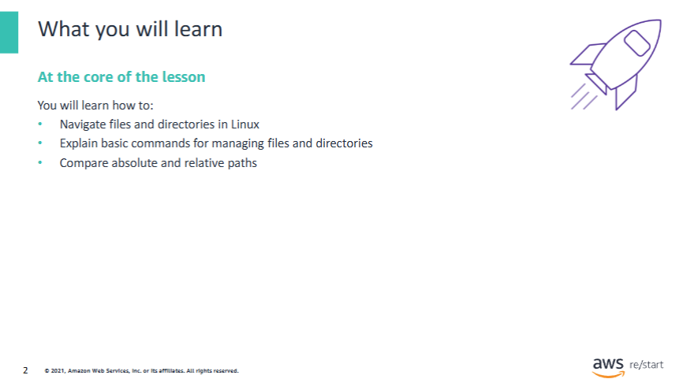

In this lesson, you will learn how to:

- Navigate files and directories in Linux  
- Explain basic commands for managing files and directories  
- Compare absolute and relative paths

## Navigating files and directories


Introducing the Linux file system.

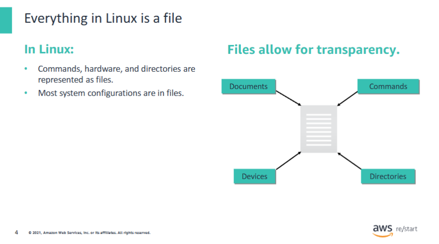

Files allow for transparency.  
Drives, processes, and other elements are all represented as files.  
They can be browsed and accessed for information (for example, `ls /proc` gives you access to processes).

Files allow for interoperability.  
The same tools can be used for different types of files and can be combined (for example, `ls -l | grep .txt`).

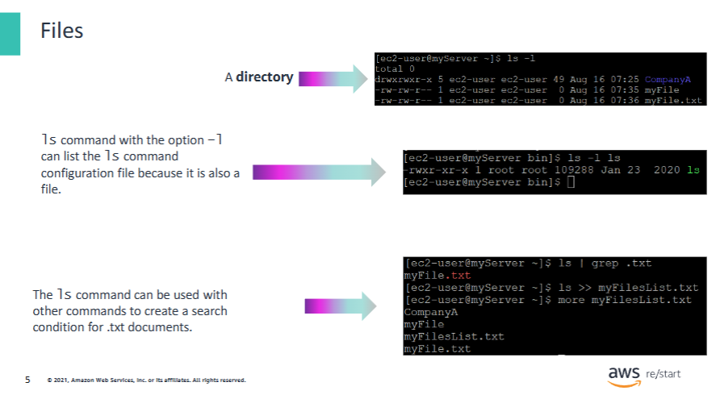

In the first screenshot, both the directory and the text file are considered files.  
The directory is a special kind of file, hence the `d` and the blue color.

In the second screenshot, you see that you can list the `ls` command because it is also a file.

The third screenshot shows how you can operate between commands.

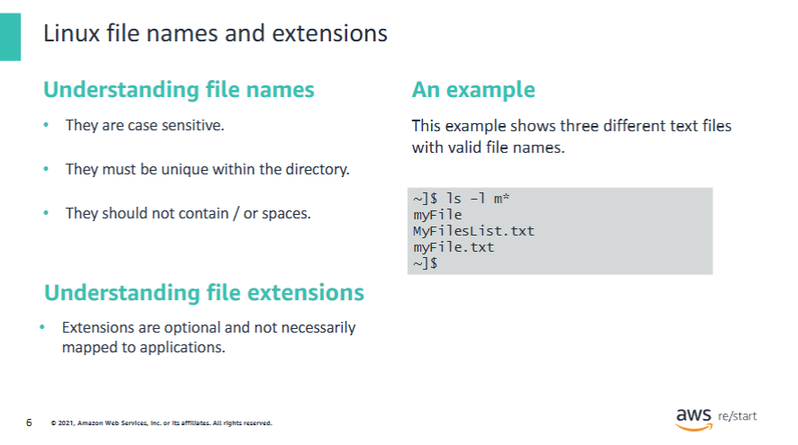

You are strongly advised to have consistent extensions. For instance, a .jpg image could be named image.txt even though this extension would not make sense. A user might think that this file is a description file and try to open it with a text editor instead of an image viewer. A better option is to nameitimage.jpeg or image.jpg.

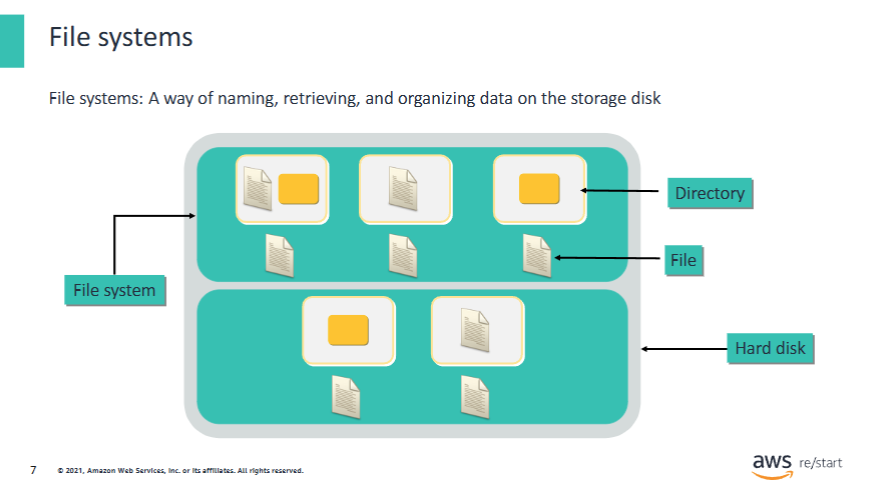

The file system organizes how files are stored on the hard drive. A file is located inside a directory.

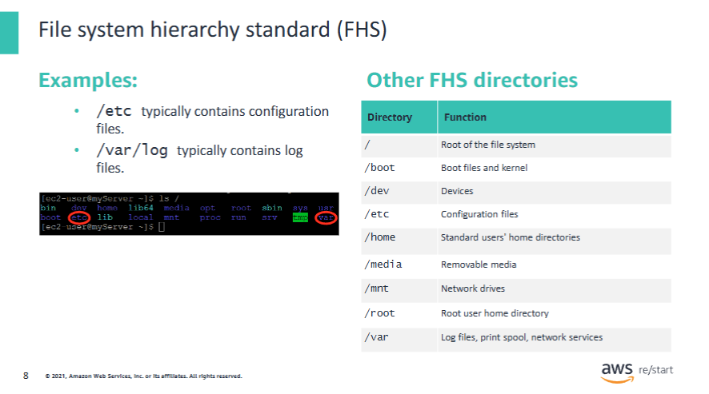

Most Linux distributions use this standard, but some distributions might differ slightly or intentionally use a different file system.  
There are some commonalities between some of these distributions. For example, there are standard locations and functions of directories across Linux distributions.

Most Linux distributions:

- Allow software to be compatible with various distributions  
- Allow administrators to predict where certain types of files will be found  

Most distributions follow the **File System Hierarchy Standard (FHS)**.  
The FHS has many other directories. The table shows a list of the other available directories.

## Commands for managing files and directories

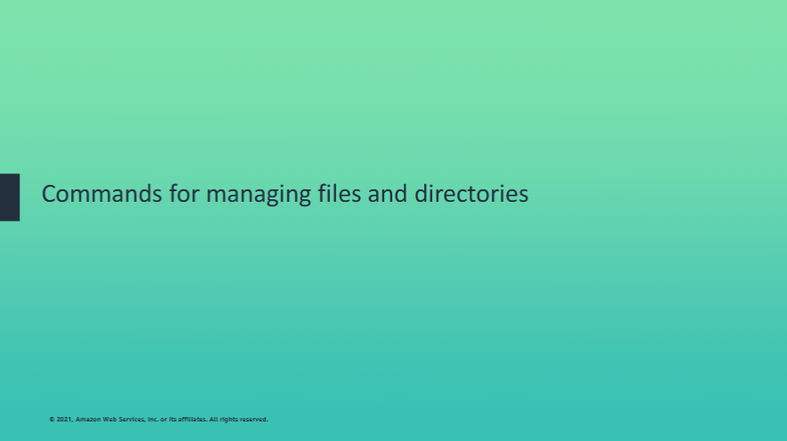

The following commands are important. They are used to manage files and directories.

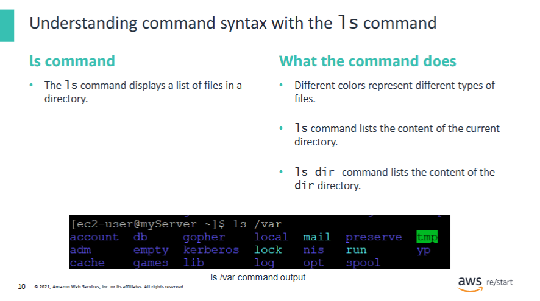

Colors are not defined according to a standard.  
They depend on the configuration of the shell that you are using.  
You can list several multiple directories, for example:

```bash
ls directory1 directory2
```

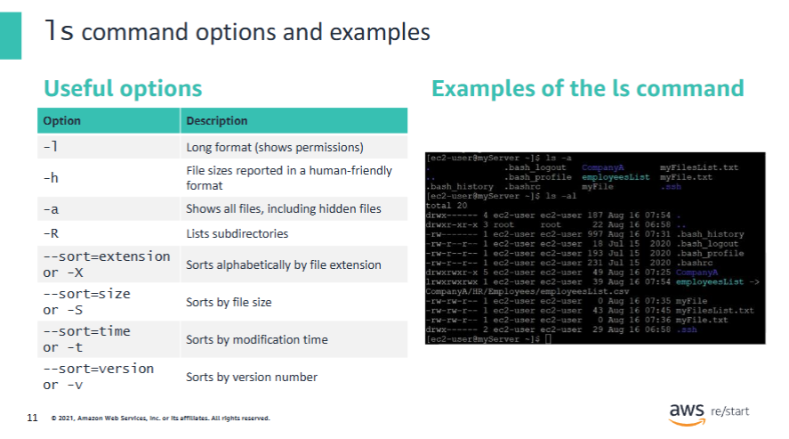

By default, the `ls` command uses the natural sort order.  
To get results in the reverse order, add the `-r` option.  
You can combine options: `ls -al` displays hidden files and file details.

- `ls -l` lists the contents of the current directory with details. It does not display the hidden files.  
- `ls -a` displays the hidden files.  
- `ls -al` displays the hidden files and the file’s details (not all of the list is displayed on the screenshot because it would take too much space).

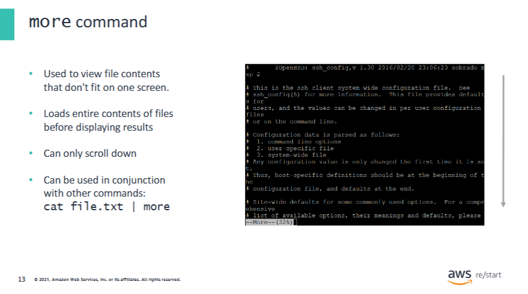

**Usage:**

```bash
more [-options] [-num] [+/pattern] [+linenum] [file_name]
```

- **Options:**
  - `-d`: Displays information about how to navigate at the bottom of the screen  
  - `-f`: Prevents line wrap  
  - `-p`: Clears the screen before displaying the content  
  - `-s`: Squeezes multiple blank lines into one line  

- **num**: Number of lines to display  
- **/pattern**: String to find in the file  
- **linenum**: The line number where the content starts to display  
- **file_name**: Name of the file to display the content of

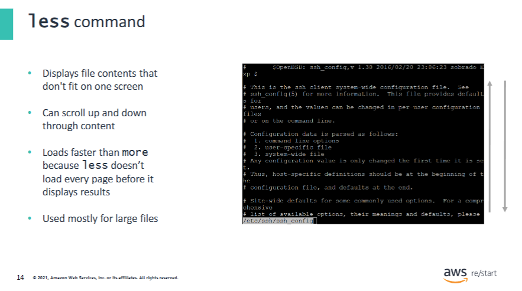

**Usage:**

```bash
less [OPTIONS] filename
```

- Use `Q` to quit.

- **Options:**
  - `-N`: Shows line numbers  
  - `-X`: Displays the content after the last command and does not clear the screen when exiting  
  - `+F`: Watches for file content changes

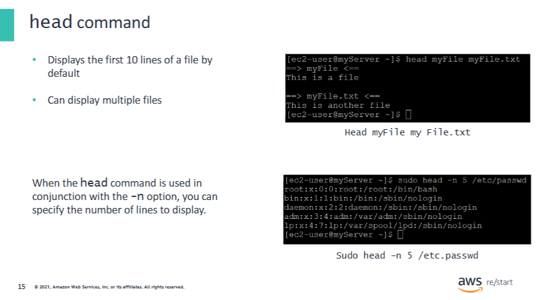

**Usage:**

```bash
head [OPTIONS] filename(s)
```

- **Options:**
  - `-n <number>`: First *n* lines to display  
  - `-c <number>`: First *c* bytes to display

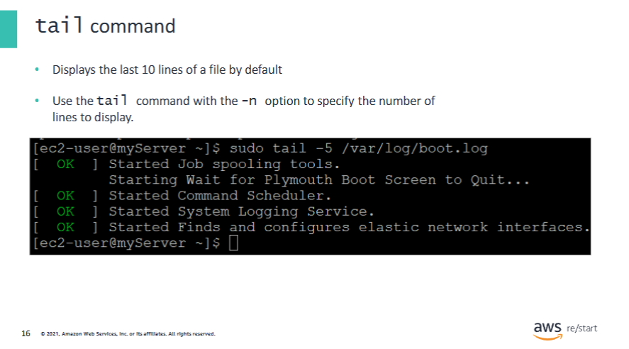

**Usage:**

```bash
tail [OPTIONS] filename(s)
```

- **Options:**
  - `-n <number>`: Last *n* lines to display  
  - `-c <number>`: Last *c* bytes to display  
  - `-f`: Monitor for file changes  

The `tail -f` command is useful for log files that are regularly updated and where the most recent entries are at the bottom of the file.


**Usage:**

```bash
cp folderA/srcfile folderB/destfile
```
- Copies the `srcfile` that is located in `folderA` to `folderB` and names it `destfile`.

```bash
cp folderA/srcfile folderB/
```
- Copies the `srcfile` that is located in `folderA` to `folderB` (and both files have the same name).

```bash
cp folderA/srcfile folderB/ folderC/destfile
```
- Copies the `srcfile` that is located in `folderA` to `folderB` and to `folderC` with the name `destfile`.

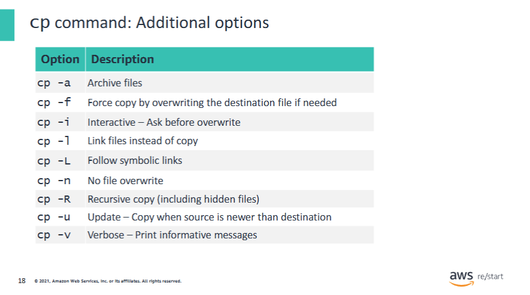

This slide shows additional options for the cp command that you can use.

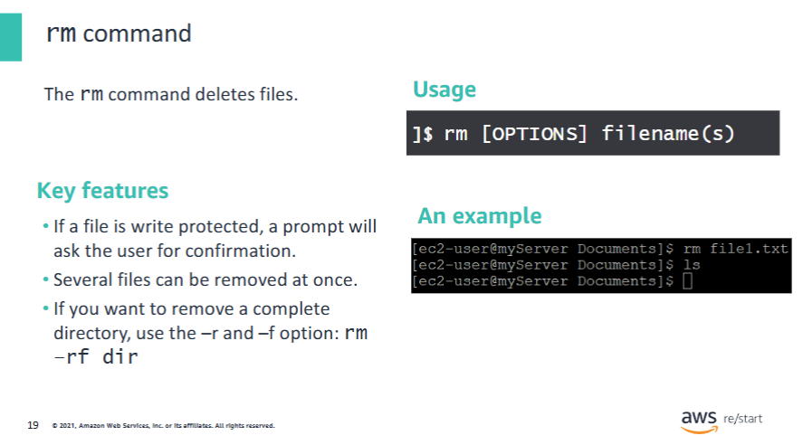

**Usage:**

```bash
rm [OPTIONS] filename(s)
```

- **Options:**
  - `-d`: Removes a directory; the directory must be empty  
    Example: `rm -d dir`
  - `-r`: Allows you to remove a non-empty directory  
    Example: `rm -r dir`
  - `-f`: Never prompt user (useful when deleting a directory with many files)  
  - `-i`: Prompts the user for confirmation for each file  
  - `-v`: Display the names of deleted files  

- If a file is write protected, a prompt will ask the user for confirmation.  
- Several files can be removed at once.  
- If you want to remove a complete directory, use the `-r` and `-f` options:  
  ```bash
  rm -rf dir
  ```
- You can use a regular expression:  
  ```bash
  rm *.png
  ```
  Removes all files that end with `.png`.


**Usage:**

```bash
mkdir [OPTIONS] filename(s)
```

- **Options:**
  - `-m <mask>`: Sets a permission to the directory  
  - `-p`: Creates a parent directory  

You can create several directories with one command:

```bash
mkdir dir1 dir2 dir3
```

Examples:

- `mkdir -m 700 dir1` creates the `dir1` directory with the mask `700` for permissions.  
- `mkdir -p /home/user/dir1/dir2`:  
  If `dir1` does not exist, the creation will fail **without** the `-p` option.

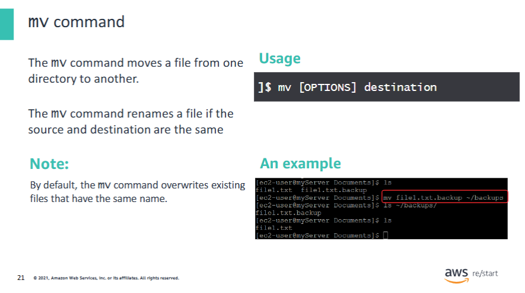

**Usage:**

```bash
mv [OPTIONS] source destination
```

- **Options:**
  - `-i`: Prompts before overwriting a file  
  - `-f`: Avoids being prompted  
  - `-n`: Does not overwrite existing files  
  - `-v`: Verbose option, prints the name of files that are moved or renamed  

**Examples:**

- `mv file1 dir1`: Moves `file1` to `dir1`  
- `mv dir1 dir2`: Moves `dir1` to `dir2`  
- `mv file1 file2 dir1 dir2`: Moves `file1`, `file2`, and `dir1` to `dir2`; there can only be one target directory here: `dir2`  
- `mv file1 dir1/file2`: Moves `file1` to `dir1` and renames it `file2`  
- `mv file1 file2`: Renames `file1` as `file2`  

You can use a regular expression to move files of the same type:

```bash
mv *.png dir1
```

Moves all files with the `.png` extension into `dir1`.

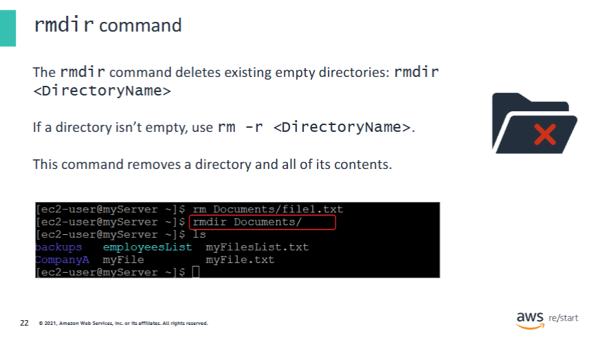

rmdiris equivalent to rm –d.

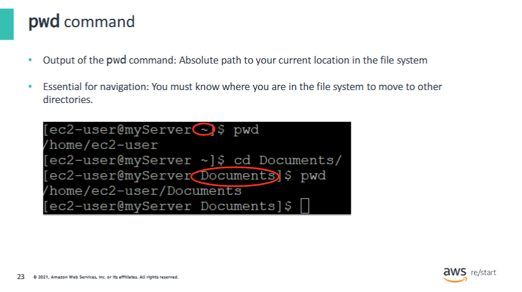

Use the `pwd` command to know where you are in the file directory structure.

## Absolute versus relative paths

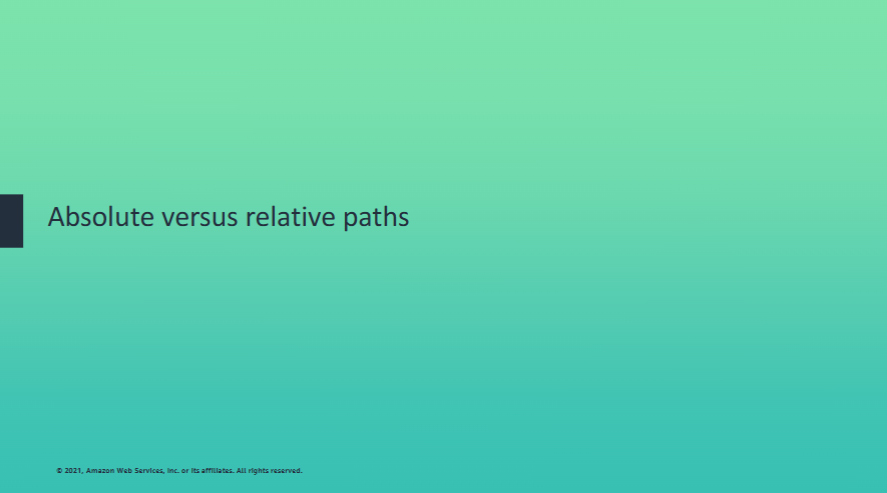

You must know the difference between absolute and relative paths.

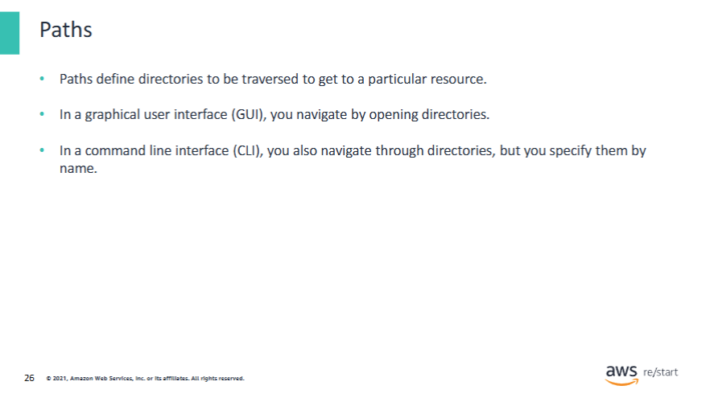

You must know how to navigate directories by both a GUI and a CLI.

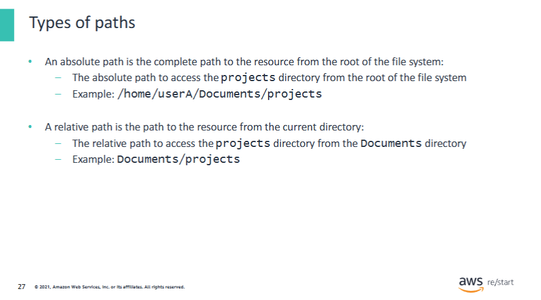

Suppose the command `pwd` tells you that you are in the folder `/home/ec2-user`.

- `cd /home/userA/Documents/projects` will navigate to the `/home/userA/Documents/projects` folder.  
- `cd Documents/projects` will navigate to the `/home/ec2-user/Documents/projects` folder  
  (current folder is `/home/ec2-user`, so it's interpreted as `currentfolder/Documents/projects`).


**Tip:** Use `../` to go up a single directory at a time.  
For example, if you are in the `/home/userA` folder, `cd ../` will navigate to `/home`.

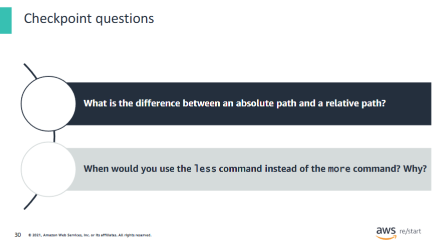

**Answers:**

1. The **absolute path** shows the entire folder structure to the resource that is being used.  
   The absolute path to `my_file.txt` in the `Documents` directory would be something like:  
   `/Users/user_name/Documents/LabWork/my_file.txt`  
   The **relative path** shows only from the current directory to the file that is being used.  
   From the previous example, within the `user_name` directory, the relative path to the file is:  
   `/Documents/LabWork/my_file.txt`

2. You use the `less` command if you want to scroll **backward** through a file.  
   With the `more` command, you can only scroll **forward** through a file.

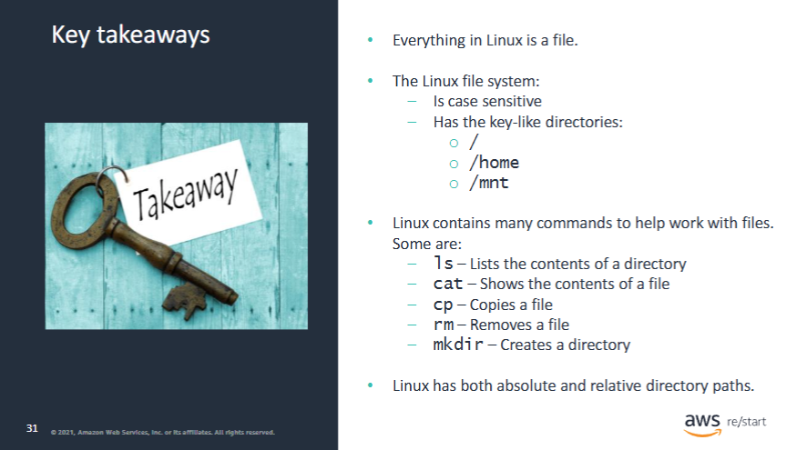

Some key takeaways from this lesson include the following:

- Everything in Linux is a file.  
- The Linux file system is case sensitive and has key-like directories.  
- Linux contains many commands to help work with files.  
- Linux has both absolute and relative directory paths.
