Welcome to Working with Commands.

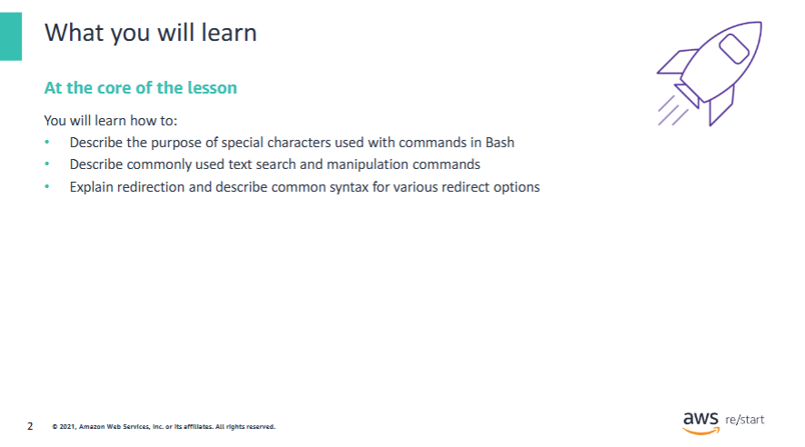

In this lesson, you will learn how to:

- Describe the purpose of special characters that are used with commands in Bash  
- Describe commonly used text search and manipulation commands  
- Explain redirection and describe common syntax for various redirect options

## Special characters, wildcards and redirection


Special characters, wildcards, and redirection are all used with commands in Bash. You’ll see use cases for these options.

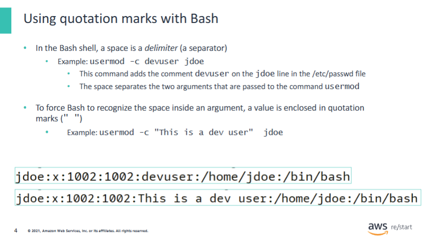

In the example, suppose that the user enters the following:

```bash
usermod -c This is a dev user jdoe
```

Then, `usermod` will consider `This`, `is`, `a`, `dev`, `user`, and `jdoe` as command parameters,  
which will not work because `usermod -c` takes only two parameters.

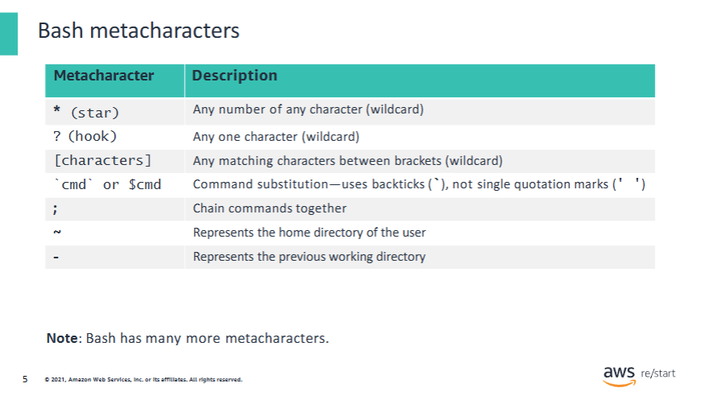

Bash metacharacters are special characters that have a meaning to the shell and that users can use to work faster and more powerful interaction with Bash.  
They are especially useful when writing scripts.

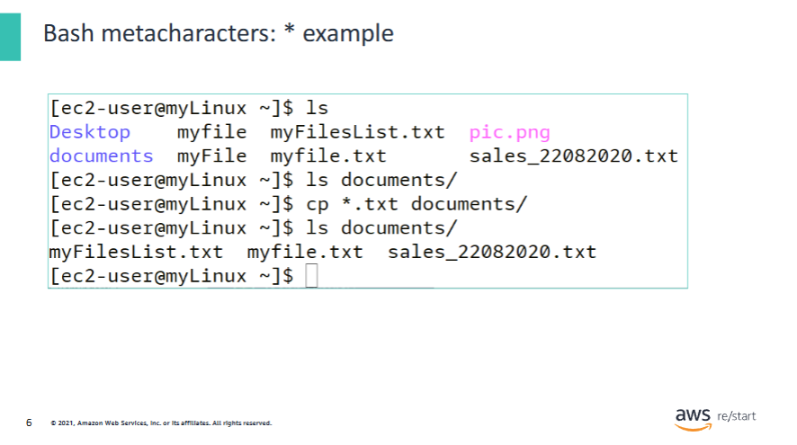

As you can see, the current folder contains the following:

- `.txt` files – `myfile.txt`, `myFilesList.txt`, and `sales_22082020.txt`  
- `myFile` – A file without extension  
- A `.png` file – `pic.png`  
- Two folders – `Desktop` and `documents`  

The `documents` folder is empty.

The command `cp` copied all `.txt` files to the `documents` folder.  
The `*` replaces any character any number of times; only files that were named `<anycharacter_multiple_times>.txt` were copied.

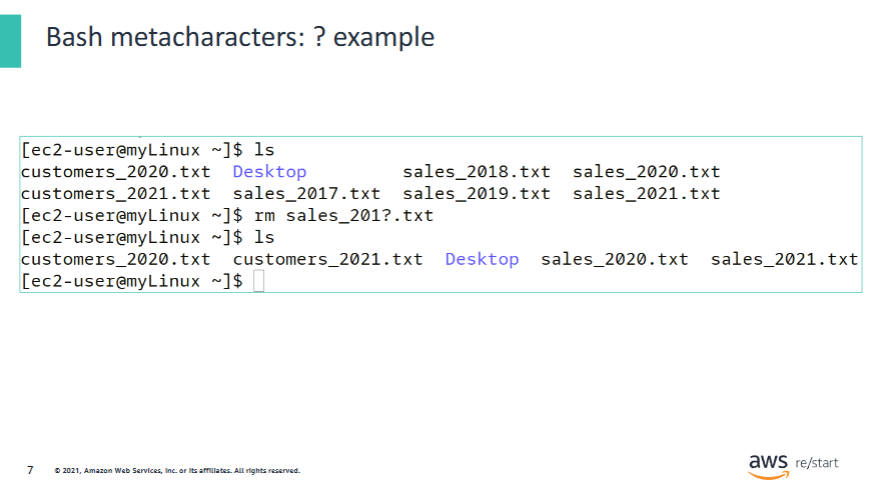

As you can see, the current folder contains the following:

- **sales .txt** files – `sales_2020.txt`, `sales_2021.txt`, `sales_2019.txt`, `sales_2018.txt`, `sales_2017.txt`  
- **customers .txt** files – `customers_2020.txt`, `customers_2021.txt`  
- One folder – `Desktop`

The command:

```bash
rm sales_201?.txt
```

Deletes all files that are named `sales_201<anycharacter>.txt`.  
Only `sales_2019.txt`, `sales_2018.txt`, and `sales_2017.txt` are deleted.

![Bash metacharacters: [characters] bracket example](../../../assets/linux-fundamentals/working-with-linux-commands/bash_metachars_example_brackets.png)

- `[abc]` is a list of fixed characters: a, b, and c.  
- `ls log_[abc].txt` lists `log_a.txt`, `log_b.txt`, and `log_c.txt` because the characters list is `[abc]`.

- `[a-e]` means characters from a to e.  
- `ls log_[a-e]` lists `log_a.txt`, `log_b.txt`, `log_c.txt`, `log_d.txt`, and `log_e.txt`, but not `log_f.txt`.

- The characters list can be a bit more complex:

```bash
ls log_[a-zA-Z][0-9]
```

Means list any file that:

- Starts with `log_`  
- Is followed by one character between `a` and `z`, lowercase or uppercase  
- Is followed by one number between `0` and `9`

- Notice that you can combine wildcards together:

```bash
ls log_?[a-zA-Z0-9]*
```

Lists:

- Files that begin with `log_`  
- Followed by any character (`?` wildcard)  
- Followed by one letter (uppercase or lowercase), or a one-digit number  
- Followed by any number of any characters (`*` wildcard)

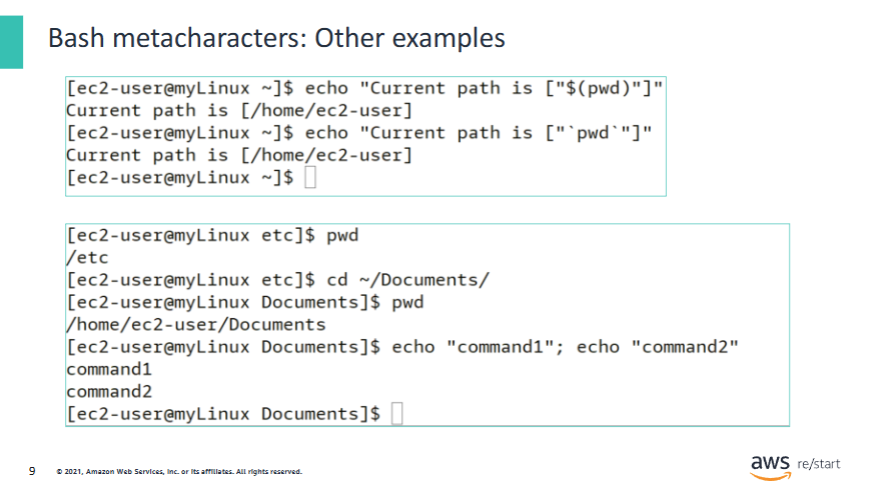

•The first screenshot shows command substitution that uses $or `. Inside the string, $pwdis replaced by the actual result of the pwdcommand.•In the second screenshot, you can see how using ~/goes directly to the current user home folder•cd ~/Documentis equivalent to cd /home/ec2-user/Documents•Finally, you can see how you can use ;to run several commands.

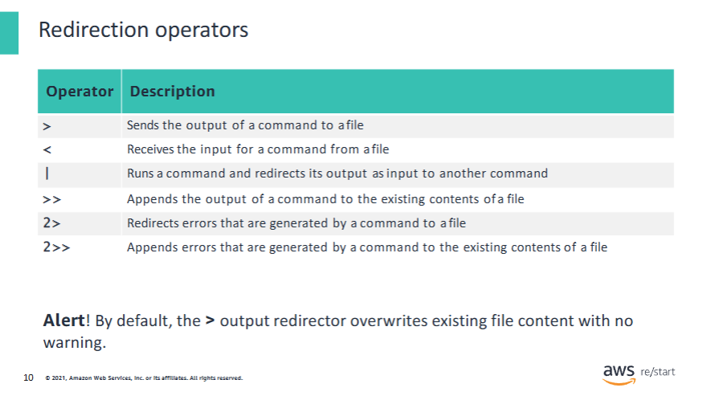

Familiarize yourself with these common operators that are used for redirection.

**Alert!** By default, the `>` output redirector will overwrite existing file content with no warning.

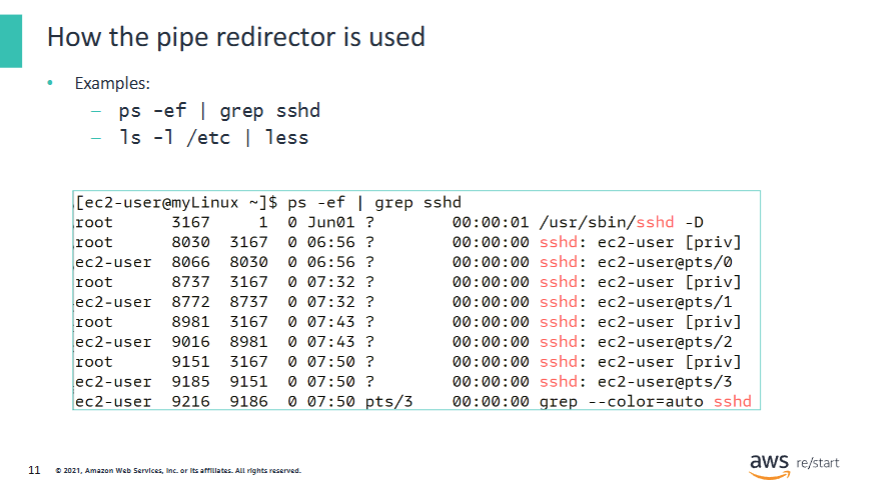

- `ps -ef | grep sshd` lists processes and redirects the output to the `grep` command that looks for the `sshd` pattern in the result of `ps`.

- `ls -l /etc | less` lists the content of the `/etc` folder and redirects the result to the `less` command  
  where the user can navigate and save the content to a file.

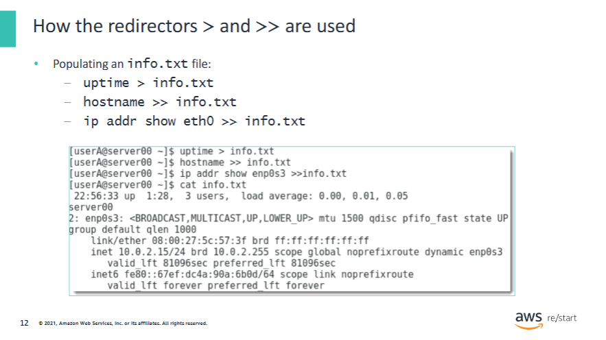

- The first command outputs the results of the `uptime` command to the file `info.txt`.

```bash
uptime > info.txt
```

- The second command appends the result of the `hostname` command to the same file, hence the second line: `server00`.

```bash
hostname >> info.txt
```

- Note that `hostname > info.txt` (with one `>`) would have overwritten the `info.txt` file with only the hostname info.

- The third line also appends info to the same file.

```bash
echo "Additional info" >> info.txt
```

- An example of using `<` is:

```bash
less < info.txt
```

Which redirects the content of `info.txt` to the `less` command to display it.

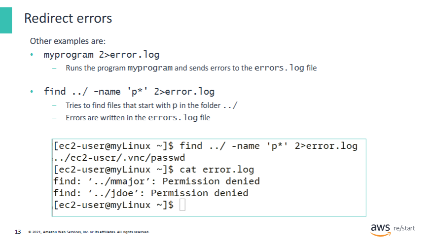

In this example, the `find` command fails because `ec2-user` does not have access to folders of other users.  
The errors are logged in the `error.log` file.

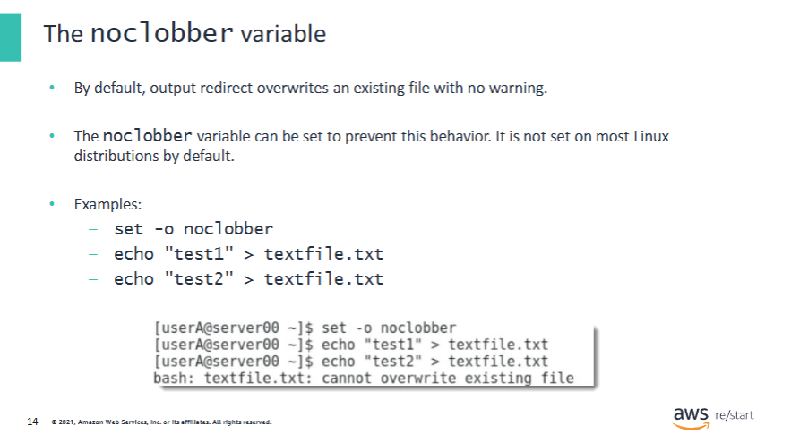

These commands are equivalent to the following:

```bash
echo "test1" > textfile.txt
echo "test2" >> textfile.txt
```

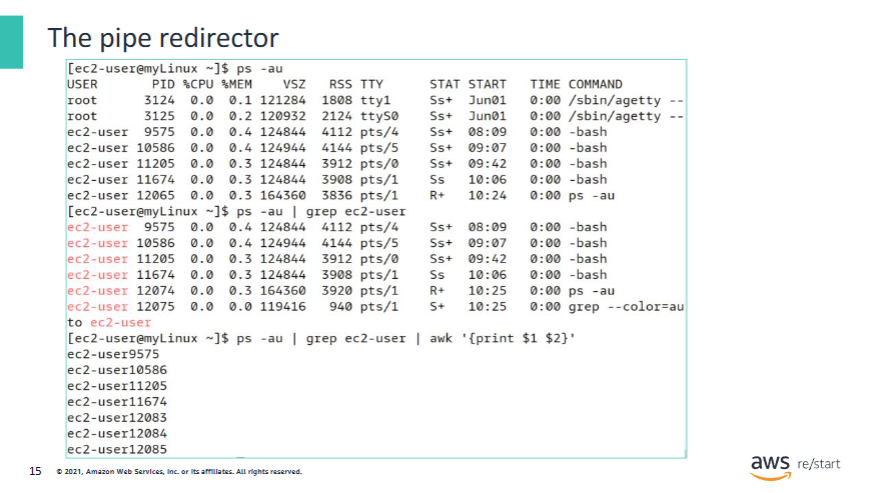

- You can chain several commands by using pipes (multi-stage piping), which is referred to as a **pipeline**.
- The output of the first command becomes the input of the second command:

```bash
ps -au | grep ec2-user | awk '{print $1, $2}'
```

- `ps -au` lists processes.  
- The result of `ps` is sent to `grep ec2-user`, which looks for the word `ec2-user`.  
- The result of `grep` is sent to the `awk` command, which prints the first two columns of the previous result — the process ID and the user name (`awk` is a scripting language and is an advanced Linux topic).

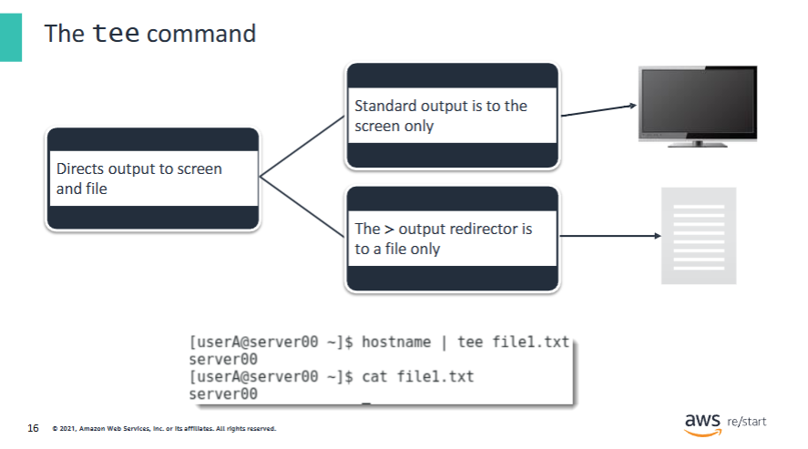

The `tee` command reads the standard input (stdin) and writes the data to both the standard output and files.

In the example, the command `hostname` is directed to `tee` through a pipe `|`.  
The standard input for `tee` is the output of the command `hostname`.  
The `tee` command then writes the hostname to the file `file1.txt` **and** to the screen (in the shell).

```bash
hostname | tee file1.txt
```

## Command substitution, chaining and filtering


This section provides details on command substitution, chaining, and filtering, which are used to nest commands, run a series of commands, and extract text.

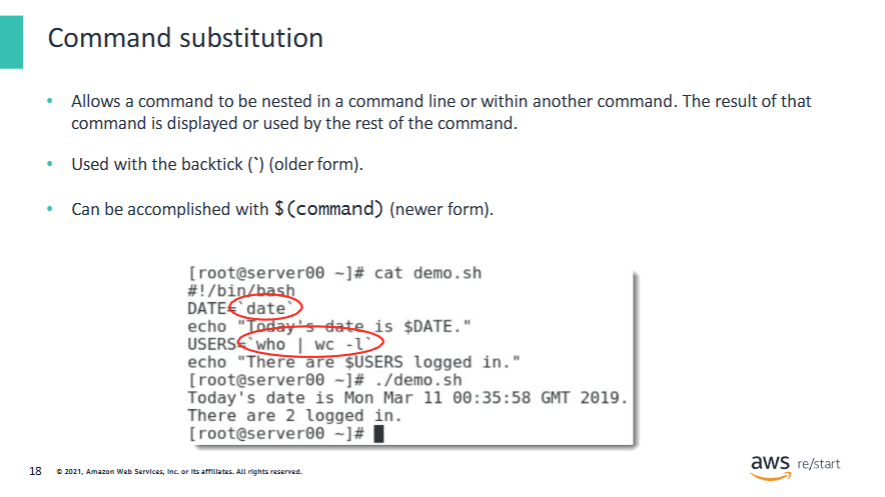

Command substitution is useful when writing Bash scripts.

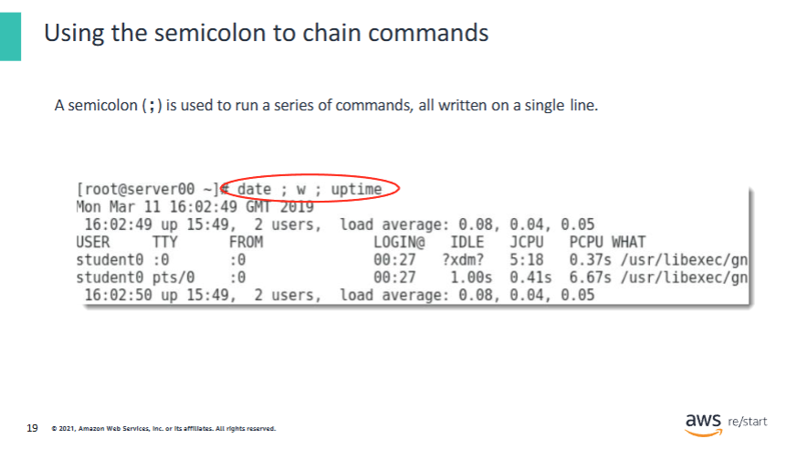

Chaining commands is similar to writing small scripts. Another example is the following:

```bash
yum update ; yum install httpd ; systemctl start httpd &
```

This command:

- Updates packages on the system  
- Installs an Apache HTTP server  
- Starts it  

You can use `&` to run tasks in the background so that you can keep working on the shell.  
Chaining and running tasks in the background can save you a lot of time.

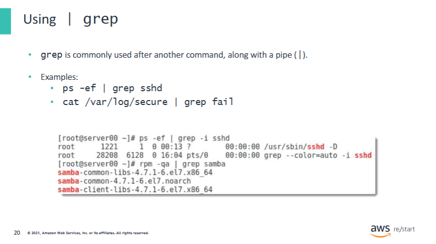

The grepcommand is used to search text and strings in a given file.

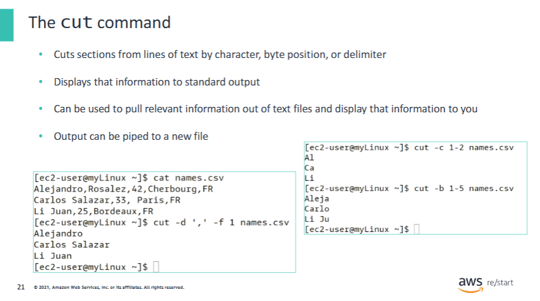

The `cut` command requires the user to specify bytes, fields, or characters to extract.  
When using a field, you must specify the delimiter of the file.

Command options are listed as follows:

- `-b`: Byte  
- `-c`: Column  
- `-f`: Field  
- `-d`: Delimiter  

**Examples:**

- `cut -d ',' -f 1 names.csv`  
  Extracts the first field of each record. The separator is the comma (`,`).

- `cut -c 1-2 names.csv`  
  Extracts the first two characters of each line.

- `cut -b 1-5 names.csv`  
  Extracts the first five bytes of each line.  
  > Depending on the encoding, one letter can be encoded by using one or more bytes.

The `-b` and `-c` options can also be used with lists:

- `cut -c 1,6,7 names.csv`  
  Extracts the characters 1, 6, and 7 of each record.

Or you can use:

- `cut -c 4- names.csv`  
  Extracts from character 4 to the end.

- `cut -c -3 names.csv`  
  Extracts from the first character to the third character of each record.

## Text manipulation and searching


In this section, you will learn about commonly used text search and manipulation commands.

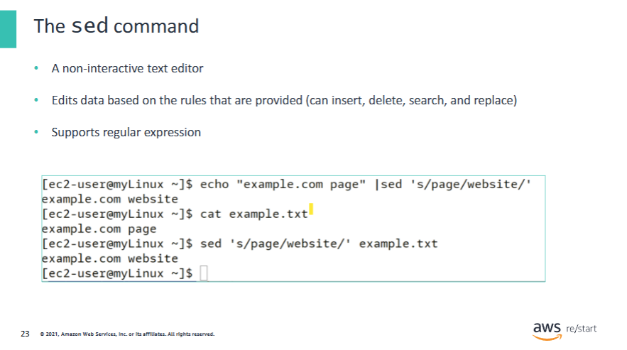

The examples in the screenshot are equivalent.  
The first takes the `echo` output as an input (use of the pipe redirector `|`), and the second works on a file.

```bash
echo "page title" | sed 's/page/website/'
sed 's/page/website/' example.txt
```

The command:

```bash
sed 's/page/website/' example.txt
```

Replaces `page` occurrences with `website` in the `example.txt` file.  
(It takes the content of the file as input but does **not** save the file.)

- By default, `sed` replaces **only the first occurrence** on each line.
- You can use `/n` to replace the **nth** occurrence:  
  ```bash
  sed 's/page/website/5' example.txt
  ```
  Replaces the **fifth** occurrence.

- You can use `/g` to **replace all occurrences**:  
  ```bash
  sed 's/page/website/g' example.txt
  ```

You can use other options to do more advanced text manipulations (e.g., delete and replace strings on ranges of lines).

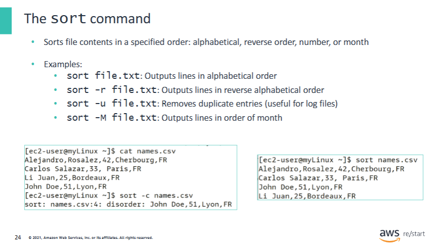

By default, the entire line is taken as a sort key:

- Lines that begin with a number will appear first.  
- Lines that begin with an `a` appear before lines that begin with other letters.  
- Lines that begin in lowercase appear before lines that begin in uppercase.

**Common `sort` options:**

- `-o` outputs the result to a file  
  Example:  
  ```bash
  sort file.txt -o sortedfile.txt
  ```
  is equivalent to:  
  ```bash
  sort file.txt > sortedfile.txt
  ```

- `-r` sorts in **reverse order**

- `-n` sorts **numerically** if the file contains numbers

- `-k` sorts according to the **k-th column** (if the file is formatted as a table)  
  Example:  
  ```bash
  sort -k2 file.txt
  ```

- `-u` removes **duplicate lines**

- `-c` tells whether a file is **already sorted**

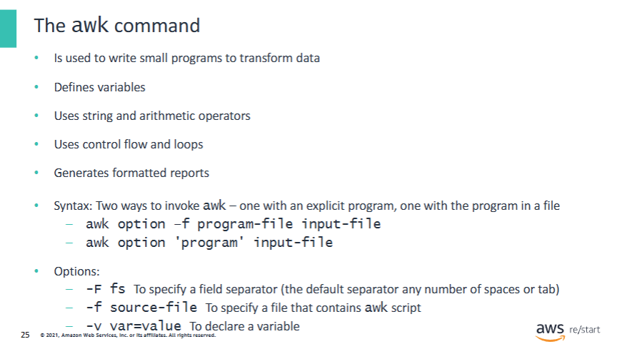

The `awk` command does not require compiling.  
It is aimed at writing small programs.  
The name comes from the names of the three developers: **Aho**, **Weinberger**, and **Kernighan**.

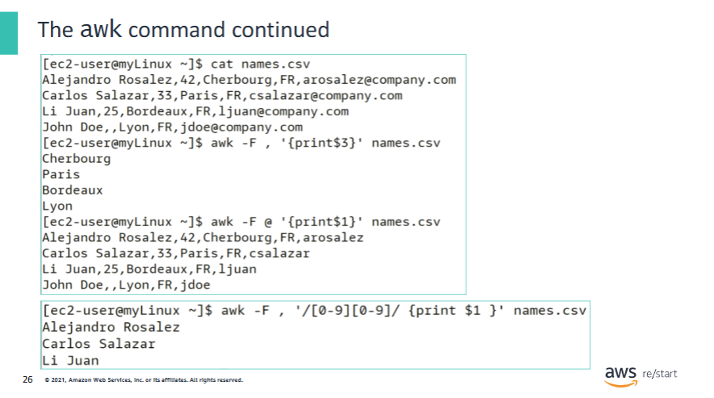

- `awk` is used as follows:

```bash
awk [options] 'program' inputFile
```

- **program** can be in the form `{ action }`

### Beispiele:

- ```bash
  awk -F , '{ print $3 }' customers.txt
  ```
  - The field separator is a comma (`,`)
  - The program is `print $3`: Prints the **third field** on each record in the `customers.txt` file

- ```bash
  awk -F @ '{ print $1 }' customers.txt
  ```
  - The field separator is `@`
  - The **first field** becomes everything **before** the `@` (instead of just the first name)

- **program** can also be in the form:  
  `select_record_or_field { action }`

- The program can use a regular expression to match records or apply rules:

```bash
awk -F , '/[0-9][0-9]/ { print $1 }' names.csv
```
- Selects lines that contain a **two-digit number**  
- The last line of the file is filtered out

```bash
awk -F , '$2 > 35 { print $1 }' names.csv
```
- Selects only records for which the **second field is greater than 35**  
- Output example: `Alejandro Rosalez`

- `awk` can also use special patterns to perform actions **before and after** the input is processed:

```bash
awk 'BEGIN { print "Start Processing." }; { print $1 }; END { print "Done! :]" }' names.csv
```

- This program:
  - Prints `"Start Processing."`
  - Then displays the **first field** of each record
  - Finally prints `"Done! :]"` after processing all lines

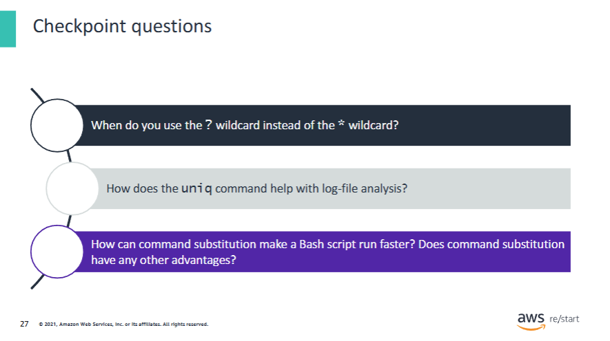

1. The question mark (`?`) specifies that only a **single character** should be considered as the wildcard.  
   The asterisk (`*`) specifies that the wildcard can contain **one or more characters**.

2. With the `uniq` command, you can more easily manage the administration of files, such as logs with many duplicate lines of text.  
   For example:

   ```bash
   uniq -c logfile.log
   ```

   This would output each unique line. Using the `-c` option includes the **count of occurrences** from the log file.

3. If a command must run for a long time to complete, then running the same command repeatedly will negatively affect the script’s performance.  
   Running the command once—and storing the output in a variable—can make it faster.

   **Command substitution** also improves script maintenance, because the update requires only one change.  
   Without command substitution, updating the script would require searching the entire file for every occurrence of the command.

   **Important:** If the output from the command might change while the script is running, **do not use command substitution**.

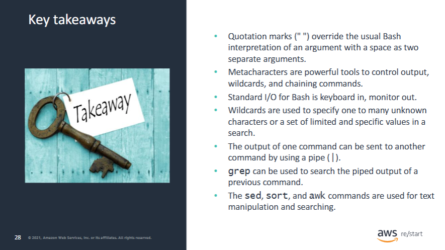

The following are the key takeaways for the **Working with Commands** lesson:

- Quotation marks (`" "`) override the usual Bash interpretation of an argument with a space as two separate arguments.  
- Metacharacters are powerful tools to control output, wildcards, and chaining commands.  
- Standard I/O for Bash is **keyboard in**, **monitor out**.  
- Wildcards are used to specify one to many unknown characters or a set of limited and specific values in a search.  
- The output of one command can be sent to another command by using a **pipe (`|`)**.  
- `grep` can be used to search the piped output of a previous command.  
- The `sed`, `sort`, and `awk` commands are used for text manipulation and searching.
