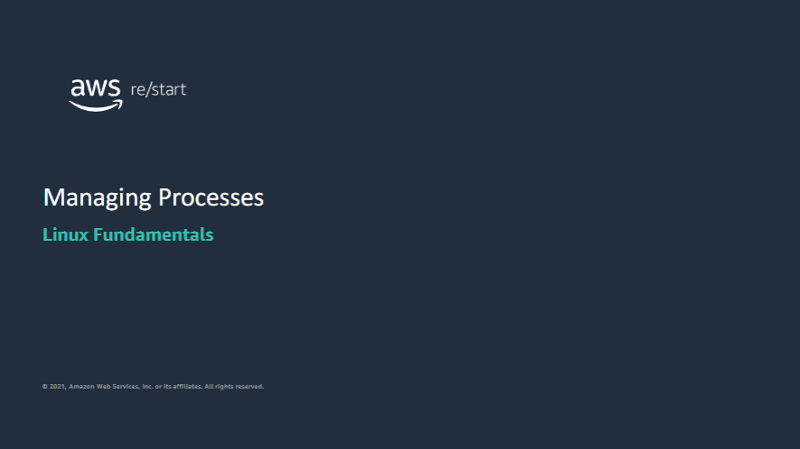

Welcome to Managing Processes

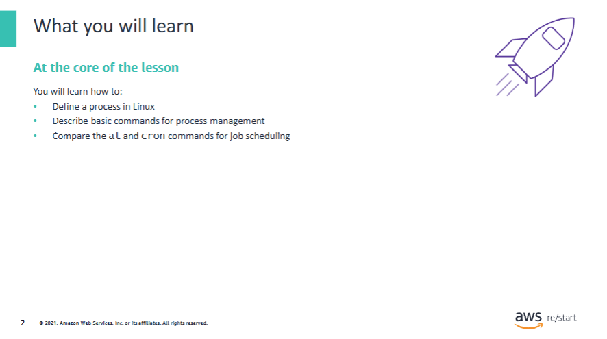

During this lesson, you will learn how to:

- Define a process in Linux  
- Describe basic commands for process management  
- Compare the `at` and `cron` commands for job scheduling

## What is a process?


This section defines a process in Linux.

### Programs

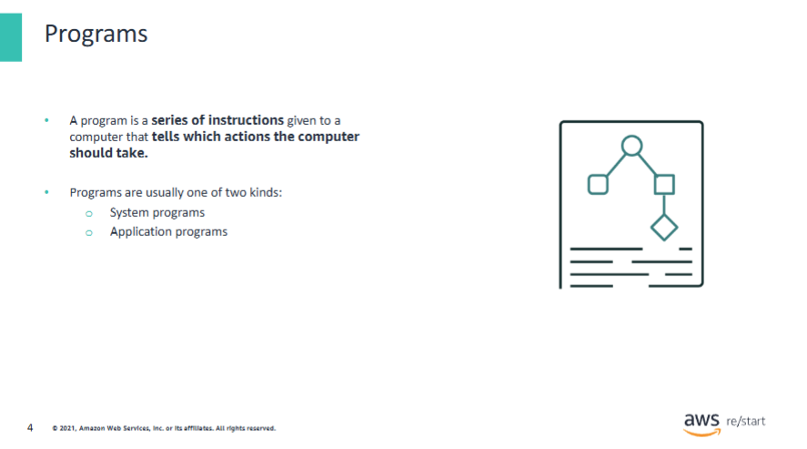

Prior to covering what a process is, you must understand what a **program** is.  
Programs are instructions given to the computer to indicate which actions the computer should take.

There are two kinds of programs: **system** and **application**.

### A system program has the following attributes:

- Primal computer functions  
- Operating system commands  
- Usually do not interface with the computer user  

**Utility programs** are examples of system programs.

### An application program has the following attributes:

- Comprehensive program that performs a specific function  
- Can be used by a user or another program  

**Word processors**, **database management**, and **games** are examples of application programs.

### The two major differences between system and application programs:

- A **system program** is a **native computer function**.  
- An **application program** is **added** to the computer.

### How a program is found


When a command is run, the system searches the `$PATH` variable for the executable file for the program corresponding to the command.  
When the executable is found, the system:

- Loads the file into memory  
- Schedules running time for it on the processor  
- Assigns it a **process ID number (PID)**

Most process administration is done by using this **PID**.

## What is a process?

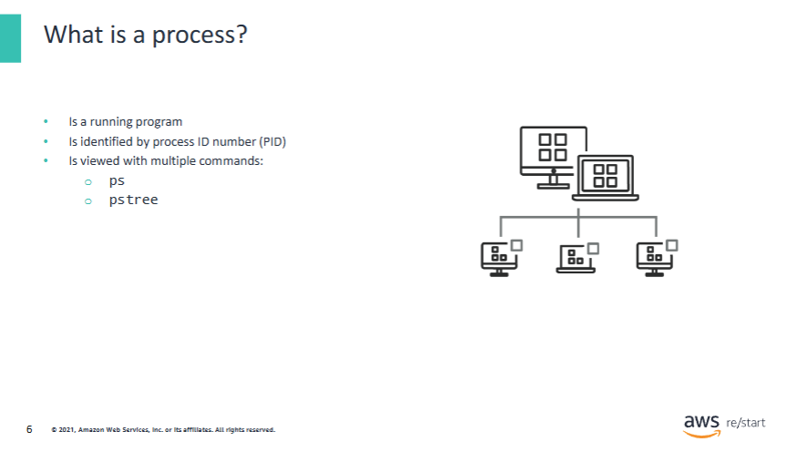

Processes found in a Linux system include services started by the operating system and programs started by individual users.

**Process ID numbers (PIDs)** are used to identify an active process.  
A PID usually looks like a string of numbers, such as the following: `31532`.

You can view these processes with a few commands, such as `ps` and `pstree`.

- The main difference between `ps` and `pstree` is:
  - `ps` is shown in a **list view**
  - `pstree` is shown in a **tree view**

Both commands show running processes in Linux.

### States of a process

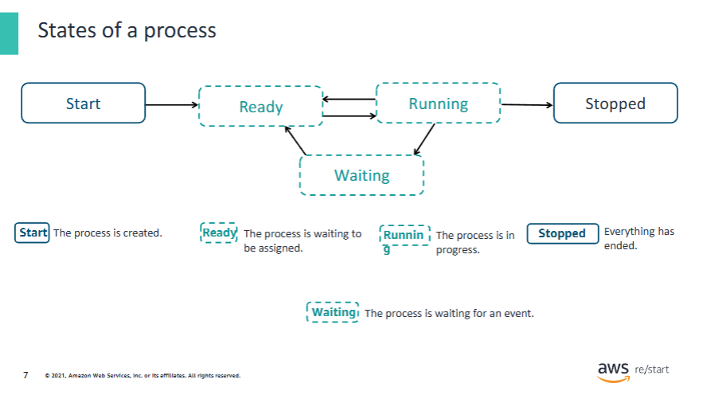

When a process runs, it can cycle through various states:

1. **Start**: The process is created.  
2. **Ready**: The process is waiting to be assigned processor time.  
3. **Running**: The process is in progress.  
4. **Waiting**: The process is waiting for an event.  
5. **Stopped**: The process is finished running.

### What is a child process

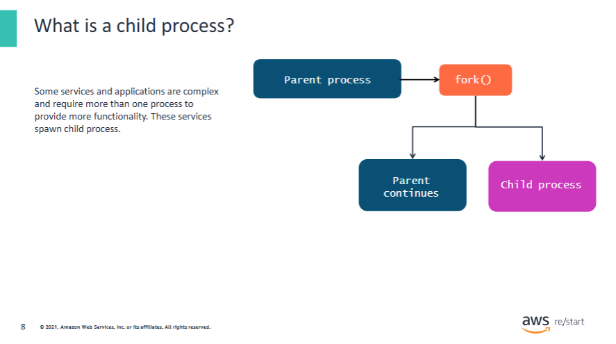

Some services and applications are complex and require more than one process to provide more functionality.  
These services spawn **child processes**.

Child processes can also be known as **subprocesses**.  
Often, child processes inherit most of the attributes of the **parent process**.

## Basic commands for process management

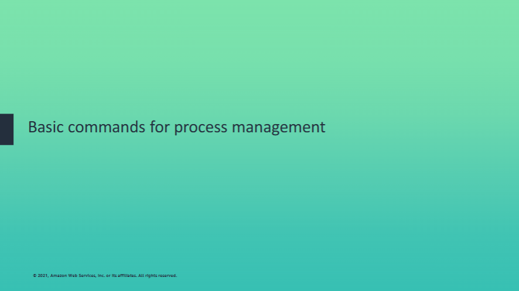

This section describes basic commands for process management.

### The `ps` command

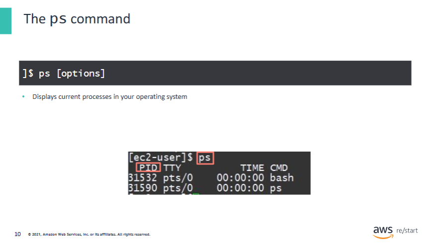

#### What is the `ps` command?

The `ps` (process status) command gives an overview of the current processes that are running in your operating system (OS).  
Within this overview, it displays information on the active processes, including:

- **Process ID (PID)**  
- **Terminal type (TTY)** that the user is using  
- **Time** that the process has been running  
- **Command (CMD)** – the name of the command that launched the process

You can use the syntax:

```bash
ps [options]
```

To filter the information of the active processes.

---

#### Why would you want to use the `ps` command?

Linux is good at running multiple processes at one time.  
As a user, you might need to:

- Understand what processes are running  
- See how long a process has been running  
- Find out which **PID** a process is under  

This information is useful for **troubleshooting** to save time and effort.

---

#### Example syntax:

- ```bash
  ps -ef | grep sshd
  ```
  Use `grep` to filter an exact process.  
  In this example, find the `sshd` process in the `ps` output.  
  If you have multiple running processes (which can be pages long), this command helps filter to an exact match.

- ```bash
  ps -ef | less
  ```
  Use `less` to display all processes in a page-by-page format.

---

#### How to display all processes:

```bash
ps -ef
```

Use this without additional filtering options to list all currently running processes.

### COmmon `ps` command options

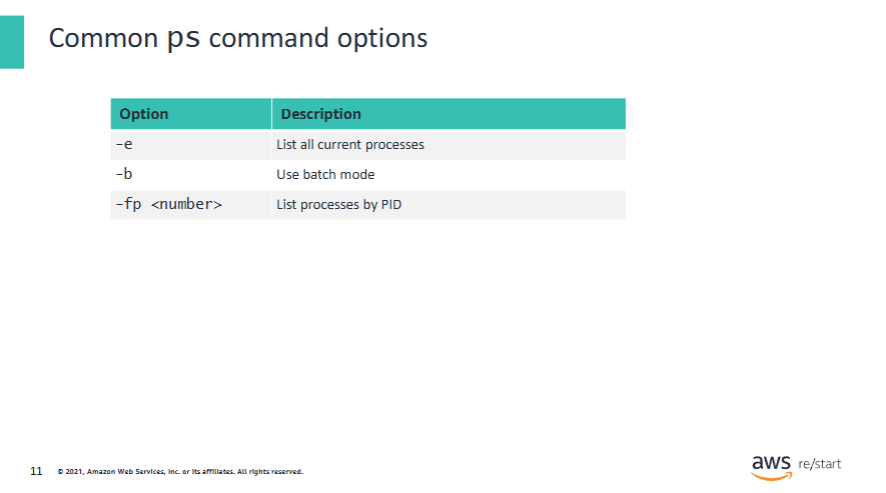

The previous slide touched on the idea that you would use the `ps` command to identify current processes and troubleshoot.  
When troubleshooting using the `ps` command, there are a few most commonly used commands and options.

### Commands and options:

- `ps -e`  
  Displays every current process. `-A` is an identical option.

- `ps -a`  
  Displays all processes **not associated with a terminal**.  
  The `-T` option displays all processes **related to the terminal**.

- `ps -r`  
  Restricts the output to **running** processes only.

- `ps -ef`  
  Views processes in **full-format listing**.

- `ps -fp <number>`  
  Lists processes by **PID**.

- `ps L`  
  Lists all **format specifiers** (columns you can include in the output).

### The `pidof` command


#### What is the `pidof` command?

The `pidof` command shows the **PID of the current running program**.  
It is used to print the PID of a specific program.

**Example:**

```bash
pidof sshd
```

This will show the PID of the `sshd` process.

---

#### Why would you want to use the `pidof` command?

There are not many options with `pidof` because it acts as a simple filter.  
Since it searches for the PID of a **specific running program**, it's useful when you **know exactly what you're looking for** — saving time and effort.

---

#### Example usage:

```bash
pidof [program]
```

Examples:

```bash
pidof sshd
pidof bash
```

The output will display the PID(s) of the specified program.

---

#### Common `pidof` options:

- `-s` → Returns **only one PID**  
- `-c` → Returns only PIDs in the **same root directory**  
- `-w` → Shows **processes that do not show a command line**  
- `-S` → **Separator** used between multiple PIDs in the output

### The `pstree` command


#### What is the `pstree` command?

The `pstree` command displays the **current running processes in a tree format**.  
This command merges **identical branches** (denoted by square brackets `[ ]`) and shows **child processes** under their **parent processes** (denoted by curly brackets `{ }`).

---

#### Why would you want to use the `pstree` command?

- The root of the tree will be a process such as `systemd` or `init`.  
- It shows a **hierarchical view** of processes, making it easier to understand parent-child relationships.  
- You can quickly identify how processes are structured and related.

---

#### Example usage:

```bash
pstree [options] [pid | user]
```

---

#### Example interpretation:

In the output, you might see:

- `systemd` is the root process  
- `amazon-ssm-agent` is one of the child processes  
- `8*[{amazon-ssm-agent}]` means there are **8 instances** of `amazon-ssm-agent`  
- Square brackets `[ ]` indicate a **parent process**  
- Curly brackets `{ }` indicate a **child process**

---

#### Common `pstree` options:

- `-a` → Shows **arguments** in the command line within the output  
- `-p` → Shows the **PID** (displayed in parentheses after the process name)  
- `-c` → **Expands identical subtrees** (by default, `pstree` compacts them)  
- `-n` → Sorts by **parent PID** instead of process name

## The `top` command


#### What is the `top` command?

The `top` command displays a **real-time system summary** and information of a running system.  
It shows system information and a list of **processes or threads** being managed by the Linux kernel.

---

#### Why would you want to use the `top` command?

- It displays **system summary information** and a list of processes or threads that the Linux kernel is currently managing.  
- It provides a **limited interactive interface** for process manipulation.  
- It offers a more **extensive interface for personal configuration**, covering nearly every aspect of system operation.

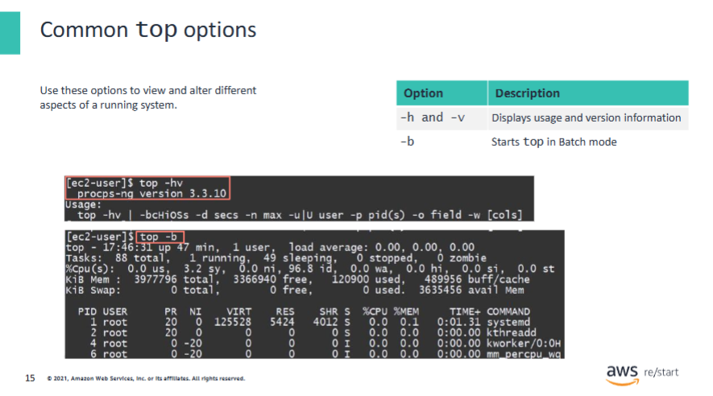

To view or alter different aspects of a running system, use:

```bash
top [option]
```

### Common `top` options:

- `-h` → Displays the **help section** for the `top` command  
- `-v` → Shows the **library version** of `top`  
- `-hv` → Combines both: help and version information  

- `-b` → Starts `top` in **batch mode**  
  - This is primarily used when sending `top` output to **other programs** or **files**

**Example:**

```bash
top -b -n 1 > system_snapshot.txt
```

This writes one iteration of `top` output to `system_snapshot.txt` in batch mode.

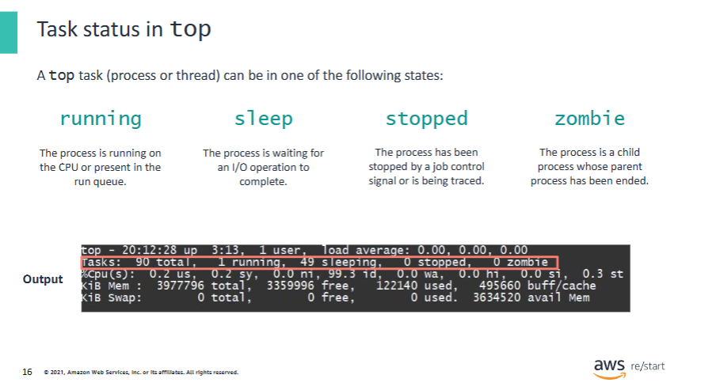

The `top` command shows tasks (processes or threads) in one of the following states:

- **Running**  
  A process that is currently running on the CPU or is present in the run queue.

- **Sleep**  
  A process that is waiting for an I/O operation to complete.

- **Stopped**  
  A process that has been stopped by a job control signal or is being traced.

- **Zombie**  
  A child process whose parent process has been ended.

The output of the `top` command under **Tasks** contains this information.

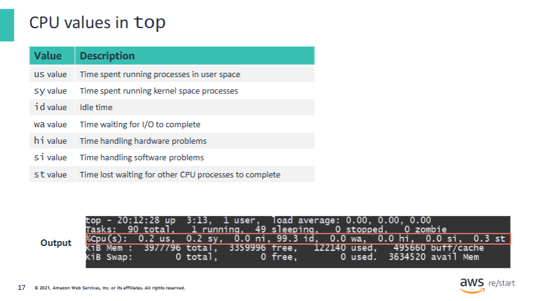

**CPU values in `top`** are sections that show various CPU usages throughout the system.  
These values help analyze the effectiveness and performance of the system.  
They are measured in **percentages**, based on the most recent refresh interval.

#### Breakdown of CPU fields:

- **us** value – Time spent running **processes in user space**  
- **sy** value – Time spent running **kernel space** processes  
- **id** value – **Idle time** (when CPU is not doing anything)  
- **wa** value – Time **waiting for I/O** operations to complete  
- **hi** value – Time spent handling **hardware interrupts**  
- **si** value – Time spent handling **software interrupts**  
- **st** value – Time **stolen from this VM** by other virtual machines (in virtualized environments)

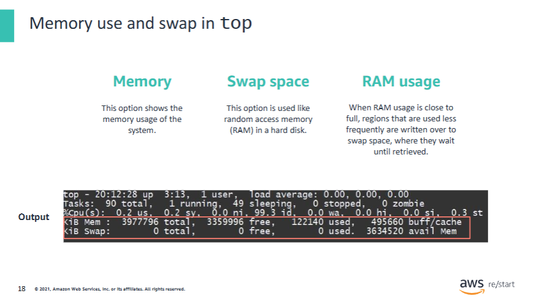

There are three major memory uses and swaps shown in `top`:

- **Memory** shows the memory usage of the system.
- **Swap space** is used like random access memory (RAM) on a hard disk.
- When **RAM usage** gets close to full, less frequently used regions are written over to **swap space**, where they wait until retrieved.

---

### Memory Information in `top`

This information is displayed **at the top of the `top` screen** after running the command.

- The value `KiB` stands for **kibibytes**.  
  It can also be expressed as **exbibytes (EiB)** or other units, depending on scaling.  
  You can enforce unit scaling with the `E` option (e.g., `top -E m` for MiB).

---

### `KiB Mem` line:

- Shows **physical memory**
- Displays how much is:
  - **Free**
  - **Used**
  - **Buffered or cached**

### `KiB Swap` line:

- Shows **virtual memory**
- Displays how much is:
  - **Free**
  - **Used**
  - **Available** (this refers to physical memory that is still available)

The output of the `top` command under `KiB Mem` and `KiB Swap` contains this information.

## The `kill` command

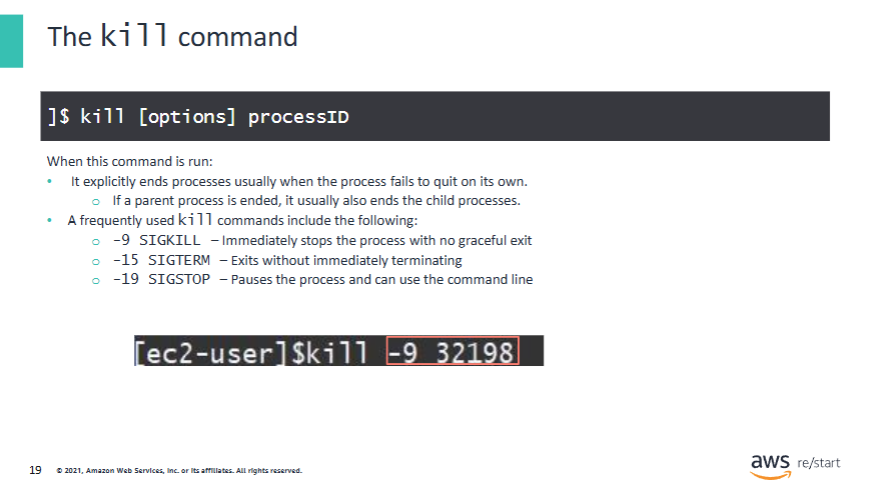

#### What is the `kill` command?

- The `kill` command **explicitly ends processes**, usually when the process fails to quit on its own.

---

#### Why would you want to use the `kill` command?

If you've ever tried to close a program and it froze instead, you might have used **Task Manager** to end it.  
The `kill` command works similarly but is used via the **command line**.

---

#### Common `kill` signals:

- `-9` (**SIGKILL**) → **Stops any process immediately** (force kill)  
- `-15` (**SIGTERM**) → Politely asks the process to terminate (default signal)  
- `-19` (**SIGSTOP**) → **Pauses** the process (can be resumed later)

> ⚠️ Note: The name of the `kill` command may be changed in the future.

---

#### Example usage:

```bash
kill -9 <PID>
kill -15 <PID>
kill -19 <PID>
```

## The `nice` and `renice` commands

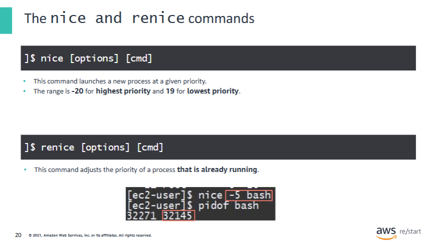

#### What is the `nice` command?

- The `nice` command **manages processes that are scheduled** to run at specific times on the CPU.  
- It controls the **scheduling priority** of a process.

- The priority range:
  - **Highest priority**: `-20`
  - **Lowest priority**: `19`

---

#### Why would you use the `nice` command?

- To run programs **on a schedule** with certain **priorities**.  
- When a program is given a **higher priority** (lower number), the **kernel allocates more CPU** time to it.

---

#### What is the `renice` command?

- The `renice` command is used to **adjust the priority of an already running process**.

---

#### Why would you use the `renice` command?

- To **modify** the scheduling priority **after** the process has started.  
- This can be useful for:
  - Improving responsiveness
  - Throttling CPU-heavy processes
  - Dynamically managing system performance

---

#### Examples:

```bash
nice -n 10 myscript.sh         # Start with low priority
renice -n -5 -p 12345          # Raise priority of process with PID 12345
```

## The `jobs` command


#### What are jobs?

Jobs are **processes that users start and manage**, identified by a **job number**.  
You use the `jobs` command to view and manage these background or suspended processes.

---

#### Foreground jobs:

- Jobs that run in the **foreground** consume the shell until they are completed.
- You can move jobs **to the foreground** with:

```bash
fg %jobnumber
```

---

#### Background jobs:

- Jobs that run in the **background** continue to run, but the shell becomes available to use.
- To move a job to the background:
  1. First **suspend** it using `CTRL + Z`
  2. Then run:

```bash
bg %jobnumber
```

---

#### Using the `jobs` command:

- Lists all current jobs with their job numbers and status.

---

#### Syntax:

- Run a job in the **background**:

```bash
bg [job process number or name]
```

- Bring a job to the **foreground**:

```bash
fg [job process number or name]
```

## The `at` and `cron` commands

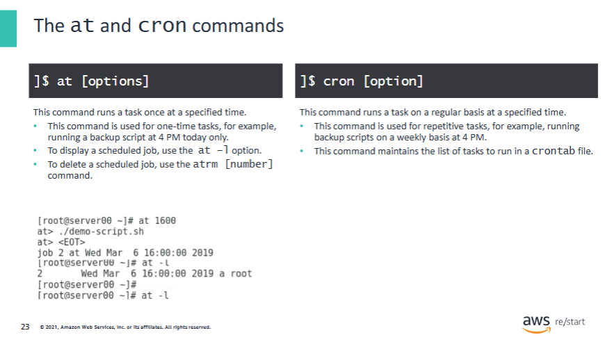

#### What are the `at` and `cron` commands?

- The `at` command is useful when you need to **run a task only once** at a specified time.
- The `cron` daemon is useful when you need to **run tasks on a regular basis** at a specified time.

---

#### Why would you use the `at` and `cron` commands?

- You can **schedule tasks** with `at` and `cron` without manually executing them.
- **Administrators** can configure services or scripts to run automatically at specified times.
- This is useful for maintenance tasks, updates, backups, and more.

---

#### Predefined `cron` directories

These are **precreated and prescheduled directories** where administrators can place scripts that will run automatically:

- `/etc/cron.hourly`  
- `/etc/cron.daily`  
- `/etc/cron.weekly`  
- `/etc/cron.monthly`

Scripts placed in these directories will be executed according to the folder's schedule.

## The `crontab` command

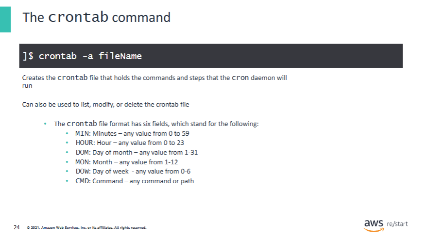

#### What is `crontab`?

- `crontab` stands for **cron table**.  
- It is a list of scheduled commands, and the `crontab` command is also used to **manage this table**.

---

#### The crontab consists of the following fields:

1. **Minute** (0–59)  
2. **Hour** (0–23)  
3. **Day of the month** (1–31)  
4. **Month of the year** (1–12)  
5. **Day of the week** (0–7, where both 0 and 7 are Sunday)  
6. **Command** to execute

Example crontab entry:

```bash
30 2 * * 1 /usr/local/bin/backup.sh
```

This runs the `backup.sh` script every **Monday at 2:30 AM**.

---

- `crontab` allows the user to **specify commands or scripts** to be run at specific times.  
- The **cron daemon** checks the crontab file **each minute** and runs tasks that match the schedule.  
- These commands and steps are stored in the **user’s crontab file**.

---

#### Why would you use `crontab`?

It is useful for:

- Regularly scheduled **backups**
- **Clean-up scripts**
- Scripts to **rotate log files**
- **Reminder messages**

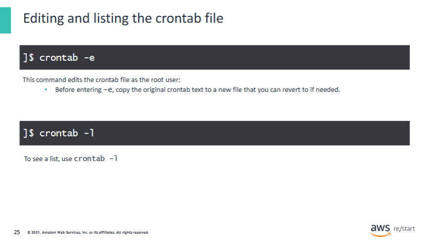

Edit the crontab file as the root user by using the `crontab -e` command.  
This automatically installs the new crontab file, putting all changes into place.  
It uses the system's designated default text editor (usually Vim).

### Best practices:
- Use `crontab -l` to list files.
- Before you enter `-e`, copy the original crontab text to a new file that you can revert to if needed.

### There is a system crontab and a user crontab:
- **System-wide scheduled tasks** are managed by root at:
  ```
  /etc/crontab
  ```
- **User-specific tasks** are managed at:
  ```
  /var/spool/cron/crontabs/$USERNAME
  ```

You should always be editing with:

```bash
crontab -e
```

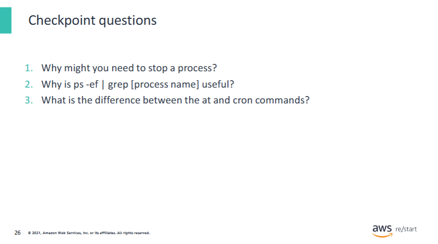

**Answers:**

1. If a process becomes unresponsive, you must manually shut it down.  
   An example would be a web server that—although it is running at 100% CPU—is not serving webpages.  
   If the normal processes for stopping the web server fail, you must manually stop the process.

2. Using this command, an administrator can verify whether a **program**, a **process**, or an **application** is running.

3. You use the `at` command to run a **single task**, and use `cron` to run **repeated tasks**.

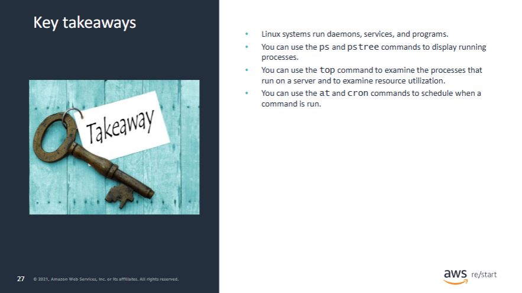

### Some of the key takeaways include the following:

- Linux systems run **daemons**, **services**, and **programs**.  
- You can use the `ps` and `pstree` commands to **display running processes**.  
- You can use the `top` command to **examine processes** and **resource utilization** on a server.  
- You can use the `at` and `cron` commands to **schedule when a command is run**.
