 
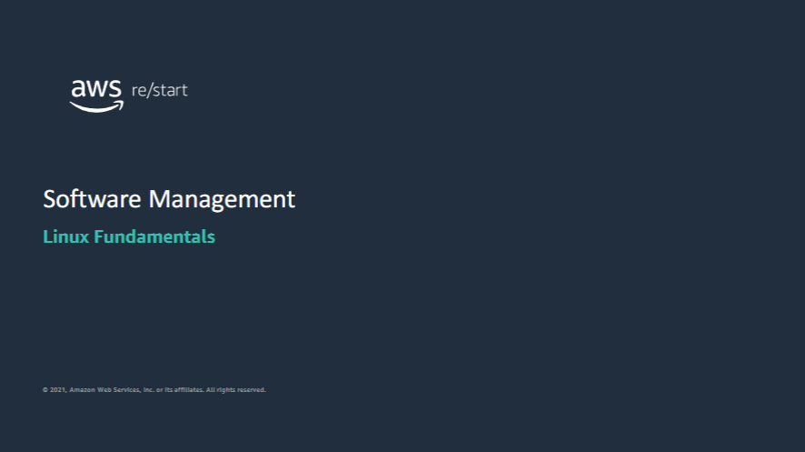

Welcome to Software Management.

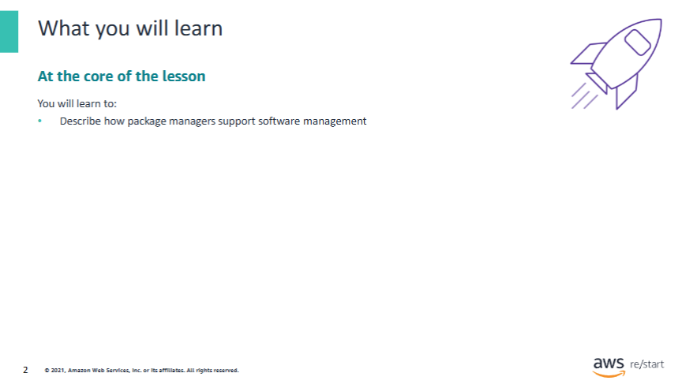

You will learn how to:

- Describe how package managers support software management

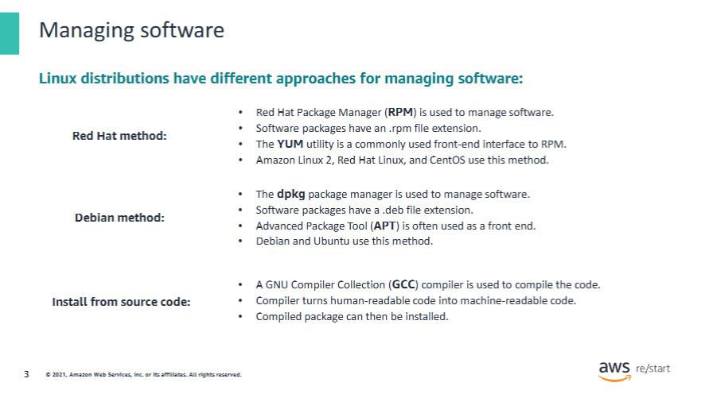

The approach for managing software varies depending on the **Linux distribution type**.  
Features such as the **software package format** and the **utility tools** used to install, update, and delete packages differ by distribution.

---

### Red Hat-based distributions

- Use the **Red Hat Package Manager (RPM)** tool  
- Packages are stored in files with an `.rpm` extension  
- Common front end: **YUM** (Yellow Dog Updater, Modified)  
  - Tracks **package dependencies**  
  - Can configure **automatic updates**  
- **Amazon Linux 2** uses this RPM/YUM approach

---

### Debian-based distributions

- Use the **dpkg** package management tool  
- Packages have a `.deb` file extension  
- Common front end: **APT (Advanced Package Tool)**  
  - Provides higher-level package management on top of `dpkg`

---

### Source code installations

- You can also install or update software using a package in **source code** format  
- This requires compiling the source code using a **compiler**, such as:

  - **GCC (GNU Compiler Collection)**  
    - Supports C, C++, Objective-C, Go, and more

- After compiling the package, you can proceed with installation

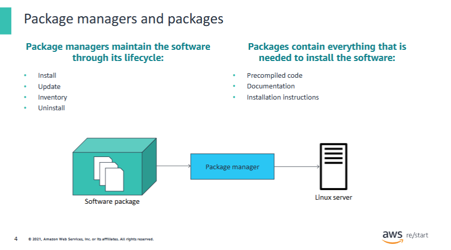

Software in a Linux system is maintained using a package manager such as YUM orRPM.A package manager installs, updates, and deletes software that is bundled in a package. A package contains everything that is needed to install the software, including the precompiled code, documentation, and installation instructions. 

The Red Hat and Debian software management methods rely on repositories of software packages.

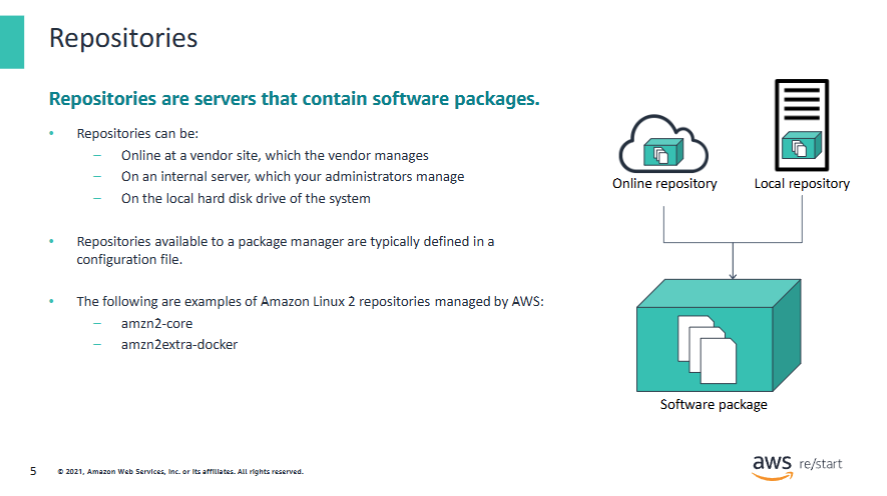

Software packages are retrieved from a **repository** that can be hosted **online** or on a **local system**.  
When you use a package manager, you define the **location of the repositories** that contain the software packages the manager can access.

This repository information is typically defined in a **package manager configuration file**.

---

### Example: YUM

- For the **YUM** package manager, the repository information is stored in:

```bash
/etc/yum.conf
```

---

### AWS and Amazon Linux 2

AWS provides **online repositories** from which you can download software packages.  
For **Amazon Linux 2**, the following repositories are available:

- `amzn2-core`:  
  The **main repository** containing the latest software packages for the **core operating system components**

- `amzn2extra-docker`:  
  A repository containing **extra software packages** specifically for **Docker-related components**

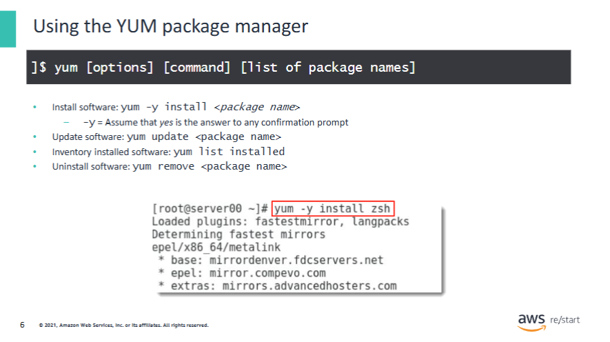

The YUM package manager can be used to install, update, and remove software packages on Linux distributions based on Red Hat Linux. It also includes commands to list the installed software packages and manage repositories.

The screen capture example shows how to install the Z shell package using the yum command. Z shell is another Linux shell based on the Bourne shell.

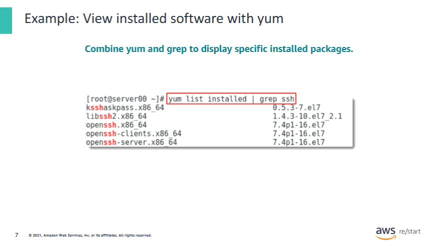

This example shows how to list the software packages installed in the system using the yum command. The grep command filters the resulting output to list only packages related to the Secure Shell (SSH) utility.

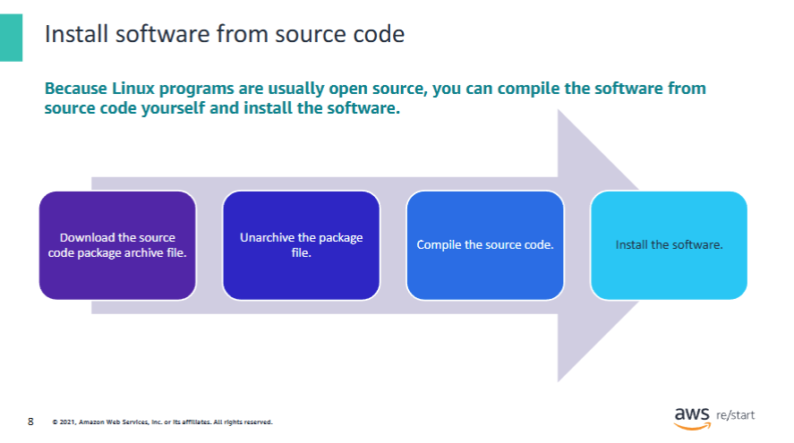

### The following are the typical steps involved in installing software from source code:

1. **Download the source code package**  
   - Software source code packages are typically compressed archive files called a **tarball**.

2. **Unarchive the package file**  
   - Tarballs usually have the `.tar.gz` file extension and can be **unarchived and decompressed** using the `tar` command.  
   - Example:  
     ```bash
     tar -xvzf package-name.tar.gz
     ```

3. **Compile the source code**  
   - A **GCC compiler** can be used to compile the source code into **binary code**.  
   - Usually done by running `./configure`, `make`, and optionally `make test`.

4. **Install the software**  
   - Once the source code has been compiled, **install the software** by following the instructions that are typically included in the package.  
   - Often done via:  
     ```bash
     sudo make install
     ```

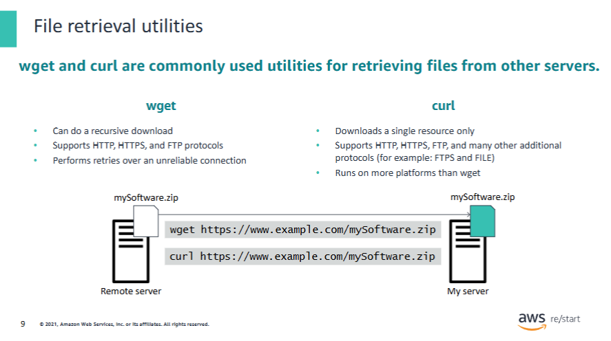

Two popular utilities, `wget` and `curl`, are commonly used to **download files to a server**.  
Both support the **HTTP**, **HTTPS**, and **FTP** protocols and provide additional capabilities of their own.

---

### Notes:

- **`wget`**
  - Can download a **single resource** or **multiple resources recursively** under a given URL
  - Automatically **resumes a download** if the network connection is broken

- **`curl`**
  - Can download **only a single resource at a time**
  - Supports **more protocols** and runs on **more platforms** than `wget`
  - Supports the **FILE** protocol (can retrieve a file from the **local file system**)

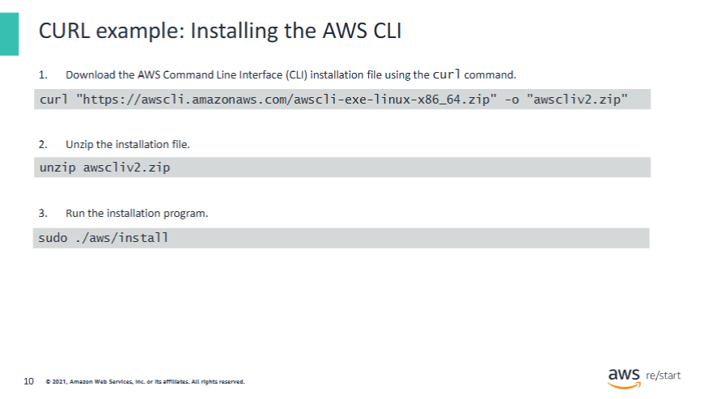

### Steps for installing the AWS Command Line Interface (CLI) on a Linux system

This example also shows how the `curl` command can be used.

1. **Download the AWS CLI installation file** using the `curl` command.  
   - The `-o` option specifies the file name that the downloaded package is written to.  
   - Example:
     ```bash
     curl "https://awscli.amazonaws.com/awscli-exe-linux-x86_64.zip" -o "awscliv2.zip"
     ```

2. **Unzip the installation file**  
   - When the file is unzipped, a directory named `aws` is created under the current directory.
     ```bash
     unzip awscliv2.zip
     ```

3. **Run the installation program**  
   - The installation command uses a file named `install` inside the newly unzipped `aws` directory:
     ```bash
     sudo ./aws/install
     ```

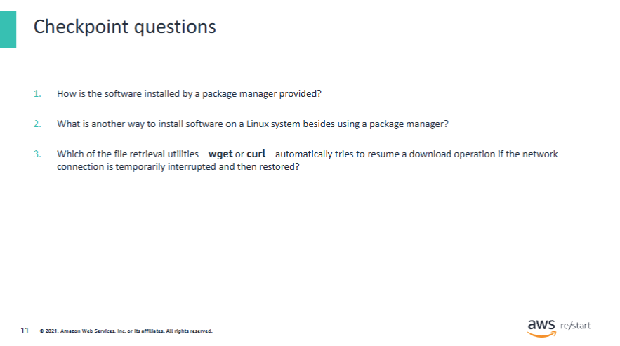

**Answers:**

1. The software installed by a package manager is provided in a **software package**.

2. You can also install software on a Linux system **from source code**.

3. `wget` automatically attempts to **resume a download operation** if a network connection is temporarily lost and then restored.

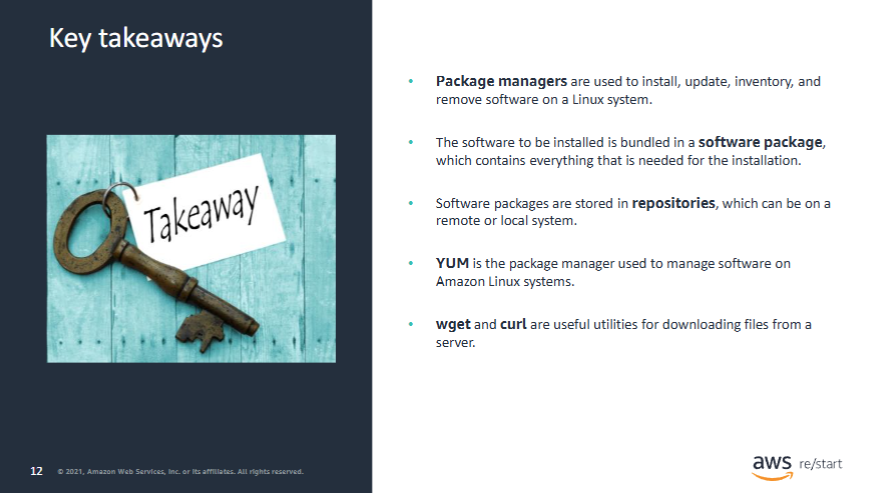

### Key takeaways from this lesson include the following:

- **Package managers** are used to **install, update, inventory, and remove** software on a Linux system.

- The software to be installed is bundled in a **software package**, which contains everything needed for the installation.

- **Software packages are stored in repositories**, which can be located on a **remote** or **local** system.

- **YUM** is the package manager used to manage software on **Amazon Linux** systems.

- **`wget`** and **`curl`** are useful utilities for **downloading files from a server**.
