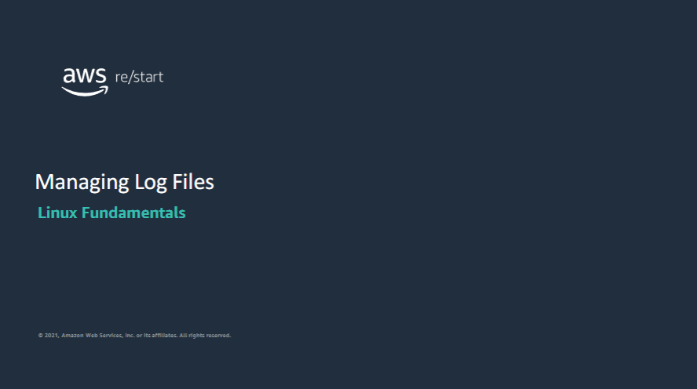

Welcome to Manage Log Files

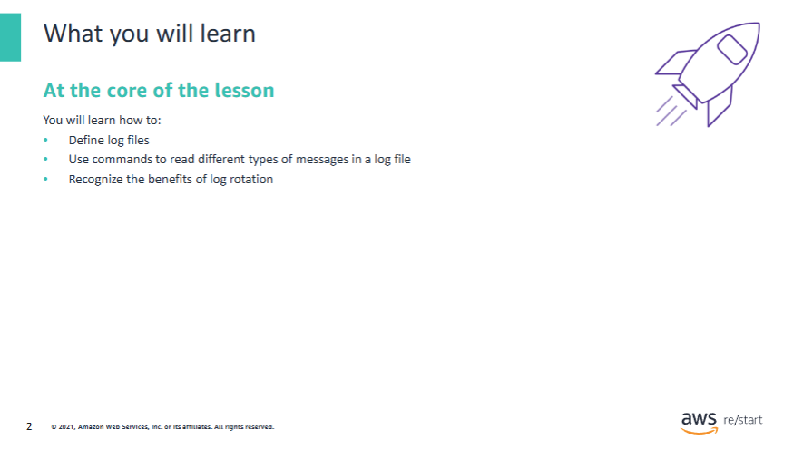

### You will learn how to:

- Define **log files**  
- Use commands to **read different types of messages** in a log file  
- Recognize the **benefits of log rotation**

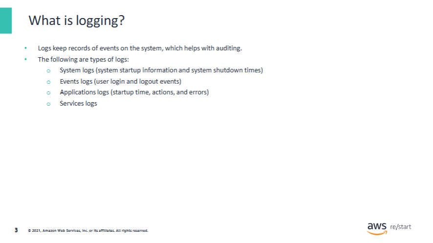

Logs are a **record of what happened** in the operating system or an application.  
They are particularly useful if an **issue occurs**.

**Administrators**, **developers**, and others can trace:

- Which application triggered an **error**
- Which user made a **wrong action**
- Which outside host **accessed the server**


Logging can help **troubleshoot issues**:

- What or who caused an **error**?  
- Did anyone wrongfully **access a file**, a **database**, or a **server**?

Logs are a key to:

- **Security audits** (gathering information about the system)  
- **Service-Level Agreements (SLAs)**  
  - Example: Troubleshooting must start within *x* hours after an issue occurs

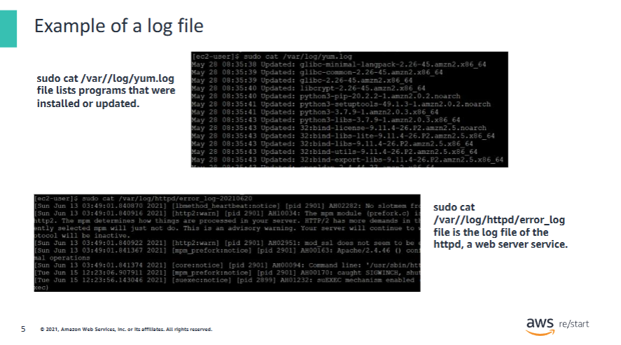

The first log in the `/var/log/yum.log` file lists **programs that were installed or updated**.  
(YUM is a package management utility to install, update, and remove software.)

The second is the **log file of `httpd`**, a web server service.

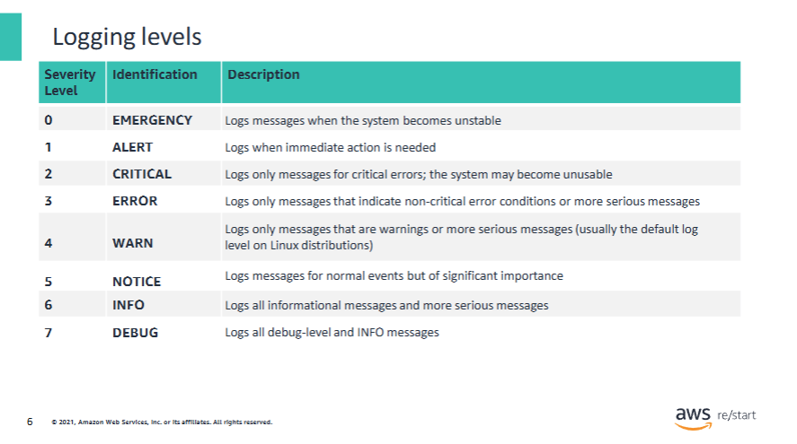

These logging levels are the logs that the **Linux operating system** offers.  
Some programs or libraries may offer **fewer logging levels**, such as:

- `debug`
- `info`
- `warning`
- `error`

A default logging level is often set to **`info`**.

---

### Important behavior:

- **Logs of the current logging level and all higher-priority levels are displayed.**

For example:

- If you set the logging level to `WARN` (level 4), then logs from levels:
  - `NOTICE`
  - `INFO`
  - `DEBUG`

...are also displayed **along with WARN and more critical levels**.

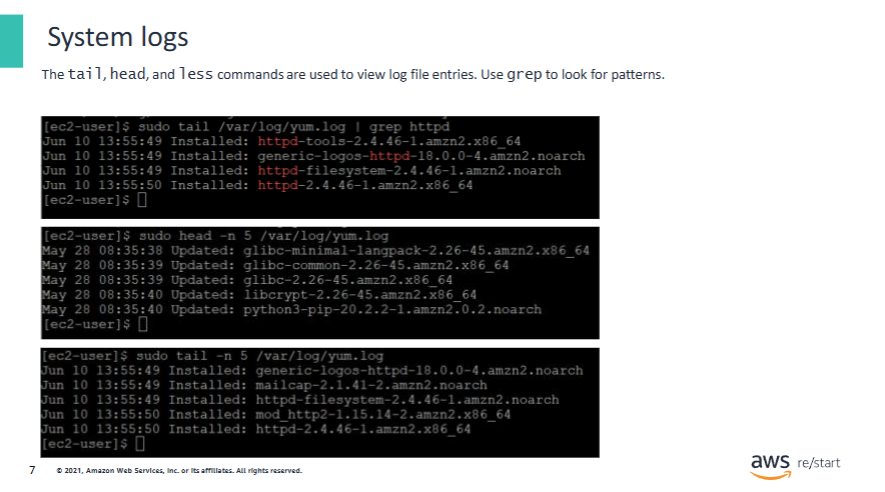

The following commands are useful for **reading logs**:

- `cat`
- `less`
- `more`
- `tail`
- `head`

You can also use the **pipe redirector (`|`)** together with `grep` to **search for specific patterns** in a log file.

Example:

```bash
cat /var/log/syslog | grep error
```

Additionally, you can open log files using text editors such as:

- `vi`
- `gedit`

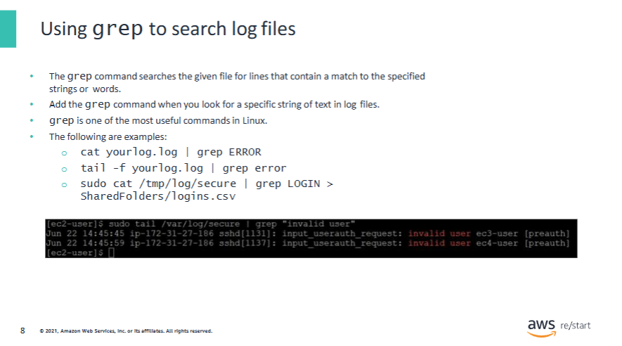

The following are some more details on these errors:

- `cat yourlog.log | grep ERROR`  
  - Searches for the word `ERROR` in the `yourlog.log` file  
  - Displays the matching lines in the console  
  - Explanation: `cat` reads the content and pipes it to `grep`

---

- `tail -f yourlog.log | grep error`  
  - Continuously monitors the **last 10 lines** of `yourlog.log`  
  - Searches for the word `error` and displays matching lines in real time  
  - Note: Without additional options, `tail -f` always starts with the last 10 lines

---

- `sudo cat /var/log/secure | grep LOGIN > SharedFolders/logins.csv`  
  - Searches for the word `LOGIN` in `/var/log/secure`  
  - Writes the matching lines to the file `SharedFolders/logins.csv`  
  - `sudo` is required because `/var/log/secure` needs elevated permissions

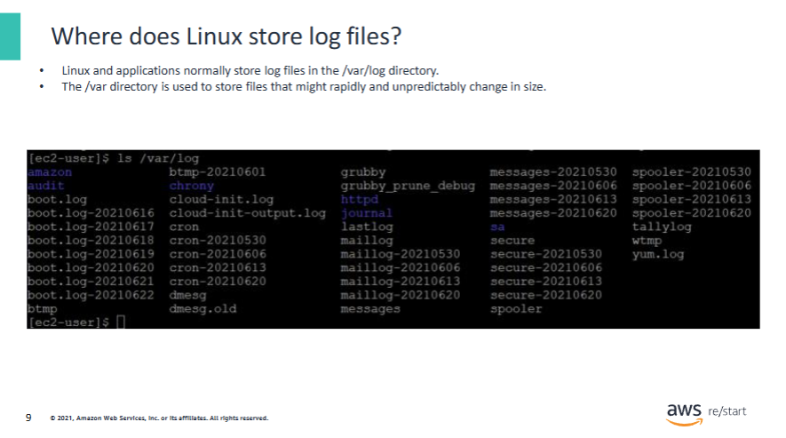

Linux usually stores log files in the `/var/log` directory.

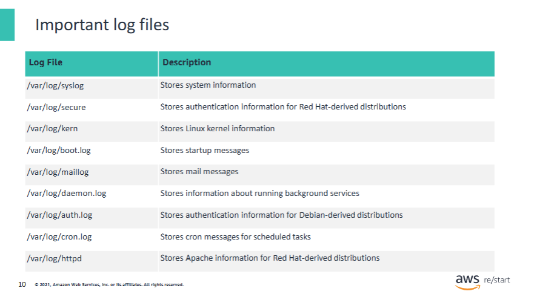

Important log files include the following:

- `/var/log/yum.log`  
  Stores **YUM installer information** for Red Hat-derived distributions

- `/var/log/apache2/access.log`  
  Stores **Apache access information** (such as requests, IPs, status codes) for Debian-derived distributions

- `/var/log/lastlog`  
  Stores information about **successful logins** to the host

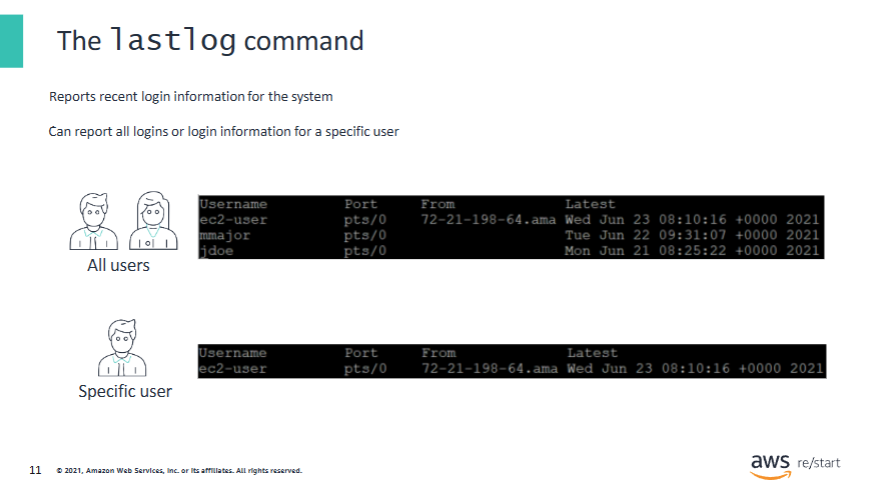

The `lastlog` command retrieves user information from the `/var/log/lastlog` file and outputs it in the console.

### Examples:

- `lastlog -u ec2-user`  
  Displays login information for the **ec2-user** only.

- `lastlog -t 1`  
  Displays **login information more recent than 1 day ago**.

For more options, use:

```bash
man lastlog
```

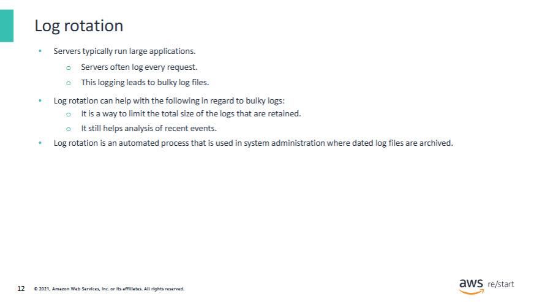

Log rotation is **not activated by default**.

With the `logrotate` utility, you can:

- **Compress**, **rename**, or **clean up** log files
- **Activate rotation** based on:
  - **Log file size**:  
    If the file exceeds a certain size, it will be renamed (e.g. `xxxxx.log-20210612`)  
    > Default date format: `yyyymmdd`
  - **Time intervals**:  
    Rotation can be scheduled **daily**, **weekly**, or **monthly**

- **Limit the number of logs to keep**:  
  If the maximum is reached, logs can be:
  - **Erased**
  - **Moved**
  - **Emailed**

- **Compress** log files automatically (e.g. to `.gz`)
- **Tailor** log rotation **individually** for different types of logs

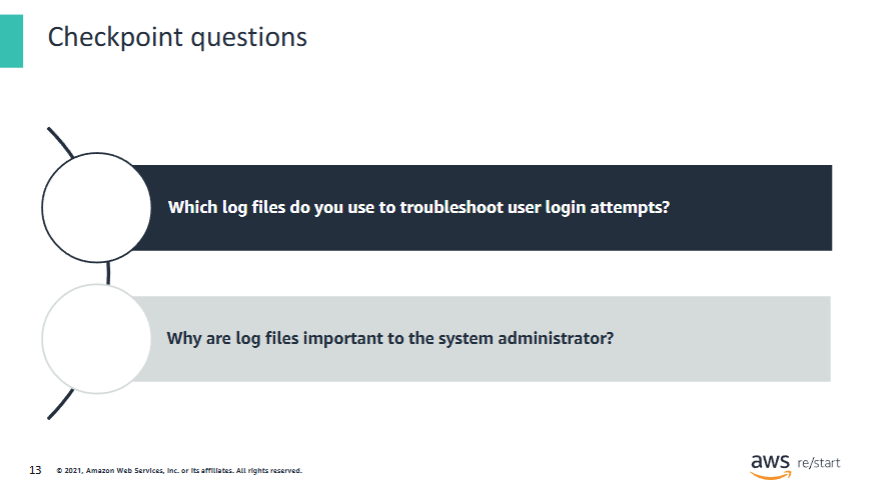

1. You use either `/var/log/auth.log` or `/var/log/secure`, depending on whether the system is **Debian-derived** or **Red Hat-derived**.

2. Log files are **running records** of what is occurring on a system.  
   These records include:
   - **Authentication**
   - Logs from **programs**
   - Status of **services**
   - Many other **server events**

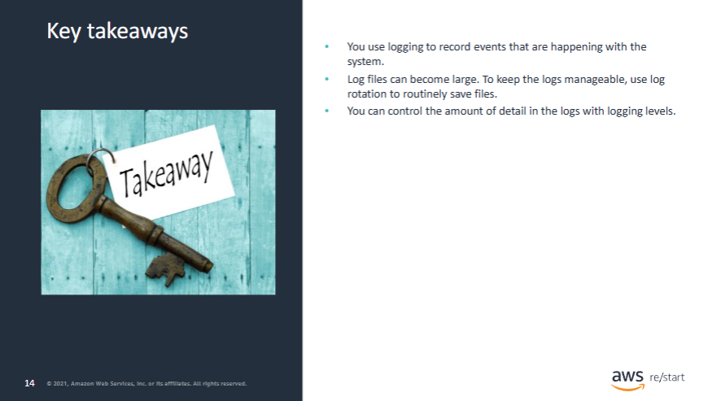

### Key takeaways from this lesson include:

- You use **logging** to record events that are happening with the system.

- **Log files can become large**.  
  To keep logs manageable, use **log rotation** to routinely archive and save log files.

- You can control the **amount of detail** in the logs using **logging levels**.
